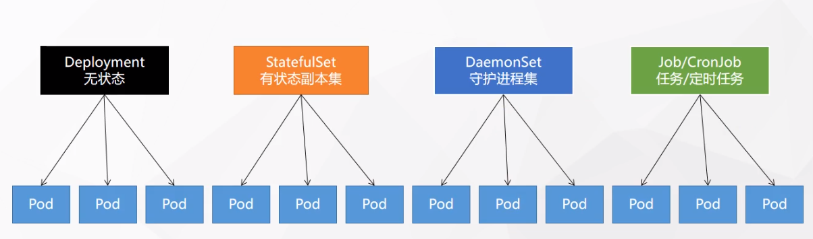

# Kubernetes（K8S）

## 什么是 Kubernetes

- 容器编排系统
- 特性
  - 服务发现和负载均衡
  - 存储编排
  - 自动部署和回滚
  - 自动完成装箱计算
  - 自我修复
  - 秘钥与配置管理

## 架构

### 1. 工作方式

- kubernetes Cluster = N Master Node + N Worker Node
  - K8S 集群由 n 个主节点和 n 个工作节点在组成（n > 1）
  - 有多个（一般是奇数个） master 节点时，遵循多数票原则（少数服从多数原则）选取领导 master 节点

### 2. 组件架构


- 各组件解释：
  - [Kubernetes 组件 | Kubernetes](https://kubernetes.io/zh-cn/docs/concepts/overview/components/)

## kubernetes实战

### 搭建 kubernetes 集群

1. 多台服务器

2. 安装 docker

   1. 安装 kubelet

   2. 安装 kubectl

      - 相关命令

        ```shell
        #查看集群所有节点
        kubectl get nodes 
        
        #根据配置文件给集群创建资源（例如创建网络插件）
        kubectl apply -f xxxx.xml
        
        #查看集群部署了哪些应用
        kubectl get pos -A  #等价于 docker ps ，pos 等价于 docker 中的容器
        ```

   3. 安装 kubeadm

      - 使用 docker 分别给 master 节点和 worker 节点安装需要的镜像

      - 搭建集群相关命令
        - `kubeadm init`：初始化 master 节点

          ```shell 
          #所有机器添加master域名映射，以下需要修改为自己的
          echo "172.31.0.4 cluster-endpoint">> /etc/hosts
          
          #主节点初始化
          kubeadm init\
          --apiserver-advertise-address=172.31.0.4\
          --control-plane-endpoint=cluster-endpoint\
          --image-repository registry.cn-hangzhou.aliyuncs.com/lfy_k8s_images\
          --kubernetes-version v1.20.9\
          --service-cidr=10.96.0.0/16\
          --pod-network-cidr=192.168.0.0/16
          ```

        - `kubeadm join`：子节点加入集群

### K8S 自我修复功能

- 应用宕机了会自动重启

### 解决子节点加入集群令牌过期

- 使用命令重新生成加入集群令牌

  ```bash
  kubeadm token create --print-join-command
  ```

### 部署 k8s 可视化界面（dashboard）

- github 仓库
  
- [kubernetes/dashboard: General-purpose web UI for Kubernetes clusters (github.com)](https://github.com/kubernetes/dashboard)
  
- 部署（在 master 节点进行部署）

  ```bash
  kubectl apply -f https://github.com/kubernetes/dashboard/blob/v2.7.0/aio/deploy/recommended.yaml
  ```

#### 在 dashboard 中创建资源（namespace、pod等）

- 在 dashboard  上传相关资源的 .yaml 配置文件即可

### 工作负载

#### NameSpace

- 名称空间用于隔离资源

  ```shell
  kubectl create ns hello #创建名称空间
  kubectl delete ns hello #删除名称空间
  ```

#### Pod

- 运行中的一组（一个或多个）容器（docker容器），Pod 是 kubernetes 中应用的最小单位

- K8S 会为每个 Pod 分配一个  IP，通过访问 IP+端口的方式即可访问运行的 Pod（只能内网访问，`curl`）

  ```shell
  kubectl get pod [-owide] #查看 default 名称空间下的 pod,-owide 查看更详细的 pod 信息
  kubectl get pos -A
  kubectl run mynginx --cloud_native=nginx #创建pod，类似于docker run
  kubectl describe pod mynginx #输出 pod 的描述信息
  kubectl logs [-f] mynginx #查看 pod 日志，-f 阻塞式追踪日志
  kubectl delete pod mynginx # 删除 pod
  kubectl exec -it mynginx -- /bin/bash #进入 pod 内部的控制台
  ```

- 多容器 Pod 
  - 可以在 Pod 配置文件中指定多个 image，然后再通过`kubectl apply -f  xxx.yaml`命令执行配置文件创建多容器 Pod
  - 一个 pod 里面的多个容器不能占用同一个端口，不然无法创建 Pod

#### Deployment

- 控制 Pod，使 Pod 拥有多副本，自愈，扩缩容等能力

  - 自愈能力：删除 Deployment 控制的 Pod 后，会自动创建新的 Pod，因此 Deployment 控制的 Pod 不怕崩溃和宕机
    - 直接删除 Deployment 则 Pod 不会拥有自愈能力
  - 多副本能力：`--replicas` 指定副本数量，可以启动多个 Pod，并由 Deployment 控制
  - 扩缩容能力（缩放）：增加或减少 Pod 的数量
  - 自愈&故障转移：若某个 pod 中的容器宕机或者崩溃了，k8s 会重启该 Pod；若某台子节点服务器关机了，则该台服务器中的 Pod 会转移至其他节点服务器中启动
  - 滚动更新：若需要更新 Pod 中容器的版本，会先启用新版本的 Pod，再关闭老版本的 Pod
  - 版本回退：回退到指定历史版本

  ```shell
  kubectl get deploy # 查看 Deployment
  kubectl create deployment mytomcat --cloud_native=tomcat:8.5.68 --replicas=3 #创建 Deployment
  kubectl scale deployment/mytomcat --replicas=5 #扩容 pod 数量由 3 至 5
  kubectl set cloud_native deployment/mytomcat tomcat:8.5.68=tomcat:8.5.69 --record #滚动更新
  kubectl rollout history deployment/mytomcat #查看版本历史记录
  kubectl rollout undo deployment/mytomcat --to-reversion=1 #回退指定版本
  kubectl delete mytomcat #删除 Deployment
  ```

#### 其他工作负载



- Deployment：无状态应用部署，比如微服务，提供多副本等功能
- StatefulSet：有状态应用部署，比如 redis，提供稳定的存储、网络等功能
- DaemonSet：守护型应用部署，比如日志收集组件，在每个机器都运行一份
- Job/CronJob：定时任务部署，比如垃圾清理组件，可以在指定时间运行
- 参考文档：[工作负载资源 | Kubernetes](https://kubernetes.io/zh-cn/docs/concepts/workloads/controllers/)

### 服务网络

#### Service

- 负责 Pod 的**服务发现（会依据 pod 的缩放动态发现 pod 服务）**和**负载均衡**

- 暴露 deploy 生成 service 

  ```shell
  kubectl expoes deploy mytomcat --port=8080 --target-port=8080 [--type=ClusterIp] # 对外暴露 service，暴露后会生成一个新的 service 的 IP 地址，--port 指定访问 service 的端口，--target-port 指定 pod 中容器服务的端口,--type 指定service 类型，默认 ClusterIp 类型
  ```

  - ClusterIp 类型（集群 IP）：只能集群内 pod 之间互相访问服务
  
- NodePort 类型（节点端口）：集群外也可以访问服务
  
  - 会自动为每个节点服务器随机分配一个端口映射至service 的端口（随机在 30000 - 32767 中分配，可提前添加该安全组）
  
- service 访问方式
  
    -  IP:Port 方式访问
  
    ```shell
      curl IP:Port
    ```
  
    - 域名方式访问
    
      -  这方式访问需要在 pod 内部才能访问 service
      
      ```shell
      # 服务名.所在名称空间.svc:port 
      curl mytomcat.default.svc:8080
      ```

#### Ingress（入口）

- service 的统一网关入口

- 用 NGINX 做的（除了 NGINX Ingress Controller，Kubernetes 社区还支持其他多个 Ingress 控制器，如 Traefik、HAProxy 等。你可以根据你的需求选择不同的 Ingress 控制器。）

- 安装 ingress

  ```sh
  kubectl apply -f https://raw.githubusercontent.com/kubernetes/ingress-nginx/main/deploy/static/provider/cloud/deploy.yaml
  ```

- 相关用法

  - 路径重写、限流等
  - 参考文档
    - https://kubernetes.github.io/ingress-nginx/examples/

### 存储抽象

- 相关技术
  - Glusterfs
  - NFS（网络文件系统）
    - NFS是网络文件系统，英文全称为Network File System，它允许网络中的计算机之间通过TCP/IP网络共享文件或目录，达到多个服务器文件同步的目的。
  - Cephfs

#### NFS 网络文件系统搭建

1. 给每一个节点服务器安装 NFS 工具
    ```sh
    yum install -y nfs-utils
    ```
2. 在主节点（master 节点）配置 nfs 服务器
    ```sh
    # 在主节点暴露 /nfs/data/ 目录，且所有服务器德普可以同步该目录（* 表示所有服务器，insecure 以表示非安全方式，rw 表示以读写方式，sync 表示同步目录）
    echo "/nfs/data/ *(insecure,rw,sync,no_root_squash)" > /etc/exports
    # 创建 /nfs/data/ 文件夹
    mkdir -p /nfs/data/
    # 启动 rpc 远程绑定服务，--now 等价于 enable + start
    systemctl enable rpcbind --now
    # 启动 nfs 服务器
    systemctl enable nfs-server --now
    # 配置生效
    exports -r
    ```
3. 配置从节点同步主节点目录
    ```sh
    # 查看主节点可同步的目录
    showmount -e 主节点IP
    # 创建 /nfs/data/ 文件夹
    mkdir -p /nfs/data/
    # 将主节点暴露的目录与单前服务器的目录进行挂载（同步）
    mount -t nfs 主节点IP:/nfs/data/ /nfs/data/
    ```


  4. 将目录与 pod 挂载

     1. 原生方式挂载

        - 缺点，删除 Deployment 后目录依然存在，且无法配置挂载目录的容量空间大小

          ```yaml
          apiVersion: apps/v1
          kind: Deployment
          metadata:
          	labels:
          		app: nginx-pv
          	name: nginx-pv
          spec :
          	replicas: 2
          	selector:
          		matchLabels:
          			app: nginx-pv
          	template:
          		metadata:
          			labels :
          				app: nginx-pv
          		spec :
          			containers:
          			-   image: nginx
          			    name : nginx
          			    volumeMounts :
          				- name: html
          				  mountPath: /usr/share/nginx/html
          			volumes:
          			-   name: html
          			    nfs:
          					server: 启动 nsf 的服务器IP
          					path: /nfs/data/nginx-pv
          ```

          ```bash
          # 应用上述 yaml
          kubectl apply -f 上面的yaml文件
          ```

#### 通过 PV 和 PVC 挂载

- PV: PersistentVolume 持久卷

  ```bash
  #查看 pv
  kubectl get PV
  ```

- PVC: PersistentVolumeClaim 持久卷声明

  ```bash
  #查看 pvc
  kubectl get PVC
  ```

- 可配置挂载目录的容量空间大小，删除 deployment 即可删除 PVC 并同步删除 deployment 对应挂载的数据

  - 静态供应容量(手動分配 PV 容量)
  - 动态供应容量(自動分配 PV 容量)

  1. 创建 PV  池（静态供应容量）

     ```shell
     #nfs主节点，创建持久卷目录
     mkdir -p /nfs/data/01
     mkdir -p /nfs/data/02
     mkdir -p /nfs/data/03
     ```

     創建 PV (yaml 文件)

     ```yaml
      apiVersion: v1
      kind: PersistentVolume
      metadata:
        name: pv01-10m
      spec :
        capacity: 
          storage: 10M
        accessModes:
          - ReadWriteMany
        storageClassName: nfs
        nfs: 
          path: /nfs/data/01
          server: 启动 nsf 的服务器IP
      ---
      apiVersion: v1
      kind: PersistentVolume
      metadata:
        name: pv02-1gi
      spec :
        capacity: 
          storage: 1Gi
        accessModes:
          - ReadWriteMany
        storageClassName: nfs
        nfs: 
          path: /nfs/data/02
          server: 启动 nsf 的服务器IP
      ---
                    apiVersion: v1
      kind: PersistentVolume
      metadata:
        name: pv03-3gi
      spec :
        capacity: 
          storage: 3Gi
        accessModes:
          - ReadWriteMany
        storageClassName: nfs
        nfs: 
          path: /nfs/data/03
          server: 启动 nsf 的服务器IP
     ```

     ```bash
      # 应用上述 yaml
      kubectl apply -f 上面的yaml文件
     ```

  2. 创建 PVC （pvc 與 pv 進行綁定）

     ```yaml
      apiVersion: v1
      kind: PersistentVolumeClaim
      metadata:
        name: nginx-pvc
      spec :
        accessModes:
          - ReadWriteMany
        resource:
          requests:
            storage: 200Mi
        storageClassName: nfs
     ```

  3. deployment 綁定 PVC

     ```yaml
     apiVersion: apps/v1
     kind: Deployment
     metadata:
       labels:
         app: nginx-deploy-pvc
       name: nginx-deploy-pvc
     spec:
       replicas: 2
       selector:
         matchLabels:
           app: nginx-deploy-pvc
       template:
         metadata:
           labels :
             app: nginx-deploy-pvc
         spec:
           containers:
           - image: nginx
             name: nginx
             volumeMounts:
             - name: html
               mountPath: /usr/share/nginx/html
           volumes:
           - name: html
             persistentVolumeClaim:
             claimName: nginx-pvc
     ```

#### ConfigMap（挂载配置文件）

- 抽取應用配置，並可以自動更新 

  > 更新后配置值未更改，因为需要重新启动 Pod 才能从关联的 ConfigMap 中获取更新的值 
  >
  > 原因:我们的 Pod 部署中间件自己本身没有热更新能力

  - 將配置文件創建為 ConfigMap
      ```bash
      kubectl create cm ConfigMap名稱 --from-file=配置文件
      #例
      kubectl create cm redis-conf --from-file=redis.confs
      # 查看 configMap ，存放在 k8s 的 etcd 目录下
      kubectl get cm redis-conf -oyaml
      # 修改 configMap 内容
      kubectl edit cm redis-conf
      ```

  - 將 pod 的配置文件與 ConfigMap 進行掛載

    ```yaml
    apiVersion: v1
    kind: Pod
    metadata:
    	name: redis
    spec:
    	containers:
    	- name: redis
    	  image: redis
    	  command:
    		- redis-server
    		- "/redis-master/redis.conf" #指的是redis容器内部的位置"/redis-master/redis.conf"
    	  ports:
    	  - containerPort: 6379
    	  volumeMounts:
    	  - mountPath: /data
    		name : data
    	  - mountPath: /redis-master
    	  name: config
    	volumes:
    	  - name: data
    		emptyDir:{}
    	  - name: config
    		configMap:
    			name: redis-conf
    			items:
    			- key: redis.conf
    			  path: redis.conf
    ```

#### Secret

- Secret 对象类型用来保存敏感信息，例如密码、OAuth 令牌和 SSH 密。将这些信息放在 secret 中比放在 Pod 的
  定义或者 容器镜像 中来说更加安全和灵活。

  > 例如：
  >
  > 在 k8s 中需要从公司镜像网站中拉取镜像，一般需要密码验证才能拉取，Secret 的作用就是可以保存此类密码，配置一次后续就无需再手动登录进行拉取

- 创建 secret

  ```bash
  ###命令格式
  kubectl create secret docker-registry regcred \ # regcred 值 secret 创建后的名称
  --docker-server=<你的镜像仓库服务器> \
  --docker-username=<你的用户名> \
  --docker-password=<你的密码> \
  --docker-email=<你的邮箱地址> 
  
  #例如
  kubectl create secret docker-registry lhk-docker-secret \
  --docker-username=lhk \
  --docker-password=123456 \
  --docker-emai1=212792772@qq.com
  ```

- 使用 secret

  ```yaml
  apiVersion: v1
  kind: Pod
  metadata:
  	name: private-nginx
  spec :
  	containers :
  	- name: private-nginx
  	  image: lhk/privateNginx:v1.0
  	imagePullSecrets:
  	- name: lhk-docker-secret
  ```

  