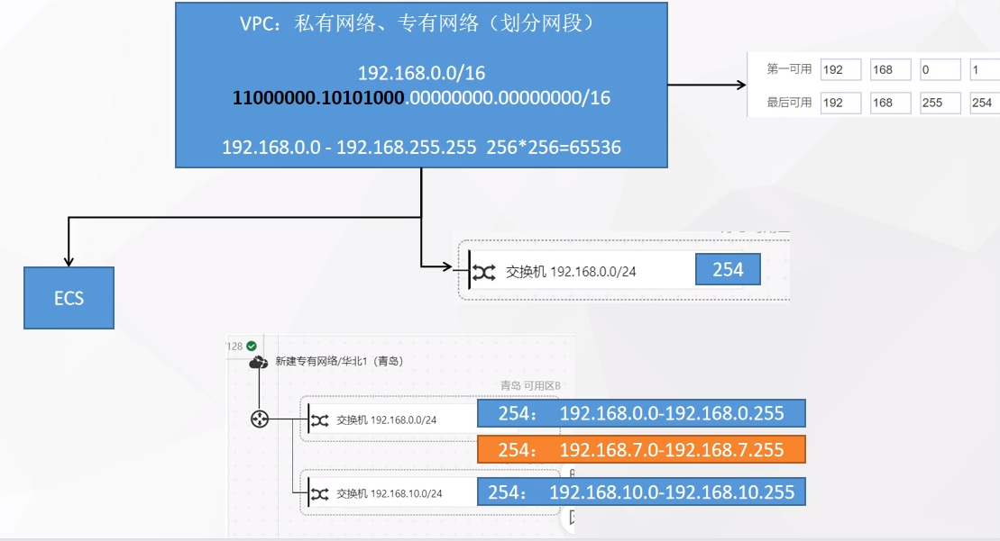

# 学习路线
**K8S ——> docker ——> kubeSphere ——> DevOps**

## 相关概念
### 云平台
- 云平台特性
  - 环境统一
  - 按需付费
  - 即开即用
  - 稳定性强
- 分类
  - 公有云
  - 私有云
- 常见云平台
  - 阿里云、腾讯云、百度云、华为云、青云
  - AWS（亚马逊）、Azure（微软）
- 概念
  - 安全组
    
    - 云服务器的防火墙相关的端口设置
    
  - VPC（专有网络、私有网络）
  
    - 划分网段
      - 每个 VPC 分配一个网段
        - 每个网段可以通过交换机分配多个子网域
    - 不同 VPC 下的网络相互隔离，即一个 VPC 下的 IP 无法 ping 同另一个 VPC 下的 IP
    - 同一个 VPC 下的 IP 可以相互 ping 通
  
    

## [Docker](../category/docker)

## [kubernetes(K8S)](../CloudNative/K8S)

## [DevOps](../CloudNative/devops)

