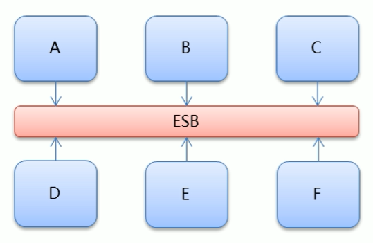
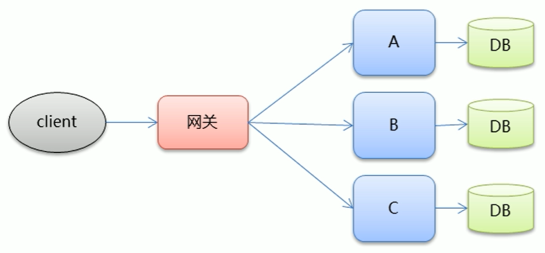
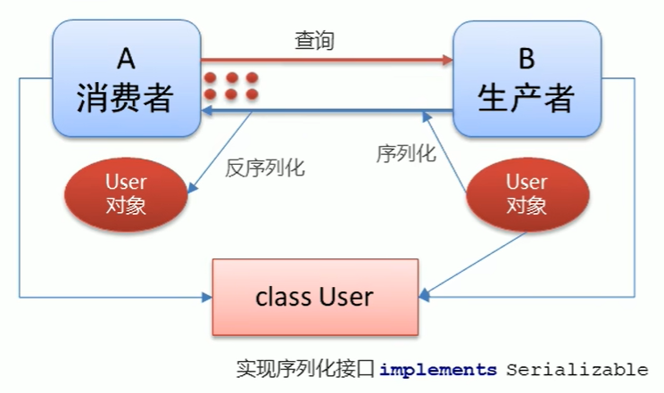

# Apache Dubbo 入门

## 一、大型互联网项目架构

### 传统项目和互联网项目

- 传统项目：OA、HR、CRM 等系统，to b
  - 用户量不多，并发不多
  - 用户多为企业员工，忍耐度高
- 互联网项目：淘宝、微信、百度等，to c
  - 用户量大，高并发
  - 用户多为广大人群，忍耐度低，因此需要提高用户体验
  - 海量数据
  - 易受攻击
  - 功能繁琐
  - 变更快
- 用户体验：美观、功能、速度、稳定性

### 大型互联网项目架构目标

- 衡量网站的性能指标
  - **响应时间**：指执行一个请求从开始到最后收到响应数据所花费的总体时间
  - **并发数**：指系统同时能处理的请求数量
    - **并发连接数**: 指的是客户端向服务器发起请求，并建立了 TCP 连接。每秒钟服务器连接的总 TCP 数量
    - **请求数**: 也称为 QPS(Query Per Second) 指每秒多少请求
    - **并发用户数**: 单位时间内有多少用户吞吐量
  - **吞吐量**：指单位时间内系统能处理的请求数量
    - **QPS**: Query Per Second 每秒查询数。
    - **TPS**: Transactions Per Second 每秒事务数
      - 一个事务是指一个客户机向服务器发送请求然后服务器做出反应的过程。客户机在发送请求时开始计时，收到服务器响应后结束计时，以此来计算使用的时间和完成的事务个数。
  - **高性能**: 提供快速的访问体验
  - **高可用**: 网站服务一直可以正常访问
  - **可伸缩**: 通过硬件增加/减少，提高/降低处理能力
  - **高可扩展**: 系统间耦合低，方便的通过新增/移除方式，增加/减少新的功能/模块
  - **安全性**: 提供网站安全访问和数据加密，安全存储等策略
  - **敏捷性**: 随需应变，快速响应

### 集群和分布式

- 集群：很多“人”一起，干一样的事
  - 一个业务模块，部署在多台服务器上。
- 分布式：很多“人”一起，干不一样的事。这些不一样的事，合起来是一件大事
  - 一个大的业务系统，拆分为小的业务模块，分别部署在不同的机器上

### 架构演进

#### 单体架构

- 优点:
  - 简单，开发部署都很方便，小型项目首选
- 缺点:
  - 项目启动慢
  - 可靠性差
  - 可伸缩性差
  - 扩展性和可维护性差
  - 性能低

### 垂直架构

- 垂直架构是指将单体架构中的多个模块拆分为多个独立的项目。形成多个独立的单体架构

- 垂直架构存在的问题:
  - 重复功能太多

### 分布式架构

- 分布式架构是指在垂直架构的基础上，将公共业务模块抽取出来，作为独立的服务供其他调用者消费，以实现服务的共享和重用
- **RPC**: Remote Prqcedure Call 远程过程调用。有非常多的协议和技术来都实现了 RPC 的过程。比如: HTTP REST 风格，Java RMI 规范、WebService SOAP 协议、Hession 等等
- 分布式架构存在的问题:
  - 服务提供方一旦产生变更，所有消费方都需要变更

### SOA 架构

- **SOA**: (Service-Oriented-Architecture，面向服务的架构)是一个组件模型，它将应用程序的不同功能单元(称为服务)进行拆分，并通过这些服务之间定义良好的接口和契约联系起来。
- **ESB**: (Enterparise Servce Bus) 企业服务总线，服务中介。主要是提供了一个服务于服务之间的交互。ESB 包含的功能如: 负载均衡，流量控制，加密处理，服务的监控，异常处理，监控告急等等

### 微服务架构

- 微服务架构是在 SOA 上做的升华，微服务架构强调的一个重点是“业务需要彻底的组件化和服务化”，原有的单个业务系统会拆分为多个可以独立开发、设计、运行的小应用。这些小应用之间通过服务完成交互集成
- 微服务架构 = 80%的SOA服务架构思想 + 100%的组件化架构思想 + 80%的领域建模思想

- 特点:
  - 服务实现组件化:开发者可以自由选择开发技术。也不需要协调其他团队
  - 服务之间交互一般使用 RESTAPI
  - 去中心化: 每个微服务有自己私有的数据库持久化业务数据
  - 自动化部署: 把应用拆分成为一个一个独立的单个服务，方便自动化部署、测试、运维

## 二、Dubbo 简介

- Dubbo 是 SOA 时代的产物，SpringCloud 是微服务时代的产物
- Dubbo 是阿里巴巴开源的高性能分布式 RPC 服务治理框架
- Dubbo 提供了六大核心能力：
  1. 面向接口代理的高性能 RPC 调用
  2. 智能容错和负载均衡
  3. 服务自动注册和发现
  4. 高度可扩展能力
  5. 运行期流量调度：轻松实现灰度发布
  6. 可视化的服务治理与运维
  7. 功能强大。未来支持 Go、K8S 云原生等技术。代表着高性能微服务架构的发展方向

- Dubbo 服务治理框架总结：
  - SOA 架构解决架构的异构交互问题；
  - 可以实现不同语言直接功能接口的重用；
  - 普通的服务框架解决开发 Web 服务接口开发；
  - 服务注册+ 服务管理+ 服务发现+健康监控；
  - Dubbo 是一个分布式 RPC SOA 服务治理框架；
  - 致力于提供高性能和透明化的 RPC 远程服务调用方案；
  - 是阿里巴巴 SOA 服务化治理方案的核心框架；
  - 每天为 2,000+个服务；
  - 提供 3,000,000,000+次访问量支持；
  - 并被广泛应用于阿里巴巴集团的各成员站点。

- 具体查看官网：[Apache Dubbo](https://cn.dubbo.apache.org/zh-cn/)

## 三、Dubbo 快速入门

- [快速入门 | Apache Dubbo](https://cn.dubbo.apache.org/zh-cn/overview/mannual/java-sdk/quick-start/)

- 运行起 Dubbo 应用的一个大前提是部署一个注册中心
  - Zookeeper、nacos 等

- Dubbo 相关注解
  - `@Service`：标注类中的方法为远程调用的服务
    - 新版改为 `@DubboService`
  - `@Reference`：注入远程服务对象
    - 新版改为 `@DubboReference`

## 四、Dubbo 高级特性

### dubbo-admin

- [Admin 控制台操作手册 | Apache Dubbo](https://cn.dubbo.apache.org/zh-cn/overview/reference/admin/)

- dubbo-admin 管理平台，是图形化的服务管理页面从注册中心中获取到所有的提供者/消费者进行配置管理路由规则、动态配置、服务降级、访问控制、权重调整、负载均衡等管理功能
- dubbo-admin 是一个前后端分离的项目。前端使用 vue ，后端使用springboot

### dubbo 高级配置

#### 序列化

- 当两个服务传输对象时，则需要序列化与反序列化
  - dubbo内部已经将序列化和反序列化的过程内部封装了
  - 我们只需要在定义 pojo 类时实现 `Serializable` 接口即可
  - 一般会定义一个公共的 pojo 模块，让生产者和消费者都依赖该模块

#### 地址缓存

- 注册中心挂了，服务依然可以正常访问，因为 dubbo 服务消费者在第一次调用时，会将服务提供方地址缓存到本地，以后在调用则不会访问注册中心
- 但当服务提供者地址发生变化时，注册中心会通知服务消费者。

#### 超时与重试

- 超时
  - 服务消费者在调用服务提供者的时候发生了阻塞、等待的情形，这个时候，服务消费者会一直等待下去。
    - 在某个峰值时刻，大量的请求都在同时请求服务消费者，会造成线程的大量堆积，势必会造成雪崩。
  - dubbo利用超时机制来解决这个问题，设置一个超时时间，在这个时间段内，无法完成服务访问，则白动断开连接
    - 使用 `timeout` 属性配置超时时间，默认值1000，单位毫秒

- 重试
  - 设置了超时时间，在这个时间段内，无法完成服务访问，则自动断开连接
  - 如果出现网络抖动，则这一次请求就会失败
  - Dubbo 提供重试机制来避免类似问题的发生
    - 通过 retries 属性来设置重试次数。默认为 2次

- 例：`@Service(timeout=3000,retries=2)`

#### 多版本（服务分版本）

- 灰度发布
  - 当出现新功能时，会让一部分用户先使用新功能，用户反馈没问题时，再将所有用户迁移到新功能
- dubbo 中使用 version 属性来设置和调用同一个接口的不同版本
  - 例：
    - 服务提供者使用：`@DubboService(version=2.0)`
    - 服务消费者使用：`@DubboReference(version=2.0)`

#### 负载均衡

- 参考文档：[负载均衡 | Apache Dubbo](https://cn.dubbo.apache.org/zh-cn/overview/core-features/load-balance/)

- 使用案例：
  - `@DubboReference(loadbalance = "roundrobin")`

#### 集群容错

- 参考文档：[集群容错 | Apache Dubbo](https://cn.dubbo.apache.org/zh-cn/overview/mannual/java-sdk/advanced-features-and-usage/service/fault-tolerent-strategy/)

- 集群容错模式

  - Failover Cluster: 失败重试。
    - 默认值。当出现失败，重试其它服务器，默认重试2次，使用retries 配置。一般用于读操作

  - Failfast Cluster: 快速失败

    - 只发起一次调用，失败立即报错通常用于写操作

  - Failsafe Cluster: 失败安全

    - 出现异常时，直接忽略。返回个空结果

  - FailbackCluster:失败自动恢复

    - 后台记录失败请求，定时重发

  - Forking Cluster: 并行调用多个服务器，只要一个成功即返回

    

#### 服务降级

- 参考文档：[服务降级 | Apache Dubbo](https://cn.dubbo.apache.org/zh-cn/overview/mannual/java-sdk/advanced-features-and-usage/service/service-downgrade/)