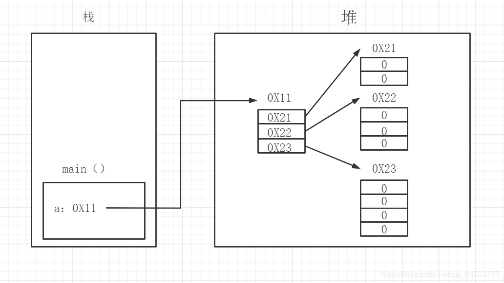

# Java 数组

## 数组的定义
- 数组的定义：
  - 数组是相同类型的元素组成的有序集合
  - 数组中每一个元素可以通过索引来访问
- 数组的特点：
  - 长度是确定的，数组一旦创建就不能修改其长度
  - 元素的类型是相同的，不允许存储不同类型的元素
  - 数组类型可以使任何数据类型，包括基本类型和引用类型
  - 数组变量属于引用类型，数组也是对象
- 数组的两种声明方式：
  ```java
  type[] arrayName; //推荐使用这种方式声明
  type arrayName[];
  ```
  - 声明数组的时候数组并没有真正的被创建
  - 构造一个数组必须指定长度
  - 声明的时候并没有实例化任何对象，只有在实例化数组对象时，JVM才分配空间，这时才与长度有关
  - 数组也是对象，数组中的元素相当于对象中的属性

## 数组的初始化
1. 默认初始化：
   - 整形数组由系统默认初始化为`0`
   - 浮点型数组由系统默认初始化为`0.0`
   - 布尔型数组由系统默认初始化为`false`
   - 引用类型由系统默认初始化为`null`

    ```java
    int[] arr= new int[10];//系统默认初始化为0
    ```

2. 静态初始化：
   - 静态初始化需要在声明后直接初始化
    ```java
    int[] a={1,2,3};//基本数据类型数组静态初始化
    Student[] std={new Student(),new Student()};//引用类型数组静态初始化
    ```

3. 动态初始化
   - 根据索引直接赋值

    ```java
    int[] arr= new int[5];//确定数组长度，默认初始化数组
    arr[0]=1;
    arr[4]=4;//动态初始化数组元素
    ```

## 数组的遍历
- 数组元素下标的合法区间：`[0,length-1]`
- 可以通过下标来遍历数组中的元素
- `for-each` 是 JDK1.5 新增的功能，专门用于遍历集合或数组中的元素
  - `for-each` 增强 for 循环在遍历数组过程中不能修改数组元素，只能读取数组元素
  - `for-each` 仅适用于遍历，不涉及有关索引的操作

```java
//遍历数组
		for(int i=0;i<stu.length;i++){
			System.out.println(stu[i]);//如果未重写toString方法，输出数组的字节码信息
		}
		
		//增强for循环遍历数组stu1（用于读取元素的值），无法操作索引
		for(Students stu2:stu1){
			System.out.println(stu2);
		}
		//增强for循环等价于如下for循环
		for(int i=0;i<stu1.length;i++){
			Students stu2=stu1[i];
			System.out.println(stu2);
		}
```


## 数组的拷贝
- System 类里也包含了一个 `static void arraycopy(object src,int srcpos, objectdest， int destpos，int length)`方法
- 该方法可以将 src 数组里的元素值赋给 dest 数组的元素
    - srcpos 指定从 src 数组的第几个元素开始赋值，
    - length 参数指定将 src 数组的多少个元素赋给 dest 数组的元素

```java
/**
 * 测试数组拷贝，
 * @author TheMutents
 *
 */
public class Array_Test_01 {
	public static void main(String args[]){
		String[] s=new String[5];
		String[] ss={"The","Mutents","is","the","writter"};
		
		System.arraycopy(ss,0,s,0,5);//System类下的方法，该方法为静态方法，用来拷贝数组
		
		for(int i=0;i<s.length;i++){
			System.out.println(s[i]+"\t");
		}
	}
}
```

- JDK 提供的 `java.util.Arrays` 类，包含了常用的数组操作，方便我们日常开发。
  - Arrays类包含了:排序、查找、填充、打印内容等常见的操作。

```java
import java.util.Arrays;

/**
 * 测试java.util.Array类（操作数组的工具类）
 * 该类包含了排序、排序、填充、打印内容等常见操作
 * @author Lhk
 */
public class Array_Util_Class {
	public static void main(String args[]){
		int [] a={145,151,130,110,160};
		
		System.out.println(Arrays.toString(a));//打印数组的内容，此处toString()方法为Arrays的静态方法，与Object类的toString()方法不同
		Arrays.sort(a);//Arrays类的排序方法
		System.out.println(Arrays.toString(a));
		Arrays.fill(a, 1, 3, 115);//Arrays类的填充方法，填充位置为（1,3-1）
		System.out.println(Arrays.toString(a));
		
		//测试二分法查找
		int[] b={123,221,156,143,178,226};
		Arrays.sort(b);//使用二分法查找前必须先对数组进行排序
		System.out.println(Arrays.binarySearch(b, 156));//查找115，返回115的索引位置
	}
}

```

## 多维数组
- 多维数组可以看成以数组为元素的数组。
- 可以有二维、三维、甚至更多维数组，但是实际开发中用的非常少,最多到二维数组
- 在实际开发中，一般使用容器更多
- 内存分析图
  
- 二维数组的声明
    ```java
    public class Array_Tow {
        public static void main(String args[]){
            //二维数组的声明，Java中多维数组的声明应该从低维到高维的顺序进行
            int[][] a=new int[3][];//先声明一维部分
            a[0]=new int[2];  //声明二维部分，int类型默认初始化为0
            a[1]=new int[3];
            a[2]=new int[4];
            
            for(int i=0;i<3;i++){
                System.out.println(Arrays.toString(a[i]));//遍历数组a[][]
            }
            
        }
    }
    ```

- 多维数组的静态初始化
    ```java
            //多维数组的静态初始化
            int[][] b={{1,2,3},{4,5},{6,7,8,9}};
            for(int i=0;i<b.length;i++){
                System.out.println(Arrays.toString(b[i]));//遍历数组b[][]
            }    
    ```

- 多维数组的动态初始化

    ```java
            //多维数组的动态初始化
            int[][] c=new int[3][];   //int[][] c=new int[][3]为非法声明
            c[0]=new int[]{1,2,3};
            c[1]=new int[]{4,5};
            c[2]=new int[]{6,7,8,9};
            for(int i=0;i<c.length;i++){
                System.out.println(Arrays.toString(c[i]));//遍历数组c[][]
            }
    ```
