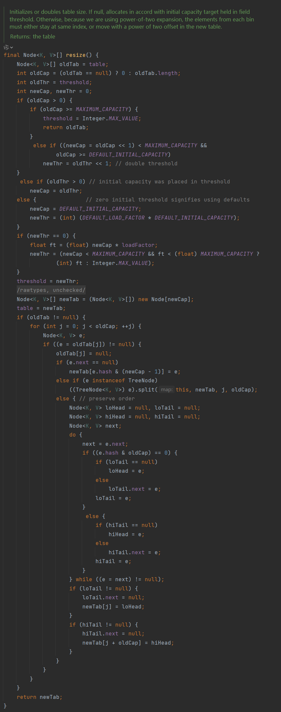

# Java 容器
## 容器
- 程序中的容器用来容纳和管理数据
- 实际上，数组就是一种容器，可以在其中放置对象或基本类型数据
  - 数组的优势:是一种简单的线性序列，可以快速地访问数组元素，效率高。如果从效率和类型检查的角度讲，数组是最好的。
  - 数组的劣势:不灵活。容量需要事先定义好，不能随着需求的变化而扩容。
    - 比如:我们在一个用户管理系统中，要把今天注册的所有用户取出来,那么这样的用户有多少个?我们在写程序时是无法确定的。因此，在这种情况就不能使用数组
- 基于数组并不能满足我们对于“管理和组织数据的需求”，所以我们需要一种更强大、更灵活、容量随时可扩的容器来装载我们的对象。这就是容器(Collection)，也称之为集合
- Java中很多的容器在底层就是使用数组来实现的
- 容器对数据的存储是基于内存层面，即数据会存储在内存中（临时存储），不是存储在磁盘中

## 容器的结构
- 结构图
  
- 单例集合：将数据一个一个的进行存储
  - List接口：存储有序，允许重复，相当于动态数组
  - Set接口：存储无序，不可重复，类似于数学上集合的特性

  
- 双例集合：基于Key与Value的结构存储数据（类似于数学上的函数）
  

## 单例集合
### Collection 接口
- 接口中的抽象方法

  | 方法                              | 说明                                            |
  | --------------------------------- | ----------------------------------------------- |
  | booleanadd(Object element)        | 增加元素到容器中                                |
  | boolean remove(Object element)    | 从容器中移除元素                                |
  | boolean contains(Object element)  | 容器中是否包含该元素                            |
  | int size()                        | 容器中元素的数量                                |
  | boolean isEmpty()                 | 容器是否为空                                    |
  | void clear()                      | 清空容器中所有元素                              |
  | Iterator iterator()               | 获得迭代器，用于遍历所有元素                    |
  | boolean containsAll(Collection c) | 本容器是否包含 c 容器中的所有元素               |
  | boolean addAll(Collection c)      | 将容器 c 中所有元素增加到本容器                 |
  | boolean removeAll(Collection c)   | 移除本容器和容器 c 中都包含的元素               |
  | boolean retainAll(Collection c)   | 取本容器和容器 c 中都包含的元素，移除非交集元素 |
  | Object[] toArray()                | 转化成 Object 数组                              |

### List 接口
- 特点
  - 有序:有序(元素存入集合的顺序和取出的顺序一致)。List 中每个元素都有索引标记。可以根据元素的索引标记(在 List 中的位置)访问元素，从而精确控制这些元素
  - 可重复: List 允许加入重复的元素。更确切地讲，List 通常允许满足 `e1.equals(e2)` 的元素重复加入容器
- List接口的常用方法：
  - 除了继承了 Collection 接口中的方法以外，List还多了一些跟顺序（索引）有关的方法：

    | 方法                                  | 说明                                           |
    | ------------------------------------- | ---------------------------------------------- |
    | void add (int index, Object element)  | 在指定位置插入元素，以前元素全部后移一位       |
    | Object set (int index,Object element) | 修改指定位置的元素                             |
    | Object get (int index)                | 返回指定位置的元素                             |
    | Object remove (int index)             | 删除指定位置的元素，后面元素全部前移一位       |
    | int indexOf (Object o)                | 返回第一个匹配元素的索引，如果没有该元素返回-1 |
    | int lastindexOf (Object o)            | 返回最后一个匹配元素的索引，如果没有该返回-1   |

### ArrayList 容器类
- ArrayList 是 List 接囗的实现类。是 List 存储特征的具体实现
- ArrayList 底层是用数组实现的存储
  - 特点:查询效率高，增删效率低，线程不安全

```java
/**
 * ArrayList 容器的相关方法
 */
import java.util.ArrayList;
import java.util.List;

public class ArrayList_Test01 {
	public static void main(String[] args) {
	//实例化ArrayList容器，引用使用接口List类型定义
	//面向对象编程又称为面向接口编程
	List<String> list=new ArrayList<>();
	
	//在容器中增加元素
	System.out.println("---------增加元素--------");
	boolean falg1=list.add("TheMutents");//返回一个布尔值
	System.out.println(falg1);
	list.add("QQ is");
	list.add(2, "212792772");//在指定的索引位置添加元素，任何后续元素后移一位（索引的数值不能大于元素个数）
	output(list);
	System.out.println(list.size());//返回元素个数
	System.out.println(list.get(2));//获取指定索引位置的元素（当索引<0或者索引>=size()时会出现数组下标越界异常）
	
	//删除元素
	System.out.println("---------删除元素--------");
	System.out.println(list.remove(1));//删除指定索引位置的元素，并返回该元素，后续元素左移一位
	output(list);
	
	System.out.println(list.remove("212792772"));//删除指定元素，返回一个布尔值,指定元素不存在时返回false
	output(list);
	
	//替换元素
	System.out.println("-------替换元素-----------");
	System.out.println(list.set(0, "212792772"));//替换指定索引位置元素，返回被替换元素
	output(list);
	
	//清空容器
	System.out.println("---------清空容器--------");
	list.clear();//清空容器，返回值为void类型
	System.out.println(list.size());
	
	System.out.println("---------判断容器是否为空--------");
	System.out.println(list.isEmpty());//容器为空返回true，否则返回false
	
	System.out.println("---------判断容器是否包含指定元素--------");
	list.add("themutents");
	list.add("qq is");
	list.add("212792772");
	System.out.println(list.contains("212792772"));//容器中包含指定元素返回true，否则返回false
	output(list);
	
	System.out.println("---------查找元素的位置--------");
	list.add("themutents");
	output(list);
	System.out.println(list.indexOf("themutents"));//返回元素在容器中第一次出现的索引位置，元素不存在则返回-1
	System.out.println(list.lastIndexOf("themutents"));//返回元素在容器中最后一次出现的索引位置，元素不存在则返回-1
	
	System.out.println("---------将单例集合转换为数组--------");
	output(list);
	
	System.out.println("--------------将单例集合转换为Object[]-----------------");
	//将ArrayList转换为Object[].但是不能将转换的Object[]做强制类型转换
	Object[] obj= list.toArray();//这里不能进行强制类型转化
	for(int i=0;i<obj.length;i++){
		String str1=(String)obj[i];//将obj数组里面每一个元素强转成String
		System.out.println(str1);
	}
	
	System.out.println("--------------将单例集合转换为指定类型数组-----------------");
	//可以将单例集合转化为指定类型数组.但是类型需要参考泛型中的类型
	String[] str2=list.toArray(new String[list.size()]);
	for(int i=0;i<obj.length;i++){
		System.out.println(str2[i]);
	}
	
	System.out.println("--------------ArrayList容器的并集操作-----------------");
	List<String> l1=new ArrayList<>();
	l1.add("a");
	l1.add("b");
	l1.add("c");
	List<String> l2=new ArrayList<>();
	l2.add("c");
	l2.add("d");
	l2.add("e");
	//l1与l2的并集，且l2容器不能为空
	System.out.println(l1.addAll(l2));//返回一个布尔类型的值，并集成功返回true，否则返回false
	//增强for循环遍历并集后的容器l1
	for(String str:l1){
		System.out.println(str);//这里的l1容器可以有重复的元素
	}
	
	System.out.println("--------------ArrayList容器的交集操作-----------------");
	List<String> l3=new ArrayList<>();
	l3.add("a");
	l3.add("b");
	l3.add("c");
	List<String> l4=new ArrayList<>();
	l4.add("c");
	l4.add("d");
	l4.add("e");
	//l3与l4的交集操作
	System.out.println(l3.retainAll(l4));//返回一个布尔类型的值，交集成功返回true，否则返回false
	//增强for循环遍历并集后的容器l3
		for(String str:l3){
			System.out.println(str);
			}

	//差集：属于A且不属于B的集合
	System.out.println("--------------ArrayList容器的差集操作-----------------");
	List<String> l5=new ArrayList<>();
	l5.add("a");
	l5.add("b");
	l5.add("c");
	List<String> l6=new ArrayList<>();
	l6.add("c");
	l6.add("d");
	l6.add("e");
	//l5与l6的差集操作
	System.out.println(l5.removeAll(l6));//返回一个布尔类型的值，差集成功返回true，否则返回false
	//增强for循环遍历并集后的容器l5
		for(String str:l5){
			System.out.println(str);
			}
	}
	
	//循环遍历容器元素并打印
	static void output(List<String> e){
		for(int i=0;i<e.size();i++){
			System.out.print(e.get(i)+" ");
		}
		System.out.println();
	}
	
	/*
	static void output(List<String> e){
		Iterator<String> p=e.iterator();
		while(p.hasNext()){
			System.out.print(p.next()+" ");
		}
		System.out.println();
	}
	*/
}

```

- ArrayList 扩容机制
  - 通过分析 jdk1.8 ArrayList 的 `add()` 方法的底层源码
    - ArrayList 的扩容机制：延时初始化，以原来容量的1.5倍扩容
  
  
  
  
  
  
  

### Vector 容器类
- Vector 底层是用数组实现的，相关的方法都加了同步检查，因此“线程安全,效率低”
  - 比如，`indexOf()` 就增加了 `synchronized` 同步标记
```java
/**
 * 测试Vector
 */
import java.util.List;
import java.util.Vector;

public class Vector_Test {
	public static void main(String[] args) {
		List<String> v=new Vector<>();
		v.add("TheMutents");
		v.add("QQ is");
		v.add("212792772");
		
		for(int i=0;i<v.size();i++){
			System.out.println(v.get(i));;
		}
		
	}
}
```
- Vector 扩容机制
  - 通过分析 jdk1.8 Vector 容器的 `add()` 方法的部分底层源码
    - Vector 扩容机制：立即初始化，以原来容量的2倍进行扩容

  
  
  

### Stack容器
- Stack 栈容器,是 Vector 的一个子类,它实现了一个标准的后进先出(LIFO:Last In First Out) 的栈
- 特点
  - 后进先出。它通过5个操作方法对 Vector 进行扩展，允许将向量视为堆栈。

  | 方法                 | 说明                      |
  |-------------------------| --------------------------------------------- |
  | boolean empty()      | 测试如果这个栈是空的              |
  | E peek()             | 查看这个堆栈的顶部的对象，没有从堆栈中删除它  |
  | E pop()              | 删除这个堆栈的顶部的对象,并返回该对象的值函数 |
  | E push(E item)       | 把一个项目到堆栈的顶部             |
  | int search(Object o) | 返回基于位置的对象在这个堆栈          |

```java
/**
 * 测试Stack类中的相关方法
 */
import java.util.Stack;

public class Stack_Test {
		public static void main(String[] args) {
			//实例化对象，引用使用Stack类型，不用List类型，因为Stack类中除了实现List接口外还有属于自己的方法
			Stack<String> s=new Stack<>();
			System.out.println(s.empty());
			//将元素添加到栈中（压栈）
			System.out.println(s.push("212792772"));
			System.out.println(s.push("QQ is"));
			System.out.println(s.push("TheMutents"));//压栈并返回该元素
			
			//查看栈顶元素
			System.out.println(s.peek());
			
			//返回元素在栈中的位置(栈顶元素为1，栈的操作是从栈顶向下操作)
			System.out.println(s.search("TheMutents"));
			
			for(int i=s.size()-1;i>=0;i--){
				System.out.println(s.pop());//按后进先出顺序弹栈
			}
			
			System.out.println(s.empty());//判断栈是否为空，为空返回true，否则返回false
			
			System.out.println("-----------------------------");
			String str="...{....[...(..)...]....}...[...(..)...]...";
			symmetric(str);
		}
		
		
		//测试案例：使用栈容器判断括号的对称性
		static void symmetric(String str){
			 
			 Stack<String> stack=new Stack<>();//创建一个栈对象 
			 
			 //假设修正法
			 boolean flag=true;//true表示括号匹配，此处先假设括号匹配
			 
			 //先获取到字符串中的括号字符
			 for(int i=0;i<str.length();i++){
				 char c=str.charAt(i);
				 
				 //获取字符串的左括号元素，若获取到则向栈中压入右括号元素，否则栈为空
				 if(c=='{'){
					 stack.push("}");
				 }
				 if(c=='['){
					 stack.push("]");
				 }
				 if(c=='('){
					 stack.push(")");
				 }
				 
				 //获取到右括号元素，对括号进行匹配
				 if(c=='}'||c==']'||c==')'){
					 //若此时栈为空则说明字符串中未获取到左括号元素，未向栈中压入有括号元素
					 if(stack.empty()){
						 //括号不匹配，修正处理
						 flag=false;
						 break;
					 }
					 
					 String s=stack.pop();//弹出栈顶元素（String类型）
					 //判断弹出的右括号与获取到的有括号是否相同,相同这说明有与之匹配的左括号，否则则不匹配
					 if(s.charAt(0)!=c){
						 //修正处理
						 flag=false;
						 break;
					 }
				 }
			 }
			 
			 //若所有元素获取一遍后，栈中还有元素，则说明字符串最后存在多余左括号，括号不匹配
			 if(!stack.empty()){
				 //修正处理
				 flag=false;
			 }
			System.out.println(flag);
		}
}
```

### LinkedList 容器类
- LinkedList 底层用双向链表实现的存储。
  - 特点:查询效率低,增删效率高,线程不安全
  - 双向链表也叫双链表，是链表的一种，它的每个数据节点中都有两个指针，分别指向前个节点和后一个节点
    - 所以，从双向链表中的任意一个节点开始，都可以很方便地找到所有节点
    
- LinkedList 实现了 List 接口,所以 LinkedList 是具备 List 的存储特征的(有序,元素有重复)
- 除了实现了 List 接口，LinkedList 类还有下列方法（非 List 标准，对象引用使用 LinkedList 类型），是专门用来操作双向链表存储结构的方法

  | 方法               | 说明                                  |
  |-------------------------------------| ------------------------------------------------------ |
  | void addFirst(E e) | 将指定元素插入到开头                          |
  | void addLast(E e)  | 将指定元素插入到结尾                          |
  | getFirst()         | 返回此列表的第一个元素                         |
  | getLast()          | 返回此列表的最后一个元素                        |
  | removeFirst()      | 移除此列表中的第一个元素，并返回这个元素                |
  | removeLast()       | 移除此列表中的最后一个元素，并返回这个元素               |
  | E pop()            | 从此列表所表示的堆栈处弹出一个元素,等效于 removeFirst() |
  | void push(E e)     | 将元素推入此列表所表示的堆栈，这个等效于 addFisrt(E e)  |
  | boolean isEmpty()  | 判断列表是否包含元素，如果不包含元素则返回 true          |

```java
/**
 * 测试LinkedList的相关方法 
 */
import java.util.LinkedList;
import java.util.List;

public class LinkedList_Test {
		public static void main(String[] args) {
			List<String> link=new LinkedList<>();
			
			link.add("TheMutents");
			link.add("212792772");
			link.add("I love you!");
			
			for(int i=0;i<link.size();i++){
				System.out.println(link.get(i));
			}
			
			System.out.println("----------LinkedList------------");
			
			LinkedList<String> list=new LinkedList<>();
			list.addFirst("e");
			list.add("b");
			list.addFirst("a");
			list.addLast("c");
			
			for(String str:list){
				System.out.println(str);
			}
			
			System.out.println("---------获取头尾结点元素-----------");
			System.out.println(list.getFirst());
			System.out.println(list.getLast());
			
			
			System.out.println("--------删除头尾结点元素----------");
			list.removeFirst();
			list.removeLast();
			for(String str:list){
				System.out.println(str);
			}
			
			System.out.println("-------压入头结点--------");
			list.push("c");
			list.push("b");
			for(String str:list){
				System.out.println(str);
			}
			System.out.println("---------------弹出头结点-----------------");
			System.out.println("弹出的头结点元素："+list.pop());
			for(String str:list){
				System.out.println(str);
			}
			
			System.out.println("-----------判断链表是否为空--------------");
			System.out.println(list.isEmpty());
		}
}
```

- LinkedList 底层源码分析（双向链表实现存储）
  - `Node<E>` 类实现双向链表存储结构
  
    

  - LinkedList 的继承关系

    

  - LinkedList 的成员属性

    
    

### Set 接口
- Set 接口继承片自 Collection，Set 接口中没有新增方法，方法和 Collection 保持完全致
- Set 特点:无序、不可重复
  - 无序指 Set 中的元素没有索引，我们只能遍历查找
  - 不可重复指不允许加入重复的元素
    - 更确切地讲，新元素如果和 Set 中某个元素通过 `equals()` 方法对比为 true，则只能保留一个
- Set 常用的实现类有:`HashSet`、`TreeSet`等，我们一般使用 `HashSet`

### HashSet 容器类
- Hashset 是一个没有重复元素的集合，不保证元素的顺序。而且 Hashset 允许有 null 元素。
- Hashset 是采用哈希算法实现，底层实际是用 HashMap 实现的(Hashset 本质就是一个简化版的 HashMap)，因此，查询效率和增删效率都比较高
- HashSet 存储特征分析
  - Hashset 是一个不保证元素的顺序且没有重复元素的集合，是线程不安全的
  - Hashset允许有 null 元素。
  - 无序:
    - 在 Hashset 中底层是使用 HashMap 存储元素的。HashMap 底层使用的是数组与链表实现元素的存储。元素在数组中存放时，并不是有序存放的也不是随机存放的，而是对元素的哈希值进行运算决定元素在数组中的位置
  - 不重复:
    - 当两个元素的哈希值进行运算后得到相同的在数组中的位置时，会调用元素的`equals()`方法判断两个元素是否相同。如果元素相同则不会添加该元素，如果不相同则会使用单向链表保存该元素
    - HashSet 的不重复特点是要依赖于 `hashcode()` 和 `equals()` 方法
```java
import java.util.HashSet;
import java.util.Set;

public class HashSet_Test {
		public static void main(String[] args) {
			//实例化HashSet对象
			Set<String> set=new HashSet<>();
			
			//添加元素
			set.add("a");
			set.add("b");
			set.add("c");
			set.add("d");
			set.add("a");
			
			//获取元素，在Set容器中没有索引，索引没有对应的get(int index)方法
			//使用增强for循环来遍历Set容器
			for(String str:set){
				System.out.println(str);
			}
			
			//删除元素
			boolean flag=set.remove("b");
			System.out.println(flag);
			for(String str:set){
				System.out.println(str);
			}
			
			System.out.println(set.size());//元素个数
			
			System.out.println("------------HashSet存储自定义对象------------");
			//实例化Set容器对象
			Set<Users> set1=new HashSet<>();
			//实例化Users对象
			Users u1=new Users("Themutents",20);
			Users u2=new Users("Themutents",20);
			//未改写hashCode()方法时,得到的hash值不一样,此时u1、u2都存入了set1容器中;重写hashCode()和equals()方法后则只能存一个
			System.out.println(u1.hashCode());
			System.out.println(u2.hashCode());
			set1.add(u1);
			set1.add(u2);
			
			for(Users user:set1){
				System.out.println(user);
			}
		}
}
```

```java

public class Users {

	private String username;
	private int userage;
	
	
	public Users() {
		super();
		// TODO Auto-generated constructor stub
	}

	public Users(String username, int userage) {
		super();
		this.username = username;
		this.userage = userage;
	}
	
	public String getUsername() {
		return username;
	}
	public void setUsername(String username) {
		this.username = username;
	}
	public int getUserage() {
		return userage;
	}
	public void setUserage(int userage) {
		this.userage = userage;
	}

	@Override
	public String toString() {
		return "Users [username=" + username + ", userage=" + userage + "]";
	}

	@Override
	public int hashCode() {
		final int prime = 31;
		int result = 1;
		result = prime * result + userage;
		result = prime * result + ((username == null) ? 0 : username.hashCode());
		return result;
	}

	@Override
	public boolean equals(Object obj) {
		if (this == obj)
			return true;
		if (obj == null)
			return false;
		if (getClass() != obj.getClass())
			return false;
		Users other = (Users) obj;
		if (userage != other.userage)
			return false;
		if (username == null) {
			if (other.username != null)
				return false;
		} else if (!username.equals(other.username))
			return false;
		return true;
	}
}
```

- HashSet 中 `add()` 方法底层源码
  - 使用的是 HashMap 的 `put()` 方法添加元素,将元素添加到 HashMap 中的 key，而 value 值是默认的 Object 对象
  
  
  


### TreeSet 容器类
- TreeSet 是一个可以对元素进行排序的容器
  - 底层实际是用 TreeMap 实现的，内部维持了一个简化版的 TreeMap，通过 key 来存储 Set 的元素 
- TreeSet 内部需要对存储的元素进行排序，因此，我们需要给定排序规则。
  - 排序规则实现方式:
    - 通过元素自身实现比较规则
    - 通过比较器指定比较规则
- 通过元素自身实现比较规则
  - 在元素自身实现比较规则时,需要实现 Comparable 接口中的 `compareTo` 方法，该方法中用来定义比较规则
  - TreeSet 通过调用该方法来完成对元素的排序处理
  ```java
  import java.util.Set;
  import java.util.TreeSet;
  
  public class TreeSet_Test {
  
      public static void main(String[] args) {
          //实例化TreeSet对象
          Set<String> s1=new TreeSet<>();
          
          //添加元素,有序且不重复
          //String类实现了Comparable<String>接口，实现了该接口里面的compareTo()方法
          //在添加完元素后，TreeSet会去调用元素compareTo()方法来进行排序
          s1.add("b");
          s1.add("d");
          s1.add("a");
          s1.add("c");
          s1.add("a");
          
          //for-each循环遍历集合
          for(String str:s1){
              System.out.println(str);
          }
          
          System.out.println("------------------------------");
          //实例化TreeSet对象
          Set<Users> s2=new TreeSet<>();
          //实例化Users对象
          Users u1=new Users("theMutents",21);
          Users u2=new Users("小白", 20);
          Users u3=new Users("小花", 20);
          s2.add(u1);
          s2.add(u2);
          s2.add(u3);
          
          //需要在Users类中实现自身比较规则的接口
          for(Users u:s2){
              System.out.println(u);
          }
      }
  }
  ```
  
  ```java
  public class Users implements Comparable<Users>{
  
      private String username;
      private int userage;

      public Users() {
          super();
          // TODO Auto-generated constructor stub
      }
  
      public Users(String username, int userage) {
          super();
          this.username = username;
          this.userage = userage;
      }
      
      public String getUsername() {
          return username;
      }
      public void setUsername(String username) {
          this.username = username;
      }
      public int getUserage() {
          return userage;
      }
      public void setUserage(int userage) {
          this.userage = userage;
      }
  
      @Override
      public String toString() {
          return "Users [username=" + username + ", userage=" + userage + "]";
      }
  
      @Override
      public int hashCode() {
          final int prime = 31;
          int result = 1;
          result = prime * result + userage;
          result = prime * result + ((username == null) ? 0 : username.hashCode());
          return result;
      }
  
      @Override
      public boolean equals(Object obj) {
          if (this == obj)
              return true;
          if (obj == null)
              return false;
          if (getClass() != obj.getClass())
              return false;
          Users other = (Users) obj;
          if (userage != other.userage)
              return false;
          if (username == null) {
              if (other.username != null)
                  return false;
          } else if (!username.equals(other.username))
              return false;
          return true;
      }
      
      //定义比较规则
      //返回值为正数：大，返回值为负数：小，返回值为0：相等
      //定义一个按年龄比较的比较规则,由小到大
      @Override
      public int compareTo(Users o) {
          if(this.userage>o.getUserage()){
              return 1;
          }
          if(this.userage==o.getUserage()){
              return  this.username.compareTo(o.getUsername());
          }
          return -1;
      }
  }
  ```

- 通过比较器实现比较规则进行排序
  - 通过比较器定义比较规则时，我们需要单独创建一个**比较器**，比较器需要实现 Comparator 接口中的 `compare` 方法来定义比较规则
  - 在实例化 TreeSet 时将**比较器对象**交给 TreeSet 来完成元素的排序处理。此时元素自身就不需要实现比较规则了

  ```java
  public class Student {
  
      private String name;
      private int age;

      public Student() {
          super();
      }

      public Student(String name, int age) {
          super();
          this.name = name;
          this.age = age;
      }

      public String getName() {
          return name;
      }
  
      public void setName(String name) {
          this.name = name;
      }

      public int getAge() {
          return age;
      }

      public void setAge(int age) {
          this.age = age;
      }

      @Override
      public int hashCode() {
          final int prime = 31;
          int result = 1;
          result = prime * result + age;
          result = prime * result + ((name == null) ? 0 : name.hashCode());
          return result;
      }

      @Override
      public boolean equals(Object obj) {
          if (this == obj)
              return true;
          if (obj == null)
              return false;
          if (getClass() != obj.getClass())
              return false;
          Student other = (Student) obj;
          if (age != other.age)
              return false;
          if (name == null) {
              if (other.name != null)
                  return false;
          } else if (!name.equals(other.name))
              return false;
          return true;
      }

      @Override
      public String toString() {
          return "Student [name=" + name + ", age=" + age + "]";
      }
  }
  ```
  
  ```java
  //比较器
  import java.util.Comparator;
  
  public class StudentComparator implements Comparator<Student> {
  
      //定义比较规则
      @Override
      public int compare(Student o1, Student o2) {
          if(o1.getAge()>o2.getAge()){
              return 1;
          }
          if(o1.getAge()==o2.getAge()){
              return o1.getName().compareTo(o2.getName());
          }
          return -1;
      }
  }
  
  ```
  
  ```java
  import java.util.Set;
  import java.util.TreeSet;
  
  public class TreeSet_Test {
  
      public static void main(String[] args) {
          //实例化TreeSet对象
          Set<String> s1=new TreeSet<>();
          
          //添加元素,有序且不重复
          //String类实现了Comparable<String>接口，实现了该接口里面的compareTo()方法
          //在添加完元素后，TreeSet会去调用元素compareTo()方法来进行排序
          s1.add("b");
          s1.add("d");
          s1.add("a");
          s1.add("c");
          s1.add("a");
          
          //for-each循环遍历集合
          for(String str:s1){
              System.out.println(str);
          }
          
          System.out.println("--------------通过元素自身实现比较规则进行排序----------------");
          //实例化TreeSet对象
          Set<Users> s2=new TreeSet<>();
          //实例化Users对象
          Users u1=new Users("theMutents",21);
          Users u2=new Users("小白", 20);
          Users u3=new Users("小花", 20);
          s2.add(u1);
          s2.add(u2);
          s2.add(u3);
          
          //需要在Users类中实现自身比较规则的接口
          for(Users u:s2){
              System.out.println(u);
          }
          
          System.out.println("------------通过比较器实现比较规则进行排序------------------");
          Set<Student> s3=new TreeSet<>(new StudentComparator());
          Student st1=new Student("TheMutents", 21);
          Student st2=new Student("小明", 20);
          Student st3=new Student("小华", 20);
          
          s3.add(st1);
          s3.add(st2);
          s3.add(st3);
          
          for(Student stu:s3){
              System.out.println(stu);
          }
          
      }
  }
  ```
  
## 双例集合
### Map 接口
- Map 接口定义了双例集合的存储特征，它并不是 Collection 接口的子接口
  - 双例集合的存储特征是以 key 与 value 结构为单位进行存储。体现的是数学中的函数 `y=f(x)` 概念
- Map 与 Collection 的区别
  - Collection 中的容器，元素是孤立存在的(理解为单身)，向集合中存储元素采用一个个元素的方式存储
  - Map 中的容器，元素是成对存在的(理解为现代社会的夫妻)。每个元素由键与值两部分组成，通过键可以找对所对应的值
  - Collection 中的容器称为单列集合，Map 中的容器称为双列集合
  - Map 中的集合不能包含重复的键，值可以重复;每个键只能对应一个值
  - Map 中常用的容器为 HashMap，TreeMap 等
- Map 接口的常用方法

  | 方法                                | 说明                                            |
  | ----------------------------------- | ----------------------------------------------- |
  | V put (K key,V value)               | 把 key 与 value 添加到 Map 集合中               |
  | void putAll(Map m)                  | 从指定 Map 中将所有映射关系复制到此 Map 中      |
  | V remove (Object key)               | 删除 key 对应的 value                           |
  | V get(Object key)                   | 根据指定的 key，获取对应的 value                |
  | boolean containsKey(Object key)     | 判断容器中是否包含指定的 key                    |
  | boolean containsValue(Object value) | 判断容器中是否包含指定的 value                  |
  | Set keySet()                        | 获取 Map 集合中所有的 key,存储到 set 集合中     |
  | Set<Map.Entry<K,V>> entrySet()      | 返回一个Set基于Map.Entry类型包含 Map 中所有映射 |
  | void clear()                        | 删除 Map 中所有的映射                           |


### HashMap 容器类
- HashMap 是 Map 接口的接口实现类，它采用哈希算法实现，是 Map 接口最常用的实现类
  - 由于底层采用了哈希表存储数据，所以要求键不能重复，如果发生重复，新的值会替换旧的值
- HashMap 在查找、删除、修改方面都有非常高的效率
```java
/**
 * 测试HashMap的相关方法
 */
import java.util.HashMap;
import java.util.Map;
import java.util.Set;

public class HashMap_Test {
	public static void main(String[] args) {
		//实例化HashMap容器
		Map<String, String> m1=new HashMap<>();
		
		System.out.println("--------添加元素----------");
		//添加元素
		/**在put方法中，如果Map中不存在添加的key值，则返回NULL；
		如果存在该key值，则原来的value值被新的value值替换，且返回原来的value值
		*/
		System.out.println(m1.put("a", "A"));//输出null
		System.out.println(m1.put("a", "A1"));//输出A，且在HashMap中原来的A被A1代替
		m1.put("b", "B");//返回null
		m1.put("c", "C");
		m1.put("d", "D");
		
		System.out.println("----------获取元素--------------");
		//通过key值获取元素（value）
		System.out.println(m1.get("a"));//需在知道key的情况下才能获取对应的value值，获取所有value值时不方便
		
		System.out.println("------------------------");
		//获取HashMap中所有元素可以通过keySet方法和get方法一起完成
		Set<String> keys=m1.keySet();//获取所有的key存在Set容器中
		
		for(String key:keys){
			String value=m1.get(key);
			System.out.println(key+"-----"+value);
		}
		
		System.out.println("------------------------");
		//通过entrySet方法获取Map.Entry类型获取元素
		//Map容器内有个Entry接口
		Set<Map.Entry<String, String>>  entrySet = m1.entrySet();
	
		for(Map.Entry<String, String> entry:entrySet){
			System.out.println("key:"+entry.getKey()+"---------"+"value:"+entry.getValue());
		}
		
		System.out.println("------------并集操作---------------");
		Map<String, String> m2=new HashMap<>();
		m2.put("e", "E");
		m2.put("d", "D");
		m2.put("b", "B1");
		
		//并集时有相同的key值，m1（被并集操作的map容器）中的value值会把m2（当前的map容器）的value值给覆盖掉
		m2.putAll(m1);
		
		Set<String> key2=m2.keySet();
		for(String key:key2){
			System.out.println("key="+key+"-----------"+"value="+m2.get(key));
		}
		
		System.out.println("-----------删除元素-------------");
		System.out.println(m2.remove("a"));//返回被删除元素的value值
		Set<String> key3=m2.keySet();
		for(String key:key3){
			System.out.println("key "+key+" value "+m2.get(key));
		}
		
		System.out.println("---判断key与value是否存在-----");
		System.out.println(m1.containsKey("a"));
		System.out.println(m2.containsKey("a"));
		
		System.out.println(m1.containsValue("A1"));
		System.out.println(m2.containsValue("A1"));
	}
}
```

#### HashMap 的底层源码分析
- HashMap 底层实现采用了哈希表，这是一种非常重要的数据结构
- 数据结构中由数组和链表来实现对数据的存储，它们各有特点
  - 数组:占用空间连续。寻址容易，查询速度快。但是，增加和删除效率非常低。
  - 链表:占用空间不连续。寻址困难，查询速度慢。但是，增加和删除效率非常高
  - 那么，我们能不能结合数组和链表的优点(即查询快，增删效率也高)呢?
    - 答案就是"哈希表”。哈希表的本质就是“数组+链表”
      
    

- HashMap 的成员变量
  
  

  - `DEFAULT_INITIAL_CAPACITY`：默认数组部分的初始容量 16，必须是 2 的次幂
  - `MAXIMUM_CAPACITY`：数组部分的最大容量 2 的 30 次方
  - `DEFAULT_LOAD_FACTOR`：负载因子，数组扩容的负载因子，当数组容量达到 75% 的时候（即16*0.75=12），开始扩容
  - `TREEIFY_THRESHOLD` : 当树的容量达到8时，转化为红黑树，链表转红黑树的一个阈值
  - `UNTREEIFY_THRESHOLD` : 红黑树转链表的一个阈值
  - `MIN_TREEIFY_CAPACITY`：当数组容量达到 64 时才进行链表与红黑树的转化
  - `size`：记录 Map 中的键值对的数量
  - `table`：存放链表和红黑树的数组

- HashMap 中存储元素的结点类型
  - 链表的结点类 Node
    

  - 红黑树的结点类 TreeNode
    - TreeNode 类继承了 Node 类，以便于在 table（Node类型的数组）中存放链表结点和红黑树结点
      

- HashMap 数组初始化
  - 在 JDK1.8 的 HashMap 中对于数组的初始化采用的是延迟初始化方式
  - 通过 `resize` 方法实现初始化处理。`resize` 方法既实现数组初始化，也实现数组扩容处理
    


- HashMap 计算 hash 值
  1. 获得 key 对象的 hashcode，首先调用 key 对象的`hashcode()`方法，获得key 的 hashcode 值
  2. 根据 hashcode 计算出 hash 值(要求在`[0,数组长度-1]`区间)
     - hashcode 是一个整数，我们需要将它转化成`[O,数组长度-1]`的范围
     - 我们要求转化后的 hash 值尽量均匀地分布在`[0,数组长度-1]`这个区间,减少"hash冲突"

  - hash 算法
    1. 一种极端简单和低下的算法是: `hash值 = hashcode/hashcode;`
       - 也就是说，hash 值总是 1。意味着，键值对对象都会存储到数组索引 1 位置,这样就形成一个非常长的链表。相当于每存储一个对象都会发生“hash冲突”，HashMap 也退化成了一个“链表”
    2. 一种简单和常用的算法是(相除取余算法):`hash值 = hashcode % 数组长度`
       - 这种算法可以让 hash 值均匀的分布在`[0,数组长度-1]`的区间
       - 但是，这种算法由于使用了“除法”，效率低下。JDK后来改进了算法。首先约定数组长度必须为 2 的整数幂,这样采用位运算即可实现取余的效果:`hash值 =hashcode & (数组长度-1);`

  - 查看 `put` 方法源码
    
  - hash 方法：高 16 位与低 16 位的异或运算
    

### TreeMap 容器类
- TreeMap 和 HashMap 同样实现了 Map 接口，所以，对于 API 的用法来说是没有别的
- HashMap 效率高于 TreeMap
- TreeMap 是可以对键进行排序的一种容器，在需要对键排序时可选用 TreeMap
- TreeMap 底层是基于红黑树实现的
- TreeMap 中添加元素时必须对 key 元素实现比较规则，否则会报错，TreeMap无法将一个没有比较规则的 key 添加进来
  - 元素自身实现比较规则
  - 通过比较器实现比较规则

  ```java
  import java.util.Map;
  import java.util.Set;
  import java.util.TreeMap;
  
  public class TreeMap_Test {
      public static void main(String[] args) {
          //实例化TreeMap
          System.out.println("------通过元素自身实现比较规则------");
          Map<Users, String> map=new TreeMap<>();
          Users u1=new Users("the Mutents", 21);
          Users u2=new Users("小白", 20);
          Users u3=new Users("李明", 20);
          
          map.put(u1, "男");
          map.put(u2, "女");
          map.put(u3, "男");
          
          Set<Users> keys=map.keySet();
          for(Users key:keys){
              System.out.println("key: "+key+" value: "+map.get(key));
          }
          
          System.out.println("-------通过比较器实现比较规则--------");
          Map<Student, String> map2=new TreeMap<>(new StudentComparator());
          Student s1=new Student("the Mutents", 21);
          Student s2=new Student("小白", 20);
          Student s3=new Student("李华", 20);
          
          map2.put(s1, "男");
          map2.put(s2, "女");
          map2.put(s3, "男");
          
          Set<Student> stu=map2.keySet();
          
          for(Student key:stu){
              System.out.println("key: "+key+" value: "+map2.get(key));
          }	
      }
  }
  ```
  
  ```java
  public class Users implements Comparable<Users>{
  
      private String username;
      private int userage;
      
      public Users() {
          super();
      }
  
      public Users(String username, int userage) {
          super();
          this.username = username;
          this.userage = userage;
      }
      
      public String getUsername() {
          return username;
      }
      public void setUsername(String username) {
          this.username = username;
      }
      public int getUserage() {
          return userage;
      }
      public void setUserage(int userage) {
          this.userage = userage;
      }
  
      @Override
      public String toString() {
          return "Users [username=" + username + ", userage=" + userage + "]";
      }
  
      @Override
      public int hashCode() {
          final int prime = 31;
          int result = 1;
          result = prime * result + userage;
          result = prime * result + ((username == null) ? 0 : username.hashCode());
          return result;
      }
  
      @Override
      public boolean equals(Object obj) {
          if (this == obj)
              return true;
          if (obj == null)
              return false;
          if (getClass() != obj.getClass())
              return false;
          Users other = (Users) obj;
          if (userage != other.userage)
              return false;
          if (username == null) {
              if (other.username != null)
                  return false;
          } else if (!username.equals(other.username))
              return false;
          return true;
      }
      
      //定义比较规则
      //返回值为正数：大，返回值为负数：小，返回值为0：相等
      //定义一个按年龄比较的比较规则,由小到大
      @Override
      public int compareTo(Users o) {
          if(this.userage>o.getUserage()){
              return 1;
          }
          if(this.userage==o.getUserage()){
              return  this.username.compareTo(o.getUsername());
          }
          return -1;
      }	
  }
  ```
  
  ```java
  import java.util.Comparator;
  //比较器
  public class StudentComparator  implements Comparator<Student> {
  
      //定义比较规则
      @Override
      public int compare(Student o1, Student o2) {
          if(o1.getAge()>o2.getAge()){
              return 1;
          }
          if(o1.getAge()==o2.getAge()){
              return o1.getName().compareTo(o2.getName());
          }
          return -1;
      }
  }
  ```
  
## Iterator 迭代器
- Collection 接口继承了 Iterable 接口，在该接口中包含一个名为`iterator`的抽象方法，所有实现了 Collection 接口的容器类对该方法做了具体实现
- `iterator` 方法会返回一个 Iterator 接口类型的迭代器对象，在该对象中包含了三个方法用于实现对单例容器的迭代处理

  | 方法               | 说明                                                       |
  | ------------------ | ---------------------------------------------------------- |
  | boolean hasNext(); | 判断游标当前位置是否有素，如果有返回 true，否则返回 false  |
  | Object next();     | 获取当前游标所在位置的元素，并将游标移动到下一个位置       |
  | void remove()      | 删除游标当前位置的元素，在执行完 next 后该操作只能执行一次 |

- Iterator 对象的工作原理
  

- Iterator 容器的使用
  ```java
  /**
   * 迭代List接口类型容器
   */
  import java.util.ArrayList;
  import java.util.Iterator;
  import java.util.List;
  
  public class Iterator_List_Test {
      public static void main(String[] args) {
          //实例化容器
          List<String> arr=new ArrayList<>();
          arr.add("a");
          arr.add("b");
          arr.add("c");
          
          //使用迭代器获取元素
          Iterator<String> iterator=arr.iterator();//得到一个Iterator迭代器对象
          
          //方式一：在迭代器中通过while循环获取元素
          while(iterator.hasNext()){
              System.out.println(iterator.next());
          }
          
          System.out.println("---------------------");
          //方式二：在迭代器中通过for循环获取元素
          for(Iterator<String> it=arr.iterator();it.hasNext();){
              System.out.println(it.next());
          }
      }
  }
  ```
  
  ```java
  /**
   * 迭代Set接口类型容器
   */
  import java.util.HashSet;
  import java.util.Iterator;
  import java.util.Set;
  
  public class Iterator_Set_Test {
      public static void main(String[] args) {
      Set<String> set=new HashSet<>();
      set.add("a");
      set.add("b");
      set.add("c");
      
      //方式一:在迭代器中，通过while循环获取元素
      Iterator<String> iterator=set.iterator();
      while(iterator.hasNext()){
          System.out.println(iterator.next());
      }
      
      System.out.println("----------------------------");
      //方式二：在迭代器中，通过for循环获取元素
      for(Iterator<String> it=set.iterator();it.hasNext();){
          System.out.println(it.next());
      } 
      }
  }
  ```
  
  在迭代器中删除元素

  ```java
  import java.util.ArrayList;
  import java.util.Iterator;
  import java.util.List;
  
  public class Iterator_removeTest {
  
      public static void main(String[] args) {
          List<String> list=new ArrayList<>();
          list.add("a");
          list.add("b");
          list.add("c");
          list.add("d");
          
          Iterator<String> iterator=list.iterator();
          while(iterator.hasNext()){
              if("c".equals(iterator.next())){
                  iterator.remove();
              }
          }
          
          for(Iterator<String> it=list.iterator();it.hasNext();){
              System.out.println(it.next());
          }
      }
  }
  ```
  
## Collections 工具类
- Collections 是一个工具类，它提供了对 Set、List、Map 进行排序、填充、查找元素的辅助方法
  - 该类中所有的方法都为静态方法

  | 方法                           | 说明                                                   |
  | ------------------------------ | ------------------------------------------------------ |
  | void sort(List)                | 对 List 容器内的元素排序，排序的规则是按照升序进行排序 |
  | void shuffle(List)             | 对 List 容器内的元素进行随机排列                       |
  | void reverse(List)             | 对 List 容器内的元素进行逆续排列                       |
  | void fill(List, Object)        | 用一个特定的对象重写整个 List 容器                     |
  | int binarySearch(List, Object) | 对于顺序的 List 容器,采用折半査找的方法査找特定对象    |

  ```java
  import java.util.ArrayList;
  import java.util.Collections;
  import java.util.List;
  
  public class Collections_Sort_Test {
  
      public static void main(String[] args) {
          List<String> list=new ArrayList<>();
          list.add("b");
          list.add("d");
          list.add("c");
          list.add("a");
          //排序处理
          Collections.sort(list);
          
          for(String str:list){
              System.out.println(str);
          }
          
          System.out.println("--------随机排序（洗牌处理）---------");
          Collections.shuffle(list);
          for(String str: list){
              System.out.println(str);
          }
      }
  }
  ```
