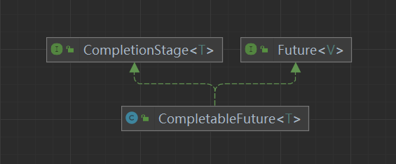

# CompletableFuture

## 介绍



## Future

- Future 接口是并发编程中一个非常重要的接口

  - Future 接口表示一个异步计算的结果。它允许你在计算完成后获取结果，而不需要等待计算本身完成。
  - Future 的主要用途是在多线程或多任务环境中管理和协调异步任务的结果。

- 主要方法
  Future 接口定义了以下几个主要的方法：

  | 方法                                          | 说明                                                         |
  | --------------------------------------------- | ------------------------------------------------------------ |
  | boolean cancel(boolean mayInterruptIfRunning) | 尝试取消此任务。如果任务正在运行，mayInterruptIfRunning 参数决定是否中断任务 |
  | boolean isCancelled()                         | 如果此任务被取消，则返回 true                                |
  | boolean isDone()                              | 如果此任务完成，则返回 true                                  |
  | V get()                                       | 等待此任务完成，并返回其结果。如果任务被取消或抛出异常，则会抛出相应的异常 |
  | V get(long timeout, TimeUnit unit)            | 等待指定的时间后，如果任务完成则返回其结果。如果超时或任务被取消或抛出异常，则会抛出相应的异常 |

-  注意事项

  - 资源管理：确保在不再需要 Future 时关闭相关的 `ExecutorService`。
  - 异常处理：`get()` 方法可能会抛出 `ExecutionException`，需要适当处理。
  - 取消任务：使用 `cancel()` 方法可以尝试取消任务，但具体实现取决于任务本身。

- 例子

  ```java
  import java.util.concurrent.*;
  
  public class FutureExample {
      public static void main(String[] args) throws ExecutionException, InterruptedException {
          ExecutorService executor = Executors.newSingleThreadExecutor();
  
          // 提交一个 Callable 任务
          Future<Integer> future = executor.submit(new Callable<Integer>() {
              @Override
              public Integer call() throws Exception {
                  Thread.sleep(2000); // 模拟耗时操作
                  return 42; // 返回结果
              }
          });
  
          // 检查任务状态
          while (!future.isDone()) {
              System.out.println("Task not done yet...");
              Thread.sleep(500);
          }
  
          // 获取任务结果
          int result = future.get();
          System.out.println("Result: " + result);
  
          // 关闭 ExecutorService
          executor.shutdown();
      }
  }
  ```

- 尽管 Future 接口在并发编程中提供了很多便利，但它也有一些明显的缺点。以下是一些常见的问题和不足之处：

  1. 阻塞调用
  `Future.get()` 方法是一个阻塞调用，这意味着它会一直等待直到任务完成。这可能导致调用线程被长时间占用，从而影响系统的整体性能。
  2. 缺乏优雅的错误处理
  `Future.get()` 方法抛出的 ExecutionException 包含了实际任务抛出的异常，但这种异常处理方式不够优雅。你需要手动捕获并处理 ExecutionException，提取并重新抛出原始异常，这增加了代码的复杂性。
  3. 缺乏取消通知
  虽然 `Future.cancel()` 可以取消任务，但并没有提供一种机制来通知等待 `get()` 的线程任务已经被取消。因此，调用 `get()` 的线程可能会继续阻塞，直到超时或任务自然完成。
  4. 缺乏回调机制
  `Future` 接口没有内置的回调机制，无法在任务完成时自动触发某些操作。这使得异步编程变得更加复杂，需要额外的逻辑来处理任务完成后的操作。
  5. 缺乏并发控制
  `Future` 接口本身没有提供并发控制机制，例如限制同时执行的任务数量。这可能导致系统资源过度消耗，特别是在高并发场景下。
  6. 不支持组合操作
  `Future` 接口不支持对多个 `Future` 对象进行组合操作，例如将多个 `Future` 的结果合并为一个结果。这使得处理多个异步任务的结果变得复杂。
  7. 缺乏高级功能
  与现代并发库相比，`Future` 接口缺乏一些高级功能，例如时间感知的取消、链式操作等。

- 为了克服这些缺点，可以考虑使用一些替代方案或增强方案：
  1. `CompletableFuture`
  `CompletableFuture` 是 Java 8 引入的一个新类，它扩展了 `Future` 接口的功能，提供了许多高级特性，如回调机制、组合操作、非阻塞等待等。
  2. `Reactor` 或 `RxJava`
  这些库提供了响应式编程模型，可以更好地处理异步操作和事件流。
  3. 自定义并发框架
  根据具体需求，可以设计自定义的并发框架，提供更灵活的并发控制和错误处理机制。

## CompletableFuture

- `CompletableFuture` 是 Java 8 引入的一个强大工具，用于处理异步编程和并发操作。它是 `Future` 接口的一个实现，提供了更多的高级功能和灵活性。以下是 `CompletableFuture` 的详细介绍：

  1. 基本概念

    - CompletableFuture 是一个用于表示异步计算结果的类，它可以完成以下几项任务：
    - 表示一个异步计算的结果。
    - 支持链式操作和组合操作。
    - 提供非阻塞的等待机制。
    - 支持回调机制。

  2. 主要方法

    CompletableFuture 提供了许多有用的方法，使异步编程更加简洁和高效。以下是一些常用的方法：
    创建 CompletableFuture

    | 方法                                                | 说明                                 |
    | --------------------------------------------------- | ------------------------------------ |
    | `CompletableFuture.supplyAsync(Supplier<T> supplier)` | 创建一个异步计算的 CompletableFuture |
    | `CompletableFuture.runAsync(Runnable runnable)`       | 创建一个异步运行的 Runnable          |
    | `CompletableFuture.completedFuture(T value)`          | 创建一个已经完成的 CompletableFuture |

    链式操作

    | 方法                                                    | 说明                                           |
    | ------------------------------------------------------- | ---------------------------------------------- |
    | `thenApply(Function<T, R> function)`                      | 在当前计算完成后，应用一个函数                 |
    | `thenAccept(Consumer<T> action)`                          | 在当前计算完成后，执行一个消费操作             |
    | `thenRun(Runnable action)`                                | 在当前计算完成后，执行一个 Runnable            |
    | `thenCompose(Function<T, CompletableFuture<R>> function)` | 在当前计算完成后，组合另一个 CompletableFuture |

    组合操作

    | 方法                                                         | 说明                                              |
    | ------------------------------------------------------------ | ------------------------------------------------- |
    | `thenCombine(CompletableFuture<U> other, BiFunction<T, U, V> combiner)` | 将两个 CompletableFuture 的结果组合起来           |
    | `thenAcceptBoth(CompletableFuture<U> other, BiConsumer<T, U> action)` | 当两个 CompletableFuture 都完成时，执行一个动作   |
    | `applyToEither(CompletableFuture<U> other, Function<? super T, V> function)` | 当任意一个 CompletableFuture 完成时，应用一个函数 |
    | `acceptEither(CompletableFuture<U> other, Consumer<? super T> action)` | 当任意一个 CompletableFuture 完成时，执行一个动作 |

    异常处理

    | 方法                                     | 说明               |
    | ---------------------------------------- | ------------------ |
    | `exceptionally(Function<Throwable, T> fn)` | 处理异常情况       |
    | `handle(BiFunction<T, Throwable, V> fn)`   | 处理正常和异常情况 |

    同步操作

    | 方法                             | 说明                                                 |
    | -------------------------------- | ---------------------------------------------------- |
    | join()                           | 同步地获取结果，如果计算未完成，则阻塞直到完成       |
    | get()                            | 同步地获取结果，如果计算未完成，则阻塞直到完成       |
    | get(long timeout, TimeUnit unit) | 同步地获取结果，如果计算未完成，则阻塞直到超时或完成 |

- 例子

  ```java
  import java.util.concurrent.CompletableFuture;
  import java.util.concurrent.ExecutionException;
  
  public class CompletableFutureExample {
      public static void main(String[] args) throws ExecutionException, InterruptedException {
          CompletableFuture<String> future = CompletableFuture.supplyAsync(() -> {
              try {
                  Thread.sleep(2000); // 模拟耗时操作
              } catch (InterruptedException e) {
                  e.printStackTrace();
              }
              return "Hello";
          }).thenApply(s -> s + " World");
  
          String result = future.get(); // 等待计算完成
          System.out.println(result); // 输出 "Hello World"
      }
  }
  ```

- `CompletableFuture` 还提供了一些高级功能，如：

  - 非阻塞等待：使用 `thenApply`、`thenAccept` 等方法可以实现非阻塞的等待和处理。
  - 组合操作：可以轻松地组合多个 `CompletableFuture`，实现复杂的异步流程。
  - 异常处理：提供了多种方法来处理异常情况，使代码更加健壮。

- 性能优势

  - 相比于传统的 `Future`，`CompletableFuture` 具有以下性能优势：
    - 非阻塞：避免了阻塞调用，提高了并发性能。
    - 链式操作：简化了异步操作的编写和管理。
    - 组合操作：可以方便地组合多个异步操作，提高代码的可读性和可维护性。
    - 通过这些功能和示例，你可以更好地理解和使用 `CompletableFuture`，从而提升并发编程的能力。

