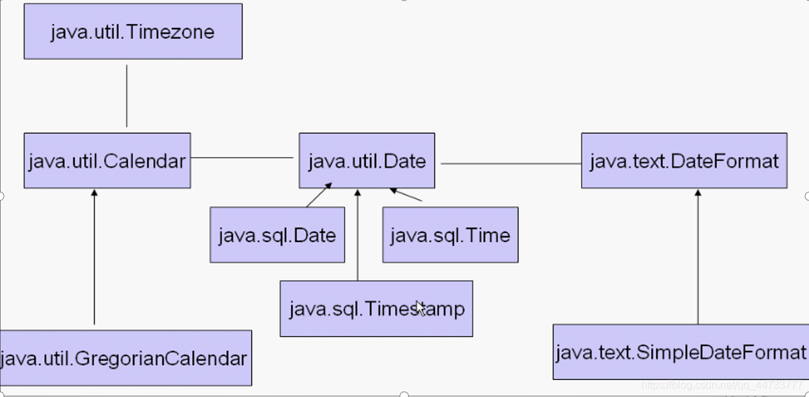
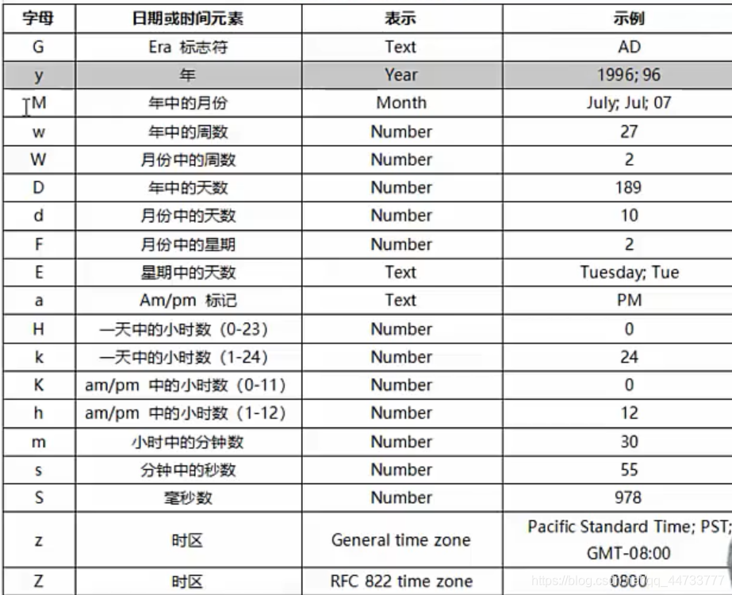

# Java 时间处理相关类
- 在计算机世界，我们把 `1970年1月1日 00:00:00` 定为基准时间，每个度量单位是毫秒(1 秒的千分之一)
- 我们用 long 类型的变量来表示时间，从基准时间往前几亿年，往后几亿年都能表示
- 如果想获得现在时刻的"时刻数值"，可以使用:`long now = System.curentTimeMillis();` 这个"时刻数值"是所有时间类的核心值，年月日都是根据这个"数值"计算出来的。我们工作学习涉及的时间相关类有如下这些:
  

## Date 时间类（java.util.Date）
- 在标准 Java 类库中包含一个 Date 类。它的对象表示一个特定的瞬间，精确到毫秒
- Java 中时间的表示说白了也是数字，是从标准纪元`1970年1月1日 00:00:00`点开始到某个时刻的毫秒数，类型是 long

```java
/**
 * Date类常用方法
 * @author Lhk
 */
import java.util.Date;

public class DateClass {
	public static void main(String[] args) {
		//long类型可以表示的最大年数
		long a=Long.MAX_VALUE/(1000l*3600*24*365);//大约292471208个年数，足够工作中使用
		System.out.println(a);
		
		long nowNum=System.currentTimeMillis();//代表系统（根据操作系统时间计算）当前时刻的毫秒数（从计算机零时刻开始）
		System.out.println(nowNum);
	
		Date d1=new Date();//无参代表当前时刻
		Date d2=new Date(1000l*3600*24*365*10);
		System.out.println(d1.getTime());//getTime()返回d1时间的毫秒数（自1970-1-1-00:00:00后）
		System.out.println(d2.getTime());
		System.out.println(d1.toString());//toString返回格式Thu Apr 08 21:27:11 CST 2021
		System.out.println(d2.toString());
		System.out.println(d1.after(d2));//表示d1时刻在d2时刻后面
		System.out.println(d2.before(d1));//表示d2时刻在d1时刻前面
		System.out.println(d2.equals(d1));//比较两个日期是否相等
		
	}
}
```

## DateFormat 和 SimpleDateFormat（时间格式化类）
- DateFormat 类的作用 
  - 把时间对象转化成指定格式的字符串，反之，把指定格式的字符串转化成时间对象
  - DateFormat 是一个抽象类，一般使用它的实现类子类 SimpleDateFormat 
- 格式化字符的含义
  
  ```java
  /**
  * 测试时间格式化类
  */
  import java.text.ParseException;
  import java.text.SimpleDateFormat;
  import java.util.Date;

  public class DataFormat_Test {
		public static void main(String[] args) throws ParseException {
			SimpleDateFormat df1=new SimpleDateFormat("yyyy-MM-dd hh:mm:ss");//时间格式
			SimpleDateFormat df2=new SimpleDateFormat("今年第M月的第d天，今年第w周");

			Date d1=new Date();
			String str1=df1.format(d1);//将Date类型时间转为df1格式的字符串类型
			String str2=df2.format(d1);
			System.out.println(str1);
			System.out.println(str2);
			
			String str3="2020-12-12 12:00:00";//将字符串类型时间转化为Date类型时间
			Date d2=df1.parse(str3);
			System.out.println(d2.getTime());
			
		}
  }
  ```
  
## Calendar和 GregorianCalendar（日历类）
- Calendar 类是一个抽象类，为我们提供了关于日期计算的相关功能，比如：年、月、日、时、分、秒的展示和计算
- GregorianCalendar 是 Calendar 的一个具体子类，提供了世界上大多数国家/地区使用的标准日历系统。
- 注意月份的表示，一月是 0，二月是 1，以此类推，12 月是 11
  - 因为大多数人习惯于使用单词而不是使用数字来表示月份，这样程序也许更易读，父类 Calendar 使用常量来表示月份:JANUARY、FEBRUARY 等等
```java

import java.text.SimpleDateFormat;
import java.util.Calendar;
import java.util.Date;
import java.util.GregorianCalendar;

/**
 * 测试日历类Calendar的子类GregorianCalendar
 * @author TheMutents
 *
 */
public class Calendar_Test {
		public static void main(String[] args) {
			GregorianCalendar calendar=new GregorianCalendar();//创建当前时间的日历对象（无参）
			
			System.out.println(calendar.get(Calendar.YEAR));//打印日历年份
			System.out.println(calendar.get(Calendar.MONTH));//打印日历对象的月份，0代表1月，以此类推
			System.out.println(calendar.get(Calendar.DATE));//返回天数（几号）
		    System.out.println(calendar.get(Calendar.DAY_OF_WEEK));//打印星期几，1代表星期天，2-星期一，以此类推
		    System.out.println(calendar.get(Calendar.HOUR_OF_DAY)+":"+calendar.get(Calendar.MINUTE)+":"+calendar.get(Calendar.SECOND));
		    dp(calendar);		
			
			GregorianCalendar c1=new GregorianCalendar(2021,3,9,12,12,12);

			System.out.println(c1.get(Calendar.YEAR));//打印日历年份2021（有参）
			System.out.println(c1.get(Calendar.MONTH));//此处打印日历对象的月份（对象中月份参数的值,3-四月）
			System.out.println(c1.get(Calendar.DATE));//返回天数（几号）
		    System.out.println(c1.get(Calendar.DAY_OF_WEEK));//此处打印6，表示星期5
		    //打印时分秒
		    System.out.println(c1.get(Calendar.HOUR_OF_DAY)+"："+c1.get(Calendar.MINUTE)+"："+c1.get(Calendar.SECOND));
		    dp(c1);
		    
		    //更改c1
		    c1.set(Calendar.DATE, 20);//日期改为20号
		    c1.add(Calendar.HOUR, 4);//时间增加4小时
		    dp(c1);
		    
		    Date d=c1.getTime();//日历对象转成时间对象（毫秒单位）
		    SimpleDateFormat f=new SimpleDateFormat("yyyy-MM-dd hh:mm:ss");//创建一个时间格式对象
		    String c1Time=f.format(d);
		    System.out.println("更改后的c1为："+c1Time);
			Calendar c=Calendar.getInstance();//使用Calendar类的静态方法创建日历对象
			c.setTime(d);//时间对象转成日历对象d转化为日历对象c
			System.out.println(c.get(Calendar.DAY_OF_WEEK));//打印3，3—星期二，2021-4-20（星期二）
		    dp(c);
		}
		
		 public static void dp(Calendar c){
				String []mon = {"一月","二月","三月","四月","五月","六月","七月","八月","九月","十月","十一月","十二月"};  
				String []week = {"","星期日","星期一","星期二","星期三","星期四","星期五","星期六"};
				int year=c.get(Calendar.YEAR);
				String month=mon[c.get(Calendar.MONTH)];
				String weekday=week[c.get(Calendar.DAY_OF_WEEK)];
				System.out.println(year+"年"+month+c.get(Calendar.DAY_OF_MONTH)+"日"+weekday);
				System.out.print("时间：");
				System.out.println(c.get(Calendar.HOUR_OF_DAY)+":"+c.get(Calendar.MINUTE)+":"+c.get(Calendar.SECOND));
				System.out.println("---------------------------------");
		    }
}

```

