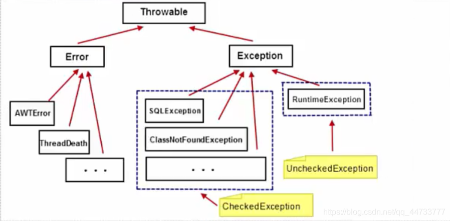
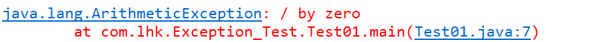
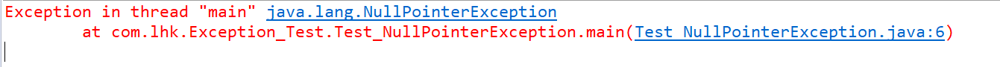
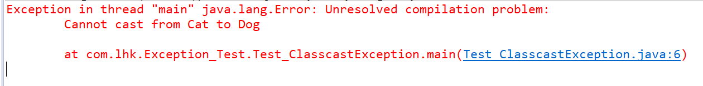
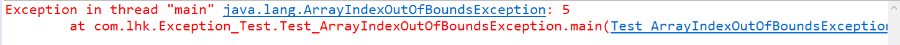
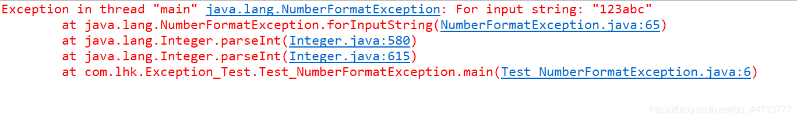
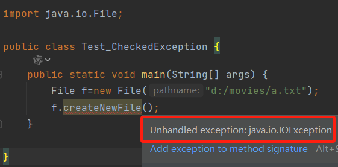
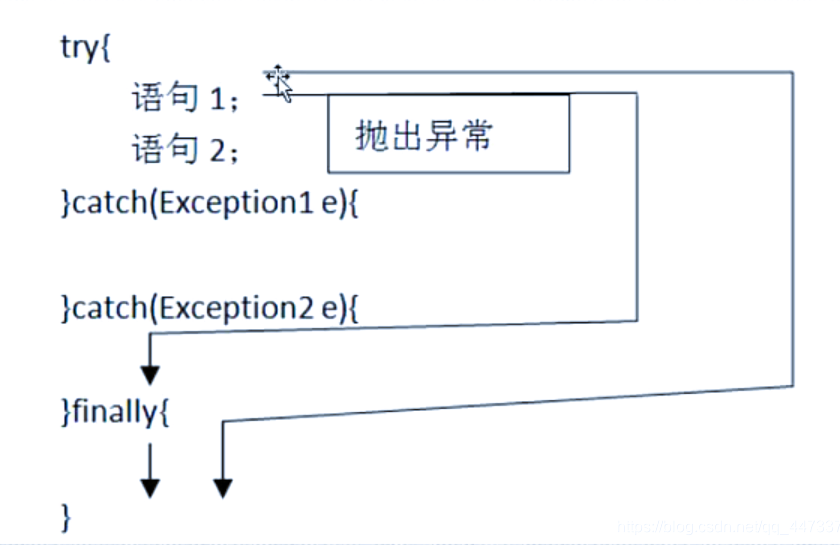

# Java Exception
## 异常机制
- 异常机制是 Java 语言中一个重要的特性，它允许程序员在程序运行时处理错误和异常情况。异常机制提供了一种机制来处理程序中的错误和异常情况，而不是让程序崩溃
- 在没有异常机制的情况下，通常使用 if 语句处理程序中可能出现的各种情况，但是这种方式并不理想
  1. 逻辑代码和错误处理代码放一起
  2. 程序员本身需要考虑的例外情况较复杂，对程序员本身要求较高
- 因此，Java 的异常机制给我们提供了方便的处理异常情况的方式

## 异常的概念
- 异常指程序运行过程中出现的非正常现象，例如用户输入错误、除数为零、需要处理的文件不存在、数组下标越界等
- 在 Java 的异常处理机制中，引进了很多用来描述和处理异常的类，称为异常类
- 异常类定义中包合了该类异常的信息和对异常进行处理的方法
- 所谓异常处理，就是指程序在出现问题时依然可以正确的执行完

- 例：
    ```java
    public class Test01 {
            public static void main(String[] args) {
                int i=1/0;
            }
    }
    ```
  
  上述代码中，程序执行时，会抛出算术异常，因为 1/0 是一个非法操作，所以程序无法继续执行，抛出异常后，程序会崩溃，无法继续执行
  
  可以使用if语句解决此异常
    ```java
    //int i=1/0;//异常情况
    //用if语句解决
    int a=1,b=0;
    if(b!=0){
        a=a/b;
    }
    ```
  使用异常机制解决
    ```java
    public class Test01 {
    public static void main(String[] args) {
        System.out.println("STEP1");
        try {
            int i=1/0;//抛出异常对象
        } catch (Exception e) {
            e.printStackTrace();//捕获异常对象，打印错误信息
            // TODO: handle exception
        }
        //异常情况,可以用if语句解决			
        System.out.println("STEP2");
    }
    ```
  
- Java 是采用面向对象的方式来处理异常的，处理过程:
  1. 抛出异常:在执行一个方法时，如果发生异常，则这个方法生成代表该异常的一个对象，停止当前执行路径，并把异常对象提交给JRE
  2. 捕获异常:JRE得到该异常后，寻找相应的代码来处理该异常。JRE在方法的调用栈中查找，从生成异常的方法开始回溯，直到找到相应的异常处理代码为止

## 异常分类
- JDK 中定义了很多异常类，这些类对应了各种各样可能出现的异常事件
- 所有异常对象都是派生于 Throwable 类的一个实例。如果内置的异常类不能够满足需要，还可以创建自己的异常类
- Java 对异常进行了分类，不同类型的异常分别用不同的 Java 类表示，所有异常的根类为 `java.lang.Throwable`,Throwable 下面又派生了两个子类: Error 和 Exception
- Java 异常类的层次结构
  

### 一、Error
- Error 是程序无法处理的错误，表示运行应用程序中较严重问题，大多数错误与代码编写者执行的操作无关，而表示代码运行时JVM(Java 虚拟机)出现的问题
  - 例如
    - Java虑拟机运行错误(Virtual MachineError)，当 JVM 不再有继续执行操作所需的内存资源时，将出现 OutOfMemoryError、这些异常发生时，Java虚拟机(JVM)一般会选择线程终止
  - Error表明系统JVM 已经处于不可恢复的崩溃状态中。我们不需要管他

### 二、Exception
- Exception 是程序本身能够处理的异常
  - 如:
    - 空指针异常(NullPointerException)
    - 数组下标越界异常(ArrayIndexOutOfBoundsException)
    - 类型转换异常(ClassCastException)
    - 算术异常(ArithmeticException)等。
- Exception 类是所有异常类的父类，其子类对应了各种各样可能出现的异常事件。通常 Java 的异常可分为:
  1. RuntimeException 运行时异常
  2. CheckedException 已检查异常

#### RuntimeException
- 派生于 RuntimeException 的异常，如被 0 除、数组下标越界、空指计等，其产生比较频繁，处理麻烦，如果显式的声明或捕获将会对程序可读性和运行效率影响很大，因此由系统自动检测并将它们交给缺省的异常处理程序(用户可不必对其处理)
- 这类异常通常是由于编程错误导致的，所以在编写程序时，并不要求必须使用异常处理机制来处理这类异常，经常需要通过增加 “逻辑处理”（if语句）来避免这些异常
- 例如：
  1. `ArithmeticException` 异常：
     - 试图除以0
       

  2. `NullPointerException` (空指针异常)
     - 当程序访问一个空对象的成员变量或方法,或者访问一个空数组的成员时会发生空指针异常(NullPointerException)
       
     - 异常代码
       ```java
          public class Test_NullPointerException {
                 public static void main(String[] args) {
                        String str=null;
                        System.out.println(str.charAt(0));
                 }
          }
       ``` 
       
  3. `ClassCastException` 异常
     - 在引用数据类型转换时，有可能发生类型转换异常(ClassCastException)
       
     - 异常代码
       ```java
          public class Test_ClasscastException {
                 public static void main(String[] args) {
                        Cat cat=new Cat();
                        Dog dog=(Dog)cat;
                 }
          }

          class Animal{

          }

          class Cat extends Animal{

          }

          class Dog extends Animal{

          }
       ```
       
  4. `ArrayIndexOutOfBoundsException` 异常
     - 当程序访问一个数组的某个元素时，如果这个元素的索引超出了 `0~数组长度-1` 这个范围，则会出现数组下标越界异常(ArrayIndexOutOfBoundsException)
       
     - 异常代码
       ```java
          public class Test_ArrayIndexOutOfBoundsException {
                 public static void main(String[] args) {
                        int[] arr=new int[5];
                        int a=5;
                        System.out.println(arr[a]);
                 }
          }
       ```
       
  5. `NumberFormatException` 异常
     - 在使用包装类将字符串转换成基本数据类型时，如果字符串的格式不正确，则会出现数字格式异常(NumberFormatException)
       
     - 异常代码
       ```java
          public class Test_NumberFormatException {
                 public static void main(String[] args) {
                        String str="123abc";
                        System.out.println(Integer.parseInt(str));
                 }
          }
       ```

#### CheckedException
- 所有不是 RuntimeException 的异常，统称为 CheckedException，又被称为“已检查异常”
  - 如 `IOException`、`SQLException`等以及用户自定义的 Exception 异常。这类异常在编译时就必须做出处理，否则无法通过编译
- 例：
  此处 File 对象 f 调用 `createNewFile()` 方法需要对 `IOException` 进行处理
  
- 两种处理方式：
  - 使用`try/catch`捕获异常
  - 使用`throw`声明异常

## 异常处理
### 一、捕获异常（try-catch-finally）
- 捕获异常是通过3个关键词来实现的:`try-catch-finally`
  - 用 try 来执行一段程序，如果出现异常，系统地出一个异常，可以通过它的类型来捕捉(catch)并处理它，最后一步是通过 finally 语句为异常处理提供一个统一的出口
  - finally 所指定的代码都要被执行
  - catch 语句可有多条，finally 语句最多只能有一条，根据自己的需要可有可无
  - 其结构如图所示
    

#### try
- try 语句指定了一段代码，该段代码就是异常捕获并处理的范围
- 在执行过程中，当任意一条语句产生异常时，就会跳过该条语句中后面的代码，代码中可能会产生并抛出一种或几种类型的异常对象，它后面的 catch 语句要分别对这些异常做相应的处理
- 一个 try 语句必须带有至少一个 catch 语句块或一个 finally 语句块
- 当异常处理的代码执行结束以后，不会回到 try 语句去执行尚未执行的代码

#### catch
- 每个 try 语句块可以伴随一个或多个 catch 语句,用于处理可能产生的不同类型的异常对象
- 常用方法，这些方法均继承自 Throwable 类
  - `toString()` 方法，显示异常的类名和产生异常的原因
  - `getMessage()`方法，只显示产生异常的原因，但不显示类名
  - `printStackTrace()`方法，用来跟踪异常事件发生时堆栈的内容
- catch 捕获异常时的捕获顺序:
  - 如果异常类之间有继承关系，在顺序安排上需注意。越是顶层的类，越放在下面，再不然就直接把多余的 catch 省略掉。也就是先捕获子类异常再捕获父类异常

#### finally
- 有些语句，不管是否发生了异常，都必须要执行，那么就可以把这样的语句放到 finally 语句块中
- 通常在 finally 中关闭程序块已打开的资源
  - 比如:关闭文件流、释放数据库连接等

#### try-catch-finally 语句块的执行过程:
- 程序首先执行可能发生异常的 try 语句块
  - 如果 try 语句没有出现异常则执行完后跳至 finally 语句块执行
  - 如果 try 语句出现异常，则中断执行并根据发生的异常类型跳至相应的 catch 语句块执行处理
- catch 语句块可以有多个，分别捕获不同类型的异常。
  - catch 语句块执行完后程序会继续执行 finally 语句块
- finally 语句是可选的，如果有的话，则不管是否发生异常，finally语句都会被执行
- 注意事项
  - 即使 try 和 catch 块中存在 return 语句，finally 语句也会执行
    - 是在执行完 finally 语句后再通过 return 退出
  - finally 语句块只有一种情况是不会执行的，那就是在执行 finally 之前遇到了`System.exit(0)`结束程序运行

- 例：

  经典的异常处理案例（读文件内容，关闭文件）
  ```java
            import java.io.FileNotFoundException;
            import java.io.FileReader;
            import java.io.IOException;

            public class Test_tryCatch {
                   public static void main(String[] args) {
                          FileReader read=null;//在这里声明read，作用域可到达finally代码块中

		                  try{
		                       read=new FileReader("d:/movies/a.txt");//此处会有异常，需要处理
	                           char c1=(char)read.read();//read()方法返回的是int类型
	                           char c2=(char)read.read();
	                           System.out.println(c1+" "+c2);
		                  }catch(FileNotFoundException e){
			                   e.printStackTrace();
		                  }catch(IOException e){
			                   e.printStackTrace();
		                  }finally{
	                           try {
	    	                         if(read!=null){
			                              read.close();
	    	                         }
		                       } catch (IOException e) {
			                         // TODO Auto-generated catch block
			                         e.printStackTrace();
		                       }
		                  }
	               }
            }
  ```
  
### 二、声明异常（throw）
- 当 CheckedException 产生时，不一定立刻处理它，可以再把异常 throws 出去
  - 在方法中使用 try-catch-finally 是由这个方法来处理异常。但是在一些情况下，当前方法并不需要处理发生的异常，而是向上传递给调用它的方法处理
  - 如果一个方法中可能产生某种异常，但是并不能确定如何处理这种异常，则应根据异常规范在方法的首部声明该方法可能抛出的异常
  - 如果一个方法抛出多个已检查异常，就必须在方法的首部列出所有的异常，之间以逗号隔开
```java
import java.io.FileNotFoundException;
import java.io.FileReader;
import java.io.IOException;

public class Test_throw {

	//main方法调用存在异常的方法，main方法捕获处理或者继续抛出
	public static void main(String[] args){
		try {
			readFile("d:/movies/a.txt");
		} catch (Exception e) {
			// TODO Auto-generated catch block
			e.printStackTrace();
		}
	}
	
	//抛出异常，让调用该方法的方法去处理异常
	public static void readFile(String path) throws Exception{
		FileReader read=null;//在这里声明read，作用域可到达finally代码块中
		
		try{
		    read=new FileReader("d:/movies/a.txt");//此处会有异常，需要处理或者抛出
	        char c1=(char)read.read();//read()方法返回的是int类型
	        char c2=(char)read.read();
	        System.out.println(c1+" "+c2);
		}finally{
	        try {
	    	    if(read!=null){
			     read.close();
	    	    }
		    } catch (IOException e) {
			    // TODO Auto-generated catch block
			    e.printStackTrace();
		    }
	    }
	}
}
```

### 三、try with resource
- JAVA 中，JVM 的垃圾回收机制可以对内部资源实现自动回收，给开发者带。来了极大的便利
  - 但是 JVM 对外部资源(调用了底层操作系统的资源)的引用却无法自动回收，例如**数据库连接**，**网络连接**以及**输入输出 IO 流**等。这些连接就需要我们手动去关闭，不然会导致外部资源泄露，连接池溢出以及文件被异常占用等。
- JDK7 之后，新增了`try-with-resource`
  - 它可以自动关闭实现了 `AutoClosable` 接囗的类，实现类需要实现 `close()` 方法
  - `try-with-resources` 声明，将 `try-catch-finally` 简化为 `try-catch`，这其实是一种语法糖，在编译时仍然会进行转化为 `try-catch-finally` 语句
```java
import java.io.FileReader; //FileReader 实现了 AutoCloseable

public class Test_tryWithResource {
	public static void main(String[] args) {
		
		//try()里面写需要打开的资源
		try(FileReader read=new FileReader("d:/movies/a.txt");){
	        char c1=(char)read.read();//read()方法返回的是int类型
	        char c2=(char)read.read();
	        System.out.println(c1+" "+c2);
		}catch(Exception e){
			e.printStackTrace();
		}
		//无需写finally{}，编译器自动实现关闭文件
	}
}
```

## 自定义的异常
- 在程序中，可能会遇到 JDK 提供的任何标准异常类都无法充分描述清楚我们想要表达的问题，这种情况下可以创建自己的异常类，即自定义异常类
  - 自定义异常类只需从 Exception 类或者它的子类派生一个子类即可
  - 自定义异常类如果继承 Exception 类，则为受检查异常，必须对其进行处理；如果不想处理，可以让自定义异常类继承运行时异常 RuntimeException 类
  - 习惯上，自定义异常类应该包含 2 个构造器:一个是默认的构造器，另一个是带有详细信息的构造器

```java
/**
 * 测试自定义异常
 * @author Lhk
 *
 */
public class Test_Custom {
		public static void main(String[] args) {
			Person p = new Person();
			
			try {
				p.setAge(10);//此处需对异常进行处理或抛出
			} catch (IllegalAgeException e) {
				// TODO Auto-generated catch block
				e.printStackTrace();
			}
			p.setName("小康");
			System.out.println(p);
		}		
}

/** 定义非法年龄类，IllegalAgeException,继承 Exception **/
class IllegalAgeException extends Exception{
	//默认构造器
	public IllegalAgeException() {
		super();
		// TODO Auto-generated constructor stub
	}
	
	//带有信息的构造器，信息存储在 message 中
	public IllegalAgeException(String message) {
		super(message);
		// TODO Auto-generated constructor stub
	}	
}

class Person{
	private String name;
	private int age;
	
	public void setName(String name) {
		this.name = name;
	}
	
	public void setAge(int age) throws IllegalAgeException  {
		if(age<0){
			throw new IllegalAgeException("年龄不应该为负数");
		}
		this.age = age;
	}

	@Override
	public String toString() {
		return "Person [name=" + name + ", age=" + age + "]";
	}
}
```