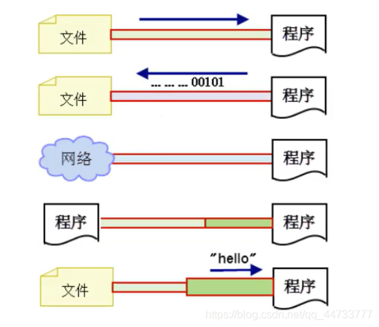
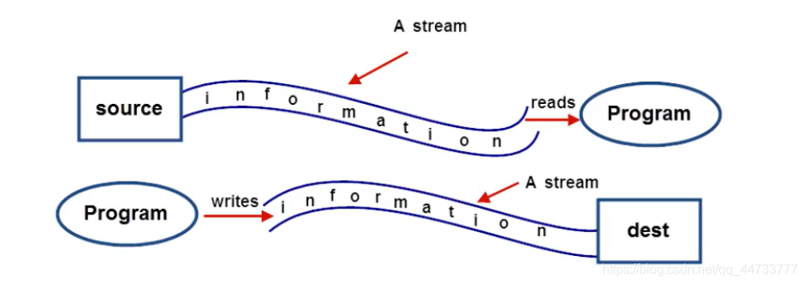
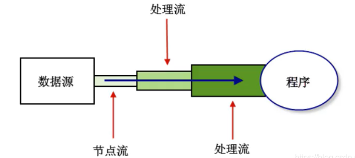
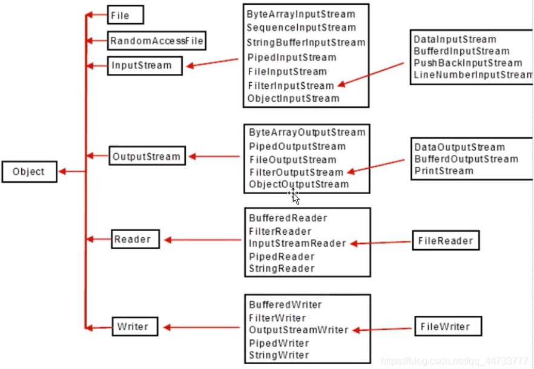

# Java IO 流

## IO 简介
- 对于任何程序设计语言而言，输入输出(input/output)系统都是非常核心的功能。
  - 程序运行需要数据，数据的获取往往需要跟外部系统进行通信，外部系统可能是文件、数据库其他程序、网络、I0 设备等等
  - 外部系统比较复杂多变，那么我们有必要通过某种手段进行抽象、屏蔽外部的差异，从而实现更加便捷的编程
  - `java.io` 包为我们提供了相关的 API，实现了对所有外部系统的输入输出操作
- 输入(Input)指的是:可以让程序从外部系统获得数据(核心含义是"读”，读取外部数据)
  - 常见的应用:
    - 读取硬盘上的文件内容到程序。例如∶播放器打开一个视频文件、word打开一个doc文件。
    - 读取网络上某个位置内容到程序。例如:浏览器中输入网址后，打开该网址对应的网页内容;下载网络上某个网址的文件。
    - 读取数据库系统的数据到程序。
    - 读取某些硬件系统数据到程序。例如:车载电脑读取雷达扫描信息到程序;温控系统等。

- 输出(Output)指的是:程序输出数据给外部系统从而可以操作外部系统（核心含义是“写”，将数据写出到外部系统)
  - 常见的应用有:
    - 将数据写到硬盘中。例如∶我们编辑完一个word文档后，将内容写到硬盘上进行保存。
    - 将数据写到数据库系统中。例如:我们注册一个网站会员，实际就是后台程序向数据库中写入一条记录。
    - 将数据写到某些硬件系统中。例如:导弹系统导航程序将新的路径输出到飞控子系统，飞控子系统根据数据修正飞行路径。

## 数据源
- 数据源 Data Source，提供数据的原始媒介
  - 常见的数据源有:数据库、文件、其他程序、内存、网络连接、IO设备
- 数据源分为:源设备、目标设备
  - 源设备:为程序提供数据，一般对应输入流
  - 目标设备:程序数据的目的地，一般对应输出流
  

## 流(Stream)的概念
- 流是一个抽象、动态的概念，是一连串连续动态的数据集合
  - 对于输入流而言，数据源就像水箱，流(Stream)就像水管中流动着的水流，程序就是我们最终的用户
    - 我们通过流(A Stream)将数据源(Source)中的数据(information)输送到程序(Program)中
  - 对于输出流而言，目标数据源就是目的地(dest)
    - 我们通过流(A Stream)将程序(Program)中的数据(information)输送到目的数据源(dest)中

  

- 注意：输入/输出流的划分是相对程序而言的，并不是相对数据源

## Java 中的 IO 抽象类
- InputStream/OutputStream 和 Reader/Writer 类是所有 I0 流类的抽象父类

### InputStream
- InputStream 此抽象类是表示字节输入流的所有类的父类。
- InputStream 是一个抽象类，它不可以实例化。数据的读取需要由它的子类来实现。根据节点的不同，它派生了不同的节点流子类。
  - 继承自 InputStream 的流都是用于向程序中输入数据，且数据的单位为字节(8 bit)
- 常用方法:

  | 方法         | 说明                                                         |
  | ------------ | ------------------------------------------------------------ |
  | int read()   | 读取一个字节的数据,并将字节的值作为int类型返回(0-255 之间的一个值)。如果未读出字节则返回-1(返回值为-1 表示读取结束) |
  | void close() | 关闭输入流对象，释放相关系统资源                             |


### OutputStream
- OutputStream 此抽象类是表示字节输出流的所有类的父类。输出流接收输出字节并将这些字节发送到某个目的地
- 常用方法:

  | 方法              | 说明                             |
  | ----------------- | -------------------------------- |
  | void write(int n) | 向目的地中写入一个字节           |
  | void close()      | 关闭输出流对象，释放相关系统资源 |

### Reader
- Reader 用于读取的字符流抽象类，数据单位为字符
- 常用方法:

  | 方法         | 说明                                                                                  |
  |-------------------------------------------------------------------------------------| ------------------------------------------------------------ |
  | int read()   | 读取一个字符的数据,并将字符的值作为 int 类型返回(0-65535 之间的一个值，即 Unicode 值)。如果未读出字符则返回-1(返回值为-1 表示读取结束) |
  | void close() | 关闭输入流对象，释放相关系统资源                                                                    |

### Writer
- Writer 用于输出的字符流抽象类，数据单位为字符

  | 方法              | 说明                             |
  | ----------------- | -------------------------------- |
  | void write(int n) | 向输出流中写入一个字符           |
  | void close()      | 关闭输出流对象，释放相关系统资源 |

## Java 中流的分类
- 按流的方向分类:
  - 输入流:数据流从数据源到程序(以InputStream、Reader 结尾的流)
  - 输出流:数据流从程序到目的地(以 OutputStream、Writer 结尾的流)

- 按处理的数据单元分类:
  - 字节流:以字节为单位获取数据，命名上以 stream 结尾的流一般是字节流
    - 如 FileInputStream、 FileOutputStream
  - 字符流:以字符为单位获取数据，命名上以 Reader/writer 结尾的流一般是字符流
    - 如 FileReader、FileWriter

- 按处理对象不同分类:
  - 节点流:可以直接从数据源或目的地读写数据
    - 如 FileInputStream、FileReader、DataInputStream 等。
  - 处理流:不直接连接到数据源或目的地，是"处理流的流",也叫包装流
    - 通过对其他流的处理提高程序的性能，如 BufferedInputStream、BufferedReader 等

  

## Java 中 IO 流类的体系
- 常用 IO 流类的体系
  

  | 流名                                       | 作用                                                         |
  | ------------------------------------------ | ------------------------------------------------------------ |
  | InputStream/OutputStream                   | 字节流的抽象类                                               |
  | Reader/Writer                              | 字符流的抽象类                                               |
  | FilelnputStream/FileOutputStream           | 节点流：以字节为单位直接操作**文件**                         |
  | ByteArrayInputStream/ByteArrayOutputStream | 节点流:以字节为单位直接操作**字节数组对象**                  |
  | ObjectInputStream/ObjectOutputStream       | 处理流:以字节为单位直接操作**对象**                          |
  | DatalnputStream/DataOutputStream           | 处理流:以字节为单位直接操作**基本数据类型与字符串类型**      |
  | FileReader/FileWriter                      | 节点流:以字符为单位直接操作**文本文件**”(注意:只能读写文本文件) |
  | BufferedReader/BufferedWriter              | 处理流:将 Reader/Writer 对象进行包装，增加缓存功能，提高读写效率 |
  | BufferedInputStream/BufferedOutputStream   | 处理流:将InputStream/OutputStream对象进行包装，增加缓存功能，提高读写效率 |
  | InputStreamReader/OutputStreamWriter       | 处理流:将字节流对象转化成字符流对象                          |
  | PrintStream                                | 处理流:将 OutputStream 进行包装，可以方便地输出字符，更加灵活 |

## [File 类](./File.md)
### File类在IO中的作用
- 当以文件作为数据源或目标时，除了可以使用字符串作为文件以及位置的指定以外，我们也可以使用 File 类指定

  ```java
  import java.io.BufferedReader;
  import java.io.BufferedWriter;
  import java.io.File;
  import java.io.FileReader;
  import java.io.FileWriter;
  
  public class File_In_IO_Demo {
      public static void main(String[] args) {
          BufferedReader br=null;
          BufferedWriter bw=null;
          try {
              br=new BufferedReader(new FileReader(new File("d:/movies/aaa.txt")));
              bw=new BufferedWriter(new FileWriter(new File("d:/movies/demo1/demo2.txt")));
              String Temp=null;
              int i=1;
              while((Temp=br.readLine())!=null){
                  bw.write(i+"."+Temp);
                  bw.newLine();
                  i++;
              }
              bw.flush();
          } catch (Exception e) {
              e.printStackTrace();
          }finally{
              try {
                  if(br!=null){
                      br.close();
                  }
                  if(bw!=null){
                      bw.close();
                  }
              } catch (Exception e2) {
                  e2.printStackTrace();
              }
          }
      }
  }
  ```

## 常用流对象
### 文件字节流
- FileInputStream 通过字节的方式读取文件，适合读取所有类型的文件(图像、视频、文本文件等)
  - Java 也提供了 FileReader 专门读取文本文件
- FileOutputStream 通过字节的方式写数据到文件中，适合所有类型的文件。
  - Java 也提供了 FileWriter 专门写入文本文件
```java
/**
 * 测试文件字节输入流和输出流
 */
import java.io.FileInputStream;
import java.io.FileOutputStream;

public class FileStream_Demo {
    public static void main(String[] args) {
        FileInputStream file=null;
        FileOutputStream fileout=null;
        try {
            //创建文件字节输入流对象
            file=new FileInputStream("d:/movies/QQ飞车.jpg");
            //创建文件字节输出流对象
            fileout=new FileOutputStream("d:/movies/a.jpg");
            int temp=0;
            while((temp=file.read())!=-1){
                fileout.write(temp);//读一个字节写一个字节
            }
            //将数据从内存中写入磁盘中
            fileout.flush();
        } catch (Exception e) {
            e.printStackTrace();
        }finally{
            try {
                if(file!=null){
                    file.close();
                }
                if(fileout!=null){
                    fileout.close();
                }
            } catch (Exception e2) {
                e2.printStackTrace();
            }
        }
    }
}
```

- 通过缓冲区提高读写效率
  1. 通过创建一个指定长度的字节数组作为缓冲区，以此来提高 I0 流的读写效率
     - 该方式适用于读取较大图片时的缓冲区定义。注意:缓冲区的长度一定是 2 的整数幂。一般情况下 1024 长度较为合适

  ```java
  
  import java.io.FileInputStream;
  import java.io.FileOutputStream;
  
  public class FileStreamBuffer_Demo {
      public static void main(String[] args) {
          FileInputStream file=null;
          FileOutputStream fileout=null;
          try {
              //创建文件字节输入流对象
              file=new FileInputStream("d:/movies/QQ飞车.jpg");
              //创建文件字节输出流对象
              fileout=new FileOutputStream("d:/movies/aa.jpg");
              //创建字节缓冲区，提高读写效率
              byte[] buff=new byte[1024];
              int temp=0;
              while((temp=file.read(buff))!=-1){
                  fileout.write(buff, 0, temp);
              }
              //将数据从内存中写入磁盘中
              fileout.flush();
          } catch (Exception e) {
              e.printStackTrace();
          }finally{
              try {
                  if(file!=null){
                      file.close();
                  }
                  if(fileout!=null){
                      fileout.close();
                  }
              } catch (Exception e2) {
                  e2.printStackTrace();
              }
              
          }
      }
  }
  ```
  
  2. 通过创建一个字节数组作为缓冲区，数组长度是通过输入流对象的 `available()` 返回当前文件的预估长度来定义的。
     - 在读写文件时，是在一次读写操作中完成文件读写操作的。注意:如果文件过大，那么对内存的占用也是比较大的。所以大文件不建议使用该方法

  ```java
  import java.io.FileInputStream;
  import java.io.FileOutputStream;
  
  public class FileStreamBuffer_Demo2 {
      public static void main(String[] args) {
      FileInputStream file=null;
      FileOutputStream fileout=null;
      try {
          //创建文件字节输入流对象
          file=new FileInputStream("d:/movies/QQ飞车.jpg");
          //创建文件字节输出流对象
          fileout=new FileOutputStream("d:/movies/aaa.jpg");
          //创建字节缓冲区，提高读写效率
          byte[] buff=new byte[file.available()];//返回当前文件预估长度
          //一次读写操作完成文件读写操作，不适用大文件，适合小文件
          file.read(buff);
          fileout.write(buff);
          //将数据从内存中写入磁盘中
          fileout.flush();
      } catch (Exception e) {
          e.printStackTrace();
      }finally{
          try {
              if(file!=null){
                  file.close();
              }
              if(fileout!=null){
                  fileout.close();
              }
          } catch (Exception e2) {
              e2.printStackTrace();
          }
      }
      }
  }
  ```
  
  3. 通过字节缓冲流提高读写效率
    - Java 缓冲流本身并不具有 IO 流的读取与写入功能，只是在别的流(节点流或其他处理流)上加上缓冲功能提高效率,就像是把别的流包装起来一样,因此缓冲流是一种处理流(包装流) 
    - 当对文件或者其他数据源进行频繁的读写操作时，效率比较低，这时如果使用缓冲流就能够更高效的读写信息。因为缓冲流是先将数据缓存起来，然后当缓存区存满后或者手动刷新时再一次性的读取到程序或写入目的地。
    - 因此，缓冲流还是很重要的，我们在 IO 操作时记得加上缓冲流来提升性能

### 字节缓冲流
- BufferedInputStream 和 BufferedOutputStream 这两个流是缓冲字节流，通过内部缓存数组来提高操作流的效率

  ```java
  import java.io.BufferedInputStream;
  import java.io.BufferedOutputStream;
  import java.io.FileInputStream;
  import java.io.FileOutputStream;
  
  public class FileStreamBuffer_Demo3 {
    public static void main(String[] args) {
        FileInputStream fis=null;
        FileOutputStream fos=null;
        BufferedInputStream bis=null;
        BufferedOutputStream bos=null;
  
        try {
            fis=new FileInputStream("d:/movies/QQ飞车.jpg");
            bis=new BufferedInputStream(fis);
            fos=new FileOutputStream("d:/movies/b.jpg");
            bos=new BufferedOutputStream(fos);
            //在字节缓冲流中，其byte数组默认长度为2^13=8192
            int temp=0;
            while((temp=bis.read())!=-1){
                bos.write(temp);
            }
            bos.flush();
        } catch (Exception e) {
            e.printStackTrace();
        }finally{
            try {
                //关闭流的顺序：后开的先关闭
                if(bis!=null){
                    bis.close();
                }
                if(fis!=null){
                    fis.close();
                }
                if(bos!=null){
                    bos.close();
                }
                if(fos!=null){
                    fos.close();
                }
            } catch (Exception e2) {
                e2.printStackTrace();
            }
        }
    }
  }
  ```
  
- 使用文件字节流实现文件拷贝

  ```java
  import java.io.BufferedInputStream;
  import java.io.BufferedOutputStream;
  import java.io.FileInputStream;
  import java.io.FileOutputStream;
  
      public class FileCopyTools {
          public static void main(String[] args) {
          copyFile("d:/movies/QQ飞车.jpg", "d:/movies/bb.jpg");
      }
  
      /**
      * 文件拷贝方法
      */
      public static void copyFile(String src,String des){
          FileInputStream fis=null;
          FileOutputStream fos=null;
          BufferedInputStream bis=null;
          BufferedOutputStream bos=null;
          
          try {
              fis = new FileInputStream(src);
              fos = new FileOutputStream(des);
              bis=new BufferedInputStream(fis);
              bos=new BufferedOutputStream(fos);
              int temp=0;
              while((temp=bis.read())!=-1){
                  bos.write(temp);
              }
              bos.flush();
          } catch (Exception e) {
              e.printStackTrace();
          }finally{
              try {
                  if(bis!=null){
                      bis.close();
                  }
                  if(fis!=null){
                      fis.close();
                  }
                  if(bos!=null){
                      bos.close();
                  }
                  if(fos!=null){
                      fos.close();
                  }
              } catch (Exception e2) {
                  e2.printStackTrace();
              }
          }
      }
  }
  ```
  
### 文件字符流
- 文件字节流可以处理所有的文件，如果我们处理的是文本文件，也可以使用文件字符流，它以字符为单位进行操作

  ```java
  /**
  *测试文件字符输入流
  */
  import java.io.FileReader;
  
  public class FileReader_Demo1 {
      public static void main(String[] args) {
          FileReader frd=null;
          try {
              //创建文件字符流对象
               frd=new FileReader("d:/movies/app.txt");
               int temp=0;
               while((temp=frd.read())!=-1){
                   //一次只能读取一个字符的数据,并将字符的值作为int类型返回(0-65535之间的一个值，即 unicode值)
                   System.out.println((char)temp);
               }
          } catch (Exception e) {
              e.printStackTrace();
          }finally{
              try {
                  if(frd!=null){
                      frd.close();
                  }
              } catch (Exception e2) {
                  e2.printStackTrace();
                  // TODO: handle exception
              }
          }
      }
  }
  ```
  
  ```java
  /**
   * 测试文件字符输出流
   */
  import java.io.FileWriter;
  
  public class FileWriter_Demo1 {
      public static void main(String[] args) {
          FileWriter fw=null;
          FileWriter fw2=null;
          try {
              //创建文件字符输出流对象
              fw=new FileWriter("d:/movies/aaa.txt");//自动创建文件
              //一个字符流输出对象中调用多次write方法，会将内容连在一起
              fw.write("TheMutents,我是小白\r\n");//\r\n代表回车换行，不同操作系统回车换行符不一样
              fw.write("你好，世界！\r\n");
              fw.flush();
              //不同字符输出流对象往一个文件里写出数据，默认会将原来的文件内容覆盖掉
              //fw2=new FileWriter("d:/movies/aaa.txt");//此字符输出流对象往同一文件写出数据会覆盖原来文件的内容
              fw2=new FileWriter("d:/movies/aaa.txt", true);//此字符输出流对象往同一文件写出数据会在原来文件的内容上追加新内容
              fw2.write("天将降大任于斯人也\r\n必先苦其心志\r\n饿其体肤");
              fw2.flush();
          } catch (Exception e) {
              e.printStackTrace();
          }finally{
          try {
              if(fw!=null){
                  fw.close();
              }
              if(fw2!=null){
                  fw2.close();
              }
          } catch (Exception e) {
              e.printStackTrace();
          }
      }
      }
  }
  ```

- 使用字符流实现文本文件的拷贝
  ```java
  import java.io.FileReader;
  import java.io.FileWriter;
  
  /**
   * 使用字符流实现文本文件的拷贝
   *  */
  public class FileTools_2 {
      public static void main(String[] args) {
          FileReader frd=null;
          FileWriter fw=null;
          try {
              frd=new FileReader("d:/movies/aaa.txt");
              fw=new FileWriter("d:/movies/bbb.txt");
              //使用字符数组作为缓冲区，且只能给定数组长度，没有available()方法返回预估文件长度
              char[] buff=new char[1024];
              int temp=0;
              while((temp=frd.read(buff))!=-1){
                  fw.write(buff, 0, temp);;
              }
              fw.flush();
          } catch (Exception e) {
              e.printStackTrace();
          }finally{
              try {
                  if(frd!=null){
                      frd.close();
                  }
                  if(fw!=null){
                      fw.close();
                  }
              } catch (Exception e2) {
                  e2.printStackTrace();
              }
          }
      }
  }
  ```
  
### 字符缓冲流
- 通过字符缓冲流提高读写效率
  - BufferedReader/BufferedWriter 增加了缓存机制，大大提高了读写文本文件的效率
    - BufferedReader 是针对字符输入流的缓冲流对象，提供了更方便的按行读取的方法:`readLine()`;在使用字符流读取文本文件时，我们可以使用该方法以行为单位进行读取
    - BufferedWriter 是针对字符输出流的缓冲流对象，在字符输出缓冲流中可以使用 `newLine()` 方法实现换行处理

  ```java
  import java.io.BufferedReader;
  import java.io.BufferedWriter;
  import java.io.FileReader;
  import java.io.FileWriter;
  
  public class FileCopyTools3 {
      public static void main(String[] args) {
          copyFile("d:/movies/aaa.txt","d:/movies/ddd.txt");
      }
      
      /**
       * 基于字符缓冲流实现文件拷贝
       */
      public static void copyFile(String src,String des){
          FileReader fr=null;
          BufferedReader br=null;
          FileWriter fw=null;
          BufferedWriter bw=null;
          
          try {
              fr=new FileReader(src);
              br=new BufferedReader(fr);
              fw=new FileWriter(des);
              bw=new BufferedWriter(fw);
              
              String temp=null;
              while((temp=br.readLine())!=null){
                  bw.write(temp);
                  bw.newLine();
              }
              bw.flush();
          } catch (Exception e) {
              e.printStackTrace();
          }finally{
              try {
                  if(br!=null){
                      br.close();
                  }
                  if(fr!=null){
                      fr.close();
                  }
                  if(bw!=null){
                      bw.close();
                  }
                  if(fw!=null){
                      fw.close();
                  }
              } catch (Exception e2) {
                  e2.printStackTrace();
              }
          }
      }
      
  }
  ```

  ```java
  /**
   * 通过字符缓冲流实现为文件的内容添加行号
   */
  import java.io.BufferedReader;
  import java.io.BufferedWriter;
  import java.io.FileReader;
  import java.io.FileWriter;
  
  public class LineNumDemo {
      public static void main(String[] args) {
          BufferedReader br=null;
          BufferedWriter bw=null;
          try {
              br=new BufferedReader(new FileReader("d:/movies/aaa.txt"));
              bw=new BufferedWriter(new FileWriter("d:/movies/eee.txt"));
              String temp=null;
              int i=1;
              while((temp=br.readLine())!=null){
                  bw.write(i+"."+temp);
                  bw.newLine();
                  i++;
              }
              bw.flush();
          } catch (Exception e) {
              e.printStackTrace();
          }finally{
              try {
                  if(br!=null){
                      br.close();
                  }
                  if(bw!=null){
                      bw.close();
                  }
              } catch (Exception e2) {
                  e2.printStackTrace();
              }
          }
      }
  }
  ```
  
### 文件转换流
- InputStreamReader/OutputStreamWriter 用来实现将字节流转化成字符流。
  - 比如，如下场景:
    - `System.in` 是字节流对象，代表键盘的输入，如果我们想按行接收用户的输入时，就必须用到缓冲字符流 BufferedReader 特有的方法 readLine()，但是经过观察会发现在创建 BufferedReader 的构造方法的参数必须是一个 Reader 对象，这时候我们的转换流 InputStreamReader 就派上用场了
    - 而 `System.out` 也是字节流对象，代表输出到显示器，按行读取用户的输入后，并且要将读取的一行字符串直接显示到控制台，就需要用到字符流的 write(String str)方法，所以我们要使用 OutputStreamWriter 将字节流转化为字符流

  ```java
  /**
   * 通过转换流实现键盘输入屏幕输出
   */
  import java.io.BufferedReader;
  import java.io.BufferedWriter;
  import java.io.InputStreamReader;
  import java.io.OutputStreamWriter;
  
  public class ConvertStream_Demo {
      public static void main(String[] args) {
          BufferedReader br=null;
          BufferedWriter bw=null;
          try {
              br=new BufferedReader(new InputStreamReader(System.in));
              bw=new BufferedWriter(new OutputStreamWriter(System.out));
              while(true){
                  bw.write("请输入：");
                  bw.flush();
                  String input=br.readLine();
                  if("exit".equals(input)){
                      break;
                  }
                  bw.write("您输入的内容为："+input);
                  bw.newLine();
                  //System.out.println(input);//以字符的形式输出
                          
              }
          } catch (Exception e) {
              e.printStackTrace();
          }finally{
              try {
                  if(br!=null){
                      br.close();
                  }
                  if(bw!=null){
                      bw.close();
                  }
                  
              } catch (Exception e2) {
                  e2.printStackTrace();
              }
          }
      }
  }
  ```

  ```java
  /**
   * 通过字节流读取文本文件并添加行号
   */
  import java.io.BufferedReader;
  import java.io.BufferedWriter;
  import java.io.FileInputStream;
  import java.io.FileOutputStream;
  import java.io.InputStreamReader;
  import java.io.OutputStreamWriter;
  
  public class LineNum_Demo2 {
      public static void main(String[] args) {
          BufferedReader br=null;
          BufferedWriter bw=null;
          
          try {
              br=new BufferedReader(new InputStreamReader(new FileInputStream("d:/movies/aaa.txt")));
              bw=new BufferedWriter(new OutputStreamWriter(new FileOutputStream("d:/movies/1.txt")));
              String temp="";
              int i=1;
              while((temp=br.readLine())!=null){
                  bw.write(i+"."+temp);
                  bw.newLine();
                  i++;
              }
              bw.flush();
          } catch (Exception e) {
              e.printStackTrace();
          }finally{
              try {
                  if(br!=null){
                      br.close();
                  }
                  if(bw!=null){
                      bw.close();
                  }
              } catch (Exception e2) {
                  e2.printStackTrace();
              }
          }
      }
  }
  ```
  
### 字符输出流
- 在 Java 的 IO 流中专门提供了用于字符输出的流对象 PrintWriter
  - 该对象具有自动行刷新缓冲字符输出流，特点是可以按行写出字符串，并且可通过 `println()` 方法实现自动换行

  ```java
  import java.io.BufferedReader;
  import java.io.FileInputStream;
  import java.io.InputStreamReader;
  import java.io.PrintWriter;
  
  /**
   * 使用字符输出流读取文本内容并给文本添加行号
   */
  public class LineNum_Demo3 {
      public static void main(String[] args) {
          BufferedReader br=null;
          PrintWriter pw=null;
          
          try {
              br=new BufferedReader(new InputStreamReader(new FileInputStream("d:/movies/aaa.txt")));
              pw=new PrintWriter("d:/movies/2.txt");
              int i=1;
              String temp="";
              while((temp=br.readLine())!=null){
                  pw.println(i+"."+temp);
                  i++;
              }
          } catch (Exception e) {
              e.printStackTrace();
          }finally{
              try {
                  if(br!=null){
                      br.close();
                  }
                  if(pw!=null){
                      pw.close();
                  }
              } catch (Exception e2) {
                  e2.printStackTrace();
              }
          }
      }
  }
  ```
  
### 字节数组流
- ByteArrayInputStream 和 ByteArrayOutputStream 经常用在需要流和数组之间转化的情况

- 字节数组输入流
  - FileInputStream 是把文件当做数据源。ByteArrayInputStream 则是把内存中的”字节数组对象”当做数据源
  
  ```java
  /**
   * 测试字节数组输入流
   */
  import java.io.ByteArrayInputStream;
  import java.io.IOException;
  
  public class ByteArrayInputStream_Demo {
      public static void main(String[] args) {
          byte[] arr="TheMutents".getBytes();
          StringBuilder sb=new StringBuilder();
          //该构造方法参数为一个字节数组，代表数据源
          ByteArrayInputStream bais=new ByteArrayInputStream(arr);
          try {
              int temp=0;
              while((temp=bais.read())!=-1){
                  sb.append((char)temp);
              }
              System.out.println(sb);
          } finally {
              try {
                  bais.close();
              } catch (IOException e) {
                  // TODO Auto-generated catch block
                  e.printStackTrace();
              }
          }	
      }
  }
  ```
  
- 字节数组输出流
  - ByteArrayOutputStream 流对象是将流中的数据写入到字节数组中

  ```java
  /**
   * 测试字节数组输出流
   */
  import java.io.ByteArrayOutputStream;
  
  public class ByteArrayOutputStream_Demo {
      public static void main(String[] args) {
          ByteArrayOutputStream bos=null;
          StringBuilder sb=new StringBuilder();
          
          try {
              bos=new ByteArrayOutputStream();
              //将字节写入一个字节数组中
              bos.write('l');
              bos.write('h');
              bos.write('k');
              //获取字节数组
              byte[] arr=bos.toByteArray();
              //遍历字节数组
              for(int i =0;i<arr.length;i++){
                  System.out.println(arr[i]);
                  sb.append((char)arr[i]);
              }
              System.out.println(sb);
          } finally {
                  try {
                      if(bos!=null){
                          bos.close();
                      }
                  } catch (Exception e) {
                      e.printStackTrace();
                  }
          }
      }
  }
  ```
  
### 数据流
- 数据流将**基本数据类型与字符串类型**作为数据源,从而允许程序以与机器无关的方式从底层输入输出流中操作 Java 基本数据类型与字符串类型
- DataInputStream 和 DataOutputStream 提供了可以存取与机器无关的所有 Java 基础类型数据（如:int、double、String 等)的方法

- 数据输入流
  - 通过数据输入流可以读取基于数据输出流向文件中写出的数据，且可以把这些数据按照相应的类型读取到程序中

  ```java
  import java.io.BufferedInputStream;
  import java.io.DataInputStream;
  import java.io.FileInputStream;
  
  /**
   * 测试数据输入流
   */
  public class DataInputStream_Demo {
      public static void main(String[] args) {
          DataInputStream dis=null;
          try {
              dis=new DataInputStream(new BufferedInputStream(new FileInputStream("d:/movies/data1.txt")));
              //读取的顺序要与写入的顺序一致，否则无法正确读取数据
              System.out.println("char: "+dis.readChar());
              System.out.println(dis.readDouble());
              System.out.println(dis.readInt());
              System.out.println(dis.readUTF());
          } catch (Exception e) {
              e.printStackTrace();
          }finally{
              try {
                  if(dis!=null){
                      dis.close();
                  }
              } catch (Exception e2) {
                  e2.printStackTrace();
              }
          }
      }
  }
  ```

- 数据输出流

  ```java
  /**
   * 测试数据输出流
   */
  import java.io.BufferedOutputStream;
  import java.io.DataOutputStream;
  import java.io.FileOutputStream;
  
  public class DataOutputStream_Demo {
      public static void main(String[] args) {
          DataOutputStream dos=null;
          try {
              dos=new DataOutputStream(new BufferedOutputStream(new FileOutputStream("d:/movies/data1.txt")));
              dos.writeChar('A');
              dos.writeChars("theMutents");
              dos.writeDouble(Math.random());
              dos.writeInt(1000);
              dos.writeUTF("你好，世界！");
              dos.flush();
          
          } catch (Exception e) {
              e.printStackTrace();
          }finally{
              try {
                  if(dos!=null){
                      dos.close();
                  }
              } catch (Exception e2) {
                  e2.printStackTrace();
              }
          }
      }
  }
  ```
  
### 对象流
- 对象的本质是用来组织和存储数据的，对象本身也是数据。
  - 那么，能不能将对象存储到硬盘上的文件中呢?
  - 能不能将对象通过网络传输到另一个电脑呢?
  - 我们可以通过序列化和反序列化来实现这些需求

- 对象流中除了能实现对基本数据类型进行读写操作以外，还可以对 Java 对象进行读写操作
  - ObjectOutputStream 代表对象输出流，它的 `writeObject(Object obj)` 方法可对参数指定的 obj 对象进行序列化，把得到的字节序列写到一个目标输出流中
  - ObjectInputStream 代表对象输入流，它的 `readObject()` 方法从一个源输入流中读取字节序列，再把它们反序列化为一个对象，并将其返回

- 对象流操作基本数据类型
  ```java
  import java.io.BufferedOutputStream;
  import java.io.FileOutputStream;
  import java.io.ObjectOutputStream;
  import java.util.Date;
  
  /**
   * 测试对象输出流
   */
  public class ObjectOutputStreamBasicTypeDemo {
      public static void main(String[] args) {
          ObjectOutputStream oos=null;
          try {
              oos=new ObjectOutputStream(new BufferedOutputStream(new FileOutputStream("d:/movies/data2.txt")));
              oos.writeInt(100);
              oos.writeDouble(Math.random());
              oos.writeChar('a');
              oos.writeBoolean(true);
              oos.writeObject(new Date());
              oos.writeUTF("写入文件完毕");
              oos.flush();
          } catch (Exception e) {
              e.printStackTrace();
          }finally{
              try {
                  if(oos!=null){
                      oos.close();
                  }
              } catch (Exception e2) {
                  e2.printStackTrace();
              }
          }
      }
  }
  ```
  
  ```java
  /**
   * 测试对象输入流
   */
  import java.io.BufferedInputStream;
  import java.io.FileInputStream;
  import java.io.ObjectInputStream;
  
  public class ObjectInputStreamBasicTypeDemo {
      public static void main(String[] args) {
          ObjectInputStream ois=null;
          try {
              ois=new ObjectInputStream(new BufferedInputStream(new FileInputStream("d:/movies/data2.txt")));
              //读取时必须按照写入的顺序读取
              System.out.println("Int: "+ois.readInt());
              System.out.println("double: "+ois.readDouble());
              System.out.println("Char: "+ois.readChar());
              System.out.println("Boolean: "+ois.readBoolean());
              System.out.println("Date: "+ois.readObject());
              System.out.println("String: "+ois.readUTF());
          } catch (Exception e) {
              e.printStackTrace();
          }finally{
              try {
                  if(ois!=null){
                      ois.close();
                  }
              } catch (Exception e2) {
                  e2.printStackTrace();
              }
          }
      }
  }
  ```
  
- 对象流操作对象
  - ObjectOutputStream 可以将一个内存中的 Java 对象通过序列化的方式写入到磁盘的文件中。被序列化的对象必须要实现 Serializable 序列化接口，否则会抛出异常
  
  将对象序列化到文件

  ```java
  import java.io.Serializable;
  
  //对象流操作的对象的类必须实现Serializable接口
  public class IO_User implements Serializable{
  
      private static final long serialVersionUID = 1L;
      private int id;
      private String name;
      private String age;
      
      public IO_User() {
          super();
      }
  
      public IO_User(int id, String name, String age) {
          super();
          this.id = id;
          this.name = name;
          this.age = age;
      }
  
      public int getId() {
          return id;
      }
  
      public void setId(int id) {
          this.id = id;
      }
  
      public String getName() {
          return name;
      }
  
      public void setName(String name) {
          this.name = name;
      }
  
      public String getAge() {
          return age;
      }
  
      public void setAge(String age) {
          this.age = age;
      }
  }
  ```
  
  ```java
  import java.io.BufferedOutputStream;
  import java.io.FileOutputStream;
  import java.io.ObjectOutputStream;
  
  public class ObjectOutputStreamObjectTypeDemo {
      public static void main(String[] args) {
          ObjectOutputStream oos=null;
          try {
              //序列化：将对象转为字节。所以输出流一定为字节输出流
              oos=new ObjectOutputStream(new BufferedOutputStream(new FileOutputStream("d:/movies/object.txt")));
              IO_User U1=new IO_User(1, "LHK", "20");
              IO_User U2=new IO_User(2, "TheMutents", "20");
              oos.writeObject(U1);
              oos.writeObject(U2);
              oos.flush();
          } catch (Exception e) {
              e.printStackTrace();
          }finally{
              try {
                  if(oos!=null){
                      oos.close();
                  }
              } catch (Exception e2) {
                  e2.printStackTrace();
              }
          }
      }
  }
  ```

  将外部文件对象反序列化到内存中

  ```java
  /**
   * 从外部件对象反序列化到内存
   */
  import java.io.BufferedInputStream;
  import java.io.FileInputStream;
  import java.io.ObjectInputStream;
  
  public class ObjectInputStreamObjectTypeDemo {
      public static void main(String[] args) {
          ObjectInputStream ois=null;
          try {
              ois=new ObjectInputStream(new BufferedInputStream(new FileInputStream("d:/movies/object.txt")));
              IO_User u1=(IO_User)ois.readObject();
              IO_User u2=(IO_User)ois.readObject();
              System.out.println(u1.getId()+"\t"+u1.getName()+"\t"+u1.getAge());
              System.out.println(u2.getId()+"\t"+u2.getName()+"\t"+u2.getAge());
          } catch (Exception e) {
              e.printStackTrace();
          }finally{
              try {
                  if(ois!=null){
                      ois.close();
                  }
              } catch (Exception e2) {
                  e2.printStackTrace();
              }
          }
      }
  }
  ```
  
### 随机访问流
- RandomAccessFile 可以实现两个作用:
  1. 实现对一个文件做读和写的操作
  2. 可以访问文件的任意位置。不像其他流只能按照先后顺序读取。
     - 在开发某些客户端软件时，经常用到这个功能强大的可以**任意操作文件内容**的类
       - 比如，软件的使用次数和使用日期，可以通过本类访问文件中保存次数和日期的地方进行比对和修改
       - Java 很少开发客户端软件，所以在Java 开发中这个类用的相对较少
- 三个核心方法

  | 方法                                       | 说明                                                         |
  | ------------------------------------------ | ------------------------------------------------------------ |
  | RandomAccessFile(String name, String mode) | name 用来确定文件;mode取 r (读)或 rw (可读写)，通过 mode 可以确定流对文件的访问权限 |
  | seek(long a)                               | 用来定位流对象读写文件的位置，a 确定读写位置距离文件开头的字节个数 |
  | getFilePointer()                           | 获得流的当前读写位置                                         |

  ```java
  import java.io.RandomAccessFile;
  
  /**
   * 测试随机访问流
   */
  public class RandomAccessFileDemo {
      public static void main(String[] args) {
          RandomAccessFile raf=null;
          try {
              raf=new RandomAccessFile("d:/movies/demo1/demo1.txt","rw");
              //向文件中写入数据
              int[] arr=new int[]{10,20,30,40,50,60,70,80,90,100};
              for(int i=0;i<arr.length;i++){
                  raf.writeInt(arr[i]);;
              }
              //读取文件内容
              raf.seek(4);//指向文件内容的指针向后面移动4个字节
              System.out.println(raf.readInt());
              //隔一个int类型读一个数据
              for(int i=0;i<arr.length;i+=2){
                  raf.seek(i*4);
                  System.out.print(raf.readInt()+"\t");
              }
              System.out.println();
              //将40替换成45
              raf.seek(12);
              raf.writeInt(45);
              for(int i=0;i<arr.length;i++){
                  raf.seek(i*4);
                  System.out.print(raf.readInt()+"\t");
              }
          } catch (Exception e) {
              e.printStackTrace();
          }finally{
              try {
                  if(raf!=null){
                      raf.close();
                  }
              } catch (Exception e2) {
                  e2.printStackTrace();
              }
          }
      }
  }
  ```


## 序列化与反序列化
- 当两个进程远程通信时，彼此可以发送各种类型的数据。无论是何种类型的数据，都会以二进制序列的形式在网络上传送。
  - 比如
    - 我们可以通过 http 协议发送字符串信息
    - 我们也可以在网络上直接发送 Java 对象
      - 发送方需要把这个Java 对象转换为字节序列，才能在网络上传送;接收方则需要把字节序列再恢复为Java 对象才能正常读取

- 把 Java 对象转换为字节序列的过程称为**对象的序列化**
- 把字节序列恢复为 Java 对象的过程称为**对象的反序列化**
  
- 对象序列化的作用有如下两种:
  1. 持久化: 把对象的字节序列永久地保存到硬盘上，通常存放在一个文件中。
  2. 网络通信:在网络上传送对象的字节序列。比如:服务器之间的数据通信、对象传递

- 序列化涉及的接口
  - 只有实现了 Serializable 接口的类的对象才能被序列化。Serializable 接口是一个空接口只起到标记作用


## Apache IO 包
- JDK 中提供的文件操作相关的类，功能都非常基础，进行复杂操作时需要做大量编程工作。实际开发中，往往需要你自己动手编写相关的代码，尤其在遍历目录文件时，经常用到递归，非常繁琐 
- Apache-commons 工具包中提供了 IOUtils/FileUtils，可以让我们非常方便的对文件和目录进行操作
  - Apache IOUtils 和 FileUtils 类库为我们提供了更加简单、功能更加强大的文件操作和 IO 流操作功能

### FileUtils
- 常用方法：

  | 方法                                       | 说明                                                         |
  | ------------------------------------------ | ------------------------------------------------------------ |
  | cleanDirectory | 清空目录，但不删除目录 |
  | contentEquals | 比较两个文件的内容是否相同 |
  | copyDirectory | 将一个目录内容拷贝到另一个目录。可以通过FileFilter过滤需要拷贝的文件 |
  | copyFile | 将一个文件拷贝到一个新的地址 |
  | copyFileToDirectory | 将一个文件拷贝到某个目录下 |
  | copyInputStreamToFile | 将一个输入流中的内容拷贝到某个文件 |
  | deleteDirectory | 删除目录 |
  | deleteQuietly | 删除文件 |
  | listFiles | 列出指定目录下的所有文件 |
  | openInputSteam | 打开指定文件的输入流 |
  | readFileToString | 将文件内容作为字符串返回 |
  | readLines | 将文件内容按行返回到一个字符串数组中 |
  | size | 返回文件或目录的大小 |
  | write | 将字符串内容直接写到文件中 |
  | writeByteArrayToFile | 将字节数组内容写到文件中 |
  | writeLines | 将容器中的元素的toString方法返回的内容依次写入文件中 |
  | writeStringToFile | 将字符串内容写到文件中 |

  使用示例

  ```java
  import java.io.File;
  import java.io.IOException;
  import org.apache.commons.io.FileUtils;
  
  public class FileUtilsDemo {
      public static void main(String[] args) throws IOException {
          String content=FileUtils.readFileToString(new File("d:/movies/aaa.txt"), "UTF-8");
      System.out.println(content);
      }
  }
  ```
  
  ```java
  /**
   * FileUtils类实现文件拷贝
   */
  import java.io.File;
  import java.io.FileFilter;
  import java.io.IOException;
  import org.apache.commons.io.FileUtils;
  
  public class FileUtilsDemo2 {
      public static void main(String[] args) throws IOException {
          FileUtils.copyDirectory(new File("d:/movies/demo1"),new File("d:/movies/deom2") , new FileFilter() {
              //在文件拷贝时的过滤条件
              @Override
              public boolean accept(File pathname) {
                  if(pathname.getName().endsWith("txt")){
                      return true;
                  }
                  return false;
              }
          });
      }
  }
  ```
  
### IOUtils
- 常用方法：

  | 方法                   | 说明                                                         |
  | ------------------------------------------ | ------------------------------------------------------------ |
  | buffer | 将传入的流进行包装，变成缓冲流。并可以通过参数指定缓冲大小 |
  | closeQuietly | 关闭流 |
  | contentEquals | 比较两个流中的内容是否一致 |
  | copy | 将输入流中的内容拷贝到输出流中，并可以指定字符编码 |
  | copyLarge | 将输入流中的内容拷贝到输出流中，适合大于2G内容的拷贝 |
  | lineIterator | 返回可以迭代每一行内容的迭代器 |
  | read | 将输入流中的部分内容读入到字节数组中 |
  | readFully | 将输入流中的所有内容读入到字节数组中 |
  | readLine | 读入输入流内容中的一行 |
  | toBufferedInputStream，toBufferedReader | 将输入转为带缓存的输入流 |
  | toByteArray，toCharArray | 将输入流的内容转为字节数组、字符数组 |
  | toString | 将输入流或数组中的内容转化为字符串 |
  | write | 向流里面写入内容 |

  使用示例

  ```java
  import java.io.FileInputStream;
  import java.io.FileNotFoundException;
  import java.io.IOException;
  import org.apache.commons.io.IOUtils;
  
  public class IOUtilsDemo {
      public static void main(String[] args) throws FileNotFoundException, IOException {
          String content=IOUtils.toString(new FileInputStream("d:/movies/aaa.txt"), "UTF-8");
          System.out.println(content);
      }
  }
  ```