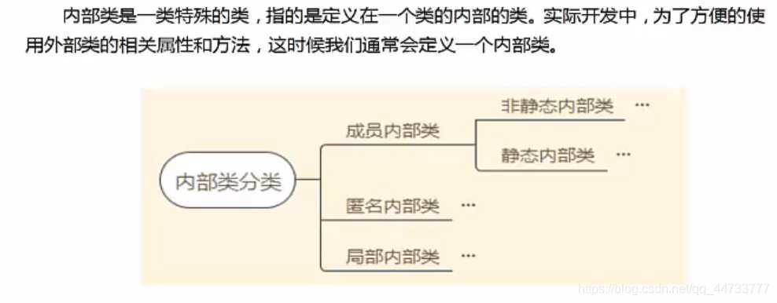

# Java 内部类
1. 内部类介绍

   - 内部类可以使用 public、private、protected、default、static 修饰符修饰，而外部顶级类只能使用 public、default 修饰符修饰
   - 内部类只是一个编译时的概念，编译成功后，就会成为两个不同的类，内部类会成为外部类的成员，并且会生成一个外部类对象，通过外部类对象调用内部类对象
   - 对于一个名为 Outer 的外部类和其内部定义的内部类 Inner，编译后，会生成两个类，一个是 Outter.class，一个是 Outter$Inner.class

2. 内部类的作用
   - 内部类通过了更好的封装，只能让外部类直接访问，不允许同一个包中的其他其他类直接访问
   - 内部类可以直接访问外部类的私有属性，内部了被当成其外部类的成员，但外部了不能访问内部类的属性和方法

## 非静态内部类
- 非静态内部类必须寄存在一个外部类中，并且内部类不能声明为 static
  - 因此，如果有一个非静态内部类对象，那么一定存在对应的外部类对象，非静态内部类对象单独属于外部类对象，并且只能通过外部类对象访问
- 非静态内部类可以直接访问外部类的成员，但外部类不能直接访问非静态内部类的成员
- 非静态内部类不能有静态成员变量、静态方法和静态代码块
- 内部类访问成员变量要点：
  - 访问外部类成员变量：外部类.this.成员变量名
  - 访问外部类成员方法：外部类.this.成员方法名()
  - 访问内部类成员变量：this.成员变量名
- **例：**
    ```java
    /**
     * 内部类测试
     * @author The Mutens
     *
     */
    //外部类
    public class Outter {
        private int value=100;
        
        public void show(){
            Inner inner2=new  Inner();   //在外部类方法中创建内部类对象
            System.out.println("我是外部类的方法！");
            inner2.showInner();
        }
        
        public class Inner{
            private String str1="内部类属性";
            private int value=20;
            public void showInner(){
                System.out.println("我是内部类方法！");
                System.out.println(str1);
                System.out.println(value);
                System.out.println(Outter.this.value);//通过Outter.this.value调用与内部类同名的外部类属性
                //show();   //内部类可以直接调用外部类的成员属性和成员方法
            }			
        }
        
        public static void main(String args[]){
            Outter.Inner inner1=new Outter().new Inner();//第一种创建内部类对象的方式
            inner1.showInner();
            
            Outter outter1=new Outter();
            Outter.Inner inner3=outter1.new Inner();  //第二种创建内部类的方式
            outter1.show();
            inner3.showInner();
        }
    }
    ```


## 静态内部类
- 静态内部类必须声明为 static
- 静态内部类不能访问外部类的非静态成员变量和方法，可以访问外部类的静态成员变量和方法
- 静态内部类可以看做外部类的一个静态成员
- **例：**
    ```java
    /**
     *测试静态内部类
     * @author TheMutents
     *
     */
    public class Outter_1 {//外部类
        private int value1=100;
        private static int value2=200;
        static String str="外部类字符串";
        
        static void outter(){
            System.out.println(new Outter_1().value1);
        }
        
        static class Inner1{//静态内部类
            private int value=300;
            
            public void test(){
                //System.out.println(value)；静态内部类不能访问外部类的非静态成员
                outter();
                System.out.println(value2);
                System.out.println(str);//静态内部类可以直接调用外部类的静态成员
            }
            
            public static void test1(){
                System.out.println(new Inner1().value);
            }
        }
        
        
        public static void main(String args[]){
            new Outter_1.Inner1().test();//创建静态内部类对象调用静态内部类实例方法
            Outter_1.Inner1.test1();//用类名来调用静态内部类的静态方法
        }
    
    }
    
    ```


## 匿名内部类
- 匿名内部类只能使用一次，不能重复使用
- 适合场景：键盘监听操作等， 在安卓开发中、awt、swing 开发中常见
- **例：**
    ```java
    /**
     * 测试匿名内部类
     * @author TheMutents
     *
     */
    public class AnonymousClass {
        public void test(A11 a){
            a.run();
        }
        
        public static void main(String args[]){
            new AnonymousClass().test(new B11());//1.创建B11类的对象作为test()方法的实参
            
            new AnonymousClass().test(new A11(){//匿名内部类，一次性使用
    
                @Override
                public void run() {
                    System.out.println("匿名内部类实现接口A的run()方法");
                    
                }});
        }
        
    }
    
    
    //接口A11
    interface A11{
        void run();
    }
    
    //实现接口A11的类，可以反复使用
    class B11 implements A11{
    
        @Override
        public void run() {
            System.out.println("普通类实现接口A的run()方法");
            
        }
        
    }
    ```
- 注意：
  - 匿名内部类没有访问修饰符
  - 匿名内部类没有名字，因此没有构造函数

## 局部内部类
- 定义在方法中，作用域只限于方法内，称为局部内部类
- 局部内部类的使用主要是用来解决比较复杂的问题
  - 比如：想创建一个类来辅助我们解决问题，但是这个类只在方法中用到，因此我们希望这个类只在方法中创建，而不是在类中创建
- 局部内部类和成员一样被编译，只是它的作用域发生了改变，只能在方法内部使用
- 局部内部类在实际开发中应用很少
- **例：**
    ```java
    /**
     * 测试局部内部类
     * @author TheMutents
     *
     */
    public class LocalInnerClass {
        public void test(){
            class LocalInnerClass_1{//局部内部类作用域限于方法内部
                public void show(){
                    System.out.println("局部内部类");
                }
            }
            new LocalInnerClass_1().show();
        }
        
        public static void main(String args[]){
            new LocalInnerClass().test();//调用test()方法
        }
    }
    ```
