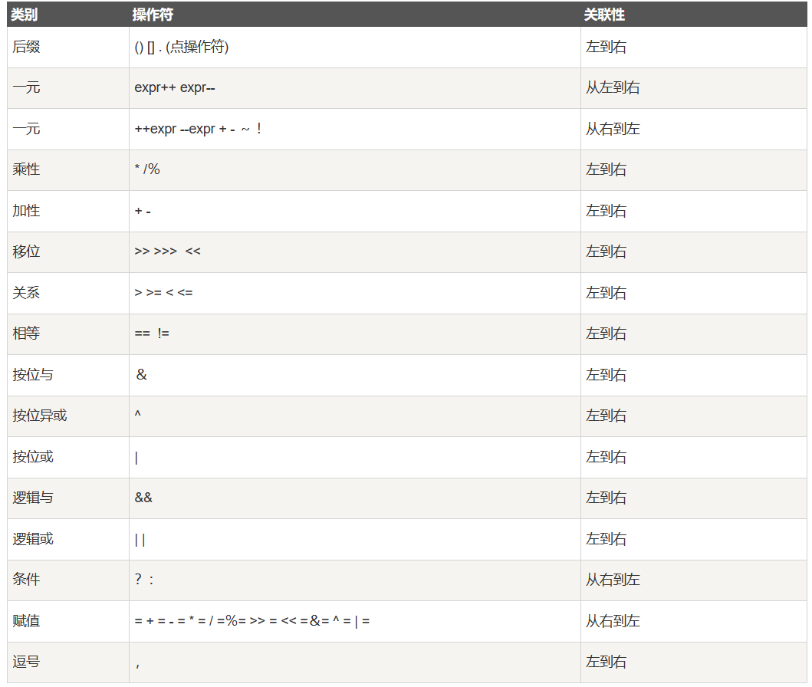

# Java 基础
## 变量（variable）
- 变量本质是一个“可操作的空间”

- java 语言的整形常数默认为 int 型，声明 long 类型可以后加 `l` 或者 `L` 

- float 类型的数值有一个后缀 `F` 或者 `f`
- 没有后缀的浮点数默认为 double 类型
  - double 类型的浮点数值也可添加后缀 `d` 或者 `D`，明确其为double类型

- 浮点数是不精确的，尽量不要进行比较

## 逻辑运算符与位运算符
- 短路与：`&&`
- 短路或：`||`
- 逻辑与、或、非、异或：`&`、`|`、`!`、`^`
- 按位取反、与、或、异或：`~`、`&`、`|`、`^`
- 左移`<<`：左移一位相当于乘2
- 右移`>>`:右移一位相当于除以2取商
- 例：3*2怎么最快，左移一位 ：3<<1

## 字符串连接
- 连接符 `+`：可连接string类型；
- 连接char类型时，会将char类型的字符的 Unicode 值相加。
- 技巧：可以通过加`"" +`将整个运算转为字符串连接操作!
  ```java
  c = c1 + c2;  // Unicode 值相加
  c = "" + c1 + c2; // 字符串连接
  ```


## 条件运算符（三元运算符）
- `x?y:z` 相当于 `if...else` 语句
  ```java
  score = score > 60 ? "及格" : "不及格";
  ```
  等价于
  ```java
  if(score > 60){
    score = "及格";
  }else{
    score = "不及格";
  }
  ```
## 运算符优先级

- 逻辑与、或、非开发中比较常用需熟悉其优先级
  - ! > && > ||
  - 例如：`a || b && c` 等价于 `a || (b && c)`

## 自动类型转换
- 数据类型的自动转换：容量小的数据类型可以自动转化为容量大的数据类型
- 特例：整形常量是 int 类型，但是可以自动转化为 byte，short，char，只要不超过对应类型的表数范围

## 循环
```java
while（ture）{

}
```
无限循环相当于
```java
for( ; ; ){

}
```