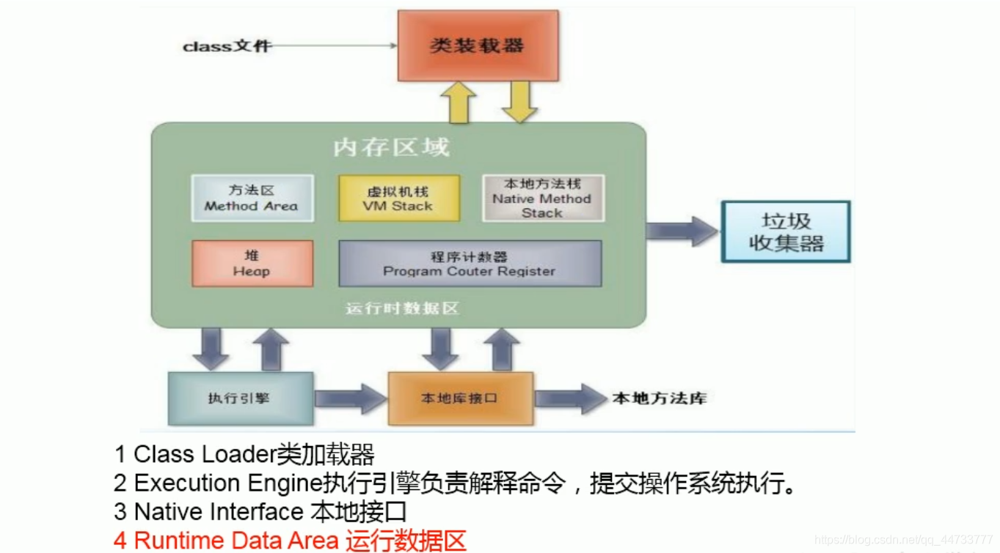
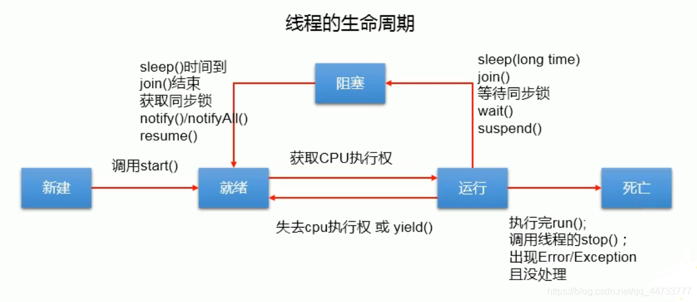

# Java 多线程

## 程序、进程、线程
- 程序(program)是为完成特定任务、用某种语言编写的一组指令的集合。即指一段静态的代码，静态对象。
- 进程(process)是程序的一次执行过程，或是正在运行的一个程序。
  - 是一个动态的过程:有它自身的产生、存在和消亡的过程（生命周期）
    - 如:运行中的QQ，运行中的MP3播放器
  - 程序是静态的，进程是动态的
  - 进程作为资源分配的单位，系统在运行时会为每个进程分配不同的内存区域
- 线程(thread)，进程可进一步细化为线程，是一个程序内部的一条执行路径
  - 若一个进程同一时间并行执行多个线程，就是支持多线程的
  - 线程作为调度和执行的单位，每个线程拥有独立的运行栈和程序计数器(pc)，线程切换的开销小
  - 一个进程中的多个线程共享相同的内存单元/内存地址空间
    - 它们从同一堆中分配对象，可以访问相同的变量和对象。这就使得线程间通信更简便、高效。
    - 但多个线程操作共享的系统资源可能就会带来安全的隐患

- 单核 CPU 和多核 CPU 的理解
  - 单核CPU，其实是一种假的多线程，因为在一个时间单元内，也只能执行一个线程的任务。
    - 例如:虽然有多车道，但是收费站只有一个工作人员在收费，只有收了费才能通过，那么CPU就好比收费人员。如果有某个人不想交钱，那么收费人员可以把他“挂起”(晾着他，等他想通了，准备好了钱，再去收费)。但是因为 CPU 时间单元特别短，因此感觉不出来。
    - 如果是多核的话，才能更好的发挥多线程的效率(现在的服务器都是多核的)
    - 一个 Java 应用程序 java.exe，其实至少有三个线程: 
      - `main()` 主线程
      - `gc()` 垃圾回收线程
      - 异常处理线程。当然如果发生异常，会影响主线程
- 并行与并发
  - 并行:多个 CPU 同时执行多个任务
    - 比如:多个人同时做不同的事
  - 并发:一个 CPU(采用时间片)同时执行多个任务。
    - 比如:秒杀、多个人做同一件事

## 多线程
- 何时需要多线程
  - 程序需要同时执行两个或多个任务，
  - 程序需要实现一些需要等待的任务时，如用户输入、文件读写操作、网络操作、搜索等
  - 需要一些后台运行的程序时

- 使用多线程的优点
  - 背景:以单核 CPU 为例，只用单个线程先后完成多个任务(调用多个方法)，肯定比用多个线程来完成用的时间更短，为何仍需多线程呢?
  - 多线程程序的优点:
    1. 提高应用程序的响应。对图形化界面更有意义，可增强用户体验
    2. 提高计算机系统 CPU 的利用率
    3. 改善程序结构。将既长又复杂的进程分为多个线程，独立运行，利于理解和修改

- JVM 内存结构图
  

### 线程的调度
- 线程调度策略
  - 时间片
  - 抢占式:高优先级的线程抢占 CPU

- Java 程序线程的调度方法
  - 同优先级线程组成先进先出队列(先到先服务)，使用时间片策略
  - 对高优先级，使用优先调度的抢占式策略

### Thread
- 线程的创建和启动
  - Java 语言的 JVM 允许程序运行多个线程，它通过 java.lang.Thread 类来体现
  
- Thread 类的特性
  - 每个线程都是通过某个特定 Thread 对象的 `run()` 方法来完成操作的，经常把 `run()` 方法的主体称为线程体
  - 通过该 Thread 对象的 `start()` 方法来启动这个线程，而非直接调用 `run()`

- Thread 类的方法

  | 方法                           | 说明                                                         |
  | ------------------------------ | ------------------------------------------------------------ |
  | void start()                   | 启动线程，并执行对象的 run() 方法                            |
  | run()                          | 线程在被调度时执行的操作                                     |
  | String getName()               | 返回线程的名称                                               |
  | void setName(String name)      | 设置该线程名称                                               |
  | static Thread currentThread()  | 返回当前线程。在 Thread 子类中就是this，通常用于主线程和Runnable 实现类 |
  | static void yield()            | 线程让步。暂停当前正在执行的线程，把执行机会让给优先级相同或更高的线程；若队列中没有同优先级的线程，忽略此方法 |
  | join()                         | 当某个程序执行流中调用其他线程的 `join()` 方法时，调用线程将被阻塞，直到 `join()` 方法加入的 join 线程执行完为止；低优先级的线程也可以获得执行 |
  | static void sleep(long millis) | 令当前活动线程在指定时间段内放弃对CPU控制,使其他线程有机会被执行,时间到后重排队；抛出 InterruptedException 异常 |
  | stop()                         | 强制线程生命期结束，不推荐使用                               |
  | boolean isAlive()              | 返回 boolean，判断线程是否还活着                             |
  | getPriority()                 | 返回线程的优先级                                             |
  | setPriority(int newPriority) | 设置线程的优先级                                             |

    ```java
    /**
     * 测试Thread类中的常用方法
     * @author Lhk
     *
     */
    public class ThreadMethordTest {
        public static void main(String[] args) {
            MyThread3 thread3 = new MyThread3();
            thread3.setName("线程1");
            thread3.start();
            
            //给主线程设置名字
            Thread.currentThread().setName("主线程");
            for(int i=0;i<100;i++){
                if(i%2==0){
                    System.out.println(Thread.currentThread().getName()+":"+i);
                }
                if(i==20){
                    try {
                        thread3.join();
                    } catch (InterruptedException e) {
                        // TODO Auto-generated catch block
                        e.printStackTrace();
                    }
                }
            }
            MyThread3 thread4 = new MyThread3("线程2");
            thread4.start();
            System.out.println(thread4.isAlive());
        }
    }
    
    class MyThread3 extends Thread{
        @Override
        public void run() {
            for(int i=0;i<100;i++){
                if(i%2==0){
                    try {
                        sleep(100);
                    } catch (InterruptedException e) {
                        e.printStackTrace();
                    }
                    System.out.println(Thread.currentThread().getName()+":"+i);
                }
                if(i%20==0){
                    Thread.yield();//线程让步
                }
            }
        }
        
        public MyThread3(String name){
            super(name);
        }
    
        public MyThread3() {
            
        }
    }
    ```

### 线程的优先级
  - Thread 类中有三个常量，分别表示线程的优先级：
    - `MIN PRIORITY`:1
    - `NORM PRIORITY`:5
    - `MAX PRIORITY`:10
  - Thread 类中的 `setPriority()` 方法用于设置线程的优先级，`getPriority()` 方法用于获取线程的优先级
    - 说明
      - 线程创建时继承父线程的优先级
      - 低优先级只是获得调度的概率低，并非一定是在高优先级线程之后才被调用
        - 高优先级的线程要抢占低优先级线程 cpu 的执行权。但是只是从概率上讲，高优先级的线程高概率的情况下被执行，并不意味着只有当高优先级的线程执行完以后，低优先级的线程才执行

    ```java
    public class ThreadMethordTest {
        public static void main(String[] args) {
            MyThread3 thread3 = new MyThread3();
            thread3.setName("线程1");//设置线程名字
            thread3.setPriority(Thread.MAX_PRIORITY);//设置线程优先级
            thread3.start();
            
            //给主线程设置名字
            Thread.currentThread().setName("主线程");
            Thread.currentThread().setPriority(Thread.MIN_PRIORITY);
            for(int i=0;i<100;i++){
                if(i%2==0){
                    System.out.println(Thread.currentThread().getName()+"：优先级："+Thread.currentThread().getPriority()+":"+i);
                }
            }
            
            MyThread3 thread4 = new MyThread3("线程2");
            thread4.start();
            System.out.println(thread4.isAlive());
        }
    }
    
    class MyThread3 extends Thread{
        @Override
        public void run() {
            for(int i=0;i<100;i++){
                if(i%2==0){
                    System.out.println(Thread.currentThread().getName()+"：优先级："+getPriority()+":"+i);
                }
                if(i%20==0){
                    Thread.yield();//线程让步
                }
            }
        }
        
        public MyThread3(String name){
            super(name);
        }
    
        public MyThread3() {
            
        }
    }
    ```
    
### 线程的分类
  - Java 中的线程分为两类:一种是守护线程，一种是用户线程
  - 它们在几乎每个方面都是相同的，唯一的区别是判断 JVM 何时离开
  - 守护线程是用来服务用户线程的，通过在 `start()` 方法前调用 `thread.setDaemon(true)` 可以把一个用户线程变成一个守护线程
  - Java 垃圾回收就是一个典型的守护线程
  - 若 JVM 中都是守护线程，当前 JVM 将退出

### 线程的生命周期
- JDK 中用 Thread.State 类定义了线程的几种状态
  - 要想实现多线程，必须在主线程中创建新的线程对象。Java 语言使用 Thread 及其子类的对象来表示线程，在它的一个完整的生命周期中通常要经历如下的种状态:
    - **新建**:当一个 Thread 类或其子类的对象被声明并创建时，新生的线程对象处于新建状态
    - **就绪**:处于新建状态的线程被 `start()` 后，将进入线程队列等待 CPU 时间片，此时它具备了运行的条件，只是没分配到CPU资源
    - **运行**:当就绪的线程被调度并获得 CPU 资源时,便进入运行状态，`run()` 方法定义了线程的操作和功能
    - **阻塞**:在某种特殊情况下，被人为挂起或执行输入输出操作时，让出 CPU 并临时中止自己的执行，进入阻塞状态
    - **死亡**:线程完成了它的全部工作或线程被提前强制性地中止或出现异常导致结束
  
  


### 线程的创建和使用
#### 创建线程方式一：继承 Thread 类
1. 创建一个继承于 Thread 类的子类
2. 重写 Thread 类的 `run()`
3. 创建 Thread 类的子类对象
4. 通过此对象调用 `start()`

```java
/**
 * 例子：遍历100以内所有的偶数
 * @author Lhk
 *
 */
class MyThread extends Thread{
	@Override
	public void run() {
		for(int i=0;i<100;i++){
			if(i%2==0){
				System.out.println(i);
			}
		}
	}
}

public class Thread_Test_01 {
	public static void main(String[] args) {
		MyThread myThread=new MyThread();
		myThread.start();//启动新线程
		//在主线程中执行
		for(int i=0;i<100;i++){
			if(i%2==0){
				System.out.println("********main()******");
			}
		}
	}
	
}
```

```java
/**
 * 例子：创建3个窗口买票，总票数为100张
 * 使用继承Thread类的方式实现
 * 存在线程安全问题
 * @author Lhk
 *
 */
class Window extends Thread{
	private static int total=100;
	
	@Override
	public void run() {
		while(true){
			if(total > 0){
				System.out.println(getName()+":卖票，票号："+total);
				total--;
			}else{
				break;
			}
		}
	}
}

public class WindowTest {
	public static void main(String[] args) {
		Window w1=new Window();
		Window w2=new Window();
		Window w3=new Window();
		
		w1.setName("窗口一");
		w2.setName("窗口二");
		w3.setName("窗口三");

		w1.start();
		w2.start();
		w3.start();
	}
}
```

```java
/**
 * 例子：创建两个分线程，一个遍历100以内的偶数，一个遍历100以内的奇数
 * @author Lhk
 *
 */
public class ThreadDemo {
	public static void main(String[] args) {
		//创建Thread类的匿名子类的方式
		new Thread(){
			public void run() {
				for(int i=0;i<100;i++){
					if(i%2==0){
						System.out.println(Thread.currentThread().getName()+":"+i);
					}
				}
			};
		}.start();
		
		new Thread(){
			public void run() {
				for(int i=0;i<100;i++){
					if(i%2!=0){
						System.out.println(Thread.currentThread().getName()+":"+i);
					}
				}
			};
		}.start();
	}
}

class MyThread1 extends Thread{
	@Override
	public void run() {
		for(int i=0;i<100;i++){
			if(i%2==0){
				System.out.println(Thread.currentThread().getName()+":"+i);
			}
		}
	}
}
class MyThread2 extends Thread{
	@Override
	public void run() {
		for(int i=0;i<100;i++){
			if(i%2!=0){
				System.out.println(Thread.currentThread().getName()+":"+i);
			}
		}
	}
}
```

#### 创建线程方式二：实现 Runnable 接口
1. 创建一个实现了 Runnable 接口的类
2. 实现类去实现 Runnable 中的抽象方法：`run()`
3. 创建实现类的对象
4. 将此对象作为参数传递到 Thread 类的构造器中，创建 Thread 类的对象
5. 通过 Thread 类的对象调用 `start()`

```java
/**
 * 创建多线程方式二
 * @author Lhk
 *
 */
class MyThread4 implements Runnable{

	@Override
	public void run() {
		for(int i=0;i<100;i++){
			if(i%2==0){
				System.out.println(Thread.currentThread().getName()+":"+i);
			}
		}
	}
}

public class Thread_Test_02 {
	public static void main(String[] args) {
		MyThread4 mt = new MyThread4();
		Thread t = new Thread(mt);
		t.setName("线程1");
		t.start();
		
		//再启动一个线程，遍历100以内的偶数
		Thread t1 = new Thread(mt);
		t1.setName("线程2");
		t1.start();
	}
}
```

```java
/**
 * 例子：创建3个窗口买票，总票数为100张
 * 使用实现 Runnable 接口的方式实现
 * @author Lhk
 * 存在线程安全问题
 */
class Window1 implements Runnable{
	private int ticket=100;
	@Override
	public void run() {
		while (true){
			if(ticket>0){
				System.out.println(Thread.currentThread().getName()+":卖票，票号为："+ticket);
				ticket--;
			}else{
				break;
			}
		}
	}
}

public class WindowTest1 {
	public static void main(String[] args) {
		Window1 w1 = new Window1();
		
		Thread t1 = new Thread(w1);
		Thread t2 = new Thread(w1);
		Thread t3 = new Thread(w1);

		t1.setName("窗口一");
		t2.setName("窗口二");
		t3.setName("窗口三");
		
		t1.start();
		t2.start();
		t3.start();
	}
}
```

#### 创建线程方式三：实现 Callable 接口
- JDK5.0 新增线程创建方式
- 与使用 Runnable 相比，Callable 功能更强大些
  - 相比 `run()` 方法，`call()` 可以有返回值
  - `call()`可以抛出异常，被外面的操作捕获，获取异常的信息
  - Callable 是支持泛型的
  - 在使用时需要借助 FutureTask 类，比如获取返回结果

- Future 接口 
  - 可以对具体 Runnable、Callable 任务的执行结果进行取消、查询是否完成、获取结果等
  - FutureTask 是 Future 接口的唯一的实现类 
  - FutureTask 同时实现了 Runnable,Future 接口
    - 它既可以作为 Runnable 被线程执行，又可以作为 Future 得到 Callable 的返回值

```java
import java.util.concurrent.Callable;
import java.util.concurrent.ExecutionException;
import java.util.concurrent.FutureTask;

/**
 * 创建线程方式三：实现Callable接口
 * @author Lhk
 *
 */
//1.创建一个Callable接口的实现类
class numThread implements Callable<Integer>{
	//2.实现call()，将此线程需要执行的操作声明在call()中
	@Override
	public Integer call() throws Exception {
		int sum=0;
		for(int i=1;i<=100;i++){
			if(i%2==0){
				System.out.println(i);
				sum += i;
			}
		}
		return sum;
	}
}

public class ThreadNew {
	public static void main(String[] args) {
		//3.创建Callable接口实现类的对象
		Callable<Integer> numThread = new numThread();
		//4.将Callable接口实现类对象作为参数传递到FutureTask构造器中，创建FutureTask的对象
		FutureTask<Integer> futureTask = new FutureTask<>(numThread);
		//5.将FutureTask的对象作为参数传递到Thread类的构造器中，创建Thread对象，并调用start()
		Thread thread = new Thread(futureTask);
		thread.start();
		//6.获取Callable中call方法的返回值
		//get()返回值即为FutureTask构造器参数Callable实现类重写的call()的返回值
		try {
			Integer sum = futureTask.get();
			System.out.println("1-100内偶数总和："+sum);
		} catch (InterruptedException | ExecutionException e) {
			e.printStackTrace();
		}
	}
}
```

#### 创建线程方式四：使用线程池
- 为何使用线程池
  - 背景:经常创建和销毁、使用量特别大的资源，比如并发情况下的线程对性能影响很大
  - 思路:提前创建好多个线程，放入线程池中，使用时直接获取，使用完放回池中。可以避免频繁创建销毁，实现重复利用。类似生活中的公共交通工具。
  - 好处:
    - 提高响应速度(减少了创建新线程的时间)降低资源消耗(重复利用线程池中线程，不需要每次都创建)
    - 可以通过配置一些线程池参数来管理线程，便于线程管理
      - `corePoolSize` : 核心池的大小
      - `maximumPoolSize` : 最大线程数
      - `keepAliveTime` : 线程没有任务时最多保持多长时间后会终止

- 线程池相关 API
  - JDK5.0 起提供了线程池相关 API: `ExecutorService` 和 `Executors`
    - `ExecutorService`:真正的线程池接口。常见子类 `ThreadPoolExecutor` 
      - 方法
        - `void execute(Runnable command)` : 执行任务/命令，没有返回值，一般用来执行 Runnable
        - `<T>Future<T>submit(Callable<T> task)` : 执行任务，有返回值，一般又来执行 Callable
        - `void shutdown()` : 关闭连接池
    - Executors:工具类、线程池的工厂类，用于创建并返回不同类型的线程池
      - `Executors.newCachedThreadPool()` : 创建一个可根据需要创建新线程的线程池
      - `Executors.newFixedThreadPool(n)` : 创建一个可重用固定线程数的线程池
      - `Executors.newSingleThreadExecutor()` : 创建一个只有一个线程的线程池
      - `Executors.newScheduledThreadPool(n)` : 创建一个线程池，它可安排在给定延迟后运行命令或者定期地执行


```java

import java.util.concurrent.Callable;
import java.util.concurrent.ExecutorService;
import java.util.concurrent.Executors;

/**
 * 创建线程方式四：使用线程池
 * @author Lhk
 *
 * 面试题：创建多线程有几种方式？四种
 */
class NumberThread implements Runnable{
	@Override
	public void run() {
		for(int i=1;i<=100;i++){
			if(i%2==0){
				System.out.println(Thread.currentThread().getName()+":"+i);
			}
		}
	}
}

class NumberThread1 implements Callable<Integer>{
	@Override
	public Integer call() throws Exception {
		for(int i=1;i<=100;i++){
			if(i%2!=0){
				System.out.println(Thread.currentThread().getName()+":"+i);
			}
		}
		return null;
	}
}

public class ThreadPool {
	public static void main(String[] args) {
		//1.创建线程池对象
		ExecutorService pool = Executors.newFixedThreadPool(10);
		
		//设置线程池属性
        //ThreadPoolExecutor pool1=(ThreadPoolExecutor) pool;
        //pool1.setCorePoolSize(15);
        //pool1.setKeepAliveTime(0, null);
		
		//2.执行指定的线程操作。需要提供实现Runnable或Callable接口实现类的对象
		pool.execute(new NumberThread());//适合用于Runnable
		pool.submit(new NumberThread1());//适合用于Callable
		
		//3.关闭线程池
		pool.shutdown();
	}
}
```

### 线程的同步
- 线程同步：多个线程操作同一个资源的情况下，只有**一个线程**能操作该资源，其他线程等待
  - 主要解决线程的安全问题
  - 当多个线程操作同一个资源的时候，就会产生线程安全问题
  
- 例子：创建3个窗口买票，总票数为100张
  - 问题：卖票过程中出现了重票，错票（线程安全问题）
  - 问题出现的原因：
    - 当某个线程操作车票的过程中，尚未完成时，其他线程参与进来，也操作车票
  - 解决方案：
    - 当一个线程 a 在操作 ticket 的时候，其他的线程不能参与进来，直到线程 a 操作完 ticket 时，其他线程才可以开始操作 ticket，这种情况即使线程出现阻塞，也不能被改变

- 在 Java 中，可以通过同步机制，来解决线程的安全问题
  1. 方式一：（同步代码块）
     ```java
     synchronized(同步监视器){
         //需要被同步的代码
     }
     ```
     - 操作共享数据的代码，即为需要被同步的代码
       - 共享数据：多个线程共同操作的变量
     - 同步监视器：俗称：锁，任何一个类的对象都可以充当锁
       - 多个线程必须要共用同一把锁
       - 在实现 Runnable 接口创建多线程的方式中，可以考虑使用 this 充当同步监视器
       - 在继承 Thread 类创建多线程的方式中，慎用 this 充当同步监视器，考虑使用当前类充当同步监视器

  2. 方式二：同步方法
     - 如果操作共享数据的代码完整的声明在一个方法中，我们不妨将此方法声明为同步的
     - 同步方法仍然涉及到同步监视器，只是不需要我们显式的声明
     - 非静态的同步方法，同步监视器是: `this`
     - 静态的同步方法，同步监视器是:**当前类本身**

  使用同步代码块解决上述例子线程安全问题

  ```java
  package com.lhk.Thread;
  /**
   * 例子：创建3个窗口买票，总票数为100张
   * 使用实现 Runnable 接口的方式实现该例子
   * 
   * 存在线程安全问题：使用同步代码块解决
   * @author Lhk
   *
   */
  class Window1 implements Runnable{
      
      private int ticket=100;
      
      @Override
      public void run() {
          while (true){
          synchronized(this){  //此时的this：唯一的Window1对象
              if(ticket>0){
                  try {
                      Thread.sleep(5);
                  } catch (InterruptedException e) {
                      e.printStackTrace();
                  }
                  System.out.println(Thread.currentThread().getName()+":卖票，票号为："+ticket);
                  ticket--;
              }else{
                  break;
              }
          }
          }
      }
  }
  
  public class WindowTest1 {
      public static void main(String[] args) {
          Window1 w1 = new Window1();
          Thread t1 = new Thread(w1);
          Thread t2 = new Thread(w1);
          Thread t3 = new Thread(w1);
  
          t1.setName("窗口一");
          t2.setName("窗口二");
          t3.setName("窗口三");
          
          t1.start();
          t2.start();
          t3.start();
      }
  }
  ```
  
  ```java
  /**
   * 例子：创建3个窗口买票，总票数为100张
   * 使用同步代码块解决继承 Thread 类的方式存在的线程安全问题
   * 
   * 说明：在继承 Thread 类创建多线程的方式中，慎用 this 充当同步监视器，考虑使用当前类充当同步监视器
   * @author Lhk
   *
   */
  class Window2 extends Thread{
      private static int total=100;
      
      @Override
      public void run() {
          while(true){
              //错误写法,此时 this 代表w1，w2，w3三个对象
              //synchronized(this){
              
              //正确写法
              synchronized(Window2.class){	//Class cla=Window.class，Window2.class只会加载一次
                  if(total > 0){
                      try {
                          sleep(10);
                      } catch (InterruptedException e) {
                          e.printStackTrace();
                      }
                      System.out.println(getName()+":卖票，票号："+total);
                      total--;
                  }else{
                      break;
                  }
              }
          }
      }
  }
  
  public class WindowTest2 {
      public static void main(String[] args) {
          Window2 w1=new Window2();
          Window2 w2=new Window2();
          Window2 w3=new Window2();
          
          w1.setName("窗口一");
          w2.setName("窗口二");
          w3.setName("窗口三");
  
          w1.start();
          w2.start();
          w3.start();
      }
  }
  ```

  使用同步方法块解决上述例子线程安全问题

  ```java
  /**
   * 使用同步方法来解决实现 Runnable 接口的线程安全问题
   * @author Lhk
   *
   */
  class Window3 implements Runnable{
      
      private int ticket=100;
      
      @Override
      public void run() {
          while (true){
              show();
          }
      }
      
      private synchronized void show(){ //默认同步监视器：this
          if(ticket>0){
              try {
                  Thread.sleep(2);
              } catch (InterruptedException e) {
                  e.printStackTrace();
              }
              System.out.println(Thread.currentThread().getName()+":卖票，票号为："+ticket);
              ticket--;
          }
      }
  }
  
  public class WindowTest3 {
      public static void main(String[] args) {
          Window3 w1 = new Window3();
          Thread t1 = new Thread(w1);
          Thread t2 = new Thread(w1);
          Thread t3 = new Thread(w1);
  
          t1.setName("窗口一");
          t2.setName("窗口二");
          t3.setName("窗口三");
          
          t1.start();
          t2.start();
          t3.start();
      }
  }
  ```
  
  ```java
  /**
   * 使用同步方法处理继承 Thread 类方式中的线程安全问题
   * @author Lhk
   *
   */
  class Window4 extends Thread{
      private static int total=100;
      
      @Override
      public void run() {
          while(true){
              show();
          }
      }
      
      //同步监视器t1,t2,t3,此种解决方式错误
      //private synchronized void show(){ 
      
      private static synchronized void show(){  //同步监视器：Window.class
          if(total > 0){
              try {
                  sleep(2);
              } catch (InterruptedException e) {
                  e.printStackTrace();
              }
              System.out.println(Thread.currentThread().getName()+":卖票，票号："+total);
              total--;
              }
      }
  }
  
  public class WindowTest4 {
      public static void main(String[] args) {
          Window4 w1=new Window4();
          Window4 w2=new Window4();
          Window4 w3=new Window4();
          
          w1.setName("窗口一");
          w2.setName("窗口二");
          w3.setName("窗口三");
  
          w1.start();
          w2.start();
          w3.start();
      }
  }
  ```

- 同步的方式优势和局限性：
  - 优势: 解决了线程安全问题
  - 局限性: 操作同步代码时，只能有一个线程参与，其他线程等待，相当于是一个单线程的过程，效率低

### 线程的死锁问题
- 不同的线程分别占用对方需要的同步资源不放弃，都在等待对方放弃自己需要的同步资源，就形成了线程的死锁
- 出现死锁后，不会出现异常，不会出现提示，只是所有的线程都处于阻塞状态，无法继续

- 死锁的必要条件：
  - 互斥条件（Mutual Exclusion）： 至少有一个资源必须在同一时间只能被一个进程或线程独占使用。即资源的使用是排他的，一个资源在被占用时，其他需要该资源的进程必须等待
  - 请求与保持条件（Hold and Wait）： 进程已经持有至少一个资源，但又申请新的资源，而该资源已被其他进程占有，此时该进程不会释放已占有的资源，而是选择等待
  - 不剥夺条件（No Preemption）： 已分配给某个进程的资源在未使用完毕之前，不能被强制性地夺走，即资源分配是不可抢占的
  - 循环等待条件（Circular Wait）： 存在一个进程资源等待的循环链，即进程集合中的每个进程都在等待链中的下一个进程所占有的资源，形成环路等待
- 为防止死锁，通常需要通过设计策略破坏这些条件之一

```java
/**
 * 死锁的例子
 */
public class Thread_Test_03 {
	public static void main(String[] args) {
		StringBuffer s1 = new StringBuffer();
		StringBuffer s2 = new StringBuffer();
		
		new Thread(){
			public void run() {
				synchronized (s1) {
					s1.append("a");
					s2.append("1");
					
					try {
						sleep(100);
					} catch (InterruptedException e) {
						e.printStackTrace();
					}
					
					synchronized (s2) {
						s1.append("b");
						s2.append("2");
					}
				}
				System.out.println(s1);
				System.out.println(s2);
			};
		}.start();
		
		new Thread(new Runnable() {
			
			@Override
			public void run() {
				synchronized (s2) {
					s1.append("c");
					s2.append("3");
					
					try {
						Thread.sleep(100);
					} catch (InterruptedException e) {
						e.printStackTrace();
					}
					
					synchronized (s1) {
						s1.append("d");
						s2.append("4");
					}
				}
				System.out.println(s1);
				System.out.println(s2);
			}
		}).start();
	}
}
```

### Lock
- 从 JDK5.0 开始，Java 提供了更强大的线程同步机制
  - 通过显式定义同步锁对象来实现同步。同步锁使用 Lock 对象充当
- java.util.concurrent.locks.Lock 接口是控制多个线程对共享资源进行访问的工具
  - 锁提供了对共享资源的独占访问，每次只能有一个线程对 Lock 对象加锁，线程开始访问共享资源之前应先获得 Lock 对象
  - ReentrantLock 类实现了 Lock，它拥有与 synchronized 相同的并发性和内存语义，在实现线程安全的控制中，比较常用的是 ReentrantLock，可以显式加锁、释放锁

  ```java
  import java.util.concurrent.locks.ReentrantLock;
  
  /**
   * 解决线程安全问题的方式三：Lock锁 
   * @author Lhk
   *
   */
  public class LockTest {
      public static void main(String[] args) {
          Window5 w = new Window5();
          
          Thread t1=new Thread(w);
          Thread t2=new Thread(w);
          Thread t3=new Thread(w);
          
          t1.setName("窗口一");
          t2.setName("窗口二");
          t3.setName("窗口三");
          
          t1.start();
          t2.start();
          t3.start();
      }
  }
  
  class Window5 implements Runnable{
      
      private int ticket = 100;
      //1.实例化 ReentrantLock 对象
      private ReentrantLock lock=new ReentrantLock();
      
      @Override
      public void run() {
          while(true){
              try {
                  //2.调用锁定方法：lock()
                  lock.lock();
                  
                  if(ticket>0){
                      try {
                          Thread.sleep(20);
                      } catch (InterruptedException e) {
                          e.printStackTrace();
                      }
                      System.out.println(Thread.currentThread().getName()+"：售票，票号为："+ticket);
                      ticket--;
                  }else{
                      break;
                  }
              } finally {
                  //3.调用解锁方法：unlock()
                  lock.unlock();
              }
          }
      }
  }
  ```

- synchronized 与 Lock 的对比
  1. Lock 是显式锁(手动开启和关闭锁，别忘记关闭锁)，synchronized 是隐式锁，出了作用域自动释放
  2. Lock 只有代码块锁，synchronized 有代码块锁和方法锁
  3. 使用 Lock 锁，JVM 将花费较少的时间来调度线程，性能更好。并且具有更好的扩展性(提供更多的子类)
  4. synchronized 机制在执行完相应的同步代码以后，自动的释放同步监视器
  5. 二者都可以解决线程安全问题

- 优先使用顺序:
  - Lock》同步代码块(已经进入了方法体，分配了相应资源)》同步方法(在方法体之外)


### 线程的通信
- 涉及到的三个方法:

   | 方法名 | 作用 |
   | ---- | ---- |
   | wait() | 一旦执行此方法，当前线程就进入照塞状态，并释放同步监视器 |
   | notify() | 一旦执行此方法，就会唤醒被wait()的一个线程。如果有多个线程被wait，就唤醒优先级高的那个 |
   | notifyAlL() | —旦执行此方法，就会唤醒所有被wait的线程 |
   
- 说明:
  1. `wait()`,`notify()`,`notifyALL()` 三个方法必须使用在同步代码块或同步方法中
  2. `wait()`,`notify()`,`notifyALL()` 三个方法的调用者必须是同步代码块或同步方法中的同步监视器,否则，会出现 IllegalMonitorStateException 异常
  3. `wait()`,`notify()`,`notifyALL()` 三个方法是定义在 java.Lang.Object 类中

- `sleep()`和`wait()`的异同?
  1. 相同点: 一旦执行方法，都可以使得当前的线程进入阻塞状态
  2. 不同点:
     - 两个方法声明的位置不同: Thread 类中声明`sleep()`, Object 类中声明 `wait()`
     - 调用的要求不同: `sleep()` 可以在任何需要的场景下调用，`wait()` 必须使用在同步代码块或同步方法中
     - 关于是否释放同步监视器：如果两个方法都使用在同步代码块或同步方法中，`sleep()` 不会释放锁，`wait()` 会释放锁

  ```java
  /**
   * 线程通信的例子:使用两个线程打印1-100。线程1，线程2交替打印
   * @author Lhk
   *
   */
  
  class Number implements Runnable{
      private int i=1;
      @Override
      public void run() {
          while(true){
              synchronized (this) {
                  this.notify();//唤醒一个被wait()的线程
                  if(i<=100){
                      try {
                          Thread.sleep(10);
                      } catch (InterruptedException e) {
                          e.printStackTrace();
                      }
                      System.out.println(Thread.currentThread().getName()+":"+i);
                      i++;
                      try {
                          //使得调用wait()方法的线程进入阻塞状态，并且释放同步监视器
                          this.wait(); 
                      } catch (InterruptedException e) {
                          e.printStackTrace();
                      }
                  }else{
                      break;
                  }
              }
          }
      }
  }
  
  public class ThreadCommunication_Test {
      public static void main(String[] args) {
          Number n=new Number();
          Thread t1=new Thread(n);
          Thread t2=new Thread(n);
          
          t1.setName("线程一");
          t2.setName("线程二");
          
          t1.start();
          t2.start();
      }
  }
  ```
  
#### 经典例题:生产者/消费者问题
- 生产者(Producer)将产品交给店员(Clerk)，而消费者(Customer)从店员处取走产品，店员一次只能持有固定数量的产品(比如:20)，如果生产者试图生产更多的产品，店员会叫生产者停一下，如果店中有空位放产品了再通知生产者继续生产;如果店中没有产品了，店员会告诉消费者等一下，如果店中有产品了再通知消费者来取走产品
  - 这里可能出现两个问题:
    - 生产者比消费者快时，消费者会漏掉一些数据没有取到
    - 消费者比生产者快时，消费者会取相同的数据
- 分析：
  1. 多线程问题：生产者线程，消费者线程
  2. 共享数据：店员（产品）
  3. 同步机制解决线程安全问题，三种方法
  4. 涉及线程通信

```java
/**
 * 线程通信的应用: 生产者/消费者问题
 * @author Lhk
 *
 */
class Clerk{
	private int productNum = 0;
	
	//生产产品
	public synchronized void produceProduct() {
		if(productNum<20){
			productNum++;
			System.out.println(Thread.currentThread().getName()+":开始生产第"+productNum+"个产品");
			notify();
		}else{
			//等待
			try {
				wait();
			} catch (InterruptedException e) {
				e.printStackTrace();
			}
		}
	}
	
	//消费产品
	public synchronized void consumeProduct() {
		if(productNum>0){
			System.out.println(Thread.currentThread().getName()+":购买第"+productNum+"个产品");
			productNum--;
			notify();
		}else{
			//等待
			try {
				wait();
			} catch (InterruptedException e) {
				e.printStackTrace();
			}
		}
	}
}

//生产者
class Productor	extends Thread{
	private Clerk clerk;

	public Productor(Clerk clerk) {
		super();
		this.clerk = clerk;
	}
	
	@Override
	public void run() {
		System.out.println(Thread.currentThread().getName()+"：开始生产产品....");
		while(true){
			try {
				Thread.sleep(10);
			} catch (InterruptedException e) {
				e.printStackTrace();
			}
			clerk.produceProduct();
		}
	}
}

//消费者
class Consumer extends Thread{
	private Clerk clerk;

	public Consumer(Clerk clerk) {
		super();
		this.clerk = clerk;
	}
	
	@Override
	public void run() {
		System.out.println(Thread.currentThread().getName()+"：准备购买产品....");
		while(true){
			try {
				Thread.sleep(50);
			} catch (InterruptedException e) {
				e.printStackTrace();
			}
			clerk.consumeProduct();
		}
	}
}

public class ProductTest {
	public static void main(String[] args) {
		Clerk clerk=new Clerk();
		Productor p=new Productor(clerk);
		p.setName("生产者");
	
		Consumer c1=new Consumer(clerk);
		c1.setName("消费者1");
		
		Consumer c2=new Consumer(clerk);
		c2.setName("消费者2");
		
		p.start();
		c1.start();
		c2.start();
	}
}
```


