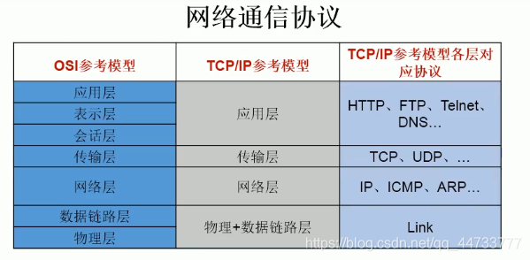
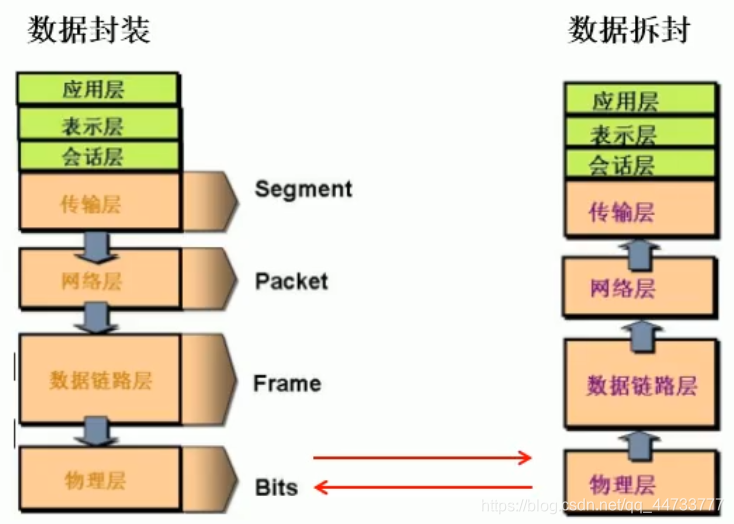
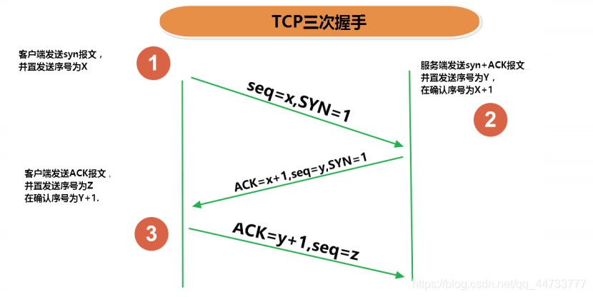
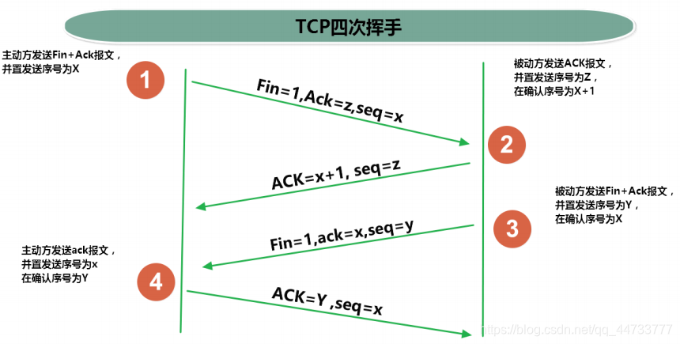
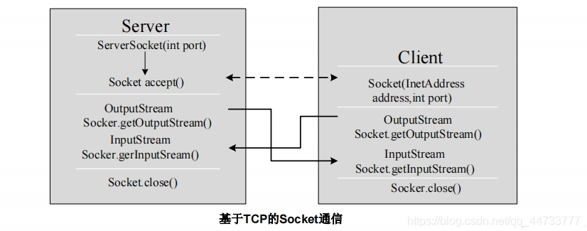

# Java 网络编程

## 网络基础
- 计算机网络:
  - 把分布在不同地理区域的计算机与专门的外部设备用通信线路互连成一个规模大、功能强的网络系统，从而使众多的计算机可以方便地互相传递信息、共享硬件、软件、数据信息等资源。

- 网络编程的目的:
  - 直接或间接地通过网络协议与其它计算机实现数据交换，进行通讯。

- 网络编程中有两个主要的问题:
  - 如何准确地定位网络上一台或多台主机;定位主机上的特定的应用
  - 找到主机后如何可靠高效地进行数据传输

## 如何实现网络中的主机互相通信
- 实现网络中的主机互相通信需要满足以下要素
  1. 通信双方的地址
     - IP
     - 端口号
  2. 一定的规则(即:网络通信协议。有两套参考型)
     - OSI参考模型:模型过于理想化，未能在因特网上进行广泛推广
     - TCP/IP参考模型(或TCP/IP协议):事实上的际标准
     
     
- 网络通信过程

  

## 网络通信要素一：IP 和 端口号

### IP 地址（InetAddress）
- 唯一地标识 Internet 上的计算机(通信实体)
- 本地回环地址(hostAddress):`127.0.0.1` 主机名(hostName): `localhost`

- IP 地址分类
  - 方式一:IPV4 和 IPV6
    - IPV4: 4 个字节组成，4 个 0-255。大概42亿，30亿都在北美，亚洲4亿。2011年初已经用尽。以点分十进制表示，如 `192.168.0.1`
    - IPV6: 128 位(16 个字节)，写成 8 个无符号整数，每个整数用四个十六进制位表示数之间用冒号`:`分开，如: `3ffe:3201:1401:1280:c8f:fe4d:db39:1984`
  - 方式二:公网地址(万维网使用)和私有地址(局域网使用)
    - 192.168 开头的就是私有地址，范围即为 `192.168.0.0 - 192.168.255.255`，专门为组织机构内部使用
- IP 地址特点:不易记忆

- 在 Java 中 `InetAddress` 类代表 IP
  - 通过该类可获取 IP 地址和域名

    ```java
    public class InetAddressTest {
        public static void main(String[] args) throws UnknownHostException {
            InetAddress inet1 = InetAddress.getByName("localhost");//实例化InetAddress
            System.out.println(inet1);//获取域名和地址
            System.out.println(inet1.getHostName());//获取域名
            System.out.println(inet1.getHostAddress());//获取地址
    
            InetAddress inet2 = InetAddress.getLocalHost();//实例化InetAddress
            System.out.println(inet2);
    
            InetAddress inet3 = InetAddress.getByName("172.64.2.83");
            System.out.println(inet3.getHostName());
            System.out.println(inet3.getHostAddress());
            System.out.println(inet3);
    
        }
    }
    ```
    
### 端口号 (Port)
- 端口号标识正在计算机上运行的进程(程序)
- 不同的进程有不同的端口号
- 端口号被规定为一个 16 位的整数，范围 `0 ~ 65535`
- 端口分类:
  - 公认端口: `0 ~ 1023`。
    - 被预先定义的服务通信占用,如:
      - HTTP 占用端口 80
      - FTP 占用端口 21
      - Telnet 占用端口 23
  - 注册端口: `1024 ~ 49151`。分配给用户进程或应用程序。如:
    - Tomcat 占用端口 8080
    - MySQL 占用端口 3306
    - Oracle 占用端口 1521
  - 动态/私有端口: `49152 ~ 65535`
- 网络套接字(Socket): 端口号与 IP 地址的组合

## 网络通信要素二：网络通讯协议
- 网络通信协议:
  - 计算机网络中实现通信必须有一些约定，即通信协议，通信协议对速率、传输代码、代码结构、传输控制步骤、出错控制等制定了标准。

- 问题:网络协议太复杂
  - 计算机网络通信涉及内容很多，比如指定源地址和目标地址，加密解密，压缩解压缩，差错控制，流量控制，路由控制，如何实现如此复杂的网络协议呢?
    - 通信协议分层的思想
      - 在制定协议时，把复杂成份分解成一些简单的成份，再将它们复合起来。最常用的复合方式是层次方式，即同层间可以通信、上一层可以调用下一层，而与再下一层不发生关系。各层互不影响，利于系统的开发和扩展。

### 传输层协议 TCP 和 UDP
- 传输层协议中有两个非常重要的协议:
  - 传输控制协议 TCP (Transmission Control Protocol)
  - 用户数据报协议 UDP (User Datagram Protocol)

- TCP 协议:
  - 使用 TCP 协议前，须先建立 TCP 连接，形成传输数据通道
  - 传输前，采用“三次握手”方式建立 TCP 连接，确保数据传输的可靠性，点对点通信
  - TCP 协议进行通信的两个应用进程: 客户端、服务端
  - 在连接中可进行大数据量的传输
  - 传输完毕，需释放已建立的连接（四次挥手），效率低

  
  

- UDP 协议:
  - 将数据、源、目的封装成数据包，不需要建立连接
  - 每个数据报的大小限制在 64K 内
  - 发送不管对方是否准备好，接收方收到也不确认，故是不可靠的可以广播发送
  - 发送数据结束时无需释放资源，开销小，速度快


### TCP/IP 协议簇
- TCP/IP 以其两个主要协议: 传输控制协议(TCP)和网络互联协议(IP)而得名，实际上是一组协议，包括多个具有不同功能且互为关联的协议。
    - IP(Internet Protocol)协议是网络层的主要协议，支持网间互连的数据通信
- TCP/IP 协议模型从更实用的角度出发，形成了高效的四层体系结构，即物理链路层、IP 层、传输层和应用层


## 基于 Socket 的 TCP 编程
- Java 语言的基于套接字（Socket）编程分为**服务端编程**和**客户端编程**，其通信型如图所示

  

- 例：客户端发送信息给服务器，服务器端将数据显示在控制台上

  ```java
  import org.junit.Test;
  import java.io.*;
  import java.net.InetAddress;
  import java.net.ServerSocket;
  import java.net.Socket;
  
  /**
   * 实现TCP连接的网络编程
   * @author Lhk
   */
  public class TCPTest1 {
  
      @Test
      //客户端
      public void client(){
          Socket scoket = null;
          OutputStream os = null;
          try {
              //1.创建Socket对象，指明服务器端的ip和端口号
              InetAddress localHost = InetAddress.getLocalHost();
              scoket = new Socket(localHost,8899);
              //2.获取一个输出流，用于输出数据
              os = scoket.getOutputStream();
              //3.写出数据
              os.write("你好，我是Lhk，来自客户端".getBytes());
          } catch (IOException e) {
              e.printStackTrace();
          } finally {
              //4.关闭资源
              if(os!=null){
                  try {
                      os.close();
                  } catch (IOException e) {
                      e.printStackTrace();
                  }
              }
              if(scoket!=null){
                  try {
                      scoket.close();
                  } catch (IOException e) {
                      e.printStackTrace();
                  }
              }
          }
      }
  
  //    @Test
  //    //服务器端,使用 BufferedReader 读取数据
  //    public void server()  {
  //        ServerSocket serverSocket = null;
  //        Socket accept = null;
  //        InputStream is = null;
  //        BufferedReader br = null;
  //        try {
  //            serverSocket = new ServerSocket(8899);
  //            accept = serverSocket.accept();
  //            is = accept.getInputStream();
  //            br = new BufferedReader(new InputStreamReader(is));
  //            String str=null;
  //            while((str= br.readLine())!=null){
  //                System.out.println(str);
  //            }
  //        } catch (IOException e) {
  //            e.printStackTrace();
  //        } finally {
  //            if (br!=null){
  //                try {
  //                    br.close();
  //                } catch (IOException e) {
  //                    e.printStackTrace();
  //                }
  //            }
  //            if (is!=null){
  //                try {
  //                    is.close();
  //                } catch (IOException e) {
  //                    e.printStackTrace();
  //                }
  //            }
  //            if (accept != null){
  //                try {
  //                    accept.close();
  //                } catch (IOException e) {
  //                    e.printStackTrace();
  //                }
  //            }
  //            if (serverSocket!=null){
  //                try {
  //                    serverSocket.close();
  //                } catch (IOException e) {
  //                    e.printStackTrace();
  //                }
  //            }
  //        }
  //    }
  
      @Test
      //服务器端,使用 ByteArrayOutputStream 读取数据
      public void server() {
          ServerSocket serverSocket = null;
          Socket accept = null;
          InputStream is = null;
          ByteArrayOutputStream baos= null;
          try {
              //1.创建服务器端的ServerSocket对象，并指服务器的端口号
              serverSocket = new ServerSocket(8899);
              //2.调用accpet方法接收来自客户端的Socket
              accept = serverSocket.accept();
              //3.获取输入流
              is = accept.getInputStream();
              //4.读取输入流中的数据
              baos = new ByteArrayOutputStream();
              byte[] buffer = new byte[5];
              int len;
              while((len= is.read(buffer))!=-1){
                  baos.write(buffer,0,len);
              }
              System.out.println(baos.toString());
              System.out.println("收到了来自于："+accept.getInetAddress().getHostAddress()+"的数据");
          } catch (IOException e) {
              e.printStackTrace();
          } finally {
              //5.关闭资源
              if (baos != null){
                  try {
                      baos.close();
                  } catch (IOException e) {
                      e.printStackTrace();
                  }
              }
              if(is!=null){
                  try {
                      is.close();
                  } catch (IOException e) {
                      e.printStackTrace();
                  }
              }
              if(accept!=null){
                  try {
                      accept.close();
                  } catch (IOException e) {
                      e.printStackTrace();
                  }
              }
              if (serverSocket!=null){
                  try {
                      serverSocket.close();
                  } catch (IOException e) {
                      e.printStackTrace();
                  }
              }
          }
      }
  }
  ```
- 例：客户端发送文件给服务器，服务器将文件保存到本地

  ```java
  package com.lhk.NetworkProgramming;
  import org.junit.Test;
  import java.io.*;
  import java.net.ServerSocket;
  import java.net.Socket;
  
  /**
   * 实现TCP网络编程
   * @author Lhk
   */
  public class TCPTest2 {
      @Test
      public void client() {
          Socket socket = null;
          BufferedOutputStream bos = null;
          BufferedInputStream bis = null;
          try {
              //1.实例化Socket对象
              socket = new Socket("localhost", 9090);
              //2.获取输出流
              bos = new BufferedOutputStream(socket.getOutputStream());
              //3.实例化文件输入流，指明文件路径和文件名
              bis = new BufferedInputStream(new FileInputStream(new File("a.jpg")));
              //4.写出数据
              int len=0;
              while((len=bis.read())!=-1){
                  bos.write(len);
              }
              bos.flush();
          } catch (IOException e) {
              e.printStackTrace();
          } finally {
              //5.关闭资源
              if (bis!=null){
                  try {
                      bis.close();
                  } catch (IOException e) {
                      e.printStackTrace();
                  }
              }
              if (bos!=null){
                  try {
                      bos.close();
                  } catch (IOException e) {
                      e.printStackTrace();
                  }
              }
              if(socket!=null){
                  try {
                      socket.close();
                  } catch (IOException e) {
                      e.printStackTrace();
                  }
              }
          }
      }
  
      @Test
      public void server(){
          ServerSocket serverSocket = null;
          Socket socket = null;
          BufferedInputStream bis = null;
          BufferedOutputStream bos = null;
          try {
              //1.实例化ServerSocket对象，指明端口号
              serverSocket = new ServerSocket(9090);
              //2.调用accept()接收来自客户端Socket
              socket = serverSocket.accept();
              //3.获取输入流
              bis = new BufferedInputStream(socket.getInputStream());
              //4.实例化文件输出流，指明输出文件名
              bos = new BufferedOutputStream(new FileOutputStream(new File("b.jpg")));
              //5.输出数据
              int len=0;
              while((len= bis.read())!=-1){
                  bos.write(len);
              }
              bos.flush();
              System.out.println("服务器端成功接收客户端文件！");
          } catch (IOException e) {
              e.printStackTrace();
          } finally {
              //6.关闭资源
              if (bos!=null){
                  try {
                      bos.close();
                  } catch (IOException e) {
                      e.printStackTrace();
                  }
              }
              if (bis!=null){
                  try {
                      bis.close();
                  } catch (IOException e) {
                      e.printStackTrace();
                  }
              }
              if (socket!=null){
                  try {
                      socket.close();
                  } catch (IOException e) {
                      e.printStackTrace();
                  }
              }
              if (serverSocket!=null){
                  try {
                      serverSocket.close();
                  } catch (IOException e) {
                      e.printStackTrace();
                  }
              }
          }
      }
  }
  ```
- 例：从客户端发送文件给服务器，服务器保存到本地，并返回“发送成功”给客户端

  ```java
  package com.lhk.NetworkProgramming;
  
  import org.junit.Test;
  import java.io.*;
  import java.net.ServerSocket;
  import java.net.Socket;
  
  /**
   * TCP实现网络编程
   * @author Lhk
   */
  public class TCPTest3 {
  
      @Test
      public void client() {
          Socket socket = null;
          BufferedOutputStream bos = null;
          BufferedInputStream bis = null;
          InputStream is = null;
          ByteArrayOutputStream baos = null;
          try {
              //1.实例化Socket对象
              socket = new Socket("localhost", 9090);
              //2.获取输出流
              bos = new BufferedOutputStream(socket.getOutputStream());
              //3.实例化文件输入流，指明文件路径和文件名
              bis = new BufferedInputStream(new FileInputStream("a.jpg"));
              //4.写出数据
              int len;
              while ((len = bis.read()) != -1) {
                  bos.write(len);
              }
              bos.flush();
              //关闭数据输出
              //原因：read()方法是一个阻塞式的方法
              socket.shutdownOutput();
              //5.接收服务器端的反馈，并显示在控制台上
              is = socket.getInputStream();
              baos = new ByteArrayOutputStream();
              byte[] buffered = new byte[20];
              int len1;
              while((len1=is.read(buffered))!=-1){
                  baos.write(buffered,0,len1);
              }
              System.out.println(baos);
          } catch (IOException e) {
              e.printStackTrace();
          } finally {
              //6.关闭资源
              if (baos!=null){
                  try {
                      baos.close();
                  } catch (IOException e) {
                      e.printStackTrace();
                  }
              }
              if (is!=null){
                  try {
                      is.close();
                  } catch (IOException e) {
                      e.printStackTrace();
                  }
              }
              if (bis != null) {
                  try {
                      bis.close();
                  } catch (IOException e) {
                      e.printStackTrace();
                  }
              }
              if (bos != null) {
                  try {
                      bos.close();
                  } catch (IOException e) {
                      e.printStackTrace();
                  }
              }
              if (socket != null) {
                  try {
                      socket.close();
                  } catch (IOException e) {
                      e.printStackTrace();
                  }
              }
          }
      }
  
      @Test
      public void server() {
          ServerSocket serverSocket = null;
          Socket socket = null;
          BufferedInputStream bis = null;
          BufferedOutputStream bos = null;
          OutputStream os=null;
          try {
              //1.实例化ServerSocket对象，指明端口号
              serverSocket = new ServerSocket(9090);
              //2.调用accept()接收来自客户端Socket
              socket = serverSocket.accept();
              //3.获取输入流
              bis = new BufferedInputStream(socket.getInputStream());
              //4.实例化文件输出流，指明输出文件名
              bos = new BufferedOutputStream(new FileOutputStream("b1.jpg"));
              //5.输出数据
              int len;
              while ((len = bis.read()) != -1) {
                  bos.write(len);
              }
              bos.flush();
              //6.服务器端发送反馈给客户端
              os = socket.getOutputStream();
              os.write("你好，服务器端成功收到你发送过来的文件".getBytes());
          } catch (IOException e) {
              e.printStackTrace();
          } finally {
              //7.关闭资源
              if (os!=null){
                  try {
                      os.close();
                  } catch (IOException e) {
                      e.printStackTrace();
                  }
              }
              if (bos != null) {
                  try {
                      bos.close();
                  } catch (IOException e) {
                      e.printStackTrace();
                  }
              }
              if (bis != null) {
                  try {
                      bis.close();
                  } catch (IOException e) {
                      e.printStackTrace();
                  }
              }
              if (socket != null) {
                  try {
                      socket.close();
                  } catch (IOException e) {
                      e.printStackTrace();
                  }
              }
              if (serverSocket != null) {
                  try {
                      serverSocket.close();
                  } catch (IOException e) {
                      e.printStackTrace();
                  }
              }
          }
      }
  }
  ```
  
## UDP 实现网络编程
- UDP 网络通信
  - 类 `DatagramSocket` 和 `DatagramPacket` 实现了基于 UDP 协议网络程序
  - UDP 数据报通过数据报套接字 `DatagramSocket` 发送和接收，系统不保证 UDP 数据报一定能够安全送到目的地，也不能确定什么时候可以抵达
  - `DatagramPacket` 对象封装了 UDP 数据报，在数据报中包含了**发送端的 IP 地址和端口号**以及**接收端的 IP 地址和端口号**
  - UDP 协议中每个数据报都给出了完整的地址信息，因此无须建立发送方和接收方的连接。如同发快递包裹一样。


```java
package com.lhk.NetworkProgramming;

import org.junit.Test;
import java.io.IOException;
import java.net.*;

/**
 * @author Lhk
 */
public class UDPTest {

   //发送端
    @Test
    public void sender(){
        DatagramSocket socket = null;
        try {
            socket = new DatagramSocket();
            String str="我是UDP协议的发送端";
            DatagramPacket packet = new DatagramPacket(str.getBytes(), 0, str.getBytes().length, InetAddress.getLocalHost(), 9921);
            socket.send(packet);
        } catch (IOException e) {
            e.printStackTrace();
        } finally {
            if (socket!=null){
                socket.close();
            }
        }
    }

    //接收端
    @Test
    public void receiver() {
        DatagramSocket socket = null;
        try {
            socket = new DatagramSocket(9921);
            byte[] buffer=new byte[100];
            DatagramPacket packet = new DatagramPacket(buffer, 0, buffer.length);
            socket.receive(packet);
            System.out.println(new String(packet.getData(),0, packet.getLength()));
        } catch (IOException e) {
            e.printStackTrace();
        } finally {
            if (socket!=null){
                socket.close();
            }
        }
    }
}
```

## URL 编程
- URL
  - URL(Uniform Resource Locator):统一资源定位符，它表示 Internet 上某一资源的地址
    - 它是一种具体的 URI，即 URL 可以用来标识一个资源，而且还指明了如何 locate（定位） 这个资源。
    - 通过 URL 我们可以访问 Internet 上的各种网络资源，比如最常见的 www，ftp 站点。浏览器通过解析给定的 URL可以在网络上查找相应的文件或其他资源。
  - URL 的基本结构由 5 部分组成: `<传输协议>://<主机名>:<端口号>/<文件名>#片段名?参数列表`
    - 例如: `http://192.168.1.100:8080/helloword/index.jsp#a?username=shkstart&password=123`
      - `#`片段名: 即锚点，例如看小说，直接定位到章节
      - 参数列表格式: `参数名=参数值&参数名=参数值...`
  - java.net 包中 `URL` 类用于解析 URL，它提供了很多方法来获取 URL 的各个部分

- 一个 URL 对象生成后，其属性是不能被改变的，但可以通过它给定的方法来获取这些属性:

  | 方法                         | 说明                |
  | ---------------------------- | ------------------- |
  | public String getProtocol( ) | 获取该URL的协议名   |
  | public String getHost( )     | 获取该URL的主机名   |
  | public String getPort( )     | 获取该URL的端口号   |
  | public String getPath( )     | 获取该URL的文件路径 |
  | public String getFile( )     | 获取该URL的文件名   |
  | public String getQuery( )    | 获取该URL的查询名   |

  ```java
  package com.lhk.NetworkProgramming;
  
  import java.net.MalformedURLException;
  import java.net.URL;
  
  /**
   * @author Lhk
   */
  public class URLTest1 {
      public static void main(String[] args) throws MalformedURLException {
          URL url = new URL("http://localhost:8080/examples/a.jpg?username=TheMutents");
          System.out.println("getProtocol()"+url.getProtocol());//获取URL的协议名
          System.out.println("getHost()"+url.getHost());//获取该URL的主机号
          System.out.println("getPort()"+url.getPort());//获取该URL的端口号
          System.out.println("getPath()"+url.getPath());//获取该URL的文件路径
          System.out.println("getFile()"+url.getFile());//获取该URL的文件名
          System.out.println("getQuery"+url.getQuery());//获取该URL的查询名
      }
  }
  ```
  
  ```java
  import java.io.FileOutputStream;
  import java.io.IOException;
  import java.io.InputStream;
  import java.net.HttpURLConnection;
  import java.net.URL;
  
  /**
   * 读取某个网络图片资源，并保存到本地
   * @author Lhk
   */
  public class URLTest2 {
      public static void main(String[] args){
          HttpURLConnection urlConnection = null;
          InputStream is = null;
          FileOutputStream fos= null;
          try {
              URL url = new URL("http://localhost:8080/examples/a.jpg");
              urlConnection = (HttpURLConnection) url.openConnection();
              urlConnection.connect();
              is = urlConnection.getInputStream();
              fos = new FileOutputStream("NetworkProgramming//shumababei.jpg");
              byte[] buf=new byte[1024];
              int len;
              while((len = is.read(buf))!=-1){
                  fos.write(buf,0,len);
              }
          } catch (IOException e) {
              e.printStackTrace();
          } finally {
              if (fos!=null){
                  try {
                      fos.close();
                  } catch (IOException e) {
                      e.printStackTrace();
                  }
              }
              if (is!=null){
                  try {
                      is.close();
                  } catch (IOException e) {
                      e.printStackTrace();
                  }
              }
              if (urlConnection!=null){
                  urlConnection.disconnect();
              }
          }
      }
  }
  ```


