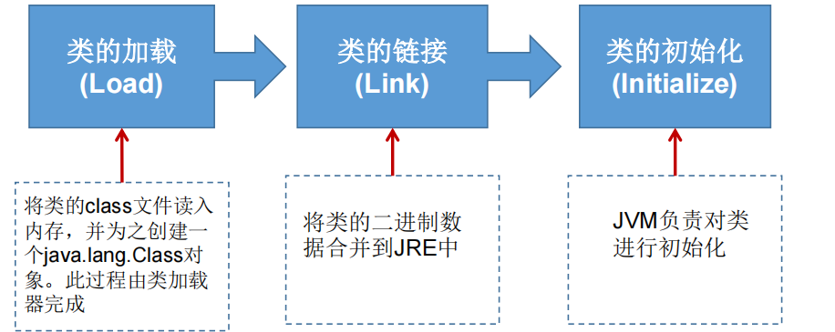
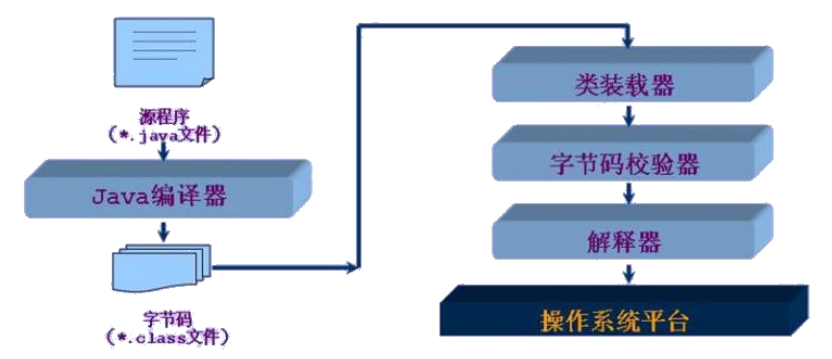
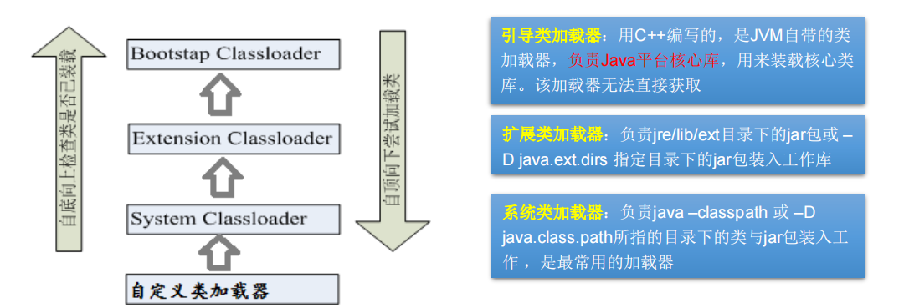
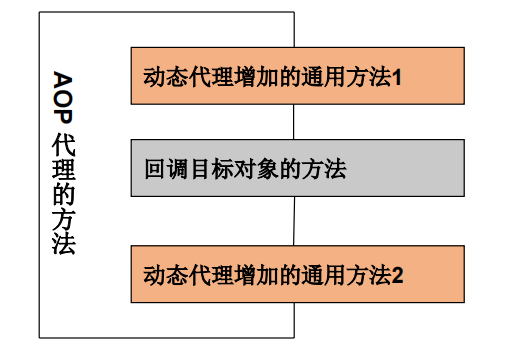

# Java Reflection
## 一、java 反射机制概述
- Reflection(反射)是被视为动态语言的关键，反射机制允许程序在执行期借助于 Reflection API 取得任何类的内部信息，并能直接操作任意对象的内部属性及方法。
- 加载完类之后，在堆内存的方法区中就产生了一个 Class 类型的对象(一个类只有一个 Class 对象)，这个对象就包含了完整的类的结构信息。
  - 我们可以通过这个对象看到类的结构。这个对象就像一面镜子，透过这个镜子看到类的结构，所以，我们形象的称之为:反射。

- 动态语言与静态语言
  - 动态语言
    - 是一类在运行时可以改变其结构的语言:例如新的函数、对象、甚至代码可以被引进，已有的函数可以被删除或是其他结构上的变化。通俗点说就是在运行时代码可以根据某些条件改变自身结构。
    - 主要动态语言:Object-C、C#、JavaScript、PHP、Python、Erlang
  - 静态语言
    - 与动态语言相对应的，运行时结构不可变的语言就是静态语言。如 Java、C、C++。
    - Java 不是动态语言，但 Java 可以称之为“准动态语言”。即 Java 有一定的动态性，我们可以利用反射机制、字节码操作获得类似动态语言的特性。Java的动态性让编程的时候更加灵活!

- Java 反射机制提供的功能
  - 在运行时判断任意一个对象所属的类
  - 在运行时构造任意一个类的对象
  - 在运行时判断任意一个类所具有的成员变量和方法
  - 在运行时获取泛型信息
  - 在运行时调用任意一个对象的成员变量和方法 
  - 在运行时处理注解 
  - 生成动态代理

## 二、Class 类
- 反射相关的主要 API
  - `java.lang.Class`: 代表一个类 
  - `java.lang.reflect.Method`: 代表类的方法
  - `java.lang.reflect.Field`: 代表类的成员变量
  - `java.lang.reflect.Constructor`: 代表类的构造器
- 注意：
  - `Class` 不是关键字，是类，`class` 是关键字

- Class 类的常用方法

    | 方法名                                             | 功能说明                                                     |
    | -------------------------------------------------- | ------------------------------------------------------------ |
    | static Class forName(String name)                  | 返回指定类名 name 的 Class 对象                              |
    | Object newinstance()                               | 调用缺省构造函数，返回该Class对象的一个实例                  |
    | getName()                                          | 返回此Class对象所表示的实体(类、接口、数组类、基本类型或void)名称 |
    | Class getSuperClass()                              | 返回当前Class对象的父类的Class对象                           |
    | Class [] getlnterfaces()                           | 获取当前Class对象的接口                                      |
    | ClassLoader getClassLoader()                       | 返回该类的类加载器                                           |
    | Class getSuperclass()                              | 返回表示此Class所表示的实体的超类的Class                     |
    | Constructor[] getConstructors()                    | 返回一个包含某些Constructor对象的数组                        |
    | Field[] getDeclaredFields()                        | 返回Field对象的一个数组                                      |
    | Method getMethod(String name,Class ... paramTypes) | 返回一个Method对象，此对象的形参类型为paramType              |

    ``` java
    //反射之前，对于person的操作
    //在Person类外部不能通过对象调用其内部私有结构
    @Test
    public void test1(){
        //1.实例化对象
        Person p1 = new Person("lhk",20);
        //2.调用属性和方法
        p1.age=21;
        System.out.println(p1.toString());
        p1.show();
    }
    ```
    ```java
    //使用反射对Person类进行操作
    @Test
    public void test2() throws Exception{
        //通过反射实例化对象
        Class<Person> aClass = Person.class;
        Constructor<Person> constructors = aClass.getConstructor(String.class,int.class);
        Person p2 = constructors.newInstance("lhk", 20);
        System.out.println(p2.toString());
    
        //2.通过反射调用指定属性和方法
        Field age = aClass.getDeclaredField("age");
        age.set(p2,21);
        System.out.println(p2.toString());
    
        Method show = aClass.getDeclaredMethod("show");
        show.invoke(p2);
    
        System.out.println("****反射机制调用私有结构******");
        //3.通过反射可以调用Person类的私有结构
        //调用私有构造器
        Constructor<Person> C = aClass.getDeclaredConstructor(String.class);
        C.setAccessible(true);
        Person p3 = C.newInstance("TheMutents");
        System.out.println(p3);
        //调用私有属性
        Field name = aClass.getDeclaredField("name");
        name.setAccessible(true);
        name.set(p2,"LHK");
        System.out.println(p2);
        //调用私有方法
        Method showNation = aClass.getDeclaredMethod("showNation", String.class);
        showNation.setAccessible(true);
        String nation = (String) showNation.invoke(p3, "China");
        System.out.println(nation);
    }
    ```

    ```java
    //获取Class的实例的方式
    @Test
    public void test3() throws ClassNotFoundException {
        //方式一:调用运行时类的属性：.class 获取Class的实例
        Class<Person> personClass1 = Person.class;
        System.out.println(personClass1);
        
        //方式二：通过运行时类的对象获取Class的实例
        Person p1 = new Person();
        Class<? extends Person> personClass2 = p1.getClass();
        System.out.println(personClass2);
    
        //方式三：调用Class的静态方法：forName(String className)
        Class<?> personclass3 = Class.forName("com.lhk.Reflection.Person");
        System.out.println(personclass3);
    
        System.out.println(personClass1==personClass2);//true
        System.out.println(personClass1==personclass3);//true
    
        //方式四：使用类的加载器：ClassLoader（了解）
        ClassLoader classLoader = ReflectionTest.class.getClassLoader();
        Class<?> personClass4 = classLoader.loadClass("com.lhk.Reflection.Person");
        System.out.println(personClass4);
    }
    ```

- 疑问1: 通过直接 new 的方式或反射的方式都可以调用公共的结构，开发中到底用那个
  - 建议:直接 new 的方式
  - 什么时候会使用反射的方式:在编译时不能确定到底造那个类的对象，出现此类情况则使用反射的方式。反射的特征:动态性

- 疑问2: 反射机制与面向对象中的封装性是不是矛盾的?如何看待两个技术?
  - 不矛盾
  - 封装性表示的是调用公共的方法里面封装了所需要的属性，没有必要调用私有方法，使用公共的方法更好
  - 反射解决能不能调私有结构的问题，能调但是不建议调用

- 关于 `java.lang.Class` 类的理解
  1. 类的加载过程程序经过`javac.exe`命令以后，会生成一个或多个字节码文件(.class结尾文件)，接着使用`java.exe`命令对某个字节码文件进行解释运行。相当于将某个字节码文件加载到内存中，此过程就称为类的加载，加载到内存中的类，就称为运行时类，此运行时类，就作为 Class 的一个实例，换句话说，Class 的实例就对应着一个运行时类
  2. 加载到内存中的运行时类，会缓存一定的时间，在此时间内，可以通过不同的方式来获取此运行时类

- 哪些类型可以有 class 对象?
  - `class`:外部类，成员(成员内部类，静态内部类)，局部内部类，名内部类
  - `interface`:接口
  - `[]`:数组
  - `enum`:枚举
  - `annotation`:注解`@interface`
  - `primitive type`:基本数据类型
  - `void`

    ```java
    @Test
    public void test4(){
        Class<Object> c1 = Object.class;
        Class<Integer> c2 = int.class;
        Class<Class> c3 = Class.class;
        Class<String> c4 = String.class;
        Class<Comparable> c5 = Comparable.class;
        Class<String[]> c6 = String[].class;
        Class<int[][]> c7 = int[][].class;
        Class<Void> c8 = void.class;
        Class<Override> c9 = Override.class;
        int[] a=new int[10];
        int[] b=new int[100];
        Class<? extends int[]> aClass = a.getClass();
        Class<? extends int[]> bClass = b.getClass();
        //数组维度和类型一样，返回的是同一个Class
        System.out.println(aClass==bClass);
    }
    ```
    
## 三、类的加载
- 类的加载过程 
  - 当程序主动使用某个类时，如果该类还未被加载到内存中，则系统会通过如下三个步骤来对该类进行初始化。

  

  - 加载: 将 class 文件字节码内容加载到内存中，并将这些静态数据转换成方法区的运行时数据结构，然后生成一个代表这个类的 `java.lang.Class` 对象，作为方法区中类数据的访问入口(即引用地址)。所有需要访问和使用类数据只能通过这个Class对象。这个加载的过程需要类加载器参与。
    
  - 链接: 将 Java 类的二进制代码合并到 JVM 的运行状态之中的过程。
    - 验证: 确保加载的类信息符合JVM规范，例如:以cafe开头，没有安全方面的问题
    - 准备: 正式为类变量(static)分配内存并设置类变量默认初始值的阶段，这些内存都将在方法区中进行分配。
    - 解析: 虚拟机常量池内的符号引用(常量名)替换为直接引用(地址)的过程。
  - 初始化:
    - 执行类构造器`<clinit>()`方法的过程。类构造器`<clinit>()`方法是由编译期自动收集类中所有类变量的赋值动作和静态代码块中的语句合并产生的。(类构造器是构造类信息的，不是构造该类对象的构造器)。 
    - 当初始化一个类的时候，如果发现其父类还没有进行初始化，则需要先触发其父类的初始化。 
    - 虚拟机会保证一个类的`<clinit>()`方法在多线程环境中被正确加锁和同步

- 什么时候会发生类初始化?
  - 类的主动引用(一定会发生类的初始化)
    - 当虚拟机启动，先初始化 main 方法所在的类
    - new一个类的对象
    - 调用类的静态成员(除了final常量)和静态方法
    - 使用`java.lang.reflect`包的方法对类进行反射调用
    - 当初始化一个类，如果其父类没有被初始化，则先会初始化它的父类
  - 类的被动引用(不会发生类的初始化)
    - 当访问一个静态域时，只有真正声明这个域的类才会被初始化
      - 当通过子类引用父类的静态变量，不会导致子类初始化
    - 通过数组定义类引用，不会触发此类的初始化
    - 引用常量不会触发此类的初始化(常量在链接阶段就存入调用类的常量池中了)

## 四、类加载器 ClassLoader



- 类加载器的作用:
  - 类加载的作用: 将 class 文件字节码内容加载到内存中，并将这些静态数据转换成方法区的运行时数据结构，然后在堆中生成一个代表这个类的`java.lang.class`对象，作为方法区中类数据的访问入口。
  - 类缓存:标准的 JavaSE 类加载器可以按要求查找类，但一旦某个类被加载到类加载器中，它将维持加载(缓存)一段时间。不过 JVM 垃圾回收机制可以回收这些 Class 对象

- 类加载器作用是用来把类(class)装载进内存的。JVM 规范定义了如下类型的类的加载器

  

  ```java
  @Test
  public void test1(){
      //对于自定义的类，使用系统类加载器加载
      ClassLoader classLoader = ClassLoaderTest.class.getClassLoader();
      System.out.println(classLoader);
      //调用系统类加载器的getParent()方法 获取扩展类加载器
      ClassLoader classLoader1 = classLoader.getParent();
      System.out.println(classLoader1);
      //调用扩展类加载器的getParent()方法 无法获取引导类加载器
      //引导类加载器负责 加载java的核心类库，无法加载自定义类，是无法获取的
      ClassLoader classLoader2 = classLoader1.getParent();
      System.out.println(classLoader2);
  
      ClassLoader classLoader3 = String.class.getClassLoader();//引导类加载器加载String类
      System.out.println(classLoader3);
  }
  ```

  ```java
  /*
  properties:用来读取配置文件
  */
  @Test
  public void test2() {
      FileInputStream fis=null;
      InputStream is=null;
      try {
      Properties properties = new Properties();
      //读取配置文件方式一：此时配置文件默认在当前module下
      //在web开发中配置文件一般都放在src下而不是module下面
      // fis = new FileInputStream("test.properties");
      fis = new FileInputStream("src\\test1.properties");
      properties.load(fis);
  
      //读取配置文件方式二（使用类加载器获取输入流）：此时配置文件默认在当前module下的src下
      //若配置文件位置与默认位置不一致会出现java.lang.NullPointerException异常
      // ClassLoader classLoader = ClassLoaderTest.class.getClassLoader();
      // is = classLoader.getResourceAsStream("test1.properties");
      // properties.load(is);
  
      String user = properties.getProperty("user");
      String password = properties.getProperty("password");
      System.out.println("user:"+user+",password:"+password);
      } catch (IOException e) {
          e.printStackTrace();
      } finally {
          try {
              if (fis!=null){
                  fis.close();
              }
          } catch (IOException e) {
          e.printStackTrace();
          }
          if (is!=null){
              try {
                  is.close();
              } catch (IOException e) {
              e.printStackTrace();
              }
          }
      }
  }
  ```
  
## 五、创建运行时类对象
- 创建类的对象:调用 Class 对象的 `newInstance()`方法
  - 要 求:
    - 类必须有一个无参数的构造器。
    - 类的构造器的访问权限需要足够
      
- 难道没有无参的构造器就不能创建对象了吗? 
  - 不是!只要在操作的时候明确的调用类中的构造器，并将参数传递进去之后，才可以实例化操作。
  - 步骤如下:
      1. 通过 Class 类的 `getDeclaredConstructor(Class ... parameterTypes)` 取得本类的指定形参类型的构造器
      2. 向构造器的形参中传递一个对象数组进去，里面包含了构造器中所需的各个参数。
      3. 通过 Constructor 实例化对象。

```java
@Test
public void test1() throws InstantiationException, IllegalAccessException {
    //1.获取Class对象
    Class<Person> personClass = Person.class;

    //2.调用newInstance()方法得到对应的运行时类对象
    /*newInstance()内部调用的是运行时类的空参构造器，使用时运行时类必须提供空参构造器，
    且空参构造器的访问权限得够，通常设置为public
    在javabean中要求提供一个public的空参构造器，原因：
    1.便于通过反射创建运行时类对象
    2.因为子类在继承该类时默认调用super(),提供空参构造器保证子类能够正常继承
    */
    Person person = personClass.newInstance();
    System.out.println(person);
}
```

```java
//反射的动态性
@Test
public void test2(){
    for (int i=0;i<100;i++){
        int nextInt = new Random().nextInt(3);//随机数:0,1,2
        String ClassPaath="";
        switch (nextInt){
            case 0:
            ClassPaath="java.util.Date";
            break;
            case 1:
            ClassPaath="java.lang.Object";
            break;
            case 2:
            ClassPaath="com.lhk.Reflection.Person";
            break;
    	}
        try {
            Object instance = getInstance(ClassPaath);
            System.out.println(instance);
        } catch (Exception e) {
            e.printStackTrace();
        }
    }
}

/*
创建一个指定类的对象
ClassPath：指定类的全类名
*/
public Object getInstance(String ClassPath) throws Exception {
    Class<?> cla = Class.forName(ClassPath);
    return cla.newInstance();
}
```

## 六、获取运行时类的完整结构
- 反射可以获取运行时类的父类、所在的包、实现接口、父类的泛型、所有的方法、所有的属性、所有的构造器、属性，方法，构造器的具体的权限修饰符

```java
/**
* 获取当前运行时类的属性结构
*
* @author Lhk
*/
public class FieldTest {
    //获取完整的属性结构
    @Test
    public void test1(){
        Class<Person> personClass = Person.class;
        Field[] fields = personClass.getFields();//只能获取当前运行时类和其父类的public权限的属性
        for(Field field:fields){
            System.out.println(field);
        }
        System.out.println("\n");
        Field[] declaredFields = personClass.getDeclaredFields();//获取当前运行时类中声明的所有属性（不包括父类中的属性）
        for (Field f:declaredFields) {
            System.out.println(f);
        }
    }

    //获取具体的属性结构:权限修饰符、数据类型、变量名...
    @Test
    public void test2(){
        Class<Person> personClass1 = Person.class;
        Field[] declaredFields = personClass1.getDeclaredFields();
        for (Field f : declaredFields) {
            //1.获取权限修饰符
            int modifiers = f.getModifiers();
            System.out.print(Modifier.toString(modifiers)+"\t\t");
            //2.获取数据类型
            Class<?> type = f.getType();
            System.out.print(type.getName()+"\t\t");
            //3.获取变量名
            String name = f.getName();
            System.out.println(name);
        }
    }
}

```java
/**
* 获取当前运行时类的方法结构
* @author Lhk
*/
public class MethodTest {
    @Test
    public void test1(){
        Class<Person> personClass = Person.class;
        //getMethod():获取当前运行时类及其素有父类声明为public权限的方法
        Method[] methods = personClass.getMethods();
        for (Method m:methods) {
            System.out.println(m);
        }
        //getDeclaredMethods()：获取当前运行时类中声明的所有方法（不包括父类中的）
        Method[] declaredMethods = personClass.getDeclaredMethods();
        for (Method m:declaredMethods){
        	System.out.println(m);
        }
    }

    //获取方法中的具体结构
    /* @Xxxx
    权限修饰符 返回值类型 方法名 参数列表(参数类型1 形参名1，...) throws XxxException{}
    */
    @Test
    public void test2(){
    Class<Person> personClass = Person.class;
        Method[] declaredMethods = personClass.getDeclaredMethods();
        for (Method m:declaredMethods) {
            //1.获取方法声明的注解
            Annotation[] annotations = m.getAnnotations();
            for (Annotation a:annotations) {
                System.out.println(a);
            }
            //2.获取权限修饰符
            System.out.print(Modifier.toString(m.getModifiers())+"\t\t");
            //3.获取返回值类型
            System.out.print(m.getReturnType()+"\t\t");
            //4.方法名
            System.out.print(m.getName()+"(");
            //5.获取形参列表
            Class<?>[] parameterTypes = m.getParameterTypes();
            if(!(parameterTypes==null && parameterTypes.length==0)){
                 for (int i=0;i<parameterTypes.length;i++){
                    if (i==parameterTypes.length-1){
                        System.out.print(parameterTypes[i].getName()+" args_"+i);
                        break;
                    }
                    System.out.print(parameterTypes[i].getName()+" args_"+i+",");
                }
            }
            System.out.print(")");

            //6.获取抛出的异常
            Class<?>[] exceptionTypes = m.getExceptionTypes();
            if (exceptionTypes.length>0){
                System.out.print(" throws ");
                for (int i=0;i<exceptionTypes.length;i++){
                    if (i==exceptionTypes.length-1){
                        System.out.print(exceptionTypes[i].getName());
                        break;
                    }
                    System.out.print(exceptionTypes[i].getName()+",");
                }
            }
            System.out.println();
        }
    }
}
```

```java
/**
* @author Lhk
*/
public class OtherTest {
    /*
    获取构造器
    */
    @Test
    public void test1(){
        Class<Person> personClass = Person.class;
        //getConstructors()：获取当前运行时类中声明为public的构造器
        Constructor<?>[] constructors = personClass.getConstructors();
        for (Constructor c:constructors) {
        	System.out.println(c);
        }
        System.out.println();
        //getDeclaredConstructors()：获取当前运行时类中所有的构造器
        Constructor<?>[] declaredConstructors = personClass.getDeclaredConstructors();
        for (Constructor c:declaredConstructors) {
        	System.out.println(c);
        }
    }

    /*
    获取运行时类的父类
    */
    @Test
    public void test2(){
        Class<Person> personClass = Person.class;
        Class<? super Person> superclass = personClass.getSuperclass();
        System.out.println(superclass);
    }

    /*
    获取运行时类带泛型的父类
    */
    @Test
    public void test3(){
        Class<Person> personClass = Person.class;
        Type genericSuperclass = personClass.getGenericSuperclass();
        System.out.println(genericSuperclass);
    }

    /*
    获取运行时类带泛型的父类的泛型
    */
    @Test
    public void test4(){
        Class<Person> personClass = Person.class;
        Type genericSuperclass = personClass.getGenericSuperclass();
        ParameterizedType paramType=(ParameterizedType) genericSuperclass;
        //获取泛型类型
        Type[] actualTypeArguments = paramType.getActualTypeArguments();
        for (Type t:actualTypeArguments) {
        	System.out.println(t.getTypeName());
        }
    }

    /*
    获取运行时类的接口
    */
    @Test
    public void test5(){
        Class<Person> personClass = Person.class;
        Class<?>[] interfaces = personClass.getInterfaces();
        for (Class cla:interfaces){
            System.out.println(cla);
        }
        System.out.println();
        //获取运行时类父类的的接口
        Class<? super Person> superclass = personClass.getSuperclass();
        Class<?>[] interfaces1 = superclass.getInterfaces();
        for (Class cla:interfaces1) {
        	System.out.println(cla);
        }
    }

    /*
    获取当前运行时类所在的包
    */
    @Test
    public void test6(){
        Class<Person> personClass = Person.class;
        Package aPackage = personClass.getPackage();
        System.out.println(aPackage);
    }

    /*
    获取运行时类声明的注解
    */
    @Test
    public void test7(){
    Class<Person> personClass = Person.class;
        Annotation[] annotations = personClass.getAnnotations();
        for (Annotation a:annotations) {
            System.out.println(a);
        }
    }
}
```

## 七、调用运行时类指定结构
- 通过反射调用类中的方法，可以使用 `Method` 类完成。
  - 步骤:
    1. 通过 Class 类的 `getMethod(String name,Class...parameterTypes)`方法取得一个 Method 对象，并设置此方法操作时所需要的参数类型
    2. 之后使用 `Object invoke(Object obj,Object args)` 进行调用，并向方法中传递要设置的 obj 对象的参数信息

- 关于 `setAccessible` 方法的使用
  - `Method` 和 `Field`、`Constructor` 对象都有 `setAccessible()` 方法。
  - `setAccessible` 启动和禁用访问安全检查的开关
  - 参数值为 true 则指示反射的对象在使用时应该取消Java语言访问检查
    - 提高反射的效率。如果代码中必须用反射，而该句代码需要频繁的被调用，那么请设置为true
    - 使得原本无法访问的私有成员也可以访问
  - 参数值为false则指示反射的对象应该实施Java语言访问检查

```java
/**
 * 操作运行时类指定的结构：属性、方法、构造器...
 * @author Lhk
 */
public class ReflectionTest {

    @Test
    public void fieldTest1() throws Exception {
        Class<Person> personClass = Person.class;
        //创建运行时类的对象
        Person p = personClass.newInstance();
        //获取指定的属性getField():要求属性权限声明为public
        //通常不使用该方法调用属性
        Field id = personClass.getField("id");
        //设置属性的值
        id.set(p,100);
        //获取当前属性的值
        Object o = id.get(p);
        int pid=(int) o;
        System.out.println(pid);
    }

    /*
    如何操作运行时类指定的属性
    */
    @Test
    public void fieldTest2() throws Exception {
        Class<Person> personClass = Person.class;
        //创建运行时类对象
        Person p = personClass.newInstance();
        //1.getDeclaredField():获取运行时类中指定变量名的属性
        Field name = personClass.getDeclaredField("name");
        //2.保证当前属性是可访问的
        name.setAccessible(true);
        //3.设置、获取指定对象的属性值
        name.set(p,"lhk");
        // Object o = name.get(p);
        // String pName= (String) o;
        System.out.println((String) name.get(p));
    }

    /*
    如何操作运行时类中指定的方法
    */
    @Test
    public void methodTest() throws Exception {
        Class<Person> personClass = Person.class;
        //创建运行时类对象
        Person p = personClass.newInstance();
        //1.获取运行时类的某个指定方法
        //getDeclaredMethod():参数一：指明指定方法名 参数二：指明指定方法参数列表
        Method show = personClass.getDeclaredMethod("show", String.class);
        //2.保证当前方法是可访问的
        show.setAccessible(true);
        //3.调用invoke(): 参数一：方法的调用者 参数二：给方法形参赋值的实参
        //该方法的返回值即为当前调用方法的返回值
        Object o = show.invoke(p, "China");
        System.out.println(o);
        System.out.println("*************调用静态方法**************");
        Method show1 = personClass.getDeclaredMethod("show1");
        show1.setAccessible(true);
        // show1.invoke(Person.class);
        show1.invoke(null);
    }

    /*
    调用运行时类指定的构造器
    */
    @Test
    public void testConstructor() throws Exception {
        Class<Person> personClass = Person.class;
        //1.获取指定构造器
        //getDeclaredConstructor():参数：指明构造器的参数列表
        Constructor<Person> constructor = personClass.getDeclaredConstructor(String.class);
        //2.保证当前构造器可以访问
        constructor.setAccessible(true);
        //3.调用此构造器创建运行时类对象
        Person p = constructor.newInstance("TheMutents");
        System.out.println(p);
    }
}
```

## 八、反射的应用：动态代理
- 代理设计模式的原理:
  - 使用一个代理将对象包装起来,然后用该代理对象取代原始对象。任何对原始对象的调用都要通过代理。代理对象决定是否以及何时将方法调用转到原始对象上。
- 静态代理：
  - 特征是代理类和目标对象的类都是在编译期间确定下来，不利于程序的扩展。
  - 同时，每一个代理类只能为一个接口服务，这样一来程序开发中必然产生过多的代理。
  - 因此，最好可以通过一个代理类完成全部的代理功能。

  静态代理举例

  ```java
  /**
  * 静态代理特点：代理类和被代理类在编译期间就确定下来了
  * @author Lhk
  */
  
  interface ClothFactory{
      void produceCloth();
  }
  
  //代理类
  class ProxyClothFactory implements ClothFactory {
      private ClothFactory factory;//该属性用被代理类对象对其进行实例化
      
      public ProxyClothFactory(ClothFactory factory) {
          this.factory = factory;
      }
  
      @Override
      public void produceCloth() {
          System.out.println("代理工厂做一些准备工作");
          factory.produceCloth();
          System.out.println("代理工厂做一些后续的收尾工作");
      }
  }
  
  //被代理类
  class NikeClothFactory implements ClothFactory {
      @Override
      public void produceCloth() {
          System.out.println("nike工厂生产一批衣服");
      }
  }
  
  public class StaticProxy {
      public static void main(String[] args) {
          //创建被代理类的对象
          NikeClothFactory nike=new NikeClothFactory();
          //创建代理类的对象
          ProxyClothFactory proxyClothFactory=new ProxyClothFactory(nike);
          proxyClothFactory.produceCloth();
      }
  }
  ```

- 动态代理
  - 是指客户通过代理类来调用其它对象的方法，并且是在程序运行时根据需要动态创建目标类的代理对象。
  - 动态代理使用场合:
    - 调试 
    - 远程方法调用 
  - 动态代理相比于静态代理的优点:
    - 抽象角色中(接口)声明的所有方法都被转移到调用处理器一个集中的方法中处理，这样，我们可以更加灵活和统一的处理众多的方法。

  动态代理举例

  ```java
  /**
  * @author Lhk
  */
  interface Human{
      String getBelief();
  
      void eat(String food);
  }
  
  //被代理类
  class Superman implements Human{
      @Override
      public String getBelief() {
          return "I can fly";
      }
  
      @Override
      public void eat(String food) {
          System.out.println("I like eat "+food);
      }
  }
  
  /*
  实现动态代理需解决：
  1.如何根据加载到内存中的代理类，动态的创建一个代理类及其对象
  2.当通过代理类的对象调用方法时，如何动态的去调用被代理类中的同名方法
  */
  
  //代理类
  class ProxyFactory{
      //调用此方法返回一个代理类对象
      public static Object getProxyInstance(Object obj){//obj：被代理类的对象
          MyInvocationHandler handler=new MyInvocationHandler();
          handler.bind(obj);
          return Proxy.newProxyInstance(obj.getClass().getClassLoader(),obj.getClass().getInterfaces(),handler);
      }
  }
  
  class MyInvocationHandler implements InvocationHandler{
      private Object obj;//需要使用被代理类对象进行赋值（动态性）
  
      public void bind(Object obj){//将传来的obj赋值给当前的obj
          this.obj=obj;
      }
      //当通过代理类的对象调用方法a时，就会自动调用invoke()
      //将被代理类需要执行的方法a的功能声明在invoke()中
      @Override
      public Object invoke(Object proxy, Method method, Object[] args) throws Throwable {
          //method():即为代理类对象调用的方法，也作为了被代理类调用的方法
          //obj：被代理类对象
          Object returnValue = method.invoke(obj, args);//使用反射调用method方法
          return returnValue;
      }
  }
  
  public class DynamicProxy {
      public static void main(String[] args) {
          //创建被代理类对象
          Superman superman = new Superman();
          //创建代理类对象
          Human proxyInstance = (Human) ProxyFactory.getProxyInstance(superman);
          //当通过代理类调用方法时，会自动调用被代理类中同名的方法
          String belief = proxyInstance.getBelief();
          System.out.println(belief);
          proxyInstance.eat("Apples");
          System.out.println("--------------------------");
          NikeClothFactory nikeClothFactory = new NikeClothFactory();
          ClothFactory proxyInstance1 = (ClothFactory) ProxyFactory.getProxyInstance(nikeClothFactory);
          proxyInstance1.produceCloth();
      }
  }
  ```
  
### 动态代理与 AOP(AspectOrient Programming)
- 使用 Proxy 生成一个动态代理时，往往并不会凭空产生一个动态代理，这样没有太大的意义。通常都是为指定的目标对象生成动态代理
- 这种动态代理在 AOP 中被称为 AOP 代理，AOP 代理可代替目标对象，AOP 代理包含了目标对象的全部方法。
  - 但 AOP 代理中的方法与目标对象的方法存在差异: AOP 代理里的方法可以在执行目标方法之前、之后插入一些通用处理
  
  
