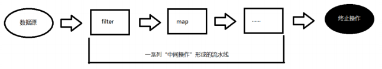
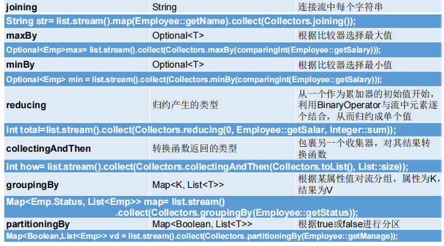

# Stream API

## Stream
- Stream 到底是什么呢? 
  - 是数据渠道，用于操作数据源(集合、数组等)所生成的元素序列。
  - 集合讲的是数据，Stream 讲的是计算!
  - 注意:
    1. Stream 自己不会存储元素。 
    2. Stream 不会改变源对象。相反，他们会返回一个持有结果的新 Stream。 
    3. Stream 操作是延迟执行的。这意味着他们会等到需要结果的时候才执行。
       - 延迟操作：只要没有执行终止操作，中间操作都不会执行；只有执行了终止操作，才会执行中间操作，并产生结果，且之后不能再被使用；如需要再次使用，需要重新创建 Stream 对象。

- Stream 的操作三个步骤 
  1. 创建 Stream 
     - 一个数据源(如:集合、数组)，获取一个流
  2. 中间操作
     - 一个中间操作链，对数据源的数据进行处理
  3. 终止操作(终端操作)
     - 一旦执行终止操作，就执行中间操作链，并产生结果。之后，不会再被使用

  


### Stream 的实例化
  ```java
  /**
  * 1.Stream 关注的是对数据的运算，与 CPU 打交道
  * 集合关注的是数据的存储，与内存打交道
  *
  * 2.
  * ①Stream 自己不会存储元素。
  * ②Stream 不会改变源对象。相反，他们会返回一个持有结果的新Stream。
  * ③Stream 操作是延迟执行的。这意味着他们会等到需要结果的时候才执行
  *
  *3.Stream执行流程
  * ①Stram的实例化
  * ②一系列的中间操作（过滤、映射...）
  * ③终止操作
  *
  * 4.说明
  * 一个中间操作链，对数据源的数据进行处理
  * 一旦执行终止操作，就执行中间操作链，并产生结果。之后，不会再被使用
  *
  * 测试Stream的实例化
  * @author Lhk
  */
  public class StreamAPITest {
      //创建 Stream方式一：通过集合
      @Test
      public void test(){
          List<Employee> employees = EmployeeData.getEmployees();
          // default Stream<E> stream() : 返回一个顺序流
          Stream<Employee> stream = employees.stream();
          // default Stream<E> parallelStream() : 返回一个并行流
          Stream<Employee> employeeStream = employees.parallelStream();
      }
  
      //创建 Stream方式二：通过数组
      @Test
      public void test1(){
          int[] arr=new int[]{1,2,3,4,5,6};
          //调用Arrays类的 static <T> Stream<T> stream(T[] array): 返回一个流
          IntStream stream = Arrays.stream(arr);
          Employee e1=new Employee(1001,"Lhk");
          Employee e2=new Employee(1002,"lhk");
          Employee[] employees=new Employee[]{e1,e2};
          Stream<Employee> stream1 = Arrays.stream(employees);
      }
  
      //创建 Stream方式三：通过Stream的of()
      @Test
      public void test2(){
          Stream<Integer> integerStream = Stream.of(1, 2, 3, 4, 5, 6, 7, 8, 9);
      }
  
      //创建 Stream 方式四：创建无限流
      @Test
      public void test3(){
          // 迭代
          // public static<T> Stream<T> iterate(final T seed, final UnaryOperator<T> f)
          //遍历前十个偶数
          Stream.iterate(0,t->t+2).limit(10).forEach(System.out::println);
          // 生成
          // public static<T> Stream<T> generate(Supplier<T> s)
          //遍历十个[0,1)的随机数
          Stream.generate(Math::random).limit(10).forEach(System.out::println);
      }
  
  }
  ```

### Stream 的中间操作
- 多个中间操作可以连接起来形成一个流水线，除非流水线上触发终止操作，否则中间操作不会执行任何的处理!而会在终止操作时一次性全部处理，称为“惰性求值”
1. 筛选与切片

  | 方 法               | 描 述                                                            |
  |----------------------------------------------------------------| ------------------------------------------------------------ |
  | filter(Predicate p) | 接收 Lambda， 从流中排除某些元素                                           |
  | distinct()          | 筛选，通过流所生成元素的 `hashCode()` 和 `equals()` 去除重复元索                  |
  | limit(long maxSize) | 截断流，使其元素不超过给定数量                                                |
  | skip(long n)        | 跳过元素，返回一个扔掉了前 n 个元素的流。<br/>若流中元素不足 n 个，则返回一个空流。与 `limit(n)` 互补 |

2. 映射

  | 方 法                           | 描 述                                                        |
  | ------------------------------- | ------------------------------------------------------------ |
  | map(Function f)                 | 接收一个函数作为参数，该函数会被应用到每个元素上，并将其映射成一个新的元素。 |
  | mapToDouble(ToDoubleFunction f) | 接收一个函数作为参数，该函数会被应用到每个元素上，产生一个新的 DoubleStream。 |
  | mapTolnt(TolntFunction f)       | 接收一个函数作为参数，该函数会被应用到每个元素上，产生一个新的 IntStream |
  | mapToLong(ToLongFunction f)     | 接收一个函数作为参数，该函数会被应用到每个元素上，产生一个新的 LongStream。 |
  | flatMap(Function f)             | 接收一个函数作为参数，将流中的每个值都换成另一个流，然后把所有流连接成一个流 |

- 例

  ```java
  /**
  * 测试Stream的中间操作
  * @author Lhk
  */
  public class StreamAPITest1 {
      //1.筛选与切片
      @Test
      public void test(){
          List<Employee> employees = EmployeeData.getEmployees();
          // filter(Predicate p) 接收 Lambda ，从流中排除某些元素
          //查询员工表中薪资大于5000的员工信息
          Stream<Employee> stream = employees.stream();
          stream.filter(e->e.getSalary()>5000).forEach(System.out::println);
          System.out.println();
          // limit(long maxSize) 截断流，使其元素不超过给定数量
          employees.stream().limit(3).forEach(System.out::println);
          System.out.println();
          // skip(long n) 跳过元素，返回一个扔掉了前 n 个元素的流。若流中元素不足 n 个，则返回一个空流。与 limit(n) 互补
          employees.stream().skip(3).forEach(System.out::println);
          System.out.println();
          // distinct() 筛选，通过流所生成元素的 hashCode() 和 equals() 去除重复元素
          employees.add(new Employee(1009,"雷军",55,8000));
          employees.add(new Employee(1009,"雷军",55,8000));
          employees.add(new Employee(1009,"雷军",55,8000));
          employees.stream().distinct().forEach(System.out::println);
      }
  
      //映射
      @Test
      public void test1(){
          // map(Function f) 接收一个函数作为参数，该函数会被应用到每个元 素上，并将其映射成一个新的元素。
          List<String> list = Arrays.asList("aa", "bb", "cc", "dd");
          list.stream().map(s -> s.toUpperCase()).forEach(System.out::println);
          //练习：获取员工姓名长度大于3的员工姓名
          List<Employee> employees = EmployeeData.getEmployees();
          Stream<String> nameStream = employees.stream().map(Employee::getName);
          nameStream.filter(name->name.length()>3).forEach(System.out::println);
          System.out.println();
          //map与flatMap的区别
          Stream<Stream<Character>> streamStream = list.stream().map(StreamAPITest1::fromStringToStream);
          streamStream.forEach(s->s.forEach(System.out::println));
          System.out.println();
          // flatMap(Function f) 接收一个函数作为参数，将流中的每个值都换成另一个流(提取每一个值作为分别作为一个流)，然后把所有流连接成一个流
          Stream<Character> characterStream = list.stream().flatMap(StreamAPITest1::fromStringToStream);
          characterStream.forEach(System.out::println);
      }
      
      //将字符串中的多个字符构成的集合转换为对应的Stream的实例
      public static Stream<Character> fromStringToStream(String str){
          ArrayList<Character> list=new ArrayList<>();
          for (Character c:str.toCharArray()){
              list.add(c);
          }
          return list.stream();
      }
  
      //排序
      @Test
      public void test2(){
          // sorted() 产生一个新流，其中按自然顺序排序
          List<Integer> list = Arrays.asList(15, 22, 13, 65, 55, 43, 21, 51);
          list.stream().sorted().forEach(System.out::println);
          //抛异常，原因：Employee没有实现Comparable接口
          // List<Employee> employees = EmployeeData.getEmployees();
          // employees.stream().sorted().forEach(System.out::println);
          // sorted(Comparator com) 产生一个新流，其中按比较器顺序排序（定制排序）
          List<Employee> employees = EmployeeData.getEmployees();
          employees.stream().sorted((e1,e2)-> {
              int ageValue = Integer.compare(e1.getAge(), e2.getAge());
              if (ageValue!=0){
                  return ageValue;
              }else{
                  return Double.compare(e1.getSalary(), e2.getSalary());
              }
          }).forEach(System.out::println);
      }
  }
  ```
  

### Stream 的终止操作
- 相关方法

  | 方 法               | 描 述                                                        |
  | ------------------- | ------------------------------------------------------------ |
  | count()             | 返回流中元素总数                                             |
  | max(Comparator c)   | 返回流中最大值                                               |
  | min(Comparator c)   | 返回流中最小值                                               |
  | forEach(Consumer c) | 内部迭代 (使用 Collection 接口需要用户去做迭代,称为外部迭代。<br/>相反，StreamAPI使用内部迭代--它帮你把迭代做了) |

- 归约

  | 方 法                            | 描 述                                                      |
  | -------------------------------- | ---------------------------------------------------------- |
  | reduce(T iden, BinaryOperator b) | 可以将流中元素反复结合起来，得到一个值。返回 T             |
  | reduce(BinaryOperator b)         | 可以将流中元素反复结合起来，得到一个值。返回 `Optional<T>` |

  - map 和 reduce 的连接通常称为 map-reduce 模式，因 Google 用它来进行网络搜索而出名

- 收集

  | 方 法                | 描 述                                                        |
  | -------------------- | ------------------------------------------------------------ |
  | collect(Collector c) | 将流转换为其他形式。接收一个 Collector接口的实现，用于给Stream中元素做汇总的方法 |

  - Collector 接口中方法的实现决定了如何对流执行收集的操作(如收集到 List、Set、Map)
  - 另外， Collectors 实用类提供了很多静态方法，可以方便地创建常见收集器实例,具体方法与实例如下表:
    
    

- 例

  ```java
  /**
  * 测试 Stream 的终止操作
  * @author Lhk
  */
  public class StreamAPITest2 {
  
      //匹配与查找
      @Test
      public void test1(){
          List<Employee> employees = EmployeeData.getEmployees();
          // allMatch(Predicate p) 检查是否匹配所有元素
          //练习：是否所有的员工的年龄都大于18岁
          boolean allMatch = employees.stream().allMatch(e -> e.getAge() > 18);
          System.out.println(allMatch);
          // anyMatch(Predicate p) 检查是否至少匹配一个元素
          //练习：是否存在员工的工资大于10000
          boolean anyMatch = employees.stream().anyMatch(e -> e.getSalary() > 10000);
          System.out.println(anyMatch);
          // noneMatch(Predicate p) 检查是否没有匹配所有元素
          //练习：是否存在员工姓“雷”
          boolean noneMatch = employees.stream().noneMatch(e -> e.getName().startsWith("雷"));
          System.out.println(noneMatch);
          // findFirst() 返回第一个元素
          Optional<Employee> first = employees.stream().findFirst();
          System.out.println(first);
          // findAny() 返回当前流中的任意元素
          Optional<Employee> any = employees.parallelStream().findAny();
          System.out.println(any);
      }
  
      @Test
      public void test2(){
          List<Employee> employees = EmployeeData.getEmployees();
          // count() 返回流中元素总数
          long count = employees.stream().filter(e->e.getSalary()>5000).count();
          System.out.println(count);
          // max(Comparator c) 返回流中最大值
          //练习：返回最高的工资
          Stream<Double> salaryStream = employees.stream().map(e -> e.getSalary());
          Optional<Double> max = salaryStream.max((Double::compare));
          System.out.println(max);
          // min(Comparator c) 返回流中最小值
          //练习返回工资最低的员工
          Optional<Employee> employee = employees.stream().min((e1, e2) -> Double.compare(e1.getSalary(), e2.getSalary()));
          System.out.println(employee);
          // forEach(Consumer c) 内部迭代(使用Collection接口需要用户去做迭代，称为外部迭代。相反，Stream API 使用内部迭代——它帮你把迭代做了)
          employees.stream().forEach(System.out::println);
      }
  
      //规约
      @Test
      public void test3(){
          // reduce(T identity, BinaryOperator b) 可以将流中元素反复结合起来，得到一 个值。返回 T
          //练习：计算1-10的自然数的和
          List<Integer> list = Arrays.asList(1, 2, 3, 4, 5, 6, 7, 8, 9, 10);
          Integer reduce = list.stream().reduce(0, Integer::sum);
          System.out.println(reduce);
          // reduce(BinaryOperator b) 可以将流中元素反复结合起来，得到一 个值。返回 Optional<T>
          //练习：计算所有员工的工资总和
          List<Employee> employees = EmployeeData.getEmployees();
          Stream<Double> salaryStream = employees.stream().map(e -> e.getSalary());
          // Optional<Double> SUM = salaryStream.reduce(Double::sum);
          Optional<Double> SUM = salaryStream.reduce((d1, d2) -> d1 + d2);
          System.out.println(SUM);
      }
  
      //收集
      @Test
      public void test4(){
          // collect(Collector c) 将流转换为其他形式。接收一个Collector接口的实现，用于给Stream中元素做汇总的方法
          //练习：查找工资大于6000的员工，结果返回为一个List或Set
          List<Employee> employees = EmployeeData.getEmployees();
          List<Employee> employeeList = employees.stream().filter(e -> e.getSalary() > 6000).collect(Collectors.toList());
          employeeList.forEach(System.out::println);
          System.out.println();
          Set<Employee> employeeSet = employees.stream().filter(e -> e.getSalary() > 6000).collect(Collectors.toSet());
          employeeSet.forEach(System.out::println);
      }
  }
  ```