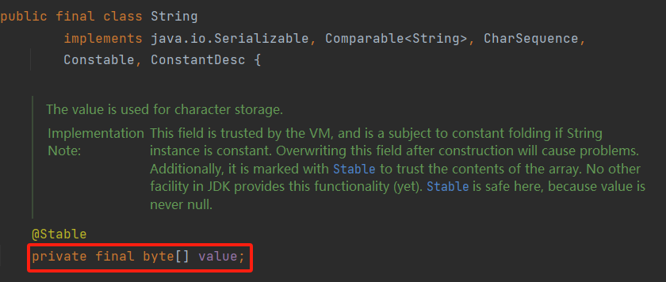
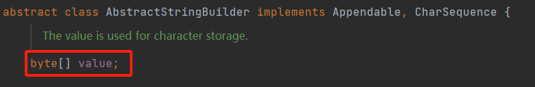

# String 类

## String
- String 是不可变的字符序列，即字符串一旦被创建，其内容不可改变
- String 类在 Java.lang 包下，Java 程序默认导入 Java.lang 包
- Java 字符串本质是 Unicode 字符序列，每个字符占用 2 字节
- Java 没有内置的字符串类型，而是提供了 String 类，每个用`""`引起来的都是字符串对象
- 字符串全部在方法区的常量池里面
- 涉及到字符串内容比较用equals()方法
- 当`+`运算符两侧的操作数中只要有一个是字符串（String）类型，系统会自动将另一个操作数转换为字符串（String）类型然后进行连接
- 通过查看 String 部分源码，
  - 我们发现字符串内容全部存储到了`value[]` 数组中，而该数组是被 final 修饰的，即为常量类型（只能被赋值一次），这就是“不可变类型”的典型定义方式
    

### String类和常量池
- 在 Java 内存分析中会经常提到常量池，常量池也分为以下几种
  1. 全局字符串常量池（Global String pool）
     - 存放的字符串常量的引用值（指向堆中的字符串对象实例），是在类加载完后存放的，在每个 JVM 中只有一个，所有线程共享
  2. class 文件常量池（Class Constant Pool）
     - class 常量池是在编译的时候每个 class 都有的，在编译阶段，存放的是常量（文本字符串、final 常量等）和符号引用
  3. 运行常量池（Runtime Constant Pool）
     - 运行时常量池是在类加载完之后，将每个常量池中的符号引用值转存到运行时常量池中，也就是说，每个class都有一个运行时常量池；类在解析之后，将符号引用替换成直接引用，与全局常量池中的引用保持一致

### String类的常用方法
| 方法 |  解释说明 |
|--|--|
|char charAt(int index)  | 返回字符串第index个字符  |
|boolean equals(String other)  | 如果字符串与other相等，返回ture，否则返回false |
|boolean equalsIgnoreCase(String other) |如果字符串与other相等(忽略大小写)，返回ture，否则返回false  |
|int indexOf(String str) | 返回**从头开始**查找第一个子字符串str在字符串的索引位置，如果未找到子字符串str，则返回-1 |
|int lastIndexOf(String str) | 返回**从末尾开**始查找第一个子字符串str在字符串的索引位置，如果未找到子字符串str，则返回-1 |
|int length()  | 返回字符串的长度 |
|String replace(char oldChar,char newChar) | 返回一个新字符串，它是通过newChar替换此字符串中出现的所有oldChar而生产的 |
|boolean startsWith(String prefix)  | 如果字符串以prefix开始，则返回ture |
| boolean endsWith(String prefix) |  如果字符串以prefix结尾，则返回ture|
|String substring(int beginIndex)  | 返回一个新字符串，该串包含从原始字符串beginIndex到串尾 |
|String substring(int beginIndex,int endIndex)   |返回一个新字符串，该串包含从原始字符串beginIndex到串尾或endIndex-1的所有字符  |
|String toLowerCase() | 返回一个新字符串，该串将原始字符串中所有大写字母改成小写字母 |
|String toUpperCase()  |返回一个新字符串，该串将原始字符串中所有小写字母改成大写字母  |
|String trim()  | 返回一个新字符串，该串删除了原始字符串头部和尾部的空格 |


```java
/**
 * String 常用方法测试
 * @author Lhk
 *
 */
public class Test_01 {
	public static void main(String args[] ){
		String str1="abcdefGH";
		System.out.println(str1.charAt(4));  //e
		
		String str2=new String("abcdefGH");
		System.out.println(str1.equals(str2));  //true
		System.out.println(str1==str2);  //false
		
		String str3="ABCDEFgh";
		System.out.println(str1.equalsIgnoreCase(str3));//true
		
		String str4="cddabcbcabcdbcd";
		System.out.println(str4.indexOf("ab"));//3
		System.out.println(str4.lastIndexOf("ab"));//8
		System.out.println(str4.length());//15
		System.out.println(str4.replace("abc","ABC"));//cddABCbcABCdbcd
		System.out.println(str4.startsWith("cdd"));//true
		System.out.println(str4.endsWith("abcd"));//false
		System.out.println(str4.substring(3));//abcbcabcdbcd
		System.out.println(str4.substring(3,10));//abcbcab
		
		String str5=new String("AaBcDDefggmm");
		System.out.println(str5.toLowerCase());//aabcddefggmm
		System.out.println(str5.toUpperCase());//AABCDDEFGGMM
		
		String str6=" 1 2aba3 2  ";
		System.out.println(str6.trim());//1 2aba3 2
		
	}
}
```

```java
public class Test_02 {
		public static void main(String[] args) {
			
			String str1="abcdddfff";
			String str2=str1.substring(3,5);
			//打印str1和str2的16进制hashCode，hashCode值不同
			System.out.println(Integer.toHexString(str1.hashCode()));
			System.out.println(Integer.toHexString(str2.hashCode()));
			//打印str1和str2的地址，显然str1和str2不是同一个对象
			System.out.println(System.identityHashCode(str1));
			System.out.println(System.identityHashCode(str2));
			
			/**
			 * 编译器做了优化，直接将字符串拼接
			 * 由于字符串常量是不可变量，java在编译的时候在对待字符串常量的存储有一个优化策略，
			 * 相同的字符串只存储一份，所以str3和str4指向的是同一个字符串
			 */
			String str3="hello"+"world";//相当于str1="helloworld";
			String str4="helloworld";
			System.out.println(str3==str4);// ture,
			//打印str3和str4的16进制hashCode，hashCode值相等
			System.out.println(Integer.toHexString(str3.hashCode()));
			System.out.println(Integer.toHexString(str4.hashCode()));
			//打印str3和str4的地址，显然str3和str4是同一个对象
			System.out.println(System.identityHashCode(str3));
			System.out.println(System.identityHashCode(str4));
			
			String str5="hello";
			String str6="world";
			//编译器在编译的时候不知变量中存储的是什么，所以无法在编译的时候优化
			String str7=str5+str6;//字符串变量的拼接
			System.out.println(str7+" "+(str7==str4));//false
			/**
			 * 打印str7和str4的16进制hashCode，hashCode值不同
			 *（此处是因为String类中对hashCoed()方法进行了重写）
			 */
			System.out.println(Integer.toHexString(str7.hashCode()));
			System.out.println(Integer.toHexString(str4.hashCode()));
			//打印str7和str4的地址 ，显然str4和str7不是同一个对象
			System.out.println(System.identityHashCode(str4));
			System.out.println(System.identityHashCode(str7));
		}
}
```


### 字符串特性

**结论:**

- 常量与常量的拼接结果在常量池。且常量池中不会存在相同内容的常量。
- 只要其中有一个是变量结果就在堆中
- 如果拼接的结果调用intern()方法，返回值就在常量池中

## StringBuilder 和 StringBuffer
- StringBuilder 和 StringBuffer 都是可变字符序列
  - StringBuilder 效率高但是线程不安全，推荐使用
  - StringBuffer 效率低但是线程安全，使用了 synchronized 修饰，所以效率低，不推荐使用
- StringBuilder 和 StringBuffer 都继承了抽象类 AbstractStringBuilder
  - 查看 AbstractStringBuilder 部分源码，
    - 可以看到，`value[]` 数组并未被 final 修饰，所以 StringBuilder 和 StringBuffer 都是可变字符序列
      

```java
/**
 * StringBuilder 类和 StringBuffer 类相关方法
 * @author Lhk
 *
 */
public class Test_03 {
		public static void main(String[] args) {
			//可变字符序列，线程不安全，效率高
			StringBuilder str1=new StringBuilder("The");
			//可变字符序列，线程安全，效率低
			StringBuffer str2=new StringBuffer();
			
			str1.append("Mutents").append("").append("！");
			System.out.println(str1);
			
			
			for(int i=0;i<10;i++){
				str2.append(i);
			}
			System.out.println(str2);
			
			str2.insert(10, 11).insert(10, 10);//在索引位置10处插入字符
			System.out.println(str2);
			
			str2.delete(0, 2);//删除索引位置[0,1]的字符
			System.out.println(str2);
			
			str2.deleteCharAt(0).deleteCharAt(0);//删除某个索引位置的字符
			System.out.println(str2);
			System.out.println(str2.charAt(0)+" "+str2.charAt(9));//获取某个位置的字符
			System.out.println(str2.reverse());//字符串逆序
			
			System.out.println(str2.capacity());//返回字符串的长度
		}		
}
```

## 不可变字符和可变字符序列的使用陷阱
- String 一经初始化后，就不会再改变其内容了，对 Sting 字符串的操作实际上是对其副本(原始拷贝)的操作，原来的字符串一点都没有改变，
  - 比如:
    - `String s = "a";`是创建了一个字符串 
    - `s = s+"b";`实际上是原来的"a"字符串对象已经丢弃了，现在又产生了另一个字符串`s+"b"`(也就是"ab")
    - 如果多次执行这些改变串内容的操作，会导致大量副本字符串对象存留在内存中，降低效率
    - 如果这样的操作放到循环中，会极大影程序的时间和空间性能其至会造成服务器的崩溃
- 相反，StringBuilder 和 StringBuffer 类是对原字符串本身操作的，可以对字符串进行修改而不产生副本接贝或者产生少量的副本。因此可以在循环中使用
```java
/**
 * String、StringBuilder、StringBuffer 的使用陷阱
 * @author Lhk
 *
 */
public class Test_04 {
	public static void main(String[] args) {
		//测试String类字符串的拼接效率
		String str1="";
		long num1=Runtime.getRuntime().freeMemory();//获取系统（JVM虚拟机）剩余内存
		//从时间零刻度1970-01-01-00:00:00开始，每隔一个毫秒时间节点都用一个long类型数值表示
		long time1=System.currentTimeMillis();//获取系统当前的时间
		
		for(int i=0;i<5000;i++){
			str1=str1+i;//相当于创建了5000个对象
		}
		
		long num2=Runtime.getRuntime().freeMemory();
		long time2=System.currentTimeMillis();
		
		System.out.println("String类型拼接消耗内存："+(num1-num2));// 1506376
		System.out.println("String类型拼接消耗时间："+(time2-time1));// 58
		
		
		//测试StringBuilder类型字符串拼接效率
		StringBuilder str2=new StringBuilder("");
		long num3=Runtime.getRuntime().freeMemory();
		long time3=System.currentTimeMillis();
		
		for(int i=0;i<5000;i++){
			str2.append(i);//在同一个对象上进行拼接操作
		}
		
		long num4=Runtime.getRuntime().freeMemory();
		long time4=System.currentTimeMillis();
		
		System.out.println("StringBuilder类型拼接消耗内存："+(num3-num4));// 138272
		System.out.println("StringBuilder类型拼接消耗时间："+(time4-time3));// 0

	}

}
```
