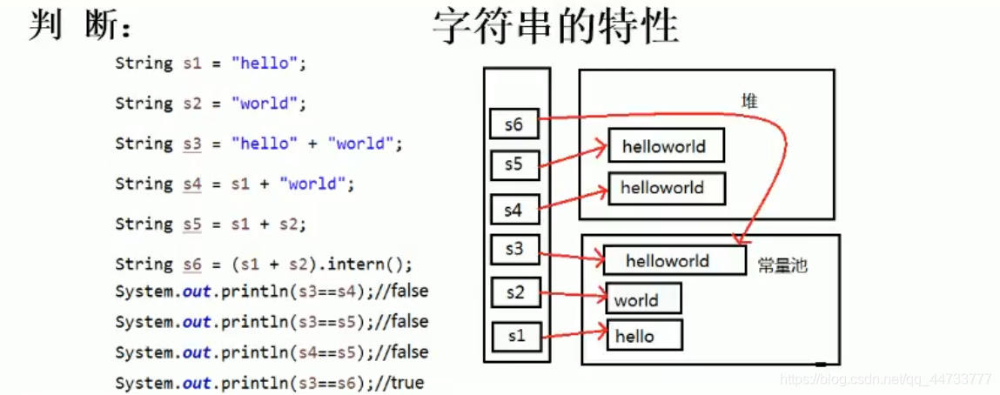

# String类
- String 是不可变的字符序列，即字符串一旦被创建，其内容不可改变
- String 类在 Java.lang 包下，Java 程序默认导入 Java.lang 包
- Java 字符串本质是 Unicode 字符序列，每个字符占用 2 字节
- Java 没有内置的字符串类型，而是提供了 String 类，每个用`""`引起来的都是字符串对象
- 字符串全部在方法区的常量池里面
- 涉及到字符串内容比较用equals()方法
- 当`+`运算符两侧的操作数中只要有一个是字符串（String）类型，系统会自动将另一个操作数转换为字符串（String）类型然后进行连接


## String类和常量池
- 在 Java 内存分析中会经常提到常量池，常量池也分为以下几种
  1. 全局字符串常量池（Global String pool）
     - 存放的字符串常量的引用值（指向堆中的字符串对象实例），是在类加载完后存放的，在每个 JVM 中只有一个，所有线程共享
  2. class 文件常量池（Class Constant Pool）
     - class 常量池是在编译的时候每个 class 都有的，在编译阶段，存放的是常量（文本字符串、final 常量等）和符号引用
  3. 运行常量池（Runtime Constant Pool）
     - 运行时常量池是在类加载完之后，将每个常量池中的符号引用值转存到运行时常量池中，也就是说，每个class都有一个运行时常量池；类在解析之后，将符号引用替换成直接引用，与全局常量池中的引用保持一致

## String类的常用方法
| 方法 |  解释说明 |
|--|--|
|char charAt(int index)  | 返回字符串第index个字符  |
|boolean equals(String other)  | 如果字符串与other相等，返回ture，否则返回false |
|boolean equalsIgnoreCase(String other) |如果字符串与other相等(忽略大小写)，返回ture，否则返回false  |
|int indexOf(String str) | 返回**从头开始**查找第一个子字符串str在字符串的索引位置，如果未找到子字符串str，则返回-1 |
|int lastIndexOf(String str) | 返回**从末尾开**始查找第一个子字符串str在字符串的索引位置，如果未找到子字符串str，则返回-1 |
|int length()  | 返回字符串的长度 |
|String replace(char oldChar,char newChar) | 返回一个新字符串，它是通过newChar替换此字符串中出现的所有oldChar而生产的 |
|boolean startsWith(String prefix)  | 如果字符串以prefix开始，则返回ture |
| boolean endsWith(String prefix) |  如果字符串以prefix结尾，则返回ture|
|String substring(int beginIndex)  | 返回一个新字符串，该串包含从原始字符串beginIndex到串尾 |
|String substring(int beginIndex,int endIndex)   |返回一个新字符串，该串包含从原始字符串beginIndex到串尾或endIndex-1的所有字符  |
|String toLowerCase() | 返回一个新字符串，该串将原始字符串中所有大写字母改成小写字母 |
|String toUpperCase()  |返回一个新字符串，该串将原始字符串中所有小写字母改成大写字母  |
|String trim()  | 返回一个新字符串，该串删除了原始字符串头部和尾部的空格 |


```java
/**
 * String 常用方法测试
 * @author Lhk
 *
 */
public class Test_01 {
	public static void main(String args[] ){
		String str1="abcdefGH";
		System.out.println(str1.charAt(4));  //e
		
		String str2=new String("abcdefGH");
		System.out.println(str1.equals(str2));  //true
		System.out.println(str1==str2);  //false
		
		String str3="ABCDEFgh";
		System.out.println(str1.equalsIgnoreCase(str3));//true
		
		String str4="cddabcbcabcdbcd";
		System.out.println(str4.indexOf("ab"));//3
		System.out.println(str4.lastIndexOf("ab"));//8
		System.out.println(str4.length());//15
		System.out.println(str4.replace("abc","ABC"));//cddABCbcABCdbcd
		System.out.println(str4.startsWith("cdd"));//true
		System.out.println(str4.endsWith("abcd"));//false
		System.out.println(str4.substring(3));//abcbcabcdbcd
		System.out.println(str4.substring(3,10));//abcbcab
		
		String str5=new String("AaBcDDefggmm");
		System.out.println(str5.toLowerCase());//aabcddefggmm
		System.out.println(str5.toUpperCase());//AABCDDEFGGMM
		
		String str6=" 1 2aba3 2  ";
		System.out.println(str6.trim());//1 2aba3 2
		
	}
}
```


## 字符串特性

**结论:**

- 常量与常量的拼接结果在常量池。且常量池中不会存在相同内容的常量。
- 只要其中有一个是变量结果就在堆中
- 如果拼接的结果调用intern()方法，返回值就在常量池中
