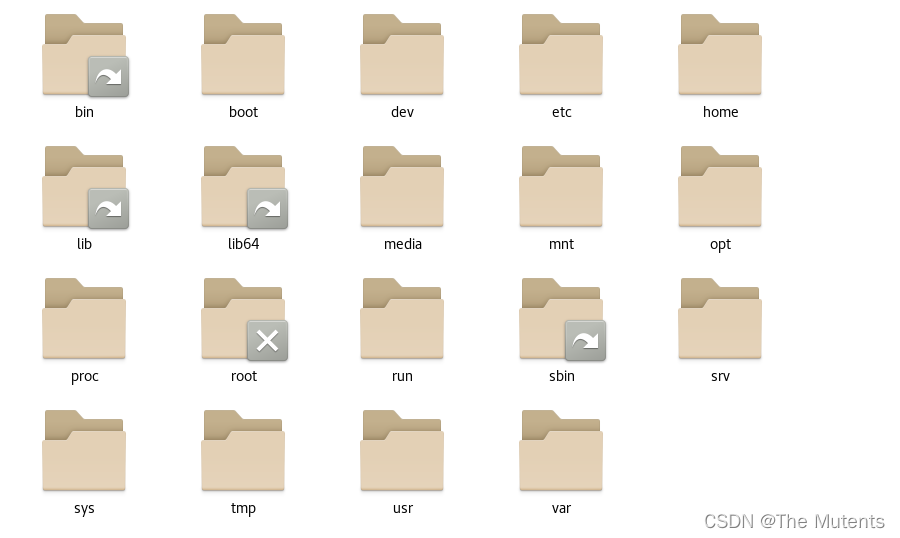
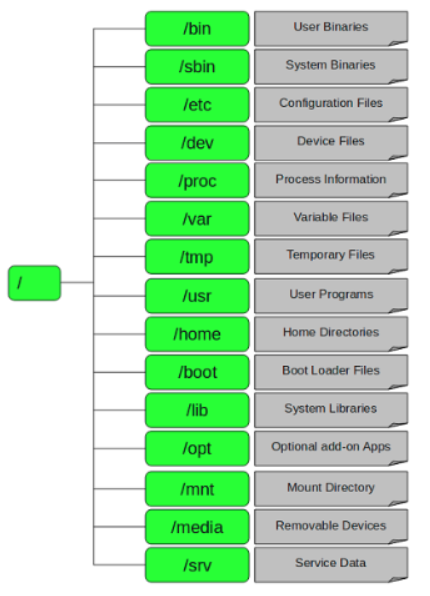

# Linux 目录结构
- Linux 的文件系统是**采用级层式的树状目录结构**，在此结构中的最上层是根目录 `/`，然后在此目录下再创建其他的目录

  

- 在 Linux 世界中，一切皆为文件

  

## 目录介绍
- `/bin`
  - 是 Binary 的缩写,这个目录存放着最经常使用的命令
- `/boot`
  - 存放的是启动 Linux 时使用的一些核心文件，包括一些连接文件以及镜像文件
- `/dev`
  - 类似于 Windows 的设备管理器，把所有的硬件用文件的形式存储
- `/etc`
  - 所有的系统管理所需要的配置文件和子目录
- `/home`
  - 存放普通用户的主目录，在 Linux 中每个用户都有一个自己的目录，一般该目录名是以用户的账号命名的
- `/lib`
  - 系统开机所需要最基本的动态连接共享库，其作用类似于 Windows 里的 DLL 文件。几乎所有的应用程序都需要用到这些共享库
- `/lib64`
  - 这个文件夹包含了特殊结构的库文件。它们几乎和 /lib 文件夹一样，除了架构级别的差异
- `/media`
  - Linux 系统会自动识别一些设备，例如U盘、光驱等等，当识别后，Linux 会把识别的设备挂载到这个目录下
- `/mnt`
  - 系统提供该目录是为了让用户临时挂载别的文件系统的，我们可以将光驱挂载在 `/mnt/` 上，然后进入该目录就可以查看光驱里的内容了
- `/opt`
  - opt 是 optional(可选) 的缩写，这是给主机额外安装软件所摆放的目录。比如你安装一个 ORACLE 数据库则就可以放到这个目录下。默认是空的
- `/proc`
  - proc 是 Processes(进程) 的缩写，
  - `/proc` 是一种伪文件系统（也即虚拟文件系统），存储的是当前内核运行状态的一系列特殊文件，这个目录是一个虚拟的目录，
  - 它是系统内存的映射，我们可以通过直接访问这个目录来获取系统信息
  - 这个目录的内容不在硬盘上而是在内存里，我们也可以直接修改里面的某些文件，比如可以通过下面的命令来屏蔽主机的 ping 命令，使别人无法 ping 你的机器
    ```bssh
    echo 1 > /proc/sys/net/ipv4/icmp_echo_ignore_all
    ```
- `/root`
  - 该目录为系统管理员，也称作超级权限者的用户主目录
- `/run`
  - 是一个临时文件系统，存储系统启动以来的信息。当系统重启时，这个目录下的文件应该被删掉或清除。
  - 如果你的系统上有 `/var/run` 目录，应该让它指向 `/run`
- `/sbin`
  - s 就是 Super User 的意思，是 Superuser Binaries (超级用户的二进制文件) 的缩写，这里存放的是系统管理员使用的系统管理程序
- `/srv`
  - 该目录存放一些服务启动之后需要提取的数据
- `/sys`
  - 这是 Linux2.6 内核的一个很大的变化。该目录下安装了 2.6 内核中新出现的一个文件系统 sysfs。
  - sysfs 文件系统集成了下面3种文件系统的信息： 
    - 针对进程信息的 proc 文件系统
    - 针对设备的 devfs 文件系统
    - 针对伪终端的 devpts 文件系统
  - 该文件系统是内核设备树的一个直观反映。当一个内核对象被创建的时候，对应的文件和目录也在内核对象子系统中被创建
- `/tmp`
  - tmp 是 temporary(临时) 的缩写这个目录是用来存放一些临时文件的
- `/usr`
  - usr 是 unix shared resources(共享资源) 的缩写，这是一个非常重要的目录，用户的很多应用程序和文件都放在这个目录下，类似于 windows 下的 program files 目录
  - `/usr/local`：这是另一个给主机额外安装软件所安装的目录。一般是通过编译源码方式安装的程序
  - `/usr/bin`：系统用户使用的应用程序与指令
  - `/usr/sbin`：超级用户使用的比较高级的管理程序和系统守护程序
  - `/usr/src`：内核源代码默认的放置目录
- `/var`
  - var 是 variable(变量) 的缩写，这个目录中存放着在不断扩充着的东西，我们习惯将那些经常被修改的目录放在这个目录下。包括各种日志文件
