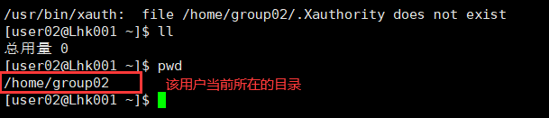
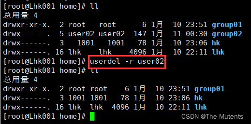
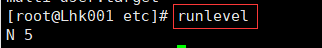
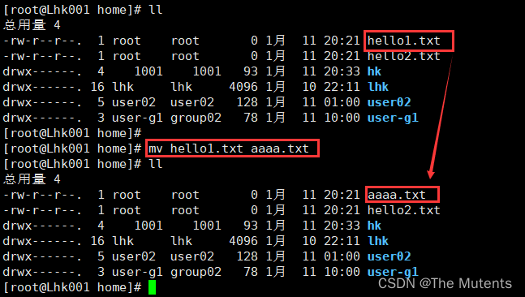
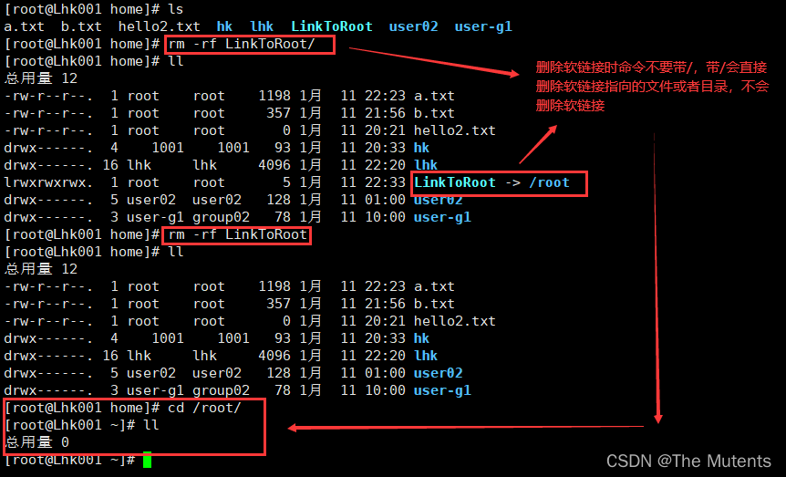
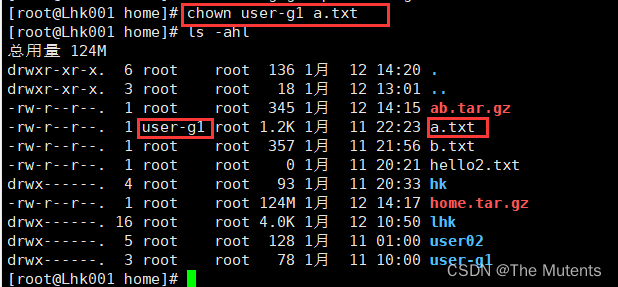
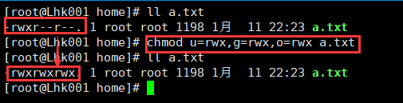
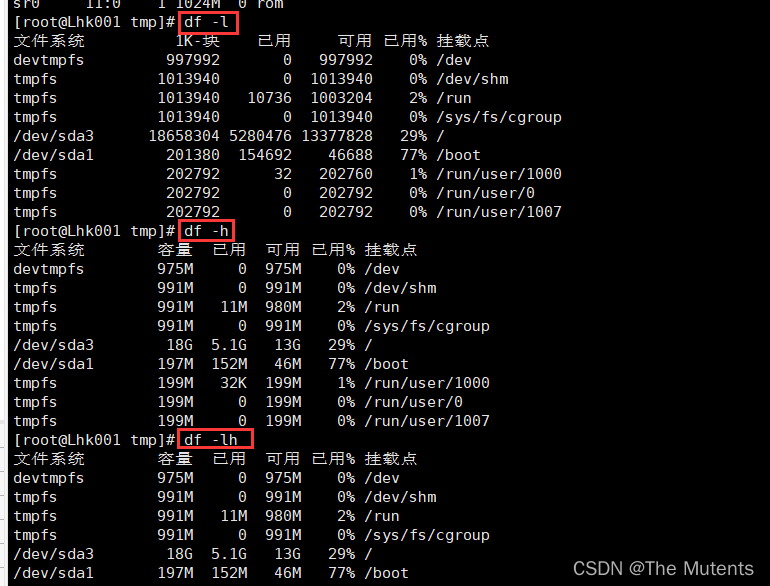
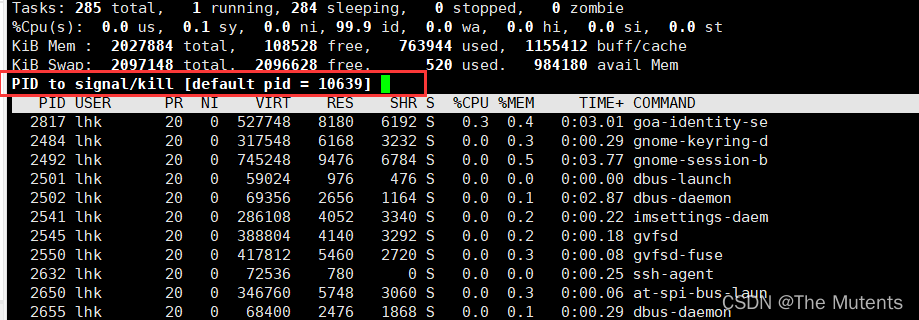

# Linux 基础知识

## 一、Linux 虚拟机的关机重启
### 1.关机、重启命令
- 在 Linux 领域内大多用在服务器上，很少遇到关机的操作。毕竟服务器上跑一个服务是永无止境的，除非特殊情况下，不得已才会关机。
- 正确的关机流程为：
  
- `sync`  >  `shutdown ` > `reboot` > ` halt`
  
- 关机指令为：`shutdown` ，你可以使用 `man shutdown` 来看一下帮助文档。

    | 指令              | 解释                                                         |
    | ----------------- | ------------------------------------------------------------ |
    | sync              | 将数据由内存同步到硬盘中                                     |
    | shutdown          | 关机指令，你可以 man shutdown 来看一下帮助文档               |
    | shutdown –h 10    | ‘This server will shutdown after 10 mins’<br/>这个命令告诉大家，计算机将在10分钟后关机，并且会显示在登陆用户的当前屏幕中 |
    | shutdown –h now   | 立马关机                                                     |
    | shutdown –h 20:25 | 系统会在今天20:25关机                                        |
    | shutdown –h +10   | 十分钟后关机                                                 |
    | shutdown –r now   | 系统立马重启                                                 |
    | shutdown –r +10   | 系统十分钟后重启                                             |
    | reboot            | 就是重启，等同于 shutdown –r now                             |
    | halt              | 关闭系统，等同于 shutdown –h now 和 poweroff                 |


## 二、用户和组
### 1.用户登录和注销
1. 登录时尽量少用 root 帐号登录，因为它是系统管理员，最大的权限，避免操作失误。可以先利用普通用户登录，登录后再用”`su 用户名`’命令来切换成系统管理员身份.
2. 在提示符下输入 `logout` 即可注销用户 
   - logout 注销指令在图形运行级别无效，在运行级别 3 下有效.

### 2.用户管理
#### 2.1创建用户

- 基本语法：`useradd  用户名`

  

- 注：
  1. 当创建用户成功后，会自动的创建和用户同名的家目录
  2. 也可以通过 `useradd -d 指定目录 新的用户名`，自动给新创建的用户指定家目录，
  

- **注意避坑**：这种创建方式是先创建目录再创建用户，不是自动创建的目录，在进行远程连接的时候，不会显示用户名

   
  远程登录后如下
  

#### 2.2指定或修改用户密码
- 基本语法：`passwd 用户名`

  

- 指定密码后进行远程登录

  

#### 2.3删除用户
- 基本语法: 
  - `userdel 用户名` 这种删除用户方式会保留用户家目录
    
  - `userdel -r 用户名` : 这种删除用户方式会把户家目录也删除掉
    
- 注：在删除用户的时候建议使用第一种方式


#### 2.4 查询用户信息
- 基本语法: `id 用户名` 

  
  - 其中：uid 为用户 id 号，gid 为组 id 号，组为组名

#### 2.5 切换用户
- 基本语法: `su 切换用户名`

  
- 注：
  1. 从权限高的用户切换到权限低的用户，不需要输入密码，反之需要。
  2. 当需要返回到原来用户时，使用 `exit` 指令

#### 2.6 查看当前登录用户
- 基本语法: `whoami` / `who am I`

  

### 3. 用户组管理
- 每个用户都有一个用户组，系统可以对一个用户组中的所有用户进行集中管理。不同 Linux 系统对用户组的规定有所不同，如 Linux下的用户属于与它同名的用户组，这个用户组在创建用户时同时创建。

#### 3.1 新增用户组
- 基本语法: `groupadd 组名`
- 另外一种方式：在添加用户的时候直接加上组，用户即可添加到指定用户组中，使用如下命令
  - `useradd -g 用户组 用户名`
  

#### 3.2 删除用户组
- 基本语法: `groupdel 组名`

  
- 注意：若用户组里面存在用户，则不能删除用户组

#### 3.3 修改用户的组
- 基本语法：
  - `usermod -g 用户组 用户名`
  
     
  - `usermod –d 目录名 用户名`：改变该用户登陆的初始目录。

### 4.用户和组的相关文件
1. `/etc/passwd 文件`：用户（user）的配置文件，记录用户的各种信息
   - 每行的含义：`用户名:口令(密码):用户标识号(用户id):组标识号(组id):注释性描述:主目录(用户家目录):登录Shell`
   

2. `/etc/shadow 文件`：口令的配置文件
- 每行的含义：`登录名:加密口令:最后一次修改时间:最小时间间隔:最大时间间隔:警告时间:不活动时间:失效时间:标志`
  

3. `/etc/group 文件`
- 组(group)的配置文件，记录 Linux 包含的组的信息
- 每行含义：`组名:口令:组标识号:组内用户列表`
  
  

## 三、Linux 的实用指令
### 1.指定运行级别（基于 centos7）
#### 1.1 Linux 中有七大运行级别：
- 七大运行级别
  - 0 ：关机,系统默认的运行级别不能设置为 0，否则无法正常启动
  - 1 ：单用户【找回丢失密码】 
  - 2 ：多用户状态没有网络服务
  - 3 ：多用户状态有网络服务
  - 4 ：系统未使用保留给用户
  - 5 ：图形界面
  - 6 ：系统重启，系统默认的运行级别不能设置为6，否则无法正常启动
- 打开 centos7 中的 /etc/inittab 文件，里面表示现在使用 systemd 而不再使用 inittab，在 inittab 里面添加配置都不会生效，具体说明参考下图


#### 1.2  cenos7 中查看所有运行级别
- 命令如下
    ```bash
    ll /usr/lib/systemd/system/runlevel*target`
    ```
  

#### 1.3  查看默认的系统级别
- 命令如下
    ```bash
    systemctl get-default
    ```
  

#### 1.4 修改默认运行级别
- 命令如下：
    ```bash
    systemctl set-default TARFET.target
    ```
  

#### 1.5 查看和切换当前运行级别
- 命令如下：
  - `runlevel` 查看当前运行级别
  
    

  - `init [level]`  切换运行级别
    

    - 切换完成后，虚拟机运行 3 级别
      

#### 1.7 面试题：如何找回丢失的 root 密码
- 进入单用户级别，然后修改root密码，因为进入单用户级别不需要密码即可登录root，不过不可以通过远程连接进入Linux系统的单用户模式，需要在 Linux 主机中进行操作才能进入单用户级别。
- 具体如何进入Linux单用户级别自行百度

### 2.帮助指令
#### 2.1 man 获得帮助信息 
- 基本语法：`man [命令或配置文件]`
- 功能描述：获得帮助信息

  
  
  

#### 2.2 help 指令
- 基本语法: `help 命令`
- 功能描述：获得shell内置命令的帮助信息
  

### 3.文件目录类指令
#### 3.1 pwd 指令
- 基本语法: `pwd` 
- 功能描述：显示当前工作目录的绝对路径

  

####  3.2 ls 指令
- 基本语法 ：`ls [选项] [目录或是文件]` 
  - 常用选项：
    - `-a` ：显示当前目录所有的文件和目录，包括隐藏的。
    - `-l `：以列表的方式显示信息
    
  
  

#### 3.3 cd 指令
- 基本语法：`cd [参数]` 
- 功能描述：切换到指定目录
- 常用参数：
  - 绝对路径和相对路径 `cd ~` 或者`cd` ：回到自己的家目录 
  - `cd..` ：回到当前目录的上一级目录
  
  

#### 3.4 mkdir 指令
- `mkdir`指令用于创建目录 
- 基本语法 `mkdir [选项] 要创建的目录名` 
- 常用选项
  - `-p `：创建多级目录
    - 不加 `-p` 使用该命令时，只能一级一级的创建目录，不能一次创建多级目录

  
  

#### 3.5 rmdir 指令
- `rmdir`指令删除空目录 
- 基本语法 `rmdir [选项] 要删除的空目录`
   
- 注：
  - `rmdir` 删除的是空目录
    - 如果目录下有内容时无法删除的。
    - 如果需要删除非空目录，需要使用命令`rm -rf 要删除的目录`
    

#### 3.6 touch 指令touch指令
- `touch`指令创建空文件 
- 基本语法 `touch 文件名称`
  - 该命令可以一次性创建多个文件
    

#### 3.7 cp 指令（拷贝）
- `cp` 指令拷贝文件到指定目录
- 基本语法 `cp [选项] source dest` 
- 常用选项：
  - `-r` ：递归复制整个文件夹

   

   

   再次拷贝同一文件会提示是否覆盖文件，通过 `\cp `可以进行强制覆盖不提示
   

#### 3.8 rm 指令
- `rm` 指令移除文件或目录
- 基本语法 `rm [选项] 要删除的文件或目录` 
- 常用选项：
  - `-r` ：递归删除整个文件夹
  - `-f` ：强制删除不提示（force 强制）

  删除文件
  
  
  删除目录

  

#### 3.9 mv 指令
- `mv` 移动文件与目录或重命名 
- 基本语法 ：
  - `mv oldNameFile newNameFile` (命令功能：重命名) 
  - `mv /temp/movefile /targetFolder` (命令功能：移动（剪切）文件)

  

  

#### 3.10 cat 指令
- `cat` 查看文件内容 
- 基本语法 `cat [选项] 要查看的文件` 
- 常用选项：
  - `-n` ：显示行号
  - `cat` 只能浏览文件，而不能修改文件（只读），为了浏览方便，一般会带上 管道命令 `| more`，进行分页显示

  

    

  分页后，敲击空格键显示下一页
  

#### 3.11 more 指令
- `more` 指令是一个基于VI编辑器的文本过滤器，它以全屏幕的方式按页显示文本文件的内容。
- 基本语法 ：`more 要查看的文件`
  

- `more` 指令中内置了若干快捷键，详见操作说明如下
  

#### 3.12 less 指令
- `less` 指令用来**分屏**查看文件内容，它的功能与more指令类似，但是**比more指令更加强大**，支持各种显示终端。
- `less`指令在显示文件内容时，并不是一次将整个文件加载之后才显示，而是根据显示需要加载内容，对于显示大型文件具有较高的效率。 
- 基本语法 ：`less 要查看的文件`

  

- 快捷键操作说明如下

  

#### 3.13 `>` 指令、`>>` 指令
- `>`指令：`>` 输出重定向，会将原来文件的内容覆盖
- `>>` 指令：`>>` 追加 ，不会覆盖原来文件的内容，而是追加到文件的尾部

- 基本语法
  - `ls -l >文件` （功能描述：列表的内容写入文件a.txt中，若没有该文件则自动创建该文件，若存在该文件则覆盖该文件里面的内容）
  
    
  - `ls -al >>文件`（功能描述：列表的内容追加到文件b.txt的末尾） 
    
  - `cat 文件1 > 文件2` （功能描述：将文件1的内容覆盖到文件2）
    
  - `echo "内容">> 文件`
     

#### 3.14 echo 指令
- `echo`输出内容到控制台。 
- 基本语法 `echo [选项] [输出内容]`
- `echo` 常用于输出环境变量或者输出字符串
  

#### 3.15 head 指令
- `head` 用于显示文件的开头部分内容，默认情况下head指令显示文件的前10行内容 
- 基本语法 ：
  - `head 文件` (功能描述：查看文件头10行内容)
  - `head -n 5 文件` (功能描述：查看文件头5行内容，5可以是任意行数)
    

#### 3.16 tail 指令
- `tail` 用于输出文件中尾部的内容，默认情况下tail指令显示文件的最后10行内容。
-  基本语法 
  - `tail 文件`（功能描述：查看文件头10行内容）
  - `tail -n 5 文件` （功能描述：查看文件头5行内容，5可以是任意行数） 
  - `tail -f 文件` （功能描述：实时追踪该文档的所有更新，工做中常用）

  
- 实时监控文档更新
  1. 先在 Xshell 中进行文档更新监控
     
  2. 在 Linux 终端对文档进行更新
     
  3. 监控文档更新成功
     

#### 3.16 ln 指令
- 软链接也成为符号链接，类似于 windows 里的快捷方式，主要存放了链接其他文件的路径
- 基本语法:
  - `ln -s [原文件或目录][软链接名]` （功能描述：给原文件创建一个软链接）
    
  - 删除软连接
    

- 误删 root 目录如何恢复：
  - 若 /root 目录还在，而里面的内容全部被删掉了，使用如下命令即可
    ```bash
    [root@Lhk001 ~]# cp -a /etc/skel/.[!.]* /root
    [root@Lhk001 ~]# reboot
    ```
  - 若连 /root 也被删掉了，则使用`mkdir /root`先创建一个/root目录,再执行上述命令即可
    > 主要是把 /etc/skel/ 里面的文件拷贝回去就行了
    >
    > 其中 /etc/skel/ 目录是用来存放新用户配置文件的目录，当我们添加新用户的时候，这个目录下的所有文件会自动被复制到新添加的用户的家目录下。
    > 这个目录下的所有文件都是隐藏文件（以.点开头的文件）
    > 通过修改、添加、删除 /etc/skel 目录下的文件，我们可为新创建的用户提供统一的、标准的、初始化用户环境。所以当 /root 目录被误删除，可以从 /etc/skel 中复制一份文件到 /root 下。
    > 由于是刚部署完成的生产环境，相关服务还未有数据进入，以此将服务器进行重启,重启之后恢复完成。若是在正式环境中，我们要考虑服务器能否重启，若不能，则将 /etc/skel 中的文件复制到 /root 下即可。

#### 3.17 history 指令
- 查看已经执行过历史命令,也可以执行历史指令
- 基本语法 ：
  - `history` （功能描述：查看已经执行过历史命令）
  
  

  

  

### 4. 时间日期类指令
#### 4.1 date 指令
- 显示日期
  - 基本语法 
    - `date` （功能描述：显示当前时间）
    - `date +%Y` （功能描述：显示当前年份）
    - `date +%m`（功能描述：显示当前月份） 
    - `date +%d` （功能描述：显示当前是哪一天） 
    - `date "+%Y-%m-%d%H:%M:%S"`（功能描述：显示年月日时分秒）

    
- 设置日期
  - 基本语法 `date -s 字符串时间`
  
  

#### 4.2 cal 指令
- 查看日历指令
- 基本语法
  - `cal [选项]` （功能描述：不加选项，显示本月日历）
  

### 5.搜索查找类
#### 5.1 find 指令
- `find` 指令将从指定目录向下递归地遍历其各个子目录，将满足条件的文件或者目录显示在终端。
- 基本语法 ： `find [搜索范围] [选项]`
  - 常用选项说明：
  
    

  - `find / -size +20M`  查找大于20M的文件
  - `find / -size -20M`  查找小于20M的文件
  - `find / -size 20M`  查找等于20M的文件
  
  
  
  

  - 也可以使用通配符进行查找
  
    

#### 5.2 locate 指令
- `locate` 指令可以快速定位文件路径
- `locate` 指令利用事先建立的系统中所有文件名称及路径的**locate 数据库**实现快速定位给定的文件。
- `locate` 指令无需遍历整个文件系统，查询速度较快
- 为了保证查询结果的准确度，管理员必须定期更新 `locate` 时刻
- 基本语法： `locate 搜索文件`
- 特别说明：由于locate指令基于数据库进行查询，**所以第一次运行前，必须使用`updatedb`指令创建 locate 数据库。**
  

#### 5.3 grep 指令和管道符号 `|`
- `grep` 过滤查找 
- 管道符 `|`，表示将前一个命令的处理结果输出传递给后面的命令处理
- 基本语法： `grep [选项] 查找内容 源文件`
  - 常用选项：
  
    

  

#### 5.4 压缩和解压类指令
- `gzip` 用于压缩文件
- `gunzip` 用于解压的 
- 基本语法：
  - `gzip 文件` （功能描述：压缩文件，只能将文件压缩为*.gz文件）
  - `gunzip 文件.gz` （功能描述：解压缩文件命令）

  

  

--------------------------------------------------------------------------
- `zip` 用于压缩文件
- `unzip` 用于解压的，这个在项目打包发布中很有用 
- 基本语法 ：
  - `zip [选项] XXX.zip 将要压缩的内容`（功能描述：压缩文件和目录的命令） 
    - `zip`常用选项：
      - `-r`：递归压缩，即压缩目录 
  - `unzip [选项] XXX.zip` （功能描述：解压缩文件）
    - ``unzip`的常用选项：
      - `-d<目录>` ：指定解压后文件的存放目录
- 例：
  - 使用 `zip -r home.zip /home/` 命令对 home 目录进行打包
  - 使用 `unzip -d /opt/rh home.zip` 命令将 home.zip 解压到/opt/rh目录下

--------------------------------------------------------------------------
- `tar` 指令是打包指令，最后打包后的文件是 `.tar.gz` 的文件。
- 基本语法 ：
  - `tar [选项] XXX.tar.gz 打包的内容` (功能描述：打包目录，压缩后的文件格式`.tar.gz`) 
  - 常用选项：
    
  
    
- 例
  - 使用命令 `tar -zcvf home.tar.gz /home/` 打包home目录
  - 使用 `tar -zxvf xxx.tar.gz -C 目录`命令，可以将压缩包解压到指定目录下，需注意，该目录必须要存在才可进行解压，否则解压会失败

## 四、组管理和权限管理
### 1.Linux 组管理
- 基本介绍：在linux中的每个用户必须属于一个组，不能独立于组外，在linux中每个文件都有**所有者**、**所在组**、**其它组**的概念。

#### 1.1 文件/目录所有者
- 所有者一般为文件的创建者,谁创建了该文件，就自然的成为该文件的所有者
- 查看文件的所有者，指令：`ls -ahl`

  
- 修改文件所有者，指令：`chown 用户名 文件名`
  - 修改所有者后，所在组不会改变
  
  

#### 1.2 文件/目录所在组
- 当某个用户创建了一个文件后，这个文件的所在组就是该用户所在的组。
- 查看文件/目录所在组 
  - 基本指令 `ls –ahl`
- 修改文件所在的组
  - 基本指令 `chgrp 组名 文件名`

#### 1.3 其它组
- 除文件的所有者和所在组的用户外，系统的其它用户都是文件的其它组。

### 2.权限管理
- 进行权限管理前，先了解[Linux文件的基本属性](https://www.runoob.com/linux/linux-file-attr-permission.html)
  

#### 2.1 rwx 权限详解
- 文件的 rwx
  - `r` 代表可读(read): 可以读取,查看 
  - `w` 代表可写(write): 可以修改,但是不代表可以删除该文件,删除一个文件的前提条件是 对该文件所在的目录有写权限，才能删除该文件. 
  - `x` 代表可执行(execute):可以被执行 

- 目录的 rwx
  - `r` 代表可读(read): 可以读取，`ls` 查看目录内容 
  - `w` 代表可写(write): 可以修改,目录内创建+删除+重命名目录 
  - `x` 代表可执行(execute):可以进入该目录

- rwx 还可用数字表示:
  - r=4,w=2,x=1 因此 rwx=4+2+1=7

#### 2.2 修改权限`chmod`
- 通过`chmod `指令，可以修改文件或者目录的权限
- 第一种方式：`+` 、`-`、`=` 变更权限 
  - `u`: 所有者 
  - `g`: 所有组 
  - `o`: 其他人 
  - `a`: 所有人(u、g、o的总和) 
  - `chmod u=rwx,g=rx,o=x 文件目录名` 
  - `chmod o+w 文件目录名` 
  - `chmod a-x 文件目录名`

  

  

    

- 第二种方式：通过数字变更权限
  - 规则： r=4，w=2 ，x=1 ，rwx=4+2+1=7 
  - 实际就是将二进制转为十进制
    - 例如：
      - `rwx`——>111——>7
      - `r--`——>100——>4
      - `-w-`——>010——>2
      - `--x`——>001——>1
  - 则 `chmod u=rwx,g=rx,o=x 文件目录名` 相当于`chmod 751 文件目录名`
    

#### 2.3修改文件所有者 `chown`
- 用法：
  - `chown newowner file` 改变文件的所有者 
  - `chown newowner:newgroup file`  改变用户的所有者和所有组
  - `-R` 如果是目录 则使其下所有子文件或目录递归生效
  
  

#### 2.4修改文件所在组 `chgrp`
- 基本用法 
  - `chgrp newgroup file` 改变文件的所有组
  - `-R` 如果是目录 则使其下所有子文件或目录递归生效

  

## 五、定时任务调度
### 1. crond 任务调度
- `crontab` 进行定时任务的设置 
- 概述 
  - 任务调度：是指系统在某个时间执行的特定的命令或程序。
  - 任务调度分类：
    1. 系统工作：有些重要的工作必须周而复始地执行。如病毒扫描等
    2. 个别用户工作：个别用户可能希望执行某些程序，比如对mysql数据库的备份。
- 基本语法：`crontab [选项]`
  - 常用选项：
    - `-e` 编辑crontab定时任务
    - `-l` 查询crontab任务
    - `-r` 删除当前用户所有的crontab任务

- 重启任务调度：`service crond restart`

- 对于简单的任务，可以直接在 `crontab` 中加入任务命令即可，但是对于比较复杂的任务则需要编写脚本（使用shell编程）
  - 快速入门
    - 设置任务调度文件：`/etc/crontab` 设置个人任务调度。执行`crontab –e`命令。
    - 接着输入任务到调度文件 如：`*/1* * * * ls -l /etc/ >> /tmp/to.txt`
      - 意思说每小时的每分钟执行`ls –l /etc/>>/tmp/to.txt`命令
  1. 执行`crontab –e`命令，输入`*/1* * * * ls -l /etc/ >> /tmp/to.txt`,保存并退出
     
  2. 一分钟后发现 /tmp/ 目录下出现 to.txt 文件
     
  3. 查看 to.txt 文件发现里面就是 /etc 目录列表的内容
     

- 任务命令(corn 表达式)中的参数说明
  - 5个占位符的说明
    
  - 特殊符号的说明
    

- 定时执行 shell 脚本
  1. 写一个 xx.sh 文件（shell脚本），里面写需要执行的任务
     
  2. 设置shell脚本文件为可执行文件
     
  3. `crontab -e` 编辑定时任务
  
     
     
  4. 执行成功
  
     
  5. 终止定时任务调度
  
     

## 六、Linux 磁盘分区、挂载
### 1.分区的基础知识
- 分区的方式： 
  - mbr 分区:
    1. 最多支持四个主分区
    2. 系统只能安装在主分区
    3. 扩展分区要占一个主分区
    4. MBR 最大只支持2TB，但拥有最好的兼容性 
  - gtp 分区:
    1. 支持无限多个主分区（但操作系统可能限制，比如 windows 下最多128个分区）
    2. 最大支持 18EB 的大容量（1EB=1024 PB，1PB=1024 TB ）
    3. Windows7 64位以后支持 gtp

### 2.Linux分区
- 原理介绍 
  - Linux 来说无论有几个分区，分给哪一目录使用，它归根结底就只有一个根目录，一个独立且唯一的文件结构 , Linux 中每个分区都是用来组成整个文件系统的一部分。
  - Linux 采用了一种叫“载入”的处理方法，它的整个文件系统中包含了一整套的文件和目录，且将一个分区和一个目录联系起来。这时要载入的一个分区将使它的存储空间在一 个目录下获得。

- 硬盘说明 
  - Linux 硬盘分 IDE 硬盘和 SCSI 硬盘，目前基本上是 SCSI 硬盘 
  - 对于 IDE 硬盘，驱动器标识符为 `hdx~ `
    - 其中 `hd` 表明分区所在设备的类型，这里是指 IDE 硬盘了
    - `x` 为盘号（a为基本盘，b为基本从属盘，c为辅助主盘，d为辅助从属盘）
    - `~ ` 代表分区，前四个分区用数字 1 到 4 表示，它们是主分区或扩展分区，从 5 开始就是逻辑分区。
    - 例
      - `hda3` 表示为第一个 IDE 硬盘上的第三个主分区或扩展分区
      - `hdb2` 表示为第二个 IDE 硬盘上的第二个主分区或扩展分区
  - 对于 SCSI 硬盘则标识为`sdx~`
    - SCSI 硬盘是用`sd`来表示分区所在设备的类型的，其余则和 IDE 硬盘的表示方法一样。

- 命令`lsblk`或者`lsblk -f` 查看分区挂载情况
  
  

### 3.磁盘情况查询
- 查询系统整体磁盘使用情况
  - 基本语法 `df -h`
    

- 查询指定目录的磁盘占用情况
  - 基本语法 
    - `du -h /目录` 查询指定目录的磁盘占用情况，默认为当前目录 
      - `-s` 指定目录占用大小汇总 
      - `-h` 带计量单位 （k、M）
      - `-a` 含文件
      - `--max-depth=1` 子目录深度
      - `-c` 列出明细的同时，增加汇总值
    
    


- 磁盘情况：工作实用指令 
  - 命令 `wc` 是用来进行统计
    - 统计 /home 文件夹下文件的个数 ：`ls -l | grep "^-" | wc -l`
      
    - 统计 /home 文件夹下目录的个数：`ls -l | grep "^d" | wc -l`
      
    - 统计 /home 文件夹下文件的个数，包括子文件夹里的
      
    - 统计文件夹下目录的个数，包括子文件夹里的
      
    - 以树状显示目录结构，使用命令 `yum install tree`安装`tree`命令
      

## 七、进程管理
### 1.基本介绍
- 在 LINUX 中，每个执行的程序（代码）都称为一个进程。每一个进程都分配一 个 ID 号。 
- 每一个进程，都会对应一个父进程，而这个父进程可以复制多个子进程。例如 www 服务器。 
- 每个进程都可能以两种方式存在的。前台与后台，所谓前台进程就是用户目前的屏幕上可以进行操作的。后台进程则是实际在操作，但由于屏幕上无法看到的进程，通常使用后台方式执行。 
- 一般系统的服务都是以后台进程的方式存在，而且都会常驻在系统中。直到关机才才结束。

### 2.显示系统执行的进程
- 基本用法
  - `ps`命令是用来查看目前系统中，有哪些正在执行，以及它们执行的状况。 可以不加任何参数，一般使用 `ps -aux` 
  - `ps -a`:显示当前终端的所有进程信息
  - `ps -u`:以用户的格式显示进程信息
  - `ps -x`:显示后台进程运行的参数

- `ps` 详解
  - 指令：`ps –aux|grep xxx` ，查询指定进程，比如查看有没有 sshd 服务
    
  - 列说明 

    | 列名称     | 说明                                                         |
    | -------- | ------------------------------------------------------------ |
    | System V | 展示风格                                                     |
    | USER     | 用户名称                                                     |
    | PID      | 进程号                                                       |
    | %CPU     | 进程占用CPU的百分比                                          |
    | %MEM     | 进程占用物理内存的百分比                                     |
    | VSZ      | 进程占用的虚拟内存大小（单位：KB）                           |
    | RSS      | 进程占用的物理内存大小（单位：KB）                           |
    | TTY      | 终端名称，缩写                                               |
    | STAT     | 进程状态，其中S-睡眠，s-表示该进程是会话的先导进程，N-表示进程拥有比普通优先级更低的优先级，R-正在运行，D-短期等待，Z-僵死进程，T-被跟踪或者被停止等等 |
    | STARTED  | 进程的启动时间                                               |
    | TIME     | CPU时间，即进程使用CPU的总时间                               |
    | COMMAND  | 启动进程所用的命令和参数，如果过长会被截断显示               |

    

- 查看进程的父进程
  - `ps -ef` 是以全格式显示当前所有的进程
  - `ps -ef | grep xxx` 是以全格式显指定的进程
    - `-e` 显示所有进程。
    - `-f` 全格式。 显示风格是 BSD 风格
      
    - 列说明

      | 列名称  | 说明                                                         |
      | ----- | ------------------------------------------------------------ |
      | UID   | 用户ID                                                       |
      | PID   | 进程ID                                                       |
      | PPID  | 父进程ID                                                     |
      | C     | CPU用于计算执行优先级的因子。数值越大，表明进程是CPU密集型运算，执行优先级会降低；数值越小，表明进程是I/O密集型运算，执行优先级会提高 |
      | STIME | 进程启动的时间                                               |
      | TTY   | 完整的终端名称                                               |
      | TIME  | CPU时间                                                      |
      | CMD   | 启动进程所用的命令和参数                                     |

      

### 3.终止进程 kill 和 killall
- 介绍: 若是某个进程执行一半需要停止时，或是已消了很大的系统资源时，此时可以考虑停止该进程。使用kill命令来完成此项任务。
- 基本语法：
  - `kill [选项] 进程号`（功能描述：通过进程号杀死进程） 
  - `killall 进程名称`（功能描述：通过进程名称杀死进程，也支持**通配符**，这在系统因负载过大而变得很慢时很有用） 
  - 常用选项：
    - `-9` :表示强迫进程立即停止

1. 踢掉某个非法登录用户
   
2.  终止远程登录服务 sshd, 在适当时候再次重启 sshd 服务
    
    

3. 终止多个 gedit 编辑器

   

4. 强制杀掉一个终端
   

### 4. 查看进程树
- 基本语法：
  - `pstree [选项]` ,可以更加直观的来看进程信息 
  - 常用选项：
    - `-p` :显示进程的PID
    - `-u` :显示进程的所属用户
    
    
    

### 5.服务管理
- 介绍: 服务(service) 本质就是进程，但是是运行在后台的，通常都会监听某个端口，等待其它程 序的请求，比如(mysql , sshd 防火墙等)，因此我们又称为守护进程，是 Linux 中非常重要的知识点
- service 管理指令： `service 服务名 [start | stop | restart | reload | status]`
- 在 CentOS7.0 后 不再使用 `service`
  - 而是用`systemctl`管理命令：`systemctl [start | stop | restart | reload | status] 服务名`

- 注意细节：
  - 这种方式关闭或者启用防火墙后，立即生效。
    - 可以通过在 Windows 中使用 `telnet ip 端口` 检测某个端口是否在监听
      
  - 这种方式对服务进行管理只是临时生效，当重启系统后，还是回归以前对服务的设置。
  - 如果希望设置某个服务自启动或关闭永久生效，要使用`chkconfig`指令

1. 查看当前防火墙的状况
   
2. 关闭防火墙
   
3. 开启防火墙
   

- 查看服务名:
  - 方式1：使用 `setup` -> 系统服务 就可以看到。
    
    
    

  - 方式2: `ls -l /etc/init.d/` 可查看服务名称
    - centos7 使用 `systemctl list-unit-files` 查看所有服务名称
      
    

### 6.动态监控进程
- 介绍：`top` 与 `ps` 命令很相似。它们都用来显示正在执行的进程。
  - `top` 与 `ps` 最大的不同之处，在于 `top` 在执行一段时间可以更新正在运行的的进程。
- 基本语法：`top [选项]`
  - 选项说明：
    - `-d` 秒数 指定 top 命令每隔几秒更新。默认是 3 秒在 top 命令的交互模式当中可以执行的命令
    - `-i` 使 top 不显示任何闲置或者僵死进程。
    - `-p` 通过指定监控进程 ID 来仅仅监控某个进程的状态。
  - 交互操作说明，执行 top 命令后再进行输入以下命令
    - `P` 以 CPU 使用率排序，默认就是此项
    - `M` 以内存的使用率排序
    - `N` 以 PID 排序
    - `q` 退出 top

- 3秒刷新一次
  

- 查看指定用户进程情况，先执行 `top` 查看执行的程序，再输入 `u`，输入用户名，回车即可
  

- 终止指定的进程：先执行 `top` 查看执行的程序，然后输入`k`，再输入要结束的进程 ID 号，回车即可
  

- 指定系统状态更新的时间
  


### 7.监控网络状态
#### 7.1查看系统网络情况 netstat
- 基本语法 ：
  - `netstat [选项]` 
  - 选项说明 ：
    - `-an` 按一定顺序排列输出
    - `-p` 显示哪个进程在调用
  
  
  

#### 7.2 检测主机连接命令 ping
- `ping`是一种网络检测检测工具，它主要是用检测远程主机是否正常，或是两部主机间 的介质是否为断、网线是否脱落或网卡故障。 
  - 如: `ping ip地址`

## 八 、PPM 与 YUM
### 1.rpm 包的管理
- 介绍：一种用于互联网下载包的打包及安装工具，它包含在某些 Linux 分发版中。它生成具有.RPM 扩展名的文件。RPM 是 RedHat Package Manager（RedHat 软件包管理工具）的缩写，类似 windows 的 setup.exe，这一文件格式名称虽然打上了 RedHat 的标志，但理念是通用的。
  - Linux 的分发版本（suse,redhat, centos 等等）都有采用，可以算是公认的行业标准了。

- rpm 包名基本格式如：`firefox-91.2.0-4.el7.centos.x86_64`
  - 名称: firefox
  - 版本号：91.2.0
  - 适用操作系统: el7.centos.x86_64 
    - 表示 centos7.x 的 64 位系统
    - 如果是 i686、i386 表示 32 位系统，noarch 表示通用

- rpm 包的其它查询指令：
  - 查询所安装的所有rpm软件包
    - `rpm -qa` 
    - `rpm -qa | more` 
    - `rpm -qa | grep xxx`  例：`rpm -qa | grep firefox` 
    
    
    

  - 查询软件包是否安装：`rpm -q 软件包名` 
    - 例： `rpm -q firefox`

  - 查询软件包信息：`rpm -qi 软件包名` 
    - 例：`rpm -qi firefox`

  - 查询软件包中的文件：`rpm -ql 软件包名` 
    - 例：`rpm -ql firefox`
  
  - 查询文件所属的软件包：`rpm -qf 文件全路径名` 
    - 例：`rpm -qf /etc/passwd`

  - 卸载 rpm 包： 
    - 基本语法 `rpm -e RPM包的名称`
    - 细节：
      1. 如果其它软件包依赖于您要卸载的软件包，卸载时则会产生错误信息
      2. 如果我们就是要删除 foo 这个 rpm 包，可以增加参数 `--nodeps` ,就可以强制删除，但是一般不推荐这样做，因为依赖于该软件包的程序可能无法运行
         - 如： `rpm -e --nodeps foo`

  - 安装 rpm 包： 
    - 基本语法：`rpm -ivh RPM包全路径名称`
    - 参数说明：
      - `i`=install 安装
      - `v`=verbose 提示
      - `h`=hash 进度条

- 例：安装 Firefox
  - 首先找到 firefox 的安装 rpm 包，这一步需要挂载安装的 centos 的 iso 文件
    
    挂载成功后
    

  - 然后到 `/run/media/lhk/CentOS\ 7\ x86_64/Packages` 下面找 firefox 的 rmp 包
    

  - 找到 firefox 的 rpm 包后，将 rpm 包复制到 /opt/ 目录下
    
  
  - 再进行安装
    
  - 安装成功
  
    

### 2.yum
- 介绍：Yum 是一个 Shell 前端软件包管理器。
  - 基于 RPM 包管理，能够从指定的服务器自动下载RPM包并且安装，可以**自动处理依赖性关系**，并且一次安装所有依赖的软件包，前提是需要联网。

- yum 的基本指令 
  1. 查询 yum 服务器是否有需要安装的软件： `yum list | grep xx软件列表` 
  2. 安装指定的 yum 包：`yum install xxx` 下载安装
- 例
  - 查询 firefox 的包
    
  - 使用 yum 安装 firefox
    
    
    

