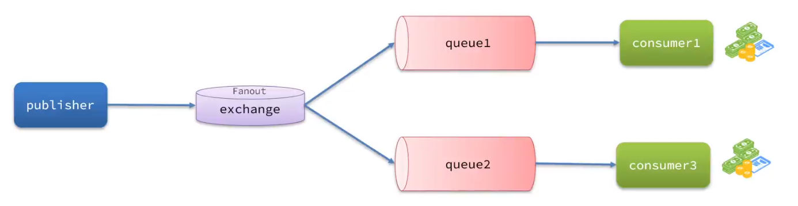
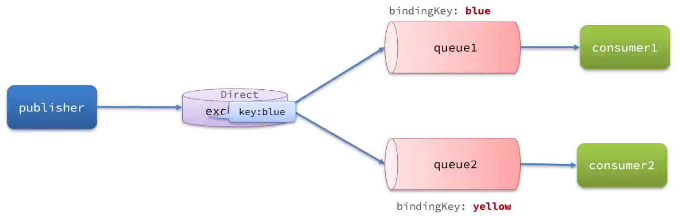
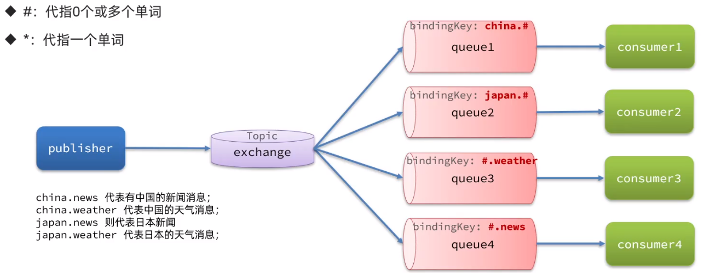
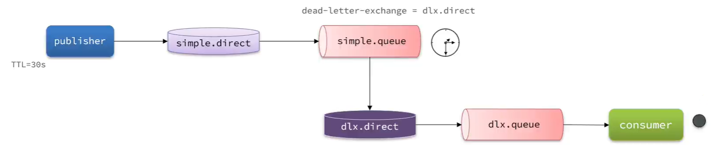

# RabbitMq

 ## 同步与异步

- 同步调用的优点

  - 时效性强

- 同步调用在微服务中的缺点

  - 耦合性高，拓展性差

  - 性能下降

  - 造成级联失败

    > 级联失败是一种系统故障现象，通常出现在网络或分布式系统中。当一个或少数几个节点或连线的失效时，这些节点的故障会通过节点之间的耦合关系引发其他节点也发生失效，进而产生级联效应，最终导致相当一部分节点甚至整个网络的崩溃。这种现象被称为级联失败。
    >
    > 级联失败通常会导致整个系统或网络的服务不可用，因此对于系统稳定性和可靠性至关重要。在网络中，级联失败的原因可能包括节点过载、通信延迟、路由错误、恶意攻击等。在分布式系统中，级联失败的原因可能包括资源争用、锁冲突、死锁等问题。
    >
    > 为了解决级联失败问题，可以采用各种策略和技术，例如：
    >
    > 1. 冗余设计：通过增加备份节点或线路来提高系统的容错性，防止节点或线路的失效导致整个系统的崩溃。
    > 2. 负载均衡：通过合理分配系统负载来避免节点过载，从而减少级联失败的可能性。
    > 3. 动态路由：通过动态选择路由来避免通信延迟和路由错误等问题，提高系统的可用性和可靠性。
    > 4. 监测和预警：通过实时监测系统状态和性能，及时发现潜在的问题和故障，并采取相应的措施进行修复和预防。
    >
    > 总之，级联失败是一种常见的系统故障现象，对于系统稳定性和可靠性至关重要。为了防止级联失败的发生，可以采用各种策略和技术来提高系统的容错性和可用性。

- 异步调用

  - 异步调用的方式是基于消息通知的方式，包含以下角色

    - 消息发送者
    - 消息代理：管理、暂存、转发消息
    - 消息接受者

  - 异步调用在微服务中的优点

    - 接触耦合、拓展性好
    - 无需等待，性能好
    - 故障隔离
    - 缓存消息，流量削峰填谷

  - 异步调用的缺点

    - 不能立即得到调用结果，时效性差

    - 不确定下游业务执行是否成功

    - 业务安全依赖于 broker 的可靠性

      > 在计算机领域，Broker通常指的是消息代理或中介，用于处理、路由和分发消息。它是一个软件组件，用于在分布式系统中实现不同组件间的通信。

## MQ 的技术选型

- MQ (Message Queue)，中文是消息队列，字面来看就是存放消息的队列。也就是异步调用中的 Broker。

|            | RabbitMq                | ActiveMq                          | RocketMq   | Kafka      |
| ---------- | ----------------------- | --------------------------------- | ---------- | ---------- |
| 公司/社区  | Rabbit                  | Apache                            | 阿里       | Apache     |
| 开发语言   | Erlang                  | Java                              | Java       | Scala&Java |
| 协议支持   | AMQP、XMPP、STOMP、SMTP | OpenWire、STOMP、REST、XMPP、AMQP | 自定义协议 | 自定义协议 |
| 可用性     | 高                      | 一般                              | 高         | 高         |
| 单机吞吐量 | 一般                    | 差                                | 高         | 非常高     |
| 消息延迟   | 微妙级                  | 毫秒级                            | 毫秒级     | 毫秒以内   |
| 消息可靠性 | 高                      | 一般                              | 高         | 一般       |

## RabbitMq 基础

### RabbitMq 的安装

- 两个端口
  - 15672：图形化 web 界面端口
  - 5672：消息通信端口

### RabbitMq 的相关概念

- virtual-host：虚拟主机，起数据隔离作用
  - RabbitMq 可以拥有多个 virtual-host，多个 virtual-host 相互隔离
  - 每个 virtual-host 都拥有属于自己的 exchange 和 queue
- publisher：消息发送者
- consumer：消息的消费者
- queue：队列，存储消息
- exchange：交换机，负责路由消息 

- 消息发送的总体流程
  - publisher :arrow_right:exchange :arrow_right:queue :arrow_right:consumer

### AMPQ 与 Spring AMPQ

> AMPQ，全称为Advanced Message Queuing Protocol，是一个提供统一消息服务的应用层标准高级消息队列协议。它是应用程协议的一个开放标准，为面向消息的中间件设计。AMPQ定义在协议层，跨语言，基于此协议的客户端与消息中间件之间可传递消息，并不受产品、开发语言等条件的影响。

> Spring AMQP是基于Spring框架的 AMQP 消息解决方案，用于简化 Spring 应用程序对消息队列的使用。它提供模板化的发送和接收消息的抽象层，提供基于消息驱动的POJO的消息监听等，方便使用RabbitMQ程序的相关开发。Spring AMQP包含一些模块，如spring-amqp（抽象）、spring-rabbit（实现）和 spring-erlang 等，每个模块分别由独立的一些Jar包组成。
>
> Spring AMQP定义了Message类，它定义了一个更一般的AMQP域模型，是Spring AMQP的重要组成部分。Message消息是当前模型中所操纵的基本单位，它由Producer产生，经过Broker被Consumer所消费。

- Spring AMQP 官方文档
  - [Spring AMQP :: Spring AMQP](https://docs.spring.io/spring-amqp/reference/index.html)
- SpringAMQP提供了几个类，用来声明队列、交换机及其绑定关系
  - Queue:用于声明队列，可以用工厂类 QueueBuilder 构建
  - Exchange:用于声明交换机，可以用工厂类 ExchangeBuilder 构建
  - Binding:用于声明队列和交换机的绑定关系，可以用工厂类 BindingBuilder 构建

### WorkQueue

- 任务模型，让多个消费者绑定到一个队列，共同消费队列中的消息

  > 在RabbitMQ中，工作队列（WorkQueue）是一种实现任务处理的模型，它通过多个消费者共享队列中的消息来实现**有序执行**密集型资源任务。在这种模式下，任务被封装为消息并将其发送到队列中，后台运行的工作进程将弹出任务并最终执行作业。当有多个工作线程时，这些工作线程将一起处理这些任务。
  >
  > 工作队列的主要思想是避免立即执行资源密集型任务，而不得不等待它完成。相反，我们将任务安排在之后执行，这有助于提高系统的扩展性和灵活性。通过将任务分解为较小的单元，并将它们放入队列中，多个消费者可以并行处理这些任务，从而提高系统的整体性能。
  >
  > 在使用RabbitMQ的工作队列时，首先需要创建一个工作队列，然后创建多个消费者，并指定队列名称。当消费者消费消息时，它们将从队列中获取消息并进行处理。这样可以确保任务按照它们进入队列的顺序被处理，从而避免了乱序处理或竞争条件的问题。
  >
  > 通过使用工作队列，我们可以更好地管理和协调多个消费者之间的任务处理，确保任务的顺序执行和资源的高效利用。

- 默认情况下，RabbitMQ 的会将消息**依次轮询投递**给绑定在队列上的每一个消费者。但这并没有考虑到消费者是否已经处理完消息，消费者消费能力不同可能出现**消息堆积**。

  - 因此我们需要修改application.yml，设置 `preFetch` 值为1，确保同一时刻最多投递给消费者1条消息

    ```yaml
    spring:
    	rabbitmq:
    		listener:
    			simple:
    				prefetch: 1 # 每次只能获取一条消息，处理完成才能获取下一个消息
    ```

- Work 模型的使用

  - 多个消费者绑定到一个队列，可以加快消息处理速度
  - 同一条消息只会被一个消费者处理
  - 通过设置 `prefetch` 来控制消费者预取的消息数量，处理完一条再处理下一条，实现能者多劳

### 交换机（Exchange）

- 真正生产环境都会经过 exchange 来发送消息，而不是直接发送到队列，交换机的类型有以下三种
  - Fanout：广播
    
    - Fanout Exchange 会将接收到的消息广播到每一个跟其绑定的queue，所以也叫广播模式
    
      
    
  - Direct：定向
  
    - Direct Exchange 会将接收到的消息根据规则路由到指定的Queue，因此称为定向路由。
  
      - 路由规则
  
        - 每一个 Queue 都与 Exchange 设置一个 BindingKey
        - 发布者发送消息时，指定消息的 RoutingKey
        - Exchange 将消息路由到 BindingKey 与消息RoutingKey 一致的队列
  
        
  
  - Topic：话题
  
    - TopicExchange 与 DirectExchange 类似，区别在于routingKey 可以是多个单词的列表，并且以`.`分割。
  
      - 指定 BindingKey 时可以使用通配符
  
      

### 消息转换器

- Spring的对消息对象的处理是由`orq.springframeworkamqp.support.converter.MessageConverter`来处理的。而默认实现是`simpleMessageConverter`，基于 JDK 的 `ObjectOutputStream` 完成序列化。
  - 存在下列问题:
    - JDK 的序列化有安全风险
    - JDK 序列化的消息太大
    - JDK 序列化的消息可读性差

### 相关API

- `RabbitTemplate.convertAndSend()`  发送消息
- `@RabbitListener` 监听消息，并可声明交换机和队列绑定
- `@Queue`
- `@Exchange`

## 高级

### 消息可靠性问题

#### 消息发送者可靠性

- 生产者重连

  - 有的时候由于**网络波动**，可能会出现客户端**连接MQ失败**的情况。通过配置我们可以开启连接失败后的重连机制

    ```yaml
    spring:
    	rabbitmq:
    		connection-timeout: 1s # 设置MQ的连接超时时间
    		template:
    			retry:
    				enabled: true # 开户超时重试机制
    				initial-interval: 1000ms # 失败后的初始等待时间
    				multiplier: 1 # 失败后下次的等待时长倍数，下次等待时长 = initial-interval * multiplier
    				max-attempts: 3 # 最大重试次数
    ```

  - 重连机制是阻塞式的，会影响性能；对于业务性能有要求的，不建议开启重试机制；或者使用异步线程进行消息发送

- 生产者确认

  - RabbitMQ 提供了 Publisher Confirm 和 Publisher Return 两种确认机制。开启确机制认后，在 MQ 成功收到消息后会返回确认消息给生产者。返回的结果有以下几种情况:

    - 消息投递到了 MQ，但是路由失败。此时会通过 Publisher Return 返回路由异常原因，然后返回ACK，告知投递成功
  - 临时消息（未持久化）投递到了 MQ，并且入队成功，返回 ACK，告知投递成功
    - 持久消息投递到了MQ，并且入队完成持久化，返回ACK ，告知投递成功
  - 其它情况都会返回 NACK，告知投递失败
    
  - 开启生产者确认机制

    ```yaml
    #在publisher这个微服务的application.yml中添加配置
    spring:
    	rabbitmq:
    		publisher-confirm-type: correlated # 开publisher confirm机制，并设置confirm类型
    		publisher-returns: true # 开publisher return机制
    ```

    > `publisher-confirm-type` 有三种模式可选
    >
    > `none`:关闭confirm机制
    > `simple`:同步阻塞等待MQ的回执消息
    > `correlated`:MQ异步回调方式返回回执消息

    - 若开publisher return 机制，需要在mq初始化时，设置 ReturnsCallback 回调函数

      ```java
      rabbitTemplate.setReturnsCallback();
      ```

    - 每一个生产者端执行单独的 confirmCallback

      > - **生产者确认机制需要额外的网络和系统资源开销，尽量不要使用**
      > - 用如果一定要使用，无需开启 Publisher-Return 机制，因为一般路由失败是自己业务问题
      > - 对于 nack（消息投递失败） 消息可以有限次数重试，依然失败则记录异常消息

#### MQ 的可靠性

- MQ消息不可靠的情况

  1. MQ 宕机，导致消息丢失

  2. 内存空间有限

     - 在消息发送到 mq 达到一定内存后会导致消息堆积，引发消息阻塞

       > 非持久消息过多会导致 MQ 进行 PageOut 
       >
       > PageOut : 消息堆积过多时，会将旧的未消费的临时消息持久化到磁盘，此过程会引发消息阻塞，即新消息无法发送到MQ

- 解决方案

  - 数据持久化

    1. 交换机持久化

       > spring 创建交换机时，会默认持久化交换机

    2. 队列持久化

       > spring 创建队列时，会默认持久化队列

    3. **消息持久化**

       - 发送消息时将 `delivery mode`设置为`2(persistent)`

  - 使用 Lazy Queue （惰性队列）

    - 特点
      - 接收到消息后**直接存入磁盘**而非内存(内存中只保留最近的消息，默认2048条)
      - 消费者要消费消息时才会从磁盘中读取并加载到内存
      - 支持数百万条的消息存储
    - 在 rabbit mq 3.12 版本后，默认所有队列都为 Lazy Queue （惰性队列）模式，且无法更改

#### 消费者的可靠性

- 消费者确认机制

  >  为了确认消费者是否成功处理消息，RabbitMQ 提供了消费者确认机制(Consumer Acknowledgement)。
  >
  > 当消费者处理消息结束后，应该向 RabbitMQ 发送一个回执，告知 RabbitMQ 自己消息处理状态。

  - 回执有三种可选值:
    - ack:成功处理消息，RabbitMQ 从队列中删除该消息
    - nack:消息处理失败，RabbitMQ 需要**再次投递消息**
    - reject:消息处理失败并拒绝该消息，RabbitMQ 从队列中删除该消息

  > SpringAMQP 已经实现了消息确认功能。并允许我们通过配置文件选择ACK处理方式，有三种方式: 
  >
  > 1. none:不处理。即消息投递给消费者后立刻 ack，消息会立刻从MQ除。非常不安全，不建议使用
  > 2. manual:手动模式。需要自己在业务代码中调用 api，发送ack或reject，存在业务入侵，但更灵活
  > 3. auto:自动模式。SpringAMQP 利用 AOP 对我们的消息处理逻辑做了环绕增强，当业务正常执行时则自动返回ack.当业务出现异常时，根据异常判断返回不同结果:
  >    - 如果是业务异常，会自动返回 nack
  >    - 如果是消息处理异常或校验异常，自动返回 reject

  - 在消费者端开启 spring  配置

    ```yml
    spring:
    	rabbitmg:
    	  listener:
    	    simple:
    		  prefetch: 1
    			acknowledge-mode: auto #none:关闭ack; manual:手动ack ; auto:自动ack
    ```

- 消费者消息失败（nack）处理策略

  - 当消费者出现异常后，消息会不断 requeue (重新入队)到队列，再重新发送给消费者，然后再次异常，再次 requeue 无限循环，导致 mq 的消息处理飙升，带来不必要的压力。

    - 我们可以利用 Spring 的 retry 机制，在消费者出现异常时利用**本地重试**，而不是无限制的 requeue 到 mq 队列，超过重试次数会删除消息

      ```yml
      spring:
        rabbitmg:
      	listener:
      	  simple:
              prefetch: 1
                retry:
                  enabled: true #开启消费者失败重试
                  initial-interval: 1000ms #初始的失败等待时长为1秒
                  multiplier: 1 #下次失败的等待时长倍数，下次等待时长=multiplier*last-interval
                  max-attempts: 3 #最大重试次数
                  stateless: true #true无状态:false有状态。如果业务中包含事务，这里改为false
      ```

    - 上述配置在超过最大重试次数后，依然会出现消息处理失败的问题

      - 若需要在处理失败后继续对消息进行处理，则使用`MessageRecoverer`接口来处理，它包含三种不同的实现:
        - `RejectAndDontRequeueRecoverer`:重试耗尽后，直接reject，丢弃消息。默认就是这种方式
        - `ImmediateRequeueMessageRecoverer`:重试耗尽后，返回nack，消息重新入队
        - `RepublishMessageRecoverer`:重试耗尽后，将失败消息投递到指定的交换机

  - 结论

    - 消费者如何保证消息一定被消费?
      1. 开启消费者确认机制为 auto，由 spring 确认消息处理成功后返回 `ack`，异常时返回`nack`
      2. 开启消费者失败重试机制，并设置`MessageRecoverer`，多次重试失败后将消息投递到异常交换机，交由人工处理

- 业务幂等性

  - 幂等是一个数学概念，用函数表达式来描述是这样的:`f(x)=f(f(x))`。在程序开发中，则是指同一个业务，执行一次或
    多次对业务状态的影响是一致的。

  - 在使用消息队列时，当一个消息被多次消费可能会引起业务的幂等性问题，因此需要确保使用消息队列时业务的幂等性

    - 解决方案

      1. 方案一：是给每个消息都设置一个唯一id，利用id区分是否是重复消息:

         > - 每一条消息都生成一个唯一的id，与消息一起投递给消费者。
         > - 消费者接收到消息后处理自己的业务，业务处理成功后将消息ID保存到数据库
         > - 如果下次又收到相同消息，去数据库查询判断是否存在，存在则为重复消息放弃处理

         - 配置消息转换器时可以配置自动创建消息id（uuid）

           ```java
           @Bean
           public MessageConverter messageConverter(){
               //1.定义消息转换器
               Jackson2JsonMessageConverter jimc = new Jackson2JsonMessageConverter();
               //2.配置自动创建消息id，用于识别不同消息，也可以在业务中基于ID判断是否是重复消息
               jjmc.setCreateMessageIds(true);
               return jjmc;
           }
           ```

         - 或者自自己在消息头中加入自定义算法的消息ID

      2. 方案二：基于业务逻辑解决业务幂等性

#### 延迟消息

> - 延迟消息：生产者发送消息时指定一个时间，消费者不会立刻收到消息，而是在指定时间之后才收到消息。
> - 延迟任务：设置在一定时间之后才执行的任务

- 死信交换机

  > 当一个队列中的消息满足下列情况之一时，就会成为死信(dead letter)
  >
  > - 消费者使用 basic.rejec t或 basic.nack 声明消费失败，并且消息的requeue参数设置为false
  > - 消息是一个过期消息(达到了队列或消息本身设置的过期时间)，超时无人消费
  > - 要投递的队列消息堆积满了，最早的消息可能成为死信
  >
  > 如果队列通过 dead-letter-exchange 属性指定了一个交换机，那么该队列中的死信就会投递到这个交换机中。这个交换机称为死信交换机(Dead LetterExchange，简称DLX)。

  - 可以使用死信交换机和实现延迟消息

    

- 延迟消息插件

  > RabbitMQ 的官方也推出了一个插件，原生支持延迟消息功能。该插件的原理是设计了一种支持延迟消息功能的交换机当消息投递到交换机后可以暂存一定时间，到期后再投递到队列。