---
sidebar_position: 1
---

# MySQL 高级第一篇

## 一、用户管理
### 用户的增删改
- mysql 登录方式
    ```bash
    mysql -h localhost -P 3306 -p dbtest1 -e "select * from emp1"
    ```
    ```bash
    mysql -uroot -p
    ```

- 创建 mysql 用户
    ```bash
    create user 'lhk' identified by '123456';
    ```
    ```bash
    #@前面为用户名，@后面接连接mysql的IP地址
    create user 'lhk'@'localhost' identified by '123456';
    ```

- 修改 mysql 用户信息（不涉及到修改用户权限,一般使用比较少）
    ```bash
    update mysql.user set user='lhk01' where user='lhk';
    #修改完成后进行刷新后才会生效
    flush privileges;
    ```

- 删除 mysql 用户
    ```bash
    #方式一：drop（推荐使用）
    drop user 'lhk';
    drop user '用户名'@'mysql数据库中user表的host字段的值'
    
    # 方式二：使用delete
    delete from mysql.user where user='用户名' and host='mysql数据库中user表的host字段的值'
    #delete完成后进行刷新后才会生效
    flush privileges;
    ```

### 用户密码的管理
- 修改当前用户密码
    ```bash
    #方式一：使用alter修改密码（推荐），user():获取当前用户名
    alter user user() identified by '密码'
    
    #方式二：set语句修改密码
    set password='新密码'
    ```

- 查看用户的加密密码
    ```bash
    #authentication_string：user表中加密密码字段
    select host,user,authentication_string from user;
    ```

- 修改其他用户的密码
    ```bash
    #方式一：alter语句修改
    alter user '用户名'@'mysql数据库中user表的host字段的值' identified by '新密码';
    
    # 方式二：set方式修改
    set password for '用户名'@'mysql数据库中user表的host字段的值'='新密码';
    ```

- 手动设置用户密码过期
    ```bash
    #设置某个用户密码过期，设置密码过期后用户仍然可以登录数据库，但是无法进行查询，需要重新设置密码后才可以正常使用
    alter user '用户名'@'mysql数据库中user表的host字段的值' password expire;
    ```
    ```bash
    #手动设置全局指定时间密码过期：
    # default_password_lifetime该全局变量默认值为0，表示禁用自动密码过期
    set persist default_password_lifetime = 天数;
    
    #手动设置全局指定时间密码过期方式二：
    #在配置文件my.cnf中[mysqld]下建立去阿奴策略：
    [mysqld]
    default_password_lifetime = 180;
    ```
    ```bash
    #手动设置单例指定时间密码过期：
    #设置N天过期,将N改为指定数字即可
    create user '用户名'@'mysql数据库中user表的host字段的值' password expire interval N day;
    alter user '用户名'@'mysql数据库中user表的host字段的值' password expire interval N day;
    
    #设置密码永不过期
    create user '用户名'@'mysql数据库中user表的host字段的值' password expire never;
    alter user '用户名'@'mysql数据库中user表的host字段的值' password expire never;
    
    #使用全局密码策略设置单例密码策略
    create user '用户名'@'mysql数据库中user表的host字段的值' password expire default;
    alter user '用户名'@'mysql数据库中user表的host字段的值' password expire default;
    ```

- 手动设置密码重用
    ```bash
    #系统变量password_history和password_reuse_interval设置密码重用策略
    #password_history：规定密码重用的数量，限制新密码不能与最近的多少个密码相同
    #password_reuse_interval：规定密码重用的周期，限制新密码不能与最近的多长时间内的密码相同
    
    #设置全局密码重用策略方式一,使用sql语句：
    set persist password_history = N;  #设置不能与最近的N个密码相同
    set persist password_reuse_interval = N;  #设置不能与最近的N天内的密码相同
    
    #方式二，修改my.cnf配置文件
    [mysqld]
    password_history = N
    password_reuse_interval = N
    ```
    
    ```bash
    #手动设置单例用户密码重用策略：
    
    #新密码不能使用最近的N个密码
    create user '用户名'@'mysql数据库中user表的host字段的值' password history N;
    alter user '用户名'@'mysql数据库中user表的host字段的值' password history N;
    
    #新密码不能使用最近N天内的密码
    create user '用户名'@'mysql数据库中user表的host字段的值' password reuse interval N day;
    alter user '用户名'@'mysql数据库中user表的host字段的值' password reuse interval N day;
    
    #新密码既不能使用最近的N个密码，也不能使用最近M天内的密码
    create user '用户名'@'mysql数据库中user表的host字段的值' password history N password reuse interval M day;
    alter user '用户名'@'mysql数据库中user表的host字段的值' password history N password reuse interval M day;
    
    #使用全局的密码重用策略
    create user '用户名'@'mysql数据库中user表的host字段的值' password history default password reuse interval default;
    alter user '用户名'@'mysql数据库中user表的host字段的值' password history default  password reuse interval default;
    ```

## 二、用户权限管理
- 查看mysql中的权限
    ```bash
    show privileges;
    ```

- 给某个用户授权
    ```bash
    grant 权限1,权限2,...权限n on 数据库名称.表名称 to '用户名'@'用户地址' [identified by '密码']
    # 如：
    grant select,insert,delete,update on dbtest1.* to 'lhk'@'localhost';
    ```

> 如果需要赋予包括 `GRANT` 的权限，添加参数`WITH GRANT 0PTION` 这个选项即可，表示该用户可以将自己拥有的权限授权给别人。经常有人在创建操作用户的时候不指定`WITH GRANT OPTION`选项导致后来该用户不 能使用GRANT命令创建用户或者给其它用户授权。

- 查看权限
    ```bash
    #查看当前用户权限
    show grants;
    # 或
    show grants for current_user;
    # 或
    show grants for current_user();
    ```

    ```bash
    #查看某个用户的全局权限
    show grants for '用户名'@'主机地址';
    ```

- 回收权限
    ```bash
    revoke 权限1,权限2...权限n on 数据库名称.表名称 from '用户名'@'主机地址';
    # 如：
    revoke all privileges on *.* form 'lhk'@'localhost';
    # 回收权限后需要重新登录才会生效
    ```

## 三、权限表
MySQL服务器通过`权限表`来`控制用户对数据库的访问`，权限表存放在`mysq数据库`中。MySQL数据库系统会根据这些权限表的内容为每个用户赋予相应的权限。这些权限表中最重要的是`user表`、`db表`。 除此之外，还有`table- priv表`、`column_priv表`和`roc_priv表`等。在MySQL启动时，服务器将这些数据库表中权限信息的内容读入内存。
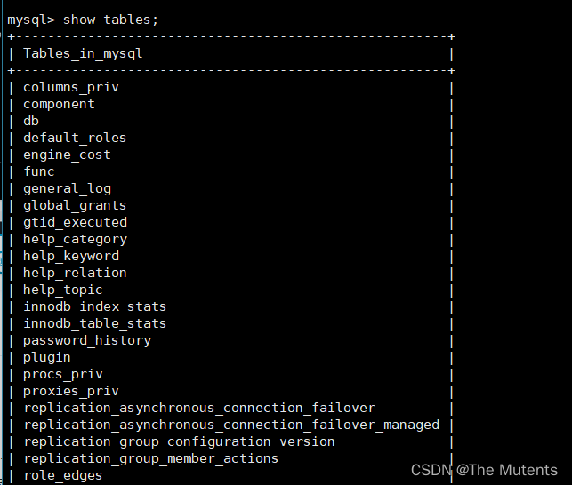
- user 表

  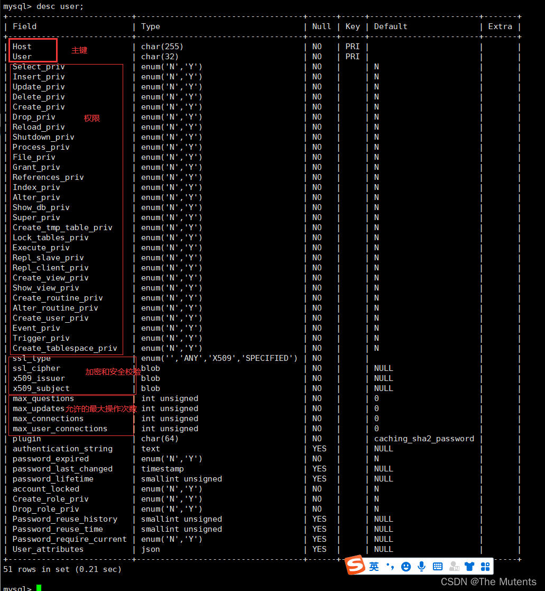 

- db 表

  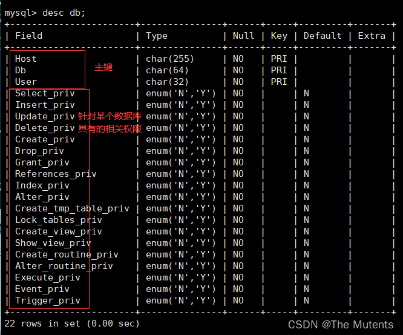

- tables_priv 表

  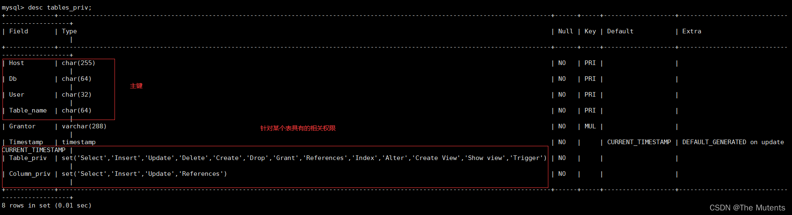

- columns_priv 表

  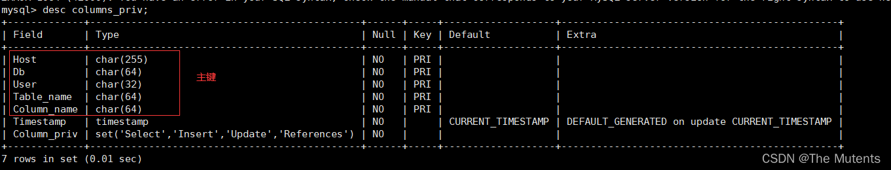

- procs_priv 表

  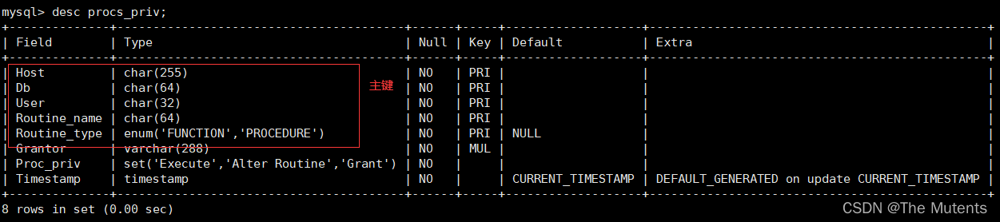


## 四、角色管理

> 角色是在 MySQL 8.0 中引入的新功能。在MySQL中 ，`角色是权限的集合` ,可以为角色添加或移除权限。`用户可以被赋予角色`，同时也被授予角色包含的权限。对角色进行操作需要较高的权限。井且像用户账户一样，角色可以拥有授予和撤销的权限。
> 引入角色的目的是方便管理拥有相同权限的用户。恰当的权限设定，可以确保数据的安全性。这是至关重要的。

- 创建角色
    ```bash
    # host_name可省略，省略后默认为%
    create role '角色名'@'host_name',['角色名'@'host_name'],...
    # 如
    create role 'manager'@'localhost';
    ```

- 给角色赋予权限
    ```bash
    grant 权限1,权限2,...,权限n on 表名 to '角色名'@'host_name'; 
    #如
    grant select,update on emp1 to 'manager'@'localhost';
    ```

- 查看角色权限
    ```bash
    show grants for '角色名'@'host_name';
    ```

- 回收角色权限
    ```bash
    revoke 权限1,权限2,...,权限n on 表名 from '角色名'@'host_name';
    ```

- 删除角色
    ```bash
    #如果你制除了角色，那么用户也就失去了通过这个角色所获得的所有权限。
    drop role '角色名';
    ```

- 给用户赋予角色
    ```bash
    grant '角色名'@'host_name' [,'角色2',...] to user '用户名'@'host_name';
    ```
  
- 激活角色 
  > MySQL 中创建了角色之后，默认都是没有被激活，也就是不能用，必须要`手动激活`，激活以后用户才能拥有角色对应的权限。

    ```bash
    #激活方式一：
    set default role '角色名'@'host_name' to '用户名'@'host_name'[,'用户名'@'host_name',...];
    #默认激活用户所有已拥有的角色如下:
    set default role all to '用户名'@'host_name'[,'用户名'@'host_name',...];
    
    #激活方式二：将系统变量activate_all_roles_on_login设置为on
    set global activate_all_roles_on_login=on;
    
    #激活角色后，用户需要重新登录，才能看到被赋予的角色
    ```

- 查询用户当前角色
    ```bash
    #如果角色末激活，结果将显示NONE
    select current_role();
    ```

- 撤销用户角色
    ```bash
    revoke '角色名'@'host_name' from '用户名'@'host_name'
    #撤销权限后，用户需要重新登录，撤销才会生效
    ```
  
- 设置强制角色
    ```bash
    #强制角色是给每个创建账户的默认角色，不需要手动设置。强制角色无法被REVOKE或者DROP
    
    #1.服务器启动前设置：进入/etc/my.cnf中设置
    [mysqld]
    mandatory_roles='角色名@host_name[,角色名@host_name,...]'
    
    #2.运行时设置
    set persist mandatory_roles='角色名@host_name[,角色名@host_name,...]';#系统重启后仍然有效
    
    set global mandatory_roles='角色名@host_name[,角色名@host_name,...]';#系统重启后失效
    ```

## 五、sql 执行流程
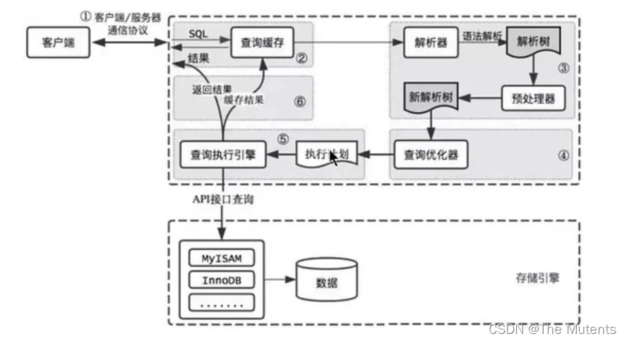

### 1.查询缓存
> MySQL拿到一个查询请求后，会先到查询缓存看看，之前是不是执行过这条语句。之前执行过的语句及其结果可能会以key-value对的形式，被直接缓存在内存中。`key 是查询的语句，value 是查询的结果`。mysql8.0之后抛弃了查询缓存这个功能

- 开启查询缓存（mysql8.0之前）
    ```bash
    #系统变量query_cache_type有三个值，
    #0代表关闭查询缓存（off）;
    #1代表开启（on）;
    #2代表按需使用（demand），当sql语句中有sql_cache关键词是才进行缓存
    [mysqld]
    query_cache_type=1
    ```

- 查询缓存命中率
    ```bash
    show status like '%Qcache%';
    ```

### 2.解析器

> 分析器先做“`词法分析`"。你输入的是由多个字符串和空格组成的一条 SQL 语句，MySQL 需要识别出里面的字符串分别是什么，代表什么。
> 接着，要做“`语法分析`"。根据词法分析的结果，语法分析器(比如: Bison) 会根据语法规则，判断你输入的这个 SQL 语句是否满足 MySQL 语法.
> SQL 语句正确则会生成一颗语法树

- 解析过程
  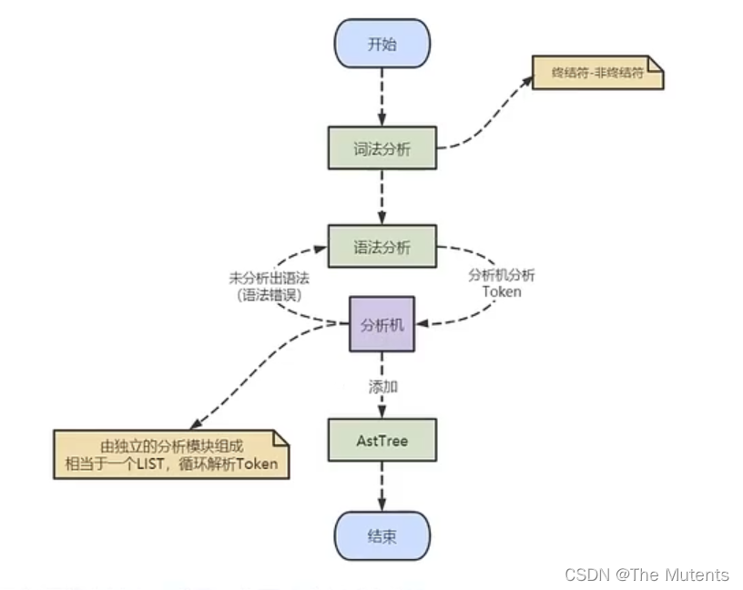

### 3.优化器
> 在优化器中会确定SQL语句的执行路径。比如是根据`全表检索`，还是根据`索引检索`等。 经过了解析器，MySQL 就知道你要做什么了。在开始执行之前，还要先经过优化器的处理。“*`一 条查询可以有很多种执行方式，最后都返回相同的结果。优化器的作用就是找到这其中最好的执行计划`。”
> 优化器优化完成后，会生成一个`执行计划`

### 4.执行器
> 在执行之前需要判断该用户是否具备权限。如果没有，就会返回权限错误。如果具备权限，就执行SQL查询井返回结果。在MySQL8.0之前的版本，如果设置了查询缓存，这时会将查询结果进行缓存。
> 如果有权限，就打开表继续执行。打开表的时候，执行器就会根据表的引擎定义，调用`存储引学API`对表进行读写。`存储引擎API只是抽象接口`，下面还有个存储引擎层。具体实现还是变看表选择的`存储引擎`。

## 六、SQL 执行原理
- 开启 profiling（分析）
    ```bash
    #查看profiling是否开启,默认等于0，关闭状态
    select @@session.profiling;
    # 或
    show variables like '%profiling%';
    
    #开启profiling
    set profiling=1;#系统关闭失效
    ```

- 查看最近执行的命令的执行时间
    ```bash
    show Profiles;
    ```
  
  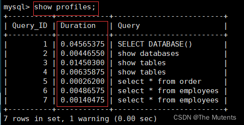

- 查看最近执行的某一条命令的执行过程及执行的时间
    ```bash
    show profile for query 7;
    
    #查看最后执行的一条命令的执行过程及执行的时间
    show profile;
    ```

  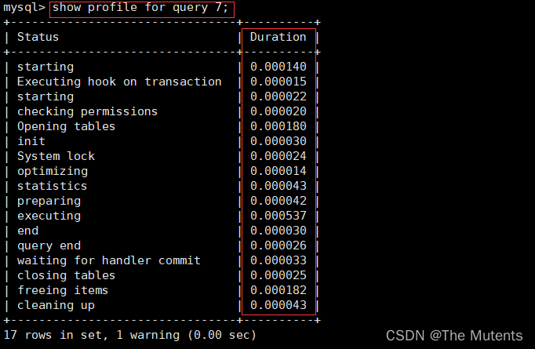
  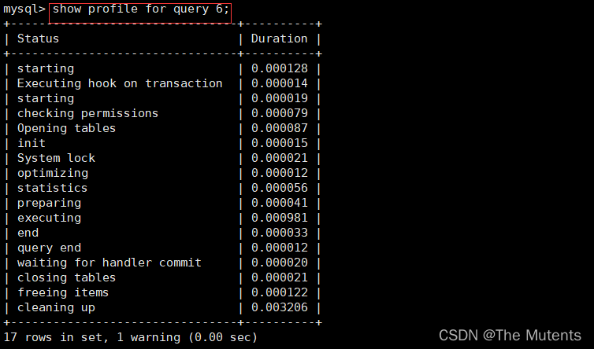
  
  > mysql8.0 后没有查询缓存的功能，所以执行一样的SQL语句不会进行缓存查询。

- 查看所有的开销信息
    ```bash
    show profile all for query 6;
    ```

  - 语法：`SHOW PROFILE [type [,type]...] [FOR QUERY n] [LIMIT row_count [OFFSET offset]]`
  - type：
    - `ALL`: 显示所有参数的开销
    - `BLOCK IO`：显示IO相关开销
    - `CONTEXT SWITCHES`：上下文切换相关开销
    - `CPU`：显示CPU相关开销信息
    - `IPC`：显示发送和接收相关开销信息
    - `MEMORY`：显示内存相关信息开销
    - `PAGE FAULTS`：显示页面错误相关开销信息
    - `SOURCE`：显示和Source_function,Source_file,Source_line相关的开销信息
    - `SWAPS`：显示交换次数相关的开销信息

  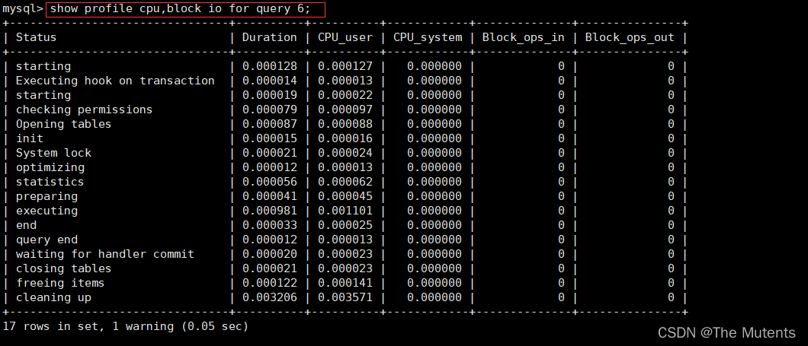

## 七、数据库缓存池（buffer pool）
> `InnoDB存储引擎`是以`页`为单位来管理存储空间的，我们进行的增删改查操作其实本质上都是在访问页面(包括读页面、写页面、创建新页面等操作)。而`磁盘I/0需要消耗的时间很多`，而在内存中进行操作,效率则会高很多，为了能让数据表或者索引中的数据随时被我们所用，`DBMS 会申请占用内存来作为数据缓冲池`，在真正访问页面之前，需要把在磁盘上的页缓存到内存中的Buffer Pool 之后才可以访问。
> 这样做的好处是可以让磁盘活动最小化，从而`减少与磁盘直接进行I/0 的时间`。要知道，这种策略对提升SQL语句的查询性能来说至关重要。如果索引的数据在缓冲池里,那么访问的成本就会降低很多。

> `缓冲池`可以帮助我们`消除CPU和磁盘之间的鸿沟`。所以InnoDB存储引擎在处理客户端的请求时，当需要访问某个页的数据时，就会把完整的页的数据全部加载到内存中,也就是说即使我们只需要访问一个页的一条记录，那也需要先把整个页的数据加载到内存中。`将整个页加载到内存中`后就可以进行读写访问了，在进行完读写访问之后并不着急把该页对应的内存空间释放掉，而是将其缓存起 来，这样将来有请求再次访问该页面时，就可以省去磁盘I0的开销了。

> 实际上，当我们对数据库中的记录进行修改的时候，`首先会修改缓冲池中页里面的记录信息`，然后数据库会`以一定的频率刷新到磁盘上`。注意并不是每次发生更新操作，都会立刻进行磁盘回写。缓冲池会采用一种叫做`checkpoint的机制`将数据回写到感盘上,这样做的好处就是提升了数据库的整体性能。

- 查看/设置缓冲池的大小
    > 如果使用的是`MySQL MyISAM存储引擎`，它只缓存索引，不缓存数据，对应的键缓存参数为`key_buffer_size`,可以用它进行查看。
    
    > 如果使用的是InnoDB存储引擎，可以通过查看`innodb_buffer_pool_size`变量来查看缓冲池的大小。

    ```bash
    #查看缓冲池的大小
    show variables like 'innodb_buffer_pool_size'; # 默认128M
    
    #设置缓冲池的大小
    set global innodb_buffer_pool_size = 大小;
    #或者在/etc/my.cnf中的[server]下进行设置：
    [server]
    innodb_buffer_pool_size = 大小 #修改后重启mysql服务 
    ```

- 设置多个 Buffer Pool 实例
    > Buffer Pool本质是InnoDB向操作系统申请的一块连续的内存空间，在`多线程环境下`，访问Buftr Pool中的数据都需要`加锁`处理。在Buffer Pool特别大而且多线程并发访问特别高的情况下，单一的Buffer Pool可能会影响请求的处理速度。所以在Bufter Pool特别大的时候，我们可以把它`拆分成若干个小的Buffer Pool`, 每个Buffer Pool都称为一个实例，它们都是独立的，独立的去申请内存空间，独立的管理各种链表。所以在多线程并发访问时并不会相互影响，从而提高并发处理能力。

    ```bash
    #在/etc/my.cnf中的[server]下进行设置innodb_buffer_pool_instances的值来修改Buffer Pool实例的数量：
    [server]
    innodb_buffer_pool_instances = 数量
    ```

    ```bash
    #查看Buffer Pool实例的个数
    show variables like 'innodb_buffer_pool_instances';
    ```

## 八、存储引擎

> MySQL 中提到了存储引擎的概念。简而言之，`存储引擎就是指表的类型`。 其实存储引擎以前叫做`表处理器`，后来改名为存储引擎,它的`功能就是接收上层传下来的指令,然后对表中的数据进行提取或写入操作`。

- 查看存储引擎

    ```bash
    show engines;
    #或
    show engines /G;
    ```
  
- 查看系统默认的存储引擎

    ```bash
    #mysql5.5之前默认存储引擎为MyISAM,5.5后改为InnoDB
    show variables like '%storage_engines';
    #或
    select @@default_storage_engines;
    ```

- 修改默认存储引擎

    ```sql
    set default_storage_engine = 存储引擎名; #l临时修改，服务重启后失效
    
    #修改my.cnf文件，修改后需要重启服务
    default_storage_engine = 存储引擎名
    ```

- 查看某个表的存储引擎
    ```sql
    show create table 表名;
    ```

- 修改某个表的存储引擎

    ```sql
    alter table 表名 engine = 存储引擎名;
    ```

### 1. InnoDB 存储引擎：具备外键支持功能的事务存储引擎

> 1. mysql5.5后默认innodb引擎
> 2. innodb是默认事务型引擎，支持`事务`
> 3. 除了增加和查询外，还需要更新、删除操作,那么，应优先选择InnoDB存储引擎。
> 4. InnoDB是为`处理巨大数据量的最大性能`设计.
> 5. InnoDB支持`行锁`，操作时只锁某一行,不对其它行有影响。适合高并发的操作
> 6. InnoDB`写的处理效率差一些`，井且会占用更多的磁盘空间以保存数据和索引。
> 7. InnoDB`不仅缓存索引还要缓存真实数据`，`对内存要求较高`，而且内存大小对性能有决定性的影响。

### 2.MyISAM 引擎：主要的非事务处理存储引擎

> 1. MyISAM提供了大量的特性，包括全文索引.压缩、空间函数(GIS)等， 但MyISAM `不支持事务、行级锁、外键`，有一个毫无疑问的缺陷就是`崩溃后无法安全恢复`。
> 2. mysql5.5之前默认MyISAM存储引擎
> 3. 优势是`访向的速度快`,对事务完整性没有要求或者`以SELECT，INSERT为主`的应用
> 4. `针对数据统计有额外的常数存储`。故而count(*)的查询效率很高

### 3.Archive 引擎：用于数据存档

> 1. archive是归档的意思，`仅仅支持插入和查询`两种功能(行被插入后`不能再修改`)
> 2. 在MySQL5.5以后支持`索引`功能。
> 3. 拥有很好的`压缩机制`，使用`zlib压缩库`。在记录请求的时候实时的进行压缩，经常`被用来作为仓库使用`。
> 4. 创建ARCHIVE表时，存储引擎会创建名称以表名开头的文件。数据文件的扩展名为`.ARZ`。
> 5. 根据英文的测试结论来看，同样数据量下，Archive表比MyISAM表要小大约75%，比支持事务处理的InnoDB表小大约83%。
> 6. ARCHIVE存储引擎采用了`行级锁`。支持`AUTO_INCREMENT`列属性。 `AUTO_INCREMENT`列可以具有唯一索引或非唯一索引。尝试在任何其他列上创建索引会导致错误。
> 7. Archive表`适合日志和数据采集(档案)`类应用:`适合存储大量的独立的作为历史记录的数据`。拥有`很高的插入速度`，但是对`查询的支持较差`。

### 4.Blackhole 引擎：丢弃写操作，读操作会返回空内容
> 1. Blackhole引擎`没有实现任何存储机制`，它会`丢弃所有插入的数据`，`不做任何保存`。
> 2. 但服务器会记录Blackhole表的日志，所以可以用于复制数据到备库，或者简单地记录到日志。但这种应用方式会碰到很多问题，因此并不推荐。

### 5.CSV 引擎：存储数据时，一逗号分割各个数据项

> 1. CSV引擎可以将`普通的CSV文件作为MySQL的表来处理`，但`不支持索引`。 
> 2. CSV引擎可以作为一种数据交换的机制，非常有用。
> 3. CSV存储的数据直接可以在操作系统里，用文本编辑器，或者excel读取。 
> 4. 对于数据的快速导入、导出是有明显优势的。

### 6.Memory 引擎：置于内存的表
>   Memory采用的逻辑介质是`内存`，`响应速度很快` ，但是当mysqld守护进程崩溃的时候数据会丢失。另外，`要求存储的数据是数据长度不变的格式`，比如，Blob和Text类型的数据不可用(长度不固定的)。
> 1. Memory同时支持`哈希(HASH) 索引`和`B+树索引`。
> 2. Memory表至少比MyISAM表要快一个数量级.
> 3. MEMORY `表的大小是受到限制`的。表的大小主要取决于两个参数, 分别是`max_rows` 和 ` max_heap_table_size ` , 其中`max_ rows`可以在创建表时指定; `max_heap_table_size`的大小默认为16MB,可以按需要进行扩大。
> 4. 数据文件与索引文件`分开存储`。
> 5. 其`数据易丢失，生命周期短`。基于这个缺陷，选择MEMORY存储引擎时需要特别小心。

- 使用场景

> 1. 目标`数据比较小`， 而且非常`频繁的进行访问`，在内存中存放数据，如果太大的数据会造成内存溢出。可以通过参数`max_heap_table_size`控制Memory表的大小,限制Memory表的最大的大小。
> 2. 如果`数据是临时的`，而且必须`立即可用得到`，那么就可以放在内存中。
> 3. 存储在Memory表中的数据如果突然间`丢失的话也没有太大的关系`.

### 7. Federated 引擎：访问远程表
> Federated引擎是访问其他MySQL服务器的一个代理,尽管该引擎看起来提供了一种很好的`跨服务器的灵活性`，但也经常带来问题，因此默认是禁用的。

### 8. Merge 引擎：管理多个 MyISAM 表构成的表集合

### 9. NDB 引擎 ：MySQL 集群专用存储引擎
> 也叫做NDB Cluster存储引擎，主要用于`MySQL Cluster 分布式集群环境`，类似于Oracle的RAC集群。


