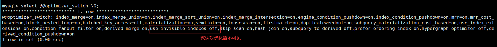
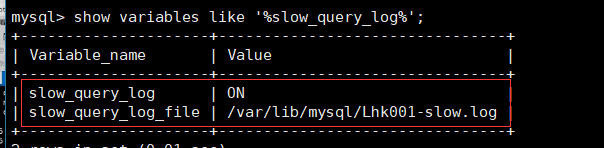
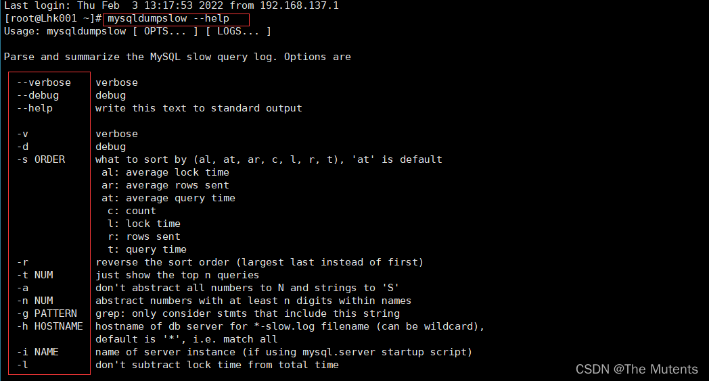

---
sidebar_position: 2
---

# MySQL 高级第二篇
## 一、索引的创建与设计原则
### 1. 索引的分类

- MySQL的索引包括`普通索引`、`唯一性索引`、`全文索引`、`单列索引`、`多列索引`和`空间索引`等。
> - 从`功能逻辑上`说，索引主要有4种，分别是`普通索引`、`唯一索引`、`主键索引`、`全文索引`
> - 按照`物理实现方式`，索引可以分为2种:`聚簇索引`和`非聚簇索引`。 
> - 按照`作用字段个数`进行划分，分成`单列索引`和`联合索引`。

- 普通索引
> - 在创建普通索引时，`不附加任何限制条件`，`只是用于提高查询效率`。这类索引可以创建在任何数据类型中,其值是否唯一和非空,要由字段本身的完整性约束条件决定。建立索引以后，可以通过索引进行查询。
> - 例如，在表 student的字段name上建立一个普通索引，查询记录时就可以根据该索引进行查询。

- 唯一性索引
> - 使用`UNIQUE参数`可以设置索引为唯一性索引， 在创建唯一性索引时，`限制该索引的值必须是唯一的`， `但允许有空值`。在`一张数据表里可以有多个唯一索引`。 
> - 例如。在表student的字段email中创建唯一性索引，那么字段email的值就`必须是唯一`的。`通过唯一性索引，可以更快速地确定某条记录`。

- 主键索引
> - 主键索引就是一种特殊的唯一性索引，在唯一索引的基础上`增加了不为空的约束,也就是NOT NULL+UNIQUE`，`一张表里最多只有一个主键索引`。 这是由主键索引的物理实现方式决定的，因为数据存储在文件中只能按照一种顺序进行存储。

- 单列索引
> - 在表中的`单个字段上创建索引`。单列索引只根据该字段进行索引。`单列索引可以是普通索引`，`也可以是唯一性索引`，`还可以是全文索引`。只要保证该索只对应一个字段即可，`一个表可以有多个单列索引`。

- 多列索引（组合索引、联合索引）
> - 多列索引是`在表的多个字段组合上创建一个索引`。该索引指向创建时对应的`多个字段`，可以通过这几个字段进行查询，但是`只有查询条件中使用了这些字段中的第一个字段时才会被使用`。
> - 例如，在表中的字段id，name和gender上建立一个多列索引 idx_ id_name_gender ，只有在查询条件中使用了字段id（`第一个字段`）时该索引才会被使用。
> - `使用组合索引时遵循最左前缀集合`。

- 全文索引
> - 全文索引(也称全文检索)是目前`搜索引擎使用的一种关键技术`。 它能够利用`[分词技术]`等多种算法智能分析出文本文字中关键词的频率和重要性，然后按照一定的算法规则智能地筛选出我们想要的搜索结果。 `全文索引非常适合大型数据集`，对于小的数据集，它的用处比较小。
> - 使用参数`FULLTEXT`可以设置索引为全文索引。在定义索引的列上支持值的全文查找，允许在这些索引列中插入重复值和空值。`全文索引只能创建在CHAR、VARCHAR 或TEXT类型及其系列类型的字段上`，查询数据量较大的字符串类型的字段时，使用全文索引可以提高查询速度。
> - 例如，表student的字段information是TEXT类型，该字段包含了很多文字信息。在字段information, 上建立全文索引后,可以提高查询字段information的速度。
> - 全文索引典型的有两种类型:`自然语言的全文索引`和`布尔全文索引`。
>   - `自然语言搜索引擎`将计算每一个文档对象和查询的相关度。这里，相关度是基于匹配的关键词的个数，以及关键词在文档中出现的次数。`在整个索引中出现次数越少的词语，匹配时的相关度就越高`。相反,非常常见的单词将不会被搜索，如果一个词语的在超过50%的记录中都出现了，那么自然语言的搜索将不会搜索这类词语。


- 空间索引
> - 使用`参数SPATIAL`可以设置索引为空间素引。`空间索引只能建立在空间数据类型上，这样可以提高系统获取空间数据的效率`。MySQL中的空间数据类型包括`GEOMETRY`、`POINT` 、`LINESTRING`和`POLYGON`等。
> - 目前只有`MyISAM存储引擎支持空间检索`，而且`索引的字段不能为空值`。对于初学者来说，这类索引很少会用到。


### 2. 索引的声明和使用

- MySQL 支持多种方法在单个或多个列上创建索引:
> 1. 在创建表的定义语句`CREATE TABLE` 中指定索引列，
> 2. 使用 `ALTER TABLE`语句在存在的表上创建索引，或者使用`CREATE INDEX` 语句在已存在的表上添加索引。

- 查看索引
    ```sql
    #方式一：
    show create table 表名;
    
    #方式二：
    show index from 表名;
    ```

- 性能分析工具`EXPLAIN`
    ```sql
    explain select * from 表名 where 索引字段 = ‘’;
    ```

- 创建索引方式一：`CREATE TABLE 中指定索引`
> 1. 隐式自动创建索引：
>    - 在声明有主键约束、唯一 性约束、外键约束的字段上，会`自动`的添加相关的索引
> 2. 显示创建索引语法：
>    - `UNIQUE`、 `FULLTEXT`和`SPATIAL`为可选参数，分别表示唯一索引全文索引和空间索引
>    - `INDEX`与`KEY`为同义词,两者的作用相同，用来指定创建索引
>    - `index_name`指定索引的名称，为可选参数，如果不指定，那么MySQL默认`col_name`为索引名`co1_name`为需要创建索引的字段列，该列必须从数据表中定义的多个列中选择;
>    - `length`为可选参数，表示索引的长度，只有字符串类型的字段才能指定索引长度;
>    - `ASC`或`DESC`指定升序或者降序的索引值存储。

  ```sql
    CREATE TABLE 表名 (
        [col_name data_type,] 
        [UNIQUE | FULLTEXT | SPATIAL | INDEX |KEY] [index_name] (col_name [length]) [ASC | DESC])
    
    #例：
    CREATE TABLE book(
        book_id INT,
        book_name VARCHAR(100),
        info VARCHAR(100),
        conmment VARCHAR(100),
        year_publication YEAR,
        #创建普通索引
        INDEX index_book_name(book_name),
        #创建唯一性索引
        UNIQUE index_conmment(conmment),
        #创建联合索引
        INDEX mul_index_book_id_name(book_id,book_name)
        
    );
  ```
> - `FULLTEXT`全文索引可以用于全文搜索，并且只为`CHAR`、`VARCHAR` 和`TEXT`类型的列创建索引。全文索引索引总是对整个列进行，不支持局部(前缀)索引.

  ```sql
    CREATE TABLE book1(
        book_id INT,
        book_name VARCHAR(100),
        info VARCHAR(100),
        conmment VARCHAR(100),
        year_publication YEAR,
        #创建全文索引
        FULLTEXT KEY index_full(book_name,info)
    )
   ```
> - 全文索引用 match+against 方式查询
>   - 注意点:
>     1. 使用全文索引前，搞清楚版本支持情况;
>     2. 全文索引比like+ %快N倍，但是可能存在精度问题: 
>     3. 如果需要全文索引的是大量数据，建议先添加数据，再创建索引

  ```sql
  select * from 表名 where match(全文索引字段1,字段2,...) against ('查询的字符串');
  ```

- 创建索引方式二：使用 `ALTER TABLE` 或 `CREATE INDEX` 在已创建的表中添加索引
    
    ```sql
    alter table 表名 add index [索引类型] 索引名(字段);
    
    create [索引类型] index 索引名 on 表名(字段名)
    ```

- 索引的删除
> 1. 添加`AUTO_INCREMENT`约束字段的`唯一索引`不能被删除。
> 2. 删除表中的列时，如果要删除的列为索引的组成部分，则该列也会从索引中删除。如果组成索引的所有列都被删除，则整个索引将被删除。

  ```sql
    #方式一：
    alter table 表名 drop index 索引名;
    
    #方式二：
    drop index 索引名 on 表名;
   ```

### 3. mysql8.0 索引新特性
- 降序索引
> MySQL在8.0版本之前创建的仍然是`升序索引`，使用时进行反向扫描，这大大降低了数据库的效率。在某些场景下，`降序索引`意义重大。
> 例如，如果一个查询， 需要对多个列进行排序，且顺序要求不一致，那么`使用降序索引将会避免数据库使用额外的文件排序操作`，从而提高性能。

  ```sql
    CREATE TABLE test_desc(
        a INT,
        b INT,
        INDEX index_a_b(a ASC, b DESC)
    );
  ```

- 隐藏索引
> - 在MySQL 5.7版本及之前，只能通过`显式的方式删除索引`.此时，如果发现删除索引后出现错误，又只能通过显式创建索引的方式将删除的索引|创建回来。如果数据表中的数据量非常大，或者数据表本身比较大，这种操作就会消耗系统过多的资源，操作成本非常高。
> - 从MySQL 8.x开始支持`隐藏索引`(invisible indexes) ， 只需要`将待删除的索引设置为隐藏索引`,使查询优化器不再使用这个索引(即使使用force index (强制使用索引)，优化器也不会使用该索引)， 确认将索引设置为隐藏索引后系统不受任何响应，就可以彻底删除索引。`这种通过先将索引设置为隐藏索引，再删除索引的方式就是软删除。`
同时，如果你想验证某个索引删除之后的`查询性能影响`，就可以暂时先隐藏该索引。
> - `主键不能被设置为隐藏索引`。当表中没有显式主键时，表中第一个唯一 非空索引会成为隐式主键，也不能设置为隐藏索引。
> - `索引默认是可见的`，在使用`CREATE TABLE，CREATE INDEX`或者`ALTER TABLE`等语句时可以通过`VISIBLE`或者`INVISIBLE`关键词设置索引的可见性。

  ```sql
    CREATE TABLE book2(
        book_id INT,
        book_name VARCHAR(100),
        info VARCHAR(100),
        conmment VARCHAR(100),
        year_publication YEAR,
        #创建不可见索引
        INDEX index_conmment(conmment) invisible
    );
    
    #给某个表添加隐藏索引
    alter table 表名 add index 索引名(字段) invisible;
    #或
    create index 索引名 on 索引名(字段) invisible;
    
    #修改索引的可见性
    alter index 表名 alter 索引名 [invisible | visible]; 
   ```
> 当索引被隐藏时，它的内容仍然是和正常索引一样实时更新的。`如果一个索引需要长期被隐藏，那么可以将其删除，因为索引的存在会影响插入、更新和删除的性能`。


- 使隐藏索引对查询优化器(`explain`)可见

    ```sql
    #查看隐藏索引是否对查询优化器可见
    select @@optimizer_switch \G;
    
    #设置语法
    set session optimizer_switch='use_
    invisible_indexes=on';
    ```
  
    

### 4. 索引的设计原则
#### 1. 适合创建索引的情况

- 字段的数值有唯一性的限制
> - 索引本身可以起到约束的作用。`比如唯一索引、主键索引都是可以起到唯一性约束的`，因此在我们的数据表中，如果`某个字段是唯一性`的，就可以直接创建`唯一性索引`，或者`主键索引`。这样可以更快速地通过该索引来确定某条记录。
> - 业务上具有唯一特性的字段，即使是`组合字段`，也必须建成唯一索引。(来源: Alibaba)
> - `说明`:不要以为唯一索引影响了insert速度，这个速度损耗可以忽略，但提高查找速度是明显的。

- 频繁作为 where 查询条件的字段
> - 某个字段在 SELECT 语句的`WHERE条件`中经常被使用到，那么就需要给这个字段创建索引了。尤其是在数据量大的情况下，`创建普通索引就可以大幅提升数据查询的效率`

  ```sql
    #不使用索引按student_id字段查询,执行时间：0.960秒
    SELECT `student_id`,`name`,`course_id`,`create_time` 
    FROM `student_info` 
    WHERE `student_id`=123110;
    
    #给student_id字段添加索引
    ALTER TABLE `student_info` ADD INDEX index_sid(`student_id`);
    
    SHOW INDEX FROM `student_info`;
    
    #使用索引按student_id字段查询,执行时间：0.041秒，0.039秒，0.043秒....
    SELECT `student_id`,`name`,`course_id`,`create_time` 
    FROM `student_info` 
    WHERE `student_id`=123110;
   ```

- 经常group by 和 order by的列
> 索引就是让数据按照某种顺序进行存储或检索，因此当我们使用`GROUP BY`对数据进行`分组查询`，或者使用`ORDER BY`对数据进行`排序`的时候，就需要对分组或者排序的字段进行索引。如果待排序的列有多个，那么可以在这些列上建立`组合索引`。


- update、delete 的 where 条件列
> - 对数据按照某个条件进行查询后再进行`UPDATE`或 `DELETE`的操作，如果对`WHERE字段创建了索引`，就能大幅提升效率。
> - 原理是因为我们需要先根据WHERE条件列检索出来这条记录，然后再对它进行更新或删除。`如果进行更新的时候，更新的字段是非索引字段，提升的效率会更明显，这是因为非索引字段更新不需要对索引进行维护`。

- distinct（去重）字段需要创建索引
> 因为索引会对数据按照某种顺序进行排序。所以在去重的时候也会快很多。


- 多表 join 连接操作时创建索引的注意事项
> - 首先，`连接表的数量尽量不要超过3张`，因为每增加一张表就相当于增加了一次嵌套的循环，数量级增长会非常快，严重影响查询的效率。
> - 其次，`对WHERE条件创建索引`，因为WHERE才是对数据条件的过滤。如果在数据量非常大的情况下，没有WHERE条件过滤是非常可怕的。
> - 最后，`对用于连接的字段创建索引`,并且该字段在多张表中的类型必须一致。比如course_id在student_info表和course表中都为int(11)类型，而不能一个为int另一个为varchar类型。


- 使用列的类型小的创建索引
> - 这里所说的`类型大小`指的就是该`类型表示的数据范围的大小`。
> - 我们在定义表结构的时候要显式的指定列的类型，以整数类型为例，有`TINYINT`、`MEDIUMINT`、`INT`、`BIGINT`等,它们占用的存储空间依次递增，能表示的整数范围当然也是依次递增，如果我们想要对某个整数列建立索引的话，`在表示的整数范围允许的情况下，尽量让索引列使用较小的类型`，比如我们能使用INT就不要使用BIGINT，能使用MEDIUMINT就不要使用INT。
> 这是因为: 
>   - `数据类型越小，在查询时进行的比较操作越快`
>   - `数据类型越小，索引占用的存储空间就越少，在一个数据页内就可以放下更多的记录，从而减少磁盘I/0带来的性能损耗，也就意味着可以把更多的数据页缓存在内存中，从而加快读写效率`。
> - 这个建议对于表的`主键来说更加适用`，因为不仅是聚簇索引中会存储主键值，其他所有的二级索引|的节点处都会存储一份记录的主键值，`如果主键使用更小的数据类型，也就意味着节省更多的存储空间和更高效的I/0`。

- 使用字符串前缀创建索引
> - 假设字符串很长，那存储一个字符串就需要占用很大的存储空间。 在我们需要为这个字符事列建立索引时，那就意味着在对应的B+树中有这么两个问题:
>   - `B+树索引中的记最需要把该列的完整字符串存储起来，更费时。而且字符串越长，在索引中占用的存储空间越大`。
>   - `如果B+树索引中索引列存储的字符串很长，那在做字符串比较时会占用更多的时间。`
> 
> - 我们可以通过`截取字段的前面一部分内容建立索引`，这个就叫`前缀索引`。这样在查找记录时虽然不能精确的定位到记录的位置，但是能定位到相应前缀所在的位置，然后根据前缀相同的记录的主键值回表查询完整的字符串值。既`节约空间`，又`减少了字符串的比较时间`，还大体能解决排序的问题。
>- 问题是，截取多少呢?截取得多了，达不到节省索引存储空间的目的;截取得少了，重复内容太多，字段的散列度(选择性)会降低。`怎么计算不同的长度的选择性呢`?
>  - 计算截取长度的公式（`区分度`）： `count(distinct left(列名，索引长度))/count(*)`
>  
> - 在Alibaba (Java开发手册》中[`强制的一条`]  
>   - 在varchar字段上建立索引时，`必须指定索引长度`，`没必要对全字段建立索引`，根据实际`文本区分度`决定索引长度。
>   - 说明:索引的长度与区分度是一对矛盾体，`一般对字符串类型数据，长度为20的索引，区分度会高达98%以上`，可以使用count(distinct left(列名,索引长度))/count(*)的`区分度`来确定截取的长度。

- 区分度高（散列性高）的散列适合作为索引
> - `列的基数`指的是`某一列中不重复数据的个数`,比方说某个列包含值2，5，8. 2, 5, 8, 2,5,8,虽然有9条记录，但该列的基数却是3。也就是说，在记录行数一定的情况下，`列的基数越大，该列中的值越分散;列的基数越小，该列中的值越集中`。这个列的基数指标非常重要，直接影响我们是否能有效的利用索引。最好`为列的基数大的列建立索引`，为基数太小列的建立索引效果可能不好。
>  - 可以使用公式`select count(distinct a)/count(*) from t1`计算区分度，`越接近1越好，一般超过33%就 算是比较高效的索引了`。 
>  - 拓展:`联合索引把区分度高(散列性高)的列放在前面`。

- 使用最频繁的列放到联合索引的左侧

- 在多个字段都要创建索引的情况下，联合索引优于单值索引

#### 2.限制索引的数量

> 在实际工作中，我们也需要注意平衡，索的数目不是越多越好。我们需要限制每张表上的索引数量,`建议单张表索引数量不超过6个。` 
> 原因:
> - 1. 每个索引都需要占用磁盘空间，索引越多，需要的磁盘空间就越大。
> - 2. 索引会影响INSERT、DELETE. UPDATE等语句的性能，因为表中的数据更改的同时，索引也会进行调整和更新，会造成负担。
> - 3. 优化器在选择如何优化查询时，会根据统一信息,对每一个可以用到的索引来进行评估，以生成出一个最好的执行计划，如果同时有很多个索引都可以用于查询，会增加MySQL优化器生成执行计划时间，降低查询性能。

#### 3.不适合创建索引的情况
- 在where中使用不到的字段，不要设置索引
> `WHERE条件(包括GROUP BY，ORDER BY)里用不到的字段不需要创建索引`，索引的价值是快速定位，如果起不到定位的字段通常是不需要创建索引的。

- 数据量小的表最好不要使用索引
> 如果表记录太少，比如少于1000个，那么是不需要创建索引的。表记录太少。是否创建索引对查询效率的影响并不大。甚至说，查询花费的时间可能比遍历索引|的时间还要短，索引可能不会产生优化效果。

- 有大量重复数据的列上不要建立索引
> 在条件表达式中经常用到的不同值较多的列上建立索引，但`字段中如果有大量重复数据，也不用创建索引`，比如在学生表的“性别“字段上只有“男”与“女”两个不同值，因此无须建立索引。如果建立索引，不但不会提高查询效率，反而会严重降低数据更新速度 。
> - 结论:当数据重复度大，比如高于18% 的时候，也不需要对这个字段使用索引。

- 避免对经常更新的表创建过多的索引
> - 第一层含义:`频繁更新的字段`不一定要创建索引。`因为更新数据的时候，也需要更新索引`,如果索引太多,在更新索引的时候也会造成负担，从而影响效率。
> - 第二层含义:避免对经常更新的表创建过多的索引，井且索引中的列尽可能少。此时，虽然提高了查询速度，同时却会降低更新表的速度。

- 不建议用无序的值作为索引
> 例如身份证、UUID(在索引比较时需要转为ASCII, 井且插入时可能造成`页分裂`)、MD5. HASH. 无序长字符串等。

- 删除不再使用或很少使用的索引
> 表中的数据被大量更新，或者数据的使用方式被改变后，原有的一-些索引可能不再需要。数据库管理员应当定期找出这些索引，将它们删除，从而减少索引|对更新操作的影响。

- 不要定义冗余或重复的索引


## 二、性能分析工具的使用
#### 1.查看系统性能参数
- `SHOW STATUS`查询一些MySQL数据库服务器的`性能参数`、`执行频率`。

  ```sql
   show [global | session] status like '参数';
  ```
> 一些常用的性能参数如下: 
> - `Connections`: 连接MySQL服务器的次数。
> - `Uptime`: MySQL服务器的上线时间。
> - `Slow_queries`: 慢查询的次数。
>  - `Innodb_rows_read`: Select查询返回的行数 
>  - `Innodb_rows_inserted`: 执行INSERT操作插入的行数 。
>  - `Innodb_rows_updated`:执行UPDATE操作更新的行数 
>  - `Innodb_rows_deleted`: 执行DELETE操作删除的行数 。
>  - `Com_select`: 查询操作的次数。
>  - `Com_insert`: 插入操作的次数。对于批量插入的INSERT操作，只累加一次。 
>  - `Com_update`:更新操作的次数。 
>  - `Com_delete`: 删除操作的次数。

#### 2.统计SQL的查询成本：last_query_cost

> - 一条SQL查询语句在执行前需要确定查询执行计划。如果存在多种执行计划的话，MySQL会计算每个执行计划所需要的成本，从中选择成本最小的一个作为最终执行的执行计划。
> - 如果我们想要查看某条SQL语句的查询成本。可以在执行完这条SQL语句之后，通过查看当前会话中的 `last_query_cost`变量值来得到当前查询的成本。它通常也是我们评价一个查询的执行效率的一个常用指标。这个`查询成本对应的是SQL语句所需要读取的页的数量`.

- 查看查询成本

  ```sql
    show status like 'last_query_cost';
  ```
> SQL查询是一个动态的过程，从页加载的角度来看，我们可以得到以下两点结论: 
> - 1.`位置决定效率`。如果页就在数据库缓冲池中，那么效率是最高的，否则还需要从内存或者磁盘中进行读取，当然针对单个页的读取来说，如果页存在于内存中，会比在磁盘中读取效率高很多。 
> - 2.`批量决定效率` 。如果我们从磁盘中对单一页进行随机读，那么效率是很低的(差不多10ms)，而采用`顺序读取的方式，批量对页进行读取`，平均一页的读取效率就会提升很多，甚至`要快于单个页面在内存中的随机读取`。
> 
> 所以说，遇到I/0并不用担心，方法找对了，效率还是很高的。我们首先要考虑数据存放的位置，如果是`经常使用的数据就要尽量放到缓冲池中`，其次我们可以充分利用磁盘的吞吐能力，`一次性批量读取数据`，这样单个页的读取效率也就得到了提升。

## 三、慢查询日志:定位慢SQL
> - MySQL的慢查询日志，用来记录在MySQL中`响应时间超过阈值`的SQL语句,具体指运行时间超过`long_query_time`值的SQL,则会被记录到慢查询日志中。long_query_time的默认值为10，意思是运行10秒以上(不含10秒)的语句，认为是超出了我们的最大忍耐时间值。 
>   - 它的主要作用是，帮助我们发现那些执行时间特别长的SQL查询，并且有针对性地进行优化，从而提高系统的整体效率当我们的数据库服务器发生阻塞、运行变慢的时候，检查一下慢查询日志, 找到那些慢查询,对解决问题很有帮助。比如一条sql执行超过5秒钟，我们就算慢SQL，希望能收集超过5秒的sql，结合`explain`进行全面析。
> - 默认情况下，MySQL数据库没有开启慢查询日志，需要我们手动来设置这个参数。`如果不是调优需要的话，一般不建议启动该参数，因为开启慢查询日志会或多或少带来一定的性能影响`。
> - 慢查询日志支持将日志记录写入文件。


- 开启慢查询日志
> `slow_query_log` 慢查询日志参数 `slow_query_log_file` 慢查询日志文件参数

  

  ```sql
  set global slow_query_log = on;
  ```

- 修改long_query_time的值

    ```sql
    #临时修改
    set long_query_time = 阈值;
    set global long_query_time = 阈值;
    ```
- 通过修改配置文件
> 修改my.cnf文件，[mysqld]下增加或修改参数 `long_query_time`、`slow_query_log`和
> `slow_query_log_file` 后，然后`重启MySQL`服务器。

  ```sql
    [mysqld]
    slow_query_log = ON
    slow_query_log_file = 存放日志文件的位置
    long_query_time = 阈值
    log_output = FILE #将日志存放到文件中
  ```

- 查看慢查询数目

  ```sql
  show status like 'slow_queries';
  ```
>控制慢查询日志的还有一个系统变量: `min_examined_row_limit`。 这个变量的意思是，`查询扫描过的最少记录数`。这个变量和查询执行时间，共同组成了判别一个查询是否是慢查询的条件，`如果查询扫描过的记录数大于等于这个变量的值，并且查询执行时间超过long_query_time的值，那么，这个查询就被记录到慢查询日志中;反之，则不被记录到慢查询日志中。`

- 慢查询日志分析工具
> 在生产环境中，如果要手工分析日志，查找、分析SQL，显然是个体力活，MySQL提供了日志分析工具 `mysqldumpslow`。
> - `注意：该工具不是在mysql环境下使用，而是在Linux环境下使用` 

  

   ```bash
   mysqldumpslow -s t -t 5 /var/lib/mysql/Lhk001-slow.log 
   ```

- 关闭慢查询日志

    ```sql
    #修改配置文件，修改后重启mysql服务
    [mysqld]
    slow_query_log=off  #或者直接注释或删除
    
    #使用set语句临时关闭
    set global slow_query_log=off;
    ```

- 删除慢查询日志文件

  1. 直接手动删除文件即可

    ```bash
     rm Lhk001-slow.log
    ```

  2. 重新生成慢查询日志文件

  ```bash
   mysqladmin -u root -p flush-logs slow
  ```
> 慢查询日志都是使用`mysqladmin flush-logs`命令来删除重建的。使用时一定要注意，一旦执行了这个命令，慢查询日志都只存在新的日志文件中，如果需要旧的查询日志，就必须事先备份。

- 查看SQL的执行成本：show profile

  ```sql
    #开启profiling
    set profiling = on;
  ```

  ```sql
    #查看SQL执行成本
    show profiles;
    
    #查看最后执行的SQL执行成本
    show profile;
    
    #查看指定query id 的SQL的执行成本
    show profile for query n;
  ```
> show profile的常用查询参数: 
> - `ALL`:显示所有的开销信息。
> - `BLOCK I0`:显示块I0开销。 
> - `CONTEXT SWITCHES`:上下文切换开销。
>  - `CPU`:显示CPU开销信息。 
>  - `IPC`:显示发送和接收开销信息。 
>  - `MEMORY`:显示内存开销信息。
> - `PAGE FAULTS`:显示页面错误开销信息。 
> - `SOURCE`:显示和Source_function, Source_file, Source_line相关的开销信息。
> - `SWAPS`:显示交换次数开销信息。 

  日常开发需注意的结论:
>- `converting HEAP to MyISAM`:查询结果太大,内存不够，数据往磁盘上搬了。 
>- `Creating tmp table`:创建临时表。先拷贝数据到临时表，用完后再删除临时表。 
>- `Copying to tmp table on disk`:把内存中时表复制到磁盘上,警惕! 
>- `locked` 
>
>如果在`show profile`诊断结果中出现了以上4条结果中的任何一条，则sql语句需要优化。 
>注意: 不过`SHOW PROFILE`命令将被弃用，我们可以从information_schema中的profling数据表进行查看。


## 四、分析查询语句：explain
> - 定位了查询慢的SQL之后，我们就可以使用`EXPLAIN`或`DESCRIBE`工具做针对性的分析查询语句。
> - MySQL为我们提供了`EXPLAIN`语句来帮助我们查看某个查询语句的具体执行计划，大家看懂`EXPLAIN`语句的各个输出项，可以有针对性的提升我们查询语句的性能。

  ```sql
    explain SQL语句;
    #或
    describe SQL语句;
  ```
EXPLAIN语句输出的各个列的作用如下:

  | 列名 | 描述 |
  |--|--|
  | id | 在一个`大的查询语句`中`每个SELECT关键字`都对应一个`唯一的id` |
  |select_type | SELECT关键字`对应的那个查询的类型` ，用于确定小查询在大查询中扮演的角色|
  | table  | 表名，查询的每一行记录对应着一个单表 |
  | partitions | 匹配的分区信息 |
  |type|针对单表的访问方法|
  | possible_keys | 可能用到的索引 |
  | key | 实际上使用的索引 |
  |key_len |实际使用到的索引长度，对于联合索引，值越大越好|
  | ref | 当使用索引列`等值查询`时，与索引列进行等值匹配的对象信息 |
  |rows  | 预估的需要读取的记录条数，`越小越好`|
  |filtered|某个表经过`搜索条件过滤后`剩余记录条数的`百分比`|
  | Extra  | 一些额外的信息一些额外的信息 |

- 关于 id
> - `id如果相同，可以认为是一组，从上往下顺序执行` 
> - `在所有组中, id值越大，优先级越高,越先执行` 
> - “关注点:
> `id号每个号码，表示一趟独立的查询, 一个sql的查询趟数越少越好`

- 关于type
> - 结果值从最好到最坏依次是: 
>   - `system` > `const`> `eq_ref` > `ref` > fulltext > ref_or_null > index_merge > unique_subquery > index_subquery > `range` > `index` > `ALL` 
>   - 其中比较重要的几个提取出来（框起来的几个）。
> - SQL 性能优化的目标：至少要达到range级别，要求是ref 级别，最好是const级别。(阿里巴巴开发手册要求)
> - EXPLAIN不考虑各种Cache 
> - EXPLAIN不能显示MySQL在执行查询时所作的优化工作
> - EXPLAIN不会告诉你关于触发器、存储过程的信息或用户自定义函数对查询的影响情况
> - 部分统计信息是估算的，并非精确值

- explain的四种输出格式
> - EXPLAIN可以输出四种格式:
>   - `传统格式（EXPLAIN ...）`
>   - `JSON格式(EXPLAIN FORMAT=JSON ...)`
>   - `TREE格式(EXPLAIN FORMAT=TREE ...)`
>   - `可视化输出(Workbench工具)`。

- show warnings
> 在我们使用EXPLAIN语句查看了某个查询的执行计划后，紧接着还可以使用`SHOW WARNINGS` 语句查看与这个查询的执行计划有关的一些扩展信息

## 五、分析优化器执行计划：trace
> - `OPTIMIZER_TRACE`是MySQL 5.6引入的一项`跟踪功能`，它可以跟踪优化器做出的各种决策(比如访问表的方法、各种开销计算、各种转换等)，并将跟踪结果记录到`INFORMATION_SCHEMA.0PTIMIZER_TRACE`表中。
> - 此功能默认关闭。开启trace, 并设置格式为JSON,同时设置trace最大能够使用的内存大小，避免解析过程中因为默认内存过小而不能够完整展示。

  ```sql
   set optimizer_trace = 'enabled=on',end_markers_in_json=on;
   
   set optimizer_trace_max_mem_size=100000;
   ```

  ```sql
   #查看表information_schema.optimizer_trace
   select * from information_schema.optimizer_trace\G
  ```


## 六、MySQL 监控分析视图 —— sys schema
> 关于MySQL的性能监控和问题诊断，我们一般都从`performance_schema`中去获取想要的数据，在MySQL5.7.7版本中新增`sys schema`,它将`performance_schema`和`information_schema`中的数据以更容易理解的方式总结归纳为"视 图"，`其目的就是为了降低查询performance_schema的复杂度，让DBA能够快速的定位问题`。

- Sys schema 视图摘要
> 1. 主机相关:以host summary开头,主要汇总了I0延迟的信息。
> 2. Innodb相关:以innodb开头, 汇总了innodb buffer信息和事务等待innodb锁的信息。
> 3. I/o相关:以io开头， 汇总了等待I/0、 I/0使用量情况。
> 4. 内存使用情况:以memory开头, 从主机线程、事件等角度展示内存的使用情况
> 5. 连接与会话信息: proesslist印session相关视图， 总结了会话相关信息。
> 6. 表相关:以 schema_table 开头的视图，展示了表的统计信息。
> 7. 索引信息:统计了索引的使用情况，包含冗余索引和未使用的索引情况。
> 8. 语句相关:以statement开头，包含执行全表扫描、使用临时表、排序等的语句信息。
> 9. 用户相关:以user开头的规图, 统计了用户使用的文件I/0。执行语句统计信息。
> 10. 等待事件相关信息:以wait开头， 展示等待事件的延迟情况。

- Sys schema 视图使用场景

    ```sql
    #索引相关
    #1.查询冗余索引
    select * from sys.schema_redundant_indexes;
    
    #2.查询未使用过的索引
    select * from sys.schema_unused_indexes;
    
    #3.查询索引的使用情况
    select index_name,rows_selected,row_inserted,rows_updated,rows_deleted from sys.schema_index_statistics where table_schema='dbname' ;
    ```

    ```sql
    #表相关
    #1.查询表的访问量
    select table_schema,table_name,sum(io_read_requests+io_requests) as io from sys.schema_table_statistics group by table_schema,table_name order by io desc;
    
    #2.查询占用bufferpool较多的表
    select object_schema,object_name,allocated,data from sys.innodb_buffer_stats_by_table order by allocated limit 10;
    
    #3.查询表的全表扫描情况
    select * from ysy.statements_with_full_table_scans where db='dbname';
    ```

    ```sql
    #语句相关
    #1.监控SQL执行效率
    select db,exec_count,query from sys.statement_analysis order by exec_count desc;
    
    #2.监控使用了排序的SQL
    select db,exec_count,first_seen,last_seen,query from sys.statement_with_sorting limit 1;
    
    #3.监控使用了临时表或者磁盘临时表的SQL
    select db,exec_count,tmp_tables,tmp_disk_tables,query from sys.statement_analysis where tmp_tables>0 ro tmp_disk_tables >0 order by (tmp_tables+tmp_disk_tables ) desc;
    ```

    ```sql
    #io相关
    select file,avg_read,avg_write,avg_read+avg_write as avg_io from sys.io_global_by_bytes order by avg_read limit 10;
    ```

    ```sql
    #innodb相关
    #1.行锁阻塞情况
    select * from sys.innodb_lock_waits;
    ```


- 风险提示: 
> 通过 sys 库去查询时，MySQL 会`消耗大最资源`去收集相关信息，严重的可能会导致业务请求被阻塞，从而引起故障。
> 建议生产上`不要频繁`的去查询 sys 或者 performance_schema、information_schema 来完成监控、巡检等工作。

