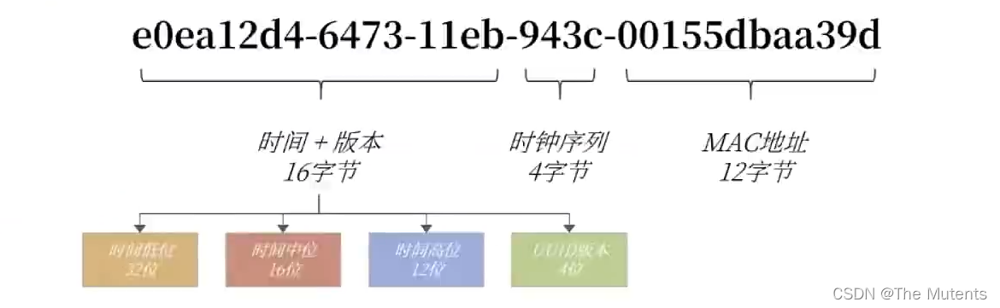
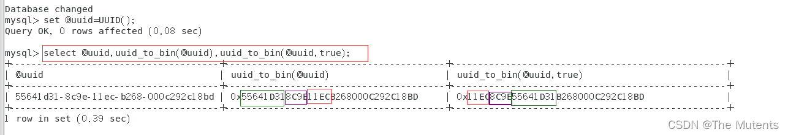

---
sidebar_position: 3
---

# MySQL 高级第三篇
## 索引优化与查询优化
进行数据库调优的维度：
- 索引失效。没有充分利用到索引 —— 索引建立
- 关联查询太多JOIN (设计缺陷或不得已的需求) —— SQL优化
- 服务器调优及各个参数设置(缓冲、线程数等)  —— 调整my.cnγ
- 数据过多 —— 分库分表

> 虽然SQL查询优化的技术有很多，但是大方向上完全可以分成`物理查询优化`和`逻辑查询优化`两大块。
> - 物理查询优化是`通过索引和表连接方式等技术来进行优化`，这里`重点需要掌握索引|的使用`。
> - 逻辑查询优化就是`通过SQL等价变换提升查询效率`，直白一点就是说，换一种查询写法执行效率可能更高。
> 
>其实，用不用索引，最终都是优化器说了算。优化器是基于基于`cost开销(CostBaseOptimizer)`的优化器。它不是基于`规则(Rule-Basedeptimizer)`，也不是基于语义。怎么样开销小就怎么来，另外, `SQL语句是否使用索引，跟数据库版本、数据量、数据选择度都有关系`。

### 1.索引优化一般性建议

> - 对于单列索引，尽量选择针对当前query过滤性更好的索引
> - 在选择组合索引的时候，当前query中过滤性最好的字段在索引字段顺序中，位置越靠前越好。
> - 在选择组合索引的时候，尽量选择能够包含当前query中的where子句中更多字段的索引。
> - 在选择组合索弓|的时候，如果某个字段可能出现范围查询时，尽量把这个字段放在索引|次序的最后面。
> 
> `总之，书写SQL语句时，尽量避免造成索引失效的情况。`


### 2. 连接查询的优化——join语句原理
- 内连接
> - 对于内连接来说，查询优化器可以决定谁作为驱动表，谁作为被驱动表出现的。
> - 对于内连接来说，如果表的连接条件中只有一个字段有索引，`则有索引的字段所在的表会被作为被驱动表出现`。
> - 对于内连接来说，在两个表的连接条件都存在索引的情况下，会选择小表作为驱动表。`“小表驱动大表”`


- join原理
> join方式连接多个表，`本质就是各个表之间数据的循环匹配`。MySQL5.5 版本之前，MySQL只支持一种表间关联方式，就是`成套循环(Nested Loop Join)`。如果关联表的数据量很大，则join关联的执行时间会非常长。在MySQL5.5以后的版本中，MySQL通过引入`BNLJ算法(块嵌套循环)`来`优化嵌套执行`。


- 成套循环(Nested Loop Join)的相关算法
> - SNLJ(Simple Nested Loop Join) 算法——简单的成套循环算法
> - INLJ(Index Nested Loop Join)算法——`基于索引`的成套循环算法
> - BNLJ(Block Nested Loop Join)算法——`基于块`的成套循环算法
> 
> 后面两种算法都是对第一个算法进行优化的优化算法`
> 
> 1. `效率比较：INLJ>BNLJ>SNLJ`
> 2. 永远用`小结果集`驱动`大结果集`(其本质就是减少外层循环的数据数量) (`小的度量单位指的是表行数*每行大小`)
> 3. 为被驱动表匹配的条件增加索引减少内层表的循环匹配次数
> 4. 增大join_buffer_size的大小(一次缓存的数据越多，那么内层表的扫表次数就越少)
> 5. 减少驱动表不必要的字段查询(字段越少，join buffer所缓存的数据就越多)

  ```sql
    #查看‘block_nested_loop’的状态，默认是开启的
    SHOW VARIABLES LIKE '%optimizer_switch%';
    
    #查看join_buffer的大小,默认256k
    SHOW VARIABLES LIKE '%join_buffer%';
  ```

- mysql8新特性——hash join
> 从MySQL的8.0.20版本开始将废弃BNLJ,因为从MySQL8.0.18版本开始就加入 了hash join默认都会使用hash join
> - Nested Loop:
> 对于`被连接的数据子集较小的情况`,Nested Loop是个较好的选择。
>- `Hash Join是做大数据集连接时的常用方式`，优化器使用两个表中较小(相对较小)的表利用Join Key在内存中建立散列表，然后扫描较大的表并探测散列表，找出与Hash表匹配的行。
>   - 这种方式适用于较小的表完全可以放于内存中的情况，这样总成本就是访问两个表的成本之和。
>   - 在表很大的情况下并不能完全放入内存，这时优化器会将它分割成若干不同的分区，不能放入内存的部分就把该分区写入磁盘的临时段，此时要求有较大的临时段从而尽量提高I/0的性能。
>   - 它能够很好的工作于没有索引的大表和并行查询的环境中，并提供最好的性能。大多数人都说它是Join的重型升降机。`Hash Join只能应用于等值连按(如WHERE A.COL1 = B.COL2),这是由Hash的特点决定的。`

### 3.子查询优化
> 子查询是MySQL的一项重要的功能，可以帮助我们通过一个SQL语句实现比较复杂的查询。但是，子查询的执 行效率不高。原因:
> 1. 执行子查询时，MySQL需要`为内层查询语句的查询结果建立个临时表` ，然后外层查询语句从临时表中查询记录。查询完毕后，再撤销这些临时表。这样会消耗过多的CPU和I0资源，产生大量的慢查询。
> 2. 子查询的结果集存储的临时表，不论是内存临时表还是磁盘临时表都不会存在索引，所以查询性能会受到一定的影响。
> 3. 对于返回结果集比较大的子查询，其对查询性能的影响也就越大

在MySQL中，`可以使用连接(JOIN) 查询来替代子查询`。连接查询不需要建立临时表，其速度比子查询要快，如果查询中使用索引的话，性能就会更好。

### 4.排序优化
问题：在WHERE条件字段上加索引，但是为什么在ORDER BY字段上还要加索引呢?

> 在MySQL中，支持两种排序方式，分别是FileSort 和Index排序。
> - `Index 排序`中，索引可以保证数据的有序性,不需要再进行排序，效率更高。 
> - `FileSort 排序`则一般在内存中进行排序，占用CPU较多。如果待排结果较大，会产生临时文件I/0到磁盘进行排序的情况，效率较低。

> 1. SQL 中，可以在WHERE子句和ORDER BY子句中使用索引，`目的是在WHERE子句中避免全表扫描`，`在ORDER BY子句避化使用FileSort排序`。当然，某些情况下全表扫描，或者FileSort排序不一定比索引慢。但总的来说，我们还是要避免，以提高直询效率,
> 2. `尽量使用Index完成ORDER BY排序`。如果WHERE和ORDER BY后面是相同的列就使用单索引列;如果不同就使用联合索引。
> 3.无法使用Index时，需要对FileSort方式进行调优。

- filesort算法——双路排序和单路排序
> 排序的字段若如果不在索引列上，则filesort会有两种算法: `双路排序`和`单路排序`
> 1. `双路排序(慢)`
> - MySQL 4.1之前足使用双路排序，字面意思就是`两次扫描磁盘`，最终得到数据， 读取行指针和order by列,对他们进行排序，然后扫描已经排序好的列表，按照列表中的值重新从磁盘中读取对应的数据输出
> - 从磁盘取排序字段，在buffer进行排序, 再从磁盘取其他字段。
> 
> 取一批数据，要对磁盘进行两次扫描，众所周知, I0是很耗时的，所以在mysql4.1之后， 出现了第二种改进的算法，就是单路排序。
>  
>  2. `单路排序（快）`
>  从磁盘读取查询需要的所有列，按照order by列在bbffr对它们进行排序，然后扫描排序后的列表进行输出，它的效率更快一些，避免了第二次读取数据。并且把随机I0变成了顺序I0，但是它会使用更多的空间，因为它把每一行都保存在内存中了。

  > 但是用单路也有问题。
> - 在sort_buffer中， `单路比多路要多占用很多空间`，因为单路是把所有字段都取出，所以有可能取出的数据的总大小超出了sort_buffer 的容量，导致每次只能取sort_ buffer容量大小的数据，进行排序(创建tmp文件.多路合并) , 排完再取sot_bufr容量大小，再排.... 从而多次I/0。单路本来想省一次I/0操作， 却导致了大量的I/0操作，得不偿失。
> 
对于该问题，
> 1.  我们可以提高`sort_buffer_size`参数进行优化，增加这个参数都会提高这两个算法的效率

  ```sql
  show variables like 'sort_buffer_size';
  ```
> 2. 提高参数'`max_length_for_sort_data`' 提高这个参数，会增加用改进算法的概率，但是如果设的太高，数据总容量超出`sort_buffer_size`的概率就增大，明显症状是高的磁盘I/0活动和低的处理器使用率。如果需要返回的列的总长度大于`max_length_for_sort_data`,使用双路算法，否则使用单路算法。 1024-8192字节之间调整

  ```sql
  show variables like 'max_length_for_sort_data';
  ```
> 3. Order by时select *是一个大忌。
>  最好只Query需要的字段。原因:
>    - 当Query的字段大小总和`小于max_length_for_sort_data`，而且排序字段不是TEXT|BLOB类型时，会用改进后的算法——单路排序， 否则用老算法——多路排序。
>  - 两种算法的数据都有可能超出`sort_buffer_size`的容量，超出之后，会创建tmp文件进行合并排序，导致多次 I/0，但是用单路排序算法的风险会更大一些，所以要`提高sort_buffer_size`。


### 5. group by优化
> - group by使用索引的原则几乎跟order by一致 ，group by即使没有过滤条件用到索引，也可以直接使用索引。 
> - group by先排序再分组，遵照索引建的最佳左前缀法则 
> - 当无法使用索引列，增大`max_length_for_sort_data`和`sort_buffer_size`参数的设置 
> - where效率高于having, 能写在where限定的条件就不要写在having中了 
> - 减少使用order by，和业务沟通能不排序就不排序，或将排序放到程序端去做。order by、group by、distinct 这些语句较为耗费CPU，数据库的CPU资源是极其宝贵的
> - 包含了order by、group by、distinct这些查询的语句， where条件过滤出来的结果案请保持在1000行以内，否则SQL会很慢。

### 6.分页查询（limit）优化
> 优化思路一 
> 在索引上完成排序分页操作，最后根据主键关联回原表查询所需要的其他列内容，这种优化方式更适用于主键不是自增的情况。
> 优化思路二
> 该方案适用于主键自增的表，可以把Limit 查询转换成某个位置的查询。

### 7.覆盖索引
> `覆盖索引`：
> 索引是高效找到行的一个方法，但是一般数据库也能使用索引找到一个列的数据，因此它不必读取整个行。毕竟索引叶子节点存储了它们索引的数据;当能通过读取索引就可以得到想要的效据，那就不需要读取行了（`不需要进行回表操作`）。`一个索引包含了满足查询结果的数据就叫做覆盖索引`。

- 覆盖索引的利弊
> 优点：
> 1. 避免Innodb表进行索引的二次查询(回表)
Innodb是以聚集索引的顺序来存储的，对于Innodb来说， 二级索引在叶子节点中所保存的是行的主键信息，如果是用二级索引查询数据，在查找到相应的键值后，还需通过主键进行二次查询才能获取我们真实所需要的数据。
在覆盖索引中，二级索引的键值中可以获取所要的数据，避免了对主键的二次查询 ，减少了I0操作，提升了查询效率。
> 2. 可以把随机I0变成顺序I0加快查询效率
由于覆盖索引是按键值的顺序存储的，对于I0密集型的范围查找来说，对比随机从磁盘读取每一行的数据I0要少的多，因此利用覆盖索引在访问时也可以把磁盘的随机读取的I0转变成索引查找的顺序I0。
由于覆盖索引可以减少树的搜索次数，显著提升查询性能，所以使用覆盖索引是一个常用的性能优化手段。
>
> 弊端:
> - 索引字段的维护总是有代价的。因此，在建立冗余索引来支持覆盖索弓时就需要权衡考虑了。这是业务DBA，或者称为业务数据架构师的工作。


### 8.索引条件下推（ICP）
> 索引条件下推：
> 在查询的时候使用到了联合索引的某一个字段，若查询条件中还有其他字段也属于该联合索引，且该字段也并未使用到索引，则mysql优化器会对该索引进行索引下推，对该字段进行筛选后再进行回表操作。
> `这样的好处是可以减少回表操作，减少随机IO的次数。`

- 开启和关闭索引条件下推

  ```sql
  #开启索引条件下推（默认开启ICP）
  SET optimize_switch = 'index_condition_pushdown=on';
  #关闭索引条件下推
  SET optimize_switch = 'index_condition_pushdown=off';
  ```
> - 当使用索引条件下推时，EXPLAIN语句输出结果中Extra列内容显示为`Using index condition`

- 使用ICP的条件
> 1. 如果表访问的类型为range、ref、eq_ref和ref_ or_null可以使用ICP
> 2. ICP可以用于InnoDB和MyISAM表， 包括分区表InnoDB和MyISAM表
> 3. 对于InnoDB表，ICP仅用于二级索引 。ICP 的目标是减少全行读取次数，从而减少I/0操作。
> 4. 当SQL使用覆盖索引时，不支持ICP。因为这种情况下使用ICP不会减少I/0. .
> 5. 相关子查询的条件不能使用ICP


### 9.其他查询优化策略
- 9.1 EXISTS 和 IN 的区分，何时使用EXISTS，何时使用IN？
> 对于何时使用EXISTS和IN，索引是个前提，其实选择与否还是要看表的大小。你可以将选择的标准理解为`小表驱动大表`。在这种方式下效率是最高的。

  例：

  ```sql
  select * from A where cc in (select cc from B);
  ```
当B表比A表小时，使用IN，因为其实现逻辑类似于

  ```sql
  for i in B
  	for j in A
  		if j.cc==i.cc 
  			.......
  ```
而当B表比A表大时，则使用EXISTS

  ```sql
  select * from A where exists (select cc from B where B.cc=A.cc);
  ```
实现逻辑如下：

  ```sql
  for i in A
  	for j in B
  		if j.cc==i.cc 
  			.......
  ```
> `根据其实现逻辑，按小表驱动大表的规则进行选择即可`。


- 9.2 COUNT( * )与COUNT(具体字段)效率
> 在MySQL中统计数据表的行数，可以使用三种方式: `SELECT COUNT(*)`、`SELECT COUNT(1)`和`SELECT COUNT(具体字段)`，使用这三者之间的查询效率是怎样的?

  > 对于该问题有一个前提:需要保证这三个语句执行的结果都为统计表的所有行数，如果你要统计的是某个字段的非空数据行数，则另当别论，毕竟比较执行效率的前提是结果一样才可以。
>1.  COUNT( * )和COUNT(1)都是`对所有结果进行COUNT`，`COUNT(*)`和`COUNT(1)`本质上并没有区别(二者执行时间可能略有差别，不过你还是可以把它俩的执行效率看成是相等的)。如果有WHERE子句，则是对所有符合筛选条件的数据行进行统计;如果没有WHERE子句，则是对数据表的数据行数进行统计。
> 2. 如果用的是`MyISAM`存储引擎，统计数据表的行数只需要`0(1)的复杂度`，这是因为每张MyISAM的数据表都有一个meta信息存储了`row_count`值，而一致性则由`表级锁`来保证。
> 如果是`InnoDB`存储引擎，因为InnoDB支持事务，采用`行级锁`和`MVCC机制`，所以无法像MylSAM一样，维护一个row_count变量，因此需要采用扫描全表，是`0(n)的复杂度`，进行循环＋计数的方式来完成统计。
> 3. 在`InnoDB`引擎中，如果采用`COUNT(具体字段)`来统计数据行数，要`尽量采用二级索引`。 因为主键采用的索引是聚簇索引，聚簇索引包含的信息多，明显会大于二级索引(非聚簇索引)。
> 对于`COUNT(*)`和`COUNT(1)`来说，它们不需要查找具体的行，只是统计行数，`系统会自动采用占用空间更小的二级索引来进行统计。如果有多个二级索引，会使用key_len小的二级索引进行扫描。当没有二级索引的时候，才会采用主键索引来进行统计。`


- 9.3 关于 SELECT ( * )
> 在表查询中，建议明确字段，不要使用*作为查询的字段列表，`推荐使用SELECT<字段列表>查询`。
> 原因:
> 1. MysQL在解析的过程中，会通过查询数据字典将"`*`"按序转换成所有列名，这会大大的耗费资源和时间。
> 2. `无法使用覆盖索引`

- 9.4 `LIMIT 1`对优化的影响
> `LIMIT 1`针对的是会扫描全表的SQL语句，如果你可以确定结果集只有一条，那么加上`LIMIT 1`的时候，当找到一条结果的时候就不会继续扫描了,这样会加快查询速度。
> 但是如果数据表已经对字段建立了唯一索引，那么可以直接通过唯一索引进行查询到某一条结果集，因为使用索引就不会全表扫描了，所以就不需要加上LIMIT 1了。

- 9.5 多使用 COMMIT
> `只要有可能，在程序中尽量多使用COMMIT，这样程序的性能得到提高，需求也会因为COMMIT所释放的资源而减少`。
> COMMIT 所释放的资源: 
> - 回滚段上用于恢复数据的信息 
> - 被程序语句获得的锁 
> - redo/ undo log buffer中的空间
> - 管理上述3种资源中的内部花费

### 10.推荐的主键设计
> `非核心业务`:对应表的`主键自增ID`,如告警、日志、监控等信息。
>  `核心业务`:`主键设计至少应该是全局唯一且是单调递增`。全局唯一保证在各系统之间都是唯一的， 单调递增是希望插入时不影响数据库性能。 
>  这里推荐最简单的一种主键设计: `改造后的UUID`

- 原始的 UUID：
> 特点: 全局唯一,占用36字节，数据无序，插入性能差。

  

- 改造UUID
> `若将时间高低位互换，则时间就是单调递增的了`,UUID也就变得单调递增了。MySQL 8.0可以更换时间低位和时间高位的存储方式，这样UUID就是有序的UUID了。
> MySQL8.0还解决了UUID存在的空间占用的问题，除去了UUID字符串中无意义的"-"字符串，`并且将UUID字符串用二进制类型保存，这样存储空间降低为了16字节`。 
> 可以通MySQL8.0提供的`uuid_to_bin`函数实现上述功能，同样的，MySQL也提供了`bin_to_uuid`函数进行转化: .

  ```sql
  SET @uuid = UUID();
  
  #uuid_to_bin(@uuid)将原始UUID转换成二进制存储的UUID
  #uuid_to_bin(@uuid,TRUE)将高位时间和低位时间位置进行交换
  SELECT @uuid,uuid_to_bin(@uuid),uuid_to_bin(@uuid,TRUE);
  ```

  
> 通过函数`uuid_to_bin(@uuid,true)`将UUID转化为有序UUID了。`全局唯一 + 单调递增`，这不就是我们想要的主键!
在当今的互联网环境中，`非常不推荐自增ID作为主键的数据库设计`。`更推荐类似有序UUID的全局唯一的实现`。
另外在真实的业务系统中，主键还可以加入业务和系统属性，如用户的尾号，机房的信息等。这样的主键设计就更为考验架构师的水平了。
