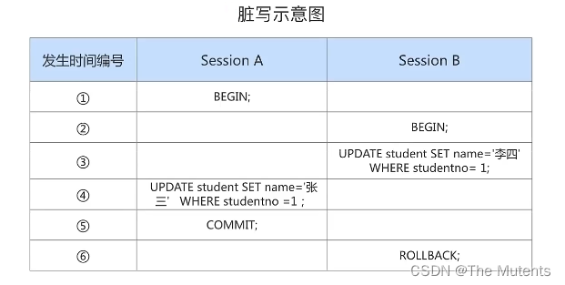
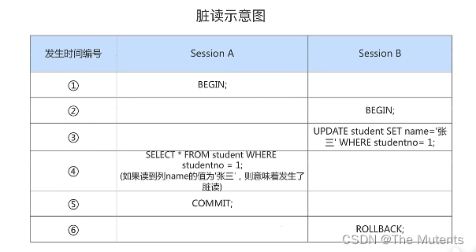
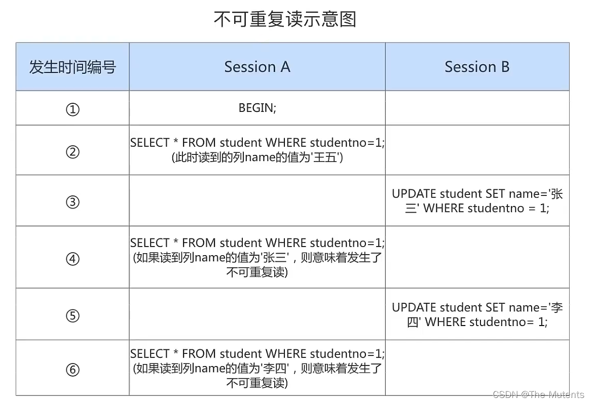
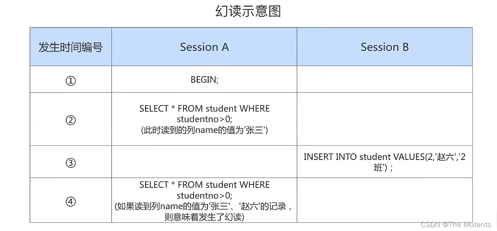
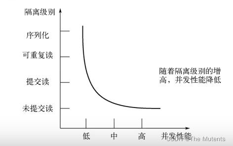
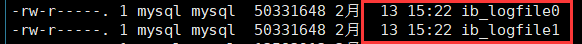
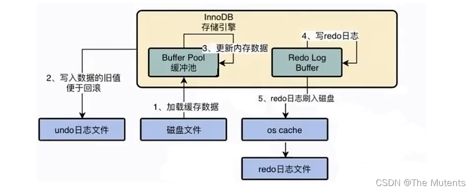

---
sidebar_position: 5
---

# MySQL 高级第五篇
## 一、事务机制
### 1.数据库事务
> 事务: `一组逻辑操作单元`，使数据从一种状态变换到另一种状态。

> 事务`处理的原则`:
> 保证所有事务都作为一个工作单元来执行，即使出现了故障，都不能改变这种执行方式。当在一个事务中执行多个操作时，要么所有的事务都`被提交(commit)`,那么这些修改就永久地保存下来;要么数据库管理系统将放弃所作的所有修改，整个事务`回滚(rollback)`到最初状态。

- 事务的ACID特性
> - `原子性`(atomicity) : 原子性是指事务是一一个不可分割的工作单位，要么全部提交，要么全部失败回滚。
> - `一致性`(consistency):根据定义，一致性是指事务执行前后，数据从一个合法性状态变换到另外一个合法性状态。这种状态是语义上的而不是语法上的，跟具体的业务有关。
> - `隔离型`(isolation) :事务的隔离性是指一个事务的执行不能被其他事务干扰，即一个事务内部的操作及使用的数据对开发的其他事务是隔离的，并发执行的各个事务之间不能互相干扰。
> - `持久性`(durability) :持久性是指一个事务一旦被提交，它对数据库中数据的改变就是永久性的，接下来的其他操作和数据库故障不应该对其有任何影响。

  > ACID是事务的四大特性，在这四个特性中，原子性是基础，隔离性是手段，一致性是约束条件，而持久性是我们的目的。

  > 数据库事务，其实就是数据库设计者为了方便起见，把需要保证原了性、购离性、一致性和持久性的一个或多个数据库操作称为一个事务。


- 事务的状态
> - `活动的`(active)：事务对应的数据库操作正在执行过程中时，我们就说该事务处在活动的状态。 
> - `部分提交的`(partially committed) ：当事务中的最后一个操作执行完成，但由于操作都在内存中执行，所造成的影响并没有利新到感盘时，我们就说该事务处在部分提交的状态。 
> - `失败的`(failed)：当事务处在活动的或者部分提交的状态时，可能遇到了某些错误(数据库自身的错误、操作系统错误或者直接断电等)而无法继续执行，或者人为的停止当前事务的执行，我们就说该事务处在失败的状态。 
> - `中止的`(aborted)：如果事务执行了一部分而变为失败的状态，那么就需要把已经修改的事务中的操作还原到事务执行前的状态。换句话说，就是要撤销失败事务对当前数据库造成的影响。我们把这个撤销的过程称之为回滚。当回滚的操作执行完毕时，也就是数据库恢复到了执行事务之前的状态，我们就说该事务处在了中止的状态。
> - `提交的`(comitted)：当一个处在部分提交的状态的事务将修改过的数据都同步到磁盘上之后，我们就可以说该事务处在了提交的状态。

### 2.事务的隔离级别
- 数据的并发问题
> 1. `脏写(Dirty Write)` ：对于两个事务Session A、Session B,如果事务Session A修改了另一个未提交事务Session B修改过的数据，那就意味着发生了脏写,示意图如下:

  
> 
> 2. `脏读(Dirty Read)` ：对于两个事务Session A、Session B，`Session A读取了已经被SessionB更新但还没有被提文的字段。`之后若Session B回滚，Session A读收的内容就是临时且无效的。

 
>
> 3. `不可重复读( Non-Repeatable Read )`：对于两个事务Session A、Session B, Session A 读取了一个字段，然后Session B更新了该字段。之后Session A再次读取同一个字段，值就不同了。那就意味着发生了不可重复读，因为我们在Session A需要读取同一个值，而不应读取Session B更新后的值。
> 例：
>    - 事务一中先读取 a=100，b=50，求和=150，事务一还未提交；
>    - 然后事务二修改a=50，并且提交事务二；
>    - 这是事务一在次读取a=50（此时a=50，而不是刚进事务一时的a=100了），c=50，求和=100。这里就发生了a不可重复读，因为事务一要完成的是a+c=150，而不是100，要读取的a不是修改后的a。

  
>
> 4. `幻读(Phantom)`：对于两个事务Session A. Session B, Session A从一个表中读取了一个字段，然后Session B在该表中`插入了一些新的行`。之后， 如果Session A再次读取同一个表就会多出几行。那就意味若发生了幻读。

  
> - 注意1: 
> 如果Session B中删除了一些符合studentno > 0 的记录而不是插入新记录，那Session A之后再根据studentno>0 的条件读取的记录变少了，这种现象算不算幻读呢?
> 这种现象不属于幻读,`幻读强调的是一个事务按照某个相同条件多次读取记录时，后读取时读到了之前没有读到的记录`。 
> - 注意2:
> 对于先前已经读到的记录，之后又读取不到这种情况，算啥呢?
> 这相当于对每一条记录都发生了不可重复读的现象。幻读只是更点强调了读取到了之前读取没有获取到的记录。

- SQL 标准的事务的隔离级别
> 我们愿意舍弃一部分隔离性来换取一部分性能就体现在:设立一些隔离级别，隔离级别越低，并发问题发生的就越多。
> SQL标准中设立了4个隔离级别: 
> - `READ UNCOMMITTED`: 读未提交，在该隔离级别，所有事务都可以看到其他未提交事务的执行结果。`不能避免脏读、不可重复读、幻读`。 
> - `READ COMMITTED`: 读已提交，它满足了隔离的简单定义: 一个事务只能看见经提交事务所做的改变。这是大多数数据库系统的默认隔离级别(但不是MySQL默认的)。`可以避免脏读，但不可重复读、幻读问题仍然存在。` 
> - `REPEATABLE READ`: 可重复读，事务A在读到一条数据之后，此时事务B对该数据进行了修改并提交，那么事务A再读该数据，读到的还是原来的内容。`可以避免脏读、不可重复读，但幻读问题仍然存在`。这是MySQL的 默认隔离级别。
> - `SERIALIZABLE`:可串行化，确保事务可以从一个表中读取相同的行。在这个事务持续期间，禁止其他事务对该表执行插入、更新和删除操作。`所有的并发问题都可以避免，但性能十分低下。能避免脏读、不可重复读和幻读。`

  

- MySQL的事务隔离级别
> MySQL支持上面四种隔离级别

- 查看隔离级别

    ```sql
    #5.7.20版本前查看
    show variables like 'tx_isolation';
    #或
    SELECT @@tx_isolation; 
    
    #5.7.20版本后查看
    show variables like 'transaction_isolation';
    #或
    SELECT @@transaction_isolation;
    ```

- 设置隔离级别

    ```sql
    #内存级别的设置，重启服务后失效 
    # SET [GLOBAL|SESSION] TRANSACTION ISOLATION LEVEL 隔离级别; 
    #例：
    SET TRANSACTION ISOLATION LEVEL READ COMMITTED; 
    
    #或：SET [GLOBAL|SESSION] TRANSACTION_ISOLATION =' 隔离级别 ';
    #例：
    SET TRANSACTION_ISOLATION ='READ-COMMITTED';
    ```
  
## 二、事务日志
> - 事务的隔离性由锁机制实现。
>  - 而事务的原子性、一致性和持久性由事务的redo日志和undo日志来保证。
> REDOLOG称为重做日志,提供再写入操作，恢复提交事务修改的页操作，用来保证事务的持久性。
> UNDOLOG称为回滚日志，回滚行记录到某个特定版本，用来保证事务的原子性、一致性。

> - `redo log`: 是存储引擎层(innodb)生成的日志，记录的是"`物理级别`”上的页修改操作，比如页号xxx、 偏移量yy写入了'xxx'数据。主要为了保证数据的可靠性; 
> - `undo log`: 是存储引擎层(innodb)生成的日志，记录的是`逻辑操作`日志，比如对某一行数据进行了INSERT语句操作，那么undo log就记录一条与之相反的DELETE操作。 
> 主要用于`事务的回滚`(undo log记录的是每个修改操作的逆操作)和`一致性非锁定读`(undo log回滚行记录到某种特定的版本——MVCC.即多版本并发控制)。

### 1.redo log
- REDO日志的好处、特点
> 1. 好处 
>    - redo日志降低了刷盘频率 
>    - redo日志占用的空间非常小
>    存储表空间ID、页号、偏移量以及需要更新的值，所需的存储空间是很小的，刷盘快。
> 2. 特点 
>    - redo日志是顺序写入磁盘的 
>    在执行事务的过程中，每执行一条语句， 就可能产生若干条redo日志，这些日志是按照产生的顺序写入磁盘的, 也就是使用顺序I0,效率比随机I0快。
>    - 事务执行过程中，redo log不断记录 
>    redo log跟bin log的区别，redo log是存储引擎层产生的，而bin log是数据库层产生的。假设一个事务，对表做10万行的记录插入，在这个过程中，一直不断的往redo log顺序记录,而bin log不会记录，直到这个事务提交，才会一次写入到bin log文件中。 


- redo log的组成
> - `重做日志的缓冲(redo log buffer)`。保存在内存中，是易失的。
>   - 在服务器启动时就向操作系统申请了一大片称之为 redo log buffer 的连续内存空间，翻译成中文就是`redo日志缓冲区`。这片内存空间被划分成若干个连续的redo log block.。一个redo log block占用512字节大小。

  ```sql
  #参数设置innodb_log_buffer_size
  show variables like '%innodb_log_buffer_size%';
  ```
> - `重做日志文件(redo log file)` ,保存在硬盘中，是持久的

  


- redo log的刷盘策略
> InnoDB给出`innodb_flush_log_at_trx_commit`参数，该参数控制commit提交事务时，如何 将redo log buffer中的日志刷新到redo log file中。它支持3种策略: 
> - 设置为0 :表示每次事务提交时不进行刷盘操作。(系统默认master thread每隔1s进行一次重做日志的同步)
> - 设置为1 :表示每次事务提交时都将进行同步，刷盘操作(默认值) 
> - 设置为2 :表示每次事务提交时都只把redo log buffer内容写入page cache,不进行同步。由os自己决定什么时候同步到磁盘文件。

  ```bash
  SHOW VARIABLES LIKE 'innodb_flush_log_at_trx_commit';
  ```
> InnoDB 的更新操作采用的是 Write Ahead Log (预先日志持久化)策略，即先写日志，再写入磁盘。

  

### 2.undo log
- Undo日志的作用
> - 作用1:`回滚数据` 
> 用户对undo日志可能有误解: undo用于将数据库物理地恢复到执行语句或事务之前的样子。但事实并非如此。 undo是逻辑日志，因此只是将数据库逻辑地恢复到原来的样子。所有修改都被逻辑地取消了，但是数据结构和页本身在回滚之后可能大不相同。
> - 作用2: `MVCC`
> undo的另一个作用是MVCC, 即在InnoDB存储引擎中MVCC的实现是通过undo来完成。当用户读取一行记录时，若该记录已经被其他事务占用，当前事务可以通过undo读取之前的行版本信息，以此实现非锁定读取。


