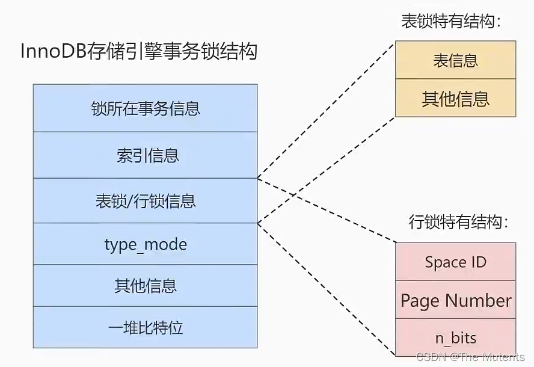

---
sidebar_position: 6
---

# MySQL 高级第六篇
## MySQL 中的锁机制
### 1.索的分类
#### 1.1 读锁、写锁
从数据操作的类型可以将锁划分为`读锁（共享锁）`和`写锁（排它锁）`
> - `读锁`:也称为`共享锁（share lock）`、英文用S表示。针对同一份数据，多个事务的读操作可以同时进行而不会互相影响， 相互不阻塞的。
> - `写锁`:也称为`排他锁（exclusive lock）`、英文用X表示。当前写操作没有完成前，它会阻断其他写锁和读锁。这样就能确保在给定的时间里，只有一个事务能执行写入，并防止其他用户读取正在写入的同一资源。
> 
>  - 注意：读操作不是只能使用S锁，读操作也可以使用X锁，来禁止其他事务读取该记录；而写操作的话只能使用X锁。
> 

- 加锁语法

 ```sql
 #加S锁
 读操作sql语句 lock in share mode;
 #或（8.0新增语法）
 读操作sql语句 for share;
 
 #加X锁
 读操作或写操作sql语句 for update;
 ```


> MySQL8.0 新特性: 
> - 在5.7及之前的版本，`SELECT  ...... FOR UPDATE`，如果获取不到锁，会一直等待，直到 `innodb_lock_ wait_timeout`超时。
> - 在8.0版本中，`SELECT ....... FOR UPDATE`，`SELECT ....... FOR SHARE` 添加 `NOWAIT`、`SKIP LOCKED` 语法，跳过锁等待，或者跳过锁定。 
> - 通过添加`NOWAIT`、`SKIP LOCKED`语法，能够立即返回。如果查询的行已经加锁: 
>    - 那么`NOWAIT`会立即报错返回
>    - 而`SKIP LOCKED`也会立即返回，只是返回的结果中不包含被锁定的行。


#### 1.2 表级锁、页级锁、行锁
从数据操作的粒度可以将锁划分为`表级锁`、`页级锁`、`行锁`

##### 表锁（Table Lock）
> 表锁会锁定整张表，它是MySQL中最基本的锁策略，并不依赖于存储引擎(不管是 MySQL的什么存储引擎, 对于表锁的策略都是一样的)，并且`表锁是开销最小的策略`(因为粒度比较大)。`由于表级锁一次会将整个表锁定，所以可以很好的避免死锁问题`。当然，锁的粒度大所带来最大的负面影响就是出现锁资源争用的概率也会最高，`导致并发率大打折扣`。

1. `表级别的S锁、x锁` 
> - 在对某个表执行SELECT、INSERT、DELETE、 UPDATE语句时，InnoDB存储引擎是不会为这个表添加表级别的S锁或者X锁的。在对某个表执行一些诸如ALTER TABLE、DROP TABLE这类的`DDL语句`时，其他事务对这个表并发执行诸如SELECT、INSERT、DELETE、UPDATE的语句时会发生阻塞。同理，某个事务中对某个表执行SELECT、INSERT、DELETE、 UPDATE语句时， 在其他会话中对这个表执行DDL语句也会发生阻塞。这个过程其实是通过在server层使用一种称之为`元数据锁`(英文名: Metadata Locks， 简称MDL )结构来实现的。 
> - `一般情况下，不会使用InnoDB存储引擎提供的表级别的S锁和X锁`。只会在一些特殊情况下，比方说崩溃恢复过程中用到。比如，在系统变且`autocommit=0`，`innodb_table_ locks = 1` 时，`手动获取`InnoDB存储引擎提供的表t的S锁或者X锁可以这么写: 
>    - `LOCK TABLES t READ`: InnoDB存储引擎会对表t加表级别的S锁. 
>    - `L0CK TABLES t WRITE` : InnoDB存储引擎会对表t加表级别的X锁。 
> 
> - 不过尽量避免在使用InnoDB存储引擎的表上使用LOCK TABLES这样的手动锁表语句，它们并不会提供什么额外的保护，只是会降低并发能力而已。InnoDB的厉害之处还是实现了`更细粒度的行锁`。在其他的MySQL引擎（MyISAM）的表中可以使用。

   ```sql
   # 查看哪些表加了锁
   show open tables where in_use>0;
   
   # 给某个表加读锁
   lock table 表名 read;
   # 给某个表加写锁
   lock table 表名 write;
   
   #释放锁
   unlock tables;
   ```
> MyISAM在执行查询语句(SELECT) 前，会给涉及的所有表加读锁，在执行增删改操作前，会给涉及的表加写锁。 
> InnoDB存储引擎是不会为这个表添加表级别的读锁或者写锁的。因为innodb有粒度更细的行锁。


2. `意向锁`
> `意向锁要解决的问题` ：
> 
> 若有两个事务T1和T2，其中T2试图在该表级别上应用共享或排它锁，如果没有意向锁存在，那么T2就需要去检查各个页或行是否存在锁；如果存在意向锁，那么此时就会受到由T1控制的表级别意向锁的阻塞。T2在锁定该表前不必检查各个页或行锁，而只需检查表上的意向锁。`简单来说就是给更大一级别的空间示意里面是否已经上过锁`。
> 在数据表的场景中，如果我们给某一行数据加上了排它锁，数据库会自动给更大一级的空间， 比如数据页或数据表加上意向锁，告诉其他人这个数据页或数据表已经有人上过排它锁了，这样当其他人想要获取数据表排它锁的时候，只需要了解是否有人已经获取了这个数据表的意向排他锁即可。
> - 如果事务想要获得数据表中某些记录的共享锁，就需要在数据表上添加意向共享锁。
> - 如果事务想要获得数据表中某些记录的排他锁，就需要在数据表上添加意向排他锁。 这时，意向锁会告诉其他事务已经有人锁定了表中的某些记录。
> 

  > InnoDB支持`多粒度锁`(multiple granularity locking) ，它允许行级锁与表级锁共存，而`意向锁`就是其中的一种表锁。 
> 1. `意向锁的存在是为了协调行锁和表锁的关系`，支持多粒度(表锁与行锁)的锁并存。 
> 2. 意向锁是一种`不与行级锁冲突表级锁`，这一点非常重要。
> 3.表明“某个事务正在某些行持有了锁或该事务准备去持有锁”
> 

  > - `意向共享锁`(intention shared lock, IS) :事务有意向对表中的某些行加共享锁(S锁)
> - `意向排他锁`(intention excluslve lock, lX) :事务有意向对表中的某些行加排他锁(x锁)
> 
> 意向锁是由存储引擎自己维护的，用户无法手动操作意向锁，在为数据行加共享/排他锁之前，InooDB 会先获取该数据行所在数据表的对应意向锁。
> 
> 1. InnoDB 支持多粒度锁，特定场景下，行级锁可以与表级锁共存。
> 2. 意向锁之间互不排斥，但除了IS与S兼容外，意向锁会与共享锁/排他锁互斥。
> 3. IX， IS是表级锁，不会和行级的X，S锁发生冲突。只会和表级的X，S发生冲突。
> 4. 意向锁在保证并发性的前提下，实现了`行锁和表锁共存`且`满足事务隔离性`的要求。

3. 自增锁（auto-lock）
> `AUTO-INC锁`是当向使用含有AUTO_INCREMENT列的表中插入数据时需要获取的一种特殊的表级锁，在执行插入语句时就在表级别加一个AUTO-INC锁，然后为每条待插入记录的AUTO_INCREMENT修饰的列分配递增的值，在该语句执行结束后，再把AUTO_INC锁释放掉。一个事务在持有AUTO_INC锁的过程中，其他事务的插入语句都要被阻塞，可以保证一个语句中分配的递增值是连续的。也正因为此，`其并发性显然并不高`，当我们向一个有AUTO_INCREMENT关键字的主键插入值的时候，每条语句都要对这个表锁进行竞争，这样的并发潜力其实是很低下的,所以innodb通过`innodb_autoinc_lock_mode`的不同取值来提供不同的锁定机制，来显著提高SQL语句的可伸缩性和性能。
> 1. `innodb_autoinc_lock_mode =  0`(传统锁定模式)
在此锁定模式下，所有类型的insert语句都会获得一个特殊的表级AUTO-INC锁， 用于插入具有AUTO_ INCREMENT列的表。即每当执行insert的时候， 都会得到一个表级锁/AUTO-INC锁)，使得语句中生成的auto_increment为顺序,且在binlog中重放的时候，可以保证master 与slave中数据的auto_increment是相同的。因为是表级锁，当在同一时间多个事务中执行Insert的时候，对于AUTO-INC锁的争夺会限制并发能力。
> 2. `innodb_autoinc_lock_mode =  1`（连续锁定模式）
在MySQL 8.0之前，连续锁定模式是默认的。
在这个模式下，`"bulk inserts"（批量插入`）仍然使用AUTO-INC表级锁，并保持到语句结束。这适用于所有`INSERT ....... SELECT`，`REPLACE ........ SELECT`和`LOAD DATA`语句。同一时刻只有一个语句可以持有AUTO-INC锁。
对于`Simple inserts`" (要插入的行数事先已知)，则通过在mutex (轻墨锁)的控制下获得所需数量的自动递增值来避免表级AUTO-INC锁，它只在分配过程的持续时间内保持，而不是直到语句完成，不使用表级AUTO-INC锁，除非AUTO-INC锁由另一个事务保持。如果另一个事务保持AUTO-INC锁，则"Simple inserts"等待AUTO-INC锁，例如这个事务它是一个"bulk inserts"。
>  3. `innodb_autoinc_lock_mode =  2`（交错锁定模式）
从MySQL 8.0开始,交错锁模式是默认设置。
在这种锁定模式下，所有类INSERT语句都不会使用表级AUT0-INC锁，并且可以同时执行多个语句。`这是最快和最可扩展的锁定模式`，但是当使用基于语句的复制或恢复方案时，从二进制日志重播SQL语句时，这是不安全的。
在此锁定模式下，`自动递增值保证在所有并发执行的所有类型的insert语句中是唯一且单调递增的`。但是，由于多个语句可以同时生成数字(即，`跨语句交叉编号`) ，`为任何给定语句插入的行生成的值可能不是连续的`。
如果执行的语句是“simple inserts"，其中要插入的行数已提前知道，除了"Mixed-mode inserts"之外，为单个语句生成的数字不会有间隙。然而，当执行"bulk inserts"时，在由任何给定语句分配的自动递增值中可能存在间隙。

4. 元数据锁（MDL 锁）
> MySQL5.5 引入了 meta data lock，简称MDL锁，属于表锁范畴。MDL 的作用是，保证读写的正确性。比如，如果一个查询正在遍历一个表中的数据，而执行期间另一个线程对这个`表结构做变更（DDL）`，增加了一列字段，那么查询线程拿到的结果跟表结构对不上，肯定是不行的。
> 因此，“`当对一个表做增删改查操作的时候，加MDL读锁；当要对表做结构变更操作的时候，加MDL写锁`”。
> `MDL读锁之间不互斥`，因此你可以有多个线程同时对一张表增删改查。读写锁之间、写锁之间是互斥的，用来保证变更表结构操作的安全性，`解决了DML和DDL操作之间的一致性问题`。`不需显示使用`，在访问一个表的时候会被自动加上。
> MDL锁的并发问题：
> 当只有两个事务加MDL读锁时，这两个锁不互斥；而当有两个以上的事务，且这些事务中有加MDL写锁的，那么其他的MDL读锁就会被阻塞。

##### InnoDB 中的行锁
> 行锁(Row Lock)也称为记录锁，顾名思义,就是锁住某一行(某条记录 row)。需要的注意的是，MySQL 服务器层并没有实现行锁机制，`行级锁只在存储引擎层实现`。 
> `优点`:锁定力废小，发生设冲关概率低，可以实现的并发度所。
> `缺点`:对于锁的开销比较大，加锁会比较慢,`容易出现死锁`情况。 
> InnoDB与MyISAM的最大不同有两点:
> - 一是InnoDB支持事务(TRANSACTION) ；二是InnoDB采用了行级锁。

1. 记录锁（record lock）
>- 当一个事务获取了一条记录的S型记录锁后，其他事务也可以继续获取该记录的S型记录锁，但不可以继续获取x型记录锁:
> - 当一个事务获取了一条记录的X型记录锁后，其他事务既不可以继续获取该记录的s型记录锁，也不可以继续获取X型记录锁。

2. 间隙锁（Gap locks）
> MySQL在REPEATABLE READ 隔离级别下是可以解决幻读问题的，解决方案有两种，可以使用`MVCC方案`解决,也可以采用`加锁方案`解决。但是在使用加锁方案解决时有个大问题，就是事务在第一次执行读取操作时，那些幻影记录尚不存在，我们无法给这些幻影记录加上记录锁。InnoDB提出了一种称之为`Gap Locks` 的锁，官方的类型名称为: LOCK_GAP ,我们可以简称为gap锁。
gap锁的提出仅仅是为了`防止插入幻影记录`而提出的。虽然有`共享gap锁`和`独占gap锁`这样的说法，但是`它们起到的作用是相同的`。而且如果对一条记录加了gap锁 (不论是共享gap锁还是独占gap锁)，并不会限制其他事务对这条记录加记录锁或者继续加gap锁。

3. 临键锁（Next-Key Locks）
> 有时候我们`既想锁住某条记录，又想阻止其他事务在该记录前边的间隙插入新记录`，所以InnoDB就提出了一种称之为`Next-Key Locks` 的锁，官方的类型名称为:`LOCK_ORDINARY` ,我们也可以简称为next-key锁。`Next-Key Locks是在存储引擎innodb、事务级别在可重复读的情况下使用的数据库锁`，innodb默认的锁就是Next-Key locks。
> next-key锁的`本质就是一个记录锁和一个gap锁的合体`,它既能保护该条记录，又能阻止别的事务将新记录插入被保护记录前边的间隙。


4. 插入意向锁（insert intention locks）
> 一个事务在插入一条记录时需要判断一下插入位置是不是被别的事务加了gap制( next-key锁也包含 gap锁) ,如果有的话，插入操作需要等待，直到拥有gap锁的那个事务提交。但是InnoDB规定事务在等待的时候也需要在内存中生成一个锁结构，表明有事务想在某个间隙中插入新记录，但是现在在等待。InnoDB就把这种类型的锁命名为`Insert Intention Locks` ，官方的类型名称为: `LOCK_INSERT_INTENTION`,我们称为插入意向锁。`插入意向锁是一种Gap锁，不是意向锁`，在insert操作时产生。
>      
>  插入意向锁是在插入一条记录行前，由INSERT操作产生的一种间隙锁 。该锁用以表示插入意向，当多个事务在同一区间(gap)
插入位置不同的多条数据时，事务之间不需要互相等待。假设存在两条值分别为4和7的记录，两个不同的事务分别试图插入值为5和6的两条记录，每个事务在获取插入行上独占的(排他)锁前，都会获取(4,7)之间的间隙锁，但是因为数据行之间并不冲突，所以两个事务之间并不会产生冲突(阻塞等待)。 
总结来说，插入意向锁的特性可以分成两部分:
> - (1)插入意向锁是一种特殊的间隙锁——间隙锁可以锁定开区间内的部分记录。
> - (2)插入意向锁之间互不排斥，所以即使多个事务在同一区间插入多条记录，只要记录本身(主键、唯一索引)不冲突，那么事务之间就不会出现冲突等待。
>
>注意，虽然插入意向锁中含有意向锁三个字，但是它并不属于意向锁而属于间隙锁，因为意向锁是表锁而插入意向锁是行锁。


##### 页锁

> 页锁就是在页的粒度上进行锁定，锁定的数据资源比行锁要多，因为一个页中可以有多个行记录。当我们使用页锁的时候，会出现数据浪费的现象，但这样的浪费最多也就是一个页上的数据行。`页锁的开销介于表锁和行锁之间，会出现死锁。锁定粒度介于表锁和行锁之间，并发度一般。` 

>每个层级的锁数量是有限制的，因为锁会占用内存空间，锁空间的大小是有限的。当某个层级的锁数量超过了这个层级的阈值时，就会进行锁升级。`锁升级就是用更大粒度的锁替代多个更小粒度的锁`，比如InnoDB中行锁升级为表锁，这样做的好处是占用的锁空间降低了，但同时数据的并发度也下降了。


#### 1.3乐观锁和悲观锁

从`对待锁的态度`来看锁的话，可以将锁分成`乐观锁`和`悲观锁`，从名字中也可以看出这两种锁是`两种看待数据并发的思维方式`。需要注意的是，乐观锁和悲观锁并不是锁，而是`锁的设计思想`
> 1. 乐观锁适合`读操作多`的场景，相对来说写的操作比较少。它的优点在于`使用程序实现`，且`不存在死锁`问题，不过适用场景也会相对乐观，因为它阻止不了除了程序以外的数据库操作。
> 2. 悲观锁适合`写操作多`的场景，因为写的操作具有排他性。采用悲观锁的方式，可以在数据库层面阻止其他事务对该数据的操作权限，防止`读-写`和`写-写`的冲突。

- 悲观锁（Pessimistic Locking）
> 悲观锁是一种思想，顾名思义，就是很悲观，`对数据被其他事务的修改持保守态度`，`会通过数据库自身的锁机制来实现`，从而保证数据操作的排它性。
> 悲观锁总是假设最坏的情况，每次去拿数据的时候都认为别人会修改，所以每次在拿数据的时候都会上锁，这样别人想拿这个数据就会阻塞直到它拿到锁(`共享资源每次只给一个线程使用，其它线程阻塞，用完后再把资源转让给其它线程`)。比如行锁，表锁等，读锁，写锁等，都是在做操作之前先上锁，当其他线程想要访问数据时， 都需要阻塞挂起。Java中`synchronized`和`ReentrantLock`等独占锁就是悲观锁思想的实现。
>

  > `select ...... for update`是MySQL中悲观锁。
> `注意:` 
> `select ...... for update`语句执行过程中`所有扫描的行都会被锁`上，`因此在MySQL中用悲观锁必须确定使用了索引，而不是全表扫描，否则将会把整个表锁住`。


- 乐观锁（Optimistic Locking）
> - 乐观锁认为对同一数据的并发操作不会总发生，属于小概率事件，不用每次都对数据上锁，但是在更新的时候会判新一下在此期间别人有没有去更新这个数据，也就是不采用数据库自身的锁机制，`而是通过程序来实现`。在程序上，我们可以采用`版本号机制`或者`CAS机制`实现。`乐观锁适用于多读的应用类型，这样可以提高吞吐量`。
> - 在 Java 中`java.util.concurrent.atomic`包下的原子变量类就是使用了乐观锁的一种实现方式: CAS实现的。


#### 1.4 显示锁和隐式锁
按`加锁的方式`可以将锁划分为:`显式锁`、`隐式锁`
- 隐式锁
> 一般情况下，新插入一条记录的操作并不加锁，通过一种称之为`隐式锁`的结构来`保护这条新插入的记录在本事务提交前不被别的事务访问`
> 
> - 情景一:对于`聚簇索引`记录来说，有一个trx_id隐藏列，该隐藏列记录着最后改动该记录的事务id。那么如果在当前事务中新插入一条聚簇索引记录后， 该记录的trx_id隐藏列代表的的就是当前事务的事务id，如果其他事务此时想对该记录添加S锁或者X锁时，首先会看一下该记录的 trx_id隐藏列代表的事务是否是当前的活跃事务，如果是的话，那么就`帮助当前事务创建`一个X锁(也就是为当前事务创建一个锁结构, is_ waiting属性是false) ,然后自己进入等待状态(也就是为自己也创建一个锁结构， is_waiting属性是true)
> - 情景二:对于二级索引记录来说，本身并没有trx_id隐藏列，但是在二级索引页面的Page Header部分有一个`PAGE_MAX_TRX_ID`属性,该属性代表对该页面做改动的最大的事务id,如果`PAGE_MAX_TRX_ID`属性值小于当前最小的活跃事务id ,那么说明对该页面做修改的事务都已经提交了,否则就需要在页面中定位到对应的二级索引记录，然后回表找到它对应的聚簇索引记录，然后再重复情景一的做法。
>
>隐式锁在实际内存对象中并不含有这个锁信息。只有当产生锁等待时，隐式锁转化为显式锁。

  >一个事务对新插入的记录可以不显式的加锁(生成一个锁结构) ，但是由于事务Id的存在，相当于加了一个隐式锁。别的事务在对这条记录加S锁或者X锁时，由于隐式锁的存在，会先帮助当前事务生成一个锁结构,然后自己再生成一个锁结构后进入等待状态。 `隐式锁是一种延迟加锁的机制`，从而来减少加锁的数量。

- 显示锁

  通过特定的语句进行加锁，我们一般称之为显示加锁，例如: 

  显示加共享锁:

  ```sql
  select .... lock in share mode
  ```

  显示加排它锁:

  ```sql
  select ... . for update
  ```

#### 1.5 其他锁
- 全局锁
> 全局锁就是`对整个数据库实列加锁`。当你需要让整个库处于只读状态的时候，可以使用这个命令，之后其他线程的以下语句会被阻塞：数据更新语句(数据的增删改)、数据定义语句 (包括建表、修改表结构等)和更新类事务的提交语句。
> 全局锁的典型使用场景是:做`全库逻辑备份`。 

  ```sql
  #全局锁的命令:
  Flush tables with read lock;
  ```

- 死锁
> 两个事务都持有对方需要的锁并且在等待对方释放，并且双方都不会释放自己的锁。

 > 1. 产生死锁的必要条件
>    1. 两个或者两个以上事务
>    2. 每个事务都已经持有锁并且申请新的锁
>    3. 锁资源同时只能被同一个事务持有或者不兼容
>    4. 事务之间因为持有锁和申请锁导致彼此循环等待 
>
>死锁的关键在于:两个(或以上)的Session加锁的顺序不一致。

  > 2. 处理死锁
> - 方式1:等待，直到超时(`innodb_lock_wait_timeout=50s`)
>   - 即当两个事务互相等待时，当一个事务等待时间超过设置的阈值时，就将其回滚，另外事务继续进行。这种方法简单有效，在innodb中，参数`innodb_lock_wait_timeout` 用来设置超时时间。 
>   - `缺点`:对于在线服务来说，这个等待时间往往是无法接受的。
>   - 那将此值修改短一些， 比如1s, 0.1s是否合适?不合适，容易误伤到普通的锁等待。
> - 方式2:使用死锁检测进行死锁处理
>   - 由于方式1检测死锁太过被动，innodb还提供了`wait-for graph（等待图）算法`来`主动进行死锁检测`，每当加锁请求无法立即满足需要并进入等待时，wait-for graph算法都会被触发。
>   - 这是一种`较为主动的死锁检测机制`，要求数据库保存`锁的信息链表`和`事务等待链表`两部分信息。基于这两个信息，就可以绘制出一个`wait-for graph（等待图）`
>   - 死锁`检测的原理`是构建一个以事务为顶点、 锁为边的有向图，`判断有向图是否存在环`，存在即有死锁。一旦检测到回路、有死锁，这时候InnoDB存储引擎会选择`回滚undo量最小的事务`，让其他事务继续执行( `innodb_deadlock_detect=on`表示开启这个逻辑)。
>   - `缺点`:每个新的被阻塞的线程,都要判断是不是由于自己的加入导致了死锁，这个操作时间复杂度是0(n)，如果100个并发线程同时更新同一行，意味着要检测100*100=1万次，1万个线程就会有1千万次检测。
>
> - 克服缺点：
>   - 1:`关闭死锁检测`，但意味着可能会出现大量的超时，会导致业务有损。
>   - 2:`控制并发访问的数量`。比如在中间件中实现对于相同行的更新，在进入引擎之前排队，这样在InnoDB 内部就不会有大量的死锁检测工作。
>   - 3:`也可以考虑通过将一行改成逻辑上的多行来减少锁冲突`。比如，连锁超市账户总额的记录，可以考虑放到多条记录上。账户总额等于这多个记录的值的总和。

  > 3. 避免死锁
> - 合理设计索引，使业务SQL尽可能通过索引定位更少的行，减少锁竞争。
> - 调整业务逻辑SQL执行顺序，避免update/delete长时间持有锁的SQL在事务前面。
> - 避免大事务，尽量将大事务拆成多个小事务来处理，小事务缩短锁定资源的时间，发生锁冲突的几率也更小。
> - 在并发比较高的系统中，不要显式加锁，特别是在事务里显式加锁。如`select ... for update`语句，如果是在事务里运行了start transaction或设置了autocommit等于0，那么就会锁定所查找到的记录。
> - 降低隔离级别。如果业务允许，将隔离级别调低也是较好的选择，比如将隔离级别从RR调整为RC，可以避免掉很多因为gap锁造成的死锁。

### 2.锁的内存结构
如果符合下边这些条件的记录会放到`一个锁结构`中。
> - 在同一个事务中进行加锁操作 
> - 被加锁的记录在同一个页面中 
> - 加锁的类型是一样的 
> - 等待状态是一样的

- innodb 存储引擎中的锁结构
  
> 1. **锁所在的事务信息**: 
> 不论是表锁还是行锁，都是在事务执行过程中生成的，哪个事务生成了这个锁结构，这里就记录这个事务的信息。 此锁所在的事务信息在内存结构中只是一个指针，通过指针可以找到内存中关于该事务的更多信息，比方说事务id等。
> 2. **索引信息**: 
> 对于行锁来说，需要记录一下加锁的记录是属于哪个索引的。 这里也是一个指针。
> 3. **表锁/行锁信息**: 
> 表锁结构和行锁结构在这个位置的内容是不同的.
>> - 表锁:记载着是对哪个表加的锁，还有其他的一些信息。
>> - 行锁:记载了三个重要的信息:
    1. `Space ID`:记录所在表空间。
    2. `Page Number` :记录所在页号。.
    3. `n_bits`: 对于行锁来说，一条记录就对应着一个比特位，一个页面中包含很多记录，用不同的比特位来区分到底是哪一条记录加了锁。为此在行锁结构的末尾放置了一堆比特位，这个n_bits属性代表使用了多少比特位。
>>   - n_ bits 的值一般都比页面中记录条数多一些。 主要是为了之后在页面中插入了新记录后也不至于重新分配锁结构
> 4. **type_mode**: 这是一个32位的数，被分成了`lock_mode`、`lock_type` 和`rec_lock_type` 三个部分，如图所示:
   
>> - 锁的模式(`lock_mode`)，占用低4位，可选的值如下
   1. `LOCK_IS` (十进制的0) :表示共享意向锁，也就是IS锁。
   2. `LOCK_IX` (十进制的1) :表示独占意向锁，也就是IX锁。
   3. `LOCK_S`(十进制的2) :表示共享锁，也就是S锁。
   4. `LOCK_X` (十进制的3) :表示独占锁，也就是X锁。
   5. `LOCK_AUTO_INC` (十进制的4) :表示AUTO-INC锁。
>> - 锁的类型(`lock_type`) ，`占用第5-8位`.不过现阶段只有第5位和第6位被使用:
   1. `LOCK_TABLE` (十进制的16) ，也就是当第5个比特位置为1时，表示表级锁。
   2. `LOCK_REC` (十进制的32) , 也就是当第6个比特位置为1时，表示行级锁。
>> - 行锁的具体类型( `rec_lock_type`) ,使用其余的位来表示。只有在lock_ type 的值为L0CK_REC时，也就是只有在该锁为行级锁时，才会被细分为更多的类型:
   1. `LOCK_ORDINARY` (十进制的0) :表示next-key锁。
   2. `LOCK_GAP` (十进制的512) :也就是当第10个比特位置为1时，表示gap领。
   3. `LOCK_REC_NOT_GAP` (十进制的1024) :也就是当第11个比特位置为1时，表示正经记录锁。
   4. `LOCK_INSERT_INTENTION` (十进制的 2048) :也就是当第12个比特位置为1时,表示插入意向锁。
   5. `LOCK_WAIT` (十进制的256) :当第9个比特位置为1时，表示is_waiting为true ,也就是当前事务尚未获取到锁，处在等待状态;当这个比特位为0时，表示is_waiting为false，也就是当前事务获取锁成功。
>5. **其他信息**: 为了更好的管理系统运行过程中生成的各种锁结构而设计了各种哈希表和链表。
>6. **一堆比特位**: 
>- 如果是`行锁结构`的话，在该结构末尾还放置了一堆比特位,比特位的数量是由上边提到的n_bits属性表示的。
>- InnoDB数据页中的每条记录在记录头信息中都包含一个heap_no属性，伪记录Infimum的heap_no 值为0，Supremum的heap_no值为1，之后每插入一条记录，heap_no值就增1。锁结构最后的一堆比特位就对应者一
个页面中的记录，一个比特位映射一个heap_no,即一个比特位映射到页内的一条记录。


### 3.锁监控
- 查看参数`InnoDB_row_lock`来分析锁的争夺情况

  ```sql
  show status like 'InnoDB_row_lock%';
  ```
> 相关属性：  
> - `Innodb_row_lock_current_waits` ：当前正在等待锁定的数量;
> -  `Innodb_row_lock_time`：从系统启动到现在锁定总时间长度; (等待总时长)
> -  `Innodb_row_lock_time_avg` ：每次等待所花平均时间; (等待平均时长)
> - `Innodb_row_lock_time_max`：从系统启动到现在等待最长的一次所花的时间;
> -  `Innodb_row_lock_waits`：系统启动后到现在总共等待的次数; (等待总次数)


- 其他监控方法:
> - MySQL把事务和锁的信息记录在了`information_schema` 库中，涉及到的三张表分别是`INNODB_TRX`、 `INNODB_LOCKS`和`INNODB_L0CK_WAITS`。
> - MySQL5.7 及之前，可以通过`information_schema.INNODB_LOCKS`查看事务的锁情况，但只能看到阻塞事务的锁; 如果事务并未被阻塞，则在该表中看不到该事务的锁情况。
> - MySQL8.0 刪除了 information_schema.INNODB_LOCKS, 添加了`performance_schema.data_locks`，可以通过 performance_schema.data_locks`查看事务的锁情况`。
> 和MySQL5.7及之前不同，performance_schema.data.locks`不但可以看到阻寒该事务的锁，还可以看到该事务所持有的锁`。 同时，information_schema.INNODB_LOCK_WAITS也被`performance_schema.data.lock.waits`所代替。

