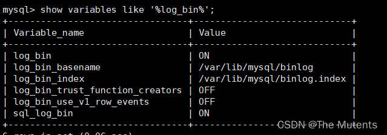

---
sidebar_position: 8
---

# MySQL 高级第八篇
## MySQL数据库日志
###  1.六大数据库日志
6类日志分别为:
> - `慢查询日志`:记录所有执行时间超过`long_query_time`的所有查询，方便我们对查询进行优化。
> - `通用查询日志`:记录所有连接的起始时间和终止时间，以及连接发送给数据库服务器的所有指令，对我们复原操作的实际场景、发现问题，甚至是对数据库操作的审计都有很大的帮助。
> - `错误日志`:记录MySQL服务的启动、运行或停止MySQL服务时出现的问题，方便我们了解服务器的状态，从而对服务器进行维护。
> - `二进制日志`:记录所有`更改数据`的语句，可以用于主从服务器之间的数据同步，以及服务器遇到故障时数据的无损失恢复。
> - `中继日志`:`用于主从服务器架构`中，从服务器用来存放主服务器二进制日志内容的一个中间文件。从服务器通过读取中继日志的内容，来同步主服务器上的操作。 
> - `数据定义语句日志`:记录数据定义语句执行的元数据操作。
>
>除二进制日志外，其他日志都是文本文件。默认情况下，所有日志创建于MySQL数据目录中。

### 2.日志的弊端

> - 日志功能会`降低MySQL数据库的性能`。例如，在查询非常频繁的MySQL数据库系统中，如果开启了通用查询日志和慢查询日志，MySQL数据库会花费很多时间记录日志。
> - 日志会`占用大量的磁盘空间`。对于用户量非常大、操作非常频繁的数据库，日志文件需要的存储空间设置比数据库文件需要的存储空间还要大。

### 3. 通用查询日志
> 通用查询日志用来记录用户的所有操作,包括启动和关闭MySQL服务、所有用户的连接开始时间和截止时间、发给MySQL数据库服务器的所有SQL指令等。当我们的数据发生异常时，查看通用查询日志，还原操作时的具体 场景，可以帮助我们准确定位问题。
>

- 查看通用查询日志状态

  ```sql
  show variables like '%general%';
  ```
  
- 启动日志

    ```sql
    # 修改my.cnf配置文件启动
    [mysqld]
    general_log=on
    general_log_file=[path[filename]] #path:文件的路径  filename:文件名
    
    # 临时修改
    set global general_log=on;
    ```

- 关闭日志

    ```sql
    # 修改my.cnf配置文件启动
    [mysqld]
    general_log=off
    
    # 临时修改
    set global general_log=off;
    ```

### 4.错误日志

> 错误日志记录了MySQL服务器启动、停止运行的时间，以及系统启动、运行和停止过程中的诊断信息,包括错 误、警告和提示等。
> 通过错误日志可以查看系统的运行状态，便于即时发现故障、修复故障。如果MySQL服务出现异常，错误日志是发现问题、解决故障的首选。


- 启动日志
> 错误日志功能默认开启，且无法禁止

  ```sql
  # 修改my.cnf配置文件指定文件路径和文件名
  [mysqld]
  log_error=[path[filename]] #path:文件的路径  filename:文件名
  ```

- 查看错误日志存储路径
  ```sql
  show variables like 'log_error%';
  ```


### 5.bin log日志

> bin log 即 Bbinary log，二进制日志文件，也叫作变更日志(update log)。它记录了数据库所有执行的DDL和DML等`数据库更新事件`的语句，但是不包含没有修改任何数据的语句(如数据查询语句select，show等) 。
> 它以事件形式记录并保存在`二进制文件`中。通过这些信息，我们可以再现数据更新操作的全过程。
>
> 作用：
>- 一是用于数据恢复
>- 二是用于数据复制

- 查看 bin log 的相关状态

  ```sql
  show variables like '%log_bin%';
  ```
  
  
> - `log_bin_basename` :是binlog日志的基本文件名，后面会追加标识来表示每一个文件 
> - `log_bin_index`:是binlog文件的索引文件， 这个文件管理了所有的binlog文件的目录 
> - `log_bin_trust_function_creators`:限制存储过程，前面我们已经讲过了，这是因为二进制日志的一个重要功能是用于`主从复制`，`而存储函数有可能导致主从的数据不一致`。所以当开启二进制日志后，需要限制存储函数的创建、修改、调用 
> - `log_bin_use_v1_row_events` :此只读系统变显已弃用。ON 表示使用版本1二进制日志行，0FF 表示使用版本2二进制日志行(MySQL5.6默认值为版本2)

##### 二进制日志行(MySQL 5.6的默认值为2)。
> 注：每次重启mysql服务都会新建一个binlog文件


- 日志参数设置

  ```sql
  # 在/etc/my.cnf中设置相关参数，重启mysql服务生效：systemctl restart mysqld
  [mysqld]
  log-bin=lhk-bin #配置bin log的文件名
  binlog_expire_logs_seconds=600 #配置二进制文件可以保存600秒
  max_binlog_size=100M #控制单个二进制文件的大小，默认为1GB
  ```

- 查看二进制日志

  ```sql
  #查看binlog文件
  show binary logs;
  ```
  
  ```bash
  #使用mysqlbinlog命令工具查看二进制日志文件内容
  mysqlbinlog "/var/lib/mysql/binlog.000003"
  
  # 查看二进制日志伪代码
  mysqlbinlog -v "/var/lib/mysql/binlog.000003"
  ```
上面这种办法读取出binlog日志的全文内容比较多，不容易分辩查看到pos点信息，下面这一种查询更为方便

  ```sql
  #命令:
  show binlog events [IN 'log_name'] [FROM pos] [LIMIT [offset,] row count];
  #例如
  show binlog events in 'binlog.000003' from 236 limit 5 ;
  ```
> - `IN 'log_name'`:指定要查询的binlog文件名(不指定就是第一个binlog文件) 
> - `FROM pos`:指定从哪个pos起始点开始查起(不指定就是从整个文件首个pos点开始算) 
> - `LIMIT [offset]` :偏移量(不指定就是0) 
> - `row_count` :查询总条数(不指定就是所有行)

- 查看二进制文件的格式
  
  ```sql
  show variables like 'binlog_format';
  ```
> 三种二进制文件的格式：
> - `Statement`：每一条会修改数据的sql都会记录在binlog中。
优点:不需要记录每一-行的变化，减少了binlog日志置，节约了I0提高性能。
> - `Row`：5.1.5版本的MySQL才开始支持row level的复制，它不记录sq|语句上下文相关信息,仅保存哪条记录被修改。
优点: row level的日志内容会非常清楚的记录下每一行数据修改的细节。而且不会出现某些特定情况下的存储过程，或function，以及trigger的调用和触发无法被正确复制的题。
> - `Mixed`：从5.1.8版本开始，MySQL提供了Mixed格式，实际上就是Statement与Row的结合。

- 使用二进制日志恢复数据`mysqlbinlog`
  - 恢复数据的语法如下:

  ```bash
  mysq1bin1og [option] f1lename | mysql -uuser -ppa88 ; 
  #例如
  mysqlbinlog --start-position=236 --stop-position=450 --database=dbtest1 /var/lib/mysql/binlog.000003 | mysql -uroot -p -v dbtest1
  ```
> 这个命令可以这样理解:使用 `mysqlbinlog` 命令来读取filename中的内容，然后使用mysql命令将这些内容恢复到数据库中。
> - `filename`: 是日志文件名。 
> - `option`: 可选项，比较重要的两对option参数是--start-date、--stop-date和--start-position、--stop-position. 
>    -  `--start-date` 和`--stop-date`: 可以指定恢复数据库的起始时间点和结束时间点。 。
>     - `--start-position`和 `--stop-position`:可以指定恢复数据的开始位置和结束位置。

- 删除二进制日志

  ```sql
  purge {master | binary} logs to '指定日志文件名';  #删除指定日志文件之前的日志文件
  #或
  purge {master | binary} logs before '指定日期';  #删除指定日期之前的日志文件
  
  # 删除所有的二进制日志文件
  reset master;
  ```

