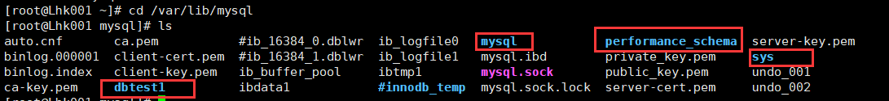
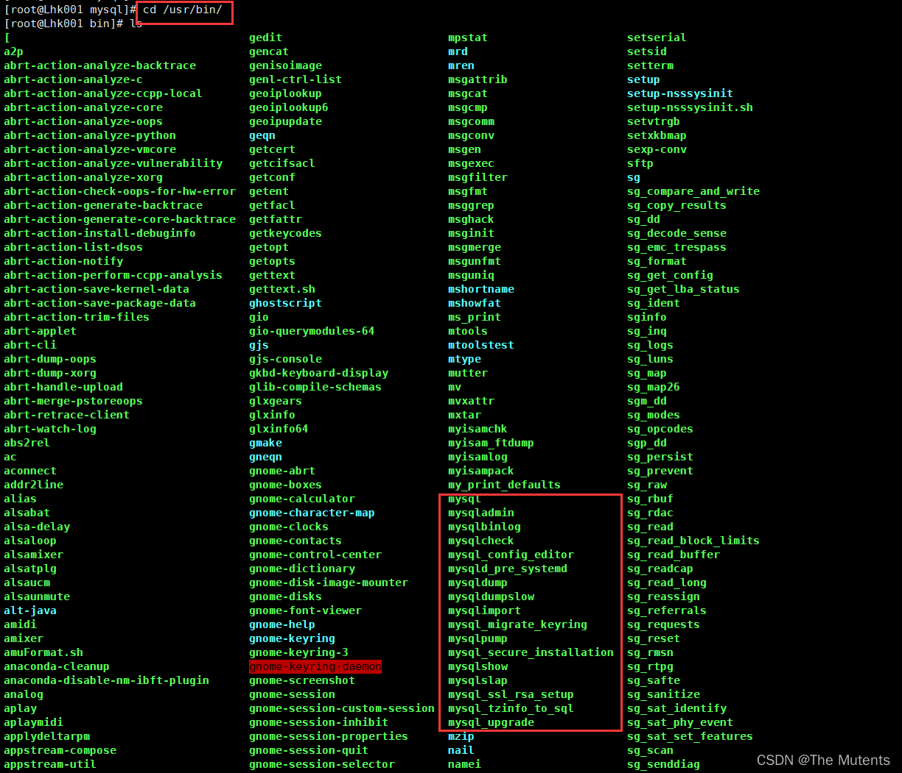
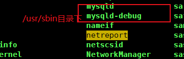
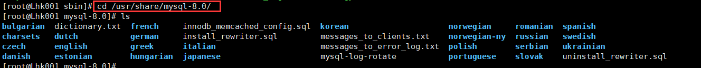
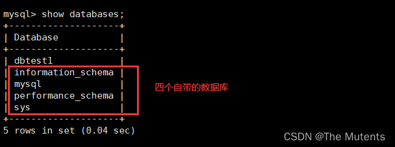
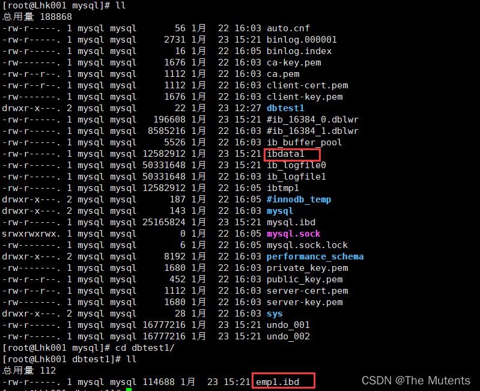

---
sidebar_position: 2
---

# MySQL8 的目录和文件
## 一、MySQL8 的主要目录结构
- 查看 mysql 相关的目录，命令如下
    ```bash
    find / -name mysql
    ```

    
    
### 1. 数据库文件的存放路径

-  MySQL 数据库文件的存放路径：`/var/lib/mysql`
-  MySQL 服务器程序在启动时会到文件系统的某个目录下加载一些文件，之后在运行过程中产生的数据也都会存储到这个目录下的某些文件中，这个目录就称为`数据目录`。

    

- 该目录对应着 MySQL 中的系统变量 `datadir`

    

### 2. 相关命令目录
-  存放 MySQL 相关命令目录：`/usr/bin`  和 `/usr/sbin`
-  安装目录下非常重要的 `bin` 目录，它里边存储了许多关于控制客户端程序和服务器程序的命令 (许多可执行文件，比如`mysql` ,  `mysqld ` , `mysqld_safe` 等 )。
-  而数据目录是用来存储 MySQL 在运行过程中产生的数据，注意区分开二者。
   
   

### 3. 配置文件目录
-  配置文件目录：`/usr/share/mysql-8.0/` ，`/etc/my.cnf`
   
   


## 二、 数据库和文件系统的关系
### 1. 存储引擎和文件系统简介
-  像 InnoDB、MyISAM 这样的`存储引擎`都是把表存储在磁盘上的，操作系统用来管理磁盘的结构被称为`文件系统`，所以用专业一点的话来表述就是:像 InnoDB、MyISAM 这样的存储引擎都是把表存储在文件系统上的。当我们想读取数据的时候，这些存储引擎会从文件系统中把数据读出来返回给我们，当我们想写入数据的时候，这些存储引擎会把这些数据又写回文件系统。

### 2. MySQL 中自带的数据库


- `mysql`
   > MySQL系统自带的`核心数据库`，它存储了MySQL的用户账户和权限信息，一些存储过程、事件的定义信息,一些运行过程中产生的日志信息，一些帮助信息以及时区信息等。

- `information_schema`
  > MySQL系统自带的数据库,这个数据库保存着MySQL服务器维护的所有其他数据库的信息，比如有哪些表、哪些视图、哪些触发器、哪些列、哪些索引。`这些信息并不是真实的用户数据，而是一些描述性信息, 有时候也称之为元数据`。在系统数据库information_schema中提供了一些以innodb_sys 开头的表，用于表示内部系统表。

- `performance_schema`
   > MySQL系统自带的数据库，这个数据库里`主要保存MySQL服务器运行过程中的y一些状态信息，可以用来监控MySQL服务的各类性能指标`。包括统计最近执行了哪些语句，在执行过程的每个阶段都花费了多长时间，内存的使用情况等信息。

- `sys`
  > MySQL系统自带的数据库，`这个数据库主要是通过视图的形式把information_schema和performance_ schema 结合起来`，帮助系统管理员和开发人员监控MySQL的技术性能。


### 3. 数据库在文件系统中的表示
1. 如果数据库 a 中的表 b 采用 `InnoDB` , `/var/lib/mysql/a` 中会产生1个或者2个文件:
   - `b.frm` :描述表结构文件，字段长度等
   - 如果`采用系统表空间模式`的，数据信息和索引信息都存储在`ibdata1`中
   - 如果`采用独立表空间存储模式` ，/var/lib/mysql/a中还会产生`b.ibd`文件(`存储数据信息和索引信息`)
   - 此外:
     1. MySQL5.7 中会在 `/var/lib/mysql/a` 的目录下生成 `db. opt` 文件用于保存数据库的相关配置。比如:字符集，比较规则。而 MySQL8.0 不再提供 `db.opt` 文件。 
     2. MySQL8.0 中不再单独提供 b.fm,而是合并在`b.ibd`文件中。
        
   


2. 如果数据库 a 中的表 b 采用 `MyISAM`, `/var/lib/mysql/a` 中会产生3个文件: 
   - MySQL5.7 中`b.frm` ：描述表结构文件，字段长度等。 
   - MySQL8.0 中`b.xxx.sdi`:描述表结构文件,字段长度等 
   - `b.MYD` ( MYData ) ：`数据信息`文件，存储数据信息(如果采用独立表存储模式) 
   - `b.MYI` (MYIndex) ：存放`索引信息`文件

### 4. 视图在文件系统中的表示

- 我们知道 MySQL 中的`视图其实是虚拟的表`，也就是`某个查询语句的一个别名而已`，所以在存储视图的时候是不需要存储真实的数据的，只需要把它的结构存储起来就行了。 
  - 和表一样,描述视图结构的文件也会被存储到所属数据库对应的子目录下边，只会存储一个`视图名. frm`的文件。如: `emp. details. view. frm`

### 5. 其他文件
- 除了我们上边说的这些用户自己存储的数据以外，`数据目录`下还包括为了更好运行程序的一些额外文件,主要包括这几种类型的文件: 
  - `服务器进程文件`
    - 我们知道每运行一个MySQL服务器程序,都意味着启动一个进程。MySQL服务器会把自己的进程ID写入到一个文件中。
  - `服务器日志文件`
    - 在服务器运行过程中，会产生各种各样的日志，比如常规的查询日志、错误日志、二进制日志redo日志等。
  - `默认/自动生成的SSL和RSA证书和密钥文件`
    - 主要是为了客户端和服务器安全通信而创建的一些文件。

