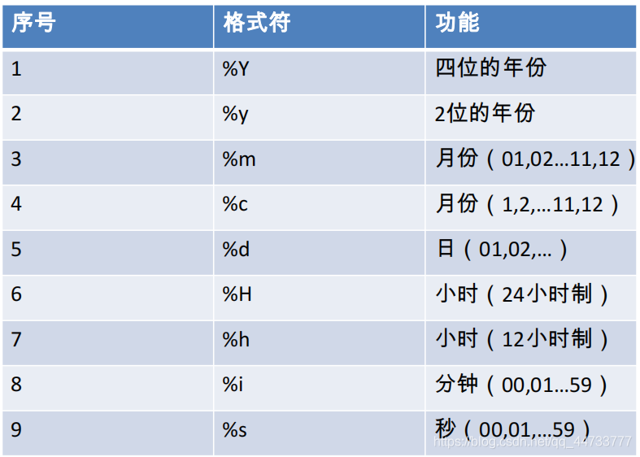
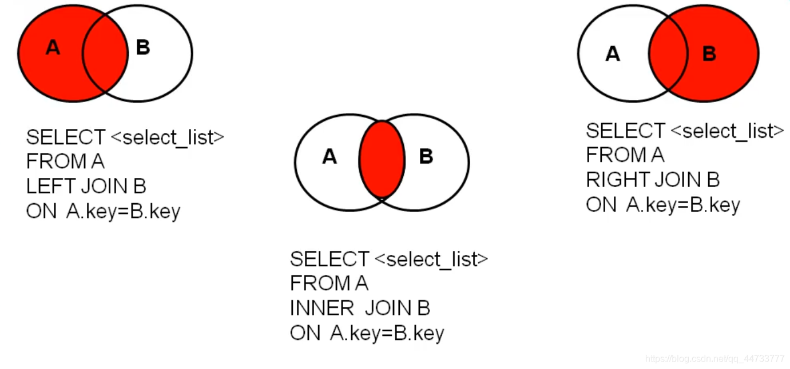
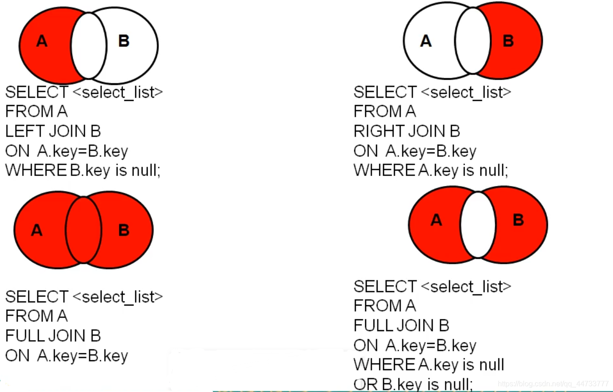
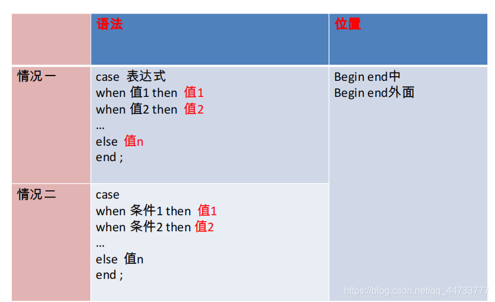
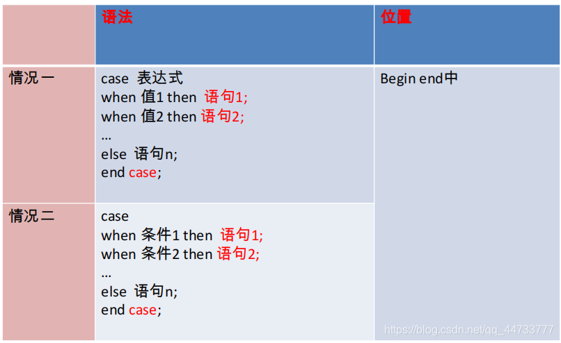
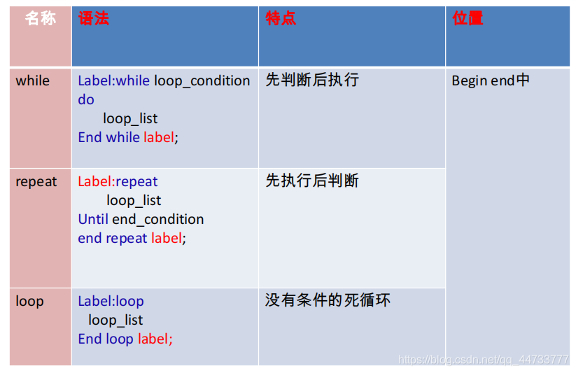

# MySQL 语法
## 一、DQL语言（Data Query Language ）数据查询语言
### 1.基础查询

```sql
#基础查询
/*
语法：
select 查询列表 
from 表名;

特点：
1.查询列表可以是：表中的字段，常量值，表达式，函数
2.查询的结果是一个虚拟的表格
*/

USE myemployees;

#1.查询表中单个字段
SELECT last_name FROM employees;

#2.查询表中的多个字段
SELECT last_name,email,phone_number FROM employees;

#3.查询表中的所有字段
#方式一
#其中``是着重号，用于区别关键字和字段
SELECT 
  `employee_id`,
  `first_name`,
  `last_name`,
  `email`,
  `phone_number`,
  `job_id`,
  `salary`,
  `commission_pct`,
  `manager_id`,
  `department_id`,
  `hiredate` 
FROM
  employees ;
  
#方式二
SELECT * FROM employees;

#4.查询常量值
SELECT 1000;
SELECT 'john';

#5.查询表达式
SELECT 5%3;

#6.查询函数
SELECT VERSION();

#7.起别名
/*
好处：①便于理解
      ②.如果要查询的字段由重名的情况，使用别名可以区分开来
*/
#方式一，使用AS
SELECT 100*3 AS 结果;
SELECT last_name AS 姓,first_name AS 名 FROM employees;

#方式二，使用空格 
SELECT last_name 姓,first_name 名 FROM employees;

#如果别名中有特殊字符，给别名添加上双引号
#例:查询last_name，显示为last name
SELECT last_name "last name" FROM employees;


#8.去重(distinct)
#例：查询employees表中涉及到的所有department_id
SELECT DISTINCT department_id FROM employees;


#9.+的作用
/*
mysql中的+只能作为运算符
select 100+50;  结果150
select '100'+50; 结果150
		 当有字符型的值时，会试图将字符型转化为数值
		 若转化成功，则继续做加法运算
		 若转化失败，则将字符型数值转化为0
select 'lhk'+50; 结果50

select null+50; 结果为null。只要有null存在，则结果为null
*/
#例：查询first_name和last_name连接(concat)成一个字段，并显示为姓名

SELECT 
  CONCAT (last_name,first_name) AS 姓名 
FROM
  employees ;


#显示（desc）表`departments`的结构，并查询其中的全部数据
DESC departments;
SELECT * FROM departments; 

#显示出表`employees`中的全部`job_id`（不能重复）
SELECT DISTINCT job_id FROM employees;

#显示出表`employees`的全部列，各个列之间用逗号连接，列头显示成OUT_PUT
SELECT 
	CONCAT(`employee_id`,',',`first_name`,',',`email`,',',`phone_number`,',',`job_id`,',',`salary`,',',IFNULL(`commission_pct`,0),',',`manager_id`,',',`department_id`,',',`hiredate`) AS OUT_PUT
FROM 
	employees;
```

### 2.条件查询

```sql
#条件查询
/*
语法：
	select 
		查询列表
	from
		表名
	where
		筛选条件;
		
分类：
	1.按条件表达式筛选
	条件运算符：> < = != <>(不等于) >= <=
	
	2.按逻辑表达式筛选
	逻辑运算符：&& || ! 
		    and or not
	&&或and: 当两个条件都为true，结果为true，反之为false
	||或or:  只要有一个条件为true，结果为true，反之为false
	!或not:  如果连接的条件本身为false，结果为true，反之为false
	
	3.模糊查询
		like
		between and
		in
		is null
	
*/

#1.按条件表达式筛选
#例：查询`salary`>10000的员工信息
SELECT 
  * 
FROM
  employees 
WHERE 
  salary > 10000 ;
  
#例：查询`department_id`不为90号的员工名和部门编号
SELECT
	first_name,department_id
FROM
	employees
WHERE
	department_id<>90;


#2.按逻辑表达式筛选
#例：查询`salary`在10000~20000之间的员工名、工资和奖金
SELECT 
	`first_name`,
	`salary`,
	`commission_pct`
FROM 
	employees
WHERE 
	salary>=10000 AND salary<=20000;
	
#例：查询`department_id`不在90~100之间，或者`salary`大于15000的员工信息
SELECT
	*
FROM 
	employees
WHERE
	NOT (department_id>=90 AND department_id<=110) OR salary>15000;
	

#3.模糊查询
/*
	like
	特点：①一般和通配符搭配使用
			通配符：%   代表任意多个字符（包含0个字符）
				_   代表任意单个字符
	between and
	in
	is null
*/

#①like
#例：查询`first_name`中包含字符a的员工信息
SELECT 
	*
FROM
	employees
WHERE
	first_name LIKE '%a%';


#例：查询`first_name`中第二个字符为r，第4个字符为c的员工名和工资
SELECT
	first_name,salary
FROM
	employees
WHERE
	first_name LIKE '_r_c%';
	
	
#例：查询`last_name`中第二个字符为_的员工名
/*
使用转义字符\
自定义转义字符：escape
*/
SELECT
	last_name
FROM
	employees
WHERE
	last_name LIKE '_$_%' ESCAPE '$';
	

#②between and
#例1.查询`employee_id`在100-120之间的员工信息
SELECT
	*
FROM
	employees
WHERE
	employee_id >=100 AND employee_id <=120;
	
#----------------------------------------------------------------------

SELECT
	*
FROM
	employees
WHERE
	employee_id BETWEEN 100 AND 120;
	
	
#③in
/*
含义：判断某个字段的值是否属于in列表中的某一项
特点：
	①提高语句的简洁度
	②in列表中的值类型必须一致或者兼容（类型可隐式转换）
	③in列表的值不支持通配符

*/
#例：查询员工的`job_id`是AD_PRES,AD_VP和IT_PROG中的一个员工名和工种编号
SELECT
	first_name,
	job_id
FROM
	employees
WHERE
	job_id='AD_PRES' OR job_id='AD_VP' OR job_id='IT_PROG';
	
#----------------------------------
SELECT
	first_name,
	job_id
FROM
	employees
WHERE
	job_id IN ('AD_PRES','AD_VP','IT_PROG');  
	
#④is null
/*
注：=和<>不能用于判断null值，可以判断普通类型的值
    is null 和 is not null 可以判断null值,不可以判断普通类型的值，可读性较高
    

*/
#例：查询没有奖金的员工名和奖金率
SELECT
	first_name,
	commission_pct
FROM
	employees
WHERE
	commission_pct IS NULL;

#例：查询有奖金的员工名和奖金率
SELECT
	first_name,
	commission_pct
FROM
	employees
WHERE
	commission_pct IS NOT NULL;
	
#⑤安全等于
/*
既可以判断null值，又可以判断普通类型的值
可读性比较差

使用时建议使用is null

*/
#例：查询没有奖金的员工名和奖金率
SELECT
	first_name,
	commission_pct
FROM
	employees
WHERE
	commission_pct <=> NULL;

#例：查询`salary`为12000的员工信息
SELECT
	*
FROM
	employees
WHERE
	salary<=>12000;
	
	
#例题：
#查询`employee_id`为176的员工名，部门编号和年薪
SELECT
	first_name,
	department_id,
	salary*12*(1+IFNULL(commission_pct,0)) AS 年薪
FROM	
	employees

#查询没有奖金，且工资小于12000的`salary``last_name`
SELECT
	salary,
	last_name
FROM
	employees
WHERE
	commission_pct IS NULL;
	
#查询`job_id`不为’IT‘或者工资为12000的员工信息
SELECT
	*
FROM
	employees
WHERE
	job_id NOT LIKE 'IT%' OR salary=12000;
	
#显示`departments`表的结构
DESC  `departments`;

#查询`departments`表中涉及到了哪些位置编号(distinct 去重)
SELECT
	DISTINCT `location_id`
FROM
	departments;
	
/*
经典面试题:
试问
select * from employees ;
和
select 
	* 
from 
	employees 
where 
	commission_pct like '%%’and last_name like ' %’;
结果是否一样？并说明原因

答：不一样，如果判断的字段有 null 值就不一样了

*/
```

### 3. 排序查询

```sql
#排序查询
/*
语法
	select	
		查询列表
	from
		表
	where
		筛选条件
	order by
		排序列表 （asc（升序）|desc（降序））
	
特点：
asc：升序（不写时默认为升序）
desc：降序	
order by字句中可以支持单个字段，多个字段，表达式，函数，别名
order by字句一般是放在查询语句最后面，limit字句除外
*/

#例1：查询员工信息，要求工资从高到低排序
SELECT
	*
FROM
	employees
ORDER BY
	salary DESC;
	
#例2：查询`department_id大于等于90的员工信息，按入职时间先后进行排序
SELECT
	*
FROM 
	employees
WHERE
	department_id >=90
ORDER BY
	`hiredate` ASC;
	
#例3：按年薪的高低显示员工的信息和年薪（按表达式排序）
SELECT
	*,
	salary*12*(1+IFNULL(commission_pct,0)) AS 年薪
FROM
	employees
ORDER BY
	salary*12*(1+IFNULL(commission_pct,0)) DESC;
	
	
#例4：按年薪的高低显示员工的信息和年薪（按别名排序）
SELECT
	*,
	salary*12*(1+IFNULL(commission_pct,0)) AS 年薪
FROM
	employees
ORDER BY
	年薪 DESC;


#例5：按`first_name`的长度显示员工的姓名和工资（按函数排序）
SELECT
	first_name,
	salary
FROM
	employees
ORDER BY
	LENGTH (first_name);

#例6：查询员工信息，先按工资排序，再按员工编号排序（按多个字段排序）
SELECT
	*
FROM
	employees
ORDER BY
	salary ,employee_id;

#例7：查询员工的`first_name`，`department_id`和年薪，按年薪降序，按`first_name`升序
SELECT
	first_name,
	department_id,
	salary*12*(1+IFNULL(commission_pct,0)) 年薪
FROM
	employees
ORDER BY
	年薪 DESC,first_name ASC;
	
	
#例8：选择工资不在8000-17000的员工的`last_name`和`salary`，按`salary`降序
SELECT
	`last_name`,
	`salary`
FROM
	employees
WHERE
	salary NOT BETWEEN(8000,17000)
ORDER BY
	salary DESC;
	
#例9：查询`email`中包含a的员工信息，并按邮箱的长度降序，再按部门号升序
SELECT
	*
FROM
	employees
WHERE
	`email` LIKE '%a%'
ORDER BY
	LENGTH(email) DESC ,`department_id` ASC;
```

### 4. 常见函数

```sql
#常见函数

/*
好处：1.隐藏了实现细节
      2.提高了代码的复用性
      
调用语法：select 函数名(实参列表) from 表;

特点：1.函数名
      2.函数功能
      
分类：1.单行函数（传一个参数，有一个返回值）
	• 字符函数
	• 数学函数
	• 日期函数
	• 其他函数
	• 流程控制函数
	例：concat、length、ifnull
      2.分组函数（传一组值，返回一个值）
	功能：做统计使用，又称为统计函数（或聚合函数、组函数）


常见函数：
1.单行函数
	字符函数：
	length
	concat
	substr
	instr
	trim
	upper
	lower
	lpad
	rpad
	replace
	数学函数：
	round
	ceil
	floor
	truncate
	mod
	日期函数：
	now
	curdate
	curtime
	year
	month
	monthname
	day
	hour
	minute
	second
	str_to_date
	date_format
	其他函数：
	version
	database
	user
	控制函数：
	if
	case
	
*/

#查看字符集
/*
utf8:一个英文字母占一个字节，一个汉字占三个字节
gbk：一个英文字母占一个字节，一个汉字占两个字节
*/
SHOW VARIABLES LIKE '%char%';


#一、字符函数
#1.length：获取参数的字节个数
SELECT LENGTH('lhk');
SELECT LENGTH('刘德华');

#2.concat:拼接字符串
SELECT CONCAT(last_name,'_',first_name) AS 姓名 FROM employees;

#3.upper,lower:大小写函数
SELECT UPPER('lhk');
SELECT LOWER('TheMutents');
#例：将`last_name`变为大写，`first_name`变为小写,然后拼接
SELECT CONCAT(UPPER(last_name),LOWER(first_name)) AS 姓名 FROM employees;

#4.substr、substring:截取字符串(索引位置从1开始，而不是0开始)
#截取从指定索引开始后面的所有字符
SELECT SUBSTR('TheMutents',4) AS out——put;

#截取从指定索引开始到指定字符长度的字符
SELECT SUBSTR('TheMutents',1,3) AS out——put;

#例：姓名中首字符大写，其他字符小写，然后用_拼接，显示出来
SELECT 
	CONCAT(UPPER(SUBSTR(last_name,1,1)),LOWER(SUBSTR(last_name,2)),'_',LOWER(first_name))
AS
	姓名
FROM
	employees;
	
#5.instr:返回子串第一次出现的索引位置，找不到则返回0
SELECT
	INSTR('TheMutents——Mutents','Mutents')AS out——put;

#6.trim:删除字符串前后两端的空格，或者删除字符串前后两端的指定字符

SELECT 
	TRIM('      TheMutents      ') AS out_put;
	
SELECT
	TRIM('aa' FROM 'aaaaaaaaaTheMutentsaaaaaa') AS out_put;
	
#7.lpad:用指定的字符实现左填充，使得字符串达到指定长度
#	如果指定长度小于字符串长度，则会从右截断达到指定长度
SELECT
	LPAD('TheMutents',15,'—') AS out_put;

SELECT
	LPAD('TheMutents',8,'—') AS out_put;
	
#8.rpad:用指定的字符实现右填充，使得字符串达到指定长度
SELECT
	RPAD('TheMutents',15,'12') AS out_put;
	
#9.replace：替换
SELECT
	REPLACE('theMutents','the','The') AS out_put;


#二、数学函数
#1.round：四舍五入
SELECT
	ROUND(5.57)AS out_put;
	
SELECT
	ROUND(-5.57)AS out_put;
	
#小数点后保留几位数
SELECT
	ROUND(5.57,1)AS out_put;

#2.ceil:向上取整，返回>=参数的最小整数
SELECT
	CEIL(6.32) AS out_put;

SELECT
	CEIL(-6.32) AS out_put;	

#3.floor：向下取整,返回<=参数的最大整数
SELECT
	FLOOR(4.221) AS out_put;
	
SELECT
	FLOOR(-4.221) AS out_put;
	
#4.truncate：截断
SELECT
	TRUNCATE(2.13030,1) AS out_put;

#5.mod：取余
/*
mod(a,b): a-a/b*b
例：mod(-5,2):  (-5)-(-5)/2*2=-1
*/
SELECT
	MOD(5,2) AS out_put;
SELECT
	MOD(-5,2) AS out_put;
#等价于
SELECT
	-5%2 AS out_put;
	
#三、日期函数
#1.now：返回当前系统日期+时间
SELECT
	NOW();
	
#2.curdate:返回当前系统日期，不包含时间
SELECT
	CURDATE();
	
#3.curtime:返回当前系统时间，不包含日期
SELECT
	CURTIME();

#4.获取年、月、日、时、分、秒
SELECT YEAR(NOW()) AS 年;
SELECT YEAR('2021-7-1') AS 年;
SELECT YEAR(hiredate) AS 年 FROM employees;

SELECT MONTH(NOW()) AS 月;
SELECT DAY(NOW()) AS 日;
SELECT HOUR(NOW()) AS 时;
SELECT MINUTE(NOW()) AS 分;
SELECT SECOND(NOW()) AS 秒;

#5.str_to_date: 将指定日期格式的字符转换成默认格式的日期
/*
mysql中的默认日期格式，例：2121-07-16
*/
SELECT 
	STR_TO_DATE('7-16-2021','%c-%d-%Y') AS 日期;

#例：查询入职日期为1992-4-3的员工信息
SELECT * FROM employees WHERE hiredate='1992-4-3';

SELECT * FROM employees WHERE STR_TO_DATE('4-3 1992','%c-%d %Y');

#6.• date_format:将日期转换成指定格式字符
SELECT DATE_FORMAT(NOW(),'%Y年%m月%d日') AS 日期;

#例：查询有奖金的员工名和入职日期（转换为xx月/xx日 xx年）
SELECT
	`first_name` AS 员工名,
	DATE_FORMAT(hiredate,'%m月/%d日 %Y年') AS 入职日期
FROM
	employees
WHERE
	commission_pct IS NOT NULL;


#四、其他函数
#1.查看版本号
SELECT VERSION();

#2.查看当前数据库
SELECT DATABASE();

#3.查看当前用户
SELECT USER();

#五、流程控制函数
#1.if():实现if else的效果
SELECT
	IF(10>5,'成立','不成立');
	
SELECT
	`first_name`,
	IF(commission_pct IS NOT NULL ,'有奖金','无奖金') AS 备注
FROM
	employees;
	
#2.case函数使用一:实现switch case的效果
/*
语法：
	case 字段或表达式
		when 常量1 then 要显示的值1或语句1
		when 常量2 then 要显示的值2或语句1
		...
		else 要显示的值n或语句n
	end
*/
/*例：查询员工的工资，要求：

	部门号=30，显示的工资为1.1倍
	部门号=40，显示的工资为1.2倍
	部门号=50，显示的工资为1.3倍
	其他部门，显示原工资
*/

SELECT
	salary AS 原工资,
	department_id,
	CASE department_id
		WHEN 30 THEN salary*1.1
		WHEN 40 THEN salary*1.2
		WHEN 3=50 THEN salary*1.3
		ELSE salary
	END AS 新工资
FROM
	employees;
	
#3.case函数使用二：实现多重if的效果
/*
语法：
	case
		when 条件1 then 要显示的值1或语句1
		when 条件2 then 要显示的值2或语句2
		...
		else 要显示的值n或语句n
	end
*/

/*例：查询如下情况员工工资
如果工资>20000,显示A级别
如果工资>15000,显示B级别
如果工资>10000,显示C级别
否则 显示D级别
*/

SELECT salary,
	CASE
	WHEN salary>20000 THEN 'A'
	WHEN salary>15000 THEN 'B'
	WHEN salary>10000 THEN 'C'
	ELSE 'D'
	END AS 工资级别
FROM
	employees;
	
	
	
	
#例题：
#1.显示系统时间
SELECT NOW();

#2.查询`employee_id`、`first_name`、`salary`，以及工资提高20%后的结构（new salary）
SELECT
	`employee_id`,
	`first_name`,
	`salary`,
	salary*1.2 AS "new salary"
FROM
	employees;
	

#3.将员工的姓名按首字母排序，并写出姓名的长度（length）
SELECT
	LENGTH(`first_name`),
	SUBSTR(first_name,1,1) AS 首字母,
	`first_name`
FROM
	employees
ORDER BY
	首字母;
	
#4.做一个查询，产生下面的结果
#<last_name> earns <salary> monthly but wants <salary*3>
#结果如下：
/*Dream salary
 King earns 24000 monthly but wants 72000
*/
SELECT
	CONCAT(last_name,' earns ',salary,' monthly but wants ',salary*3) AS "Dream aslary"
FROM
	employees
WHERE
	salary=24000;
	
#5.使用case-when，实现如下结果：
/*
	job		grade
	AD_PRES		A
	sT_MAN		B
	IT_PROG		c
	SA_REP		D
	ST_CLERK	E
产生下面的结果
Last_name	Job_id	Grade
king		AD_PRES   A
*/

SELECT
	last_name,
	job_id ,
	CASE job_id
	WHEN 'AD_PRES' THEN 'A'
	WHEN 'sT_MAN'  THEN 'B'
	WHEN 'IT_PROG'  THEN 'C'
	WHEN 'SA_REP'  THEN 'D'
	WHEN 'ST_CLERK'  THEN 'E'
	END AS grade
FROM
	employees
WHERE
	job_id='AD_PRES';
```

- mysql 日期的格式符
  

```sql
#分组函数
/*
功能：做统计使用，又称为统计函数（或聚合函数、组函数）

常见函数：
sum 求和、avg 平均值、max 最大值、min 最小值、count 计算个数


特点:
1、sum、 avg—般用于处理数值型
   max-min- count可以处理任何类型
2、以上分组函数都忽略null值
3、可以和distinct搭配实现去重的运算
4、count函数的单独介绍
   一般使用count (*)用作统计行数
5、和分组函数一同查询的字段要求是group by后的字段
*/

#1.简单的使用
SELECT SUM(`salary`) FROM employees AS out_put;
SELECT AVG(`salary`) FROM employees AS out_put;
SELECT MAX(`salary`) FROM employees AS out_put;
SELECT MIN(`salary`) FROM employees AS out_put;
SELECT COUNT(`salary`) FROM employees AS out_put;

SELECT
	SUM(salary) AS 总工资和,
	ROUND(AVG(salary),2) AS 平均工资,
	MAX(salary) AS 最高工资,
	MIN(salary) AS 最低工资,
	COUNT(salary) AS 个数
FROM
	employees;
	

#2.分组函数参数支持的类型
#sum、avg函数参数不能为字符型、日期型(不报错，但是没有意义)
#一般处理数值型参数
SELECT	SUM(`last_name`),AVG(last_name) FROM employees;
SELECT  SUM(`hiredate`),AVG(`hiredate`) FROM employees;

#max、min、count函数可以处理任何类型的参数
SELECT MAX(`last_name`),MIN(`last_name`) FROM employees;
SELECT MAX(`hiredate`),MIN(`hiredate`) FROM employees;
#count函数只能计算参数不为null的个数
SELECT COUNT(commission_pct) FROM employees;


#3.忽略null
#分组函数在做运算时忽略null值
SELECT	SUM(`commission_pct`),AVG(`commission_pct`) FROM employees;
SELECT MAX(`commission_pct`),MIN(`commission_pct`) FROM employees;
SELECT COUNT(commission_pct) FROM employees;


#4.和distinct搭配实现去重
SELECT
	SUM(DISTINCT `salary`) AS 去重后的总工资,
	SUM(salary) AS 未去重的总工资
FROM
	employees;

SELECT COUNT(DISTINCT salary) AS 去重后的个数,COUNT(salary) AS 未去重的个数
FROM 	employees;


#5.COUNT函数的详细使用
SELECT COUNT(salary) FROM employees;
#统计总行数
SELECT COUNT(*) FROM employees;
SELECT COUNT(1) FROM employees;

/*效率：
MYISAM存储引擎下，count(*)的效率高
INNODB存储引擎下，
count(*)的效率和count(1)的效率差不多，
比count(字段)的效率要高

*/


#6.和分组函数一同查询的字段有限制(不报错，但无意义)
SELECT AVG(salary),`employee_id` FROM employees;


#例题：
#1.查询员工工资的最大值、最小值、平均值、总和
SELECT 
	MAX(salary)AS max_salary,
	MIN(salary)AS min_salary,
	ROUND(AVG(salary),2)AS avg_salary,
	SUM(salary)AS sum_salary
FROM
	employees;

#2.查询员工表总的最大入职时间和最小入职时间的相差天数（别名为difference）
SELECT 
	DATEDIFF(MAX(`hiredate`),MIN(`hiredate`)) AS difference
FROM
	employees;
	
#3.查询部门编号为90的员工个数
SELECT
	COUNT(*)
FROM
	employees
WHERE
	department_id=90;
```


### 5. 分组查询

```sql
#分组查询
/*
语法：
	select 分组函数，字段（要求出现在group by的后面）
	from 表
	where 筛选条件
	group by 分组的列表
	order by 字句;
注意：
	查询列表比较特殊，要求是分组函数和group by后出现的字段

特点：
				
1、分组查询中的筛选条件分为两类
			数据源		位置			关键字
	分组前筛选	原始表	 	group by子句的前面	where
	分组后筛选	分组后的结果集	group by子句的后面	having

	①、分组函数做条件肯定是放在having子句中
	②、能用分组前筛选的，就优先考虑使用分组前筛选
	
	2、group by子句支持单个字段分组，多个字段分组(多个字段之间用逗号隔开没有顺序要求），表达式或函数（用的较少）
	3、也可以添加排序（排序放在整个分组查询的最后
	
*/
#引入：查询每个部门的平均工资
SELECT 
	department_id,
	AVG(salary) AS 平均工资
FROM
	employees
GROUP BY
	department_id;
	
#1.简单的分组查询
#例.查询每个工种的最高工资
SELECT MAX(salary),job_id
FROM employees
GROUP BY job_id;

#例：查询每个位置上的部门个数
SELECT
	COUNT(*) AS 部门个数,
	location_id
FROM
	departments
GROUP BY
	location_id;
	
#2.添加简单的（分组前）筛选条件查询
#例：查询邮箱中包含a字符的，每个部门的平均工资
SELECT
	AVG(salary),
	department_id
FROM
	employees
WHERE
	email LIKE '%a%'
GROUP BY
	department_id;
	
#例：查询有奖金的每个领导的手下员工的最高工资
SELECT
	MAX(salary),
	`manager_id`
FROM
	employees
WHERE
	commission_pct IS NOT NULL
GROUP BY
	manager_id;


	
#3.添加复杂的（分组后）筛选条件查询

#例：查询哪个部门的员工个数>2
#①、查询每个都门的员工个数
#②、根据①的结果进行筛选，查询哪个部门的员工个数>2
SELECT
	COUNT(*) AS 员工个数,
	`department_id`
FROM
	employees
GROUP BY
	department_id
HAVING
	员工个数>2;
	
#例：查询每个工种有奖金的员工的最高工资>12000的工种编号和最高工资
#①、查询每个工种有奖金的员工的最高工资
#②、根据①结果继续筛选，最高工资>12000
SELECT
	`job_id`,
	MAX(salary) AS 最高工资
FROM
	employees
WHERE	
	commission_pct IS NOT NULL
GROUP BY
	job_id
HAVING
	最高工资>12000;
	
#例：查询领导编号>102的每个领导下的员工的最低工资>5000的领导编号是哪个，以及其最低工资


SELECT
	`manager_id`,
	MIN(salary) AS 员工最低工资
FROM
	employees
WHERE
	manager_id>102
GROUP BY
	manager_id
HAVING
	员工最低工资>5000;
	
	
#4.支持按表达式或函数分组查询
#例：按员工姓名的长度分组，查询每一组的员工个数，筛选员工个数>5的有哪些
SELECT
	COUNT(*) AS 员工个数,
	LENGTH(`last_name`) AS 姓名长度
FROM
	employees
GROUP BY
	姓名长度
HAVING
	员工个数>5;
	
	
#5.按多个字段分组
#例：查询每个部门每个工种的员工的平均工资
SELECT
	AVG(salary),
	department_id,
	job_id
FROM
	employees
GROUP BY
	department_id,job_id;

	
#6.添加排序
#例：查询每个部门每个工种的员工的平均工资，且按平均工资降序排列
SELECT
	AVG(salary),
	department_id,
	job_id
FROM
	employees
GROUP BY
	department_id,job_id
ORDER BY
	AVG(salary) DESC;
	


#例题：
#1.查询各job_id的员工工资的最大值，最小值，平均值，总和，并按job_id升序
SELECT
	MAX(salary),
	MIN(salary),
	AVG(salary),
	SUM(salary),
	job_id
FROM
	employees
GROUP BY
	job_id
ORDER BY
	job_id;
	
#2.查询员工最高工资和最低工资的差距（别名为difference）
SELECT
	MAX(salary)-MIN(salary) AS difference
FROM
	employees;
	
#3.查询各个管理者手下员工的最低工资，其中最低工资不能低于6000，没有管理者的员工不计算在内
SELECT
	MIN(salary) AS min_salary,
	manager_id
FROM
	employees
WHERE
	manager_id IS NOT NULL
GROUP BY
	manager_id
HAVING
	min_salary>=6000;
	
#4.查询所有部门的编号，员工数量和工资平均值，并按平均工资降序
SELECT
	department_id AS 部门编号,
	COUNT(*) AS 员工数量 ,
	AVG(salary) AS avg_salary
FROM
	employees
GROUP BY
	department_id
ORDER BY
	avg_salary DESC;
	
#5.选择具有各个job_id的员工人数
SELECT
	COUNT(*),
	job_id
FROM
	employees
GROUP BY
	job_id;
```

### 6. 连接查询（多表查询）

```sql
#连接查询
/*
含义：又称为多表查询，当查询的字段来自于多个表时，就会用到连接查询

笛卡尔乘积现象:表1有m行，表2有n行，结果=m*n行
发生原因:没有有效的连接条件
如何避免:添加有效的连接条件

分类:
	按年代分类:
	sql92标准:仅仅支持内连接
	sql99标准【推荐】:支持内连接+外连接（左外和右外)+交叉连接
	
	按功能分类:
	内连接:
		1.等值连接
		2.非等值连接
		3.自连接
	外连接:
		1.左外连接
		2.右外连接
		3.全外连接
	交叉连接

*/


	
#一、sql92标准

#1.等值连接
/*
①.多表等值连接的结果为多表的交集部分
②.n表连接,至少需要n-1个连接条件
③.多表的顺序没有要求
④.一般需要为表起别名
⑤.可以搭配排序、分组、筛选等子句使用

*/
#例1.查询女神名和对应的男神名
SELECT	
	`name`,
	`boyName`
FROM
	beauty,boys
WHERE
	beauty.`boyfriend_id`=boys.`id`;
	
#例2：查询员工名和对应的部门名
SELECT
	last_name,
	department_name
FROM
	employees,departments
WHERE
	employees.`department_id`=departments.`department_id`;
	
	
#为表起别名
/*
①提高语句的简洁度
②区分多个重名的字段

注意:如果为表起了别名，则查询的字段就不能使用原来的表名去限定
*/
#例3.查询员工名、工种号、工种名
SELECT
	last_name,
	e.job_id,
	job_title
FROM
	employees e,
	jobs j
WHERE
	e.`job_id`=j.`job_id`;
	
#两个表的顺序可以交换
#例4.查询员工名、工种号、工种名
SELECT
	last_name,
	e.job_id,
	job_title
FROM
	jobs j,
	employees e,
WHERE
	e.`job_id`=j.`job_id`;
	
#可以加筛选(and)
#例5：查询有奖金的员工名、部门名
SELECT
	last_name,
	department_name,
	commission_pct
FROM
	employees e,
	departments d
WHERE
	e.`department_id`=d.`department_id`
AND	e.commission_pct IS NOT NULL;

#例6:查询城市名中第二个字符为o的部门名和城市名
SELECT
	department_name,
	city
FROM
	departments d,
	locations l
WHERE	
	d.`location_id`=l.`location_id`
AND	l.`city` LIKE '%o%';

#可以添加分组
#例7：查询每个城市的部门个数
SELECT
	COUNT(*) 部门个数,
	city
FROM
	departments d,
	locations l
WHERE
	d.`location_id`=l.`location_id`
GROUP BY
	l.`city`;
	
#例8：查询有奖金的每个部门的部门名和部门的领导编号和该部门的最低工资
SELECT
	department_name,
	d.manager_id,
	MIN(salary)
FROM
	departments d,
	employees e
WHERE
	d.`department_id`=e.`department_id`
AND	e.`commission_pct` IS NOT NULL
GROUP BY
	department_name;
	
#可以添加排序
#例9：查询每个工种的工种名和员工的个数，并且按员工个数降序
SELECT
	job_title,
	COUNT(*) 员工个数
FROM
	jobs j,
	employees e
WHERE
	j.`job_id`=e.`job_id`
GROUP BY
	job_title
ORDER BY
	员工个数 DESC;
	
#可以实现三表连接
#例10：查询员工名、部门名和所在的城市
SELECT
	last_name,
	department_name,
	city
FROM
	employees e,
	departments d,
	locations l
WHERE
	e.`department_id`=d.`department_id`
AND	d.`location_id`=l.`location_id`;


#2.非等值连接

#例：查询员工的工资和工资级别
SELECT
	salary,
	grade_level
FROM
	employees e ,
	job_grades j
WHERE
	salary BETWEEN j.`lowest_sal`AND j.`highest_sal`;


/*CREATE TABLE job_grades
(grade_level VARCHAR(3),
 lowest_sal  int,
 highest_sal int);

INSERT INTO job_grades
VALUES ('A', 1000, 2999);

INSERT INTO job_grades
VALUES ('B', 3000, 5999);

INSERT INTO job_grades
VALUES('C', 6000, 9999);

INSERT INTO job_grades
VALUES('D', 10000, 14999);

INSERT INTO job_grades
VALUES('E', 15000, 24999);

INSERT INTO job_grades
VALUES('F', 25000, 40000);*/


#3.自连接
#例：查询员工名和上级的名称
SELECT
	e.employee_id AS 员工号,
	e.last_name AS 员工名,
	m.employee_id AS 上级编号,
	m.last_name AS 上级名
FROM
	employees e,employees m
WHERE
	e.`manager_id`=m.`employee_id`;
	


#例题
#1：显示员工表的最大工资，工资平均值
SELECT
	MAX(salary),
	AVG(salary)
FROM
	employees;

#2.查询员工表的`employee_id``job_id``last_name`，按`department_id`降序，`salary`升序
SELECT
	employee_id,
	job_id,
	last_name
FROM
	employees
ORDER BY
	department_id DESC,salary ASC;
	
#3.查询员工表的job_id中包含a和e的，并且a在e的前面	
SELECT
	job_id
FROM
	employees
WHERE
	job_id LIKE '%a%e%';

/*4.已知表student,_里面有id(学号)，name，gradeId(年级编号)
已知表grade，里面有id(年级编号）， name（年级名）
己知美result，里面有id，score，studentNo(学号）
要求查询姓名、年级名、成绩

select
	s.name,g.name,r.score
from
	student s, grade g, result r
where
	s.gradeId=g.id
and	s.id=r.studentNo;
*/


#5.显示所有员工的姓名，部门号和部门名称。
	
SELECT
	last_name,
	e.department_id,
	department_name
FROM
	employees AS  e,
	departments AS d
WHERE
	e.department_id=d.department_id;
	
#6.查询90号部门员工的job_id和90号部门的location_id
SELECT
	d.department_id,
	job_id,
	location_id
FROM
	employees e,
	departments d
WHERE
	e.department_id=d.`department_id`
AND 	d.`department_id`=90;

#7.选择所有有奖金的员工的last_name,department_name,location_id,city
SELECT
	last_name,
	department_name,
	l.location_id,
	city
FROM
	employees e,
	departments d,
	locations l
WHERE
	e.`department_id`=d.`department_id`
AND	d.`location_id`=l.`location_id`
AND	e.`commission_pct` IS NOT NULL;


#8.选择city在Toronto工作的员工的last_name,job_id,department_id,department_name
SELECT
	last_name,
	job_id,
	e.department_id,
	department_name,
	city
FROM
	employees e,
	departments d,
	locations l
WHERE
	e.`department_id`=d.`department_id`
AND	d.`location_id`=l.`location_id`
AND	l.`city`='Toronto';


#9.查询每个工种、每个部门的部门名、工种名和最低工资
SELECT
	d.department_id,
	department_name,
	j.job_id,
	job_title,
	MIN(salary)
FROM
	employees e,
	departments d,
	jobs j
WHERE
	e.`department_id`=d.`department_id`
AND	e.`job_id`=j.`job_id`
GROUP BY
	d.department_name,j.job_title;

#10.查询每个国家下的部门个数大于2的国家编号
SELECT
	country_id,
	COUNT(*) AS 部门个数
FROM
	departments d,
	locations l
WHERE
	d.`location_id`=l.`location_id`
GROUP BY
	country_id
HAVING
	部门个数>2;

#7、选择指定员工的姓名，员工号，以及他的管理者的姓名和员工号，结果类似于下面的格式
employees	Emp#	manager  Mgr#
kochhar		101	king	 100

SELECT
	e.last_name AS employees,
	e.employee_id AS 'Emp#',
	m.last_name AS manager,
	m.employee_id AS 'Mgr#'
FROM
	employees e,
	employees m
WHERE
	e.manager_id=m.employee_id
AND	e.last_name='kochhar';
```

```sql
#sql99语法(推荐使用该标准的语法)
/*
语法：
	select 查询列表
	from 	表1  别名  【连接类型】
	join	表2  别名  
	on	连接条件
	【where	筛选条件】
	【group by 分组】
	【having 筛选条件】
	【order by 排序列表】;

连接类型：
1.内连接：inner
2.外连接
	左外连接：left 【outer】
	右外连接：right【outer】
	全外连接：full【outer】(mysql不支持)
3.交叉连接：cross

*/

#一、内连接
/*
语法：
	select 查询列表
	from 	表1  别名 
	inner  join	表2  别名  
	on	连接条件
	【where	筛选条件】
	【group by 分组】
	【having 筛选条件】
	【order by 排序列表】;
	

分类：
1.等值连接
2.非等值连接
3.自连接

*/

#1.等值连接
#案例1.查询员工名、部门名(调换位置)

SELECT
	last_name,
	department_name
FROM
	departments d
INNER JOIN
	employees e
ON
	e.`department_id`=d.`department_id`;


#案例2.查询名字中包含e的员工名和工种名(筛选）
SELECT
	last_name,
	job_title
FROM
	employees e
INNER JOIN
	jobs j
ON
	e.`job_id`=j.`job_id`
WHERE
	e.last_name LIKE '%a%';
	

#案例3．查询部门个数>3的城市名名和部门个数，(分组+筛选)
#①查询每个城市的部门个数
#②在①结果上筛选满足条件的

SELECT
	city,
	COUNT(*) AS 部门个数
FROM
	locations l
INNER JOIN
	departments d
ON	
	l.`location_id`=d.`location_id`
GROUP BY
	city
HAVING  部门个数>3;
	

#案例4.查询哪个部门的部门员工个数>3的部门名和员工个数，并按个数降序（排序)
#① 查询每个都门的员工个数
#② 在①结果上筛选员工个数>3的记录，并排序
SELECT
	d.department_name,
	COUNT(*) AS 员工个数
FROM
	departments d
INNER JOIN
	employees e
ON
	d.`department_id`=e.`department_id`
GROUP BY
	d.department_name
HAVING
	员工个数>3
ORDER BY
	员工个数 DESC;

#案例5.查询员工名、部门名、工种名，并按部门名降序
SELECT
	last_name,
	department_name,
	job_title
FROM
	employees e
INNER JOIN
	departments d
ON	
	e.`department_id`=d.`department_id`
INNER JOIN
	jobs  j
ON
	e.`job_id`=j.`job_id`
ORDER BY
	department_name DESC;
	


#2.非等值连接
#查询员工的工资级别
SELECT
	grade_level,
	salary
FROM
	employees e
INNER JOIN
	job_grades j
ON
	e.`salary` BETWEEN j.`lowest_sal` AND j.`highest_sal`;
	
	
#查询工资级别的个数>20的工资级别个数,并且按工资级别降序
SELECT
	grade_level,
	COUNT(*) AS 个数
FROM
	employees e
INNER JOIN
	job_grades j
ON
	e.salary BETWEEN j.`lowest_sal` AND j.`highest_sal`
GROUP BY
	grade_level
HAVING
	个数>20
ORDER BY
	grade_level DESC;
	
#3.自连接
#查询员工名中包含字符k的员工的名字、上级的名字
SELECT
	e.last_name AS 员工,
	m.last_name AS 上级
FROM
	employees e
INNER JOIN
	employees m
ON
	e.`manager_id`=m.`employee_id`
WHERE
	e.`last_name` LIKE '%k%';
	

#二、外连接
/*

应用场景：用于查询一个表有，另一个表没有的记录

特点:
1、外连接的查询结果为主表中的所有记录
	如果从表中有和它匹配的，则显示匹配的值
	如果从表中没有和它匹配的，则显示null
	外连接查询结果=内连接结果+主表中有而从表没有的记录

2、左外连接，left join左边的是主表
   右外连接，right join右边的是主表
3、左外和右外交换两个表的顺序，可以实现同样的效果

4、全外连接=内连接的结果+表1中有但表2没有的+表2中有但表1没有的

*/

SELECT * FROM beauty;
SELECT * FROM boys;

#查询男朋友不在男神表的女神名
#左外连接
SELECT
	beauty.`name`,boys.*
FROM
	beauty 
LEFT OUTER JOIN
	boys
ON
	beauty.`boyfriend_id`=boys.`id`
WHERE
	boys.`id` IS NULL;
	
#右外连接
SELECT
	beauty.`name`,boys.*
FROM
	boys
RIGHT OUTER JOIN
	beauty 
ON
	beauty.`boyfriend_id`=boys.`id`
WHERE
	boys.`id` IS NULL;
	
	
#案例:查询哪个部门没有员工
#左外连接
SELECT
	department_name,
	employees.*
FROM
	departments
LEFT OUTER JOIN
	employees
ON
	departments.`department_id`=employees.`department_id`
WHERE
	employees.`employee_id` IS NULL;


#右外连接
SELECT
	department_name,
	employees.*
FROM
	employees
RIGHT OUTER JOIN
	departments
ON
	departments.`department_id`=employees.`department_id`
WHERE
	employees.`employee_id` IS NULL;
	
	
#全外连接
/*use girls;
SELECT
	beauty.`name`,boys.*
FROM
	boys
full OUTER JOIN
	beauty 
ON
	beauty.`boyfriend_id`=boys.`id`;
*/	


#三、交叉连接（笛卡尔乘积）
SELECT
	beauty.*,
	boys.*
FROM
	beauty
CROSS JOIN
	boys;
	
#sq192和sql99 的区别
功能: sql99支持的较多
可读性:sq199实现连接条件和筛选条件的分离，可读性较高


#例题
#一、查询编号>3的女神的男朋友信息，如果有则列出详细，如果没有，用null填充
SELECT
	beauty.id 女神编号,
	beauty.`name`,
	boys.*
FROM
	beauty
LEFT JOIN
	boys
ON
	boys.`id`=beauty.`boyfriend_id`
WHERE
	beauty.`id`>3;

#二、杳询哪个城市没有部门
SELECT
	city,
	d.*
FROM
	locations l
LEFT JOIN
	departments d
ON
	d.`location_id`=l.`location_id`
WHERE
	department_id IS NULL;
	
#三、查询部门名为SAL或IT的员工信息
SELECT
	d.`department_name`,
	e.*
FROM
	employees e
RIGHT JOIN
	departments d
ON	
	e.`department_id`=d.`department_id`
WHERE
	d.`department_name`='SAL'  OR  d.`department_name`='IT';

```

- 各个连接的示意图

  
  

### 7. 子查询

```sql
#子查询
/*
含义:
出现在其他语句中的select语句，称为子查询或内查询
外部的查询语句，称为主查询或外查询

分类:
按子查询出现的位置:
	select后面:仅仅支持标量子查询
	from后面:支持表子查询
	where或having后面:★
		标量子查询(单行)√列子查询(多行）√
		行子查询
	exists后面(相关子查询)
		表子查询

按结果集的行列数不同:
	标量子查询(结果集只有一行一列)
	列子查询(结果集只有一列多行)
	行子查询（结果集有一行多列)
	表子查询(结果集一般为多行多列)
*/


#一、where或having后面
/*
1、标量子查询(单行子查询)
2、列子查询(多行子查询)
3、行子查询（多列多行）

特点:
①子查询放在小括号内
②子查询一般放在条件的右侧
③标量子查询，—般搭配着单行操作符使用 
	> < >= <= = <>
列子查询，一般搭配着多行操作符使用
	in，any/some，all
④子查询的执行优先于主查询执行，主查询的条件用到了子查询的结果
*/

#1.标量子查询
#案例1:谁的工资比Abel高?
#①查询Abel的工资
#②查询员工的信息,满足salary>①结果
SELECT
	*
FROM
	employees
WHERE
	salary>(
	
	SELECT
	salary
	FROM
	employees
	WHERE
	last_name='Abel'		
);

#案例2:返回job_id与141号员工相同,salary比143号员工多的员工姓名，job_id 和工资
#1查询141号员工的job_id

SELECT job_id
FROM employees
WHERE employee_id = 141

#②查询143号员工的salary
SELECT salary
FROMemployees
WHEREemployee_id = 143;

#③查询员工的姓名，job_id 和工资，要求job_id=①并且salary>②
SELECT
	last_name,
	job_id,
	salary
FROM
	employees
WHERE
	job_id=(
	
	SELECT job_id
	FROM employees
	WHERE employee_id = 141
) 
AND	salary>(
	SELECT salary
	FROM employees
	WHERE employee_id = 143
);


#案例3:返回公司工资最少的员工的last_name,job_id和salary
#①查询公司的最低工资
#②查询last_name,job_id和salary，要求salary=①

SELECT
	last_name,
	job_id,
	salary
FROM
	employees
WHERE
	salary=(
	SELECT	MIN(salary)
	FROM 	employees	
);

#案例4:查询最低工资大于50号部门最低工资的部门id和其最低工资
#①查询50号部门的最低工资
SELECT MIN(salary)
FROMemployees
WHERE department_id = 50
#②查询每个部门的最低工资
SELECT MIN( salary),department_id
FROM employees
GROUP BY department_id
#③在②基础上筛选,满足min (salary) >1
SELECT MIN(salary),department_id
FROM employees
GROUP BY department_id
HAVING	MIN(salary)>(
	SELECT MIN(salary)
	FROM employees
	WHERE department_id = 50	
);

#2、列子查询(多行子查询)
#案例1:返回location_id是1400或1700的部门中的所有员工姓名
#①查询location_id是1400或1700的部门编号
SELECT
	DISTINCT department_id
FROM
	departments
WHERE
	location_id IN(1400,1700);

#②查询员工姓名，要求部门号是①列表中的某一个
SELECT
	last_name
FROM
	employees
WHERE
	department_id IN(
	
	SELECT
	DISTINCT department_id
	FROM
	departments
	WHERE
	location_id IN(1400,1700)	
);

#案例2:返回其它工种中比job_id为'IT_PROG'工种任一工资低的员工的员工号、姓名、job_id 以及salary
#①查询job_id为'IT_PROG'工种的员工的工资
SELECT
	DISTINCT salary
FROM
	employees
WHERE
	job_id='IT_PROG';

#②查询员工号、姓名、job_id以及salary，salary<(①)的任意一个
SELECT
	employee_id,
	last_name,
	job_id,
	salary
FROM
	employees
WHERE
	salary<ANY(
	
	SELECT
	DISTINCT salary
	FROM
	employees
	WHERE
	job_id='IT_PROG'	
)
AND job_id<>'IT_PROG';

#或
SELECT
	employee_id,
	last_name,
	job_id,
	salary
FROM
	employees
WHERE
	salary<(
	
	SELECT
	MAX(salary)
	FROM
	employees
	WHERE
	job_id='IT_PROG'	
)
AND job_id<>'IT_PROG';


#案例3:返回其它工种中比job_id为'IT_PROG'工种所有工资低的员工的员工号、姓名、job_id 以及salary
SELECT
	employee_id,
	last_name,
	job_id,
	salary
FROM
	employees
WHERE
	salary<ALL(
	SELECT
	DISTINCT salary
	FROM
	employees
	WHERE
	job_id='IT_PROG'	
)
AND job_id<>'IT_PROG';

#或
SELECT
	employee_id,
	last_name,
	job_id,
	salary
FROM
	employees
WHERE
	salary<(
	SELECT
	MIN(salary)
	FROM
	employees
	WHERE
	job_id='IT_PROG'	
)
AND job_id<>'IT_PROG';


#3.行子查询(结果集一行多列或多行多列)

#案例:查询员工编号最小并且工资最高的员工信息

SELECT
	*
FROM
	employees
WHERE
	(employee_id,salary)=(
	SELECT MIN(employee_id),MAX(salary)
	FROM employees
	);

#①查询员工编号最小的员工编号
SELECT
	MIN(employee_id)
FROM
	employees e;

	 
#②查询最高工资
SELECT
	MAX(salary)
FROM
	employees;
	
#③查询员工信息
SELECT
	*
FROM
	employees
WHERE
	employee_id=(
	SELECT
	MIN(employee_id)
	FROM
	employees e
	)
AND
	salary=(
	SELECT
	MAX(salary)
	FROM
	employees
	);
	
	
#二、select后面的子查询
/*
后面仅仅支持标量子查询
*/

#例1：查询每个部门的员工个数
 SELECT
	d.*,
	(
	SELECT
		COUNT(*)
	FROM
		employees e
	WHERE
		e.department_id=d.department_id
	) AS 员工个数
FROM
	departments d;
	
#例2：查询员工号102的部门名
SELECT
	(
	SELECT
	department_name
	FROM
	departments d
	INNER JOIN
	employees e
	ON 	d.`department_id`=e.`department_id`
	WHERE
	e.`employee_id`=102;
	);
	
 
 #三、from后面
 /*将子查询结果充当一张表,要求必须起别名*/
 
 #例：查询每个部门的平均工资的工资等级
 #①查询每个部门的平均工资
 #②连接①的结果集和job_grades表，筛选条件平均工资between lowest_sal and highest_sal
 SELECT
	avg_dep.*,
	j.`grade_level`
 FROM
	(
	SELECT
		AVG(salary) AS avg_sal,
		department_id
	FROM
		employees
	GROUP BY
		department_id
	) AS avg_dep
INNER JOIN
	job_grades j
ON	avg_dep.avg_sal BETWEEN j.`lowest_sal`AND j.`highest_sal`;


#例题
#1.查询和zlotkey相同部门的员工姓名和工资
#①查询zlotkey的部门号
SELECT
	department_id
FROM
	employees
WHERE
	last_name='zlotkey';

#②查询部门号=①的员工的姓名和工资
SELECT
	last_name,
	salary
FROM
	employees
WHERE
	department_id=(
	SELECT
	department_id
	FROM
	employees
	WHERE
	last_name='zlotkey'
	);

#2.查询工资比公司平均工资高的员工的员工号，姓名和工资。
#①查询公司的平均工资
SELECT
	AVG(salary)
FROM
	employees;

#查询工资>①的员工的员工号，姓名和工资。
SELECT
	employee_id,
	last_name,
	salary
FROM
	employees
WHERE
	salary>(
	SELECT
	AVG(salary)
	FROM
	employees);

#3.查询各部门中工资比本部门平均工资高的员工的员工号，姓名和工资
#①查询每个部门的平均工资
SELECT
	AVG(salary),
	department_id
FROM
	employees
GROUP BY
	department_id;
	
#②查询各部门工资>①的员工的员工号，姓名和工资
SELECT
	employee_id,
	last_name,
	salary,
	e.department_id
FROM
	(SELECT
	AVG(salary) avg_s ,
	department_id
	FROM
	employees
	GROUP BY
	department_id) AS avg_dep
RIGHT JOIN
	employees e
ON
	avg_dep.department_id=e.`department_id`
WHERE
	e.`salary`>avg_dep.avg_s;
	

#4.查询和姓名中包含字母u的员工在相同部门的员工的员工号和姓名
#①查询姓名中包含字母u的员工的部门
SELECT	
	DISTINCT department_id
FROM
	employees
WHERE
	last_name LIKE	'%u%';

#②查询部门和①相同的员工的员工号和姓名
SELECT
	employee_id,
	last_name
FROM
	employees AS e
INNER JOIN
	(
	SELECT	
	DISTINCT department_id
	FROM
	employees
	WHERE
	last_name LIKE	'%u%'
	) AS dep
ON
	e.`department_id`=dep.department_id;
	
#或者
	
SELECT
	employee_id,
	last_name
FROM
	employees
WHERE
	department_id IN (
	SELECT	
	DISTINCT department_id
	FROM
	employees
	WHERE
	last_name LIKE	'%u%'
	);


#5.查询在部门的location id为1700的部门工作的员工的员工号
#①查询location id为1700的部门
SELECT
	DISTINCT department_id
FROM
	departments
WHERE
	location_id=1700;
	
#②查询部门为①中任意一个的员工的员工号
SELECT
	employee_id
FROM
	employees
WHERE
	department_id IN(
	SELECT
	DISTINCT department_id
	FROM
	departments
	WHERE
	location_id=1700
	);
#6.查询管理者是K_ing的员工姓名和工资
#①查询King的员工号
SELECT
	employee_id
FROM
	employees
WHERE
	last_name='K_ing';
#②查询`manager_id`为①的员工的姓名和工资
SELECT
	last_name,
	salary
FROM
	employees
WHERE
	manager_id = ANY(
	SELECT
	employee_id
	FROM
	employees
	WHERE
	last_name='K_ing'	
	);

#7.查询工资最高的员工的姓名，要求first_name和last_name显示为一列，列名为姓.名
#①查询最高工资
SELECT
	MAX(salary)
FROM
	employees;

#查询工资=①的姓.名
SELECT
	CONCAT(first_name,last_name) AS "姓.名"
FROM
	employees
WHERE
	salary=(
	SELECT
	MAX(salary)
	FROM
	employees);
```

### 8. 分页查询

```sql
#分页查询
/*
应用场景:当要显示的数据，一页显示不全，需要分页提交sql请求

语法: 
	select 查询列表
	from 表
	【join type join 表2
	  on 连接条件
	  where 筛选条件
	  group by 分组字段
	  having 分组后的筛选
	  order by排序的字段】
	limit offset , size;
	
	offset要显示条目的起始索引(起始索引从0开始）
	size要显示的条目个数


特点:
	①1limit语句放在查询语句的最后
	②公式
	要显示的页数page，每页的条目数size
		select查询列表
		from表
		limit (page-1)*size,size;
*/

#例1：查询前5条员工的信息
SELECT	* FROM employees LIMIT 0,5;
#当从第一条开始查询习可以省略0，即
SELECT	* FROM employees LIMIT 5;

#例2：查询地11条---25条员工的信息
SELECT * FROM employees LIMIT 10,15;

#例3：查询有奖金的员工信息，并且显示工资较高的前10名员工信息
SELECT
	*
FROM
	employees
WHERE
	commission_pct IS NOT NULL
ORDER BY
	salary DESC
LIMIT	10;
```

### 9. 联合查询

```sql
#联合查询
/*
union  ：将多条查询语句的结果合并成一个结果


语法:
查询语句1
union
查询语句2
union
......

应用场景:
要查询的结果来自于多个表，且多个表没有直接的连接关系，但查询的信息一致

特点:
1、要求多条查询语句的查询列数是一致的!
2、要求多条查询语句的查询的每一列的类型和顺序最好一致
3、union关键字默认去重，如果使用union all 可以包含重复项
*/

#例：查询部门编号>90或邮箱包含a的员工信息
SELECT
	*
FROM
	employees
WHERE
	department_id>90 OR email LIKE '%a%';
	
#使用联合查询
SELECT * FROM employees WHERE department_id>90
UNION
SELECT * FROM employees WHERE email LIKE '%a%';

```


## 二、DML语言（Data Manipulation Language ）数据操纵语言
### 1. 插入语句

```sql
#DML语言
/*数据操作语言:
插入: insert
修改: update
删除: delete
*/

#插入语言

/*
方式一：经典插入
语法：
insert into 表名(列名,...)
values(值1,...);

*/

#1.插入的值的类型要与列的类型一致或兼容
INSERT INTO beauty(id,NAME,sex,borndate,phone,photo,boyfriend_id)
VALUES(13,'汉库克','女','1999-1-01','15866668888',NULL,NULL);

SELECT	*
FROM  	beauty;


#2.不能为null的列必须插入值,可以为null的列如何插入值?
#方式一：填入null
INSERT INTO beauty(id,NAME,sex,borndate,phone,photo,boyfriend_id)
VALUES(14,'周冬雨','女','1997-10-01','15877778888',NULL,NULL);

#方式二：不填列名，不填值
INSERT INTO beauty(id,NAME,sex,borndate,phone)
VALUES(15,'刘亦菲','女','1989-02-03','15966558899');

#3.列的顺序可以调换
INSERT INTO beauty(NAME,id,sex,phone,borndate)
VALUES('倪妮',16,'女','15666556677','1989-06-06');

#4.列数和值的个数必须一致

#5.可以省略列名，默认所有列，而且列的顺序和表中列的顺序一致
INSERT INTO beauty
VALUES(17,'张雨绮','女','1979-05-06','857857',NULL,NULL);


/*
方式二
语法：
insert into 表名
set 列名=值，列名=值,...

*/

#例：
INSERT INTO beauty
SET id=18,NAME='秀秀',phone='198198198';


#两种插入方式的区别
#1.方式一支持多行插入,方式二不支持
INSERT INTO beauty
VALUES(19,'张雨绮1','女','1979-05-06','857857',NULL,NULL),
(20,'张雨绮2','女','1979-05-06','857857',NULL,NULL),
(21,'张雨绮3','女','1979-05-06','857857',NULL,NULL);

#2.方式一支持子查询，方式二不支持
INSERT	INTO 	beauty(id,NAME,phone)
SELECT	26,'baby','15555663322';
```

### 2. 修改语句

```sql
#修改语句
/*
1.修改单表的记录★
语法:
	update 表名
	set列=新值，列=新值,...
	where筛选条件;
	
2.修改多表的记录【补充】

语法:
sql92语法:
update 表1 别名，表2 别名
set 列=值,...
where 连接条件
and 筛选条件;

sql99语法:
update 表1 别名
inner|left|right join 表2 别名
on 连接条件
set 列=值,...
where筛选条件;

*/

#1.修改单表的记录
#例1：修改beauty表中姓周的女神的电话为15666664444
UPDATE beauty
SET phone='15666664444'
WHERE NAME LIKE '周%';

SELECT * FROM beauty;

#例2：修改boys表中id号为2的名称为张飞，魅力值10
UPDATE boys
SET boyName='张飞',userCP=10
WHERE id=2;

SELECT * FROM boys;


#2.修改多表的记录
#例1：修改张无忌的女朋友的手机号为114
UPDATE beauty be
INNER JOIN boys bo
ON be.`boyfriend_id`=bo.`id`
SET be.`phone`='114'
WHERE bo.boyName='张无忌';

SELECT * FROM beauty;

#例2:修改没有男朋友的女神的男朋友编号都为2号
UPDATE beauty be
LEFT JOIN boys bo
ON be.`boyfriend_id`=bo.`id`
SET be.`boyfriend_id`=2
WHERE bo.`id` IS NULL ;

SELECT * FROM beauty;
```

### 3. 删除语句

```sql
#删除语句
/*
方式一: delete

语法:
1、单表的删除【★】
	delete from表名where筛选条件
	
2、多表的删除【补充】
sql92语法:
delete 删除记录表的别名,...
from 表1 别名,表2 别名
where 连接条件
and 筛选条件;

sql99语法:
delete 删除记录表的别名,...
from 表1 别名
inner|left|right join 表2 别名
on 连接条件
where 筛选条件;

方式二: truncate  (清空数据)
语法: truncate table 表名;
*/

#方式一: delete
#1.单表的删除
#例:删除姓张的女神信息
DELETE FROM beauty WHERE NAME LIKE '张%';

SELECT * FROM beauty;

#2、多表的删除
#例1:删除张无忌的女朋友的信息
DELETE be
FROM beauty be
INNER JOIN boys bo
ON be.`boyfriend_id`=bo.`id`
WHERE bo.`boyName`='张无忌';

#例2：删除黄晓明的信息以及他女朋友的信息
DELETE be,bo
FROM beauty be
INNER JOIN boys bo
ON be.`boyfriend_id`=bo.`id`
WHERE bo.`boyName`='黄晓明';

SELECT * FROM beauty;
SELECT * FROM boys;


#方式二: truncate  
/*清空数据，不能加where连接条件*/


#delete与truncate的区别(面试题)
/*
    1.delete可以加where条件，truncate不能加
    2.truncate删除，效率高一丢丢
    3.假如要删除的表中有自增长列，
        如果用delete删除后，再插入数据，自增长列的值从断点开始，
        而truncate删除后，再插入数据，自增长列的值从1开始。
    4.truncate删除没有返回值，delete删除有返回值
    5.truncate册删除不能回滚，delete删除可以回滚
*/
```

## 三、DDL语言（Data Define Language）数据定义语言
### 1. 库和表的管理
```sql
#DDL
/*
数据定义语言

库和表的管理

一、库的管理
创建、修改、删除

二、表的管理
创建、修改、删除

创建: create
修改: alter
删除: drop
*/

#——、库的管理
#1、库的创建
/*
语法:
	create database (if not exists) 库名;
*/

#例：创建库Books
CREATE DATABASE IF NOT EXISTS Books;

#2.库的修改
/*
一般不随意修改数据库，贸然修改会导致数据库数据丢失
*/

#修改库名的语句，由于该语句不够安全随着版本的升级而被废弃
/*   rename database Books to 新库名;  */

/*
若实在需要修改库名，可以找到目录C:\ProgramData\MySQL\MySQL Server 5.5\data
在该目录中找到相应的文件直接修改文件名
这种方式修改需要先停止MySql，改完后再启动MySql
*/


#更改库的字符集（库默认字符集utf8）
ALTER DATABASE Books CHARACTER SET gbk;


#3.库的删除
DROP DATABASE IF EXISTS Books;


#二、表的管理
#1.表的创建☆
/*

语法:
create table表名(
	列名 列的类型【(长度)约束】,
	列名 列的类型【(长度)约束】,
	列名 列的类型【(长度)约束】,
	... 
	列名 列的类型【(长度)约束】

);


*/

#例：创建表book
CREATE TABLE book(
	id INT, #书编号
	bName VARCHAR(20), #书名
	price DOUBLE, # 价格
	author_id INT, #作者
	publishDate DATETIME #出版日期
	
);


DESC book;

#例：创建表author
CREATE TABLE author(
	id INT,
	au_name VARCHAR(20),
	nation VARCHAR(10)
);

DESC author;


#2.表的修改
/*
语法：
alter table 表名 add|drop|modify|change column 列名 【列类型 约束】;

*/
#①修改列名
ALTER TABLE book
CHANGE COLUMN publishDate pubDate DATETIME;

DESC Book;

#②修改列的类型或约束
ALTER TABLE book MODIFY COLUMN pubDate TIMESTAMP;

#③添加新列
ALTER TABLE author ADD COLUMN annual_salary DOUBLE;
#④删除列
ALTER TABLE author DROP COLUMN annual_salary ;

#⑤修改表名
ALTER TABLE author RENAME TO book_author;


#3.表的删除
DROP TABLE IF EXISTS book_author;

SHOW TABLES;


#创建库和表的通用写法:
DROP DATABASE IF EXISTS 旧库名;
CREATE DATABASE 新库名;
DROP TABLE IF EXISTS 旧表名;
CREATE TABLE 表名();

#4.表的复制
INSERT INTO author VALUES
(1,'村上春树','日本'),
(2,'莫言','中国'),
(3,'金庸','中国'),
(4,'林清玄','中国'),
(5,'鲁迅','中国');

SELECT * FROM author;

#①.仅仅复制表的结构
CREATE TABLE copy_author LIKE author;
SELECT * FROM copy_author;

#②.复制表结构+数据
CREATE TABLE copy1_author 
SELECT * FROM author;

SELECT * FROM copy1_author;

#只复制部分数据
CREATE TABLE copy2_author 
SELECT au_name,nation
FROM author
WHERE nation='中国';

SELECT *FROM copy2_author;

#仅仅复制某些字段
CREATE TABLE copy3_author
SELECT id,au_name
FROM author
WHERE 0;

SELECT *FROM copy3_author;
```

### 2. 数据类型
- 常见的数据类型
  - 数值型
    - 整型
    - 小数:
      - 定点数
      - 浮点数
  - 字符型
    - 较短的文本: char. varchar
    - 较长的文本: text，blob(较长的二进制数据)
  - 日期型

1. 整形

    | 整数类型 | 字节 | 范围 |
    |---------|-----|-----|
    | Tinyint | 1 | 有符号: `-128~127`; 无符号: `0~255` |
    | Smallint | 2 | 有符号: `-32768~32767`; 无符号: `0~65535` |
    | Mediumint | 3 | 有符号: `-8388608~8388607`; 无符号:`0~1677215`(好吧，反正很大，不用记住) |
    | Int、 integer | 4 | 有符号: `-2147483648~2147483647`; 无符号: `0~4294967295`(好吧，反正很大，不用记住) |
    | Bigint | 8 | 有符号: `9223372036854775808~9223372036854775807`;无符号: `0~9223372036854775807*2+1`(好吧，反正很大，不用记住) |

    ```sql
    #
    #一、整形
    /*
    分类:
    tinyint  smallint  mediumint  int/integer  bigint
      1字节	   2字节     3字节	 4字节	   8字节
      
    特点:
    ① 如果不设置无符号还是有符号，默认是有符号，
    如果想设置无符号，需要添加unsigned关键字
    ② 如果插入的数值超出了整型的范围,会报out of range异常，并且插入临界值
    ③ 如果不设置长度，会有默认的长度
      长度代表了显示的最大宽度，如果不够会用0在左边填充，但必须搭配zerofill使用
      使用 zerofill（0填充）后则为即为无符号整形，不需要在添加unsigned关键字
    */
    
    
    DROP TABLE IF EXISTS tab_int ;
    CREATE TABLE tab_int (
        t1 INT(8) ,
        t2 INT UNSIGNED,
        t3 INT(8) ZEROFILL
    );
    
    INSERT INTO tab_int VALUES
    (-123456,123456,123456);
    
    SELECT * FROM tab_int;
    
    ```
   
2.  小数

    | 浮点数类型 | 字节 | 范围 |
    |----------|-----|-----|
    | float | 4 | `±1.75494351E-38 ~ ±3.402823466E+38`(好吧，反正很大，不用记住) |
    | double | 8 | `±2.2250738585072014E-308 ~ ±1.7976931348623157E+308`(好吧，反正很大，不用记住) |
    
    | 定点数类型 | 字节 | 范围  |
    |----------|-----|-----|
    | `DEC (M, D)` `DECIMAL(M, D)` | M+2 | 最大取值范围与 double 相同，给定 decimal 的有效取值范围由 M 和 D 决定 |

    ```sql
    #二、小数
    /*
    1.浮点型
        float (M,D)
        double (M ,D)
    
    2.定点型
        dec (M,D)
        decimal (M,D)
        
    特点:
    ①	M:整数部位+小数部位
        D:小数部位
        如果超过范围，则插入临界值
    ②
    M和D都可以省略
    如果是decimal，则M默认为10，D默认为0
    如果是float和double，则会根据插入的数值的精度来决定精度
    
    ③   定点型的精确度较高，如果要求插入数值的精度较高如货币运算等则考虑使用
    
    类型选择原则：
        所选择的类型越简单越好，能保存数值的类型越小越好
    */
    
    DROP TABLE IF EXISTS tab_float;
    
    CREATE TABLE tab_float(
        f1 FLOAT,
        f2 FLOAT(5,2),
        d1 DOUBLE,
        d2 DOUBLE(5,3),
        d3 DECIMAL,
        d4 DECIMAL(5,2)
    );
    
    DESC tab_float;
    
    INSERT INTO tab_float
    VALUES(123.456,123.2,123.456,12.345,123456,123.45),
           (12.34,123.45,12.34,12.34,12345,123.4);
           
    SELECT * FROM tab_float;
    ```
    
3. 字符型
- `char` 和 `varchar` 类型: 用来保存 MySQL 中较短的字符串
- `binary` 和 `varbinary` 类型: 类似于 `char` 和 `varchar`，不同的是它们包含二进制字符串而不包含非二进制字符串
- `Enum` 类型:
  - 又称为枚举类型
  - 要求插入的值必须属于列表中指定的值之一。
    - 如果列表成员为1~255，则需要1个字节存储
    - 如果列表成员为255~65535，则需要2个字节存储
    - 最多需要65535个成员!
- `Set` 类型:
  - 和 `Enum` 类型类似，里面可以保存0~64个成员。
  - 和 `Enum` 类型最大的区别是: `SET` 类型一次可以选取多个成员，而 `Enum` 只能选一个
  - 根据成员个数不同，存储所占的字节也不同

    | 成员数 | 字节数 |
    |-------|-------|
    | 1~8 | 1 |
    | 9~16 | 2 |
    | 17~24 | 3 |
    | 25~32 | 4 |
    | 33~64 | 8 |

  ```sql
  #三、字符型
  /*
  较短的文本: 
  	char  固定长度字符，开辟固定长度的空间，比较耗费空间
  	varchar  可变长度字符，开辟插入字符的字符数的空间
  		
  其他:
  	binary和varbinary用于保存较短的二进制
  	enum用于保存枚举
  	set用于保存集合	
  	
  较长的文本: 
  text
  blob(较长的二进制数据)
  	
  特点:
  		      写法		    M的意思				    特点		    空间耗费	效率
  char		char(M)		最大的字符数（可省略，默认为1）	固定长度字符	比较耗费	 高
  varchar		varchar(M)	最大的字符数（不可省略）	        可变长度字符 	比较节省	 低
  */
  
  #枚举类型，要求插入的值必须属于列表中指定的值之一。
  DROP TABLE IF EXISTS tab_char;
  CREATE TABLE tab_char(
  	e1 ENUM('a','b','c')
  );
  
  INSERT INTO tab_char
  VALUES('a'),('b'),('c'),('A'),('B'),('C');
  
  SELECT * FROM tab_char;
  
  #Set类型
  DROP TABLE IF EXISTS tab_set;
  
  CREATE TABLE tab_set(
  	s1 SET('a','b','c','d')
  );
  
  INSERT INTO tab_set VALUES
  ('a'),('a,b'),('a,b,c'),('A,B');
  
  SELECT * FROM tab_set;
  ```

4. 日期型

   | 日期和时间类型 | 字节 | 最小值 | 最大值 |
   |-------------|-----|-------|-------|
   | date | 4 | 1000-01-01 | 9999-12-31 |
   | datetime | 8 | 1000-01-01 00:00:00 | 9999-12-31 23:59:59 |
   | timestamp | 4 | 19700101080001 | 2038年的某个时刻 |
   | time | 3 | -838:59:59 | 838:59:59 |
   | year | 1 | 1901 | 2155 |

    ```sql
    #四、日期型
    /*
    分类:
        date只保存日期
        time只保存时间
        year只保存年
        datetime保存日期+时间
        timestamp保存日期+时间
    
    datetime和timestamp的区别
        1、Timestamp支持的时间范围较小，取值范围：19700101080001——2038年的某个时间
           Datetime的取值范围：1000-1-1 ——9999—12-31
        2、timestamp和实际时区有关，更能反映实际的日期，
           而datetime则只能反映出插入时的当地时区
        3、timestamp的属性受Mysql版本和SQLMode的影响很大
    */
    
    CREATE TABLE tab_date(
        t1 DATETIME,
        t2 TIMESTAMP
    );
    
    INSERT INTO tab_date VALUES(NOW(),NOW());
    
    SELECT * FROM tab_date;
    
    #查看时区
    SHOW VARIABLES LIKE 'time_zone';
    
    SET time_zone='+9:00';
    ```
   
### 3. 常见约束
```sql
#常见约束 
/*
含义:一种限制，用于限制表中的数据，为了保证表中的数据的准确和可靠性

分类:六大约束
    NOT NULL:非空，用于保证该字段的值不能为空
         比如姓名、学号等
    DEFAULT:默认，用于保证该字段有默认值
        比如性别
    PRIMARY KEY:主键，用于保证该字段的值具有唯一性，并且非空
        比如学号、员工编号等
    UNIQUE:唯一，用于保证该字段的值具有唯一性，可以为空
           比如座位号
    CHECK:检查约束【mysql中不支持,语法没问题，没有效果】
          比如年龄、性别
    FOREIGN KEY:外键，用于限制两个表的关系，用于保证该字段的值必须来自于主表的关联列的值
            在从表添加外键约束，用于引用主表中某列的值
            比如学上表的专业编号，员工表的部门编号，员工表的工种编号

添加约束的时机:
	1.创建表时
	2.修改表时
	
约束的添加分类:
	列级约束:
		六大约束语法上都支持,但外键约束没有效果
	表级约束:
		除了非空、默认，其他的都支持

		位置		    支持的约束类型			    是否可以起约束名
列级约束:	列的后面	    语法都支持，但外键没有效果	不可以
表级约束:	所有列的下面	默认和非空不支持，其他支持	可以(主键没有效果)

语法：
CREATE TABLE 表名(
	字段名 字段类型 列级约束,
	字段名 字段类型,
	...,
	表级约束
);

主键和唯一的区别（面试题）:
	    保证唯一性	    是否允许为空	    一个表中可以有多少个	是否允许组合
主键	       √		        ×		         至多有1个		√，但不推荐
唯——	   √		        √		         可以有多个		√，但不推荐

外键的特点
    1、要求在从表设置外键关系
    2、从表的外键列的类型和主表的关联列的类型要求一致或兼容，名称无要求
    3、主表的关联列必须是一个key (一般是主键或唯一)
    4、插入数据时，先插入主表,再插入从表
       删除数据时,先删除从表,再删除主表

可以通过级联删除和级联置空删除有外键约束的表的数据
*/

#一、创建表时添加约束
#1.添加列级约束
CREATE DATABASE students;

USE students;

CREATE TABLE stu_info(
	id INT PRIMARY KEY,     #主键
	stu_name VARCHAR(10) NOT NULL,    #非空
	gender CHAR(1) CHECK(gender='男' OR gender='女'), #检查
	seat_id INT UNIQUE,    #唯一
	age INT DEFAULT 18,    #默认约束
	major_id INT REFERENCES major(id)  #外键
);

CREATE TABLE major(
	id INT PRIMARY KEY,
	major_name VARCHAR(20)
);

DESC stu_info;
SHOW INDEX FROM stu_info;
DESC major;

#2.添加表级约束
/*
语法：
	【constraint 约束名】 约束类型(字段名)
*/

DROP TABLE IF EXISTS stu_info;
CREATE TABLE stu_info(
	id INT ,     
	stu_name VARCHAR(10) ,    
	gender CHAR(1) , 
	seat_id INT,    
	age INT ,   
	major_id INT,
	PRIMARY KEY(id),#主键
	UNIQUE(seat_id),
	CONSTRAINT ck CHECK(gender='男' OR gender='女'),#检查
	CONSTRAINT fk_stu_info_major FOREIGN KEY(major_id) REFERENCES major(id) #外键
);

SHOW INDEX FROM stu_info;

#通用写法
CREATE TABLE IF NOT EXISTS stu_info(
	id INT PRIMARY KEY,     
	stu_name VARCHAR(10) NOT NULL,    
	gender CHAR(1) , 
	seat_id INT UNIQUE,    
	age INT DEFAULT 18 ,   
	major_id INT,
	CONSTRAINT fk_stu_info_major FOREIGN KEY(major_id) REFERENCES major(id) #外键
);

#二、修改表时添加约束
/*
1、添加列级约束
alter table表名 modify column 字段名 字段类型 新约束;
2、添加表级约束
alter table 表名 add 【constraint 约束名】 约束类型(字段名) 【外键的引用】;
*/
DROP TABLE IF EXISTS stu_info;
CREATE TABLE stu_info(
	id INT ,     
	stu_name VARCHAR(10) ,    
	gender CHAR(1) , 
	seat_id INT,    
	age INT ,   
	major_id INT);

DESC stu_info;	

#1.添加非空约束	
ALTER TABLE stu_info MODIFY COLUMN stu_name VARCHAR(10) NOT NULL;

#2.添加默认约束
ALTER TABLE stu_info MODIFY COLUMN age INT DEFAULT 18;

#3.添加主键
#①列级约束
ALTER TABLE stu_info MODIFY COLUMN id INT PRIMARY KEY;
#②表级约束
ALTER TABLE stu_info ADD PRIMARY KEY(id);

#4.添加唯一约束
#①列级约束
ALTER TABLE stu_info MODIFY COLUMN seat_id INT UNIQUE;
#②表级约束
ALTER TABLE students ADD UNIQUE(seat_id);

#5.添加外键
ALTER TABLE stu_info ADD CONSTRAINT fk_stu_major FOREIGN KEY(major_id) REFERENCES major(id);

#三、修改表时删除约束
#1.删除非空约束
ALTER TABLE stu_info MODIFY COLUMN stu_name VARCHAR(10) NULL;

#2.删除默认约束
ALTER TABLE stu_info MODIFY COLUMN age	INT;

#3.删除主键
ALTER TABLE stu_info DROP PRIMARY KEY;

#4.删除唯一约束
ALTER TABLE stu_info DROP INDEX seat_id;

#5.删除外键
ALTER TABLE stu_info DROP FOREIGN KEY fk_stu_major;

SHOW INDEX FROM stu_info;

#四、删除有外键约束的数据
SHOW INDEX FROM stu_info;
SHOW INDEX FROM major;
ALTER TABLE stu_info DROP FOREIGN KEY fk_stu_major;

ALTER TABLE stu_info ADD CONSTRAINT fk_stu_major FOREIGN KEY(major_id) REFERENCES major(id);

TRUNCATE major ;

TRUNCATE stu_info;

SELECT * FROM major;
INSERT INTO major VALUES
(1,'java'),(2,'html5'),(3,'大数据');

INSERT INTO stu_info VALUES
(1,'mt1','m',NULL,NULL,1),
(2,'mt2','m',NULL,NULL,1),
(3,'mt3','m',NULL,NULL,2),
(4,'mt4','m',NULL,NULL,1),
(5,'mt5','m',NULL,NULL,2),
(6,'mt6','m',NULL,NULL,1),
(7,'mt7','m',NULL,NULL,3),
(8,'mt8','m',NULL,NULL,3) ;

SELECT * FROM stu_info;

#1.按传统添加外键约束的方式添加外键约束后删除数据需要先删除从表的数据，再删处主表的数据
#删除专业表的3号专业（不能直接删除主表的数据）
/*
Cannot delete or update a parent row: 
a foreign key constraint fails (`students`.`stu_info`, CONSTRAINT `fk_stu_major` FOREIGN KEY (`major_id`) REFERENCES `major` (`id`))
*/
DELETE FROM major WHERE id=3;

#2.级联删除（会将主表和从表中满足条件的数据都删除）
ALTER TABLE stu_info DROP FOREIGN KEY fk_stu_major;

ALTER TABLE stu_info ADD CONSTRAINT fk_stu_major FOREIGN KEY(major_id) REFERENCES major(id) ON DELETE CASCADE;
#删除专业表的3号专业
DELETE FROM major WHERE id=3;

SELECT * FROM major;
SELECT * FROM stu_info;

#3.级联置空(将满足条件的主表数据删除，从表满足条件的外键列置为空)
ALTER TABLE stu_info DROP FOREIGN KEY fk_stu_major;
ALTER TABLE stu_info DROP INDEX  fk_stu_major;

ALTER TABLE stu_info ADD CONSTRAINT fk_stu_major FOREIGN KEY(major_id) REFERENCES major(id) ON DELETE SET NULL;
#删除专业表的2号专业
DELETE FROM major WHERE id=2;

SELECT * FROM major;
SELECT * FROM stu_info;
```

### 4. 标识列(自增长列)
```sql
#标识列
/*
又称为自增长列
含义:可以不用手动的插入值，系统提供默认的序列值

特点:
1、标识列必须和主键搭配吗?
	不一定，但要求是一个key
2、—个表可以有几个标识列?
	至多—个!
3、标识列的类型只能是数值型
4、标识列可以通过SET auto_increment_increment=3 设置步长
   可以通过手动插入值,设置起始值
*/

#一、创建表时设置标识列
DROP TABLE IF EXISTS tab_identity;
CREATE TABLE tab_identity(
	id INT PRIMARY KEY AUTO_INCREMENT ,
	NAME VARCHAR(10)
);

#清空表
TRUNCATE  TABLE tab_identity;
INSERT INTO tab_identity VALUES(NULL,'TheMutents');
INSERT INTO tab_identity(NAME) VALUES('lhk');
SELECT * FROM tab_identity;

/*
相关变量：
auto_increment_increment:自增长的步长
auto_increment_offset：自增长的偏移量（初始值）
通过设置这些变量来设置自增长的步长和初始值
但在mysql中可以设置自增长步长变量，不支持设置初始值变量，设置了也没有效果
*/
SHOW VARIABLES LIKE '%AUTO_INCREMENT%';

#设置步长
SET auto_increment_increment =3;

#设置自增长列初始值
TRUNCATE  TABLE tab_identity;
#①在插入值时将标识列的值定义为需要修改的初始值
INSERT INTO tab_identity VALUES(10,'TheMutents');
#②之后插入值时将标识列定义为null即可
INSERT INTO tab_identity VALUES(NULL,'TheMutents');

SELECT * FROM tab_identity;

#二、修改表时设置标识列
DROP TABLE IF EXISTS tab_identity;
CREATE TABLE tab_identity(
	id INT PRIMARY KEY ,
	NAME VARCHAR(10)
);
ALTER TABLE tab_identity MODIFY COLUMN id INT  AUTO_INCREMENT;

#三、修改表时删除标识列
ALTER TABLE tab_identity MODIFY COLUMN id INT ;
```

## 四、TCL语言的学习（Transaction Control Language）事务控制语言
- 事务:
  - 事务由单独单元的一个或多个 SQL 语句组成，在这个单元中，每个 MySQL 语句是相互依赖的。而整个单独单元作为一个不可分割的整体
    - 如果单元中某条 SQL 语句一旦执行失败或产生错误，整个单元将会回滚，所有受到影响的数据将返回到事物开始以前的状态
    - 如果单元中的所有 SQL 语句均执行成功，则事物被顺利执行
- 事务的 ACID 属性
  1. 原子性(Atomicity)
     - 原子性是指事务是一个不可分割的工作单位，事务中的操作要么都发生，要么都不发生。
  2. 一致性(Consistency)
     - 事务必须使数据库从一个一致性状态变换到另外一个一致性状态
  3. 隔离性(Isolation)
     - 事务的隔离性是指一个事务的执行不能被其他事务干扰，即一个事务内部的操作及使用的数据对并发的其他事务是隔离的，并发执行的各个事务之间不能互相干扰。
  4. 持久性(Durability)
     - 持久性是指一个事务一旦被提交，它对数据库中数据的改变就是永久性的，接下来的其他操作和数据库故障不应该对其有任何影响

- 事务的并发问题
  - 对于同时运行的多个事务,当这些事务访问数据库中相同的数据时,如果没有采取必要的隔离机制,就会导致各种并发问题:
    - 脏读: 对于两个事务 T1,T2, T1 读取了已经被 T2 更新但还没有被提交的字段之后,若 T2 回滚,T1读取的内容就是临时且无效的
    - 不可重复读: 对于两个事务 T1,T2, T1 读取了一个字段,然后 T2 更新了该字段之后,T1再次读取同一个字段,值就不同了
    - 幻读: 对于两个事务 T1,T2, T1 从一个表中读取了一个字段,然后 T2 在该表中插入了一些新的行.之后,如果 T1 再次读取同一个表,就会多出几行
- 数据库事务的隔离性: 数据库系统必须具有隔离并发运行各个事务的能力,使它们不会相互影响,避免各种并发问题
  - 一个事务与其他事务隔离的程度称为**隔离级别**.数据库规定了多种事务隔离级别,不同隔离级别对应不同的干扰程度,隔离级别越高,数据一致性就越好,但并发性越弱
- 数据库提供的4种事务隔离级别:

    | 隔离级别 | 描述 |
    |--------|------|
    | READ UNCOMMITTED(读未提交数据) | 允许事务读取未被其他事物提交的变更,脏读,不可重复读和幻读的问题都会出现 |
    | READ COMMITTED(读已提交数据) | 只允许事务读取已经被其它事务提交的变更,可以避免脏读,但不可重复读和幻读问题仍然可能出现 |
    | REPEATABLE READ(可重复读) | 确保事务可以多次从一个字段中读取相同的值,在这个事务持续期间,禁止其他事物对这个字段进行更新，可以避免脏读和不可重复读,但幻读的问题仍然存在 |
    | SERIALIZABLE(串行化) | 确保事务可以从一个表中读取相同的行,在这个事务持续期间,禁止其他事务对该表执行插入,更新和删除操作,所有并发问题都可以避免,但性能十分低下 |

- Oracle 支持的2种事务隔离级别: `READ COMMITTED` 和 `SERIALIZABLE`。
  - Oracle默认的事务隔离级别为: `READ COMMITTED`
- Mysql 支持4种事务隔离级别
  - Mysql 默认的事务隔离级别为: `REPEATABLE READ`

```sql
#Tcl语言
/*
Transaction control Language事务控制语言
事务:
一个或一组sql语句组成一个执行单元，这个执行单元要么全部执行，要么全部不执行。

事务的特性:ACID
原子性:一个事务不可再分割，要么都执行要么都不执行
一致性:一个事务执行会使数据从一个一致状态切换到另外一个一致状态
隔离性:一个事务的执行不受其他事务的千扰
持久性:一个事务一旦提交，则会永久的改变数据库的数据.

事务的创建
	隐式事务:事务没有明显的开启和结束的标记
	比如insert、 update、 delete语句

	显式事务:事务具有明显的开启和结束的标记
	前提：必须先设置自动提交功能为禁用
	set autocommit=0;

    步骤1:开启事务
    set autocommit=0;
    start transaction; 可选的
    
    步骤2:编写事务中的sql语句(select insert update delete)
    语句1;
    语句2;
    ...
    
    步骤3:结束事务
    commit;提交事务
    rollback;回滚事务
*/
#查看mysql支持的存储引擎
show engines;

show  variables like 'autocommit';

#1.演示事务的使用步骤
DROP TABLE IF EXISTs account;
create 	TABLE  account (
    id INT PRIMARY KEY AUTO_INCREMENT,
    username VARCHAR (20),
    balance DOUBLE
);
iNSERT iNTO account (username , balance)
VALUES('张无忌',1000),('赵敏',1000);
select * from account;

#开启事务
set autocommit=0;
start transaction; 
#编写一组事务的语句
update account set balance=500 where username='张无忌';
update account set balance=1500 where username='赵敏';
#结束事务
commit;
#rollback;

/*
2.事务的隔离级别:
			        脏读	不可重复读	幻读
read uncommitted: 	 √	    √		  √
read committed:		 ×	    √		  √
repeatable read:	 ×	    ×		  √
serializable:		 ×	    ×		  ×
mysql中默认隔离级别repeatable read
oracle中默认隔离级别read committed
*/
#查看当前的隔离级别:
SELECT @@tx_isolation;

#设置当前 mySQL 连接的隔离级别: 
set transaction isolation level read committed; 

#设置数据库系统的全局的隔离级别: 
set global transaction isolation level read committed;

#3.设置保存点
/*
    savepoint 自定义节点名; 
*/
select * from account;

set autocommit=0;
start transaction;
delete from account where id=1;
savepoint a;#设置保存点
delete from account where id=2;
rollback to a;#回滚到保存点处
```

## 五、视图
- 视图:
  - MySQL 从 5.0.1 版本开始提供视图功能。
  - 一种虚拟存在的表，行和列的数据来自定义视图的查询中使用的表，并且是在使用视图时动态生成的，只保存了 sql 逻辑，不保存查询结果
  - 应用场景:
    - 多个地方用到同样的查询结果
    - 该查询结果使用的 sql 语句较复杂

```sql
#视图
/*
含义:虚拟表,和普通表一样使用
mysql 5.0.1 版本出现的新特性，是通过表动态生成的数据

视图的好处：
• 重用sql语句
• 简化复杂的sql操作，不必知道它的查询细节
• 保护数据，提高安全性

视图与表的区别	
	创建语法的关键字	是否实际占用物理空间		使用
视图	create view		只是保存了sql逻辑	    增删改查，一般不能增删改
表	create table	保存了数据		    增删改查
*/

#例：查询姓张的学生名和专业名
#没有使用视图查询
USE students;
SELECT stu_name,major_name
FROM stu_info s
INNER JOIN major m
ON s.`major_id`=m.`id`
WHERE stu_name LIKE '张%';

#使用视图
CREATE VIEW v1
AS
SELECT stu_name,major_name
FROM stu_info s
INNER JOIN major m
ON s.`major_id`=m.`id`;

SELECT * 
FROM v1
WHERE stu_name LIKE '张%';

#一、创建视图
/*
语法：
	create view 自定义视图名
	as
	查询语句;
*/
USE myemployees;

#1.查询姓名中包含a字符的员工名、部门名和工种信息
#①创建视图
CREATE VIEW myv1
AS
SELECT Last_name,department_name,job_title
FROM employees e
JOIN departments  d ON e.department_id=d.department_id
JOIN jobs j ON e.job_id=j.job_id;

#②使用视图查询
SELECT * FROM myv1 WHERE Last_name LIKE	'%a%';

#2.查询各部门的平均工资级别
#①创建视图：查看每个部门的平均工资
CREATE VIEW myv2
AS
SELECT AVG(Salary) ag,department_id
FROM employees
GROUP BY department_id;

#使用视图查询
SELECT department_id,ag,grade_level
FROM myv2
JOIN job_grades ON myv2.`ag` 
BETWEEN job_grades.`lowest_sal` AND job_grades.`highest_sal`;

#3.查询平均工资最低的部门信息
SELECT * 
FROM departments d
WHERE department_id=(
	SELECT department_id
	FROM myv2
	ORDER BY ag 
	LIMIT 1
);

#4.查询平均工资最低的部门名和工资
CREATE VIEW myv3
AS
SELECT * FROM myv2 GROUP BY ag LIMIT 1;

SELECT d.department_name ,ag
FROM departments d
JOIN myv3
ON d.`department_id`=myv3.`department_id`;

#二、视图的修改
#方式一
/*
    create or replace view 视图名
    as
    查询语句
*/

CREATE OR REPLACE VIEW myv3
AS
SELECT AVG(Salary),job_id
FROM employees
GROUP BY job_id;

#方式二
/*
    alter view 视图名
    as
    查询语句
*/
ALTER VIEW myv3
AS
SELECT * FROM employees;

#三、删除视图
/*
    drop view 视图名,视图名,.....;
*/
DROP VIEW myv1,myv2,myv3;

#四、查看视图
DESC myv3;
SHOW CREATE VIEW myv3;

#五、例题
#1、创建视图emp_v1,要求查询电话号码以'011'开头的员工姓名和工资、邮箱
CREATE OR REPLACE VIEW emp_v1
AS
SELECT Last_name,Salary,email
FROM employees;
WHERE phone_number LIKE '011%';

#2、创建视图emp_v2，要求查询部门的最高工资高于12000的部门信息
CREATE OR REPLACE VIEW emp_v2
AS
SELECT *
FROM departments
WHERE department_id IN (
	SELECT department_id
	FROM employees
	GROUP BY department_id
	HAVING MAX(Salary)>12000
);

SELECT * FROM emp_v2;

#六、视图的更新
DROP VIEW IF EXISTS emp_v2,myv1,myv2,myv3;

CREATE OR REPLACE VIEW myv1
AS
SELECT Last_name,email
FROM employees; 

SELECT * FROM myv1;
SELECT * FROM employees;
#1.插入
INSERT INTO myv1 VALUES('themutents','123123@qq.com');
#2.修改
UPDATE myv1 SET Last_name='TheMutents' WHERE Last_name='themutents';
#3.删除
DELETE FROM myv1 WHERE Last_name='TheMutents';

#4.以下情况不能更新的视图
#①包含以下关键字的sql语句：分组函数、distinct、group by having、union或者union all
DROP VIEW IF EXISTS myv1;

#创建视图
CREATE OR REPLACE VIEW myv1
AS
SELECT MAX(Salary) m,department_id
FROM employees
GROUP BY department_id;

#不允许更新
/*
    The target table myv3 of the UPDATE is not updatable
*/
UPDATE myv1 SET m=9000 WHERE department_id=10;

#②常量视图
#创建常量视图
DROP VIEW IF EXISTS myv2;
CREATE OR REPLACE VIEW myv2
AS
SELECT 'jhon' AS NAME;

SELECT * FROM myv2;

#不允许更新
/*
    The target table myv3 of the UPDATE is not updatable
*/
UPDATE myv2 SET NAME='themutents';

#③Select中包含子查询
DROP VIEW IF EXISTS myv3;
#创建视图
CREATE OR REPLACE VIEW myv3
AS
SELECT(SELECT MAX(Salary) AS m FROM employees) AS 最高工资;

SELECT * FROM myv3;

#不允许更新
/*
    The target table myv3 of the UPDATE is not updatable
*/
UPDATE myv3 SET 最高工资=20000;

#④join
DROP VIEW IF EXISTS myv4;
#创建视图
CREATE OR REPLACE VIEW myv4
AS
SELECT Last_name,department_name
FROM employees e
JOIN departments d
ON e.department_id=d.department_id;

SELECT * FROM myv4;

#不允许更新
#可以进行修改
UPDATE myv4 SET Last_name='themutents' WHERE Last_name='whalen' ;

#不可以进行插入
/*
    Can not insert into join view 'myemployees.myv4' without fields list
*/
INSERT INTO myv4 VALUES('lhk','mar');

#⑤from一个不能更新的视图
DROP VIEW IF EXISTS myv5;
#创建视图
CREATE OR REPLACE VIEW myv5
AS
SELECT * FROM myv3;

SELECT * FROM myv5;

#不允许更新
/*
    The target table myv5 of the UPDATE is not updatable
*/
UPDATE myv5 SET 最高工资=20000;

#⑥where子句的子查询引用了from子句中的表
DROP VIEW IF EXISTS myv6;
#创建视图
CREATE OR REPLACE VIEW myv6
AS
SELECT Last_name ,email,Salary
FROM employees
WHERE employee_id IN (
	SELECT manager_id
	FROM employees
	WHERE manager_id IS NOT NULL
);

SELECT * FROM myv6;

#不允许更新
/*
    The target table myv6 of the UPDATE is not updatable
*/
UPDATE myv6 SET Salary=20000 WHERE Last_name='k_ing';
```

## 六、变量
```sql
#变量
/*
系统变量：
	全局变量
	会话变量

自定义变量：
	用户变量
	局部变量
*/

#一、系统变量
/*
说明:变量由系统提供，不是用户定义，属于服务器层面

注意:
如果是全局级别，则需要加GLOBAL，如果是会话级别，则需要加SESSION，如果不写则默认SESSION

使用：
1.查看所有的系统变量
show global |[session] variables;

2.查看满足条件的部分系统变量
show global |[session] variables like '%char%';

3.查看指定的某个系统变量的值
select @@global.系统变量名
select @@session.系统变量名

4.为某个系统变量赋值
    方式一：
    set global 系统变量=值;
    set 【session】 系统变量=值;
    方式二：
    set @@global.系统变量名
    set @@session.系统变量名
*/

#1.全局变量
/*
作用域：服务器每次启动将为所有的全局变量赋初始值，针对所有会话（连接）有效，但不能跨重启
若需要保持重启后全局变量仍为修改后的变量，则需要修改配置文件
*/

#①.查看所有的全局变量
SHOW GLOBAL VARIABLES;

#②.查看部分全局变量
SHOW GLOBAL VARIABLES LIKE '%char%';

#③.查看指定的全局变量的值
SELECT @@global.autocommit;
SELECT @@tx_isolation;

#④.为某个指定的全局变量赋值
SET @@global.autocommit=0;

#2.会话变量
/*
作用域：仅仅针对于当前会话（连接）有效
*/

#①.查看所有的会话变量
SHOW SESSION VARIABLES ;
SHOW VARIABLES;

#②.查看部分会话变量
SHOW SESSION VARIABLES LIKE '%char%';
SHOW VARIABLES LIKE '%char%';

#③.查看指定的某个会话变量
SELECT @@session.tx_isolation;
SELECT @@tx_isolation;

#④.为某个会话变量赋值
#方式一
SET @@session.tx_isolation ='read-uncommitted';

#方式二
SET SESSION tx_isolation ='read-committed';

#二、自定义变量
/*
说明：变量是由用户自定义的

使用步骤：
    声明
    赋值
    使用（查看、比较、运算等）
*/

#1.用户变量（声明时必须初始化）
/*
作用域：针对于当前会话（连接）有效，同于会话变量的作用域

应用在任何地方，也就是begin end的里面 或 begin end 的外面
*/

#①.声明并初始化
/*
    赋值操作符：=   :=
*/
SET @用户变量名=值;
SET @用户变量名:=值;
SELECT 用户变量名:=值;

#②.赋值（更新变量的值）
#方式一：set 或 select
SET @用户变量名=值;
SET @用户变量名:=值;
SELECT @用户变量名:=值;

#方式二：通过select into
SELECT 字段 INTO @变量名 FROM 表;

#③.使用（查看用户变量的值）
SELECT @用户变量名

#例
SET @name = 'lhk';
SET @name := 100;

SELECT @name;

SELECT COUNT(*) INTO @count FROM stu_info;

SELECT @count;

#2.局部变量
/*
作用域：仅仅在定义它的begin end 中有效
应用在 begin end中的第一句话
*/

#①.声明
DECLARE 变量名 类型;
DECLARE 变量名 类型 DEFAULT 值;

#②.赋值（更新变量的值）
    #方式一：set 或 select
    SET 局部变量名=值;
    SET 局部变量名:=值;
    SELECT @局部变量名:=值;

    #方式二：通过select into
    SELECT 字段 INTO 局部变量名 FROM 表;

#③.使用
SELECT 局部变量名;

#3.对比用户变量和局部变量
/*
		作用域		    定义和使用的位置			        语法
用户变量	当前会话	        会话中的任何地方			        必须力加@符号，不用限定类型
局部变量	BEGIN END 中	只能在 BEGIN END 中，且为第一句话	—般不用加@符号，需要限定类型
*/

#例：声明两个变量并赋初始值,求和，并打印
#①.用户变量
SET @a=1;
SET @b=11;
SELECT @a+@b AS SUM;

#②.局部变量(需要在begin end中才行)
DECLARE m INT DEFAULT 15;
DECLARE n INT DEFAULT 20;
DECLARE SUM INT;
SET SUM=m+n;
SELECT SUM;
```

## 七、存储过程和函数
- 存储过程和函数:类似于 java 中的方法
  - 好处:
    1. 提高代码的重用性
    2. 简化操作
1. 存储过程
   - 一组预先定义好的sql语句的集合，可以理解成批处理语句
   - 好处:
     1. 提高代码的重用性
     2. 简化操作
     3. 减少了编译次数，且减少了和数据库服务器的连接次数，提高了效率\

  ```sql
    #存储过程
    #一、创建语法
    CREATE PROCEDURE 存储过程名(参数列表)
    BEGIN	
        存储过程体(一组合法的sql语句)
    END
    
    /*
    注意：
    1.参数列表包含三部分
    参数模式	参数名	参数类型
    例：
    in stuname varchar(20)
    
    参数模式：
    in  该参数可以作为输入，也就是该参数需要调用方传入值
    out  该参数可以作为输出，也就是该参数可以作为返回值
    inout 该参数既可以作为输入又可以作为输出，也就是该参数既需要传入值，又可以返回值
    
    2.如果存储过程体仅仅只有一句话， begin end 可以省略
      存储过程体中的每条sql语句的结尾要求必须加分号，
      存储过程的结尾可以使用 delimiter 重新设置
      语法：
      delimiter 结束标记
      例： delimiter $
    */
    
    #二、调用语法
    CALL 存储过程名(实参列表);
    
    #1.空参列表
    #例：插入到admin表中五条记录
    USE girls;
    
    SELECT * FROM admin;
    
    #创建储存过程
    DELIMITER $
    CREATE PROCEDURE myp()
    BEGIN
        INSERT INTO admin(`username`,`password`) 
        VALUES('lhk','1234'),
        ('ljh','1111'),('asd','2222'),
        ('kgh','3333'),('qwe','5555');
    END $
    
    #调用
    CALL myp();
    /*在dos窗口中运行时需要将结束符改为$，即 call myp()$*/
    
    #2.创建带in模式参数的存储过程
    #例1：创建存储过程实现 根据女神名查询对应的男神信息
    DELIMITER $
    CREATE PROCEDURE myp2(IN beautyname VARCHAR(50))
    BEGIN
        SELECT bo.*
        FROM boys bo
        RIGHT	JOIN beauty b 
        ON b.boyfriend_id=bo.id
        WHERE b.name=beautyname;
    END $
    
    CALL myp2('柳岩');
    
    #例2：创建存储过程实现 用户是否登录
    DELIMITER $
    CREATE PROCEDURE myp3(IN username VARCHAR(20),IN PASSWORD VARCHAR(20))
    BEGIN
        DECLARE result INT DEFAULT 0;#声明并初始化
        SELECT COUNT(*) INTO result #赋值
        FROM admin
        WHERE admin.`username`=username
        AND admin.`password`=PASSWORD;
        SELECT IF(result>0,'成功','失败');#使用
    END $
    
    CALL myp3('lhk','1234');
    
    #3.创建带out模式的存储过程
    #例1：根据女神名返回对应的男神名
    DELIMITER $
    DROP PROCEDURE IF EXISTS myp4$
    CREATE PROCEDURE myp4(IN beautyname VARCHAR(20),OUT boyname VARCHAR(20))
    BEGIN
        SELECT bo.boyname INTO boyname
        FROM boys bo
        INNER JOIN beauty b
        ON b.boyfriend_id=bo.id
        WHERE b.name=beautyname;
    END $
    
    #调用
    CALL myp4('柳岩',@boname);
    SELECT @boname;
    
    #例2：根据女生名返回对应的男神名和男生魅力值
    DELIMITER $
    DROP  PROCEDURE IF EXISTS myp5$
    CREATE PROCEDURE myp5(IN beautyname VARCHAR(20),OUT boyname VARCHAR(20),OUT usercp INT(11))
    BEGIN	
        SELECT boys.`boyName`,boys.`userCP` INTO boyname,usercp
        FROM boys
        INNER JOIN beauty
        ON boys.`id`=beauty.`boyfriend_id`
        WHERE beauty.`name`=beautyname;
    END	$
    
    #调用
    CALL  myp5('柳岩',@boyname,@usercp);
    SELECT @boyname,@usercp;
    
    #4.创建带inout模式参数的存储过程
    #例1：传入a和b两个值，最终返回a和b翻倍值
    DELIMITER $
    DROP PROCEDURE IF EXISTS myp6$
    CREATE PROCEDURE myp6(INOUT a INT(10),INOUT b INT(10))
    BEGIN
        SET a=a*2;
        SET b=b*2;
    END $
    
    #调用
    SET @m=10;
    SET @n=20;	
    CALL myp6(@m,@n);
    SELECT @m,@n;
    
    #三、删除语法
    /*
    语法：
        drop procedure 存储过程名
    */
    
    #四、查看存储过程的信息
    SHOW CREATE PROCEDURE myp2;
    
    #五、例题
    #1、创建存储过程实现传入用户名和密码，插入到admin表中
    DELIMITER $
    DROP PROCEDURE IF EXISTS myp7$
    CREATE PROCEDURE myp7(IN uname VARCHAR(10),IN p VARCHAR(10))
    BEGIN
        INSERT INTO admin(username,PASSWORD) 
        VALUES(uname,p);
    END $
    
    CALL myp7('themutents','4050');
    SELECT *FROM admin;
    
    #2、创建存储过程实现传入女神编号，返回女神名称和女神电话
    DELIMITER $
    DROP PROCEDURE IF EXISTS myp8$
    CREATE PROCEDURE myp8(IN id INT(11),OUT beautyname VARCHAR(20), OUT phone VARCHAR(11))
    BEGIN
        SELECT b.name,b.phone INTO beautyname,phone
        FROM beauty b
        WHERE b.id=id;
    END $
    
    CALL myp8(18,@bname,@phone);
    SELECT @bname,@phone;
    
    #3、创建存储存储过程实现传入两个女神生日，返回大小
    DELIMITER $
    DROP PROCEDURE IF EXISTS myp9$
    CREATE PROCEDURE myp9(IN birth1 DATETIME , IN birth2 DATETIME, OUT result INT)
    BEGIN
        SELECT DATEDIFF(birth1,birth2) INTO result;
    END $
    
    CALL myp9('1998-1-1','2000-04-22',@result);
    SELECT @result;
    
    #4、创建存储过程实现传入一个日期，格式化成xx年xx月xx日并返回
    DELIMITER $
    DROP PROCEDURE IF EXISTS myp10$
    CREATE PROCEDURE myp10(IN mydate DATETIME , OUT strdate VARCHAR(50))
    BEGIN
        SELECT DATE_FORMAT(mydate,'%y年%m月%d日') INTO strdate;
    END 	$
    
    CALL	myp10(NOW(),@strdate);
    SELECT @strdate;
    
    #5、创建存储过程实现传入女神名称，返回:女神AND男神格式的字符串
    /*如传入:小昭返回:小昭AND 张无忌*/
    DELIMITER $
    DROP PROCEDURE IF EXISTS myp11$
    CREATE PROCEDURE myp11(IN beautyname VARCHAR(20),OUT str VARCHAR(50))
    BEGIN
        SELECT CONCAT(beautyname,' and ',IFNULL(boyname,'null')) INTO str
        FROM boys
        RIGHT JOIN beauty	
        ON boys.id=beauty.boyfriend_id
        WHERE beauty.name=beautyname;
    END $
    
    CALL myp11('婉儿',@str);
    SELECT @str;
    
    #6、创建存储过程，根据传入的条目数和起始索引，查询beauty表的记录
    DELIMITER $
    DROP PROCEDURE IF EXISTS myp12$
    CREATE PROCEDURE myp12(IN start_index INT(10),IN size INT(10))
    BEGIN
        SELECT * FROM beauty LIMIT  start_index,size;
    END	$
    
    CALL myp12(4,5);
  ```

2. 函数
   - 一组预先定义好的sql语句的集合，可以理解成批处理语句
     - 好处:
       1. 提高代码的重用性
       2. 简化操作
       3. 减少了编译次数，且减少了和数据库服务器的连接次数，提高了效率
   - 与存储过程的区别
     - 存储过程：可以有0个或多个返回，适合做批量的插入、更新
     - 函数：有且仅有一个返回，适合做处理数据后返回一个值

   ```sql
    #函数
    #一、创建语法
    CREATE FUNCTION 函数名(参数列表) RETURNS 返回类型
    BEGIN
        函数体
        RETURN 值;
    END
    
    /*注意：
    1.参数列表包含两部分
    参数名   参数类型
    
    2.函数体中要有return语句，如果return语句没有在函数体后也不会报错，但是不建议
    
    3.当函数体中只有一句话，则可以省略 begin end
    
    4.需要使用 delimiter 语句设置结束标记
    */
    
    #二、调用语法
    /*执行完函数体的语句，并且提供返回值*/
    SELECT 函数名(参数列表);
    
    #三、例题
    #1.无参有返回
    #例：返回公司的员工个数
    DELIMITER $
    CREATE FUNCTION fun1() RETURNS INT
    BEGIN
        DECLARE c INT DEFAULT 0;
        SELECT COUNT(*) INTO c
        FROM employees;
        RETURN c;
    END	$
    
    SELECT fun1();
    
    #2.有参有返回
    #例1：根据员工名返回他的工资
    DELIMITER $
    CREATE FUNCTION fun2(e_name VARCHAR(20)) RETURNS DOUBLE(10,2)
    BEGIN
        DECLARE sa DOUBLE(10,2) DEFAULT 0;  #定义局部变量
        SELECT salary INTO  sa 		#赋值
        FROM	employees
        WHERE	last_name=e_name;
        RETURN sa;
    END $
    
    SELECT fun2('Kochhar');
    
    #例2：根据部门名返回该部门的平均工资
    DELIMITER $
    CREATE FUNCTION fun3(d_name VARCHAR(50)) RETURNS DOUBLE(10,2)
    BEGIN	
        DECLARE avg_sa DOUBLE(10,2);
        SELECT AVG(salary) INTO  avg_sa
        FROM employees e
        INNER JOIN departments d 
        ON e.department_id=d.department_id
        WHERE d.`department_name`=d_name;
        RETURN avg_sa;
    END	$
    
    SELECT fun3('IT');
    
    #三、查看函数
    SHOW CREATE FUNCTION fun3;
    
    #四、删除函数
    DROP FUNCTION fun3; n 
   ```


## 八、流程控制结构
- 分类
  - 顺序结构：程序从上往下执行
  - 分支结构：程序从两条或多条路径中选择一条去执行
  - 循环结构：程序在满足一定条件的基础上，重复执行一段代码

1. 分支结构
   - case 结构
      - case 结构作为表达式
        
      - case 结构作为独立的语句
        
   - if 函数：能够实现简单的双分支
   - if 结构：实现多重分支

   ```sql
    #一、分支结构
    #1.if 函数
    /*
    功能：能够实现简单的双分支
    语法：
        select if(表达式1，表达式2，表达式3)
    执行顺序:
        如果表达式1成立，则IF函数返回表达式2的值，否则返回表达式3的值
    应用:任何地方
    */
    
    #2.case 结构
    /*
    情况1:类似于java中的switch语句，一般用于实现等值判断
    语法：
        case 变量|表达式|字段
        when 要判断的值 then 返回的值1或语句1;
        WHEN 要判断的值 THEN 返回的值2或语句2;
        ...
        else 要返回的值n或语句n;
        end case;
        
    情况2:类似于java中的多重IF语句，一般用于实现区间判断
    语法
        CASE 
        WHEN 要判断的条件 THEN 返回的值1或语句1;
        WHEN 要判断的条件 THEN 返回的值2或语句2;
        ...
        ELSE 要返回的值n或语句n;
        END case;
        
    特点:
        ①
        可以作为表达式，嵌套在其他语句中使用，可以放在任何地方，BEGIN END 中或 BEGIN END 的外面
        可以作为独立的语句去使用，只能放在 BEGIN END 中
        ②
        如果 WHEN 中的值满足或条件成立，则执行对应的 THEN 后面的语句，并且结束 cASE 
        如果都不满足，则执行 ELSE 中的语句或值
        ③
        ELSE 可以省略，如果 ELSE 省略了，并且所有 wHEN 条件都不满足，则返回 NULL
    */
    
    #例：创建存储过程，根据传入的成绩显示等级
    #比如传入的成绩: 90-100，显示A，80-90，显示B，60-80，显示c，否则，显示D
    DELIMITER $
    DROP PROCEDURE IF EXISTS test_case$
    CREATE PROCEDURE test_case(IN score INT)
    BEGIN
        CASE 
        WHEN score>=90 AND score<=100 THEN SELECT 'A';
        WHEN score>=80 THEN SELECT 'B';
        WHEN score>=60 THEN SELECT 'C';
        ELSE SELECT 'D';
        END CASE;
    END $
    
    CALL test_case(88);
    
    #3.if 结构
    /*
    功能:实现多重分支
    
    语法:
        if 条件1 then 语句1;
        elseif 条件2 then 语句2;
        ...
        【else 语句n;】
        end if
    只能应用在begin end中
    */
    
    #例：创建函数，根据传入的成绩显示等级
    #比如传入的成绩: 90-100，显示A，80-90，显示B，60-80，显示c，否则，显示D
    DELIMITER $
    DROP FUNCTION IF EXISTS test_if$
    CREATE FUNCTION test_if(score INT) RETURNS CHAR
    BEGIN 
        IF score>=90 AND score<=100 THEN RETURN 'A';
        ELSEIF score>=80 THEN RETURN 'B';
        ELSEIF score>=60 THEN RETURN 'C';
        ELSE RETURN 'D';
        END IF;
    END $
    
    SELECT test_if(95);
   ```

2. 循环结构
- 分类： `while` 、`loop` 、`repeat`
  ]

  ```sql
    #二、循环结构
    /*
    分类：
    while 、loop 、repeat
    
    应用在begin end中
    
    循环控制：
        iterate：类似于java中continue，结束本次循环，继续下一次
        leave：类似于java中的break，结束当前循环
    */
    
    #1.while
    /*
    语法：
        【标签:】while 循环条件 do
            循环体;
        end while 【标签】;
    
    java中的while循环语法
        while(循环条件){
            循环体;
        }
    */
    #①.没有添加循环控制
    #例：批量插入，根据次数插入到admin表中多条记录
    DELIMITER $
    DROP PROCEDURE IF EXISTS test_while$
    CREATE PROCEDURE test_while(IN insertcount INT)
    BEGIN
        DECLARE i INT DEFAULT 0;
        WHILE i<insertcount
        DO INSERT INTO admin(username,`password`)
        VALUES(CONCAT('jack',i),'4656');
        SET i=i+1;
        END WHILE;
    END $
    
    CALL test_while(10);
    SELECT * FROM admin;
    
    #②.添加循环控制语句leave
    #例：批量插入，根据次数插入到admin表中多条记录，次数大于20则停止
    DELIMITER $
    DROP PROCEDURE IF EXISTS test_while1$
    CREATE PROCEDURE test_while1(IN insertcount INT)
    BEGIN
        DECLARE i INT DEFAULT 0;
          a:WHILE i<insertcount
        DO INSERT INTO admin(username,`password`)
        VALUES(CONCAT('bang',i),'7956');
        SET i=i+1;
        IF i>=20 THEN LEAVE a;
        END IF ;
        END WHILE a;
    END $
    
    CALL test_while1(50);
    SELECT * FROM admin;
    
    #③.添加循环控制语句iterate
    #例：批量插入，根据次数插入到admin表中多条记录，只插入偶数次
    DELIMITER $
    DROP PROCEDURE IF EXISTS test_while2$
    CREATE PROCEDURE test_while2(IN insertcount INT)
    BEGIN
        DECLARE i INT DEFAULT 0;
          a:WHILE i<insertcount DO
            SET i=i+1;
            IF MOD(i,2)<>0 THEN ITERATE a;
        END IF ;
        INSERT INTO admin(username,`password`)
        VALUES(CONCAT('realx',i),'1515');
        END WHILE a;
    END $
    
    CALL test_while2(25);
    SELECT * FROM admin;
    
    #2.loop
    /*
    语法：
        【标签:】 loop 
            循环体;
        end loop 【标签】;
    
    可以做简单的死循环，可搭配相应的循环控制语句跳出循环
    */
    
    #3.repeat（类似于java中的do while）
    /*
    语法：
        【标签:】 repeat
            循环体;
        until 结束当前循环的条件
        end repeat 【标签】;
    */
    
    #4.经典案例
    /*
        已知表stringcontent
        其中字段:
        id 自增长
        content varchar (20)
        向该表插入指定个数的,随机的字符串
    */
    DROP TABLE IF EXISTS stringcontent;
    CREATE TABLE stringcontent(
        id INT PRIMARY	KEY AUTO_INCREMENT,
        content VARCHAR(20)
    );
    
    DELIMITER $
    DROP PROCEDURE IF EXISTS test$
    CREATE PROCEDURE test(IN insertcount INT)
    BEGIN
        DECLARE i INT DEFAULT 1;
        DECLARE str VARCHAR(26) DEFAULT 'abcdefghijklmnopqrstuvwxyz';
        DECLARE startindex INT;
        DECLARE len INT ;
        WHILE i<=insertcount DO
        SET startindex=FLOOR(RAND()*26+1);
        SET len=FLOOR(RAND()*20+1);
        INSERT INTO stringcontent(content) VALUES
        (SUBSTR(str,startindex,len));
        SET i=i+1;
        END WHILE;
    END $
    
    CALL test(20);
    SELECT * FROM stringcontent;
  ```


      
      
      
      
      
      
      
      
      


