# 计算机基础

## 一、CPU

在计算机世界中无论是软件还是硬件都离不开CPU。CPU是通过在**单个计算机芯片上放置数十亿个微型晶体管**来构建的。

**CPU**全称**Central Processing Unit** --------------->**中央处理器**，是计算机中的核心组件，它相当于计算机的大脑。

CPU的工作流程：**取指令**--------->**指译码**--------->**指令执行**--------->**访问取数**--------->**结果写回**

- **取指令**：将内存中的指令读取到CPU中的寄存器中，程序计数器用于存储下一条指令所在的地址
- **指令译码**：指令译码器按照预定的指令格式，**对取回的指令进行拆分和解释**，识别区分出不同的指令类别以及各种获取操作数的方法
- **执行指令**：完成指令所规定的各种操作，具体**实现指令的功能**
- **访问取数**：根据指令的需要**从内存中提取数据**。根据指令地址码，得到操作数在主存中的地址，并从主存中读取该操作数用于运算。
- **结果写回（Writer Back，WB）**：把执行指令阶段的运行结果数据写回到某种存储形式——**结果数据经常被写到CPU内部寄存器中**，以便被后续的指令快速地存取。


CPU的主要结构：**控制单元**  和 **算术逻辑单元（ALU）**

控制单元：从内存中提取指令并解码执行

算术逻辑单元（ALU）：处理算数和逻辑运算


CPU的内部结构：

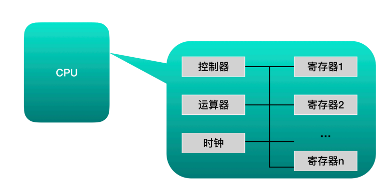

1. **寄存器**：**用于暂存指令、数据和地址**，可以看做内存的一种，一个CPU内部会有20-100个寄存器
2. **控制器**：负责把内存上的指令、数据读入寄存器，并根据指令的结果控制计算机
3. **运算器**：负责运算从内存中读入寄存器的数据
4. **时钟**：负责发出CPU开始计时的时钟信号


主要理解寄存器：

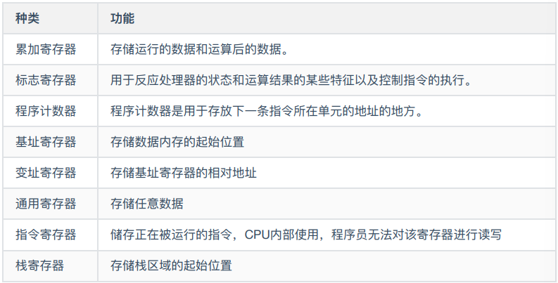

其中**程序计数器（Program Counter，PC）**、**标志寄存器**、**累加寄存器**、**指令寄存器**、**栈寄存器**只有一个

其他寄存器包含多个

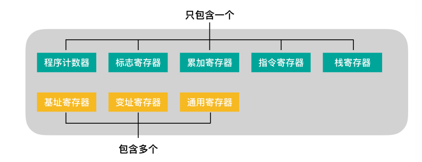


## 二、RAM（随机存取存储器）

**RAM**全称**Random Access Memory** --------------->**随机存取存储器**或**主存（内存）**

RAM是与CPU直接进行数据交换的存储器，可以随时读取，速度非常快，通常作为操作系统和正在运行中的程序的**临时数据存储介质**


## 三、计算机语言

1.低级语言：**机器语言（二进制）**、**汇编语言**

2.高级语言：java、c语言等

高级语言需要**编译**成机器语言才能运行，汇编语言需要经过**汇编器**才能转换为机器语言


## 四、内存

**内存（Memory）**或**主存**是程序与CPU进行沟通的桥梁，用于存放CPU中的运算数据，以及与硬盘等外部存储设备交换的数据。计算机所有的程序的运行都是在内存中进行的。


内存的内部都是由各种IC电路组成的，主要分为三种：

- **随机存储器（RAM）**：可读可写数据，关机时内存中的信息会丢失
- **只读存储器（ROM）**：只能用于数据的读取，关机时数据不会丢失
- **高速缓存（Cache）**：分为一级缓存（L1 Cache）、二级缓存（L2 Cache）、三级缓存（L3 Cache）这些数据，位于内存和CPU之间，是一个读写速度比内存更快的存储器。当 CPU向内存写入数据时也会将这些数据写入高数缓存中。当CPU读取数据是会直接从高速缓存中读取，若高速缓存中没有再从内存中读取。


内存IC（Integrated Circuit，集成电路）：

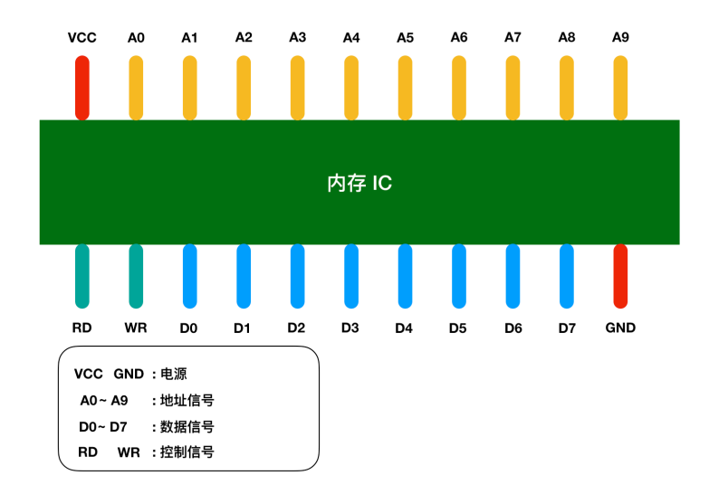

低字节序列：将数据的低位存储在内存低位

高字节序列：将数据的高位存储在内存低位


数据结构：

- 数组
- 栈
- 队列：顺序队列、循环队列（以环状缓冲区（ring buffer）的形式实现）
- 链表
- 二叉树


## 五、二进制

二进制**左移**一位：相当于十进制乘以2,左移后在**低位补0**即可

二进制**右移**：

1. **逻辑右移**：当二进制数的值表示图形模式而非数值时，右移后在高位补0即可
2. **算数右移**：若使用二进制补码表示负数，那么右移后在高位补1；若二进制数表示正数，则右移后在高位补0即可。

左移右移结论：

```txt
左移时，无论是图形还是数值，移位后，只需要将低位补О即可;右移时，需要根据情况判断是逻辑右移还是算数右移。
```


有符号二进制：**最高位代表符号位**，0代表正数，1代表负数

在计算机中只有加法计算，进行减法计算时其实是**加上负数的二进制补码**

二进制补码：**二进制各位全部取反后在加1**

所以负数的二进制表示就是求其补码，**补码的求解过程就是对原始数值的二进制数各位取反，然后将结果＋1**

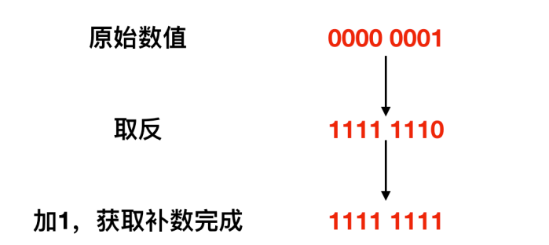


算数：将二进制数表示的信息作为四则运算的数值来处理

算数运算：加减乘除四则运算

逻辑：将二进制数表示的信息处理为单纯的0和1的罗列

逻辑运算：逻辑非（NOT）、逻辑与（AND）、逻辑或（OR）、逻辑异或（XOR）


## 六、压缩算法

文件是**字节数据的集合体**，且文件中的字节数都是**连续存储**的

**无损压缩**：能够无失真地从压缩后的数据重构，准确地还原原始数据。如查分编码、RLE、Huffman编码、LZW编码、算术编码

**有损压缩**：有失真，不能完全准确地恢复原始数据。如预测编码、音感编码、分形压缩、小波压缩、JPEG/MPEG

**对称性**：若**编码和解码算法的复杂性和所需时间差不多**，则为对称的编码方法。多数压缩算法都是对称的。非对称编码一般是编码难而解码容易，如Huffman编码和分形编码，但用于密码学的编码方法则是编码容易解码非常难。

**帧间**、**帧内**：在**视频编码**中会同时用到帧内与帧间的编码方法。

1. 帧内编码：在一帧图像内独立完成的编码方法，如同静态图像的编码，如JPEG
2. 帧间编码：需要参照前后帧才能进行编解码，并在编码时考虑对帧之间的时间冗余进行压缩，如MPEG

**实时性**：

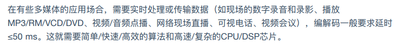

**分级处理**：

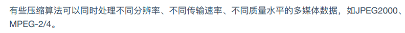


### 1.RLE算法

**RLE**（Run Length Encoding，**行程长度编码**）算法：将文件内容用 **数据*重复次数** 的形式来表示的压缩算法。对连续重复的字节序列压缩效果比较好。

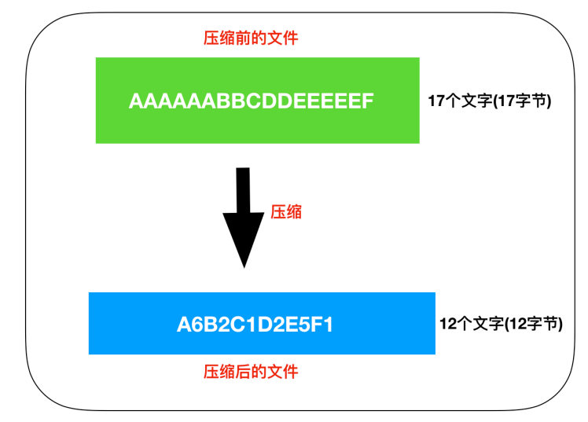

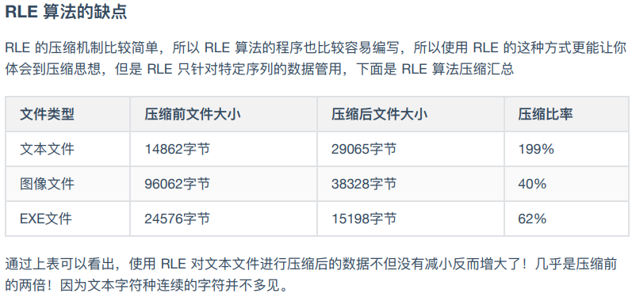


### 2.莫尔斯编码（摩斯密码）

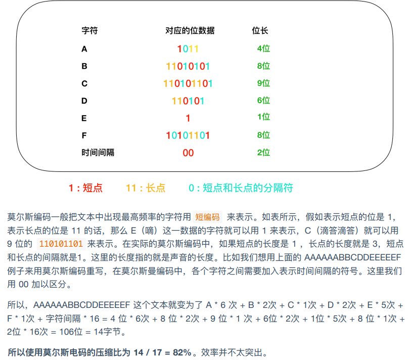

### 3.哈夫曼算法

**哈夫曼算法**：为各压缩文件分别构建最佳的编码体系，并依据该编码体系进行压缩。

使用哈夫曼算法压缩过的文件中，存储着**哈夫曼编码信息**和**压缩过的数据**

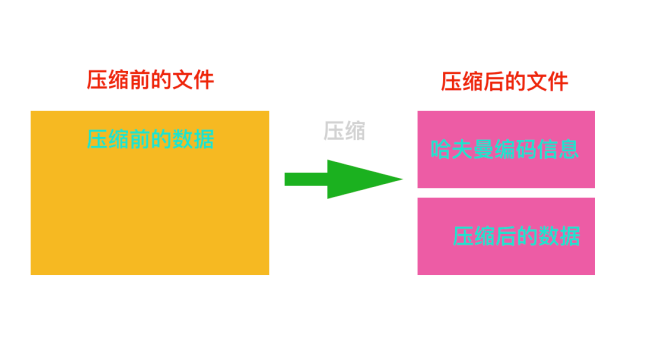

哈夫曼算法中通过借助**哈夫曼树构造编码体系**，即使在不使用字符区分符号的情况下，也可以**构建能够明确进行区分**的编码体系

**哈夫曼树的构造过程**：哈夫曼数是**叶生枝**构造出来的

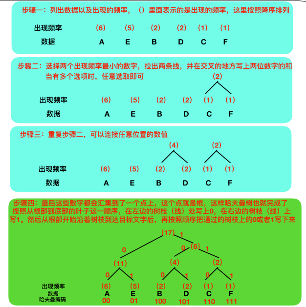

哈夫曼树的**核心就是出现频率越高的数据所占的位数越少**，使用哈夫曼树能够提高压缩比

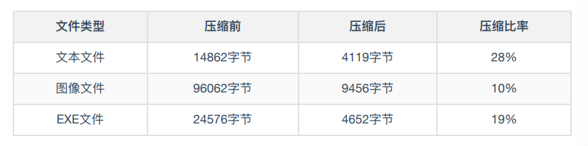

### 4.可逆压缩、非可逆压缩

图像文件的数据格式：

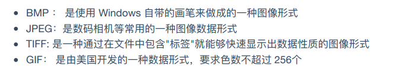

**可逆压缩**：可以还原到压缩前状态的压缩

**非可逆压缩**：无法还原到压缩前状态的压缩

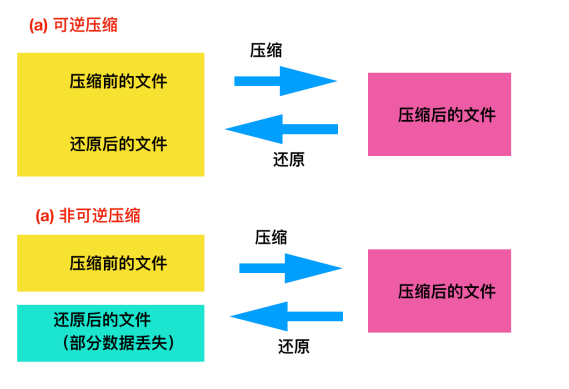

## 七、磁盘

磁盘和内存斗具有存储功能，**磁盘属于外部存储设备**，**内存属于内部存储设备**。

内存是通过**电流**来实现存储，电脑断电后数据会丢失

磁盘是通过**磁记录技术**来实现存储，数据可以长久保留


磁盘中存储的程序必须加载到内存才能运行

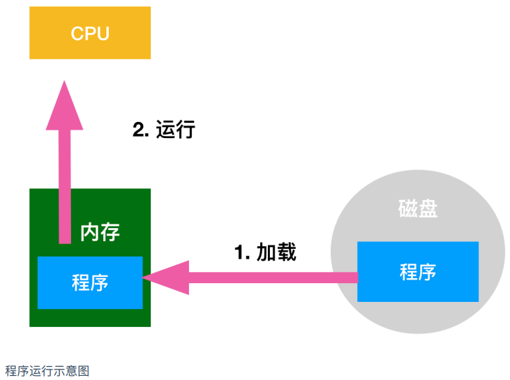


### 1.磁盘缓存技术

**磁盘缓存技术**：把从磁盘中读取的数据存储到内存，磁盘缓存大大改善了磁盘访问的速度

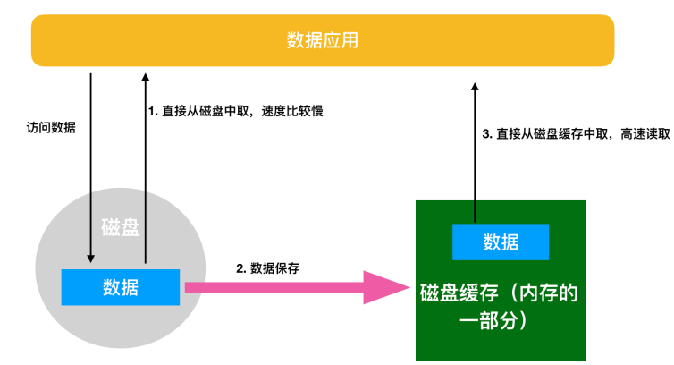


### 2. 虚拟内存

虚拟内存是内存和磁盘交换的第二个媒介。虚拟内存是指把磁盘的一部分作为**假想内存**来使用。这与**磁盘缓存是假想的磁盘**相对，**虚拟内存是假想的内存**。

虚拟内存是计算机系统内存管理的一种技术，它使得应用程序认为它拥有连续可用的内存（一个完整的地址空间），实际上这个应用程序通常被分割成多个物理碎片，还有部分存储在外部磁盘管理器上，必要时进行数据交换。


由于CPU只能执行加载到内存中的程序，因此，虚拟内存的空间就需要和内存中的空间进行**置换（swap）**，然后运行程序


**虚拟内存与内存的交换方式**：

虚拟内存的存储方式有**分页式**和**分段式**两种

Windows采用的分页式虚拟内存，把应用程序按照4kb的页进行切分，以页（page）为单位放到磁盘中，然后进行置换。在分页式中，把磁盘的内容读到内存中称为**Page In**，把内存的内容写入磁盘称为**Page Out**。

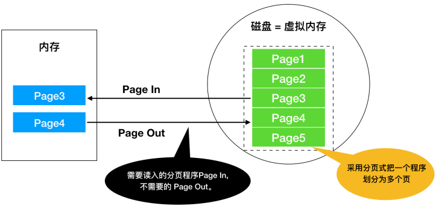


### 3.内存优化

从根本上解决内存不足的方式：

1. 增加内存条的容量（需要花钱）

2. 优化应用程序，使其尽量变小

使用虚拟内存技术无法从根本上解决内存不足的情况，因为在使用虚拟内存进行Page In和Page Out 时通常**伴随着低速的磁盘访问**，这是一种得不偿失的方表现。


**C语言优化应用程序**：

1. **通过DDL文件实现函数共有**

​	**DDL（Dynamic Link Library）**文件，是一种**动态链接库**文件，是程序在运行时可以**动态加载Library（函数和数据集合）**的文件。多个应用程序可以共有同一个DLL文件，通过共有一个DDL文件可以达到节约内存的效果。

**静态链接**（Static Link）会造成资源的浪费

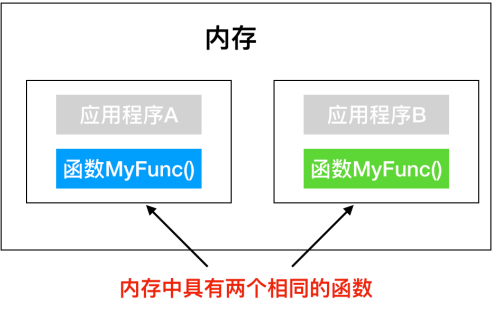

**动态链接**

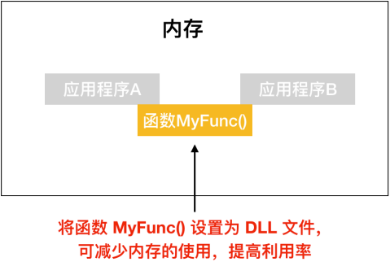

2. **通过调用_stdcall来减少程序文件的大小**

   **_stdcall**（standard call，标准调用）

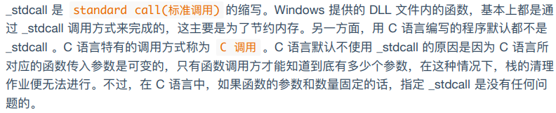

​	C语言与Java最主要的区别之一在于**C语言需要人为控制释放内存空间**

**栈清理工作**：

- 在调用方法处执行清理工作
- 在反复调用方法处执行清理工作（**_stdcall**也称为**反复调用方法**，使用的就是这种栈清理方式）

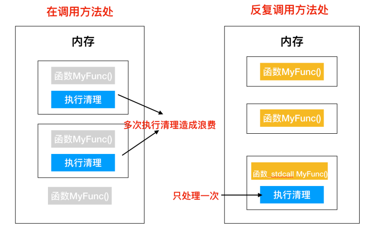


### 4. 磁盘物理结构

磁盘是将其物理表面划分成为多个空间来使用的，有**可变长划分方式**和**扇区划分方式**，可变长方式是将物理结构划分成长度可变的空间；扇区方式如下图所示，Windows所使用的的硬盘和软盘都是使用扇区这种方式。

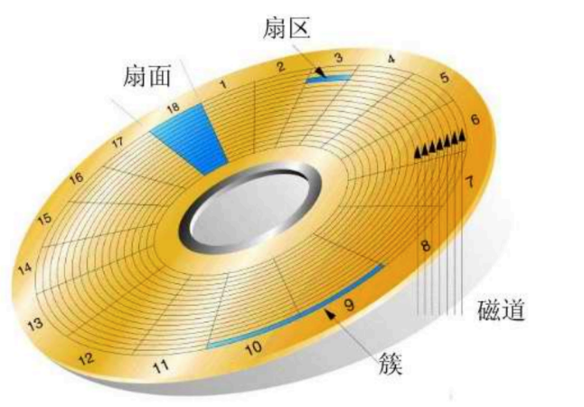

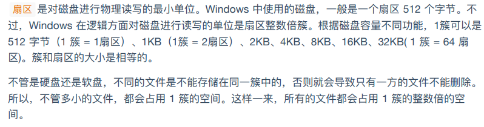


## 八、操作系统环境

**运行环境=操作系统+硬件**

**操作系统**：如：Windows、Linux、unix

**处理器（CPU）**：计算机算力，每秒钟能处理的指令数

**显卡**：承担图形输出的任务，也称为图形处理器（GPU，Graphic Processing Unit）

**内存**

**存储空间**


CPU只能解释其自身固有的语言，不同的CPU能解释的机器语言的种类也是不同的。

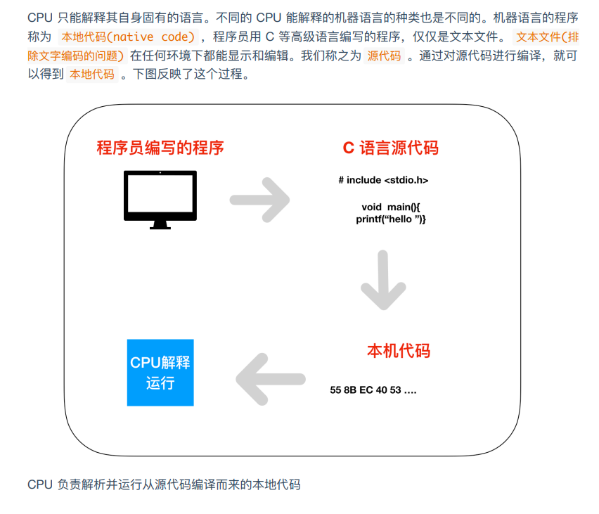


1. Windows操作系统克服了CPU以外的硬件差异

   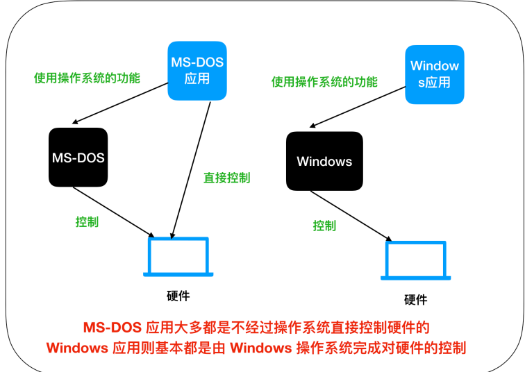


**FTP（File Transfer Protocol）是连接到互联网上的计算机之间的传送文件的协议。**


## 九、BIOS和引导

**BIOS（Basic Input/Output System）**，BIOS存储在ROM中，是预先内置在计算机主机内部的程序。BIOS除了键盘、磁盘和显卡等基本控制外，还有**引导程序**的功能。引导程序是存储在启动驱动启示区域的小程序。

**引导程序**的功能时把在硬盘等记录的OS加载到内存，OS无法自己启动自己，而是通过引导程序启动的。


## 十、操作系统

操作系统是多个程序的集合体

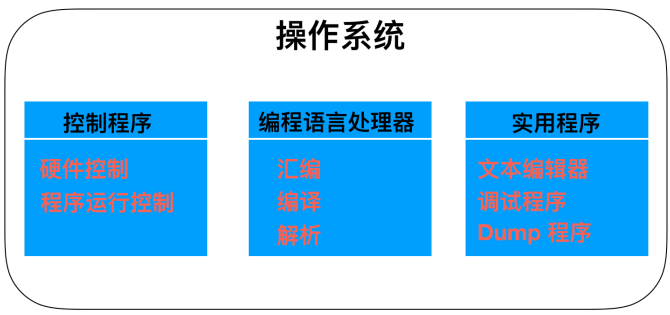

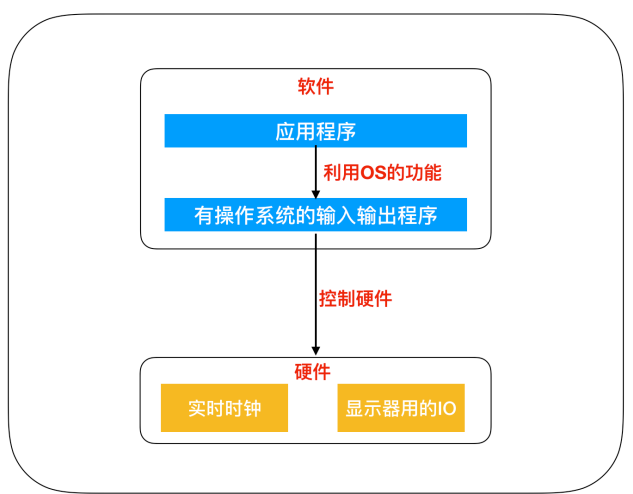


系统调用：调用能够**控制计算机硬件功能**的函数

高级语言的机制就是使用独自的函数名，然后在编译的时候将其转换为系统调用的方式。也就是说，**高级语言编写的应用在编译后，就转换成了利用系统调用的本地代码**。

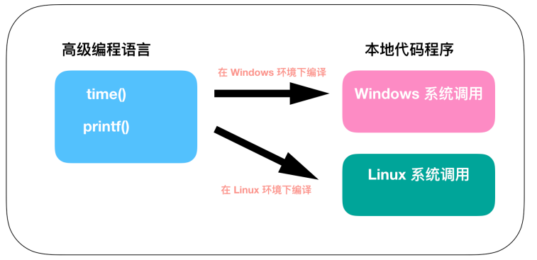