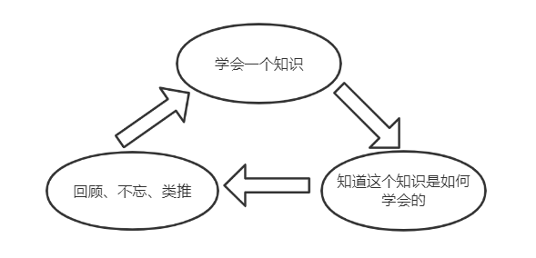

# 如何学习

1. 费曼的终极学习方法（读书法）是什么？

   ```txt
   “你从头开始开始读，尽量一致往下读，直到你一窍不通时，再从头开始读，这样坚持往下读直到完全读懂为止”    ——费曼
   学习之前需要明白一个事实：学习是很难的，别想着在学习上急于求成。
   ```

2. 高效学习的核心算法是什么?

   ```txt
   下图是掌握任何知识和技能的核心思维模型
   ```

   

3. 学习效率低下的根本原因是什么？

   ```txt
   是因为低估了事情的难度，学习比建大楼还难，要百分之百扎扎实实的掌握所学，若想急速前进，必须高频回顾。缓慢的精细加工，是高效的必经之路。
   
   少则得，多则惑。	——道德经
   
   我们学习效能太低
   1. 因为我们太聪明了，以为自己一口气能学到很多东西；
   2. 我们太傲慢了，以为学到一点东西是很容易的事情；
   3. 我们太盲目了，无视世界上最伟大的头脑，以为自己比他们更厉害。
   所以我们一次次陷入视为混乱、学业挣扎、甚至人生危机。
   ```

4. 人如何才能对自己变得富有坚信不疑？

   ```
   “I aways knew I was going to be rich.I don't think I ever doubted it for a minute.”		——Warren Buffett
   我一直认为我会变的富有。对此，我从未怀疑过哪怕一分钟。  ——巴菲特
   
   已知每年复合增长50%(在原有基础上增加50%)，20年后财富会增加3325倍（1.5^20）
   ```

5. 暴力突破学习（考试）的核心思维程序

   ```txt
   1. 第一章第一节接近满分（趋近100%）
   2. 第一章第二节满分（趋近100%）
   3. 综合复习满分（趋近100%）
   4. 依此类推
   
   循序渐进=快进=熟练=熟能生巧=上瘾=跃迁
   ```

6. 学习的本质

   ```txt
   学习=模仿+刻意练习
   ```

   

