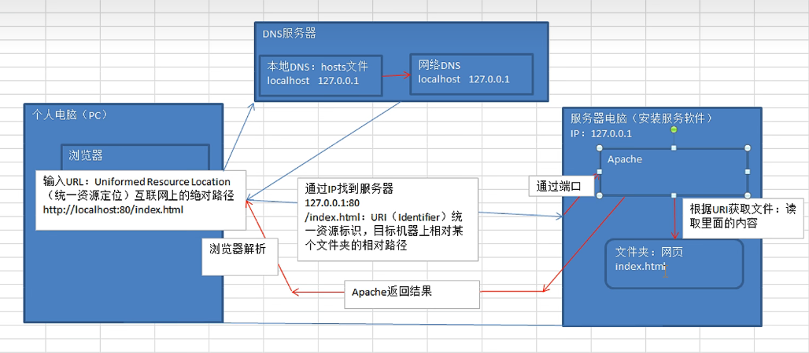
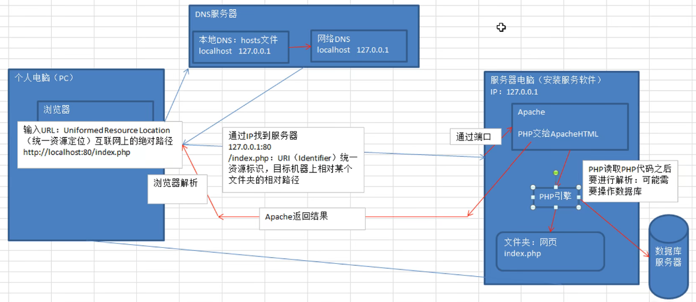

# PHP 学习记录

## 一、静态网站（web1.0）

1. 静态网站每一个网页都是一个文件
2. 内容相对稳定，容易被搜索引擎检索
3. 没有数据库的支持，制作工作量比较大
4. 交互性差

个人理解：静态网站需要对每个不同的内容进行网页制作

## 二、动态网站（web2.0）

1. 交互性：网页汇根据用户的要求和选择动态的改变和响应
2. 自动更新，节省大量工作量
3. 因时因人而变

个人理解：动态网站搭载了数据库，通过对不同内容（数据）进行传输，达到一种动态效果

## 三、服务器

服务器==伺服器==（高性能的）通用计算机==能够提供服务的机器（通过服务软件提供服务）

服务器分类：文件服务器、数据库服务器、应用程序服务器、web服务器...

web服务软件：Apache、Tomcat、IIS....

个人理解：每一台计算机都可以成为服务器，但需要通过服务软件来提供服务

## 四、IP（Internet Protocol）

IP：网络互联协议，通过该协议可以实现计算机之间的准确网络通信

IP地址具有唯一性（一个网卡一个IP）

## 五、域名

例：www.baidu.com

目的：便于记忆服务器的地址

例：IP：127.0.0.1    域名：localhost

## 六、DNS （domain name system 域名解析）

通过域名最终得到对于的IP地址的过程叫做域名解析

域名==》IP地址

- 本地DNS：本地的hosts文件

- 网路DNS

解析式先通过本地DNS解析，本地DNS无法解析时再通过网络DNS解析


## 七、 端口（port）

分类：物理端口、虚拟端口

通过端口可以访问到服务器上端口对应的应用服务

## 八、URL（uniformed resource location 统一资源定位）

URL==互联网上的绝对路径

## 九、 URI（uniformed resource identifier 统一资源标识）

例：/index.html    根目录下的index.html文件

URI：目标机器上相对某个文件夹的相对路径

## 十、 网站访问流程

1. 静态网站访问



2. 动态网站访问



## 十一、PHP 基础

### 引用变量

- 使用 `&` 对变量进行引用，取变量地址
- 当多个普通变量指向一个内存空间时，若某个变量修改了值，则会重新开辟一个空间，此时两个变量指向不同内存空间；
- 引用变量则相反，只会对通一块内存空间进行修改，不会重新开辟空间；对象本身也是引用传递

- unset 只会取消引用，不会删除内存空间

### 常量及数据类型

- 字符串定义方式

    1. 单引号

        - 不能解析变量
        - 不能解析转义字符
        - 变量与变量、变量与字符串、字符串与字符串之间可以用`.`连接

    2. 双引号

        - 可以解析变量，使用`{}`传入变量
        - 可以解析转义字符
        - 可以用`.`连接

    3. Heredoc 与 Newdoc，用于处理大文本

        - Heredoc 类似于双引号

          ```php
          $str = <<< EOT
              //在里面定义的字符串与使用双引号相同
          
          EOT
          ```

        - Newdoc 类似于单引号

          ```php
          $str = <<< 'EOT'
              //在里面定义的字符串与使用单引号相同
          
          EOT
          ```

- 单引号效率 > 双引号

- 数据类型

    - 三大数据类型

        - 标量：浮点、整形、字符串、bool
        - 符合：数组、对象
        - 特殊：null、resource

    - 浮点类型

        - 不能用于比较运算（不能精确比较相等 `==`）

    - 布尔类型

        - false 的情况：`0`、`0.0`、`''`、`'0'`、`false`、`array()`、`NULL`

    - 数组类型

        - 超全局数组：`$GLOBALS`、`$_GET`、`$_POST`、`$_REQUEST`、`$_SESSION`、`$_COOKIE`、`$_SERVER`、`$_FILES`、`$_ENV`

        - `$GLOBALS` 包含后面所有数组信息的数组

        - `$_REQUEST`包含`$_GET`、`$_POST`、`$_COOKIE`

            - `$_REQUEST`尽量少用，安全性低

        - `$_SERVER`

            - `$_SERVER['SERVER_ADDR']`：服务器 IP 地址

            - `$_SERVER['SERVER_NAME']`：服务器名称

            - `$_SERVER['REQUEST_TIME']`：请求时间

            - `$_SERVER['QUERY_STRING']`：请求路径 `?`后面的请求参数 ，可为 null

            - `$_SERVER['HTTP_REFERER']`：上级请求页面，请求源，可为 null

            - `$_SERVER['HTTP_USER_AGENT']`：请求头中的`HTTP_USER_AGENT`信息

            - `$_SERVER['REMOTE_ADDR']`：客户端 IP 地址

            - `$_SERVER['REUEST_URI']`：请求 index.php，则`REUEST_URI`为 /index.php

            - `$_SERVER['PATH_INFO']`：处理路由

              ```txt
              https://morningfast.com/index/join/index/id/137
              的 PATH_INFO 为
              join/index/id/137
              ```

    - NULL

        - 可直接赋值变量为 null
        - 未定义的变量为 null
        - unset 销毁的变量为 null

    - 常量

        - 定义：const、define

        - const 更快，是语言结构；define 是函数

        - const 可以定义类的常量，define 不能定义类的常量

        - 常量一经定义，不能被修改或删除

        - 系统预定义常量

            - `_FILE_`：文件的路径名和文件的名称

            - `_LINE_`：当前所在行号

            - `_DIR_`：当前所在目录

            - `_FUNCTION_`：当前所在函数名称

            - `_CLASS_`：当前所在类的类名

            - `_TRAIT_`：当前的 trait 名称

              有点类似于抽取出去的公共代码，里面可以定义一些多个对象可以共同使用的方法

            - `_METHOD_`：当前所在的类名+方法名

            - `_NAMESPACE_`：当前所在的 namespace 名称

### 运算符

- `@`：错误控制符
    - 放在表达式前面，可以忽略掉表达式可能的产生的所有错误
- 运算符的优先级
    - 递增(`++`)、递减(`--`) > `!`> 算数运算符(`*` `/` `%`) > 大小比较 (`<` `<=` `>` `>=`) >等于比较(`==` `!=` `===` `!==` `<>` `<=>`) > 引用(`&`) > 位运算符（`^`） > 位运算符（`|`）> 逻辑与(`&&`) > 逻辑或(`||`) >三目(`? :`) > 赋值(`=` `+=` `-=` `*=` `**=` `/=` `.=` `%=` `&=` `|=` `^=` `<<=` `>>=` `??=`) > `and` > `xor `> `or`
    - 可以使用 `()`提高代码可读性
- 递增递减
    - 不影响布尔值
    - 递增 null 为 1，递减 null 没有效果
- 逻辑运算
    - 短路作用（`&&`、`||`）

### 流程控制

- for
    - 变量索引数组
- foreach
    - 可以遍历索引数组和关联数组
    - 会 reset()，会重头开始遍历
- while、list()、each()
    - 可以遍历索引数组和关联数组
    - 不会 reset()，从当前指针指向的元素开始遍历
- if elseif else
    - 多个elseif块是排斥关系，只执行一个
- switch case break
    - 控制表达式的类型只能是 int 、float、string
    - continue 在 switch 中等价于 break；continue 2可以跳出 switch 外的循环

### 函数

- static 静态变量
    - 仅在局部函数域中存在，程序执行离开次作用域后，其值不会消失
    - 仅初始化一次，且初始化时需要赋值
    - 可以用于记录函数的调用次数，在满足条件的时候对函数进行终止递归
- 变量的作用域
    - 使用 global 关键字在函数中使用全局变量，也可以使用`$GLOBALS`数组获取全局变量
- 函数参数
    - 值传递
        - 无法修改传递的外部的变量的值
    - 引用传递（&）
        - 可以修改传递的外部的变量的值

### 正则表达式

- 正则表达式的作用：分割、查找、匹配、替换字符串

- 分隔符：`/`、`#` hash符号、`~` 取反符号

- 通用原子：

    - `\d`（0-9）、`\D`（除了0-9）
    - `\w`（数字、字母下划线）、`\W`（除了数字、字母下划线）
    - `\s`（空白符）、`\S`（非空）

- 元字符

    - `.`：匹配除换行符(`\n`)之外的任意字符
    - `*`：匹配前面内容出现0次、一次或多次
    - `?`：匹配前面内容出现0次、一次
    - `+`：匹配前面内容出现一次或多次
    - `{n}`：匹配前面内容出现 n 次
    - `{n,}`：匹配前面内容出现大于等于 n 次
    - `{n,m}`：匹配前面内容出现大于等于 n 次，小于等于 m 次
    - `[]`：匹配 `[]` 里面的内容
    - `[^]`：匹配 `[]` 里面的内容的取反
    - `[-]`：匹配在某个范围的内容
    - `()`：匹配 `()` 整体的内容
    - `^`：必须以某个字符开头
    - `$`：必须以某个字符结尾

- 模式修正符

    - `i`：不区分大小写
    - `m`：多行匹配
    - `e`：php 7.0 移除
    - `s`：使`.`中包含`\n`
    - `U`：取消模式的贪婪模式
    - `x`：忽略模式的空白符
    - `A`：
    - `D`：修正 `$` 对 `\n` 的忽略
    - `u`：对 utf-8 中文的匹配

- 后向引用

    - 使用小括号指定一个子表达式后，匹配这个子表达式的文本

    - 使用 `\1`拿到括号中匹配的内容

      ```php
      $str = '<b>abc</b>'
      $pattern = '/<b>(.*)</b>/'
      preg_replace($pattern,'\\1',$str)
      ```

- 贪婪模式

    - 使整个表达式能得到匹配的前提下，匹配尽可能多的字符

    - 使用`.*?`取消贪婪模式或者使用`U`取消模式的贪婪

      ```php
      //匹配多个<b></b>的内容
      $str = '<b>abc</b><b>abc</b>'
      $pattern = '/<b>.*?</b>/' 
      $pattern1 = '/<b>.*</b>/U' 
      ```

- 正则表达式 PCRE 函数

    - `preg_replace`
    - `preg_match`
    - `preg_match_all`
    - `preg_split`

- 中文匹配

    - UTF-8字符编码范围
        - 0x4e00 - 0x9fa5
    - ANSI(GB2321)字符编码范围
        - 0xb0 - 0xf7
        - 0xa1 - 0xfe

  ```php
  $str = '中文字符';
  // utf-8 中文字符匹配
  $pattern = '/[\x{4e00}-\x{9fa5}]+/u';
  //gbk 中文字符匹配
  $pattern1 = '/['.chr(0xb0).'-'.chr(0xf7).']['.chr(0xa1).'-'.chr(0xfe).']+/';
  
  preg_match($pattern,$str,$match)
  ```

### 会话控制

- 为什么要使用会话控制技术
    - 由于 http 是无状态协议，http 协议无法维护客户端与服务器之间的状态，因此会导致同一个用户请求请求相同页面两次（2个http请求）时，http 协议会认为这两次请求分别为两个独立的请求，例如在用户登录过后，再次发送请求，http不会认为用户之前进行了登录，无法保持用户的登录状态
    - 会话控制技术就是为了解决该问题，从而允许服务器跟踪统一个客户端发送的连续请求，保证用户的登录状态
- 通过请求参数进行传递用户登录信息
    - 问题：
        - 用户信息暴露在请求参数中，不安全
        - 请求参数可能会丢失
- cookie 技术
    - 存储在客户端的一些用户信息
    - 操作：
        - 客户端访问服务器后，服务器往 cookie 中写入用户信息
        - 客户端发送下一次请求携带上 cookie 中的用户信息，服务器读取 cookie 信息从而保证会话的连接
    - 优缺点
        - 信息存储在客户端，不会占用服务器资源
        - 信息存储在客户端，可能会泄露敏感信息，导致不安全
        - 用户可以禁用 cookie
- session 技术
    - 将用户信息存储在服务端，只返回 sessionid 并存储在cookie 中
    - session 是基于 cookie 的
    - 操作
        - 客户端访问服务器后，服务器往 session 中写入用户信息，并返回一个 sessionid 给客户端，该 sessionid 会存储在客户端的 cookie 中
        - 客户端发送下一次请求携带上 cookie 中的 sessionid，服务器通过 sessionid 读取 session 中的用户信息从而保证会话的连接
    - 优缺点
        - 信息存储在客户端，保证用户信息安全
        - 信息存储在客户端，会占用服务器资源
        - 会有分布式 session 共享问题（使用 Redis 存储用户信息解决）
    - 若客户端禁用禁用 cookie，如何传递 sessionid
        - 可以通过请求参数传递 sessionid

## 十二、面向对象

### 类权限控制修饰符

- public
    - 子类、类内部、类外部使用
- protected
    - 子类、类内部使用
- private
    - 只能类内部使用，不允许继承

### PHP是单继承

- 子类只能继承一个父类

- 方法重写
    - 子类继承父类，在子类中可以定义与父类同名方法并进行重写
    - 重写方法时，可以使用`parent::xxx()`继承父类同名方法

### 抽象类

- abstract 关键字
- 类中有抽象方法，则类中必须要定义为抽象类
- 继承一个抽象类的时候，子类必须定义父类中的所有抽象方法

### 接口

- interface 关键字
- 子类使用 `implements` 实现接口所有方法
- 接口中方法都为 public

### 设计模式

- 工厂模式
- 单例模式
- 注册器模式
- 适配器模式
- 观察者模式
- 策略模式

### 构造函数和析构函数

```php
__construct(mixed ...$values = ""): void
__destruct(): void
```

## 十三、网络协议

- HTTP1.1状态码
    - 五大类
        - 1xx：信息类状态码，表示请求正在处理
        - 2xx：success，请求正常处理完毕
            - 200：ok，正常处理
            - 204：服务器正常处理，但是在响应信息中不含实体的主体部分
            - 206：
        - 3xx：redirection，请求重定向，需要附加操作完成请求
            - 301：永久性重定向
            - 302：
            - 303：
        - 4xx：clienterror，客户端错误，服务器无法处理请求
            - 400：badrequest，请求报文中存在语法错误，需修改请求内容后再次发送请求
            - 401：发送的请求需要有http认证的认证信息
            - 403：forbidden，请求访问的资源被服务器拒绝
            - 404：notfound，服务器无法找到请求的资源
        - 5xx：servererror，服务器错误，服务器处理请求时发生错误
            - 500：服务器在执行时发生的错误
            - 503：服务器暂时处于超负载，或者正在进行停机维护无法处理请求
- OSI 七层模型
    - 物理层
        - 建立、维护、断开物理连接
    - 数据链路层
        - 建立逻辑连接、进行硬件地址寻址、差错校验等功能
    - 网络层
        - 进行逻辑地址寻址，实现不同网络间的路径选择
    - 传输层
        - 定义传输数据的协议端口号，以及流控和差错校验
        - 协议：tcp、udp
        - 数据包一旦离开网卡即进入网络传输层
    - 会话层
        - 建立、管理、终止会话
    - 表示层
        - 数据的表示、安全、压缩
    - 应用层
        - 网络服务于最终用户的一个接口
        - 协议：http、ftp、tftp、smtp、dns、telnet、https、pop3、dhcp
- HTTP协议的工作特点和工作原理
    - 工作特点
        - 基于B/S模式
        - 通信开销小、简单快速、传输成本低
        - 使用灵活、可使用超文本传输协议
        - 节省传输时间
        - 无状态
    - 工作原理
        - 客户端发送请求给服务器，创建一个tcp连接，指定端口号，默认80端口，连接到服务器
        - 服务器监听浏览器请求，一旦监听到客户端请求，分析请求类型后，服务器会向客户端返回状态信息和数据内容
- HTTP协议常见请求、响应头和请求方法
    - 请求头、响应头
        - Content-Type：与请求的与实体对应的mime信息
        - Accept：指定客户端能接受的内容、类型
        - Origin：最初的请求来源于哪，主要用于 post 请求
        - Cookie：http请求发送给服务端的cookie的值
        - Cache-Control：指定请求和响应的缓存机制
        - User-Agent：用户信息
        - Referrer：上级请求路径
        - X-Forwarded-For：请求端真实的 IP，做代理的时候可以使用
        - Access-Control-Allow-Origin：允许特定的域名进行访问，通常用于解决跨域
        - Last-Modified：请求资源的最后响应时间
    - 请求方法
        - GET：向服务器发送指定资源的请求，用于数据的读取，幂等的方法
        - POST：提交数据，非幂等的方法，会创建新的资源和修改资源
        - HEAD：向服务器发送指定资源的请求，服务器不会回传资源的内容，只会回传 head 信息
        - OPTIONS：与 HEAD 类似，一般用于查看服务器性能，可以测试服务器功能是否正常
        - PUT：会向指定资源位置上上传最新的内容，是幂等的方法，客户端可以将指定资源的最新数据传送给服务器，取代指定资源的内容，通常修改用 put
        - DELETE：请求服务器删除请求的 uri 所指定的资源，也是幂等的
        - TRACE：请求服务器回显其收到的请求信息，该方法主要用于http请求的测试
    - GET 和 POST 的区别
        - 在做后退或刷新时，GET 方法没啥变化，POST 则会被重新提交
        - GET 可以收藏为书签，而POST不能收藏为书签
        - GET 可以被浏览器缓存，而POST不能被缓存
        - GET 请求时编码类型是 application/x-www-form-urlencoded，POST 除了这种编码类型还有 multipart/form-data 等多种编码类型
        - GET在历史记录中参数会保存在浏览器的历史记录当中，而 POST 不会
        - GET因为参数会放在url中，请求的数据长度是有限制的，POST 请求是没有的长度限制，请求数据是放在body中
        - 允许的数据类型也不同，GET 只允许 ASCII 字符，POST 可以允许多种数据类型
        - GET 安全性差，请求参数会显示在url上，POST 安全性高，因为参数不会保存在浏览器历史
- HTTPS协议的工作原理
    - HTTPS 是基于SSL/TLS的HTTP协议，所有的HTTP数据都是在SSL/TLS协议封装上进行传输的
    - HTTPS 协议在 HTTP 的基础上，添加了SSL/TLS握手以及数据加密传输，也属于应用层协议
- 常见网络协议含义及端口
    - ftp：文件传输协议，默认端口21
    - smtp：定义了简单邮件传输协议，端口25
    - dns：用于域名解析，端口53
    - telnet：是用于一种远程登录的一种端口，用户可以以自己的身份远程连接到计算机上，端口为23
    - pop3：与smtp对应，用于接收邮件，端口110

## 十四、MySql

### 基础

- 数据类型
    - 整形类型
        - TINYINT、SMALLINT、MEDIUMINT、INT、BIGINT
        - 属性：UNSIGNED
        - 可以为整数类型指定宽度，例如 INT(11)，对大多数应用是没有意义的，不会限制值的合法范围，只会影响显示字符的个数
        - 可以指定属性 `zerofill`,则`int(3)`类型存储数据1，则会变成001
    - 实数类型
        - float、double、decimal
        - decimal 可存储比 bigint 还大的整数；可用于存储精确的小数
        - float 和 double 类型支持使用标准的浮点进行近似计算
    - 字符串类型
        - varchar、
            - varchar 用于存储可变长类字符串，它比定长类型更节省空间
            - varchar 使用1个或2个额外字节记录字符串长度。列长度小于 255 字节则使用1个字节表示，否则使用2个字节
            - varchar 长度，如果存储内容超出指定长度，会被截断
        - char
            - char 是定长的，根据定义的字符串长度分配足够的空间
            - char 会根据需要采用空格进行填充以方便比较
            - char 适合存储很短的字符串，或者所有值都接近同一个长度
            - char 长度，超出设定的长度，会被截断
            - 对于经常变更的数据，char比varchar更好，char不容易产生碎片
            - 对于非常短的列，char 比 varchar在存储空间上更有效率，
            - 只分配真正需要的空间，更长的列会消耗更多的空间
        - text（用于存储大文本）、blob
            - 尽量避免使用 blob、text 类型，查询会使用临时表，导致严重的性能开销
    - 枚举
        - 有时可以使用枚举代替常用的字符串类型
        - 把不重复的集合存储成一个预定的集合，比如：性别
        - 非常紧凑，吧列表压缩成一个或两个字节
        - 内部存储的是整数
        - 尽量避免使用数字作为 enum 枚举的常量，易混乱
        - 排序是按照内部存储的整数进行排序
        - 枚举表会使表大小大大减少
    - 日期和时间类型
        - 尽量使用 timestamp，比datetime 空间效率高
        - 用整数保存时间戳的格式通常不方便处理
        - 如果需要存储微秒，可以使用 bigint 存储；通过 微秒*10的n次方 储存微秒数据
- 列属性
    - auto_increment
    - default
    - not null
    - zerofill
- mysql 的常见操作
    - 连接和关闭
        - mysql -u -p -h -P
        - -u：指定用户名
        - -p：指定密码
        - -h：指定主机
        - -P：指定端口
    - \G：表示答应结果可以垂直显示
    - \c：取消当前mysql 的命令
    - \q：退出mysql
    - \s：显示mysql服务器状态
    - \h：帮助信息
    - \d：改变结尾的结束符，例如把`;`改掉
- mysql 数据表引擎
    - InnoDB
        - 默认事务引擎，最重要的最广泛的存储引擎，性能非常优秀
        - 数据存储在共享表空间，可以通过配置分开
        - 对主键查询性能的性能高于其他类型的存储引擎
        - 内部做了很多优化，从磁盘读取数据时自动在内存构建hash索引，插入数据时自动构建插入缓冲区
        - 通过一些机制和工具支持真正的热备份
        - 支持崩溃后的安全恢复
        - 支持行级索
        - 支持外键
    - MyIsam
        - mysql 5.1之前的默认存储引擎
        - 拥有全文索引、压缩、空间函数
        - 不支持事务和行级锁，不支持崩溃后的安全恢复
        - 表存储在两个文件，后缀为 myd（数据） 和 myi（索引） 的文件
        - 设计简单，某些场景下性能很好
    - 其他存储引擎
        - archive
        - blackhole
        - csv
        - memory
    - 优先选择 innodb
- 锁机制
    - 表锁是日常开发中常见的问题，当多个查询同时进行数据修改时，就会产生并发控制的问题
    - 分为共享锁和排他锁，其实就是读锁和写锁
        - 读锁：共享的，不堵塞，多个用户可以同时读一个资源，互不干扰
        - 写锁：牌他的，一个写锁会阻塞其他的写锁和读锁，这样可以允许一个人进行写入，防止其他用户读取正在写入的资源
- 锁粒度
    - 表锁
        - 系统性能开销最小，会锁定整张表，MyIsam使用表锁
    - 行锁
        - 最大程度支持并发处理，但是也带来了最大的锁开销，Innodb使用行级锁
- 事务处理
    - Innodb 引擎支持事务处理
    - 服务器层不管理事务，有下层的引擎实现，所以同一个事务中，使用多种存储引擎不靠谱
    - 在非事务的表（例如MyIsam储存引擎）上执行事务操作MySQL不会发出提醒，也不会报错
- 存储过程
    - 为以后的使用而保存的一条或多条MySQL语句的集合
    - 存储过程就是有业务逻辑和流程的集合
    - 可以在存储过程中创建表、更新数据、删除数据等
    - 使用场景
        - 通过把处理封装在容易使用的单元中，简化复杂的操作
        - 保证数据的一致性
        - 简化对变动的管理
- 触发器
    - 提供给程序员和数据分析员来保证数据完整性的一种方法，它是有表事件相关的特殊的存储过程
    - 使用场景
        - 可以通过数据库中的相关表实现级联更改
        - 实时监控某张表中的某个字段的更改而需要作出相应的处理
        - 某些业务编号的生成等
        - 滥用会造成数据库及应用程序的维护困难
- innodb 和 myisam 的区别
    - innodb 支持行锁，myisam 只支持表锁
    - innodb 支持事务处理，myisam 不支持事务处理
    - innodb 默认使用共享表空间，myisam 不使用共享表空间

### 索引

- 索引
    - 索引类似于书记的目录，通过查看书籍的目录找到对应的页码
    - 存储引擎使用类似的方法进行数据查询，先去索引中找到对应的值，然后根据匹配的所有找到对应的数据行
- 索引对性能的影响
    - 大大减少服务器需要扫描的数据量
    - 帮助服务器避免排序和临时表
    - 将随机IO变成顺序IO
    - 大大提高查询速度
    - 降低写的速度，因为在写操作的时候，mysql 会再次操作一遍索引，导致写性能降低
    - 占用磁盘空间，本质上索引也是数据
- 应用场景
    - 对于非常小的表，大部分情况下全表扫描效率更高
    - 中大型表，索引非常有效
    - 特大型表，建立和使用索引的代价将随之增长，可以使用分区技术解决
- 索引的类型
    - 索引有很多种类型，都是实现在存储引擎层的
    - 普通索引：最基本的索引，没有任何约束限制
    - 唯一索引：与普通索引类似，但是具有唯一性约束
    - 主键索引（聚簇索引）：特殊的唯一索引，不允许有空值
    - 组合索引（联合索引）：将多个列组合在一起创建索引，可以覆盖多个列
    - 外键索引（不常用）：只有innodb的表才可以使用外键索引，保证数据的一致性、完整性和实现级联操作
    - 全文索引（不常用）：只能用于 myisam，并且只对英文进行全文检索
- 主键索引和唯一索引的区别
    - 一个表只能有一个主键索引，可以有多个唯一索引
    - 主键索引一定是唯一索引，唯一索引不一定是主键索引
    - 主键可以与外键构成参照完整性约束，防止数据不一致

- mysql 索引创建原则
    1. 最适合索引的列是出现在 where 子句中的列，或者连接子句的列，而不是出现在 select 关键字后的列
    2. 索引的列基数越大，索引的效果越好
    3. 对字符串进行索引，应该定制一个前缀长度，可以节省大量的索引空间
    4. 根据情况创建复合索引 ，复合索引可以提高查询效率
    5. 避免创建过多的索引，索引会额外占用磁盘空间，降低些操作的效率
    6. 主键尽可能选择较短的数据类型，可以有效减少索引的磁盘占用，提高查询效率
- mysql 索引的注意事项
    1. 复合索引遵循前缀原则（最左匹配原则）
    2. like 查询，% 不能在前，否则索引失效，可以使用全文索引解决 % 在前的问题
    3. column is null 可以使用索引
    4. 若 mysql 估计使用索引比全表扫描更慢，则会放弃使用索引
    5. 如果 or 前的条件中的列有索引，后面没有，索引不会被用到
    6. 列类型是字符串类型，查询时一定要给值加引号，否则索引失效

### mysql 的关联查询

- 六种关联查询
    - 交叉连接（cross join）：笛卡尔积
        - 没有关联条件，查询的数据结果集很大，并无意义
    - 内连接（inner join）
        - 查询多表中符合某种关联条件的数据记录的集合
        - 等值连接
        - 不等值连接
        - 自连接：自己与自己连接
    - 外连接（left join、right join）
        - 左外连接：以左表为主，先查询出左表，按照 on 后的关联条件匹配右表，没有匹配到的用 null 填充
        - 右外连接：以右表为主，先查询出右表，按照 on 后的关联条件匹配左表，没有匹配到的用 null 填充
    - 联合查询（union、union all）
        - 就是把多个结果集集中在一起，union前的结果集为基准，需要注意的是联合查询的列数要相等，相同的记录行会合并
        - 使用 union all 不会合并重复的记录行
    - 全连接（full join）
        - mysql 不支持全连接
        - 可以通过左连接和右连接 union 起来实现全连接

### mysql 查询优化

- 查找分析查询速度慢的原因
    - 开启慢查询日志，记录慢查询日志
        - 分析查询日志，不要直接打开慢查询日志进行分析，可以使用pt-query-digest工具进行分析
    - 使用show profile
        - set profiling = 1 开启，服务器上执行的所有语句会检测消耗的时间，存到临时表中
        - 使用`show profiles`查询临时表
        - 通过 `show profile query 临时表 id`分析某条SQL语句查询速度慢的原因
    - show status
        - `show status`会返回一些计数器
        - `show global status`查看服务器级别的所有计数
        - 有时可以根据这些计数猜测出那些操作代价较高或消耗时间多
    - show processlist
        - 观察是否有大量线程处于不正常的状态或者特征
    - explain（别名desc）
        - `explain SQL语句`分析单条SQL语句
        - `desc SQL语句`分析单条SQL语句
- 优化查询过程中的数据访问
    - 访问数据太多导致查询性能下降，数据量大时尽量不要全表查询
    - 确定应用程序是否在检索大量超过需要的数据，可能是太多行或列
    - 确认mysql服务器是否在分析大量不必要的数据行
    - 避免使用以下SQL
        - 查询太多不需要的数据，可以使用limit
        - 多表关联返回全部列，指定返回需要的列名
        - 总是取出全部列，select * 会让优化器无法完成索引覆盖的扫描优化
        - 重复查询相同的数据，可以缓存数据，下次直接读取缓存
    - 是否在扫描额外的记录
        - 使用explain来分析，如果发现查询需要扫描大量的数据但只是返回少量的行，可以通过以下技巧优化：
            - 使用索引覆盖扫描，把所有的列都放在索引中，这样存储引擎不需要回表获取对应的行就可以返回结果
            - 改变数据库和表的结构，可以适当降低数据表的范式，以空间换时间
            - 重写SQL语句，让优化器可以以更优的方式执行查询
- 优化长难的查询语句
    - 一个复杂查询可以分为多个简单的查询，有时候将一个大的查询分为多个小的查询时很有必要的
    - 切分查询
        - 将一个大的查询分为多个小的相同的查询
            - 例如：可以将一次删除1000万条数据，分为1000次删除一万条数据
    - 分解关联查询
        - 可以将一条关联语句分解成多条SQL来执行
            - 让缓存的效率更高
            - 执行单个查询可以减少锁的竞争
            - 在应用层做关联可以更容易对数据库进行拆分
            - 查询效率大幅提升
            - 较少冗余记录的查询
- 优化特定类型的查询语句
    - 优化`count()`查询
        - `count(*)`会忽略所有的列，直接统计所有列数，因此不要使用`count(列名)`
        - myisam 中，没有任何where条件的`count(*)`非常快，当有where条件时，myisam的count统计不一定比其他表引擎快
        - 可以使用 explain 查询数量的近似值，来替代`count(*)`
        - 增加汇总表，数据量改变时更新汇总表
        - 可以将汇总信息进行缓存
    - 优化关联查询
        - 确定 on 或者 using 子句的列上有索引
        - 确保 group by 和 order by 中只有一个表的列，这样mysql才有可能使用索引
    - 优化子查询
        - 尽量使用关联查询替代
    - 优化 group by 和 distinct
        - 可以使用索引来优化
        - 关联查询中，尽量使用标识列（主键列或者auto_increment 列）进行分组效率会更高
        - 如果不需要order by，进行 group by 时使用order by null，mysql不会再进行文件排序
        - with rollup 超级聚合，可以弄到应用程序进行处理
    - 优化 limit 分页
        - limit 偏移量比较大的时候，查询效率低
        - 可以记录上次查询的最大id，下次查询时直接根据id来查询
    - 优化 union
        - union all效率高于union，因为union会对数据进行去重，可以将去重放在程序中进行

### mysql 高可用