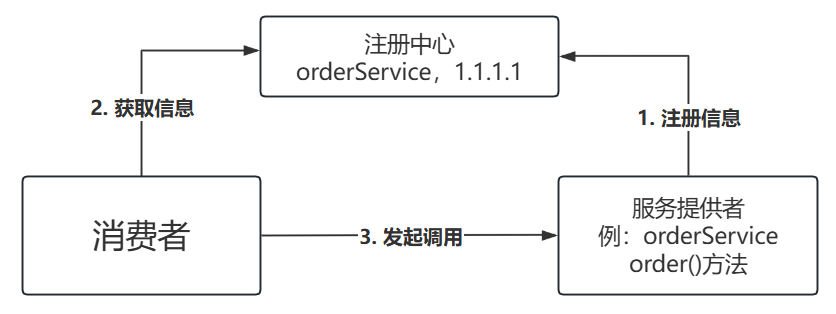
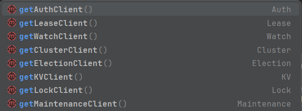
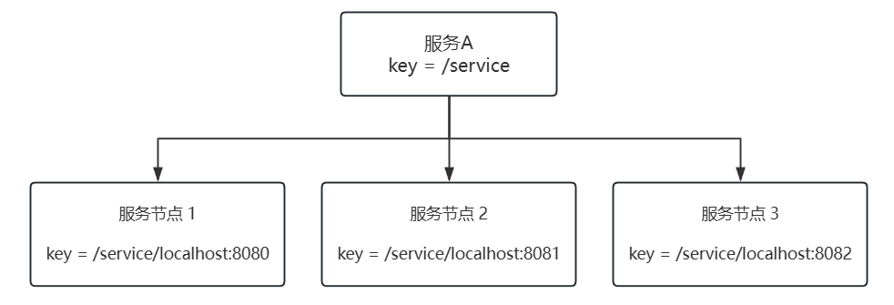
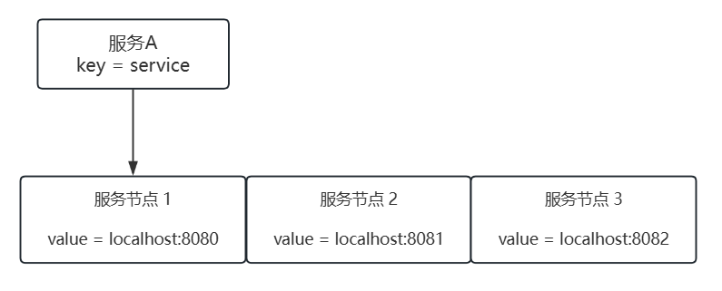
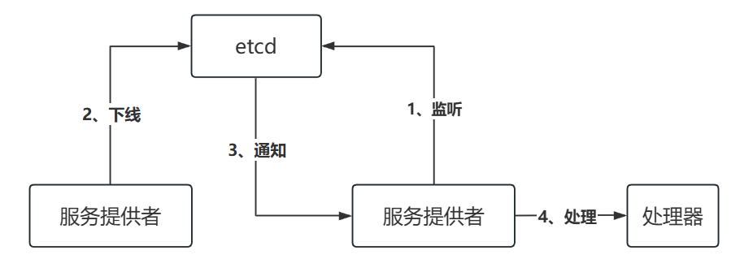

# 注册中心基本实现

## 一、需求分析

- RPC 框架的一个核心模块是注册中心，目的是帮助服务消费者获取到服务提供者的调用地址，而不是将调用地址硬编码到项目中

  


## 二、设计方案
### 注册中心核心能力

- 明确注册中心的几个实现关键(核心能力):
  1. **数据分布式存储**: 集中的注册信息数据存储、读取和共享
  2. **服务注册**: 服务提供者上报服务信息到注册中心
  3. **服务发现**: 服务消费者从注册中心拉取服务信息
  4. **心跳检测**: 定期检查服务提供者的存活状态
  5. **服务注销**: 手动剔除节点、或者自动剔除失效节点
  6. 更多优化点: 比如注册中心本身的容错、服务消费者缓存等


### 技术选型

- 首先需要一个能够集中存储和读取数据的中间件。此外，它还需要有数据过期、数据监听的能力，便于我们移除失效节点、更新节点列表等。
- 此外，对于注册中心的技术选型，还要考虑它的性能、高可用性、高可靠性、稳定性、数据一致性、社区的生态和活跃度等。
  - 注册中心的可用性和可靠性尤其重要，因为一旦注册中心本身都挂了，会影响到所有服务的调用
- 主流的注册中心实现中间件有 `ZooKeeper`、`Redis` 等。在本项目中使用一种更适合存储元信息(注册信息)的云原生中间件 **Etcd**，来实现注册中心。

### Etcd 入门

#### Etcd 介绍

- [etcd](https://github.com/etcd-io/etcd)
- Etcd 是一个 Go 语言实现的、开源的、分布式 的**键值存储系统**，它主要用于分布式系统中的服务发现、配置管理和分布式锁等场景。
  提到 Go 语言实现，有经验的同学应该就能想到，Etcd 的性能是很高的，而且它和云原生有着密切的关系，通常被作为云原生应用的基础设施，存储一些元信息。比如经典的容器管理平台 k8s 就使用了 Etcd 来存储集群配置信息、状态信息、节点信息等

- 除了性能之外，Etcd 采用 **Raft 一致性算法**来保证数据的一致性和可靠性，具有高可用性、强一致性、分布式特性等特点
- 并且 Etcd 还非常简单易用，提供了简单的 API、数据的过期机制、数据的监听和通知机制等，完美满足注册中心的实现诉求
- Etcd 的入门成本是极低的，只要你学过 Redis、ZooKeeper 或者对象存储中的一个，就能够很快理解 Etcd 并投入实战运用


#### Etcd 数据结构与特性

- Etcd 在其数据模型和组织结构上更接近于 ZooKeeper 和对象存储，而不是 Redis。它使用层次化的键值对来存储数据，支持类似于文件系统路径的层次结构，能够很灵活地单 key 查询、按前缀查询、按范围查询

- Etcd 的核心数据结构包括:

  1. **Key(键)**:  Etcd 中的基本数据单元，类似于文件系统中的文件名。每个键都唯一标识一个值，并且可以包含子键，形成类似于路径的层次结构。

  2. **Value(值)**: 与键关联的数据，可以是任意类型的数据，通常是**字符串形式**。

- 可以将数据序列化后写入 value。Etcd 有很多核心特性，其中，应用较多的特性是:
  1. **Lease(租约)**: 用于对键值对进行 TTL 超时设置，即设置键值对的过期时间。当租约过期时，相关的键值对将被自动删除。
  2. **Watch(监听)**: 可以监视特定键的变化，当键的值发生变化时，会触发相应的通知

- 有了这些特性，就能够实现注册中心的服务提供者节点过期和监听了
- 此外，Etcd 的一大优势就是能够保证数据的强一致性

#### Etcd 如何保证数据一致性?

- 从表层来看，Etcd 支持事务操作，能够保证数据一致性。
- 从底层来看，Etcd 使用 **Raft 一致性算法**来保证数据的一致性。
  - Raft 是一种分布式一致性算法，它确保了分布式系统中的所有节点在任何时间点都能达成一致的数据视图。
  - 具体来说，Raft 算法通过选举机制选举出一个领导者(Leader)节点，领导者负责接收客户端的写请求，并将写操作复制到其他节点上。
    - 当客户端发送写请求时，领导者首先将写操作写入自己的日志中，并将写操作的日志条目分发给其他节点，其他节点收到日志后也将其写入自己的日志中。一旦大多数节点(即半数以上的节点)都将该日志条目成功写入到自己的日志中，该日志条目就被视为已提交，领导者会向客户端发送成功响应。在领导者发送成功响应后，该写操作就被视为已提交，从而保证了数据的一致性。
    - 如果领导者节点宕机或失去联系，Raft 算法会在其他节点中 **选举出新的领导者**，从而保证系统的可用性和一致性。新的领导者会继续接收客户端的写请求，并负责将写操作复制到其他节点上，从而保持数据的一致性。
    - 如果主节点挂掉后，剩下为偶数个节点，则会出现平票状况，并没有新的从节点成为主节点，这种现象也称为“脑裂”。


#### Etcd 基本操作

- 和所有数据存储中间件一样，基本操作无非就是: **增删改查**
  - 还有一些其他操作，比如**租约**、**监听**

#### Etcd 安装

- 进入 Etcd 官方的下载页: https://github.com/etcd-io/etcd/releases

  - 也可以在这里下载:https://etcd.io/docs/v3.2/install/
  - 找到自己操作系统的版本执行即可

- 安装 etcd ，[参考](https://github.com/etcd-io/etcd/releases)

  - 虚拟机重启后需要重新安装一下，因为 tmp 目录在 Linux 重启后会删除

    ```bash
    ETCD_VER=v3.5.17
    # Linux 查看变量
    echo $ETCD_VER
    
    # choose either URL
    GOOGLE_URL=https://storage.googleapis.com/etcd
    GITHUB_URL=https://github.com/etcd-io/etcd/releases/download
    DOWNLOAD_URL=${GOOGLE_URL}
    
    rm -f /tmp/etcd-${ETCD_VER}-linux-amd64.tar.gz
    rm -rf /tmp/etcd-download-test && mkdir -p /tmp/etcd-download-test
    
    curl -L ${DOWNLOAD_URL}/${ETCD_VER}/etcd-${ETCD_VER}-linux-amd64.tar.gz -o /tmp/etcd-${ETCD_VER}-linux-amd64.tar.gz
    tar xzvf /tmp/etcd-${ETCD_VER}-linux-amd64.tar.gz -C /tmp/etcd-download-test --strip-components=1
    rm -f /tmp/etcd-${ETCD_VER}-linux-amd64.tar.gz
    
    /tmp/etcd-download-test/etcd --version
    /tmp/etcd-download-test/etcdctl version
    /tmp/etcd-download-test/etcdutl version
    
    # start a local etcd server
    /tmp/etcd-download-test/etcd
    
    # write,read to etcd
    /tmp/etcd-download-test/etcdctl --endpoints=localhost:2379 put foo bar
    /tmp/etcd-download-test/etcdctl --endpoints=localhost:2379 get foo
    ```

    ```bash
    # 开启服务器端口
    firewall-cmd --zone=public --add-port=8889/tcp --permanent
    
    # 重新加载防火墙
    firewall-cmd --reload
    netstat -ntulp |grep 8889
    
    # 启动 etcd
    /tmp/etcd-download-test/etcd --listen-client-urls http://0.0.0.0:2379 --advertise-client-urls http://0.0.0.0:2379 --listen-peer-urls http://0.0.0.0:2380
    
    # 启动 etcdkeeper
    /opt/etcdkeeper-v0.7.8/etcdkeeper -p 8889
    
    # 后台启动
    nohup /tmp/etcd-download-test/etcd --listen-client-urls http://0.0.0.0:2379 --advertise-client-urls http://0.0.0.0:2379 --listen-peer-urls http://0.0.0.0:2380 > /tmp/etcd.log 2>&1 &
    
    nohup /opt/etcdkeeper-v0.7.8/etcdkeeper -p 8889 /opt/etcdkeeper-v0.7.8/etcdkeeper.log 2>&1 &
    
    /tmp/etcd-download-test/etcdctl --endpoints=localhost:2379 put foo bar
    ```

- 安装完成后，会得到3个脚本:

  1. **etcd**: etcd 服务本身
  2. **etcdctl**: 客户端，用于操作 etcd，比如读写数据
  3. **etcdutl**: 备份恢复工具

- 执行 etcd 脚本后，可以启动 etcd 服务，服务默认占用 2379 和 2380 端口，作用分别如下:

  - 2379: 提供 HTTP API 服务，和 etcdctl 交互
  - 2380: 集群中节点间通讯


#### Etcd 可视化工具

- 一般情况下，我们使用数据存储中间件时，一定要有一个可视化工具，能够更直观清晰地管理已经存储的数据。

  - 比如 Redis 的 Redis Desktop Manager.
  - 同样的，Etcd 也有一些可视化工具，比如:
    - [etcdkeeper](https://github.com/evildecay/etcdkeeper/)
    - [kstone](https://github.com/kstone-io/kstone/tree/master/charts)

- 更推荐 etcdkeeper，安装成本更低，学习使用更方便

  - 进入项目的 GitHub，就能看到安装方式，直接按照指引下载、解压、运行脚本即可

  - 安装后，执行命令，可以在指定端口启动可视化界面(默认是 8080 端口)，比如鱼皮在 8889 端口启动

    ```bash
    # 启动 etcdkeeper
    /opt/etcdkeeper-v0.7.8/etcdkeeper -p 8889
    ```

  - 安装后，访问本地 http://127.0.0.1:8889/etcdkeeper/，就能看到可视化页面了


#### Etcd Java 客户端

- 所谓客户端，就是操作 Etcd 的工具
  - etcd 主流的 Java 客户端是 [jetcd](https://github.com/etcd-io/jetcd)
  - 注意，Java 版本必须大于 11
  - 用法非常简单，就像 curator 能够操作 ZooKeeper、jedis 能够操作 Redis 一样


- 首先在项目中引入 jetcd

  ```xml
  <!-- https://mvnrepository.com/artifact/io.etcd/jetcd-core -->
  <dependency>
      <groupId>io.etcd</groupId>
      <artifactId>jetcd-core</artifactId>
      <version>0.7.7</version>
  </dependency>
  ```

- 按照官方文档的示例写 Demo

  ```java
  public class EtcdRegistry {
  
      public static void main(String[] args) throws ExecutionException, InterruptedException {
          // create client using endpoints
          Client client = Client.builder().endpoints("http://localhost:2379")
                  .build();
  
          KV kvClient = client.getKVClient();
          ByteSequence key = ByteSequence.from("test_key".getBytes());
          ByteSequence value = ByteSequence.from("test_value".getBytes());
  
          // put the key-value
          kvClient.put(key, value).get();
  
          // get the CompletableFuture
          CompletableFuture<GetResponse> getFuture = kvClient.get(key);
  
          // get the value from CompletableFuture
          GetResponse response = getFuture.get();
  
          // delete the key
          kvClient.delete(key).get();
      }
  }
  
  ```

  - 在上述代码中，我们使用 `KVClient` 来操作 etcd 写入和读取数据。除了 `KVClient` 客户端外，Etcd 还提供了很多其他客户端

    - 如图

      

      ​	

  - 常用的客户端和作用如下:

    1. `kvClient`: 用于对 etcd 中的键值对进行操作。通过 kvClient 可以进行设置值、获取值、删除值、列出目录等操作。
    2. `leaseClient`: 用于管理 etcd 的租约机制。租约是 etcd 中的一种时间片，用于为键值对分配生存时间，并在租约到期时自动删除相关的键值对。通过 leaseClient 可以创建、获取、续约和撤销租约。
    3. `watchClient`: 用于监视 etcd 中键的变化，并在键的值发生变化时接收通知。

    4. `clusterClient`: 用于与 etcd 集群进行交互，包括添加、移除、列出成员、设置选举、获取集群的健康状态获取成员列表信息等操作。
    5. `authClient`: 用于管理 etcd 的身份验证和授权。通过 authClient 可以添加、删除、列出用户、角色等身份信息，以及授予或撤销用户或角色的权限。
    6. `maintenanceClient`: 用于执行 etcd 的维护操作，如健康检查、数据库备份、成员维护、数据库快照、数据库压缩等。
    7. `lockClient`: 用于实现分布式锁功能，通过 lockClient 可以在 etcd 上创建、获取、释放锁，能够轻松实现并发控制。
    8. `electionClient`: 用于实现分布式选举功能，可以在 etcd 上创建选举、提交选票、监视选举结果等。

- 使用 Debug 执行上述代码，观察 Etcd 的数据结构

  - 发现除了 key 和 value 外，还能看到版本、创建版本、修改版本字段。
    - 这是因为 etcd 中的每个键都有一个与之关联的版本号，用于跟踪键的修改历史。当一个键的值发生变化时，其版本号也会增加。
    - 通过使用 etcd 的 Watch API，可以监视键的变化，并在发生变化时接收通知。这种版本机制使得 etcd 在分布式系统中能够实现乐观并发控制、一致性和可靠性的数据访问


### 设计服务注册信息如何存储在注册中心内

- 存储结构设计的几个要点:

  1. key 如何设计?
  2. value 如何设计?
  3. key 什么时候过期?

- 由于一个服务可能有多个服务提供者(负载均衡)，我们可以有两种结构设计:

  1. 层级结构：将服务理解为文件夹、将服务对应的多个节点理解为文件夹下的文件，那么可以通过服务名称，用前缀查询的方式查询到某个服务的所有节点

     - 键名的规则可以是`/业务前缀/服务名/服务节点地址`:

       

  2. 列表结构。将所有的服务节点以列表的形式整体作为 value

     

- 选择哪种存储结构呢?这个也会跟技术选型有关

  - 对于 ZooKeeper 和 Etcd 这种支持层级查询的中间件，用第一种结构会更清晰
  - 对于 Redis，由于本身就支持列表数据结构，可以选择第二种结构

- 最后，一定要给 key 设置过期时间，比如默认 30 秒过期，这样如果服务提供者宕机了，也可以超时后自动移除

## 三、开发实现

### 1、注册中心开发

- 注册信息定义

  - 在 model 包下新建 `ServiceMetaInfo` 类，封装服务的注册信息，包括服务名称、服务版本号、服务地址(域名和端口号)、服务分组等。

  - 需要给 `ServiceMetaInfo` 增加一些工具方法，用于获取服务注册键名、获取服务注册节点键名等

  - 可以把版本号和分组都放到服务键名中，就可以在查询时根据这些参数获取对应版本和分组的服务了

  - 代码如下:

    ```java
    package com.lhk.kkrpc.model;
    
    import cn.hutool.core.util.StrUtil;
    import lombok.Data;
    
    /**
     * 服务元信息（注册信息）
     */
    @Data
    public class ServiceMetaInfo {
    
    
        /**
         * 服务名称
         */
        private String serviceName;
    
        /**
         * 服务版本号
         */
        private String serviceVersion = "1.0";
    
        /**
         * 服务域名
         */
        private String serviceHost;
    
        /**
         * 服务端口号
         */
        private Integer servicePort;
    
        /**
         * 服务分组（暂未实现）
         */
        private String serviceGroup = "default";
    
        /**
         * 获取服务键名
         *
         * @return
         */
        public String getServiceKey() {
            // 后续可扩展服务分组
            // return String.format("%s:%s:%s", serviceName, serviceVersion, serviceGroup);
            return String.format("%s:%s", serviceName, serviceVersion);
        }
    
        /**
         * 获取服务注册节点键名
         *
         * @return
         */
        public String getServiceNodeKey() {
            return String.format("%s/%s:%s", getServiceKey(), serviceHost, servicePort);
        }
    }
    ```

  - 由于注册信息里包含了服务版本号字段，所以也可以给 `RpcRequest` 对象补充服务版本号字段，可以先作为预留字段，默认值为“1.0”，后续再自行实现

    - 在 `RpcConstant` 常量类中补充默认服务版本常量

      ```java
      package com.lhk.kkrpc.constant;
      
      /**
       * RPC 相关常量
       */
      public interface RpcConstant {
      
          /**
           * 默认配置文件加载前缀
           */
          String DEFAULT_CONFIG_PREFIX = "kkrpc";
      
          /**
           * 默认服务版本
           */
          String DEFAULT_SERVICE_VERSION = "1.0";
      
      }
      ```

  - 在 `RpcRequest` 请求类中使用该常量，代码如下:

    ```java
    package com.lhk.kkrpc.model;
    
    import com.lhk.kkrpc.constant.RpcConstant;
    import lombok.AllArgsConstructor;
    import lombok.Builder;
    import lombok.Data;
    import lombok.NoArgsConstructor;
    
    import java.io.Serializable;
    
    /**
     * RPC 请求
     */
    @Data
    @Builder
    @AllArgsConstructor
    @NoArgsConstructor
    public class RpcRequest implements Serializable {
    
        /**
         * 服务名称
         */
        private String serviceName;
    
        /**
         * 方法名称
         */
        private String methodName;
    
        /**
         * 服务版本
         */
        private String serviceVersion = RpcConstant.DEFAULT_SERVICE_VERSION;
    
    
        /**
         * 参数类型列表
         */
        private Class<?>[] parameterTypes;
    
        /**
         * 参数列表
         */
        private Object[] args;
    
    }
    ```

- 注册中心配置。

  - 在 config 包下编写注册中心配置类 `RegistryConfig` ，让用户配置连接注册中心所需的信息，比如注册中心类别、注册中心地址、用户名、密码、连接超时时间等

    ```java
    package com.lhk.kkrpc.config;
    
    import lombok.Data;
    
    /**
     * RPC 框架注册中心配置
     */
    @Data
    public class RegistryConfig {
    
        /**
         * 注册中心类别
         */
        private String registry = "etcd";
    
        /**
         * 注册中心地址
         */
        private String address = "http://192.168.xxx.xxx:2379";
    
        /**
         * 用户名
         */
        private String username;
    
        /**
         * 密码
         */
        private String password;
    
        /**
         * 超时时间（单位毫秒）
         */
        private Long timeout = 10000L;
    }
    
    ```

  - 还要为 `RpcConfig` 全局配置补充注册中心配置，代码如下:

    ```java
    @Data
    public class RpcConfig {
        ...
        
        /**
         * 注册中心配置
         */
        private RegistryConfig registryConfig = new RegistryConfig();
    }
    ```

- 注册中心接口

  - 遵循可扩展设计，我们先写一个注册中心接口，后续可以实现多种不同的注册中心，并且和序列化器一样，可以使用 SPI 机制动态加载

  - 注册中心接口代码如下，主要是提供了初始化、注册服务、注销服务、服务发现(获取服务节点列表)、服务销毁等方法

    ```java
    package com.lhk.kkrpc.registry;
    
    import com.lhk.kkrpc.config.RegistryConfig;
    import com.lhk.kkrpc.model.ServiceMetaInfo;
    
    import java.util.List;
    
    /**
     * 注册中心接口
     */
    public interface Registry {
    
        /**
         * 初始化
         *
         * @param registryConfig
         */
        void init(RegistryConfig registryConfig);
    
        /**
         * 注册服务（服务端）
         *
         * @param serviceMetaInfo
         */
        void register(ServiceMetaInfo serviceMetaInfo) throws Exception;
    
        /**
         * 注销服务（服务端）
         *
         * @param serviceMetaInfo
         */
        void unRegister(ServiceMetaInfo serviceMetaInfo);
    
        /**
         * 服务发现（获取某服务的所有节点，消费端）
         *
         * @param serviceKey 服务键名
         * @return
         */
        List<ServiceMetaInfo> serviceDiscovery(String serviceKey);
    
        /**
         * 服务销毁
         */
        void destroy();
    }
    
    ```

- Etcd 注册中心实现

  - 在 `registry` 目录下新建 `EtcdRegistry` 类，实现注册中心接口，先完成初始化方法，读取注册中心配置并初始化客户端对象

  - 代码如下:

    ```java
    public class EtcdRegistry implements Registry {
    
        private Client client;
    
        private KV kvClient;
        
        /**
         * 根节点
         */
        private static final String ETCD_ROOT_PATH = "/rpc/";
    
        @Override
        public void init(RegistryConfig registryConfig) {
            client = Client.builder().endpoints(registryConfig.getAddress()).connectTimeout(Duration.ofMillis(registryConfig.getTimeout())).build();
            kvClient = client.getKVClient();
        }
    }
    ```

    - 上述代码中，我们定义 Etcd 键存储的根路径为 /rpc/，为了区分不同的项目。

  - 依次实现不同的方法，首先是服务注册，创建 key并设置过期时间，value 为服务注册信息的 JSON 序列化。

    ```java
    @Override
    public void register(ServiceMetaInfo serviceMetaInfo) throws Exception {
        // 创建 Lease 和 KV 客户端
        Lease leaseClient = client.getLeaseClient();
    
        // 创建一个 30 秒的租约
        long leaseId = leaseClient.grant(30).get().getID();
    
        // 设置要存储的键值对
        String registerKey = ETCD_ROOT_PATH + serviceMetaInfo.getServiceNodeKey();
        ByteSequence key = ByteSequence.from(registerKey, StandardCharsets.UTF_8);
        ByteSequence value = ByteSequence.from(JSONUtil.toJsonStr(serviceMetaInfo), StandardCharsets.UTF_8);
    
        // 将键值对与租约关联起来，并设置过期时间
        PutOption putOption = PutOption.builder().withLeaseId(leaseId).build();
        kvClient.put(key, value, putOption).get();
    }
    ```

  - 然后是服务注销，删除 key

    ```java
    public void unRegister(ServiceMetaInfo serviceMetaInfo) {
        kvClient.delete(ByteSequence.from(ETCD_ROOT_PATH + serviceMetaInfo.getServiceNodeKey(), StandardCharsets.UTF_8));
    }
    ```

  - 然后是服务发现，根据服务名称作为前缀，从Etcd 获取服务下的节点列表

    ```java
    public List<ServiceMetaInfo> serviceDiscovery(String serviceKey) {
        // 前缀搜索，结尾一定要加 '/'
        String searchPrefix = ETCD_ROOT_PATH + serviceKey + "/";
    
        try {
            // 前缀查询
            GetOption getOption = GetOption.builder().isPrefix(true).build();
            List<KeyValue> keyValues = kvClient.get(
                            ByteSequence.from(searchPrefix, StandardCharsets.UTF_8),
                            getOption)
                    .get()
                    .getKvs();
            // 解析服务信息
            return keyValues.stream()
                    .map(keyValue -> {
                        String value = keyValue.getValue().toString(StandardCharsets.UTF_8);
                        return JSONUtil.toBean(value, ServiceMetaInfo.class);
                    })
                    .collect(Collectors.toList());
        } catch (Exception e) {
            throw new RuntimeException("获取服务列表失败", e);
        }
    }
    ```

  - 最后是注册中心销毁，用于项目关闭后释放资源

    ```java
    public void destroy() {
        System.out.println("当前节点下线");
        // 释放资源
        if (kvClient != null) {
            kvClient.close();
        }
        if (client != null) {
            client.close();
        }
    }
    ```


### 2、支持配置和扩展注册中心

- 一个成熟的 RPC 框架可能会支持多个注册中心，像序列化器一样，现在需求是，让开发者能够填写配置来指定使用的注册中心，并且支持自定义注册中心，让框架更易用、更利于扩展。

- 要实现这点，开发方式和序列化器也是一样的，都可以使用工厂创建对象、使用 SPI 动态加载自定义的注册中心

- 注册中心常量

  - 在 registry 包下新建 `RegistryKeys` 类，列举所有支持的注册中心键名

    ```java
    package com.lhk.kkrpc.registry;
    
    /**
     * 支持的注册中心键名常量
     */
    public interface RegistryKeys {
    
        String ETCD = "etcd";
    
        String ZOOKEEPER = "zookeeper";
    
    }
    
    ```

- 使用工厂模式，支持根据 key 从 SPI 获取注册中心对象实例

  - 在 registry 包下新建 `RegistryFactory` 类，代码如下:

    ```java
    package com.lhk.kkrpc.registry;
    
    import com.lhk.kkrpc.spi.SpiLoader;
    
    /**
     * 注册中心工厂（用于获取注册中心对象）
     */
    public class RegistryFactory {
    
        static {
            SpiLoader.load(Registry.class);
        }
    
        /**
         * 默认注册中心
         */
        private static final Registry DEFAULT_REGISTRY = new EtcdRegistry();
    
        /**
         * 获取实例
         *
         * @param key
         * @return
         */
        public static Registry getInstance(String key) {
            return SpiLoader.getInstance(Registry.class, key);
        }
    
    }
    
    ```

    - 这个类可以直接复制之前的 `SerializerFactory`，然后略做修改。可以发现，只要跑通了 SPI 机制，后续的开发就很
      简单

- 在 `META-INF` 的 `rpc/system` 目录下编写注册中心接口的 SPI 配置文件，文件名称为 `com.lhk.kkrpc.registry.Registry`

  ```java
  etcd=com.lhk.kkrpc.registry.EtcdRegistry
  zookeeper=com.lhk.kkrpc.registry.ZooKeeperRegistry
  ```

- 最后，需要一个位置来初始化注册中心。

  - 由于服务提供者和服务消费者都需要和注册中心建立连接，是一个 RPC 框架启动必不可少的环节，所以可以将初始化流程放在 `RpcApplication` 类中

  - 修改其 `init` 方法代码如下:

    ```java
    /**
     * 框架初始化，支持传入自定义配置
     *
     * @param newRpcConfig
     */
    public static void init(RpcConfig newRpcConfig) {
        rpcConfig = newRpcConfig;
        log.info("rpc init, config = {}", newRpcConfig.toString());
        // 注册中心初始化
        RegistryConfig registryConfig = rpcConfig.getRegistryConfig();
        Registry registry = RegistryFactory.getInstance(registryConfig.getRegistry());
        registry.init(registryConfig);
        log.info("registry init, config = {}", registryConfig);
    }
    ```


### 3、完成调用流程

- 接下来要改造服务消费者调用服务的代码，跑通整个动态获取节点并调用的流程。

- 服务消费者需要先从注册中心获取节点信息，再得到调用地址并执行。

  - 需要给 `ServiceMetaInfo` 类增加一个方法，便于获取可调用的地址，代码如下

    ```java
    /**
     * 获取完整服务地址
     *
     * @return
     */
    public String getServiceAddress() {
        if (!StrUtil.contains(serviceHost, "http")) {
            return String.format("http://%s:%s", serviceHost, servicePort);
        }
        return String.format("%s:%s", serviceHost, servicePort);
    }
    ```

- 修改服务代理 `ServiceProxy` 类，更改调用逻辑

  - 修改的部分代码如下

    ```java
    ...
    
    // 序列化
    byte[] bodyBytes = serializer.serialize(rpcRequest);
    
    // 从注册中心获取服务提供者请求地址
    RpcConfig rpcConfig = RpcApplication.getRpcConfig();
    Registry registry = RegistryFactory.getInstance(rpcConfig.getRegistryConfig().getRegistry());
    ServiceMetaInfo serviceMetaInfo = new ServiceMetaInfo();
    serviceMetaInfo.setServiceName(serviceName);
    serviceMetaInfo.setServiceVersion(RpcConstant.DEFAULT_SERVICE_VERSION);
    List<ServiceMetaInfo> serviceMetaInfoList = registry.serviceDiscovery(serviceMetaInfo.getServiceKey());
    if (CollUtil.isEmpty(serviceMetaInfoList)) {
        throw new RuntimeException("暂无服务地址");
    }
    // 暂时先取第一个
    ServiceMetaInfo selectedServiceMetaInfo = serviceMetaInfoList.get(0);
    
    // 发送请求
    try (HttpResponse httpResponse = HttpRequest.post(selectedServiceMetaInfo.getServiceAddress())
            .body(bodyBytes)
            .execute()) {
        byte[] result = httpResponse.bodyBytes();
        // 反序列化
        RpcResponse rpcResponse = serializer.deserialize(result, RpcResponse.class);
        return rpcResponse.getData();
    }
    
    ...
    
    ```

    - 注意，从注册中心获取到的服务节点地址可能是多个。上述代码中，为了方便，暂时先取第一个，之后会对这里的代码进行优化


## 四、测试

### 1、注册中心测试

- 首先验证注册中心能否正常完成服务注册、注销、服务发现

  - 编写单元测试类 `RegistryTest` ，代码如下

    ```java
    package com.lhk.kkrpc.registry;
    
    
    import com.lhk.kkrpc.config.RegistryConfig;
    import com.lhk.kkrpc.model.ServiceMetaInfo;
    import org.junit.Assert;
    import org.junit.Before;
    import org.junit.Test;
    
    import java.util.List;
    
    /**
     * 注册中心测试
     */
    public class RegistryTest {
    
        final Registry registry = new EtcdRegistry();
    
        @Before
        public void init() {
            RegistryConfig registryConfig = new RegistryConfig();
            registryConfig.setAddress("http://192.168.XXX.XXX:2379");
            registry.init(registryConfig);
        }
    
        @Test
        public void register() throws Exception {
            ServiceMetaInfo serviceMetaInfo = new ServiceMetaInfo();
            serviceMetaInfo.setServiceName("myService");
            serviceMetaInfo.setServiceVersion("1.0");
            serviceMetaInfo.setServiceHost("localhost");
            serviceMetaInfo.setServicePort(1234);
            registry.register(serviceMetaInfo);
            serviceMetaInfo = new ServiceMetaInfo();
            serviceMetaInfo.setServiceName("myService");
            serviceMetaInfo.setServiceVersion("1.0");
            serviceMetaInfo.setServiceHost("localhost");
            serviceMetaInfo.setServicePort(1235);
            registry.register(serviceMetaInfo);
            serviceMetaInfo = new ServiceMetaInfo();
            serviceMetaInfo.setServiceName("myService");
            serviceMetaInfo.setServiceVersion("2.0");
            serviceMetaInfo.setServiceHost("localhost");
            serviceMetaInfo.setServicePort(1234);
            registry.register(serviceMetaInfo);
        }
    
        @Test
        public void unRegister() {
            ServiceMetaInfo serviceMetaInfo = new ServiceMetaInfo();
            serviceMetaInfo.setServiceName("myService");
            serviceMetaInfo.setServiceVersion("1.0");
            serviceMetaInfo.setServiceHost("localhost");
            serviceMetaInfo.setServicePort(1234);
            registry.unRegister(serviceMetaInfo);
        }
    
        @Test
        public void serviceDiscovery() {
            ServiceMetaInfo serviceMetaInfo = new ServiceMetaInfo();
            serviceMetaInfo.setServiceName("myService");
            serviceMetaInfo.setServiceVersion("1.0");
            String serviceKey = serviceMetaInfo.getServiceKey();
            List<ServiceMetaInfo> serviceMetaInfoList = registry.serviceDiscovery(serviceKey);
            Assert.assertNotNull(serviceMetaInfoList);
        }
    }
    ```

    - 服务注册后，打开 EtcdKeeper 可视化界面，能够看到注册成功的服务节点信息
    - 可以发现 key 列表是树形展示的，因为 Etcd 是层级结构，很清晰

### 2、完整流程测试

- 在 example-provider 模块下新增服务提供者示例类，需要初始化 RPC 框架并且将服务手动注册到注册中心上

  ```JAVA
  /**
   * 服务提供者示例
   */
  public class ProviderExample {
  
      public static void main(String[] args) {
          // RPC 框架初始化
          RpcApplication.init();
  
          // 注册服务
          String serviceName = UserService.class.getName();
          LocalRegistry.register(serviceName, UserServiceImpl.class);
  
          // 注册服务到注册中心
          RpcConfig rpcConfig = RpcApplication.getRpcConfig();
          RegistryConfig registryConfig = rpcConfig.getRegistryConfig();
          Registry registry = RegistryFactory.getInstance(registryConfig.getRegistry());
          ServiceMetaInfo serviceMetaInfo = new ServiceMetaInfo();
          serviceMetaInfo.setServiceName(serviceName);
          serviceMetaInfo.setServiceHost(rpcConfig.getServerHost());
          serviceMetaInfo.setServicePort(rpcConfig.getServerPort());
          try {
              registry.register(serviceMetaInfo);
          } catch (Exception e) {
              throw new RuntimeException(e);
          }
  
          // 启动 web 服务
          HttpServer httpServer = new VertxHttpServer();
          httpServer.doStart(RpcApplication.getRpcConfig().getServerPort());
      }
  }
  
  ```

- 服务消费者的代码不用改动，我们依然是先启动提供者、再启动消费者，验证流程能否正常跑通

## 五、注册中心优化

- 目前系统仅仅是处于可用的程度，还有很多需要解决的问题和可优化点:
  1. **数据一致性**: 服务提供者如果下线了，注册中心需要即时更新，剔除下线节点。否则消费者可能会调用到已经下线的节点。
  2. **性能优化**: 服务消费者每次都需要从注册中心获取服务，可以使用缓存进行优化。
  3. **高可用性**: 保证注册中心本身不会宕机。
  4. **可扩展性**: 实现更多其他种类的注册中心。
- 对应上述问题，实践 4 个注册中心的优化点
  1. 心跳检测和续期机制
  2. 服务节点下线机制
  3. 消费端服务缓存
  4. 基于 `ZooKeeper` 的注册中心实现


### 心跳检测和续期机制

#### 心跳检测介绍

- 心跳检测(俗称 heartBeat)是一种用于监测系统是否正常工作的机制。它通过定期发送 **心跳信号(请求)**来检测目标系统的状态。

- 如果接收方在一定时间内没有收到心跳信号或者未能正常响应请求，就会认为目标系统故障或不可用，从而触发相应的处理或告警机制

- 心跳检测的应用场景非常广泛，尤其是在分布式、微服务系统中，比如集群管理、服务健康检查等。

  - 怎么检测自己做的 web 后端是否正常运行呢?一个最简单的方法，就是写一个心跳检测接口，比如:

    ```java
    import org.springframework.boot.SpringApplication;
    import org.springframework.boot.autoconfigure.SpringBootApplication;
    import org.springframework.web.bind.annotation.GetMapping;
    import org.springframework.web.bind.annotation.RestController;
    
    @RestController
    class HealthCheckController {
    
        // 健康检查接口
        @GetMapping("/actuator/health")
        public String healthCheck() {
            // 在这里可以添加其他健康检查逻辑，例如检查数据库连接、第三方服务等
    
            // 返回一个简单的健康状态
            return "OK";
        }
    }
    ```

  - 然后只需要执行一个脚本定期调用这个接口，如果调用失败，就知道系统故障了


#### 方案设计

- 从心跳检测的概念来看，实现心跳检测一般需要2个关键: **定时**、**网络请求**
- 使用 Etcd 实现心跳检测会更简单一些，因为 Etcd 自带了 key 过期机制
  - 换个思路: 给节点注册信息一个“生命倒计时”，让节点定期 **续期**，重置自己的倒计时。如果节点已宕机，一直不续期，Etcd 就会对 key进行过期删除。
  - 一句话总结:到时间还不续期就是寄了。

- 在 Etcd 中，我们要实现心跳检测和续期机制，可以遵循如下步骤:
  1. 服务提供者向 Etcd 注册自己的服务信息，并在注册时设置 TTL(生存时间)
  2. Etcd 在接收到服务提供者的注册信息后，会自动维护服务信息的 TTL，并在 TTL 过期时删除该服务信息
  3. 服务提供者定期请求 Etcd 续签自己的注册信息，重写 TTL
  4. 需要注意的是，**续期时间(定时请求 etcd 的时间)**一定要小于过期时间，允许一次容错的机会

- 每个服务提供者都需要找到自己注册的节点、续期自己的节点，但问题是，怎么找到当前服务提供者项目自己的节点呢?
  - 那就充分利用本地的特性，在服务提供者本地维护一个 **已注册节点集合**，注册时添加节点 key 到集合中，只需要续期集合内的 key 即可


#### 开发实现

- 给注册中心 `Registry` 接口补充心跳检测方法，代码如下:

  ```java
  /**
   * 注册中心
   */
  public interface Registry {
  
      ...
      
      /**
       * 心跳检测（服务端）
       */
      void heartBeat();
  }
  
  ```

- 维护续期节点集合

  - 定义一个本机注册的节点 key 集合，用于维护续期:

    ```java
    /**
     * 本机注册的节点 key 集合（用于维护续期）
     */
    private final Set<String> localRegisterNodeKeySet = new HashSet<>();
    
    ```

  - 在服务注册时，需要将节点添加到集合中，代码如下

    ```java
    public void register(ServiceMetaInfo serviceMetaInfo) throws Exception {
        // 创建 Lease 和 KV 客户端
        Lease leaseClient = client.getLeaseClient();
    
        // 创建一个 30 秒的租约
        long leaseId = leaseClient.grant(30).get().getID();
    
        // 设置要存储的键值对
        String registerKey = ETCD_ROOT_PATH + serviceMetaInfo.getServiceNodeKey();
        ByteSequence key = ByteSequence.from(registerKey, StandardCharsets.UTF_8);
        ByteSequence value = ByteSequence.from(JSONUtil.toJsonStr(serviceMetaInfo), StandardCharsets.UTF_8);
    
        // 将键值对与租约关联起来，并设置过期时间
        PutOption putOption = PutOption.builder().withLeaseId(leaseId).build();
        kvClient.put(key, value, putOption).get();
        
        // 添加节点信息到本地缓存
        localRegisterNodeKeySet.add(registerKey);
    }
    ```

  - 同理，在服务注销时，也要从集合中移除对应节点

    ```java
    public void unRegister(ServiceMetaInfo serviceMetaInfo) {
        String registerKey = ETCD_ROOT_PATH + serviceMetaInfo.getServiceNodeKey();
        kvClient.delete(ByteSequence.from(registerKey, StandardCharsets.UTF_8));
        // 也要从本地缓存移除
        localRegisterNodeKeySet.remove(registerKey);
    }
    ```

- 在 `EtcdRegistry` 中实现 `heartBeat` 方法

  - 可以使用 Hutool 工具类的 `CronUtil` 实现定时任务，对所有集合中的节点执行 **重新注册** 操作，这是一个小 trick(把戏),就相当于续签了

  - 心跳检测方法的代码如下:

    ```java
    @Override
    public void heartBeat() {
        // 10 秒续签一次
        CronUtil.schedule("*/10 * * * * *", new Task() {
            @Override
            public void execute() {
                // 遍历本节点所有的 key
                for (String key : localRegisterNodeKeySet) {
                    try {
                        List<KeyValue> keyValues = kvClient.get(ByteSequence.from(key, StandardCharsets.UTF_8))
                                .get()
                                .getKvs();
                        // 该节点已过期（需要重启节点才能重新注册）
                        if (CollUtil.isEmpty(keyValues)) {
                            continue;
                        }
                        // 节点未过期，重新注册（相当于续签）
                        KeyValue keyValue = keyValues.get(0);
                        String value = keyValue.getValue().toString(StandardCharsets.UTF_8);
                        ServiceMetaInfo serviceMetaInfo = JSONUtil.toBean(value, ServiceMetaInfo.class);
                        register(serviceMetaInfo);
                    } catch (Exception e) {
                        throw new RuntimeException(key + "续签失败", e);
                    }
                }
            }
        });
    
        // 支持秒级别定时任务
        CronUtil.setMatchSecond(true);
        CronUtil.start();
    }
    ```

    - 采用这种实现方案的好处是，即时 Etcd 注册中心的数据出现了丢失，通过心跳检测机制也会重新注册节点信息

- 开启 `heartBeat`

  - 在注册中心初始化的 `init` 方法中，调用 `heartBeat` 方法即可

    ```java
    @Override
    public void init(RegistryConfig registryConfig) {
        client = Client.builder()
                .endpoints(registryConfig.getAddress())
                .connectTimeout(Duration.ofMillis(registryConfig.getTimeout()))
                .build();
        kvClient = client.getKVClient();
        heartBeat();
    }
    
    ```


#### 测试

- 完善之前的 `RegistryTest` 单元测试代码

  ```java
  public class RegistryTest {
  
      final Registry registry = new EtcdRegistry();
  
      @Before
      public void init() {
          RegistryConfig registryConfig = new RegistryConfig();
          registryConfig.setAddress("http://localhost:2379");
          registry.init(registryConfig);
      }
  
      ...
  
      @Test
      public void heartBeat() throws Exception {
          // init 方法中已经执行心跳检测了
          register();
          // 阻塞 1 分钟
          Thread.sleep(60 * 1000L);
      }
  }
  ```

- 使用可视化工具观察节点底部的过期时间，当 TTL 到 20 左右的时候，又会重置为 30，说明心跳检测和续期机制正常执行


### 服务节点下线机制

- 当服务提供者节点宕机时，应该从注册中心移除掉已注册的节点，否则会影响消费端调用。所以我们需要设计一套服务节点下线机制


#### 方案设计

- 服务节点下线又分为:
  - 主动下线: 服务提供者项目正常退出时，主动从注册中心移除注册信息。.
  - 被动下线: 服务提供者项目异常推出时，利用 Etcd 的 key 过期机制自动移除。
- 被动下线已经可以利用 Etcd 的机制实现了，主要实现主动下线
  - 这个问题的关键是，怎么在 Java 项目正常退出时，执行某个操作
  - 其实，非常简单，利用 JVM 的 `ShutdownHook` 就能实现
    - JVM  的 `ShutdownHook` 是 Java 虚拟机提供的一种机制，允许开发者在 JVM 即将关闭之前执行一些清理工作或其他必要的操作，例如关闭数据库连接、释放资源、保存临时数据等
    - Spring Boot 也提供了类似的优雅停机能力


#### 开发实现

- 完善 Etcd 注册中心的 `destroy` 方法，补充下线节点的逻辑

  ```java
  public void destroy() {
      System.out.println("当前节点下线");
      // 下线节点
      // 遍历本节点所有的 key
      for (String key : localRegisterNodeKeySet) {
          try {
              kvClient.delete(ByteSequence.from(key, StandardCharsets.UTF_8)).get();
          } catch (Exception e) {
              throw new RuntimeException(key + "节点下线失败");
          }
      }
  
      // 释放资源
      if (kvClient != null) {
          kvClient.close();
      }
      if (client != null) {
          client.close();
      }
  }
  
  ```

- 在 `RpcApplication` 的 `init` 方法中注册 `ShutdownHook`，当程序正常退出时会执行注册中心的 `destroy` 方法

  ```java
  public static void init(RpcConfig newRpcConfig) {
      rpcConfig = newRpcConfig;
      log.info("rpc init, config = {}", newRpcConfig.toString());
      // 注册中心初始化
      RegistryConfig registryConfig = rpcConfig.getRegistryConfig();
      Registry registry = RegistryFactory.getInstance(registryConfig.getRegistry());
      registry.init(registryConfig);
      log.info("registry init, config = {}", registryConfig);
      
      // 创建并注册 Shutdown Hook，JVM 退出时执行操作
      Runtime.getRuntime().addShutdownHook(new Thread(registry::destroy));
  }
  
  ```


#### 测试

- 测试方法很简单
  1. 启动服务提供者，然后观察服务是否成功被注册
  2. 正常停止服务提供者，然后观察服务信息是否被删除


### 消费端服务缓存

- 正常情况下，服务节点信息列表的更新频率是不高的，所以在服务消费者从注册中心获取到服务节点信息列表后，完全可以 **缓存在本地**，下次就不用再请求注册中心获取了，能够提高性能


#### 1、增加本地缓存

- 本地缓存的实现很简单，用一个列表来存储服务信息即可，提供操作列表的基本方法，包括:写缓存、读缓存、清空缓存

  - 注意，这里只考虑单服务(相同 serviceKey)的缓存。如果要实现多服务缓存，后续可以优化为使用 Map 接口，key 存 serviceKey，value 存该服务下的所有节点信息的列表

  - 在 `registry` 包下新增缓存类 `RegistryServiceCache` ，代码如下

    ```java
    package com.lhk.kkrpc.registry;
    
    
    
    import com.lhk.kkrpc.model.ServiceMetaInfo;
    
    import java.util.List;
    
    /**
     * 注册中心服务本地缓存
     */
    public class RegistryServiceCache {
    
        /**
         * 服务缓存
         */
        List<ServiceMetaInfo> serviceCache;
    
        /**
         * 写缓存
         *
         * @param newServiceCache
         * @return
         */
        void writeCache(List<ServiceMetaInfo> newServiceCache) {
            this.serviceCache = newServiceCache;
        }
    
        /**
         * 读缓存
         *
         * @return
         */
        List<ServiceMetaInfo> readCache() {
            return this.serviceCache;
        }
    
        /**
         * 清空缓存
         */
        void clearCache() {
            this.serviceCache = null;
        }
    }
    
    ```

#### 2、使用本地缓存

- 修改 `EtcdRegisty` 的代码，使用本地缓存对象

  ```java
  /**
   * 注册中心服务缓存
   */
  private final RegistryServiceCache registryServiceCache = new RegistryServiceCache();
  ```

- 修改服务发现逻辑，优先从缓存获取服务;如果没有缓存，再从注册中心获取，并且设置到缓存中

  ```java
  @Override
  public List<ServiceMetaInfo> serviceDiscovery(String serviceKey) {
      // 优先从缓存获取服务
      List<ServiceMetaInfo> cachedServiceMetaInfoList = registryServiceCache.readCache();
      if (cachedServiceMetaInfoList != null) {
          return cachedServiceMetaInfoList;
      }
  
      // 前缀搜索，结尾一定要加 '/'
      String searchPrefix = ETCD_ROOT_PATH + serviceKey + "/";
  
      try {
          // 前缀查询
          GetOption getOption = GetOption.builder().isPrefix(true).build();
          List<KeyValue> keyValues = kvClient.get(
                          ByteSequence.from(searchPrefix, StandardCharsets.UTF_8),
                          getOption)
                  .get()
                  .getKvs();
          // 解析服务信息
          List<ServiceMetaInfo> serviceMetaInfoList = keyValues.stream()
                  .map(keyValue -> {
                      String key = keyValue.getKey().toString(StandardCharsets.UTF_8);
                      // 监听 key 的变化
                      watch(key);
                      String value = keyValue.getValue().toString(StandardCharsets.UTF_8);
                      return JSONUtil.toBean(value, ServiceMetaInfo.class);
                  })
                  .collect(Collectors.toList());
          
          // 写入服务缓存
          registryServiceCache.writeCache(serviceMetaInfoList);
          return serviceMetaInfoList;
      } catch (Exception e) {
          throw new RuntimeException("获取服务列表失败", e);
      }
  }
  
  ```


#### 3、服务缓存更新-监听机制

- 当服务注册信息发生变更(比如节点下线)时，需要即时更新消费端缓存。

  - 问题是，怎么知道服务注册信息什么时候发生变更呢?

    - 这就需要使用 Etcd 的 **watch 监听机制**，当监听的某个 key 发生修改或删除时，就会触发事件来通知监听者

    - 流程如图所示

      

- 什么时候去创建 watch 监听器呢?
  - 首先要明确 watch 监听是服务消费者还是服务提供者执行的。
    - 由于目标是更新缓存，缓存是在服务消费端维护和使用的，所以也应该是服务消费端去 watch
    - 也就是说，只有服务消费者执行的方法中，可以创建 watch 监听器，那么比较合适的位置就是服务发现方法(`serviceDiscovery`)
      - 可以对本次获取到的所有服务节点 key 进行监听。还需要防止重复监听同一个 key，可以通过定义一个已监听 key 的集合来实现

- `Registry` 注册中心接口补充监听 key 的方法，代码如下

  ```java
  /**
   * 注册中心
   */
  public interface Registry {
  
      /**
       * 监听（消费端）
       *
       * @param serviceNodeKey
       */
      void watch(String serviceNodeKey);
  }
  
  ```

- `EtcdRegistry` 类中，新增监听 key 的集合

  - 可以使用 `ConcurrentHashSet` 防止并发冲突，代码如下:

    ```java
    /**
     * 正在监听的 key 集合
     */
    private final Set<String> watchingKeySet = new ConcurrentHashSet<>();
    
    ```

- 在 `EtcdRegistry` 类中实现监听 key 的方法。

  - 通过调用 Etcd 的 `watchClient` 实现监听，如果出现了 `DELETE` key 删除事件，则清理服务注册缓存。

  - 注意，即使 key 在注册中心被删除后再重新设置，之前的监听依旧生效。所以我们只监听首次加入到监听集合的 key，防止重复

    ```java
    /**
     * 监听（消费端）
     *
     * @param serviceNodeKey
     */
    @Override
    public void watch(String serviceNodeKey) {
        Watch watchClient = client.getWatchClient();
        // 之前未被监听，开启监听
        boolean newWatch = watchingKeySet.add(serviceNodeKey);
        if (newWatch) {
            watchClient.watch(ByteSequence.from(serviceNodeKey, StandardCharsets.UTF_8), response -> {
                for (WatchEvent event : response.getEvents()) {
                    switch (event.getEventType()) {
                        // key 删除时触发
                        case DELETE:
                            // 清理注册服务缓存
                            registryServiceCache.clearCache();
                            break;
                        case PUT:
                        default:
                            break;
                    }
                }
            });
        }
    }
    
    ```

- 在消费端获取服务时调用 watch 方法，对获取到的服务节点 key 进行监听。

  - 修改服务发现方法的代码如下

    ```java
    public List<ServiceMetaInfo> serviceDiscovery(String serviceKey) {
        // 优先从缓存获取服务
        List<ServiceMetaInfo> cachedServiceMetaInfoList = registryServiceCache.readCache();
        if (cachedServiceMetaInfoList != null) {
            return cachedServiceMetaInfoList;
        }
    
        // 前缀搜索，结尾一定要加 '/'
        String searchPrefix = ETCD_ROOT_PATH + serviceKey + "/";
    
        try {
            // 前缀查询
            GetOption getOption = GetOption.builder().isPrefix(true).build();
            List<KeyValue> keyValues = kvClient.get(
                            ByteSequence.from(searchPrefix, StandardCharsets.UTF_8),
                            getOption)
                    .get()
                    .getKvs();
            // 解析服务信息
            List<ServiceMetaInfo> serviceMetaInfoList = keyValues.stream()
                    .map(keyValue -> {
                        String key = keyValue.getKey().toString(StandardCharsets.UTF_8);
                        // 监听 key 的变化
                        watch(key);
                        String value = keyValue.getValue().toString(StandardCharsets.UTF_8);
                        return JSONUtil.toBean(value, ServiceMetaInfo.class);
                    })
                    .collect(Collectors.toList());
            // 写入服务缓存
            registryServiceCache.writeCache(serviceMetaInfoList);
            return serviceMetaInfoList;
        } catch (Exception e) {
            throw new RuntimeException("获取服务列表失败", e);
        }
    }
    ```

- 测试
  - 可以使用如下步骤，通过 debug 进行测试:
    1. 先启动服务提供者
    2. 修改服务消费者项目，连续调用服务3次，通过 debug 可以发现，第一次查注册中心、第二次查询缓存。
    3. 在第三次要调用服务时，下线服务提供者，可以在注册中心看到节点的注册 key 已被删除。
    4. 继续向下执行，发现第三次调用服务时，又重新从注册中心查询，说明缓存已经被更新


### ZooKeeper 注册中心实现

- 与 Etcd 注册中心的实现方式极其相似，步骤如下:
  1. 安装 ZooKeeper
  2. 引入客户端依赖
  3. 实现接口
  4. SPI 补充 ZooKeeper 注册中心

- 本地下载并启动 ZooKeeper，版本为 3.8.4

  - 下载链接:[ZooKeeper](https://dlcdn.apache.org/zookeeper/zookeeper-3.8.4/apache-zookeeper-3.8.4-bin.tar.gz) 

  - 如果发现该版本不存在，换一个最接近的版本即可
  - 正常启动 ZooKeeper 后，默认会占用几个端口号，比如 2181(客户端)、8080(管理端)等

- 引入客户端依赖

  - 一般使用 `Apache Curator` 来操作 ZooKeeper，可以参考官方文档:https://curator.apache.org/docs/getting-started

    ```java
    <!-- zookeeper -->
    <dependency>
        <groupId>org.apache.curator</groupId>
        <artifactId>curator-x-discovery</artifactId>
        <version>5.6.0</version>
    </dependency>
    
    ```

- ZooKeeper 注册中心实现

  ```java
  package com.lhk.kkrpc.registry;
  
  import cn.hutool.core.collection.ConcurrentHashSet;
  
  import com.lhk.kkrpc.config.RegistryConfig;
  import com.lhk.kkrpc.model.ServiceMetaInfo;
  import lombok.extern.slf4j.Slf4j;
  import org.apache.curator.framework.CuratorFramework;
  import org.apache.curator.framework.CuratorFrameworkFactory;
  import org.apache.curator.framework.recipes.cache.CuratorCache;
  import org.apache.curator.framework.recipes.cache.CuratorCacheListener;
  import org.apache.curator.retry.ExponentialBackoffRetry;
  import org.apache.curator.x.discovery.ServiceDiscovery;
  import org.apache.curator.x.discovery.ServiceDiscoveryBuilder;
  import org.apache.curator.x.discovery.ServiceInstance;
  import org.apache.curator.x.discovery.details.JsonInstanceSerializer;
  
  import java.util.Collection;
  import java.util.HashSet;
  import java.util.List;
  import java.util.Set;
  import java.util.stream.Collectors;
  
  /**
   * zookeeper 注册中心
   * 操作文档：<a href="https://curator.apache.org/docs/getting-started">Apache Curator</a>
   * 代码示例：<a href="https://github.com/apache/curator/blob/master/curator-examples/src/main/java/discovery/DiscoveryExample.java">DiscoveryExample.java</a>
   * 监听 key 示例：<a href="https://github.com/apache/curator/blob/master/curator-examples/src/main/java/cache/CuratorCacheExample.java">CuratorCacheExample.java</a>
   *
   */
  @Slf4j
  public class ZooKeeperRegistry implements Registry {
  
      private CuratorFramework client;
  
      private ServiceDiscovery<ServiceMetaInfo> serviceDiscovery;
  
      /**
       * 本机注册的节点 key 集合（用于维护续期）
       */
      private final Set<String> localRegisterNodeKeySet = new HashSet<>();
  
      /**
       * 注册中心服务缓存
       */
      private final RegistryServiceCache registryServiceCache = new RegistryServiceCache();
  
      /**
       * 正在监听的 key 集合
       */
      private final Set<String> watchingKeySet = new ConcurrentHashSet<>();
  
      /**
       * 根节点
       */
      private static final String ZK_ROOT_PATH = "/rpc/zk";
  
  
      @Override
      public void init(RegistryConfig registryConfig) {
          // 构建 client 实例
          client = CuratorFrameworkFactory
                  .builder()
                  .connectString(registryConfig.getAddress())
                  .retryPolicy(new ExponentialBackoffRetry(Math.toIntExact(registryConfig.getTimeout()), 3))
                  .build();
  
          // 构建 serviceDiscovery 实例
          serviceDiscovery = ServiceDiscoveryBuilder.builder(ServiceMetaInfo.class)
                  .client(client)
                  .basePath(ZK_ROOT_PATH)
                  .serializer(new JsonInstanceSerializer<>(ServiceMetaInfo.class))
                  .build();
  
          try {
              // 启动 client 和 serviceDiscovery
              client.start();
              serviceDiscovery.start();
          } catch (Exception e) {
              throw new RuntimeException(e);
          }
      }
  
      @Override
      public void register(ServiceMetaInfo serviceMetaInfo) throws Exception {
          // 注册到 zk 里
          serviceDiscovery.registerService(buildServiceInstance(serviceMetaInfo));
  
          // 添加节点信息到本地缓存
          String registerKey = ZK_ROOT_PATH + "/" + serviceMetaInfo.getServiceNodeKey();
          localRegisterNodeKeySet.add(registerKey);
      }
  
      @Override
      public void unRegister(ServiceMetaInfo serviceMetaInfo) {
          try {
              serviceDiscovery.unregisterService(buildServiceInstance(serviceMetaInfo));
          } catch (Exception e) {
              throw new RuntimeException(e);
          }
          // 从本地缓存移除
          String registerKey = ZK_ROOT_PATH + "/" + serviceMetaInfo.getServiceNodeKey();
          localRegisterNodeKeySet.remove(registerKey);
      }
  
      @Override
      public List<ServiceMetaInfo> serviceDiscovery(String serviceKey) {
          // 优先从缓存获取服务
          List<ServiceMetaInfo> cachedServiceMetaInfoList = registryServiceCache.readCache();
          if (cachedServiceMetaInfoList != null) {
              return cachedServiceMetaInfoList;
          }
  
          try {
              // 查询服务信息
              Collection<ServiceInstance<ServiceMetaInfo>> serviceInstanceList = serviceDiscovery.queryForInstances(serviceKey);
  
              // 解析服务信息
              List<ServiceMetaInfo> serviceMetaInfoList = serviceInstanceList.stream()
                      .map(ServiceInstance::getPayload)
                      .collect(Collectors.toList());
  
              // 写入服务缓存
              registryServiceCache.writeCache(serviceMetaInfoList);
              return serviceMetaInfoList;
          } catch (Exception e) {
              throw new RuntimeException("获取服务列表失败", e);
          }
      }
  
      @Override
      public void heartBeat() {
          // 不需要心跳机制，建立了临时节点，如果服务器故障，则临时节点直接丢失
      }
  
      /**
       * 监听（消费端）
       *
       * @param serviceNodeKey 服务节点 key
       */
      @Override
      public void watch(String serviceNodeKey) {
          String watchKey = ZK_ROOT_PATH + "/" + serviceNodeKey;
          boolean newWatch = watchingKeySet.add(watchKey);
          if (newWatch) {
              CuratorCache curatorCache = CuratorCache.build(client, watchKey);
              curatorCache.start();
              curatorCache.listenable().addListener(
                      CuratorCacheListener
                              .builder()
                              .forDeletes(childData -> registryServiceCache.clearCache())
                              .forChanges(((oldNode, node) -> registryServiceCache.clearCache()))
                              .build()
              );
          }
      }
  
      @Override
      public void destroy() {
          log.info("当前节点下线");
          // 下线节点（这一步可以不做，因为都是临时节点，服务下线，自然就被删掉了）
          for (String key : localRegisterNodeKeySet) {
              try {
                  client.delete().guaranteed().forPath(key);
              } catch (Exception e) {
                  throw new RuntimeException(key + "节点下线失败");
              }
          }
  
          // 释放资源
          if (client != null) {
              client.close();
          }
      }
  
      private ServiceInstance<ServiceMetaInfo> buildServiceInstance(ServiceMetaInfo serviceMetaInfo) {
          String serviceAddress = serviceMetaInfo.getServiceHost() + ":" + serviceMetaInfo.getServicePort();
          try {
              return ServiceInstance
                      .<ServiceMetaInfo>builder()
                      .id(serviceAddress)
                      .name(serviceMetaInfo.getServiceKey())
                      .address(serviceAddress)
                      .payload(serviceMetaInfo)
                      .build();
          } catch (Exception e) {
              throw new RuntimeException(e);
          }
      }
  }
  
  ```

- SPI 增加对 ZooKeeper 的支持

  ```txt
  etcd=com.lhk.kkrpc.registry.EtcdRegistry
  zookeeper=com.lhk.kkrpc.registry.ZooKeeperRegistry
  ```

- 最后，可以更改服务提供者和消费者的注册中心配置来测试


## 三、扩展

1. 完善服务注册信息。
   - 参考思路: 比如增加节点注册时间
2. 实现更多注册中心。(较难)
   - 参考思路: 使用 Redis 实现注册中心
3. 保证注册中心的高可用。
   - 参考思路: 了解 Etcd 的集群机制
4. 服务注册信息失效的兜底策略。(较难)
   - 参考思路: 如果消费端调用节点时发现节点失效，也可以考虑是否需要从注册中心更新服务注册信息、或者强制更新本地缓存。
5. 注册中心 key 监听时，采用观察者模式实现处理。
   - 参考思路: 可以定义一个 Listener 接口，根据 watch key 的变更类型去调用 Listener 的不同方法。


