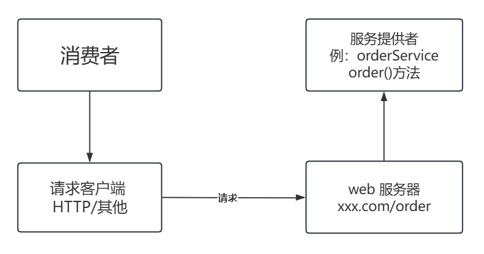
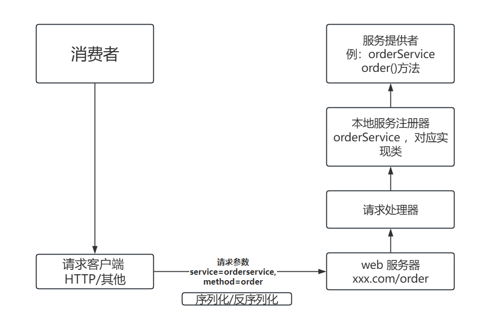
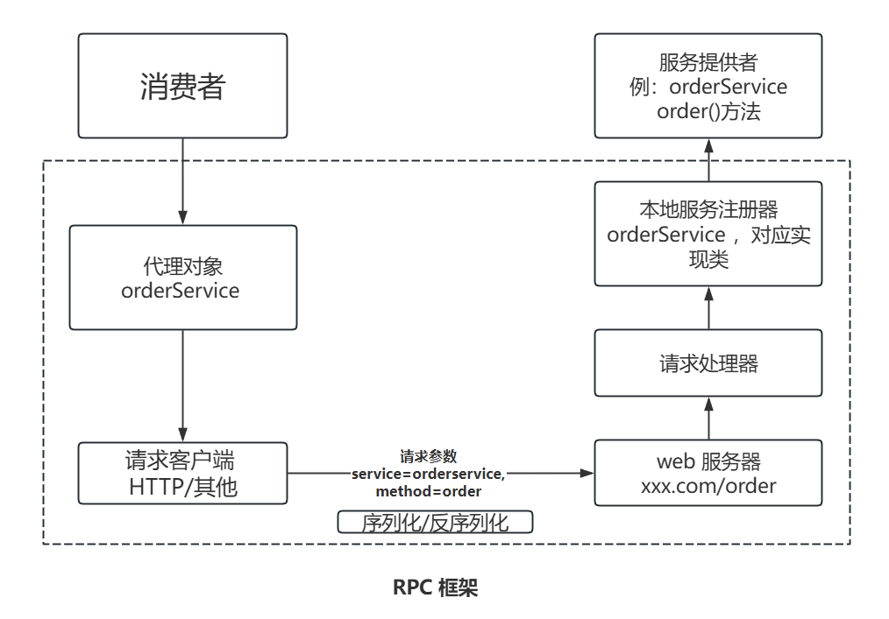
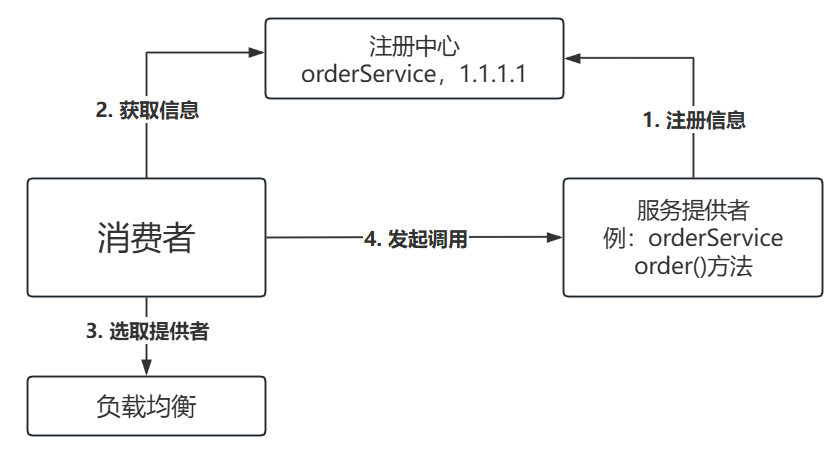
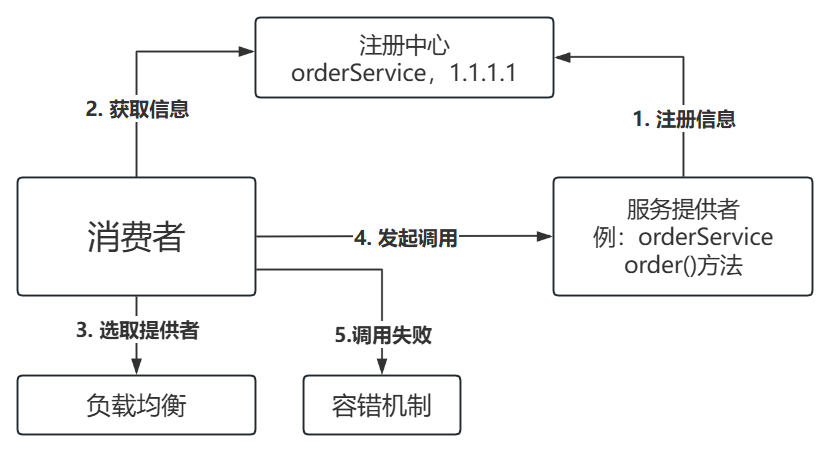

# RPC 框架简易版

## 一、基本概念
### 什么是RPC?

- 专业定义:`RPC(Remote Procedure Call)`即远程过程调用，是一种计算机通信协议，它允许程序在不同的计算机之间进行和交互，通信就像本地调用一样。

### 为什么需要RPC?

- 回到 RPC的概念，RPC允许一个程序(称为服务消费者)像调用自己程序的方法一样，调用另一个程序(称为服务提供者)的接口，而不需要了解数据的传输处理过程、底层网络通信的细节等。这些都会由 RPC 框架辅助完成，使得开发者可以轻松调用远程服务，快速开发整个系统。

- 如果没有 RPC 框架，两个独立的项目A、B，项目 B 怎么调用项目 A的服务呢?
  - 由于项目 A 和项目 B 都是独立的系统，不能像 SDK一样依赖包引入。那么就需要项目 A 提供 web 服务,并编写一个接口服务；然后项目 B 作为服务消费者，需要自己构造请求，并通过 HttpClient 请求 A 提供的接口地址。如果项目 B 需要调用更多第三方服务，每个服务和方法的调用都编写一个 HTTP 请求，那么会非常麻烦!
  - 而有了 RPC 框架，项目B可以通过一行代码完成调用，看上去就跟调用自己项目的方法没有任何区别


## 二、RPC框架思路实现

### 基本设计

- 基于消费者和服务提供者两个角色，在不使用 RPC 框架的前提下，消费者想要调用提供者，就需要提供者启动一个 web 服务 ，然后通过请求客户端（HttpClient ）发送HTTP或者其他协议的请求来调用服务

  - 如下所示

    

- 但如果提供者提供了多种服务和方法，每个接口和方法都要单独写一个接口吗?消费者要针对每个接口写一段HTTP调用的逻辑么?

  - 其实可以提供一个统一的服务调用接口，通过 `请求处理器` 根据客户端的请求参数来进行不同的处理、调用不同的服务和方法。

  - 可以在服务提供者程序中维护一个 `本地服务注册器` 记录服务和对应实现类的映射

  - 举个例子，消费者要调用 `orderService` 服务的 `order`方法，可以发送请求，参数为 `service=orderservice,method=order` ，请求处理器会根据 `service` 从服务注册器中找到对应的服务实现类，并且通过 Java 的引用机制调用方法指定的方法。

  - 如下所示

    

  - 需要注意的是，由于 Java 对象无法直接在网络中传输，所以要对传输的参数进行 `序列化` 和 `反序列化` 

- 为了简化消费者发送请求的代码，实现类似本地调用的体验。可以基于`代理模式`，为消费者要调用的接口生形成一个代理对象，由代理对象完成请求和响应的过程。

  - 说是代理，就是有人帮忙做一些事，不用自己操心。

  - 至此，一个最简单的RPC框架架构图诞生了

    
    
  - 上图的虚线框部分，就是RPC框架需要提供的模块和能力

### 扩展设计

- 虽然上述设计方案已经跑通了基本调用的流程，但离一个验收的 RPC 框架还有很大的差距，还需要进一步完善下架构设计。

#### 1、服务注册发现

- 消费者如何知道提供者的调用地址呢?

  - 类比生活场场景，我们点外卖时，外卖小哥如何知道我们的地址和店铺的地址?肯定是买家和卖家分别填写写地址，由平台来保存的。因此，我们需要一个 注册中心，来保存服务提供者的地址。消费者要调用服务时，只需从注册中心获取对应服务的提供者地址即可，一般用现成的第三方注册中心，比如 `Redis`、`Zookeeper` 即可

  - 架构图如下

    

#### 2、负载均衡

- 如果有多个服务提供者，消费者应该调用哪个服务提供者呢?

  - 我们可以给服务调用方增加负载均衡能力，通过指定不同的算法来调用哪一个服务提决定供者，比如轮询、随机、根据性能动态调用等。

  - 架构图如下

    

#### 3. 容错机制

- 如果服务调用失败，应该如何处理呢?

  - 为了保证分布式系统的高可用，我们通常会给服务的调用增加一定的容错机制，比如失败重试、降级调用其他接口等等。

  - 架构图如下:

    

#### 4、其他

- 除了上面几个个经典设计外，如果想要做一个优秀的RPC框架，还要考虑很多多问题。
- 例如:
  - 服务提供者下线了怎么办?需要一个失效节点清除机制。
  - 服务消费者每次都从注册中心拉取信息，性能会不会很差?可以使用服务器来优化性能。
  - 如何优化 RPC 框架的传输通讯性能?比如合适的网络框架、自定义协议头、节省传输体积等。
  - 如何让整个框架更利于扩展?比如使用 Java 的 SPI 机制、配置化等等。
- 所以，实现一个完美的 RPC 项目难度系数还是很高的
- 通过做一个 RPC 项目的目的学习到网络、序列化、代理、服务注册发现、负载均衡、容错可扩展设计等知识


## 三、简易版 RPC 框架开发

- 基于上面的架构图开发简易版的 RPC 框架，主要有以下模块
  - example-common:  示例代码的公共依赖，包括接口、模型等
  - example-consumer:  示例服务消费者代码
  - example-provider:  示例服务提供者代码
  - kk-rpc-easy:  简易版 RPC 框架

### 公共模块

- 公共需模块要同时被消费者和服务提供者引入，主要是编写和服务相关的接口和数据模型，目录结构如下

  > example-common/
  > ├── src/
  > │   ├── main/
  > │       ├── java/
  > │       │   ├── com/
  > │       │       ├── lhk/
  > │       │           ├── example/
  > │       │               ├── common/
  > │       │                   ├── model/
  > │       │                   │   └── User.java
  > │       │                   ├── service/
  > │       │                       └── UserService.java
  > │       ├── resources/
  > │           └── application.properties
  > └── pom.xml

- 用户实体类User

  ```java
  package com.lhk.example.common.model;
  import java.io.Serializable;
  
  /**
   * 用户类 (实现序列化接口，为网络传输序列化提供支持)
   */
  public class User implements Serializable {
  
      private String name;
  
      public String getName() {
          return name;
      }
  
      public void setName(String name) {
          this.name = name;
      }
  }
  ```

- 用服务户接口 `UserService` ，提供一个获取用户的方法

  ```java
  package com.lhk.example.common.service;
  
  import com.lhk.example.common.model.User;
  
  /**
   * 用户服务
   */
  public interface UserService {
  
      /**
       * 获取用户
       *
       * @param user
       * @return
       */
      User getUser(User user);
  }
  ```

### 服务提供者

- 服务提供者是真正实现了接口的模块，目录结构如下

  > example-provider/
  > ├── src/
  > │   ├── main/
  > │       ├── java/
  > │       │   ├── com/
  > │       │       ├── lhk/
  > │       │           ├── example/
  > │       │               ├── provider/
  > │       │                   ├── EasyProviderExample.java
  > │       │                   └── UserServiceImpl.java
  > │       ├── resources/
  > └── pom.xml

- 在 pom.xml 中引入依赖

  ```xml
  <project xmlns="http://maven.apache.org/POM/4.0.0" xmlns:xsi="http://www.w3.org/2001/XMLSchema-instance"
    xsi:schemaLocation="http://maven.apache.org/POM/4.0.0 http://maven.apache.org/maven-v4_0_0.xsd">
    <modelVersion>4.0.0</modelVersion>
    <groupId>com.lhk</groupId>
    <artifactId>example-provider</artifactId>
    <version>1.0-SNAPSHOT</version>
  
    <properties>
      <maven.compiler.source>11</maven.compiler.source>
      <maven.compiler.target>11</maven.compiler.target>
      <project.build.sourceEncoding>UTF-8</project.build.sourceEncoding>
    </properties>
  
    <dependencies>
      <dependency>
        <groupId>com.lhk</groupId>
        <artifactId>kk-rpc-easy</artifactId>
        <version>1.0-SNAPSHOT</version>
      </dependency>
      <dependency>
        <groupId>com.lhk</groupId>
        <artifactId>example-common</artifactId>
        <version>1.0-SNAPSHOT</version>
      </dependency>
      <!-- https://doc.hutool.cn/ -->
      <dependency>
        <groupId>cn.hutool</groupId>
        <artifactId>hutool-all</artifactId>
        <version>5.8.16</version>
      </dependency>
      <!-- https://projectlombok.org/ -->
      <dependency>
        <groupId>org.projectlombok</groupId>
        <artifactId>lombok</artifactId>
        <version>1.18.30</version>
        <scope>provided</scope>
      </dependency>
    </dependencies>
  </project>
  ```

- 服务实现类，实现公共模块中定义的用户服务接口

  ```java
  package com.lhk.example.provider;
  
  import com.lhk.example.common.model.User;
  import com.lhk.example.common.service.UserService;
  
  /**
   * 用户服务实现类
   */
  public class UserServiceImpl implements UserService {
  
      @Override
      public User getUser(User user) {
          System.out.println("用户名：" + user.getName());
          return user;
      }
  }
  ```

- 编写服务提供者启动类`EasyProvider`示例，之后会在该类的 `main` 方法中编写提供服务的代码

  ```java
  package com.lhk.example.provider;
  
  import com.lhk.example.common.service.UserService;
  import com.lhk.kkrpc.registry.LocalRegistry;
  import com.lhk.kkrpc.server.HttpServer;
  import com.lhk.kkrpc.server.VertxHttpServer;
  
  /**
   * 简易服务提供者示例
   */
  public class EasyProviderExample {
  
      public static void main(String[] args) {
  		//提供服务
      }
  }
  ```


### 服务消费者

- 服务消费者是需要调用服务的模块，目录结构如下

  > example-consumer/
  > ├── src/
  > │   ├── main/
  > │       ├── java/
  > │           ├── com/
  > │               ├── lhk/
  > │                   ├── example/
  > │                       ├── consumer/
  > │                           ├── EasyConsumerExample.java
  > │                           └── UserServiceProxy.java
  > └── pom.xml

- 在 `pom.xml` 文件中引入依赖，和提供者模块的依赖一致

  ```xml
  <project xmlns="http://maven.apache.org/POM/4.0.0" xmlns:xsi="http://www.w3.org/2001/XMLSchema-instance"
    xsi:schemaLocation="http://maven.apache.org/POM/4.0.0 http://maven.apache.org/maven-v4_0_0.xsd">
    <modelVersion>4.0.0</modelVersion>
    <groupId>com.lhk</groupId>
    <artifactId>example-consumer</artifactId>
    <version>1.0-SNAPSHOT</version>
    <properties>
      <maven.compiler.source>11</maven.compiler.source>
      <maven.compiler.target>11</maven.compiler.target>
      <project.build.sourceEncoding>UTF-8</project.build.sourceEncoding>
    </properties>
  
    <dependencies>
      <dependency>
        <groupId>com.lhk</groupId>
        <artifactId>example-common</artifactId>
        <version>1.0-SNAPSHOT</version>
      </dependency>
  
      <dependency>
        <groupId>com.lhk</groupId>
        <artifactId>kk-rpc-easy</artifactId>
        <version>1.0-SNAPSHOT</version>
      </dependency>
  
      <!-- https://doc.hutool.cn/ -->
      <dependency>
        <groupId>cn.hutool</groupId>
        <artifactId>hutool-all</artifactId>
        <version>5.8.16</version>
      </dependency>
    </dependencies>
  </project>
  
  ```

- 服务消费者创建启动类 `EasyConsumerExample`，编写调用接口的代码

  ```java
  package com.lhk.example.consumer;
  
  import com.lhk.example.common.model.User;
  import com.lhk.example.common.service.UserService;
  import com.lhk.kkrpc.proxy.ServiceProxyFactory;
  
  /**
   * 简易服务消费者示例
   */
  public class EasyConsumerExample {
  
      public static void main(String[] args) {
          // todo 需要获取 UserService 的实现类对象
          UserService userService = null;
          User user = new User();
          user.setName("lhk1008611");
          // 调用
          User newUser = userService.getUser(user);
          if (newUser != null) {
              System.out.println(newUser.getName());
          } else {
              System.out.println("user == null");
          }
      }
  }
  ```

  - 注意的是，现在是无法获取到 `userService` 实例的，所需要的准备为 nul。后面要做的就是能够通过RPC框架，快速得到一个支持远程调用服务提供者的代理对象，就像调用本地方法一样调用 `UserService` 的方法


### 网络服务器

- 接下来，要先让服务提供者提供可远程访问的服务。那么，就需要一个 Web 服务器，能够接受处理请求、并返回响应。
- web 服务器的选择有很多，比如 Spring Boot 内嵌的 Tomcat、NI0 框架 Netty 和 Vert.x 等等。该项目使用高性能的 NIO 框架 Vert.x来作为 RPC 框架的网络服务器。
- Vert.x官方文档:https://vertx.io/

- 打开 kk-rpc-easy 项目，引入Vert.x和工具类的依赖:

  ```xml
  <project xmlns="http://maven.apache.org/POM/4.0.0" xmlns:xsi="http://www.w3.org/2001/XMLSchema-instance"
    xsi:schemaLocation="http://maven.apache.org/POM/4.0.0 http://maven.apache.org/xsd/maven-4.0.0.xsd">
    <modelVersion>4.0.0</modelVersion>
  
    <groupId>com.lhk</groupId>
    <artifactId>kk-rpc-easy</artifactId>
    <version>1.0-SNAPSHOT</version>
  
    <name>kk-rpc-easy</name>
  
    <properties>
      <maven.compiler.source>11</maven.compiler.source>
      <maven.compiler.target>11</maven.compiler.target>
      <project.build.sourceEncoding>UTF-8</project.build.sourceEncoding>
    </properties>
  
    <dependencies>
      <!-- https://mvnrepository.com/artifact/io.vertx/vertx-core -->
      <dependency>
        <groupId>io.vertx</groupId>
        <artifactId>vertx-core</artifactId>
        <version>4.5.1</version>
      </dependency>
      <!-- https://doc.hutool.cn/ -->
      <dependency>
        <groupId>cn.hutool</groupId>
        <artifactId>hutool-all</artifactId>
        <version>5.8.16</version>
      </dependency>
      <!-- https://projectlombok.org/ -->
      <dependency>
        <groupId>org.projectlombok</groupId>
        <artifactId>lombok</artifactId>
        <version>1.18.30</version>
        <scope>provided</scope>
      </dependency>
    </dependencies>
  
  </project>
  
  ```

- 编写一个 Web 服务器的接口 `HtpServer`，定义统一的启动服务器方法，后续的扩展，比如实现多种不同的 Web
  服务器

  ```java
  package com.lhk.kkrpc.server;
  
  /**
   * HTTP 服务器接口
   */
  public interface HttpServer {
  
      /**
       * 启动服务器
       *
       * @param port
       */
      void doStart(int port);
  }
  
  ```

- 3)在 `Vert.x` 实现的 web 服务器 `VertxHttpServer`上编写基础，能够监牢听取指定端口并处理请求

  ```java
  package com.lhk.kkrpc.server;
  
  import io.vertx.core.Vertx;
  
  public class VertxHttpServer implements HttpServer {
  
      @Override
      /**
       * 启动服务器
       *
       * @param port
       */
      public void doStart(int port) {
   		// 创建 Vert.x 实例
          Vertx vertx = Vertx.vertx();
  
          // 创建 HTTP 服务器
          io.vertx.core.http.HttpServer server = vertx.createHttpServer();
  
          // 监听端口并处理请求
          server.requestHandler(request -> {
              // 处理 HTTP 请求
              System.out.println("Received request: " + request.method() + " " + request.uri());
  
              // 发送 HTTP 响应
              request.response()
                      .putHeader("content-type", "text/plain")
                      .end("Hello from Vert.x HTTP server!");
          });
  
          // 启动 HTTP 服务器并监听指定端口
          server.listen(port, result -> {
              if (result.succeeded()) {
                  System.out.println("Server is now listening on port " + port);
              } else {
                  System.err.println("Failed to start server: " + result.cause());
              }
          });
      }
  }
  ```

- 验证web服务器能否启动成功并接受请求

  - 修改示例服务提供者模块的 `EasyProviderExample` 类，编写启动web服务的代码，如下:

  ```java
  package com.lhk.example.provider;
  
  import com.lhk.example.common.service.UserService;
  import com.lhk.kkrpc.registry.LocalRegistry;
  import com.lhk.kkrpc.server.HttpServer;
  import com.lhk.kkrpc.server.VertxHttpServer;
  
  /**
   * 简易服务提供者示例
   */
  public class EasyProviderExample {
  
      public static void main(String[] args) {
          // 启动 web 服务
          HttpServer httpServer = new VertxHttpServer();
          httpServer.doStart(8888);
      }
  }
  ```

  - 通过浏览器访问 `localhost:8888`，查看能否正常访问并看到输出的文字。

### 本地服务注册器

- 由于该项目是简易版 RPC，所以暂时先不用第三方注册中心，直接把服务注册到服务提供者本地即可。

  - 在 RPC 模块中创建本地服务注册器 `LocalRegistry`
  - 使用线程安全的 `ConcurrentHashMap` 存储服务注册信息，`key` 为服务名称、`value` 为服务的实现类。之后就可以根据调用要的服务名称获取到对应的实现类，然后通过引用进行方法调用了
  - 注意，本地服务注册器和注册中心的作用是有区别的。
    - 注册中心的作用是集中管理注册的服务、向消费者提供服务信息
    - 而本地服务注册器的作用是根据服务名获取对应的实现类，是完成调用必要的模块

  ```java
  package com.lhk.kkrpc.registry;
  
  import java.util.Map;
  import java.util.concurrent.ConcurrentHashMap;
  
  /**
   * 本地注册中心
   */
  public class LocalRegistry {
  
      /**
       * 注册信息存储
       */
      private static final Map<String, Class<?>> map = new ConcurrentHashMap<>();
  
      /**
       * 注册服务
       *
       * @param serviceName
       * @param implClass
       */
      public static void register(String serviceName, Class<?> implClass) {
          map.put(serviceName, implClass);
      }
  
      /**
       * 获取服务
       *
       * @param serviceName
       * @return
       */
      public static Class<?> get(String serviceName) {
          return map.get(serviceName);
      }
  
      /**
       * 删除服务
       *
       * @param serviceName
       */
      public static void remove(String serviceName) {
          map.remove(serviceName);
      }
  }
  
  ```

- 服务提供者启动时，需要注册服务到注册器中，修改 `EasyProviderExample` 代码如下

  ```java
  package com.lhk.example.provider;
  
  import com.lhk.example.common.service.UserService;
  import com.lhk.kkrpc.registry.LocalRegistry;
  import com.lhk.kkrpc.server.HttpServer;
  import com.lhk.kkrpc.server.VertxHttpServer;
  
  /**
   * 简易服务提供者示例
   */
  public class EasyProviderExample {
  
      public static void main(String[] args) {
  
          // 注册服务
          LocalRegistry.register(UserService.class.getName(), UserServiceImpl.class);
  
          // 启动 web 服务
          HttpServer httpServer = new VertxHttpServer();
          httpServer.doStart(8888);
      }
  }
  
  ```


### 序列化器

- 服务在本地注册后，我们就可以以根据请求信息取出实现类并调用方法了。

- 在编写处理请求的逻辑前，要先实现序列化器模块。因为无论是请求或响应，都会涉及参数的传输。而`Java`对象是存在 JVM 虚拟机中的，如果想在其他位置存储并访问、或者在网络中进行传输，就需要进行序列化和序列反化。

- 什么是序列化和反序列化呢?

  - 序列化: 将 `Java` 对象转为可传输的字节负载
  - 反序列化: 将字节存储转换为 `Java` 对象

- 有很多种不同同的序列化方式，比如 Java 原生序列化、JSON、Hessian、Kryo、protobuf 等
  为了实现方便，这里选择 Java 原生的序列化器。

- 在RPC模块中编写序列化接口`Serializer`，提供序列化和反序列化两种方法，后续扩展更多的序列化器

  ```java
  package com.lhk.kkrpc.serializer;
  
  import java.io.IOException;
  
  /**
   * 序列化器接口
   */
  public interface Serializer {
  
      /**
       * 序列化
       *
       * @param object
       * @param <T>
       * @return
       * @throws IOException
       */
      <T> byte[] serialize(T object) throws IOException;
  
      /**
       * 反序列化
       *
       * @param bytes
       * @param type
       * @param <T>
       * @return
       * @throws IOException
       */
      <T> T deserialize(byte[] bytes, Class<T> type) throws IOException;
  }
  
  ```

- 基于Java自带的序列化器实现 `JdkSerializer`，代码如下

  - 以下代码无需记忆，需要要用到的时候照抄即可，关键是要理解序列化和反序列化的区别

  ```java
  package com.lhk.kkrpc.serializer;
  
  import java.io.*;
  
  /**
   * JDK 序列化器
   */
  public class JdkSerializer implements Serializer {
  
      /**
       * 序列化
       *
       * @param object
       * @param <T>
       * @return
       * @throws IOException
       */
      @Override
      public <T> byte[] serialize(T object) throws IOException {
          ByteArrayOutputStream outputStream = new ByteArrayOutputStream();
          ObjectOutputStream objectOutputStream = new ObjectOutputStream(outputStream);
          objectOutputStream.writeObject(object);
          objectOutputStream.close();
          return outputStream.toByteArray();
      }
  
      /**
       * 反序列化
       *
       * @param bytes
       * @param type
       * @param <T>
       * @return
       * @throws IOException
       */
      @Override
      public <T> T deserialize(byte[] bytes, Class<T> type) throws IOException {
          ByteArrayInputStream inputStream = new ByteArrayInputStream(bytes);
          ObjectInputStream objectInputStream = new ObjectInputStream(inputStream);
          try {
              return (T) objectInputStream.readObject();
          } catch (ClassNotFoundException e) {
              throw new RuntimeException(e);
          } finally {
              objectInputStream.close();
          }
      }
  }
  
  ```

### 提供者处理调用-请求处理器

- 请求处理器是RPC框架的实现关键

  - 它的作用是: 处理接收到的请求，并根据请求参数找到对应的服务和方法，通过引用实现调用，最后封装返回结果并响应请求

- 在RPC模块中编写请求和响应封装类

  - 请求类 `RpcRequest` 的作用是封装信息调用需要的，比如服务名称、方法名称、调用参数的类型列表、参数列表。这些都是Java调用机制所需的参数

  ```java
  package com.lhk.kkrpc.model;
  
  import lombok.AllArgsConstructor;
  import lombok.Builder;
  import lombok.Data;
  import lombok.NoArgsConstructor;
  
  import java.io.Serializable;
  
  /**
   * RPC 请求
   */
  @Data
  @Builder
  @AllArgsConstructor
  @NoArgsConstructor
  public class RpcRequest implements Serializable {
  
      /**
       * 服务名称
       */
      private String serviceName;
  
      /**
       * 方法名称
       */
      private String methodName;
  
      /**
       * 参数类型列表
       */
      private Class<?>[] parameterTypes;
  
      /**
       * 参数列表
       */
      private Object[] args;
  
  }
  
  ```

- 响应类 `RpcResponse` 的作用是封装调用方法得到的返回值、以及调用的信息(比如异常情况)等。

  ```java
  package com.lhk.kkrpc.model;
  
  import lombok.AllArgsConstructor;
  import lombok.Builder;
  import lombok.Data;
  import lombok.NoArgsConstructor;
  
  import java.io.Serializable;
  
  /**
   * RPC 响应
   */
  @Data
  @Builder
  @AllArgsConstructor
  @NoArgsConstructor
  public class RpcResponse implements Serializable {
  
      /**
       * 响应数据
       */
      private Object data;
  
      /**
       * 响应数据类型（预留）
       */
      private Class<?> dataType;
  
      /**
       * 响应信息
       */
      private String message;
  
      /**
       * 异常信息
       */
      private Exception exception;
  
  }
  
  ```

- 编写请求处理器 `HttpServerHandler`

  - 需要注意，不同的 web 服务器对应的请求处理器实现方式也不同，比如 Vert.x 中是通过实现 `Handler<HttpserverRequest>`接口来自定义请求处理器的。并且可以通过 `request.bodyHandler` 异步处理请求。

  ```java
  package com.lhk.kkrpc.server;
  
  import com.lhk.kkrpc.model.RpcRequest;
  import com.lhk.kkrpc.model.RpcResponse;
  import com.lhk.kkrpc.registry.LocalRegistry;
  import com.lhk.kkrpc.serializer.JdkSerializer;
  import com.lhk.kkrpc.serializer.Serializer;
  import io.vertx.core.Handler;
  import io.vertx.core.buffer.Buffer;
  import io.vertx.core.http.HttpServerRequest;
  import io.vertx.core.http.HttpServerResponse;
  
  import java.io.IOException;
  import java.lang.reflect.Method;
  
  /**
   * HTTP 请求处理
   */
  public class HttpServerHandler implements Handler<HttpServerRequest> {
  
      @Override
      public void handle(HttpServerRequest request) {
          // 指定序列化器
          final Serializer serializer = new JdkSerializer();
  
          // 记录日志
          System.out.println("Received request: " + request.method() + " " + request.uri());
  
          // 异步处理 HTTP 请求
          request.bodyHandler(body -> {
              byte[] bytes = body.getBytes();
              RpcRequest rpcRequest = null;
              try {
                  rpcRequest = serializer.deserialize(bytes, RpcRequest.class);
              } catch (Exception e) {
                  e.printStackTrace();
              }
  
              // 构造响应结果对象
              RpcResponse rpcResponse = new RpcResponse();
              // 如果请求为 null，直接返回
              if (rpcRequest == null) {
                  rpcResponse.setMessage("rpcRequest is null");
                  doResponse(request, rpcResponse, serializer);
                  return;
              }
  
              try {
                  // 获取要调用的服务实现类，通过反射调用
                  Class<?> implClass = LocalRegistry.get(rpcRequest.getServiceName());
                  Method method = implClass.getMethod(rpcRequest.getMethodName(), rpcRequest.getParameterTypes());
                  Object result = method.invoke(implClass.newInstance(), rpcRequest.getArgs());
                  // 封装返回结果
                  rpcResponse.setData(result);
                  rpcResponse.setDataType(method.getReturnType());
                  rpcResponse.setMessage("ok");
              } catch (Exception e) {
                  e.printStackTrace();
                  rpcResponse.setMessage(e.getMessage());
                  rpcResponse.setException(e);
              }
              // 响应
              doResponse(request, rpcResponse, serializer);
          });
      }
  
      /**
       * 响应
       *
       * @param request
       * @param rpcResponse
       * @param serializer
       */
      void doResponse(HttpServerRequest request, RpcResponse rpcResponse, Serializer serializer) {
          HttpServerResponse httpServerResponse = request.response()
                  .putHeader("content-type", "application/json");
          try {
              // 序列化
              byte[] serialized = serializer.serialize(rpcResponse);
              httpServerResponse.end(Buffer.buffer(serialized));
          } catch (IOException e) {
              e.printStackTrace();
              httpServerResponse.end(Buffer.buffer());
          }
      }
  }
  
  ```

- 给`HttpServer`绑定请求处理器

  - 修改 `VertxHttpServer` 的代码，通过 `server.requestHandler` 绑定请求处理器

  - ```java
    package com.lhk.kkrpc.server;
    
    import io.vertx.core.Vertx;
    
    public class VertxHttpServer implements HttpServer {
    
        @Override
        /**
         * 启动服务器
         *
         * @param port
         */
        public void doStart(int port) {
            // 创建 Vert.x 实例
            Vertx vertx = Vertx.vertx();
    
            // 创建 HTTP 服务器
            io.vertx.core.http.HttpServer server = vertx.createHttpServer();
    
            // 监听端口并处理请求
            server.requestHandler(new HttpServerHandler());
    
            // 启动 HTTP 服务器并监听指定端口
            server.listen(port, result -> {
                if (result.succeeded()) {
                    System.out.println("Server is now listening on port " + port);
                } else {
                    System.err.println("Failed to start server: " + result.cause());
                }
            });
        }
    
    }
    ```

- 至此，引入了RPC框架架的服务提供者模块，经能够已接受请求并完成成服务调用了

### 消费方发起呼吁-代理

- 前面在消费者模块中准备了一段调用服务的代码，只要能够够获取到`UserService`对象(实现类)，就能跑通整个流程。
- 但是 `UserService` 的实现类从哪来呢? 
  - 肯定不能把服务提供者的 `UserServicelmpl` 复制粘贴到消费者模块，能这样的话还需要RPC框架吗?
  - 在系统中，我们调用其他或团队提供的接口时，一般只关注请求参数和响应结果，而不是具体实现。
  - 在前面的色痕迹过程中有提到可以通过生成**代理对象**来简化消费方的调用
  - 代理的实现方式大致分为2类: **静态代理**和**动态代理**，下面依次实现

#### 静态代理

- 静态代理是指为每一个特定类型的接口或对象，编写一个代理类

- 比如在 `example-consumer` 模块中，创建一个静态代理 `UserServiceProxy`，实现 `UserService` 接口和 `getUser` 方法

- 只是实现 `getUser` 方法时，不是复制粘贴服务提供者使用 `UserServicelmpl` 中的代码，而是要构造 HTTP 请求去调用服
  务提供者

  ```java
  package com.lhk.example.consumer;
  
  import cn.hutool.http.HttpRequest;
  import cn.hutool.http.HttpResponse;
  import com.lhk.example.common.model.User;
  import com.lhk.example.common.service.UserService;
  import com.lhk.kkrpc.model.RpcRequest;
  import com.lhk.kkrpc.model.RpcResponse;
  import com.lhk.kkrpc.serializer.JdkSerializer;
  import com.lhk.kkrpc.serializer.Serializer;
  
  import java.io.IOException;
  
  /**
   * 服务静态代理
   */
  public class UserServiceProxy implements UserService {
  
      @Override
      public User getUser(User user) {
          // 指定序列化器
          Serializer serializer = new JdkSerializer();
  
          // 发请求
          RpcRequest rpcRequest = RpcRequest.builder()
                  .serviceName(UserService.class.getName())
                  .methodName("getUser")
                  .parameterTypes(new Class[]{User.class})
                  .args(new Object[]{user})
                  .build();
          try {
              byte[] bodyBytes = serializer.serialize(rpcRequest);
              byte[] result;
              try (HttpResponse httpResponse = HttpRequest.post("http://localhost:8888")
                      .body(bodyBytes)
                      .execute()) {
                  result = httpResponse.bodyBytes();
              }
              RpcResponse rpcResponse = serializer.deserialize(result, RpcResponse.class);
              return (User) rpcResponse.getData();
          } catch (IOException e) {
              e.printStackTrace();
          }
  
          return null;
      }
  }
  
  ```

- 然后修改 `EasyConsumerExample`，新建一个代理对象并赋值给用户服务，就可以完成调用:

  ```java
  /**
   * 简易服务消费者示例
   */
  public class EasyConsumerExample {
  
      public static void main(String[] args) {
          // 静态代理
          UserService userService = new UserServiceProxy();
          
          ...
      }
  }
  
  ```

- 静态代理虽然很好理解(就是写个实现类嘛)，但是缺点也很明显，我们如果要给每个服务接口都写一个实现类，是非常麻烦的，这种代理方式的灵活度很差!
- 所以在RPC框架中，我们会使用动态代理


#### 动态代理

- 动态代理的作用是，根据需要生成的对象的**类型**，自动生成一个个代理**对象**。

- 常用的动态代理实现方式有**JDK动态代理**和**基于字节码生成的动态代理(比如CGLIB)**

  - **JDK动态代理**简单易用、不需要引入额外的库，但只能对接口进行代理
  - **基于字节码生成的动态代理(比如CGLIB)**更灵活、可以对任何类进行代理，但性能略低于JDK动态代理。
  - 该项目使用 `JDK动态代理`

- 在RPC模块块中编写动态代理类 `ServiceProxy`，需要实现 `InvocationHandler` 接口的 `invoke`方法

  ```java
  package com.lhk.kkrpc.proxy;
  
  import cn.hutool.http.HttpRequest;
  import cn.hutool.http.HttpResponse;
  import com.lhk.kkrpc.model.RpcRequest;
  import com.lhk.kkrpc.model.RpcResponse;
  import com.lhk.kkrpc.serializer.JdkSerializer;
  import com.lhk.kkrpc.serializer.Serializer;
  
  import java.io.IOException;
  import java.lang.reflect.InvocationHandler;
  import java.lang.reflect.Method;
  
  /**
   * 服务代理（JDK 动态代理）
   */
  public class ServiceProxy implements InvocationHandler {
  
      /**
       * 调用代理
       *
       * @return
       * @throws Throwable
       */
      @Override
      public Object invoke(Object proxy, Method method, Object[] args) throws Throwable {
          // 指定序列化器
          Serializer serializer = new JdkSerializer();
  
          // 构造请求
          RpcRequest rpcRequest = RpcRequest.builder()
                  .serviceName(method.getDeclaringClass().getName())
                  .methodName(method.getName())
                  .parameterTypes(method.getParameterTypes())
                  .args(args)
                  .build();
          try {
              // 序列化
              byte[] bodyBytes = serializer.serialize(rpcRequest);
              // 发送请求
              //todo 注意，这里地址被硬编码了（需要使用注册中心和服务发现机制解决）
              try (HttpResponse httpResponse = HttpRequest.post("http://localhost:8888")
                      .body(bodyBytes)
                      .execute()) {
                  byte[] result = httpResponse.bodyBytes();
                  // 反序列化
                  RpcResponse rpcResponse = serializer.deserialize(result, RpcResponse.class);
                  return rpcResponse.getData();
              }
          } catch (IOException e) {
              e.printStackTrace();
          }
  
          return null;
      }
  }
  
  ```

  - 上述代码的执行过程：当用户调用某个接口的方法时，会改为调用 `invoke` 方法。在`invoke`方法中，我们可以获取到要调用的方法信息、格式化的参数列表等，这不就是我们服务提供者需要的参数么?用这些参数来构造请求对象就可以完成调用了。
  - 需要注意的是，上述代码中，请求服务提供者地址被硬编码了，需要使用注册中心和服务发现机来解决

- 创建动态代理对象 `ServiceProxyFactory`，作用是根据指定类创建动态代理对象

  - 这里是使用了工厂设计模式，来简化对象的创建过程，代码如下:

  ```java
  package com.lhk.kkrpc.proxy;
  
  import java.lang.reflect.Proxy;
  
  /**
   * 服务代理工厂（用于创建代理对象）
   */
  public class ServiceProxyFactory {
  
      /**
       * 根据服务类获取代理对象
       *
       * @param serviceClass
       * @param <T>
       * @return
       */
      public static <T> T getProxy(Class<T> serviceClass) {
          return (T) Proxy.newProxyInstance(
                  serviceClass.getClassLoader(),
                  new Class[]{serviceClass},
                  new ServiceProxy());
      }
  }
  ```

- 最后，在 `EasyConsumerExample` 中，就可以通过调用工厂来为 `UserService` 获取动态代理对象了

  ```java
  package com.lhk.example.consumer;
  
  import com.lhk.example.common.model.User;
  import com.lhk.example.common.service.UserService;
  import com.lhk.kkrpc.proxy.ServiceProxyFactory;
  
  /**
   * 简易服务消费者示例
   */
  public class EasyConsumerExample {
  
      public static void main(String[] args) {
          // 静态代理
  //        UserService userService = new UserServiceProxy();
          // 动态代理
          UserService userService = ServiceProxyFactory.getProxy(UserService.class);
          User user = new User();
          user.setName("lhk");
          userService.getUser(user);
      }
  }
  
  ```


## 四、测试验证

1. 以调试模式启动服务提供者，执行main方法
2. 以调试模式启动服务消费者，执行main方法
   - 在 `ServiceProxy` 代理类中添加断点，可以看到调用 `userService` 时，实际是调用了代理对象的 `invoke` 方法，并且捕获了获取了`serviceName`、`methodName`、参数类型和列表等信息。
3. 继续 debug，可以看到序列化后的请求对象，结构是字节备份
4. 在服务提供者模块的请求处理器中打断点，可以看到接受并反序列化后的请求，跟发送时的内容一致
5. 继续调试，可以看到请求处理器中，通过引用成功调用了方法，并得到了返回的 `User` 对象
6. 最后，在服务提供者和消消费者模块中都输出了用户名称，说明整个调用过成功程

