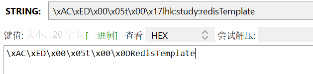
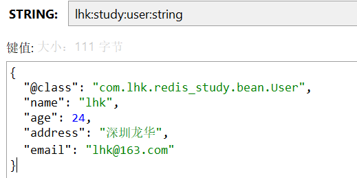

# Redis 基础

## 一、NoSql 介绍

- NoSql 的数据结构类型
    1. key-value 型 （Redis）
    2. document 型 （MongoDB）
    3. 列类型 （Hbase）
    4. Graph 类型 （Neo4j）

|          |                        sql                        |                            nosql                             |
| -------- | :-----------------------------------------------: | :----------------------------------------------------------: |
| 数据结构 |                      结构化                       |                           非结构化                           |
| 数据关联 |                      关联的                       |                           无关联的                           |
| 查询方式 |                     SQL 查询                      |                         非 SQL 查询                          |
| 事务特性 |                       ACID                        |                             BASE                             |
| 存储方式 |                       磁盘                        |                             内存                             |
| 扩展性   |                       垂直                        |                             水平                             |
| 使用场景 | 1. 数据结构固定<br/>2. 对数据安全性和一致性要求高 | 1. 数据结构不固定<br/>2. 对数据安全性和一致性要求不高<br/>3. 对性能要求高 |

## 二、Redis 介绍

- **Re**mote **Di**ctionary **S**erver（远程词典服务器），是一个基于内存的 key-value 型 NoSql 数据库
- 特征
    - key-value 型，value 支持多种不同数据结构
    - 单线程，每个命令具有原子性
    - 低延迟，速度快（基于内存，IO 多路复用，良好的编码）
    - 支持数据持久化
    - 支持主从集群，分片集群
    - 支持多语言客户端

## 三、Redis 的数据结构

- 在 Redis 中，key 一般是 String 类型，而 value 有多中类型
    - 基本类型
        - String
        - Hash
        - List
        - Set
        - SortSet
    - 特殊类型
        - GEO
        - BitMap
        - HyperLog

## 四、Redis 的常用命令

### Redis 的 key 的定义

- Redis 中 key 可以使用`:`进行分级，例如：`项目名:业务名:类型:ID`

### 通用命令

| 命令     | 说明                       |
| -------- | -------------------------- |
| `KEYS`   | 查看多个 key，例：`KEYS *` |
| `DEL`    | 删除 key                   |
| `EXISTS` | 判断 key 是否存在          |
| `EXPIRE` | 设置 key 的过期时间        |
| `TTL`    | 查看 key 的剩余有效时间    |


### String 类型

- 常用命令

  | 命令          | 说明                                        |
    | ------------- | ------------------------------------------- |
  | `SET`         | 添加或修改                                  |
  | `GET`         | 获取                                        |
  | `MSET`        | 批量添加                                    |
  | `MGET`        | 批量获取                                    |
  | `INCR`        | 自增 1                                      |
  | `INCRBY`      | 自增整形步长                                |
  | `INCRBYFLOAT` | 自增浮点步长                                |
  | `SETNX`       | 若 key 不存在则添加一个 String 类型的键值对 |
  | `SETEX`       | 添加并设置过期时间                          |

- String 结构存储对象时，是将对象序列化为 JSON 字符串后存储

    - 缺点：当需要修改对象某个字段时很不方便，此时可以使用 hash 类型进行存储


### Hash 类型

- Hash 类型，也叫散列，其 value 是一个无序字典，类似于 Java 中的HashMap 结构

- Hash 结构可以将对象中的每个字段独立存储，并且可以针对单个字段做 CRUD，对于需要经常修改的数据比较友好

- 常用命令

  | 命令                   | 说明                                                         |
  | ---------------------- | ------------------------------------------------------------ |
  | `HSET key field value` | 添加或修改一个 hash 类型数据                                 |
  | `HGET key field`       | 获取一个 hash 类型数据 key 中一个 filed 对应的 value         |
  | `HMSET`                | 批量添加                                                     |
  | `HMGET`                | 批量获取                                                     |
  | `HGETALL`              | 获取一个 hash 类型数据 key 中所有 filed 和 value             |
  | `HKEYS`                | 获取一个 hash 类型数据 key 中所有 filed                      |
  | `HVALS`                | 获取一个 hash 类型数据 key 中所有 value                      |
  | `HINCRBY`              | 让一个 hash 类型数据 key 中的 field 自增整形步长             |
  | `HSETNX`               | 若 hash 类型数据 key 中的 field 不存在，则添加该 field 对应的 value |


### List 类型

- Redis 中的 List 类型与 Java 中的 LinkedList 类似，可以看做是一个双向链表结构。既可以支持正向检索和也可以支持反向检索

    - 特征也与 LinkedList 类似:
        - 有序
        - 元索可以重复
        - 插入和删除快
        - 查询速度一般
    - 常用来存储一个有序数据，例如:朋友圈点赞列表，评论列表等

- 常见命令

  | 命令                   | 说明                                                         |
    | ---------------------- | ------------------------------------------------------------ |
  | `LPUSH key element….`  | 向列表左侧插入一个或多个元素                                 |
  | `LPOP key`             | 移除并返回列表左侧的第一个元素，没有则返回 nil               |
  | `RPUSH key element...` | 向列表右侧插入一个或多个元素                                 |
  | `RPOP key`             | 移除并返回列表右侧的第一个元素，没有则返回 nil               |
  | `LRANGE key starend`   | 返回一段角标范围内的所有元素                                 |
  | `BLPOP` 和 `BRPOP`     | 与 `LPOP` 和 `RPOP` 类似，只不过在没有元素时等待指定时间后再 pop（阻塞式获取），而不是直接返回 nil |

- 使用 `LPUSH`  和 `LPOP ` 可以实现栈结构

- 使用`LPUSH ` 和 `RPOP ` 或者 `RPUSH ` 和 `LPOP`  可以实现队列

    - 使用`LPUSH ` 和 `BRPOP ` 或者 `RPUSH ` 和 `BLPOP`  可以实现阻塞队列


### Set 类型

- Redis 的 Set 结构与 ]ava 中的 HashSet 类似，可以看做是一个 value 为 null 的 HashMap。因为也是一个 hash 表，因此具备与Hashset 类似的特征:

    - 无序
    - 元素不可重复
    - 查找快
    - 支持交集、并集、差集等功能

- 常见命令有

  | 命令                   | 说明                          |
    | ---------------------- | ----------------------------- |
  | `SADD key member ...`  | 向 set 中添加一个或多个元素   |
  | `SREM key member...`   | 移除 set 中的指定元素         |
  | `SCARD key`            | 返回 set 中元素的个数         |
  | `SISMEMBER key member` | 判断一个元素是否存在于 set 中 |
  | `SMEMBERS`             | 获取 set 中的所有元素         |
  | `SINTER key1 key2...`  | 求key1与key2的交集            |
  | `SDIFF key1 key2...`   | 求key1与key2的差集            |
  | `SUNION key1 key2...`  | 求key1和key2的并集            |


### SortedSet 类型

- Redis 的 SortedSet 是一个可排序的 set 集合，与 ]ava 中的 TreeSet 有些类似，但底层数据结构却差别很大。SortedSet 中的每一个元素都带有一个 score 属性，可以基于 score 属性对元素排序，底层的实现是一个跳表(SkipList，用于排序) 加 hash 表 （存储 value 和 score）

    - Sortedset具备下列特性:
        - 可排序
        - 元素不重复
        - 查询速度快
    - 因为 SortedSet 的可排序特性，经常被用来实现排行榜这样的功能

- 常见命令

  | 命令                           | 说明                                                         |
    | ------------------------------ | ------------------------------------------------------------ |
  | `ZADD key score member`        | 添加一个或多个元素到 sortedSet，如果已经存在则更新其 score 值 |
  | `ZREM key member`              | 删除sorted set中的一个指定元素                               |
  | `ZSCORE key member`            | 获取sortedSet中的指定元素的 score 值                         |
  | `ZRANK key member`             | 获取 sortedSet 中的指定元素的排名                            |
  | `ZCARD key`                    | 获取sorted set中的元素个数                                   |
  | `ZCOUNT key min max`           | 统计score值在给定范围内的所有元素的个数                      |
  | `ZINCRBY key increment member` | 让sorted set中的指定元素自增，步长为指定的increment值        |
  | `ZRANGE key min max`           | 按照 score 排序后，获取指定排名范围内的元素                  |
  | `ZRANGEBYSCORE key min max`    | 按照score排序后，获取指定score范围内的元素                   |
  | `ZDIFF`、`ZINTER`、`ZUNION`    | 求差集、交集、并集                                           |

    - 注意:所有的排名默认都是升序，如果要降序则在命令的 Z 后面添加 REV 即可，及 `ZREV`

### GEO 类型
- GEO 就是 Geolocation 的简写形式，代表地理坐标。
  - Redis 在 3.2 版本中加入了对 GEO 的支持，允许存储地理坐标信息，帮助我们根据经纬度来检索数据。
- 常见的命令:

    | 命令           | 说明                                                         |
    |------------------------------------------------------------| ------------------------------------------------------------ |
    | GEOADD         | 添加一个地理空间信息，包含:经度(longitude)、纬度(latitude)、值(member，可以是地址编号) |
    | GEODIST        | 计算指定的两个点之间的距离并返回                                           |
    | GEOHASH        | 将指定member的坐标转为hash字符串形式并返回                                 |
    | GEOPOS         | 返回指定member的坐标                                              |
    | GEORADIUS      | 指定圆心、半径，找到该圆内包含的所有member，并按照与圆心之间的距离排序后返回。6.2以后已废弃         |
    | GEOSEARCH      | 在指定范围内搜索member，并按照与指定点之间的距离排序后返回。范围可以是圆形或矩形。6.2.新功能        |
    | GEOSEARCHSTORE | 与 GEOSEARCH 功能一致，不过可以把结果存储到一个指定的 key。6.2.新功能               |

- 新增 geo 坐标后，会将该坐标存储到 sortedset 中

### Bitmap 类型
- Redis 中是利用 string 类型数据结构实现 BitMap，因此最大上限是 512M，转换为bit则是 2^32 个 bit 位
- 常见的命令:

    | 命令        | 说明                                                         |
    | ----------- | ------------------------------------------------------------ |
    | SETBIT      | 向指定位置(offset)存入一个0或1                               |
    | GETBIT      | 获取指定位置(offset)的bit值                                  |
    | BITCOUNT    | 统计BitMap中值为1的bit位的数量                               |
    | BITFIELD    | 操作(查询、修改、自增)BitMap中bit数组中的指定位置(offset)的值 |
    | BITFIELD_RO | 获取BitMap中bit数组，并以十进制形式返回                      |
    | BITOP       | 将多个BitMap的结果做位运算(与、或、异或)                     |
    | BITPOS      | 查找bit数组中指定范围内第一个0或1出现的位置                  |

### HyperLogLog 类型
- HyperLogLog(HLL)是从 Loglog 算法派生的概率算法，用于确定非常大的集合的基数，而不需要存储其所有值
- Redis 中的 HyperLogLog 是基于 string 结构实现的，单个 HLL 的内存永远小于 16kb
- 常见的命令:

    | 命令    | 说明                                   |
    |--------------------------------------| ----------------------------------------------- |
    | PFADD   | 将指定的元素添加到指定的 HyperLogLog，且不会存储重复元素     |
    | PFCOUNT | 返回HyperLogLog在关键字处观察到的集合的大约基数        |
    | PFMERGE | 将N个不同的 HyperLogLog 合并为一个 HyperLogLog |


## 五、Redis 的 Java 客户端

- 参考文档：[Connect with Redis Java clients | Docs](https://redis.io/docs/latest/develop/connect/clients/java/)
- Jedis
    - 以 Redis 命令作为方法名称，学习成本低，简单实用，但是 Jedis 实例是线程不安全的，多线程环境下需要基于连接池来使用

- Lettuce
    - Lettuce 是基于 Netty 实现的，支持同步、异步和响应式编程方式，并且是线程安全的。支持 Redis 的哨兵模式、集群模式和管道模式。
- Redisson
    - Redisson 是一个基于 Redis 实现的**分布式**、可伸缩的Java数据结构集合。包含了诸如 Map、Queue、Lock、Semaphore、AtomicLong 等强大功能
- Spring Data Redis 底层兼容了 Jedis 和 Lettuce，拥有一套实现了 Jedis 和 Lettuce 的 API

### Jedis

- [redis/jedis: Redis Java client (github.com)](https://github.com/redis/jedis)

- Jedis 本身是线程不安全的，并且频繁的创建和销毁连接会有性能损耗，因此我们推荐大家使用Jedis 连接池（`new JedisPool()`）代替 jedis 的直连方式（`new Jdeis()`）

- 例

  ```java
  import org.junit.jupiter.api.Test;
  import org.springframework.beans.factory.annotation.Value;
  import org.springframework.boot.test.context.SpringBootTest;
  import redis.clients.jedis.Jedis;
  import redis.clients.jedis.JedisPool;
  
  @SpringBootTest
  class RedisStudyApplicationTests {
  
      @Value("${spring.data.redis.host}")
      private String host;
  
      @Value("${spring.data.redis.password}")
      private String password;
  
      @Test
      void contextLoads() {
          JedisPool pool = new JedisPool(host, 6379);
          try (Jedis jedis = pool.getResource()) {
              jedis.auth(password);
              jedis.set("lhk:study:jedis", "Jedis");
              System.out.printf(jedis.get("lhk:study:jedis"));
          }
      }
  }
  ```


### Spring Data Redis

- 参考文档：https://spring.io/projects/spring-data-redis
- Spring Data Redis 中提供了 `RedisTemplate`工具类，其中封装了各种对 Redis 的操作。并且将不同数据类型的操作API封装到了不同的类型中

| API                         | 返回值类型      | 说明                  |
| --------------------------- | --------------- | --------------------- |
| redisTemplate.opsForValue() | ValueOperations | 操作String类型数据    |
| redisTemplate.opsForHash()  | HashOperations  | 操作Hash类型数据      |
| redisTemplate.opsForList()  | ListOperations  | 操作List类型数据      |
| redisTemplate.opsForSet()   | SetOperations   | 操作Set类型数据       |
| redisTemplate.opsForZSet()  | ZSetOperations  | 操作SortedSet类型数据 |
| redisTemplate               |                 | 通用的命令            |

- `RedisTemplate` 可以接收任意 Obiect 作为值写入Redis，只不过写入前会把 Obiect 序列化为字节形式，默认是采用 JDK 序列化，得到的结果是这样的:

  

- 通过配置 redis 的序列化器，可以指定 java 对象数据以什么格式序列化到 redis 中存储，并在取值时自动反序列化成 Java 对象

  ```java
  import org.springframework.context.annotation.Bean;
  import org.springframework.context.annotation.Configuration;
  import org.springframework.data.redis.connection.RedisConnectionFactory;
  import org.springframework.data.redis.core.RedisTemplate;
  import org.springframework.data.redis.serializer.RedisSerializer;
  
  @Configuration
  public class RedisConfig {
  
      @Bean
      public RedisTemplate<String, Object> redisTemplate(RedisConnectionFactory redisConnectionFactory)
      {
          RedisTemplate<String, Object> redisTemplate = new RedisTemplate();
          redisTemplate.setConnectionFactory(redisConnectionFactory);
          redisTemplate.setKeySerializer(RedisSerializer.string());
          redisTemplate.setHashKeySerializer(RedisSerializer.string());
          redisTemplate.setValueSerializer(RedisSerializer.json());
          redisTemplate.setHashValueSerializer(RedisSerializer.json());
          return redisTemplate;
      }
  }
  ```

- 问题

    - 为了在反序列化时知道对象的类型，JSON 序列化器会将类的 class 类型写入 json 结果中，存入Redis，会带来额外的内存开销

      

    - 为了节省内存空间，我们并不会使用 JSON 序列化器来处理 value，而是统一使用 String 序列化器，要求只能存储 String 类型的 key 和 value。当需要存储 Java 对象时，手动完成对象的序列化和反序列化

        - 手动完成对象的序列化和反序列化（使用一些 json 转换工具）：
            - 手动序列化：将 java 数据先转成 json ，然后以字符串的形式存储到 redis
            - 手动反序列化：获取 redis 中的 json 字符串，再转换成 java 对象
        - Spring 默认提供了一个 `StringRedisTemplate` 类，它的 key 和 value 的序列化方式默认就是 String 方式。省去了我们配置 `RedisTemplate` 的过程

      ```java
          @Autowired
          private StringRedisTemplate stringRedisTemplate;
      
          @Test
          void stringRedisTemplateTest() throws JsonProcessingException {
              User user = new User("lhk", 24, "深圳龙华", "lhk@163.com");
              ObjectMapper objectMapper = new ObjectMapper();
              // 将 对象 转为 json
              String value = objectMapper.writeValueAsString(user);
              stringRedisTemplate.opsForValue().set("lhk:study:user:string", value);
              String jsonUser = stringRedisTemplate.opsForValue().get("lhk:study:user:string");
              System.out.println(jsonUser);
              // 将 json 转为 对象
              User user1 = objectMapper.readValue(jsonUser, User.class);
              System.out.println("user"+ user1);
          }
      ```
