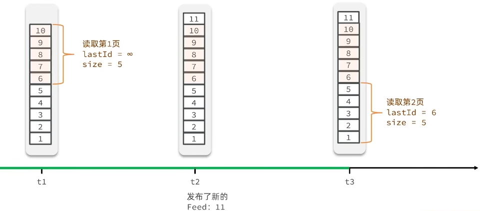

# 基于 Redis 的业务场景

- 短信登录
    - Redis session 共享应用
- 查询缓存
    - 缓存使用技巧
    - 缓存雪崩、穿透的解决
- 点赞功能
    - 基于 Set 的点赞列表
    - 基于 SortedSet 的点赞排行榜，类似于微信朋友圈的点赞排行榜
- 优惠券秒杀
    - Redis 的计数器`INCR`、Lua 脚本
    - Redis 分布式锁
    - Redis 的三种消息队列
- 好友关注
    - 基于 Set 集合的关注、取关、共同关注、消息推送等功能
- 附近的商家
    - Redis 的 GeoHash 的应用
- 用户签到
    - Redis 的 BitMap 数据统计功能

- UV 统计
    - Redis 的 HyperLogLog 的统计功能


## 1. 短信登录


- 基于 session 登录会在 cookie 中存储一个 session_id ，校验登录态时通过 cookie 携带这个 session_id 获取 session 中的登录信息
    - 因此只需将用户信息保存到 session 中即可，无需返回多余登录凭证到前端，登录过后后续再发送一个获取当前登录用户信息的请求即可完成完整的登录功能
    - 前端发送请求时，部分请求都需要进行校验登录态，因此可以将校验登录态功能写在拦截器里拦截这些请求，并在前置拦截器中将用户的信息保存在 ThreadLocal 里面，可以保证线程的安全；在后置拦截器里销毁 ThreadLocal 中的用户信息
- ThreadLocal
    - ThreadLocal 是 Java 中的一个类，它提供线程局部变量。这些变量在每个线程中都有自己独立的副本，因此对于不同的线程来说，**即使变量名相同，它们也不会共享同一份数据**。这使得在多线程环境下，每个线程都可以拥有该变量的一个独立实例，从而避免了并发访问的冲突问题，简化了线程安全的管理
    - 特性
        - 线程隔离：每个线程持有一个 ThreadLocal 变量的独立副本，因此在不同线程中对 ThreadLocal 变量的操作互不影响，实现了线程间数据的隔离。
        - 内存管理：ThreadLocal 会在线程结束时自动清除与该线程相关的变量副本，有助于防止内存泄漏，但需要注意的是，如果线程池中的线程是复用的，则需要显式清理 ThreadLocal 变量以避免潜在的内存泄漏
    - 应用场景
        - 当某个数据以线程为作用域，且不希望其在多线程间共享时，可以使用 ThreadLocal
        - 在进行对象跨层传递时，使用 ThreadLocal 可以减少参数传递，简化代码
        - 事务管理、数据库连接或会话管理等场景中，可以利用 ThreadLocal 存储线程特定的信息
- 短信发送验证码到手机需要**调用短信发送的 API**，例如：阿里云市场中的短信服务
    - 验证码可以存储在 session 中或者 redis 中并设置过期时间实现验证码的校验和超时失效功能


### session 共享问题

- 多台 Tomcat 并不共享 session 存储空间，当请求切换到不同 tomcat 服务时就会导致数据丢失的问题。

    - 可以使用 redis 来替代 session 存储用户信息，因为 redis 满足以下条件
        - 数据共享
        - 内存存储
        - key、value结构

  

- 基于 redis 实现共享 session 登录

    - 验证码以 string 结构存入 redis 中，key 可为`业务名:手机号`，并设置过期时间
    - 用户信息以 hash 结构存入 redis 中，key 可为`业务名:随机 token（uuid）`，并设置过期时间（session 是 30 min 过期），token 需要返回给前端，前端在请求头中`authorization` 字段中设置 token，每次请求就会携带上 token ，并在拦截器中更新 token 对应的 key 的过期时间达到刷新的 session 效果

- Redis 代替 session 需要考虑的问题:

    - 选择合适的数据结构
    - 选择合适的 key
    - 选择合适的存储粒度（去除敏感信息，只保存需要的信息）


### 登录拦截器优化

- 问题

    - 不是所有请求都会经过上面的拦截器进行登录态校验，进行 token 过期时间更新，比如用户一直在访问不需要登录验证的页面，超过时间就会需要重新登录

- 解决方案

  


## 2. 查询缓存

- 缓存就是数据交换的缓冲区( 称作 Cache )，是存贮数据的临时地方，一般读写性能较高

    - 缓存的作用
        - 降低后端负载提高读写效率，降低
        - 响应时间
    - 缓存的成本
        - 数据一致性成本（缓存与数据库数据不一致）
        - 代码维护成本
        - 运维成本

  

- 缓存作用模型，可以根据此模型在 redis 中添加缓存数据

  


### 缓存更新策略
|          | 内存淘汰                                                     | 超时剔除（过期淘汰）                                         | 主动更新                                     |
| :------: | ------------------------------------------------------------ | ------------------------------------------------------------ | -------------------------------------------- |
|   说明   | 不用自己维护，利用Redis的内存淘汰机制，当内存不足时自动淘汰部分数据下次查询时更新缓存 | 给缓存数据添加 TTL 时间，到期后自动删除缓存。下次查询时更新缓存。 | 编写业务逻辑，在修改数据库的同时，更新缓存。 |
|  一致性  | 差                                                           | 一般                                                         | 好                                           |
| 维护成本 | 无                                                           | 低                                                           | 高                                           |

- **缓存更新策略的最佳实践方案**
    - 低一致性需求: 使用内存淘汰机制。例如店铺类型的查询缓存
    - 高一致性需求: 主动更新（`Cache Aside Pattern`），并以超时剔除作为兜底方案。例如店铺详情查询的缓存
        - 读操作：
            - 缓存命中则直接返回
            - 缓存未命中则查询数据库，并写入缓存，设定超时时间
        - 写操作:
            - 先写数据库，然后再删除缓存
            - 要确保数据库与缓存操作的原子性


#### 主动更新策略

1. `Cache Aside Pattern`: 由缓存的调用者，在**更新数据库的同时更新缓存**
    - 需要人工编码，开发人员可控，一般开发时使用该策略
2. `Read/Write Through Pattern`: 缓存与数据库整合为一个服务，**由服务来维护一致性**。调用者调用该服务，无需关心缓存一致性问题。
    - 市面上很少存在这样的服务，即使有开发人员也不太好对服务进行维护
3. `Write Behind cachingPattern`: 调用者只操作缓存，**由其它线程异步的将缓存数据持久化到数据库**，保证最终一致
    - 异步可以大大提高系统性能
    - 维护异步线程成本较高，且数据一致性问题依然存在，考虑到 redis 宕机后缓存中的数据还未更新到数据库还会导致数据可靠性问题


- 在更新缓存时需要考虑的问题
    1. 删除缓存还是更新缓存?
        - 更新缓存: 每次更新数据库都更新缓存，无效写操作较多
        - 删除缓存: 更新数据库时让缓存失效，查询时再更新缓存
    2. 如何保证缓存与数据库的操作的同时成功或失败?
        - 单体系统，将缓存与数据库操作放在一个事务
        - 分布式系统，利用 TCC 等分布式事务方案
    3. 更新时先操作缓存还是先操作数据库?
        - 先删除缓存，再操作数据库
        - 先操作数据库，再删除缓存
            - 两种都存在线程安全问题，第二种出现线程安全问题的情况概率更低

### 缓存穿透

- 缓存穿透是指**客户端请求的数据在缓存中和数据库中都不存在**，这样缓存永远不会生效，这些请求都会打到数据库，给数据库带来压力

- 常见解决方案

    - **缓存空对象（null）**

        - 优点: 实现简单，维护方便
        - 缺点:
            - 额外的内存消耗
            - 可能造成短期的不一致

      

    - **布隆过滤**

        - 布隆过滤器由一个位数组（Bit Array）和一组哈希函数（Hash Functions）组成
        - 将查询元素通过同样的多个哈希函数进行哈希运算，产生多个哈希值。检查位数组中这些哈希值对应的位置是否全部为 1。
            - 如果全部为 1，说明该元素可能在集合中（存在一定的误判率）
            - 如果有任意一个位置为 0，说明该元素一定不在集合中
        - 优点: 内存占用较少，没有多余 key
        - 缺点:
            - 实现较复杂（redis 提供的 bitmap 可以实现布隆过滤）
            - 存在误判可能

      

- 其他措施

    - 增强 id 的复杂度，避免被猜测 id 规律，做好这些数据的基础格式校验
    - 加强用户权限校验
    - 做好热点参数的限流

### 缓存雪崩

- 缓存雪崩是指**在同一时段大量的缓存 key 同时失效**或者 **Redis 服务宕机，导致大量请求到达数据库**，带来巨大压力，可能导致数据库宕机

  

- 解决方案

    - 给不同的 Key 的 TTL 添加随机值
        - 保证缓存数据不再同一时间全部失效
    - 利用 Redis 集群提高服务的可用性
        - 避免 Redis 服务的宕机
    - 给缓存业务添加降级限流策略
        - 确保 Redis 服务的宕机时，快速拒绝请求，不直接请求数据库，保证数据库安全
    - 给业务添加多级缓存
        - 例如浏览器缓存、nginx 反向代理缓存、jvm 本地缓存等

### 缓存击穿

- 缓存击穿问题也叫热点 Key 问题，就是**一个被高并发访问并且缓存重建业务较复杂的 Key 突然失效了**，无数的请求访问会在瞬间给数据库带来巨大的冲击

  

- 解决方案

    - 互斥锁
  
      

        - 缺点：一个线程获取到锁后，其他线程会阻塞等待，性能低下

    - 逻辑过期：不给缓存数据设置 ttl，给数据添加一个逻辑过期时间字段，通过该字段判断数据是否过期

      

- 两种方案对比

  | 解决方案 | 优点                                           | 缺点                                         |
    | -------- | ---------------------------------------------- | -------------------------------------------- |
  | 互斥锁   | 没有额外的内存消耗<br/>保证一致性<br/>实现简单 | 线程需要等待，性能受影响<br/>可能有死锁风险  |
  | 逻辑过期 | 线程无需等待，性能较好                         | 不保证一致性<br/>有额外内存消耗<br/>实现复杂 |

- 如何获取和释放锁？

    - 通过 `setnx key value `命令达到加锁的功能

      

    - `get key` 获取锁

    - `del key` 删除锁

- 可以使用 **Jmeter** 实现多线程高并发测试、


## 3. 优惠券秒杀

### 全局唯一 ID

- 有一些业务使用数据库自增 ID 会存在一些问题
    - ID 的规律性太明显，导致暴露一些信息
    - 受单表数据量的限制，后续需要分表，使用自增 ID 会导致多张表出现相同的 ID

- 全局ID生成器，是一种在分布式系统下用来生成全局唯一 ID 的工具，一般要满足下列特性:
    - 唯一性
    - 高可用
    - 高性能
    - 递增性
    - 安全性

- 全局唯一ID生成策略:

    - UUID
        - 是字符串类型，占用空间大，不满足全局单调递增
    - Redis 自增
    - snowflake 雪花算法
    - 数据库自增
        - 单独使用一张表存储自增 ID 实现全局唯一 ID

- 基于 Redis 自增策略实现全局唯一 ID 示例:

    - 每天一个 key，方便统计订单量
    - ID 构造： 时间戳 + 计数器
        - 符号位: 1bit，永远为 0
        - 时间戳: 31bit，以秒为单位，可以使用 69 年
        - 序列号: 32bit，秒内的计数器，支持每秒产生 2^32 个不同ID

  

  ```java
  @Component
  public class RedisIDGenerate {
      /**
       * 初始时间戳
       * LocalDateTime.of(2024, 6, 1, 0, 0, 0).toEpochSecond(ZoneOffset.UTC)
       */
      private static final long BEGIN_TIMESTAMP= 1717200000L;
  
      private static final Integer BITS = 32;
  
      private StringRedisTemplate stringRedisTemplate;
  
      public RedisIDGenerate(StringRedisTemplate stringRedisTemplate) {
          this.stringRedisTemplate = stringRedisTemplate;
      }
  
      public long generateID(String prefix) {
          // 构造 ID 的时间戳
          LocalDateTime now = LocalDateTime.now();
          long timestamp = now.toEpochSecond(ZoneOffset.UTC) - BEGIN_TIMESTAMP;
          // 构造 ID 的序列号,基于 redis 的自增 ID
          String day = now.format(DateTimeFormatter.ofPattern("yyyy:MM:dd"));
          long increment = stringRedisTemplate.opsForValue().increment("icr:" + prefix + ":id" + day);
          return timestamp << BITS | increment;
      }
  }
  ```

  ```java
      @Autowired
      private RedisIDGenerate redisIDGenerate;
      private ExecutorService executorService = Executors.newFixedThreadPool(500);
  
      @Test
      void testGenerateID() throws InterruptedException {
          CountDownLatch countDownLatch = new CountDownLatch(300);
          Runnable runnable = () -> {
              for (int i = 0; i < 100; i++) {
                  System.out.println(redisIDGenerate.generateID("order"));
              }
              countDownLatch.countDown();
          };
          long start = System.currentTimeMillis();
          for (int i = 0; i < 300; i++) {
              executorService.submit(runnable);
          }
          countDownLatch.await();// 等待所有子线程执行完后才执行主线程
          long end = System.currentTimeMillis();
          System.out.println("耗时：" + (end - start));
      }
  ```

### 超卖问题

- 超卖问题本质上是一种高并发情况下的线程安全问题

  

- 解决方案：加锁

    - 悲观锁
        - 认为线程安全问题一定会发生，因此在操作数据之前先获取锁，确保线程串行执行。
        - 例如 `Synchronized`、`Lock` 都属于悲观锁
    - 乐观锁
        - 认为线程安全问题不一定会发生，因此不加锁，只是在更新数据时去判断有没有其它线程对数据做了修改。
            - 如果没有修改则认为是安全的，自己才更新数据。
            - 如果已经被其它线程修改说明发生了安全问题，此时可以重试或异常。

- 乐观锁的关键是**判断之前查询得到的数据是否有被修改过**，常见的乐观锁有两种:

    - **版本号**：

        - 给数据添加一个 `version` 字段，每次更新数据都要修改`version`，这样就可以通过在更新 SQL 中的 where 条件上添加判断当前要修改的数据的 `version` 字段是否与数据库中真实存在的数据的`version`一致，因此在多线程的情况下，一个线程更新了数据的版本后，另外的线程也不会更新成功

      

    - **CAS 法**：

        - 本质上就是将比较判断`version`字段改为比较判断数据原有字段，前提是数据中存在这样能进行比较的字段
        - CAS 是 “Compare and Swap”（比较与交换）的缩写，它是一种无锁算法，在多线程编程中用于实现同步原语。
        - CAS操作包含三个操作数：内存位置（V）、预期原值（A）和新值（B）。其执行过程如下：
            1. 比较：首先，CAS会比较内存位置V的值与预期原值A是否相等。
            2. 交换：如果相等，则将内存位置V的值更新为新值B。如果V的值与A不相等，则不执行任何操作。
            3. 原子性：整个比较并交换的过程是一个原子操作，这意味着它不会被线程调度机制打断，保证了多线程环境下的数据一致性。

      

        - CAS常用于构建 lock-free 数据结构，如无锁队列、栈等，以及原子变量（如Java中的AtomicInteger）的更新操作。
        - 相比传统的锁机制，CAS可以减少线程间的直接竞争，降低上下文切换的开销，提高程序的并发性能。
        - 但是，它也可能引发 **ABA** 问题，以及在持续竞争激烈的情况下**导致大量的失败重试**，从而影响性能。为此，一些算法和数据结构设计会结合版本号或者使用更复杂的同步机制来解决这些问题。

- 两种锁的比较

    - 悲观锁: 添加同步锁，让线程串行执行
        - 优点:简单粗暴
        - 缺点:性能一般
    - 乐观锁: 不加锁，在更新时判断是否有其它线程在修改
        - 优点: 性能好
        - 缺点: 存在成功率低的问题

### 一人一单

- 秒杀业务中会存在一人一单的业务场景

    - 该业务场景下也会出现线程安全问题，需要控制查询订单和判断订单是否存在时只能有一个线程进入

  

- 解决方案

    - 悲观锁

        - 可以对用户 ID 进行加锁（`synchronized`），确保一个用户线程可以执行逻辑任务

        - 注意：

            1. 用户 ID 是从用户对象中获取的，每次获取到同一个用户的用户 ID 值是一样的，但是在 Java 中不是同一个用户对象的用户 ID，因此加锁会失败。

                - 解决方案如下，确保加锁的同一个用户的用户 ID 是唯一的

                  ```java
                  synchronized(userId.toString().intern()){
                      ....
                  }
                  ```

            2. 需要确保事务提交完后再释放锁，可以将锁放在事务外面

               ````java
               synchronized(userId.toString().intern()){
                   //基于事务的业务逻辑
                   ....
               }
               ````

            3. 还需要注意 spring 事务失效的情况，可以通过拿到事务的代理对象去调用事务方法解决 spring 事务失效的问题

               ```java
               //获取事务的代理对象
               Object o = AopContext.currentProxy();
               ```

               > 需要引入  AspectJ 的依赖
               >
               > 并在启动类上添加`@EnableAspectJAutoProxy(exposeProxy = true)`

### 分布式锁

- `synchronized`方案只能解决单机线程安全问题，在服务集群下就会存在分布式线程安全问题

  

- 分布式锁：满足分布式系统或集群模式下**多进程可见**并且**互斥**的锁

    - 特性
        - 多进程可见
        - 互斥
        - 高可用
        - 高性能
        - 安全性

- 分布式锁的原理

  

- 分布式锁的实现

  |        | MySQL                                                        | Redis                     | Zookeeper                        |
    | ------ | ------------------------------------------------------------ | ------------------------- | -------------------------------- |
  | 说明   | `SELECT FOR UPDATE` 是 SQL 中的一个命令，主要用于数据库事务处理中，以实现行级别的悲观锁机制（但根据数据库的具体实现和配置，也可能是表锁） |                           |                                  |
  | 互斥   | 利用 mysql 本身的互斥锁机制                                  | 利用`setnx`这样的互斥命令 | 利用节点的唯一性和有序性实现互斥 |
  | 高可用 | 好                                                           | 好                        | 好                               |
  | 高性能 | 一般                                                         | 好                        | 一般                             |
  | 安全性 | 断开连接，自动释放锁                                         | 利用锁超时时间，到期释放  | 临时节点，断开连接自动释放       |


- 如何获取锁和释放锁

    - 获取锁

        - 互斥：确保只能有一个线程获取锁

          ```bash
          setnx lock thread1
          # 给锁添加过期时间
          expire lock 10
          # 查看过期过期时间
          ttl lock
          ```

        - 原子操作

            - 非阻塞：尝试一次，成功返回 true，失败返回false

          ```bash
          set lock thread1 ex 10 nx
          ```

    - 删除锁

        - 手动释放：

          ```bash
          # 删除锁
          del lock
          ```

        - 超时释放：获取锁时添加一个超时时间

- 分布式锁流程

  

- 分布式锁误删

  上面的流程在业务阻塞时间过长的情锁超时释放况下会存在锁的误删，应该在删除锁时判断锁的标识与当前线程是否一致

  

    - 需要确保判断锁标识和释放锁操作的原子性，否则在判断锁标识成功后进入长时间的阻塞（例如：full gc）依然会出现锁的误删情况

      

        - 解决方案
            1. 基于 redis 的事务和乐观锁 watch 机制解决，比较复杂
            2. Lua 脚本
                - Redis 提供了 Lua 脚本功能，在一个脚本中编写多条 Redis 命令，确保多条命令执行时的原子性

#### Lua 脚本

- Redis 使用 Lua 脚本来实现操作的原子性，主要是因为Redis 服务器会将整个 Lua 脚本作为单一的命令执行，期间不会被其他命令中断。这样，脚本中的所有 Redis 命令都会在同一个 Redis 事务中执行，确保了操作的原子性。以下是使用 Lua 脚本实现原子操作的基本步骤

    1. 编写 Lua 脚本：在 Lua 脚本中，你可以调用 `redis.call()` 或 `redis.pcall()` 来执行 Redis 命令。这些调用在执行时具有原子性。

    2. 发送脚本到 Redis：使用 `EVAL` 或 `EVALSHA` 命令将 Lua 脚本发送到 Redis 服务器执行。`EVALSHA` 是在脚本已经通过 `SCRIPT LOAD` 命令预加载到 Redis 后使用的，可以减少网络传输量。

       

    3. 处理结果：Redis 执行完脚本后，会返回脚本执行的结果。

- 基于 Lua 脚本实现 redis 判断锁释放锁操作原子性

  ```lua
  -- unlock.lua
  -- keys[1] 是传入的 key 数组，argv[1] 是传入的其他参数数组
  -- 比较当前线程是否一致与锁的标识
  if (redis.call('get',keys[1]) == argv[1]) then
      return redis.call('del',keys[1])
  end
  return 0
  ```

  ```java
  public interface ILock {
  
      boolean tryLock(String lockKey, String requestId, long expireTime);
  
      void unlock(String lockKey, String requestId);
  }
  ```

  ```java
  import java.util.Collections;
  import java.util.concurrent.TimeUnit;
  import com.lhk.redis_study.lock.ILock;
  import org.springframework.core.io.ClassPathResource;
  import org.springframework.data.redis.core.StringRedisTemplate;
  import org.springframework.data.redis.core.script.DefaultRedisScript;
  
  public class RedisLock implements ILock {
      private static final String LOCK_PREFIX = "lock:";
      private StringRedisTemplate stringRedisTemplate;
      private static final DefaultRedisScript<Long> UNLOCK_SCRIPT;
  
      static {
          UNLOCK_SCRIPT = new DefaultRedisScript<>();
          UNLOCK_SCRIPT.setLocation(new ClassPathResource("unlock.lua"));
          UNLOCK_SCRIPT.setResultType(Long.class);
      }
  
      public RedisLock(StringRedisTemplate stringRedisTemplate) {
          this.stringRedisTemplate = stringRedisTemplate;
      }
  
      @Override
      public boolean tryLock(String lockKey, String requestId, long expireTime) {
          Boolean ifAbsent = stringRedisTemplate.opsForValue().setIfAbsent(LOCK_PREFIX + lockKey, requestId, expireTime, TimeUnit.MILLISECONDS);
          return Boolean.TRUE.equals(ifAbsent);
      }
  
      @Override
      public void unlock(String lockKey, String requestId) {
          stringRedisTemplate.execute(
                  UNLOCK_SCRIPT,
                  Collections.singletonList(LOCK_PREFIX + lockKey),
                  requestId);
      }
  
  //    @Override
  //    public void unlock(String lockKey, String requestId) {
  //        String id = stringRedisTemplate.opsForValue().get(LOCK_PREFIX + lockKey);
  //        if (id.equals(requestId)){
  //            stringRedisTemplate.delete(LOCK_PREFIX + lockKey);
  //        }
  //        System.out.println("unlock");
  //    }
  }
  ```

#### 分布式锁优化

- 上述基于 string 类型的 setnx 实现的锁基本可以满足大多数情况下的锁要求

- 但是基于 setnx 实现的分布式锁依然存在问题
    1. 不可重入
        - 同一个线程无法多次获取同一把锁
    2. 不可重试
        - 获取锁只尝试一次就返回 false，没有重试机制
    3. 超时释放
        - 锁超时释放虽然可以避免死锁，但如果是业务执行耗时较长，也会导致锁释放，存在安全隐患
    4. 主从一致性
        - 如果Redis提供了主从集群主从同步存在延迟，当主添加锁成功后宕机时，此时从同步主的锁数据失败，其他线程又可以添加锁，则会出现线程安全问题
- 上述的这些问题要解决比较麻烦，因此不推荐自己实现，可以使用市面上成熟的框架，例如 Redisson

#### Redisson

- 官网：[Redisson: Easy Redis Java client and Real-Time Data Platform](https://redisson.org/)

- Redisson 是一个在 Redis 的基础上实现的 Java 驻内存数据网格(In-Memory Data Grid)。它不仅提供了一系列的分布式的 Java 常用对象，还提供了许多分布式服务，其中就包含了各种分布式锁的实现。

- 引入依赖

  ```xml
          <dependency>
              <groupId>org.redisson</groupId>
              <artifactId>redisson</artifactId>
              <version>3.32.0</version>
          </dependency>
  ```

- 配置 Redisson

  ```java
      @Bean
      public RedissonClient redissonClient() throws IOException {
          Config config = new Config();
          config.useSingleServer().setAddress("redis://127.0.0.1:6379").setPassword("12356");
          return Redisson.create(config);
      }
  ```

- 测试锁

  ```java
      @Autowired
      RedissonClient redissonClient;
  
      @Test
      void testRedisson() throws InterruptedException {
          // 获取可重入锁
          RLock lock = redissonClient.getLock("myLock");
          // 尝试获取锁,参数分别是:获取锁的最大等待时间(期间会重试)，锁自动释放时间，时间单位
          boolean tryLock = lock.tryLock(2, 10, TimeUnit.SECONDS);
          // 获取锁成功
          if (tryLock){
              try {
                  System.out.println("获取锁成功");
              } catch (Exception e) {
                  e.printStackTrace();
              }finally {
                  // 释放锁
                  lock.unlock();
              }
          }
      }
  ```

##### Redisson 可重入锁

- 锁重入

    - 一个线程可以多次获取锁

    - 例：

      ```java
          RLock lock = redissonClient.getLock("myLock");
      
          @Test
          void method1() throws InterruptedException {
              boolean tryLock = lock.tryLock();
              if (!tryLock){
                  System.out.println("方法一获取锁失败");
                  return;
              }
              try {
                  System.out.println("方法一获取锁成功");
                  System.out.println("执行业务一");
                  method2();
              } catch (Exception e) {
                  e.printStackTrace();
              }finally {
                  System.out.println("方法一释放锁");
                  lock.unlock();
              }
          }
      
          @Test
          void method2() throws InterruptedException {
              boolean tryLock = lock.tryLock();
              if (!tryLock){
                  System.out.println("方法二获取锁失败");
                  return;
              }
              try {
                  System.out.println("执行业务二");
              } catch (Exception e) {
                  e.printStackTrace();
              }finally {
                  System.out.println("方法二释放锁");
                  lock.unlock();
              }
          }
      ```

- 可重入锁的基本实现原理：当锁已经存在时，再次获取锁时判断锁标识是否同一个线程的，为真就可以再次获取这把锁，并对锁的重入次数进行一个计数（通常是有一个用于计数的字段），每重入一次就加一，每次释放就减一

- Redisson 可重入锁使用 redis 的 hash 结构并基于 lua 脚本（确保获取锁和释放锁的原子性）实现可重入锁，Redisson 会在 hash 结构的锁中维护锁标识和锁的重入次数计数器

    - 实现流程

      

- 自定义获取锁的 lua 脚本

  ```lua
  local key = KEYS[1]; -- 锁的 key
  local threadId = ARGV[1]; -- 线程唯一标识
  local releaseTime = ARGV[2]; -- 锁自动解锁时间
  -- 判断锁是否存在
  -- 不存在，获取锁
  if(redis.call('exists',key) == 0) then
      redis.call('hset',key,threadId,'1');
      -- 设置过期时间
      redis.call('expire',key,releaseTime);
      return 1;
  end
  -- 锁存在，判断是否是当前线程获取锁
  if(redis.call('hexists',key,threadId) == 1) then
      -- 是同一个线程，重入次数+1
      redis.call('hincrby',key,threadId,1);
      -- 设置过期时间
      redis.call('expire',key,releaseTime);
      return 1;
  end
  return 0;
  ```

- 自定义释放锁的 lua 脚本

  ```lua
  local key = KEYS[1]; -- 锁的 key
  local threadId = ARGV[1]; -- 线程唯一标识
  local releaseTime = ARGV[2]; -- 锁自动解锁时间
  
  -- 判断锁是否是当前线程的
  -- 如果不是，直接返回
  if(redis.call('hexists',key,threadId) == 0)then
      return nil;
  end;
  -- 锁是否是当前线程的,重入次数减一
  local count = redis.call('hincrby',key,threadId,-1);
  -- 判断锁重入次数
  -- 次数大于 0 说明不能释放锁
  if (count > 0) then
      -- 设置过期时间
      redis.call('expire',key,releaseTime);
      return nil;
  else
      -- 次数等于 0 说明可以释放锁
      redis.call('del',key);
      return nil;
  end;
  ```

- 查看 Redisson 底层获取锁、释放锁源码

  

  

##### Redisson 锁重试机制和 WatchDog （看门狗）机制

- 锁重试
    - Redisson 的 `tryLock` 方法可以指定一个 `waitTime` 参数表示获取锁的最大等待时间，在这个时间内若是线程没有获取到锁会尝试重试获取锁
        - 此处的重试获取锁是利用 redis 的发布订阅功能进行重试，即线程没获取到锁不是直接重试获取锁，而是先订阅当前锁是否释放，释放后若最大等待时间还足够，再进行重试，具体需要阅读源码
- 锁超时释放问题：业务未执行完毕锁就自动释放了
    - Redisson 中使用 WatchDog （看门狗）机制实现了锁的自动续期，达到锁永不过期的目的，解决锁超时释放的问题，只有在释放锁的时候会取消定时自动续期锁
        - Redisson 的 `tryLock` 方法不指定 `leaseTime` 参数就可以达到上述功能
    - 看门狗（Watchdog）模式:
        - 在获取锁的同时，启动一个后台线程（看门狗）。
          看门狗负责在锁到期前定期（比如锁剩余时间的 1/3 ）向Redis发送命令，延长锁的过期时间。
          这要求锁的持有者在完成工作前保持活跃，并能及时终止看门狗，避免无谓的续期。


##### Redisson 的 multiLock

- 分布式锁主从一致性问题
    - 分布式锁主从一致性问题是指在基于Redis的主从架构中，由于主节点和从节点之间数据同步的延迟，可能导致分布式锁的功能失效，从而影响系统的数据一致性和业务逻辑正确性。
    - 具体来说，这个问题主要体现在以下几个方面：
        1. 锁信息同步延迟：在主从架构的Redis集群中，客户端通常会在主节点上获取锁，然后主节点会将锁的信息异步复制到从节点。但是，这个复制过程并非瞬时完成的，存在一定的延迟。如果在这段时间内主节点发生故障，并且一个从节点被提升为主节点，新主节点可能还没有接收到之前的锁信息，就会造成锁丢失，即原本已被锁定的资源可能被其他客户端误认为未上锁而再次获取锁，导致并发访问冲突。
        2. 锁续期与失效问题：在锁的有效期内，如果客户端定期续期来保持锁的状态，但主节点故障发生在续期操作之前，那么即使客户端在原主节点成功续期，新的主节点也不会有关于这个锁的任何信息，导致锁提前失效。
        3. 锁释放问题：客户端在主节点上成功释放了锁，但由于主从同步延迟，从节点上还未接收到释放锁的操作，此时若主节点故障，从节点晋升成主节点后，该锁仍然被视为有效，导致锁无法被其他客户端获取。
- 为了解决这些问题，Redisson 等客户端库提供了多种策略，如 `multiLock`（联锁）、使用 Lua 脚本保证操作的原子性、锁续期机制等，来增强分布式锁的可靠性和一致性。特别是 `multiLock` 方案，可以通过在多个 Redis 节点上同时加锁，增加锁操作的鲁棒性，确保在主节点故障时，依然能够维持锁的正确状态
- `multiLock`原理
    - 多个独立的 Resis 节点，必须在所有节点都获取重入锁，才算获取锁成功
    - 缺点
        - 运维成本高、实现复杂

##### Redisson 分布式锁原理

- 可重入锁: 利用 hash 结构记录线程 id 和重入次数
- 可重试: 利用信号量和 PubSub 功能实现等待、唤醒，获取
  锁失败的重试机制
- 锁超时续约: 利用 watchDog，每隔一段时间( `releaseTime
  /3`)，重置超时时间
- 锁的主从一致性：Redisson 的 multiLock 可以解决

### 秒杀业务优化

- 秒杀业务的优化思路
    - 先利用 Redis 和 lua 脚本完成库存余量、一人一单判断，完成抢单业务
    - 再将下单业务放入阻塞队列，利用独立线程异步下单
        - 可以使用 `java.util.concurrent` 包下的 `BlockingQueue` 阻塞队列来实现独立线程异步下单


### Redis 实现消息队列

- 消息队列 (Message Queue)，字面意思就是存放消息的队列。最简单的消息队列模型包括 3 个角色:

    - 消息队列: 存储和管理消息，也被称为消息代理(Message Broker)
    - 生产者: 发送消息到消息队列
    - 消费者: 从消息队列获取消息并处理消息

  

- Redis 提供了三种不同的方式来实现消息队列:
    1. list 结构: 基于 List 结构模拟消息队列
    2. PubSub: 基本的点对点消息模型
    3. Stream: 比较完善的消息队列模型

|              | List                                 | Pubsub             | Stream                                                 |
| ------------ | ------------------------------------ | ------------------ | ------------------------------------------------------ |
| 消息持久化   | 支持                                 | 不支持             | 支持                                                   |
| 阻塞读取     | 支持                                 | 支持               | 支持                                                   |
| 消息堆积处理 | 受限于内存空间，可以利用多消费者加快 | 受限于消费者缓冲区 | 受限于队列长度，可以利用消费者组提高消费速度，减少堆积 |
| 消息确认机制 | 不支持                               | 不支持             | 支持                                                   |
| 消息回湖     | 不支持                               | 不支持             | 支持                                                   |

- 这里的持久化是基于 Redis 的持久化，不能确保消息万无一失
- 这里的消息确认机制只支持消费者的确认机制，不支持生产者的确认机制

#### 1. 基于List 结构模拟消息队列

- 队列是入口和出口不在一边，因此我们可以利用: `LPUSH`  结合 `RPOP`、或者 `RPUSH` 结合 `LPOP` 来实现
- 不过要注意的是，当队列中没有消息时 `RPOP` 或 `LPOP` 操作会返回 `null`，并不像 JVM 的阻塞队列那样会阻塞并等待消息。
    - 因此可以使用 `BRPOP` 或者 `BLPOP` 来实现阻塞效果（有元素就取，无元素就等）

- 优点:
    - 利用 Redis 存储，不受限于 JVM 内存上限
    - 基于 Redis 的持久化机制，数据安全性有保证
    - 可以满足消息有序性
- 缺点:
    - 无法避免消息丢失
    - 只支持单消费者

#### 2. 基于 PubSub 的消息队列

- Pubsub (发布订阅)是 Redis2.0 版本引入的消息传递模型。顾名思义，消费者可以订阅一个或多个 channel，生产者向对应 channel 发送消息后，所有订阅者都能收到相关消息。
- 相关命令
    - `PUBLISH channel msg` : 向一个频道发送消息
    - `SUBSCRlBE channel [channel]`: 订一个或多个频道
    - `RSUBSCRlBE pattern [pattern]`: 订阅与 pattern 格式匹配的所有频道

- 优点:
    - 采用发布订阅模型，支持多生产、多消费
- 缺点:
    - 不支持数据持久化
    - 无法避免消息丢失
    - 消息堆积有上限，超出时数据丢失

#### 3. 基于 Stream 的消息队列

##### 3.1 单消费模式

- Stream 是 Redis 5.0 引入的一种新数据类型，可以实现一个功能非常完善的消息队列

- 相关命令

    - 官方文档：[stream| Docs (redis.io)](https://redis.io/docs/latest/commands/?group=stream)

    - `xadd`：发消息

      

        - 例：

          ```bash
          # 发消息
          xadd mystream * message hello
          # 查看消息数量
          xlen mystream
          ```

    - `xread`：读消息

      

        - 例：

          ```bash
          # 读消息
          xread count 1 streams mystream 0
          ```

        - 当指定起始 ID 为 `$` 时，代表读取最新的消息，如果我们处理一条消息的过程中，又有超过1条以上的消息到达队列，则下次获取时也只能获取到最新的一条，会出现漏读消息的问题

- STREAM 类型消息队列的 `XREAD` 命令特点:

    - 消息可回溯，消息对保存在 stream 数据结构中
    - 一个消息可以被多个消费者读取
    - 可以阻塞读取
    - 有消息漏读的风险

##### 3.2 消费者组

- 消费者组 (Consumer Group) : 将多个消费者划分到一个组中，监听同一个队列。具备下列特点:
    1. 消息分流（解决消息堆积问题）
        - 队列中的消息会分流给组内的不同消费者，而不是重复消费，从而加快消息处理的速度
    2. 消息标示（解决消息漏读问题）
        - 消费者组会维护一个标示，记录最后一个被处理的消息，哪怕消费者宕机重启，还会从标示之后读取消息。确保每一个消息都会被消费
    3. 消息确认（解决消息丢失问题）
        - 消费者获取消息后，消息处于 pending 状态，并存入一个 pending-list。当处理完成后需要通过 `XACK` 来确认消息，标记消息为已处理，才会从 pending-list 移除

- 相关命令

  ```shell
  # 创建消费者组
  XGROUP CREATE key groupname ID|$ [MKSTREAM]
  # 例
  XGROUP create mystream group1 0
  
  # 删除指定消费者组
  XGROUP DESTROY key groupname
  
  # 给指定消费者组添加消费者
  XGROUP CREATECONSUMER key groupname consumername
  
  # 删除消费者组中指定消费者
  XGROUP DELCONSUMER key groupname consumername
  ```

    - `key`: 队列名称
    - `groupName`: 消费者组名称
    - `ID`: 起始 ID 标示，$ 代表队列中最后一个消息，0 则代表队列中第一个消息
    - `MKSTREAM`: 队列不存在时自动创建队列（默认）

  ```shell
  # 从消费者组读取消息
  XREADGROUP GROUP group consumer [COUNT count] [BLOCK milliseconds] [NOACK] STREAMS key [key ...] ID [ID ...]
  # 例，读取未消费的消息
  XREADGROUP group group1 consumer1 count 1 block 2000 streams mystream >
  ```

    - `group`: 消费组名称
    - `consumer`: 消费者名称，如果消费者不存在，会自动创建一个消费者
    - `count`: 本次查询的最大数量
    - `BLOCK milliseconds`: 当没有消息时最长等待时间
    - `NOACK`: 无需手动 ACK，获取到消息后自动确认
    - `STREAMS key`: 指定队列名称
    - `ID`: 获取消息的起始 ID:
        - `>`: 从下一个未消费的消息开始
        - 其它: 根据指定 id 从 pending-list 中获取已消费但未确认的消息，例如 0，是从 pending-list 中的第一个消息开始

  ```shell
  # 确认消息已消费，并将消息从 pending-list 移除
  XACK key group ID [ID ...]
  # 例
  XACK mystream group1 1720096327447-0
  ```

  ```shell
  # 查看 pending-list 中的消息
  XPENDING key group [[IDLE min-idle-time] start end count [consumer]]
  # 例
  XPENDING mystream group1 - + 10
  # 读取 pending-list 中的消息
  XREADGROUP group group1 consumer1 count 1 block 2000 streams mystream 0
  ```

- STREAM类型消息队列的 `XREADGROUP` 命令特点
    - 消息可回溯
    - 可以多消费者争抢消息，加快消费速度
    - 可以阻塞读取
    - 没有消息漏读的风险
    - 有消息确认机制，保证消息至少被消费一次

- 在 Java 中使用

  ```java
      @Test
      void testStream() {
          List<MapRecord<String, Object, Object>> records = stringRedisTemplate.opsForStream().read(
                  Consumer.from("group1", "consumer1"),
                  StreamReadOptions.empty().count(1).block(Duration.ofSeconds(2)),
                  StreamOffset.create("mystream", ReadOffset.lastConsumed())
          );
          records.forEach(record -> {
              System.out.println(record.getId());
              System.out.println(record.getValue());
          });
      }
  ```


## 4. 点赞功能

- 文章点赞功能：
    - 需要在数据库中存一个点赞数量的字段，点赞就加一，取消点赞就减一
    - 使用 redis 的 set 结构维护 key 为文章 ID，value 存用户 ID 的数据
        - 使用 `ismember` 命令可用于判断用户是否点赞过文章，实现一个用户只能点赞一次
- 点赞列表根据点赞时间排序功能
    - 将 set 结构改成 sortedSet ，key 为文章 ID，score 为用户点赞的时间戳，value 为用户 ID
        - 使用 `zscore ` 命令可用于判断用户是否点赞过文章， `zscore key vaule` 会返回 score，不存在会发挥 `nil`
        - 使用`zrange` 命令可以查询出点赞文章的所有用户 ID，然后再通过用户 ID 去数据库查询用户信息返回给前端


## 5. 好友关注

- 设计一张关注表，包含主键、用户 ID、关注用户 ID
    - 用于存储好友关注信息

### 共同关注功能

- 当前登录用户与查询的某个用户关注的共同好友，即求两个用户关注好友的交集
    - 可以使用 redis 的 set 结构存储关注的好友的信息，并使用 `sinter` 命令可以实现 set 集合求交集功能
    - 每次关注好友时，同时将关注的好友的信息存储到 redis 中；取关时，同时移除 redis 的关注的好友的信息。key 为当前用户 ID，value 为关注的好友的 ID

### 关注推送

- 关注推送也叫做 **Feed 流**，直译为投喂。为用户持续的提供“沉浸式”的体验，通过**无限下拉刷新获取新的信息（类似抖音）**

    - 传统模式是用户找内容（搜索）
    - Feed 流模式是根据内容匹配对应的用户（推送）
        - 用户无需思考，直接投喂用户喜爱的内容

- **Feed 流**产品有两种常见模式

    1. **Timeline**: 不做内容筛选，简单的按照内容发布时间排序，常用于好友或关注。例如：**朋友圈、微博等**
        - 优点: 信息全面，不会有缺失。并且实现也相对简单
        - 缺点: 信息噪音较多，用户不一定感兴趣，内容获取效率低
    2. **智能排序**: 利用智能算法屏蔽掉违规的、用户不感兴趣的内容。推送用户感兴趣信息来吸引用户，例如：**抖音**
        - 优点: 投喂用户感兴趣信息，用户粘度很高，容易沉迷
        - 缺点: 如果算法不精准，可能起到反作用

- 在不同的平台，Feed 流可能有不同的名称和实现方式。

    - 例如：
        - 在抖音（TikTok）中，Feed 流通常指的是“推荐”页面上的内容，这些内容是根据用户的兴趣、观看历史和互动行为通过算法个性化推荐的。
        - 在微博、Instagram、Facebook 等平台上，Feed 流则可能包括关注的好友、品牌或媒体账号发布的最新动态
    - 因此：关注推送功能的实现会选择 Feed 流的 **Timeline** 模式

- Feed 流实现方案有三种

    1. 拉模式，也叫读扩散

        - 粉丝端拉取其关注的所有博主创作的内容，并按时间排序后粉丝端可依次读取出

    2. 推模式，也叫写扩散

        - 博主端推送其创作的内容给所有关注该博主的粉丝，并按时间排序后粉丝端可依次读取出

    3. 推拉结合，也叫做读写混合，兼具推和拉两种模式的优点

        - 对于小博主粉丝数量不多，可直接对所有粉丝使用推模式

        - 对于大博主粉丝数量多，可对活跃粉丝（少数）使用推模式，对僵尸粉（多数）使用拉模式

  |              | 拉模式   | 推模式            | 推拉结合              |
    | ------------ | -------- | ----------------- | --------------------- |
  | 写比例       | 低       | 高                | 中                    |
  | 读比例       | 高       | 低                | 中                    |
  | 用户读取延迟 | 高       | 低                | 低                    |
  | 实现难度     | 复杂     | 简单              | 很复杂                |
  | 使用场景     | 很少使用 | 用户量少、没有大V | 过千万的用户量，有大V |

- 可以基于 Redis 实现 feed 流推模式

    - 博主创作内容的同时将内容 ID 存储在 Redis 中，分页后再根据 ID 到数据库查询到内容返回给前端

    - Feed 流的分页问题

        - Feed 流中的数据会不断更新，所以数据的角标也在变化，因此不能采用传统的分页模式

          

        - Feed 流的滚动分页

          

    - 考虑到上述问题，可以使用 Redis 的 sortedSet 结构存储投喂的内容（即博主创作的内容） ID

        - 原因：sortedSet 可以基于 score 实现滚动分页，使用 `zrevrangebyscore` 命令
        - key 为粉丝 ID，value 存博主创作的内容 ID，score 存时间戳
        - 博主创作完内容的同时需要将内容 ID 推送给他的粉丝，即将内容 ID 存储到 Redis 中

## 6. 附近的商家

- 可以使用 Redis 的 GEO 结构实现此功能
    - 按照商户类型做分组，类型相同的商户作为同一组，以 typeld（商户类型 id） 为 key ，将相同类型的商户坐标存入同一个 GEO 集合中即可
    - `GEODIST` 命令可以求两个坐标的距离
    - `GEOSEARCH`命令可以查询出某个范围的坐标
    - spring-data-reids 提供相关命令的 API: `stringRedisTemplate.opsForGeo()`


## 7. 用户签到

- 用户签到这种类型的数据的数据量一般来说是非常大的，因此这种签到信息可以使用 BitMap（位图） 结构进行存储，可以大大减小缓存数据容量

    - 因此用户签到功能的基本思路：构造一个 31 位的 BitMap ，把每一个 bit 位对应当月的每一天，形成映射关系，用 0 和 1 标示签到状态
    - 在 Redis 中，由于 BitMap 底层是基于 String 数据结构，因此其操作也都封装在字符串相关操作中了
    - 存储在 Redis 中，key 可以为`用户ID+年月`，value 为 31 位的 BitMap

  ```java
      @Test
      void testBitMap() {
          LocalDateTime now = LocalDateTime.now();
          String keySuffix = now.format(DateTimeFormatter.ofPattern(":yyyyMM"));
          String userId = "1";
          String key = ":sign:"+ userId + keySuffix;
          int day = now.getDayOfMonth();
          stringRedisTemplate.opsForValue().setBit(key, day-1, true);
          System.out.println("ok");
      }
  ```

- 统计最近连续签到天数

    - 从最后一次签到开始向前统计，直到遇到第一次未签到为止，计算总的签到次数，就是连续签到天数

    - 使用 `bitfiled` 命令可以获取从第一天到最后一天的十进制数，对该十进制数进行位操作可以统计出连续签到数


## 8. UV 统计

- `UV`: 全称 Unique Visitor，也叫独立访客量，是指通过互联网访问、浏览这个网页的自然人。1天内同一个用户多次访问该网站，只记录 1 次

- `PV`: 全称 Page View，也叫页面访问量或点击量，用户每访问网站的一个页面，记录 1 次 PV，用户多次打开页面，则记录多次PV。往往用来衡量网站的流量

- UV 统计在服务端做会比较麻烦，因为要判断该用户是否已经统计过了，需要将统计过的用户信息保存。但是如果每个访问的用户都保存到 Redis 中，数据量会非常恐怖

- 由于 HyperLogLog 内存占用极低，作为代价，其测量结果是概率性的，有小于0.81%的误差。不过对于 UV 统计来说，这完全可以忽略，且 HyperLogLog 不会存储重复元素，非常适合用来做 `UV` 统计

    - 实现思路：只需要将数据往 HyperLogLog  里面存放即可

  ```java
      void testHyperLogLog() {
          String key = "hll";
          String[] values = new String[10000];
          int j = 0;
          for (int i = 0; i < 1000000; i++) {
              j = i % 10000;
              values[j]= "user_"+i;
              if (j == 9999) {
                  stringRedisTemplate.opsForHyperLogLog().add(key, values);
              }
          }
          System.out.println("count: "+stringRedisTemplate.opsForHyperLogLog().size(key));
      }
  ```

