---
sidebar_position: 1
---
# Redis 的安装及启动

## 1.将 Redis 安装包移动到 Linux 中
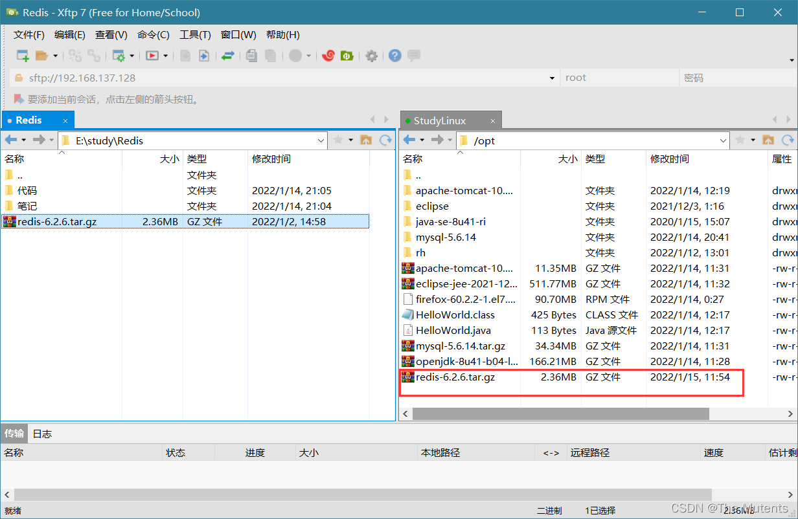

## 2.安装 C 语言的编译环境（gcc 编译器）
- 安装 gcc 命令
    ```bash
    yum install gcc
    ```
- 查看gcc版本
    ```bash
    gcc --version
    ```
  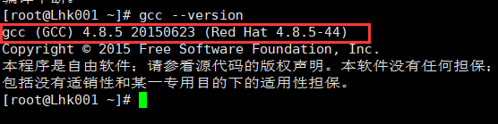
## 3.解压 Redis 安装包

```bash
tar zxvf redis-6.2.6.tar.gz 
```
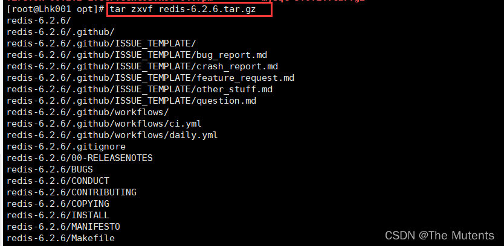

## 4. 将解压的文件编译成 c 文件

```bash
[root@Lhk001 redis-6.2.6]# cd redis-6.2.6/
[root@Lhk001 redis-6.2.6]# make
```

编译完成
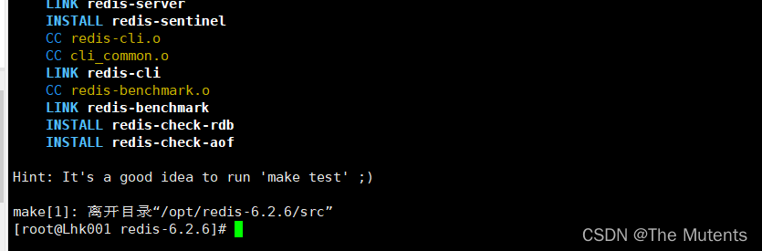

## 5.安装Redis
 
```bash
make install 
```

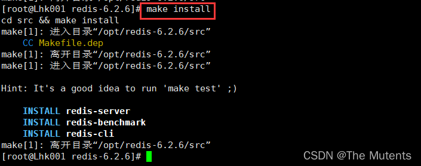

默认安装在 `/usr/local/bin` 目录下

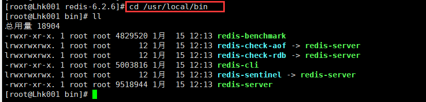

- 各个文件的作用

  | 文件名 | 作用 |
  | --- | --- |
  | redis-benchmark | 性能测试工具，可以在自己本子运行，看看自己本子性能如何 |
  | redis-check-aof | 修复有问题的AOF文件，rdb和aof后面讲 |
  | redis-check-dump | 修复有问题的dump.rdb文件  |
  | redis-sentinel | Redis集群使用 |
  | redis-server | Redis服务器启动命令 |
  | redis-cli | 客户端，操作入口 |


## 6. 启动
### 6.1 前台启动
启动时需要进入 `/usr/local/bin` 目录下才能进行启动 `redis-server`

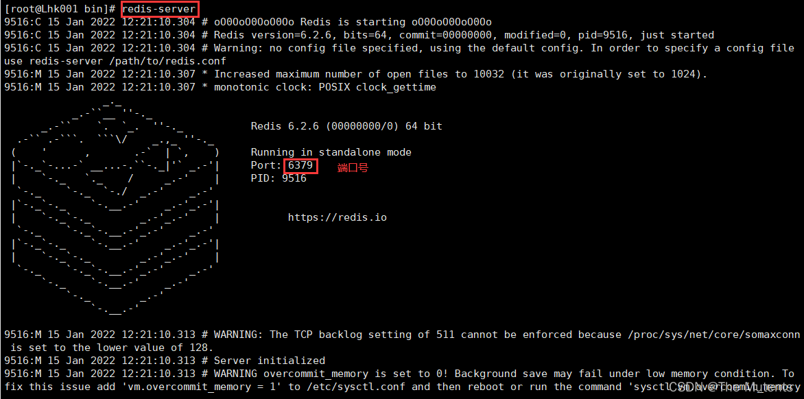

> 这种启动方式启动redis后，该窗口不能进行其他的操作，且一旦关闭启动的窗口，则 redis 也关闭

### 6.2 后台启动
1. 备份 redis.conf 
   - 将 redis.conf 备份到了/etc/ 目录下
   
     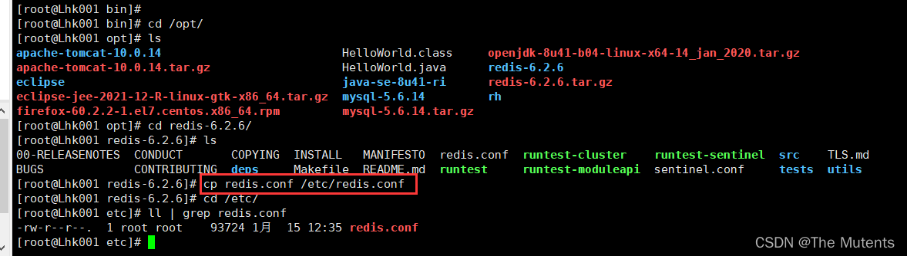
   
2. 修改 redis.conf 文件将里面的 `daemonize no` 改成 `yes`，让服务在后台启动

   
   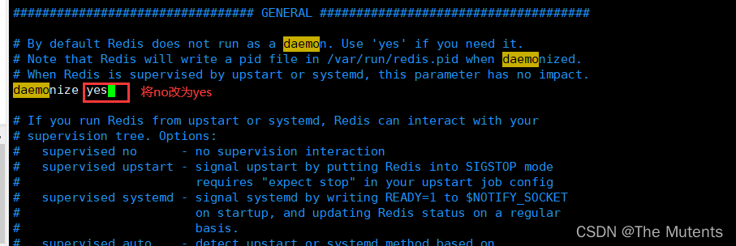

3. 启动 redis
   - 进入 `/usr/local/bin` 目录进行启动
      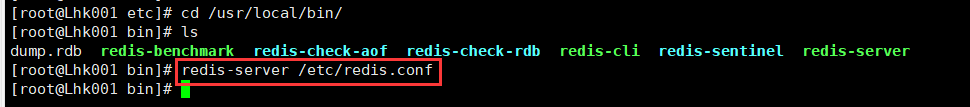
   - 启动成功
      

4. 访问 redis

   - `redis-cli` 访问 redis 
   - `redis-cli -p 端口号 -a 密码` 访问指定端口的 redis
     - 若有密码，也可以不使用 `-a` 参数显示密码，进入 `redis-cli` 后通过使用 `AUTH 密码` 输入密码
   
     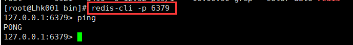

5. redis 的关闭
   - 单实例关闭：`redis-cli shutdown`
     
   - 或者在访问 redis 时进行关闭
     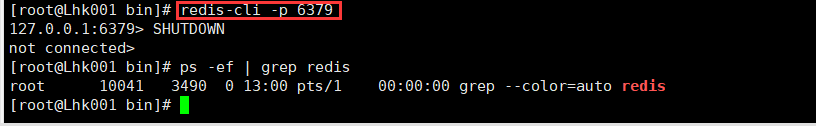
   - 或者直接关闭进程 `kill -9 进程号`
     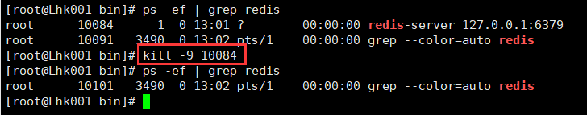

   - 多实例关闭，指定端口关闭：`redis-cli -p 端口号 shutdown`
