# Redis 高级

## 一、分布式缓存

- 单节点问题
    1. 数据丢失问题
        - Redis是内存存储，服务重虑可能会丢失数据
    2. 并发能力问题
        - 单节点 Redis 并发能力虽然不错，但也无法满足如 618 这样的高并发场景
    3. 故障恢复问题
        - 如果 Redis 宕机，则服务不可用，需要一种自动的故障恢复手段
    4. 存储能力问题
        - Redis 基于内存，单节点能存储的数据量难以满足海量数据需求
- 上述问题可以通过 Redis 集群进行解决
    - 对于问题1：实现 Redis 数据持久化
    - 对于问题2：搭建主从集群，实现读写分离
    - 对于问题3：利用 Redis 哨兵，实现健康检测和自动恢复
    - 对于问题4：搭建分片集群，利用插槽机制实现动态扩容

### 1. Redis 持久化

#### RDB 持久化

- RDB 全称 Redis Database Backup file( Redis 数据备份文件)，也被叫做 Redis 数据快照。简单来说就是把内存中的所有数据都记录到磁盘中。当 Redis 实例故障重启后，从**磁盘**读取快照文件，恢复数据

- 快照文件称为 RDB 文件，默认是保存在当前运行目录

    - 通过 `save` 命令开启 RDB 持久化，且由 Redis 主进程来执行 RDB，会阻塞所有命令
    - 通过`bgsave`命令开启子进程执行 RDB，避免主进程受到影响，属于异步持久化

- Redis 默认开启 RDB：Redis 停机时会执行一次 RDB

    - 可以在 redis.conf 文件中配置触发 RDB 的机制

      ```bash
      # 900 秒内，如果至少有 1 个 key 被修改，则执行 bgsave，如果配置为 save "" 则表示禁用 RDB
      save 900 1
      ```

      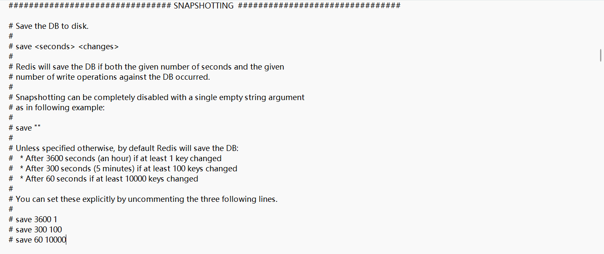

    - 其他相关配置，具体查看 redis.conf 文件

      ```bash
      # 是否压缩 ,建议不开启，压缩也会消耗 cpu，磁盘的话不值钱
      rdbcompression yes
      # RDB文件名称
      dbfilename dump.rdb
      #文件保存的路径目录
      dir ./
      ```

      

      

      

##### bgsave 的流程

- bgsave 开始时会先 fork 主进程得到子进程，子进程共享主进程的内存数据。完成 fork 后读取内存数据并写入新的 RDB 文件，用新 RDB 文件替换旧的 RDB 文件

- fork 的原理

    - 在 Linux 系统中，进程不能直接操作物理内存，而是通过维护一张页表实现对物理内存中数据的映射，相当于通过页表可以间接操作物理内存
    - 在 fork 时，是将主进程的页表拷贝到子进程，保证子进程也可以操作主进程的数据，实现内存数据的共享
    - 且 fork 采用 copy-on-write 技术
        - 当主进程执行读操作时，访问共享内存，当主进程执行写操作时，则会拷贝一份数据，执行写操作

  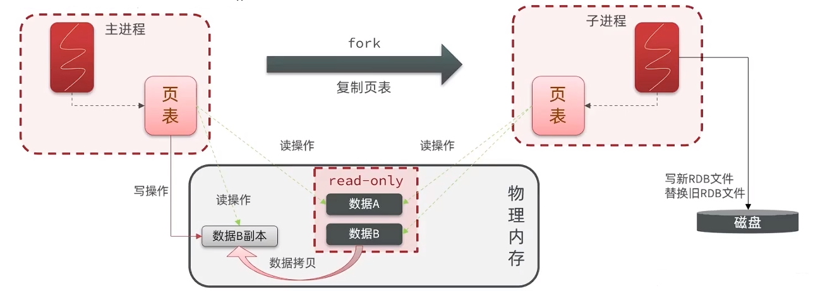

- RDB 的 缺点

    1. 两次 RDB 执行间隔时间长，导致两次 RDB 之间写入数据有丢失的风险
    2. fork 子进程、压缩、写出 RDB 文件都比较耗时

#### AOF 持久化

- AOF 全称为 Append OnlyFile (追加文件)。将 Redis 处理的每一个**写命令**都会记录在AOF文件，可以看做是命令日志文件

- AOF 默认是关闭的，需要修改 redis.conf 配置文件来开启 AOF

  ```bash
  #是否开启AOF功能，默认是no
  appendonly yes
  #AOF文件的名称 
  appendfilename:"appendonly.aof
  ```

  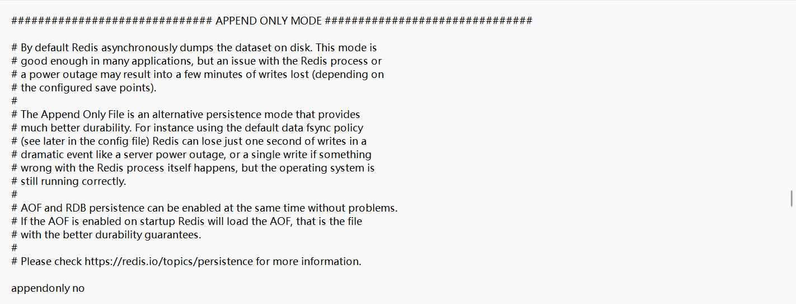

  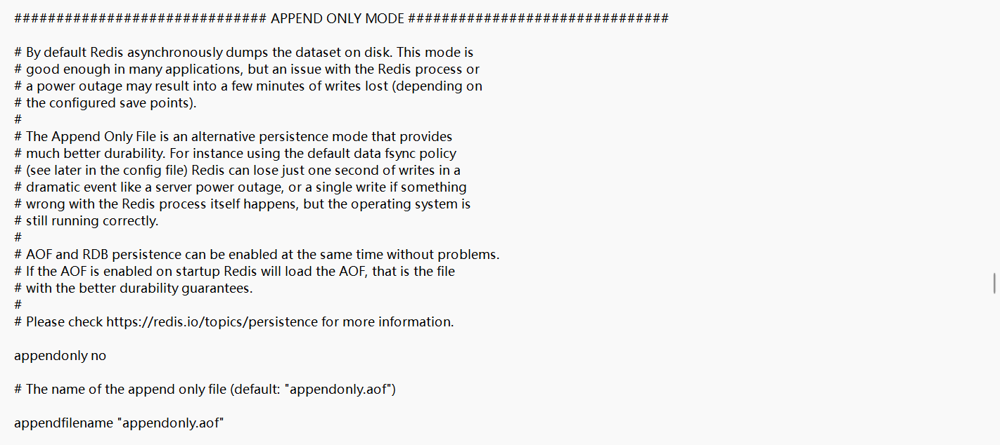

- 刷盘策略：AOF 的**命令记录的频率**也可以通过 redis.conf 文件进行配置

  ```bash
  #表示每执行一次写命令，立即记录到 A0F 文件
  appendfsync always
  #写命令执行完先放入 AOF 缓冲区，然后表示每隔 1 秒将缓冲区数据写到 A0F 文件，是默认方案
  appendfsync everysec
  #写命令执行完先放入 AOF 缓冲区，由操作系统决定何时将缓冲区内容写回磁盘
  appendfsync no
  ```

  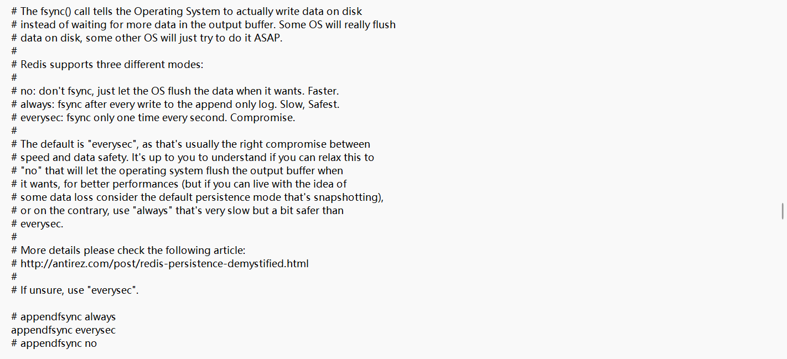

  | 配置项   | 刷盘时机     | 优点                   | 缺点                         |
    | -------- | ------------ | ---------------------- | ---------------------------- |
  | Always   | 同步刷盘     | 可靠性高，几乎不丢数据 | 性能影响大                   |
  | everysec | 每秒刷盘     | 性能适中               | 最多丢失 1 秒数据            |
  | no       | 操作系统控制 | 性能最好               | 可靠性较差，可能丢失大量数据 |

- 因为是记录命令，AOF 文件会比 RDB 文件大的多。而且 AOF 会记录对同一个 key 的多次写操作，但只有最后一次写操作才有意义

    - 可以通过执行 `bgrewriteaof` 命令，可以让 A0F 文件执行**重写**功能，用最少的命令达到相同效果

      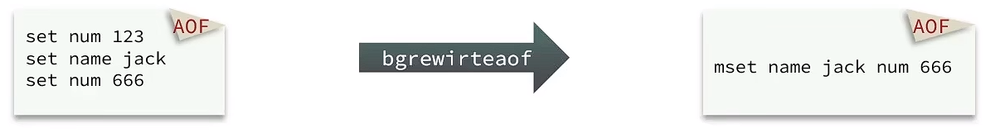

    - 也可以在 redis.conf 中配置自动去重写 AOF 文件

      ```bash
      # AOF文件比上次文件增长超过多少百分比则触发重写
      auto-aof-rewrite-percentage 100
      # AOF文件体积最小多大以上才触发重写
      auto-aof-rewrite-min-size 64mb
      ```

      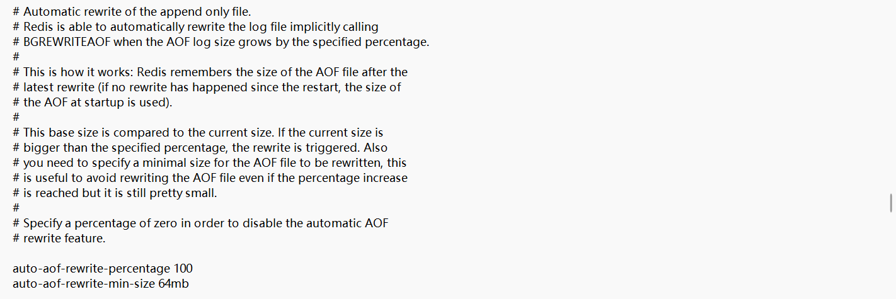

####  RDB 与 AOF 的区别

- RDB 和 AOF 各有自己的优缺点，如果对数据安全性要求较高，在实际开发中往往会结合两者来使用

  |                | RDB                                          | AOF                                                          |
    | -------------- | -------------------------------------------- | ------------------------------------------------------------ |
  | 持久化方式     | 定时对整个内存做快照                         | 记录每一次执行的命令                                         |
  | 数据完整性     | 不完整，两次备份之间会丢失                   | 相对完整，取决于刷盘策略                                     |
  | 文件大小       | 会有压缩，文件体积小                         | 记录命令，文件体积很大                                       |
  | 宕机恢复速度   | 很快                                         | 慢                                                           |
  | 数据恢复优先级 | 低，因为数据完整性不如AOF                    | 高，因为数据完整性更高                                       |
  | 系统资源占用   | 高，大量CPU和内存消耗                        | 低，主要是磁盘 I0 资源但 AOF 重写时会占用大量 CPU 和内存资源 |
  | 使用场景       | 可以容忍数分钟的数据丢失，追求更快的启动速度 | 对数据安全性要求较高常见                                     |


### 2. Redis 主从

- 单节点 Redis 的并发能力是有上限的，要进一步提高 Redis 的并发能力，就需要搭建主从集群，实现读写分离

  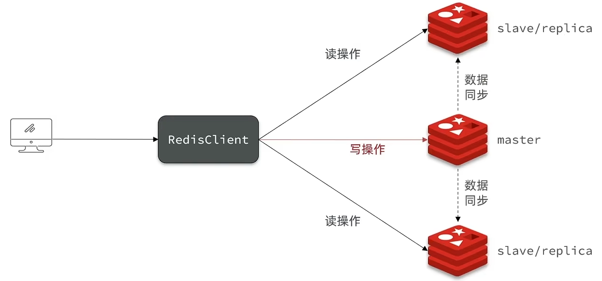

#### 1. 集群搭建

- 要在同一台虚拟机开启3个实例，必须准备三份不同的配置文件和目录，配置文件所在目录也就是工作目录

  ```bash
  # 1.创建目录
  mkdir redis1 redis2 redis3 
  
  # 2.拷贝 redis.conf
  echo redis1 redis2 reids3 | xargs -t -n 1 cp redis-6.2.14/redis.conf
  
  # 3. 修改每个实例的端口、工作目录
  sed -i -e 's/6379/7001/g' -e 's/dir .\//dir \/opt\/redis1\//g' redis1/redis.conf
  sed -i -e 's/6379/7002/g' -e 's/dir .\//dir \/opt\/redis2\//g' redis2/redis.conf 
  sed -i -e 's/6379/7003/g' -e 's/dir .\//dir \/opt\/redis3\//g' redis3/redis.conf
  
  # 4. 修改每个实例的声明 IP，在 redis.conf 文件中指定每一个实例的绑定 ip 信息
  sed -i '1a replica-announce-ip 192.168.136.131' redis1/redis.conf
  sed -i '1a replica-announce-ip 192.168.136.131' redis2/redis.conf
  sed -i '1a replica-announce-ip 192.168.136.131' redis3/redis.conf
  
  # 5. 若主节点有密码，在每个从节点中配置主节点的密码
  sed -i '1a masterauth 222333' redis2/redis.conf
  sed -i '1a masterauth 222333' redis3/redis.conf
  
  
  ```

#### 2. 启动

```bash
redis-server redis1/redis.conf 
redis-server redis2/redis.conf 
redis-server redis3/redis.conf 
```

#### 3. 开启主从关系

- 配置节点的主从可以使用 `replicaof` 或者 `slaveof`(5.0以前)命令

- 有临时和永久两种模式:

    1. 修改配置文件(永久生效)

        - 在 redis.conf 中添加一行配置: `slaveof <masterip><masterport>`

    2. 使用 redis-cli 客户端连接到 redis 服务，执行 `slaveof` 命令(重启后失效) `slaveof <masterip><masterport>`

       ```bash
       # 1. 启动各节点 redis 服务
       redis-server redis1/redis.conf
       redis-server redis2/redis.conf
       redis-server redis3/redis.conf
       
       # 2. 配置节点主从关系，以 7001 端口的 redis 节点为主节点
       redis-cli -p 7002
       SLAVEOF 192.168.136.131 7001
       # 查看节点信息
       INFO replication
       
       redis-cli -p 7003
       SLAVEOF 192.168.136.131 7001
       # 查看节点信息
       INFO replication
       
       ```

#### 4. 主从数据同步原理（主从复制）

- 主从集群搭建好后，可以在主节点进行写操作，从节点会同步主节点的数据

- 主从第一次同步是全量同步

    - Replication ld: 简称 replid，是数据集的标记，id一致则说明是同一数据集。每一个 master 都有唯一的 replid，slave 则会继承master 节点的 replid
    - offset: 偏移量，随着记录在 repl_baklog 中的数据增多而逐渐增大。slave 完成同步时也会记录当前同步的 offset.
      如果 slave 的 offset 小于 master 的offset，说明 slave 数据落后于 master，需要更新。

  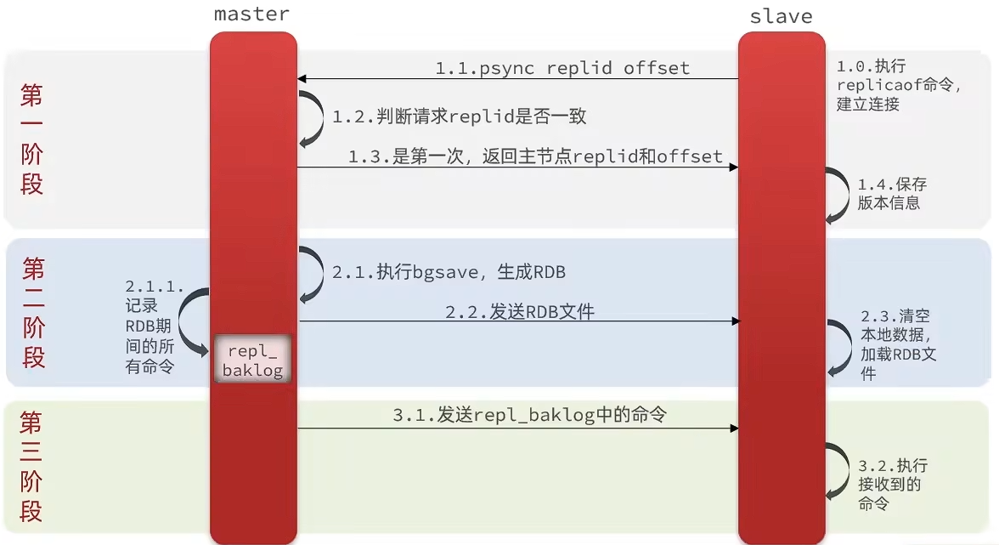
    - **全量同步的流程**
        - slave 节点请求增量同步
        - master 节点判断 replid，发现不一致（说明是第一次），拒绝增量同步，开始全量同步
        - master 将完整内存数据生成 RDB，发送 RDB 到 slave
        - slave 清空本地数据，加载 master 的 RDB
        - master 将 RDB 期间的命令记录在 repl_baklog，并持续将 repl_baklog中的命令发送给 slave
        - slave 执行接收到的命令，保持与 master 之间的同步

- 如果 slave 重启后同步，则执行**增量同步**

  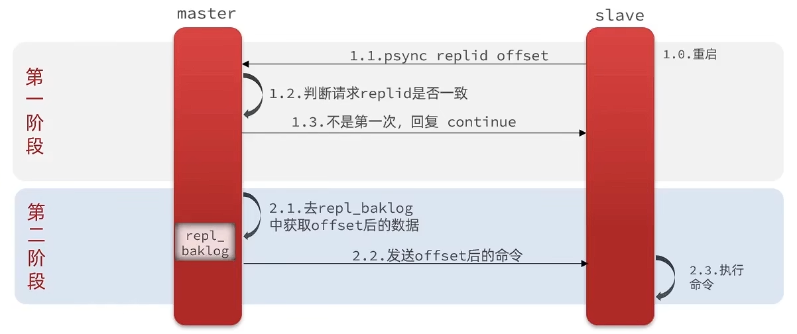

    - repl_baklog 大小有上限，写满后会覆盖最早的数据。如果 slave 断开时间过久，导致**数据被覆盖**，则无法实现增量同步，**只能再次全量同步**

- 全量同步和增量同步区别

    - **全量同步**: master 将完整内存数据生成 RDB，发送 RDB 到 slave。后续命令则记录在 repl_baklog，逐个发送给slave
1. slave 节点第一次连接 master 节点时会执行全量同步

2. slave 节点断开时间太久，repl_baklog 中的 offset 已经被覆盖时也会执行全量同步

- **增量同步**: slave提交自己的 offset 到 master，master 获取 repl_baklog 中从 offset 之后的命令给 slave
    - slave 节点断开又恢复，并且在 repl_baklog 中能找到 offset 时执行增量同步

#### 5. 主从集群优化

- 在 master 中配置 `repl-diskless-syncyes` 启用无磁盘复制，避免全量同步时的磁盘 I0

- Redis 单节点上的内存占用不要太大，减少 RDB 导致的过多磁盘 I0

- 适当提高 repl_baklog 的大小，发现 slave 宕机时尽快实现故障恢复，尽可能避免全量同步

- 限制一个 master 上的 slave 节点数量，如果实在是太多 slave，则可以采用`主-从-从`链式结构，减少 master 压力

  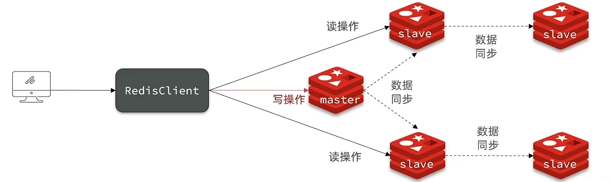

### 3. Redis 哨兵

- slave 节点宕机恢复后可以找 master 节点同步数据，那 master 节点宕机怎么办?
    - Redis 提供了哨兵( Sentinel ) 机制来实现主从集群的自动故障恢复

#### 1. 哨兵的作用和原理

- 作用
    - **监控**: Sentinel 会不断检查您的 master 和 slave 是否按预期工作
    - **自动故障恢复**: 如果 master 故障，Sentinel 会将一个 slave 提升为 master。当故障实例恢复后也以新的 master 为主
    - **通知**: Sentinel 充当 Redis 客户端的**服务发现**来源，当集群发生故障转移时，会将最新信息推送给 Redis 的客户端

  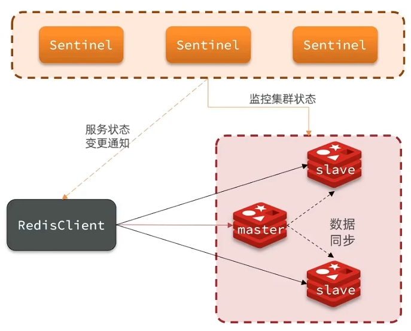

- 服务状态监控

    - Sentinel 基于**心跳机制**监测服务状态，每隔 1 秒向集群的每个实例发送 `ping` 命令:
        - 主观下线: 如果某 sentinel 节点发现某实例未在规定时间响应，则认为该实例主观下线。(有可能是因为网络问题响应超时)
        - 客观下线: 若超过指定数量(quorum)的 sentinel 都认为该实例主观下线，则该实例客观下线。
            - quorum 值最好超过 Sentinel 实例数量的一半

  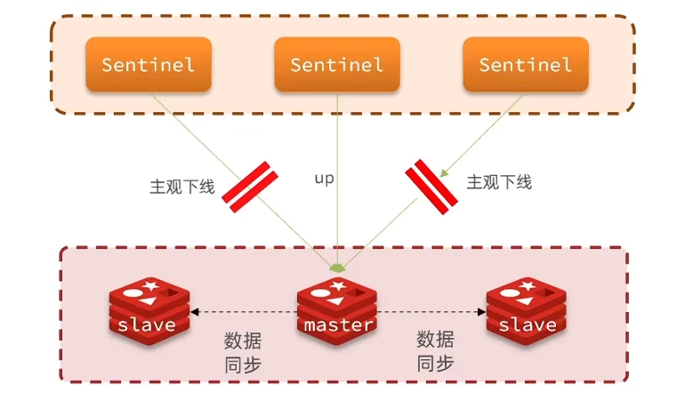

- 选举新的 master

    - 一旦发现 master 故障，sentinel 需要在 salve 中选择一个作为新的 master
    - 选举规则
        - 首先会判断 slave 节点与 master 节点**断开时间长短**，如果超过指定值(`down-after-miliseconds*10`)则会排除该
          slave 节点
        - 然后判断 slave 节点的优先级 `slave-priority` 值，越小优先级越高，如果是 0 则永不参与选举
        - 如果 `slave-prority` 一样，则判断 slave 节点的 offset 值，越大说明数据越新，优先级越高
        - 最后是判断 slave 节点的运行 id 大小，越小优先级越高

- 故障转移

    - 当选中了其中一个 slave 为新的 master 后
        1. sentinel 给备选的 slave 节点发送 `slaveof no one`命令，让该节点成为新的 master
        2. sentinel 给所有其它 slave 发送 `slaveof ip port`命令，让这些 slave 成为新 master 的从节点，开始从新的 mastel 上同步数据
        3. 最后，sentinel 将故障节点标记为 slave（ `slaveof ip port` 命令），当故障节点恢复后会自动成为新的 master 的 slave 节点

#### 2. 搭建哨兵（Sentinel）集群

1. 创建目录

   ```bash
   mkdir sentinel1 sentinel2 sentinel3
   ```

2. 在每个目录下创建 sentinel.conf  文件，redis 目录下有 sentinel.conf 模板

   ```bash
   echo sentinel1 sentinel2 sentinel3 | xargs -t -n 1 cp redis-6.2.14/sentinel.conf
   ```

   修改以下配置

   ```bash
   # sentinel1 实例的端口
   port 27001
   # 声明 sentinel ip 地址
   sentinel announce-ip 192.168.136.131
   # 指定主节点信息，quorum 为 2
   sentinel monitor mymaster 192.168.136.131 8001 2
   #slave 节点与 master 节点断开超时时间
   sentinel down-after-milliseconds mymaster 5000
   # 故障恢复超时时间
   sentinel failover-timeout mymaster 6000
   #工作目录
   dir "/opt/sentinel1"
   
   # sentinel2 实例的端口
   port 27002
   # 声明 sentinel ip 地址
   sentinel announce-ip 192.168.136.131
   # 指定主节点信息，quorum 为 2
   sentinel monitor mymaster 192.168.136.131 8001 2
   #slave 节点与 master 节点断开超时时间
   sentinel down-after-milliseconds mymaster 5000
   # 故障恢复超时时间
   sentinel failover-timeout mymaster 6000
   #工作目录
   dir "/opt/sentinel2"
   
   # sentinel3 实例的端口
   port 27003
   # 声明 sentinel ip 地址
   sentinel announce-ip 192.168.136.131
   # 指定主节点信息，quorum 为 2
   sentinel monitor mymaster 192.168.136.131 8001 2
   #slave 节点与 master 节点断开超时时间
   sentinel down-after-milliseconds mymaster 5000
   # 故障恢复超时时间
   sentinel failover-timeout mymaster 6000
   #工作目录
   dir "/opt/sentinel2"
   ```

3. 启动

   ```bash
   redis-sentinel sentinel1/sentinel.conf 
   redis-sentinel sentinel2/sentinel.conf 
   redis-sentinel sentinel3/sentinel.conf
   ```

#### 3. RedisTemplate 的哨兵模式

- 在 Sentinel 集群监管下的 Redis 主从集群，其节点会因为自动故障转移而发生变化，Redis 的客户端必须感知这种变化及时更新连接信息。Spring 的 RedisTemplate 底层利用 lettuce 实现了节点的感知和自动切换

- 引入依赖

  ```xml
          <dependency>
              <groupId>org.springframework.boot</groupId>
              <artifactId>spring-boot-starter-data-redis</artifactId>
          </dependency>
  ```

- 配置 Sentinel 节点信息

  ```yaml
  spring:
    data:
      redis:
        sentinel:
          master: mymaster
          nodes:
            - 192.168.136.131:27001
            - 192.168.136.131:27002
            - 192.168.136.131:27003
  ```

- 配置读写分离

  ```java
      @Bean
      public LettuceClientConfigurationBuilderCustomizer lettuceClientConfigurationBuilderCustomizer() {
          return clientConfigurationBuilder -> clientConfigurationBuilder.readFrom(ReadFrom.REPLICA_PREFERRED)
      }
  ```

    - 这里的 `ReadFrom` 是配置 Redis 的读取策略，是一个枚举，包括下面选择:
        - MASTER: 从主节点读取
        - MASTER_PREFERRED: 优先从master节点读取，master不可用才读取replica
        - REPLICA: 从 slave(replica) 节点读取
        - REPLICA_PREFERRED: 优先从 slave(replica) 节点读取，所有的 slave 都不可用才读取 master

### 4. Redis 分片集群

- 主从和哨兵可以解决高可用、高并发读的问题。但是依然有两个问题没有解决

    1. 海量数据存储问题
    2. 高并发写的问题

- 使用**分片集群**可以解决上述问题，分片集群特征:

    - 集群中有多个 master，每个 master 保存不同数据
    - 每个 master 都可以有多个 slave 节点
    - master 之间通过 `ping` 监测彼此健康状态
    - 客户端请求可以访问集群任意节点，最终都会被转发到正确节点

  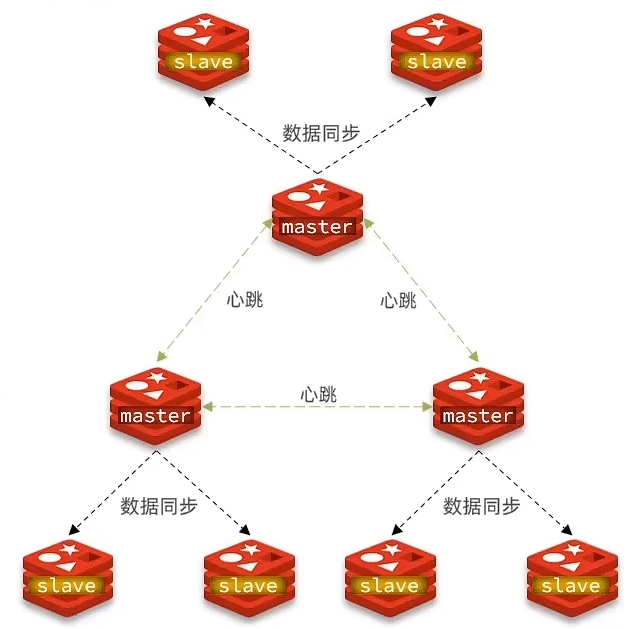

#### 1. 搭建分片集群

- 创建目录

  ```bash
  mkdir cluster-master1 cluster-master2 cluster-master3 cluster-slave1 cluster-slave2 cluster-slave3
  ```

- 为每个节点编写 redis.conf 配置文件

    - 例：

      ```bash
      port 8001
      # 开启集群功能
      cluster-enabled yes
      #集群的配置文件名称，不需要我们创建，由redis自己维护
      cluster-config-file /opt/cluster-master1/nodes.conf
      #节点心跳失败的超时可
      cluster-node-timeout 5000
      #持久化文件存放目录
      dir /opt/cluster-master1
      # 绑定地址
      bind 0.0.0.0
      # 让redis后台运行
      daemonize yes
      #注洲的实例ip
      replica-announce-ip 192.168.136.131
      #保护模式
      protected-mode no
      #数据库数量
      databases 1
      #日志
      logfile /opt/cluster-master1/run.log
      ```

    - 每个节点修改端口和目录位置即可

- 启动

  ```bash
  # 一键启动
  printf '%s\n' cluster-master1 cluster-master2 cluster-master3 cluster-slave1 cluster-slave2 cluster-slave3 | xargs -I{} -t redis-server {}/redis.conf
  ```

- 创建集群

  ```bash
  redis-cli --cluster create --cluster-replicas 1 192.168.136.131:8001 192.168.136.131:8002 192.168.136.131:8003 192.168.136.131:8004 192.168.136.131:8005 192.168.136.131:8006
  ```

    - 命令说明:
        - `redis-cli --cluster` : 代表集群操作命令
        - `create`: 代表是创建集群
        - `--replicas 1`或者 `--cluster-replicas 1`: 指定集群中每个 master 的副本个数为 1，此时`n = 节点总数 ÷ (replicas +1)`得到的就是 master 的数量。因此节点列表中的前 n 个就是master，其它节点都是 slave 节点，随机分配到不同 master

- 查看集群状态

  ```bash
  redis-cli -p 8001 cluster nodes
  ```

- 集群模式进入 redis-cli

  ```
   redis-cli -c -p port
  ```


#### 2. 散列插槽

- Redis 会把每一个 master 节点映射到 0~16383 共 16384 个插槽 (hashslot) 上

  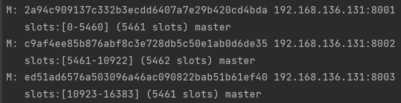

- 数据 key 不是与节点绑定，而是与插槽绑定。redis 会根据 key 的**有效部分**计算插槽值，分两种情况:

    - key 中包含 "{}"，且 "{}" 中至少包含 1 个字符， **"{}"  中的部分是有效部分**
        - 通过这种方式，可以将同一类的数据使用相同的有效部分，从而将同一类数据固定的保存在同一个 Redis 实例
    - **key 中不包含 "{}"，整个 key 都是有效部分**
    - 例如: key 是 num，那么就根据 num 计算插槽值，key 如果是 {itcast}num，则根据 itcast 计算插槽值。计算方式是利用 **CRC16算法**得到一个 hash 值，然后对 16384 取余，得到的结果就是 slot 值

  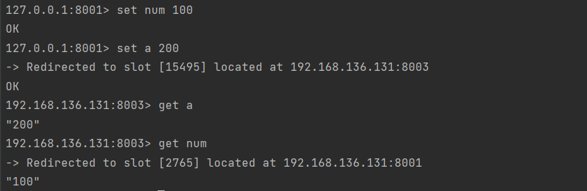


#### 3. 集群伸缩

- `redis-cli --cluster`提供了很多操作集群的命令,，比如添加节点、删除节点

  ```bash
  # 查看 redis-cli --cluster 相关命令
  redis-cli --cluster help
  ```

- 给集群添加一个节点

    - 新建一个节点

      ```bash
      mkdir cluster-node1
      ```

    - redis.conf 配置文件

      ```bash
      port 8007
      # 开启集群功能
      cluster-enabled yes
      #集群的配置文件名称，不需要我们创建，由redis自己维护
      cluster-config-file /opt/cluster-node1/nodes.conf
      #节点心跳失败的超时可
      cluster-node-timeout 5000
      #持久化文件存放目录
      dir /opt/cluster-node1
      # 绑定地址
      bind 0.0.0.0
      # 让redis后台运行
      daemonize yes
      #注洲的实例ip
      replica-announce-ip 192.168.136.131
      #保护模式
      protected-mode no
      #数据库数量
      databases 1
      #日志
      logfile /opt/cluster-node1/run.log
      ```

    - 启动

      ```bash
      redis-server cluster-node1/redis.conf
      ```

    - 新节点加入集群

      ```bash
      redis-cli --cluster add-node 192.168.136.131:8007 192.168.136.131:8001
      
      # 查看集群状态
      redis-cli -p 8001 cluster nodes
      ```

    - 给新节点分配插槽

      ```bash
      redis-cli --cluster reshard 192.168.136.131:8001
      ```


#### 4. 故障转移

```bash
# 监控集群
watch redis-cli -p 8001 cluster nodes
```

- 当集群中有一个 master 宕机时，redis 集群会自动故障转移

    1. 首先是该实例与其它实例失去连接
    2. 然后是疑似宕机
    3. 最后是确定下线，自动提升一个slave为新的master

  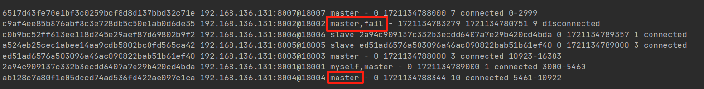

- 数据迁移（手动故障转移）

    - 在 slave 节点中执行 `cluster failover` 命令，可以手动让集群中的某个 master 宕机， slave 节点切换为 master 节点，实现无感知的数据迁移

      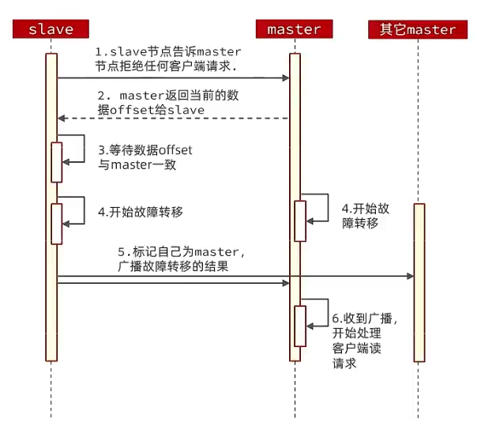

    - 手动的 `Failover` 支持三种不同模式

        1. 缺省: 默认的流程，如图1~6步
        2. force: 省略了对 offset 的一致性校验
        3. takeover: 直接执行第 5 步，忽略数据一致性、忽略 master 状态和其它 master 的意见

#### 5. RedisTemplate 访问分片集群

- RedisTemplate 底层同样基于 lettuce 实现了分片集群的支持，而使用的步骤与哨兵模式基本一致

    - 引入依赖

      ```xml
              <dependency>
                  <groupId>org.springframework.boot</groupId>
                  <artifactId>spring-boot-starter-data-redis</artifactId>
              </dependency>
      ```

    - 配置分片集群地址

      ```yaml
      spring:
        data:
          redis:
            cluster:
              nodes:
                - 192.168.136.131:8001
                - 192.168.136.131:8002
                - 192.168.136.131:8003
                - 192.168.136.131:8004
                - 192.168.136.131:8005
                - 192.168.136.131:8006
                - 192.168.136.131:8007
      ```


- 配置读写分离

  ```java
      @Bean
      public LettuceClientConfigurationBuilderCustomizer lettuceClientConfigurationBuilderCustomizer() {
          return clientConfigurationBuilder -> clientConfigurationBuilder.readFrom(ReadFrom.REPLICA_PREFERRED)
      }
  ```


## 二、多级缓存

- 传统的缓存策略一般是请求到达 Tomcat 后，先查询 Redis，如果未命中则查询数据库，存在下面的问题

    - 请求要经过 Tomcat 处理，Tomcat 的性能成为整个系统的瓶颈
    - Redis 缓存失效时，会对数据库产生冲击

  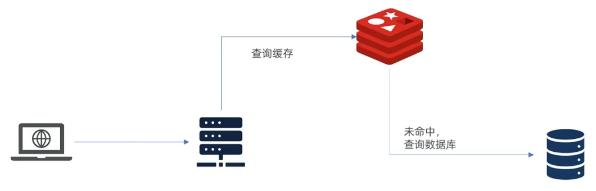

- 多级缓存就是充分利用请求处理的每个环节，分别添加缓存，减轻 Tomcat 压力，提升服务性能

  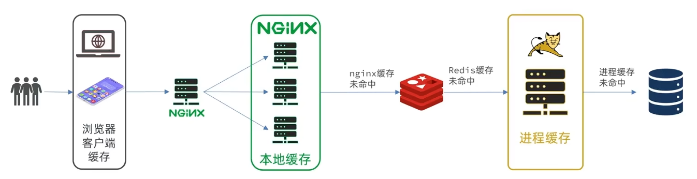


### 1.  JVM 进程缓存

- 缓存在日常开发中启动至关重要的作用，由于是**存储在内存**中，数据的读取速度是非常快的，能大量减少对数据库的访问，减少数据库的压力。我们把缓存分为两类:

    - 分布式缓存，例如 Redis
        - 优点: 存储容量更大、可靠性更好、可以在集群间共享
        - 缺点: 访问缓存有网络开销
        - 场景: 缓存数据量较大、可靠性要求较高、需要在集群间共享
    - 进程本地缓存，例如 HashMap、GuavaCache
        - 优点: 读取本地内存，没有网络开销，速度更快
        - 缺点: 存储容量有限、可靠性较低、无法共享
        - 场景: 性能要求较高，缓存数据量较小

- Caffeine 是一个基于 Java8 开发的，提供了近乎最佳命中率的高性能的本地缓存库。目前 Spring 内部的缓存使用的就是 Caffeine

    - GitHub地址: [ben-manes/caffeine: A high performance caching library for Java (github.com)](https://github.com/ben-manes/caffeine)

    - 引入依赖

      ```xml
              <dependency>
                  <groupId>com.github.ben-manes.caffeine</groupId>
                  <artifactId>caffeine</artifactId>
                  <version>3.1.8</version>
              </dependency>
      ```

    - 配置 Caffeine

        - Caffeine 提供了三种缓存驱逐策略，文档：[Eviction zh CN · ben-manes/caffeine Wiki (github.com)](https://github.com/ben-manes/caffeine/wiki/Eviction-zh-CN)
            1. 基于容量: 设置缓存的数量上限
            2. 基于时间: 设置缓存的有效时间
            3. 基于引用: 设置缓存为软引用或弱引用，利用GC来回收缓存数据。性能较差，不建议使用
        - 在默认情况下，当一个缓存元素过期的时候，Caffeine 不会自动立即将其清理和驱逐。而是在一次读或写操作后，或者在
          空闲时间完成对失效数据的驱逐

      ```java
      @Configuration
      public class CaffeineConfig {
      
          @Bean
          public Cache<String, Object> caffeineCache()
          {
              return Caffeine.newBuilder() 
                  .expireAfterWrite(10, TimeUnit.MINUTES) //设置缓存有效期，从最后一次写入开始计时
                  .maximumSize(10_000) //设置缓存大小上限
                  .build();
          }
      }
      ```

    - 测试

      ```java
          @Autowired
          private Cache caffeineCache;
      
          @Test
          void testCaffeine(){
              // 存数据
              caffeineCache.put("key", "value");
              //取数据
              System.out.println(caffeineCache.getIfPresent("key"));
      
              // 如果缓存中没有 key 对应的数据，则调用回调函数获取数据（可以从数据库查询）
              Object object = caffeineCache.get("key1", k -> "dbValue");
              System.out.println(object);
          }
      ```


### 2. Lua 脚本语言

- 在 NGINX 中可以使用 Lua 脚本语言编写业务代码进行开发

- Lua 是一种轻量小巧的脚本语言，用标准C语言编写并以源代码形式开放，其设计目的是为了嵌入应用程序中，从而为应用程序提供灵活的扩展和定制功能。官网: [The Programming Language Lua](https://www.lua.org/)

- centos 中自带 lua 运行环境

    - 创建 hello.lua

      ```lua
      print("hello,lua")
      ```

    - 运行 hello.lua

      ```bash
      lua hello.lua
      ```

- Lua 入门 ：[Lua 教程 | 菜鸟教程 (runoob.com)](https://www.runoob.com/lua/lua-tutorial.html)

### 3. 多级缓存

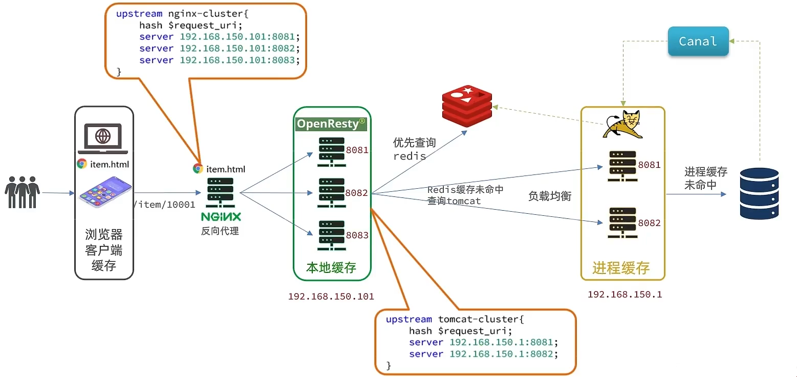

#### OpenResty

- OpenResty 是一个基于 Nginx 的高性能 Web 平台，用于方便地搭建能够处理超高并发、扩展性极高的动态 Web 应用 Web 服务和动态网关。具备下列特点:
    - 具备 Nginx 的完整功能
    - 基于 Lua 语言进行扩展，集成了大量精良的 Lua 库、第三方模块
    - 允许使用Lua自定义业务逻辑、自定义库
- 官方网站: [OpenResty® - 开源官方站](https://openresty.org/cn/)

- 可以使用 OpenResty + lua 实现对请求的处理及业务的开发，如查 Redis、查数据库、查 Tomcat等

    - OpenResty 提供了各种 API 用来获取不同类型的请求参数

      ```lua
      -- 在 lua 脚本中使用 NGINX 发请求的 api
      ngx.local.captuer()
      ```

    - OpenResty 目录下的 lualib 目录存放了相关的库，需要在 nginx.conf  的 http 配置快下配置包路径

      ```nginx
      #lua 模块
      lua_package_path "/usr/local/openresty/lualib/?.lua;;"
      #c模块
      lua_package_cpath "/usr/local/openresty/lualib/?.so;;";
      ```

        - 操作 Redis 的模块`lualib/resty/redis.lua`，

- NGINX 支持的负载均衡算法

  **轮询（Round Robin）**：

    - 默认负载均衡算法，按照顺序将请求逐个分配给不同的后端服务器。每个服务器的请求量大致相同。

  **权重轮询（Weighted Round Robin）**：

    - 在轮询的基础上，为每个后端服务器分配权重。权重越高，接收到的请求数越多。适用于后端服务器性能不均的情况。

      ```nginx
      upstream backend {
          server backend1.example.com weight=3;
          server backend2.example.com weight=1;
      }
      ```

  **最少连接（Least Connections）**：

    - 将新请求分配给当前连接数最少的服务器，适用于处理时间长短不一的请求。

      ```nginx
      upstream backend {
          least_conn;
          server backend1.example.com;
          server backend2.example.com;
      }
      ```

  **最少时间（Least Time）**：

    - 将新请求分配给平均响应时间最短且活动连接数最少的服务器。适用于需要考虑服务器响应时间的场景。

  **IP哈希（IP Hash）**：

    - 根据客户端 IP 地址的哈希值分配请求，使同一客户端的请求总是转发到同一台后端服务器。适用于需要会话保持的情况。

      ````nginx
      upstream backend {
          ip_hash;
          server backend1.example.com;
          server backend2.example.com;
      }
      ````

  **URI哈希（URI Hash）**：

    - 根据请求 URI 的哈希值分配请求，使相同 URI 的请求总是转发到同一台后端服务器。适用于需要将相同资源请求分配给同一服务器的情况。

      ```nginx
      upstream backend {
          hash $request_uri;
          server backend1.example.com;
          server backend2.example.com;
      }
      ```

  **公平（Fair）**：

    - 根据后端服务器的响应时间来分配请求，响应时间短的服务器分配更多请求。需要第三方模块 `upstream_fair`。

#### 冷启动与缓存预热

- **冷启动**

    - 服务刚刚启动时，Redis 中并没有缓存，如果所有数据都在第一次查询时添加缓存，可能会给数据库带来较大压力

- **缓存预热**

    - 在实际开发中，我们可以利用大数据统计用户访问的热点数据，在项目启动时将这些热点数据提前查询并保存到 Redis 中

    - 实现数据预热

        - 实现`InitializingBean` 接口中 `afterPropertiesSet()`，在实现类 bean 加载完且依赖注入完成后就会执行 `afterPropertiesSet()`方法，因此可以在该方法中编写数据缓存逻辑，达到在项目启动时将数据缓存到 Redis

      ```java
      @Component
      public class RedisHandler implements InitializingBean {
          @Autowired
          private StringRedisTemplate stringRedisTemplate;
          @Override
          public void afterPropertiesSet() throws Exception {
              //编写数据预热逻辑
          }
      }
      ```

#### NGINX 本地缓存

- OpenResty 为 Nginx 提供了shard dict 的功能，可以在 nginx 的多个 worker 之间共享数据，实现缓存功能

    - 需要在 nginx.conf  的 http 配置快下配置开启 shard dict 功能

      ```nginx
      # 添加共享词典，本地缓存,名称叫做: item_cache，大小150m
      lua_shared_dict item_cache 150m;
      ```

    - 在 lua 脚本中使用共享词典

      ```lua
      -- 获取本地缓存对象
      local item_cache = ngx.shared.item_cache
      --存储，指定key、value、过期时间，单位s，默认为代表永不过期
      item_cache:set('key','value'，1000)
      -- 读取
      local val=item_cache:get('key')
      ```


### 4. 缓存同步策略

#### 数据同步策略

- 缓存数据同步的常见方式有三种

    1. 设置有效期: 给缓存设置有效期，到期后自动删除。再次查询时更新

        - 优势: 简单、方便
        - 缺点: 时效性差，缓存过期之前可能不一致场景:更新频率较低，时效性要求低的业务

    2. 同步双写: 在修改数据库的同时，直接修改缓存

        - 优势: 时效性强，缓存与数据库强一致
        - 缺点: 有代码侵入，耦合度高;场景:对一致性、时效性要求较高的缓存数据

    3. 异步通知: 修改数据库时发送事件通知，相关服务监听到通知后修改缓存数据优势:低耦合，可以同时通知多个缓存服务

        - 缺点: 时效性一般，可能存在中间不一致状态
        - 场景: 时效性要求一般，有多个服务需要同步

        - 基于 MQ 的异步通知

          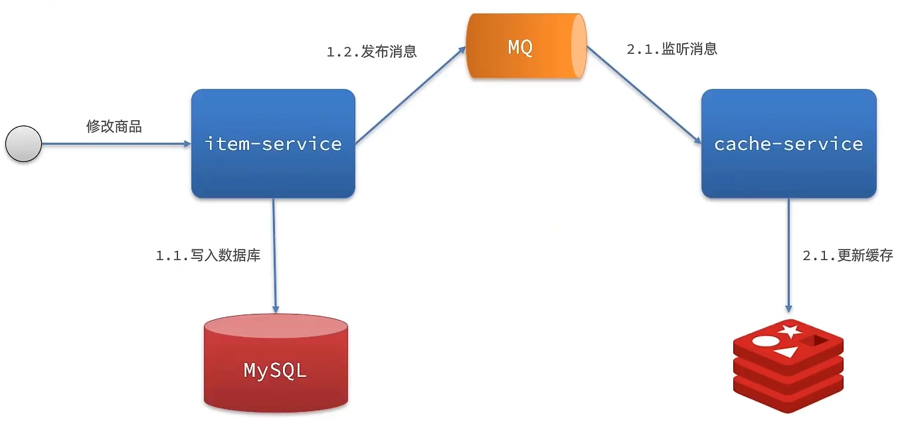

        - 基于 Canal 的异步通知

          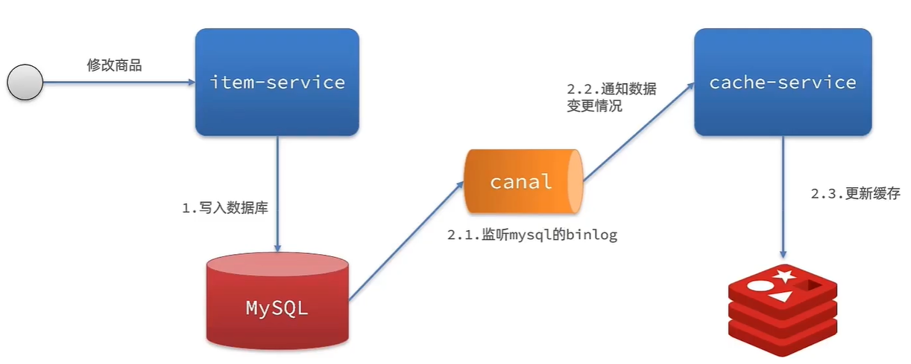

#### Canal

- Canal，译意为水道/管道/沟渠，canal 是阿里巴巴旗下的一款开源项目，基于Java 开发。

    - 功能：基于数据库增量日志解析，提供增量数据订阅和消费
    - GitHub:[alibaba/canal: 阿里巴巴 MySQL binlog 增量订阅&消费组件 (github.com)](https://github.com/alibaba/canal)

  

##### 工作原理

- **MySQL 主备复制原理**
    - MySQL master 将数据变更写入二进制日志( binary log, 其中记录叫做二进制日志事件binary log events，可以通过 show binlog events 进行查看)
    - MySQL slave 将 master 的 binary log events 拷贝到它的中继日志(relay log)
    - MySQL slave 重放 relay log 中事件，将数据变更反映它自己的数据

- **canal 工作原理**
    - canal 模拟 MySQL slave 的交互协议，伪装自己为 MySQL slave ，向 MySQL master 发送dump 协议
    - MySQL master 收到 dump 请求，开始推送 binary log 给 slave (即 canal )
    - canal 解析 binary log 对象(原始为 byte 流)

##### 安装 Canal

- 具体安装可参考：[QuickStart · alibaba/canal Wiki (github.com)](https://github.com/alibaba/canal/wiki/QuickStart)

##### Canal 客户端

- Canal 提供了各种语言的客户端，当 Canal 监听到 binlog 变化时，会通知 Canal 的客户端

  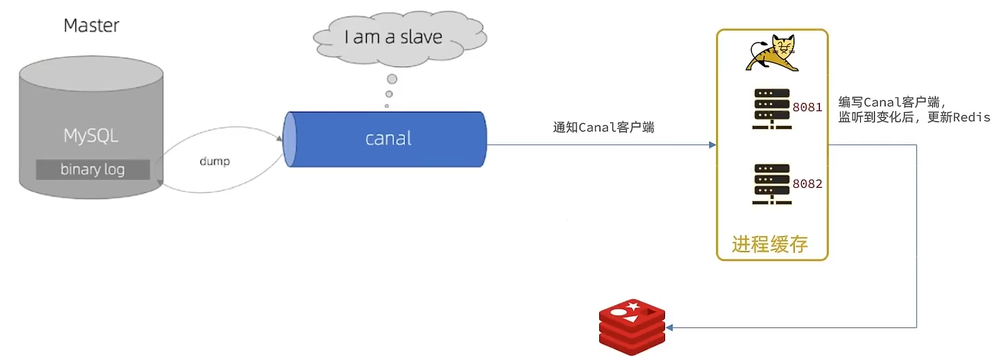

- 由于 Canal 原生的客户端 api 使用起来不方便，可以使用第三方可以的 Canal 客户端

    - canal-starter: [NormanGyllenhaal/canal-client: spring boot canal starter 易用的canal 客户端 canal client (github.com)](https://github.com/NormanGyllenhaal/canal-client)
    - 具体使用可参考：[canal-client/canal-example/src at master · NormanGyllenhaal/canal-client (github.com)](https://github.com/NormanGyllenhaal/canal-client/tree/master/canal-example/src)

## 三、Redis 最佳实践（使用经验）
### Redis 键值设计

#### 优雅的key结构

- Redis 的 Key 虽然可以自定义，但最好遵循下面的几个最佳实践约定

    1. 遵循基本格式: `[业务名称]:[数据名]:[id]`
    2. 长度不超过 44 字节
    3. 不包含特殊字符

- 优点:

    - 可读性强

    - 避免 key 冲突

    - 方便管理

    - 更节省内存: key 是 string 类型，底层编码包含 int、embstr 和 raw 三种。embstr 在小于44字节使用，会采用连续内存空间，内存占用更小，超过 44 字节就会使用 raw 编码

      ```bash
      # 查看 key 类型
      type key
      # 查看 key 底层编码
      OBJECT encoding key
      ```


#### 拒绝 BigKey

- BigKey 通常以 **Key 的大小**和 **Key 中成员的数量**来综合判定，例如:

    - Key 本身的数据量过大: 一个 String 类型的 Key，它的值为 5 MB
    - Key 中的成员数过多: 一个 ZSET 类型的 Key，它的成员数量为10,000个
    - Key 中成员的数据量过大: 一个 Hash 类型的 Key，它的成员数量虽然只有 1,000个 但这些成员的 Value (值)总大小为 100 MB

- 推荐值:

    - 单个 key 的 value 小于 10KB
    - 对于集合类型的 key，建议元素数量小于 1000

  ```bash
  # 查看 key 对应 value 占用的内存大小，此命令对 cup 占用高，不推荐使用
  memory usege key
  
  # 查看 key 对应 value 的长度
  STRLEN key
  ```

- **BigKey 的危害**

    1. 网络阻塞
        - 对BigKey执行读请求时，少量的 QPS 就可能导致带宽使用率被占满，导致 Redis 实例，乃至所在物理机变慢
    2. 数据倾斜
        - BigKey 所在的 Redis 实例内存使用率远超其他实例，无法使数据分片的内存资源达到均衡
    3. Redis 阻塞
        - 对元素较多的 hash、list、zset 等做运算会耗时较旧，使主线程被阻塞
    4. CPU压力
        - 对 BigKey 的数据序列化和反序列化会导致 CPU 的使用率飙升，影响 Redis 实例和本机其它应用

- **如何发现 BigKey**

    - `redis-cli --bigkeys`

        - 利用 `redis-cli` 提供的 `--bigkeys` 参数，可以遍历分析所有key，并返回Key的整体统计信息与每个数据的Top1的big key

          ```bash
          # 例
          redis-cli -a 222333 -p 7001 --bigkeys
          ```

    - `scan` 扫描，还有 `hscan`、`sscan`、`zscan` 等

        - 自己编程，利用 `scan` 命令扫描 Redis 中的所有 key，利用 `strlen`、`hlen` 、`llen`、`scard`、`zcard`等命令判断 key 的长度(此处不建议使用 `MEMORY USAGE`)

          ```bash
          SCAN cursor [MATCH pattern] [COUNT count] [TYPE type]
          ```

    - 第三方工具

        - 利用第三方工具，如 Redis-Rdb-Tools 分析 RDB 快照文件，全面分析内存使用情况
            - [sripathikrishnan/redis-rdb-tools: Parse Redis dump.rdb files, Analyze Memory, and Export Data to JSON (github.com)](https://github.com/sripathikrishnan/redis-rdb-tools)

    - 网络监控

        - 自定义工具，监控进出 Redis 的网络数据，超出预警值时主动告警

- **如何删除 BigKey**

    - BigKey 内存占用较多，即便是删除这样的key也需要耗费很长时间，导致 Redis 主线程阻塞，引发一系列问题。
    - redis 3.0 及以下版本
        - 如果是集合类型，则遍历 BigKey 的元素，先逐个删除子元素，最后删除BigKey
    - Redis 4.0以后
        - Redis 在 4.0 后提供了异步删除的命令: `unlink`

#### 恰当的数据类型

- 存一个对象可以有三种储存方式
    1. 以 json 字符串方式存储
        - 优点: 实现简单粗暴
        - 缺点: 数据耦合，不够灵活
    2. 将字段打散，以 string 方式 储存
        - 优点: 可以灵活访问对象任意字段
        - 缺点: 占用空间大、没办法做统一控制
    3. 以 hash 方式储存
        - 优点: 底层使用 ziplist，空间占用小，可以灵活访问对象的任意字段
        - 缺点: 代码相对复杂
        - **存在问题**：假如有 hash 类型的 key，其中有 100 万对 field 和 value，field 是自增 id，这个 key 存在什么问题?如何优化?
            - hash 的 entry 数量超过 500 时，会使用哈希表而不是 ZipList，内存占用较多
            - 优化
                1. 可以通过 `hash-max-ziplist-entries` 配置entry上限。但是如果 entry 过多就会导致 BigKey 问题
                2. 将 hash 拆分为 string 类型进行存储。可以解决 BigKey，但是 string 结构底层没有太多内存优化，内存占用较多，且想要批量获取这些数据比较麻烦
                3. 拆分为小的 hash，将 `id/100` 作为key，将 `id % 100` 作为 field，这样每100 个元素为一个 Hash
- Value 的最佳实践:
    - 合理的拆分数据，拒绝 BigKey
    - 选择合适数据结构
    - Hash 结构的 entry 数量不要超过 1000
    - 设置合理的超时时间

### 批处理优化

- 单个命令的执行流程

    - 一次命令的响应时间 = 1次往返的网络传输耗时 + 1次Redis执行命令耗时

    - 网络传输耗时往往大于 Redis 执行命令耗时，甚至是数量级的差别

      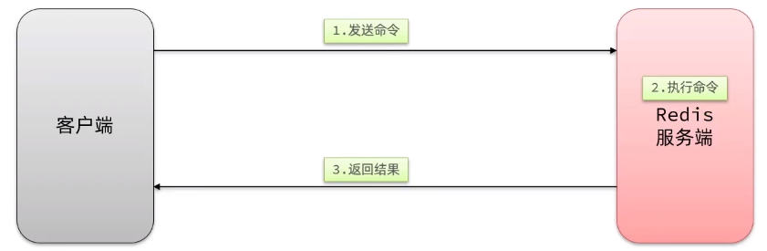

- N条命令依次执行

    - N次命令的响应时间= N次往返的网络传输耗时 + N次Redis执行命令耗时

    - N网络传输耗时导致耗时大大增加

      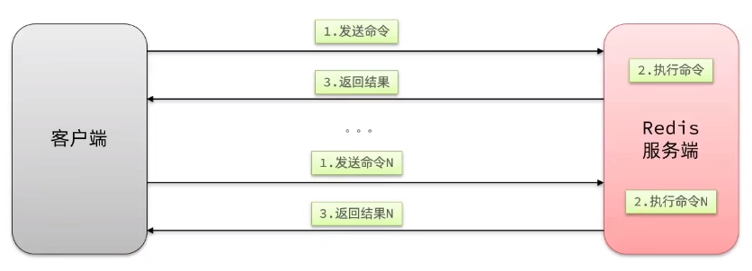

- N条命令批量执行

    - N次命令的响应时间 = 1次往返的网络传输耗时 + N次Redis执行命令耗时

    - 批量执行效率会大大增加

      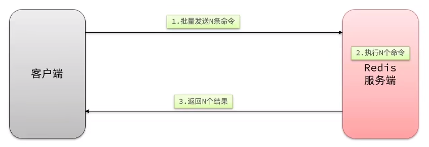

##### Redis 原生批处理（MSET 等）

- Redis 提供了很多 `Mxxx` 这样的命令，可以实现批量插入数据，例如: `mset`、`hmset`

    - 不要在一次批处理中传输太多命令，否则单次命令占用带宽过多，会导致网络阻塞，命令太多可以分多次批处理

  ```java
      @Test
      void testMset() {
          stringRedisTemplate.opsForValue().multiSet(Map.of("key1", "value1", "key2", "value2"));
      }
  ```


##### Pipeline

- `MSET` 虽然可以批处理，但是却只能操作部分数据类型，因此如果有对复杂数据类型的批处理需要，建议使用 Pipeline 功能
- 可以将多条命令放入 Pipeline 中，然后一次性发送到 Redis 执行

```java
    @Test
    void testPipeline() {
        stringRedisTemplate.executePipelined((RedisCallback<Object>) connection -> {
            connection.openPipeline();
            connection.stringCommands().set("key1".getBytes(), "value1".getBytes());
            connection.hashCommands().hSet("hashKey".getBytes(), "hashKey1".getBytes(), "hashValue1".getBytes());
            connection.setCommands().sAdd("setKey".getBytes(), "setValue1".getBytes(), "setValue2".getBytes());
            connection.zSetCommands().zAdd("zsetKey".getBytes(), 1.0, "zsetValue1".getBytes());
            connection.listCommands().lPush("listKey".getBytes(), "listValue1".getBytes());
            connection.closePipeline();
            return null;
        })
    }
```

- 批量处理的方案:

    1. 原生的M操作
    2. Pipeline批处理

    - 注意事项:
        - 批处理时不建议一次携带太多命令
        - Pipeline的多个命令之间不具备原子性

##### 集群下的批处理

- 如 `MSET` 或 `Pipeline` 这样的批处理需要在一次请求中携带多条命令，而此时如果 Redis 是一个集群，那批处理命令的多个 key 必须落在一个插槽中，否则就会导致执行失败

- 解决方案

  |          | 串行命令                      | 串行slot                                                            | 并行slot                                                     | hash_tag                                       |
  | -------- |-------------------------------------------------------------------| ------------------------------------------------------------ |------------------------------------------------| ------------------------------------------------------------ |
  | 实现思路 | for循环遍历，依次执行每个命令 | 在客户端计算每个 key 的 slot，将 slot 一致分为一组，每组都利用 Pipeline 批处理。**串行执行各组命令** | 在客户端计算每个 key 的 slot，将 slot 一致分为一组，每组都利用 Pipeline 批处理。**并行执行各组命令** | 将所有 key 设置相同的 **hash_tag**，则所有 key 的 slot 一定相同<br/>**hash_tag：key 的 {} 中的有效部分 |
  | 耗时     | N次网络耗时+N次命令耗时       | m次网络耗时 +N次命令耗时<br/>m= key的slot个数                                  | 1次网络耗时 + N次命令耗时                                    | 1次网络耗时 +N次命令耗时                                 |
  | 优点     | 实现简单                      | 耗时较短                                                              | 耗时非常短                                                   | 耗时非常短、实现简单                                     |
  | 缺点     | 耗时非常久                    | 实现稍复杂<br/>slot越多，耗时越久                                             | 实现复杂                                                     | 容易出现数据倾斜，即大量 key 存储在同一个插槽                      |

- `StringRedisTemplate` 对集群下的批处理失败问题进行了解决，且使用的 **并行slot** 的解决方案，因此推荐使用 `StringRedisTemplate`  来做集群下的批处理

### 服务端优化

#### 持久化配置

- Redis 的持久化虽然可以保证数据安全，但也会带来很多额外的开销，因此持久化请遵循下列建议:

    1. 用来做缓存的 Redis 实例尽量不要开启持久化功能

    2. 建议关闭 RDB 持久化功能，使用 AOF 持久化

    3. 利用脚本定期在 slave 节点做 RDB，实现数据备份

    4. 设置合理的 AOF 文件的 rewrite 阈值，避免频繁的 bgrewrite（重写）

    5. 配置 `no-appendfsync-on-rewrite=yes`，禁止在 rewrite 期间做 AOF ，避免因 AOF 引起的阻塞

       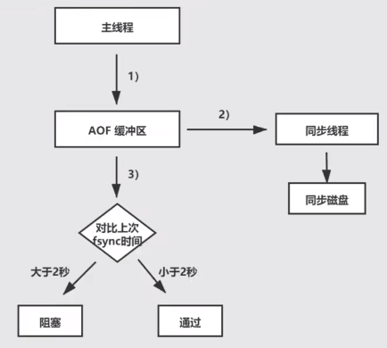

- 部署有关建议:

    - Redis实例的物理机要预留足够内存，应对 fork 和 rewrite
    - 单个Redis实例内存上限不要太大，例如4G或8G。可以加快 fork 的速度、减少主从同步、数据迁移压力
    - 不要与 CPU 密集型应用部署在一起
    - 不要与高硬盘负载应用一起部署。例如: 数据库、消息队列

#### 慢查询

- 慢查询: 在 Redis 执行时耗时超过某个闯值的命令，称为慢查询

- 慢查询的阈值可以通过配置指定

    - `slowlog-log-slower-than`: 慢查询阈值，单位是微秒。默认是10000，建议1000

- 慢查询会被放入**慢查询日志**中，日志的长度有上限，可以通过配置指定

    - `slowlog-max-len`: 慢查询日志(本质是一个队列)的长度。默认是128，建议1000

- 可以修改配置文件达到永久生效，也可以使用以下命令动态修改配置（重启会失效）

  ```bash
  config set slowlog-log-slower-than 1000
  config set slowlog-max-len 1000
  ```

- 查看慢查询日志列表:

    - `slowlog len`: 查询慢查询日志长度
    - `slowlog get [n]`: 读取 n 条慢查询日志
    - `slowlog reset`: 清空慢查询列表

- 也可以通过 Redis 的桌面客户端 RESP.app 查看

  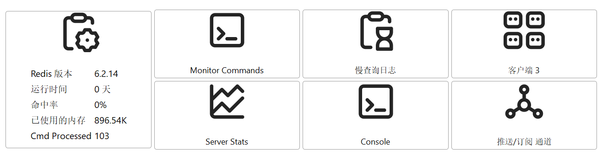

#### 命令及安全配置

- Redis 会绑定在 0.0.0.0:6379，这样将会将 Redis 服务暴露到公网上，而 Redis 如果没有做身份认证，会出现严重的安全漏洞
    - 漏洞重现方式: [Redis未授权访问配合SSH key文件利用分析-腾讯云开发者社区-腾讯云 (tencent.com)](https://cloud.tencent.com/developer/article/1039000)
    - 漏洞出现的核心的原因有以下几点:
        - Redis 未设置密码
        - 利用了 Redis 的 `config set` 命令动态修改Redis配置
        - 使用了Root账号权限启动Redis
- 为了避免这样的漏洞，这里给出一些建议:
    1. Redis一定要设置密码
    2. 禁止线上使用下面命令:`keys`、`flushall` 、`flushdb`、`config set` 等命令。可以利用`rename-command`修改命令名称，达到禁用目的
    3. bind: 限制网卡，禁止外网网卡访问
    4. 开启防火墙
    5. 不要使用 Root 账户启动 Redis
    6. 尽量不是有默认的端口

#### 内存配置

- 当 Redis 内存不足时，可能导致 Key 频繁被删除、响应时间变长、QPS 不稳定等问题。当内存使用率达到 90% 以上时就需要我们警惕，并快速定位到内存占用的原因

  |  内存占用  | 说明                                                         |
    | :--------: | ------------------------------------------------------------ |
  |  数据内存  | 是 Redis 最主要的部分，存储 Redis 的键值信息。主要问题是 BigKey 问题、内存碎片问题 |
  |  进程内存  | Redis 主进程本身运行肯定需要占用内存，如代码、常量池等等;这部分内存大约几兆，在大多数生产环境中与 Redis 数据占用的内存相比可以忽略 |
  | 缓冲区内存 | 一般包括**客户端缓冲区**、**AOF 缓冲区**、**复制缓冲区等**。客户端缓冲区又包括输入缓冲区和输出缓冲区两种。这部分内存占用波动较大，不当使用 BigKey，可能导致内存溢出 |

- Redis 提供了一些命令，可以查看到 Redis 目前的内存分配状态，也可以通过 Redis 的桌面客户端 RESP.app 查看

  ```bash
  info memory
  
  memory stats
  ```

- 内存缓冲区常见的有三种:

    1. 复制缓冲区: 主从复制的repl_backlog_buf，如果太小可能导致频繁的全量复制，影响性能。通过 `repl-backlogsize` 来设置，默认 1mb

    2. AOF 缓冲区: AOF 刷盘之前的缓存区域，AOF 执行 rewrite 的缓冲区。无法设置容量上限

    3. 客户端缓冲区: 分为**输入缓冲区**和**输出缓冲区**，输入缓冲区最大 1G 且不能设置。输出缓冲区可以设置

       ```bash
       # 输出缓冲区配置项
       client-output-buffer-limit <class> <hard limit> <soft limit> <soft seconds>
       ```

        - `<class>` : 客户端类型
            - normal：普通客户端
            - replica：主从复制客户端
            - pubsub：pubsub 客户端
        - `<hard limit>` : 缓冲区上限在超过 limit 后断开客户端
        - `<soft limit> <soft seconds>` : 缓冲区上限，在超过 soft limit 并且持续了 soft seconds 秒后断开客户端

       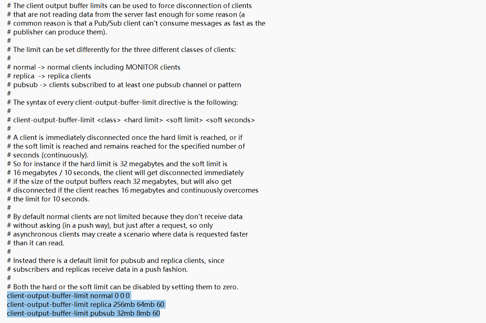

        - Reids 提供了查看客户端信息命令，也可以通过 Redis 的桌面客户端 RESP.app 查看

          ```
          info clients
          
          client list
          ```

        - 通过检测客户端信息，对客户端缓冲区进行判断，是否出现故障，以及时处理

### 集群最佳实践

- 集群虽然具备高可用特性，能实现自动故障恢复，但是如果使用不当，也会存在一些问题:
    1. 集群完整性问题
    2. 集群带宽问题
    3. 数据倾斜问题
    4. 客户端性能问题
    5. 命令的集群兼容性问题
    6. lua 和事务问题

**集群完整性问题**

- 在 Redis 的默认配置中有一个配置`cluster-require-full-coverage`，如果发现任意一个插槽不可用，则整个集群都会停止对外服务:

  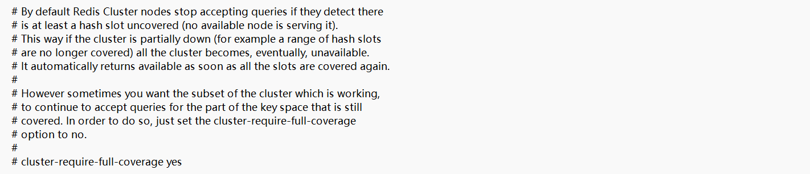

- 为了保证高可用特性，建议将 `cluster-require-full-coverage` 配置为 false
    - 这样即使有节点宕机，宕机节点对应的插槽无法存数据，插槽正常的节点上依然存数据，不会停止整个集群服务

**集群带宽问题**

- 集群节点之间会不断的互相 `Ping` 来确定集群中其它节点的状态。每次 `Ping` 携带的信息至少包括:
    - 插槽信息
    - 集群状态信息

- 当集群中节点越多，集群状态信息数据量也越大，10 个节点的相关信息可能达到 1kb，此时每次集群互通需要的带宽会非常高
    - 解决带宽高途径
        1. 避免大集群，集群节点数不要太多，最好少于 1000，如果业务庞大，则建立多个集群
        2. 避免在单个物理机中运行太多 Redis 实例
        3. 配置合适的 `cluster-node-timeout` 值

**选择集群还是主从**

- 单体 Redis (主从 Redis )已经能达到万级别的 QPS，并且也具备很强的高可用特性。如果主从能满足业务需求的情况下，尽量不搭建 Redis 集群