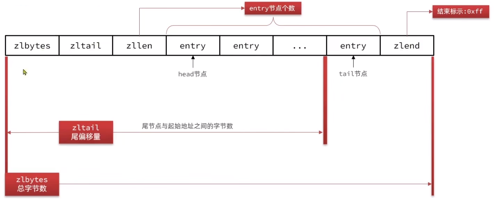
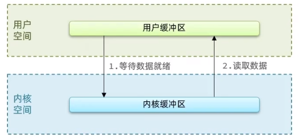
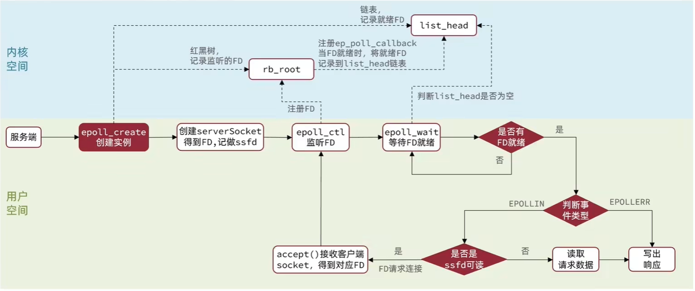

# Redis 原理

- redis 源码：[redis/redis: Redis is an in-memory database that persists on disk. The data model is key-value, but many different kind of values are supported: Strings, Lists, Sets, Sorted Sets, Hashes, Streams, HyperLogLogs, Bitmaps. (github.com)](https://github.com/redis/redis)
- 以下出现的源码是基于 redis 6.2 版本

## 一、数据结构

###  SDS(动态字符串)

- Redis 中保存的 Key 是字符串，value 往往是字符串或者字符串的集合。可见字符串是 Redis 中最常用的一种数据结构

- 经过 Redis 是由  C 语言编写的，但是 Redis 没有直接使用 C 语言中的字符串，因为 C 语言字符串存在很多问题

    - 获取字符串长度的需要通过运算
    - 非二进制安全
        - 字符数组中间存在 `/0`的情况，这个字符就会在`/0`处结束，表示字符数组不能存一些特殊字符
    - 不可修改

- 因此，Redis 构建了一种新的字符串结构，称为**简单动态字符串**(Simple Dynamic string)简称 SDS

    - SDS 也是通过 C 语言编写，是一个结构体，在 `sds.h` 中定义，源码如下

      ```c
      struct __attribute__ ((__packed__)) sdshdr8 {
          uint8_t len; /* used  */  // buf 已保存的字符串字节数，不包含结束标示
          uint8_t alloc; /* excluding the header and null terminator */  //buf申请的总的字节数，不包含结束标示
          unsigned char flags; /* 3 lsb of type, 5 unused bits */  //不同 SDS 的头类型，用来控制 SDS 的头大小
          char buf[]; //存数据体
      };
      ```

    - `flags` 的具体类型也在 `sds.h` 中有定义

      ```c
      #define SDS_TYPE_5  0
      #define SDS_TYPE_8  1
      #define SDS_TYPE_16 2
      #define SDS_TYPE_32 3
      #define SDS_TYPE_64 4
      #define SDS_TYPE_MASK 7
      #define SDS_TYPE_BITS 3
      ```

    - 例如，一个包含字符串  name 的 SDS 结构如下

      

    - SDS 之所以叫做动态字符串，是因为它具备动态扩容的能力

        - 假如我们要给 SDS 追加一段字符串,首先会申请新内存空间

            - 如果新字符串小于1M，则新空间为扩展后字符串长度的两倍+1;
            - 如果新字符串大于1M，则新空间为扩展后字符串长度+1M+1。称为内存预分配。

        - 例如，一个内容为 “hi” 的 SDS:

          

            - 追加一段字符串 “Amy” 则变成如下

              

    - SDS 的优点

        1. 获取字符串长度的时间复杂度为0(1)
        2. 支持动态扩容
        3. 减少内存分配次数
        4. 二进制安全

### IntSet

- IntSet 是 Redis 中 set 集合的一种实现方式，基于**整数数组**来实现，并且具备**长度可变**、**有序**等特征

    - 结构定义在 `intset.h`中

      ```c
      typedef struct intset {
          uint32_t encoding; /* 编码方式，支持存放16位、32位、64位整数 */
          uint32_t length;   /* 元素个数 */
          int8_t contents[]; /* 整数数组，保存集合数据 */
      } intset;
      ```

    - 虽然 `intset` 结构将 `contents` 属性声明为 `int8_t` 类型的数组，只是充当了一个指向集合数据的指针，实际上 `contents` 数组并不保存任何 `int8_t` 类型的值，`contents` 数组的真正类型取决于 `encoding` 属性的值

        - 其中的 `encoding` 包含三种模式，表示存储的整数大小不同，在`intset.c`中定义

          ```c
          /* Note that these encodings are ordered, so:
           * INTSET_ENC_INT16 < INTSET_ENC_INT32 < INTSET_ENC_INT64. */
          #define INTSET_ENC_INT16 (sizeof(int16_t)) /* 2字节整数，范围类似java的short */
          #define INTSET_ENC_INT32 (sizeof(int32_t)) /* 4字节整数，范围类似java的int */
          #define INTSET_ENC_INT64 (sizeof(int64_t)) /* 8字节整数，范围类似java的long */
          ```

- 为了方便查找，Redis 会将 intset 中所有的整数**按照升序**依次保存在 contents 数组中，结构如图

  

    - 上图的每部分字节大小为
        - encoding: 4字节
            - `uint32_t` 类型为32bit = 4字节
        - length: 4字节
            - `uint32_t` 类型为32bit = 4字节
        - contents: 2字节*3=6字节
            - 根据 `encoding:INTSET ENC_INT16` 决定每个元素为 16bit = 2字节

- Intset 类型升级，具体升级源码在 `intset.c`中的 `intsetAdd` 方法

    - 假设有一个 intset，元素为 {5,10,20}，采用的编码是 `INTSET_ENC_INT16`，则每个整数占 2 字节，共 6 个字节
    - 若向其中添加一个数字: 50000，这个数字超出了 `int16_t`的范围，intset 会自动升级编码方式到合适的大小，升级流程为：
        1. 升级编码为 `INTSET_ENC_INT32`，每个整数占 4 字节，并按照新的编码方式及元素个数扩容数组，扩容到16 个字节
        2. **倒序**依次将数组中的元素拷贝到扩容后的正确位置，**倒序**的目的是解决扩容时覆盖其他元素的内存
        3. 将待添加的元素放入数组末尾
        4. 最后，将 inset 的 `encoding` 属性改为 `INTSET_ENC_INT32`，将 length 属性改为 4

- Intset 可以看做是**特殊的整数数组**，具备一些特点

    1. Redis 会确保 Intset 中的元素**唯一**、**有序**
    2. 具备类型升级机制，可以节省内存空间
    3. 底层采用二分查找方式来查询

### Dict

- Redis 本身是一个**键值型**(Key-Value Pair)的数据库，我们可以根据键实现快速的增删改查。而键与值的映射关系正是通过 **Dict** 来实现的

- Dict 由三部分组成，分别是: **哈希表(DictHashTable)**、**哈希节点(DictEntry)**、**字典(Dict)**

    - 结构定义在`dict.h`

      ```c
      typedef struct dictEntry {
          // 键
          void *key;
          // 值
          union {
              void *val;
              uint64_t u64;
              int64_t s64;
              double d;
          } v;
          // 指向下一个 Entry 的指针
          struct dictEntry *next;
      } dictEntry;
      
      /* This is our hash table structure. Every dictionary has two of this as we
       * implement incremental rehashing, for the old to the new table. */
      typedef struct dictht {
          // Entry 数组,数组中保存的是指向 Entry 结构的指针
          dictEntry **table;
          // 哈希表大小
          unsigned long size;
          // 哈希表大小的掩码，总等于 size-1，用于计算元素存放位置
          unsigned long sizemask;
          // Entry 个数
          unsigned long used;
      } dictht;
      
      typedef struct dict {
          // dict 类型，内置不同的 hash 函数
          dictType *type;
          // 私有数据，在做特殊 hash 运算时用
          void *privdata;
          // 一个 Dict 包含两个哈希表，其中一个是当前数据，另一个一般是空，rehash 时使用
          dictht ht[2];
          // rehash 的进度，-1 表示未进行
          long rehashidx; /* rehashing not in progress if rehashidx == -1 */
          // rehash 是否暂停，1 则暂停，0 则继续
          int16_t pauserehash; /* If >0 rehashing is paused (<0 indicates coding error) */
      } dict;
      ```

    - 当向 Dict 添加键值对时，Redis 首先根据 key 计算出 hash 值(h)，然后利用 `h & sizemask` 来计算元素应该存储到数组中的哪个索引位置

        - 为什么通过 `h & sizemask` 计算存储的位置？

          >  首先 `dictht` 中的`size = 2 的 n 次方`  ，又因为 `sizemask = size - 1`，所以  `sizemask = 2 的 n 次方 - 1`
          >
          > 因此 `sizemask` 转为 2 进制一共有 n 位，且全为 1，通过 `hash & sizemask` 计算的到的值一定在 `0 ~ 2 的 n 次方 - 1` 的范围，实际上就等同于使用 `hash % size` 的效果，但是使用 `h & sizemask` 由于是通过位运算，效率更高
          >
          > 类似 `HashMap` 的计算 hash 位置

    - Dict 采用**头插法**插入同一个存储位置的元素，由于 Redis 是单线程，因此不会出现线程安全问题

  


#### Dict 的扩容

- Dict 中的 HashTable 就是数组结合单向链表的实现，当集合中元素较多时，必然导致哈希冲突增多，链表过长，则查询
  效率会大大降低

- Dict 在每次新增键值对时都会检查**负载因子**(`LoadFactor = used/size`)，满足以下两种情况时会触发**哈希表扩容**:

    1. 哈希表的 `LoadFactor >= 1`，并且服务器没有执行 `BGSAVE` 或者 `BGREWRITEAOF` 等后台进程
    2. 哈希表的 `LoadFactor > 5`;

  `dict.c` 源码参考

  ```c
  /* Expand the hash table if needed */
  static int _dictExpandIfNeeded(dict *d)
  {
      /* Incremental rehashing already in progress. Return. */
      // 如果正在rehash，则返回ok
      if (dictIsRehashing(d)) return DICT_OK;
  
  
      /* If the hash table is empty expand it to the initial size. */
      // 如果哈希表为空，则初始化哈希表为默认大小:4
      if (d->ht[0].size == 0) return dictExpand(d, DICT_HT_INITIAL_SIZE);
  
  
      /* If we reached the 1:1 ratio, and we are allowed to resize the hash
       * table (global setting) or we should avoid it but the ratio between
       * elements/buckets is over the "safe" threshold, we resize doubling
       * the number of buckets. */
      /* 当负载因子(used/size)达到1以上，并且当前没有进行 bgrewrite 等子进程操作
       * 或者负载因子超过5，则进行 dictExpand ，也就是扩容 */
      if (!dictTypeExpandAllowed(d))
          return DICT_OK;
      if ((dict_can_resize == DICT_RESIZE_ENABLE &&
           d->ht[0].used >= d->ht[0].size) ||
          (dict_can_resize != DICT_RESIZE_FORBID &&
           d->ht[0].used / d->ht[0].size > dict_force_resize_ratio))
      {
          //扩容大小为 used + 1, 底层会对扩容大小做判断，实际上扩容到第一个大于等于 used + 1 的 2^n
          return dictExpand(d, d->ht[0].used + 1);
      }
      return DICT_OK;
  }
  ```

#### Dict 的收缩

- 每次删除元素时，也会对负载因子做检查，当 `LoadFactor<0.1` 时，会做哈希表收缩:

  `t_hash.h` 源码查看

  ```c
  /* Delete an element from a hash.
   * Return 1 on deleted and 0 on not found. */
  int hashTypeDelete(robj *o, sds field) {
      int deleted = 0;
  
      if (o->encoding == OBJ_ENCODING_ZIPLIST) {
          unsigned char *zl, *fptr;
  
          zl = o->ptr;
          fptr = ziplistIndex(zl, ZIPLIST_HEAD);
          if (fptr != NULL) {
              fptr = ziplistFind(zl, fptr, (unsigned char*)field, sdslen(field), 1);
              if (fptr != NULL) {
                  zl = ziplistDelete(zl,&fptr); /* Delete the key. */
                  zl = ziplistDelete(zl,&fptr); /* Delete the value. */
                  o->ptr = zl;
                  deleted = 1;
              }
          }
      } else if (o->encoding == OBJ_ENCODING_HT) {
          //  Dict 的收缩逻辑
          if (dictDelete((dict*)o->ptr, field) == C_OK) {
              deleted = 1;
  			//删除成功后，检查是否需要重置 Dict 大小，如果需要则调用 dictResize 重置
              /* Always check if the dictionary needs a resize after a delete. */
              if (htNeedsResize(o->ptr)) dictResize(o->ptr);
          }
  
      } else {
          serverPanic("Unknown hash encoding");
      }
      return deleted;
  }
  ```

  `server.h` 源码查看

  ```c
  int htNeedsResize(dict *dict) {
      long long size, used;
  	// 哈希表大小
      size = dictSlots(dict);
      // entry 数量
      used = dictSize(dict);
      // size > 4(哈希表初识大小) 并且 负载因子 < 0.1
      return (size > DICT_HT_INITIAL_SIZE &&
              (used*100/size < HASHTABLE_MIN_FILL));// 此处 HASHTABLE_MIN_FILL = 10
  }
  ```

  `dict.c` 源码参考

  ```c
  /* Resize the table to the minimal size that contains all the elements,
   * but with the invariant of a USED/BUCKETS ratio near to <= 1 */
  int dictResize(dict *d)
  {
      unsigned long minimal;
  	// 如果正在做 bgsave 或 bgrewriteof 或 rehash，则返回错误
      if (dict_can_resize != DICT_RESIZE_ENABLE || dictIsRehashing(d)) return DICT_ERR;
      // 获取 used，也就是 entry 个数
      minimal = d->ht[0].used;
      // 如果 used 小于 4，则重置为 4
      if (minimal < DICT_HT_INITIAL_SIZE)
          minimal = DICT_HT_INITIAL_SIZE;
      //重置大小为 minimal，实际上是第一个大于等于 minimal 的 2^n
      return dictExpand(d, minimal);
  }
  
  /* return DICT_ERR if expand was not performed */
  int dictExpand(dict *d, unsigned long size) {
      return _dictExpand(d, size, NULL);
  }
  
  /* Expand or create the hash table,
   * when malloc_failed is non-NULL, it'll avoid panic if malloc fails (in which case it'll be set to 1).
   * Returns DICT_OK if expand was performed, and DICT_ERR if skipped. */
  int _dictExpand(dict *d, unsigned long size, int* malloc_failed)
  {
      if (malloc_failed) *malloc_failed = 0;
  
      /* the size is invalid if it is smaller than the number of
       * elements already inside the hash table */
      // 如果当前 entry 数量超过了要申请的 size 大小，或者正在 rehash，直接报错
      if (dictIsRehashing(d) || d->ht[0].used > size)
          return DICT_ERR;
  
      // 声明新的 hash table
      dictht n; /* the new hash table */
      // 实际大小，第一个大于等于传入的 size 的 2^n 次方
      unsigned long realsize = _dictNextPower(size);
  
      /* Detect overflows */
      // 超出 LONG MAX，说明内存溢出，报错
      if (realsize < size || realsize * sizeof(dictEntry*) < realsize)
          return DICT_ERR;
  
      /* Rehashing to the same table size is not useful. */
      // 新的 size 如果与旧的一致，报错
      if (realsize == d->ht[0].size) return DICT_ERR;
  
      /* Allocate the new hash table and initialize all pointers to NULL */
      // 重置新的 hash table 大小和掩码
      n.size = realsize;
      n.sizemask = realsize-1;
      if (malloc_failed) {
          n.table = ztrycalloc(realsize*sizeof(dictEntry*));
          *malloc_failed = n.table == NULL;
          if (*malloc_failed)
              return DICT_ERR;
      } else
          // 分配内存: size * entrySize
          n.table = zcalloc(realsize*sizeof(dictEntry*));
  	// 已使用初始化为 0
      n.used = 0;
  
      /* Is this the first initialization? If so it's not really a rehashing
       * we just set the first hash table so that it can accept keys. */
      // 如果是第一次，则直接把 n 赋值给 ht[0] 即可
      if (d->ht[0].table == NULL) {
          d->ht[0] = n;
          return DICT_OK;
      }
  	
      /* Prepare a second hash table for incremental rehashing */
      //否则，需要 rehash，此处只需要把 rehashidx 置为 0 即可。在每次增、删、改、查时都会触发 rehash
      d->ht[1] = n;
      d->rehashidx = 0;
      return DICT_OK;
  }
  ```

#### Dict 的 rehash

- 不管是扩容还是收缩，必定会创建新的哈希表，导致哈希表的 `size` 和 `sizemask` 变化，而 `key` 的查询与 `sizemask` 有关。因此必须对哈希表中的每一个 `key` 重新计算索引，插入新的哈希表，这个过程称为 `rehash`。
- Dict 的 rehash 并不是一次性完成的。试想一下，如果 Dict 中包含数百万的 entry，要在一次 rehash 完成，极有可能**导致主线程阻塞**。因此 Dict 的 rehash 是**分多次**、**渐进式**的完成，因此称为**渐进式 rehash**
- 过程是这样的:
    1. 计算新 hash 表的 `realeSize`，值取决于当前要做的是扩容还是收缩
        - 如果是扩容，则新 `size` 为第一个大于等于 `dict.ht[0].used+1`的 2^n
        - 如果是收缩，则新 `size` 为第一个大于等于 `dict.ht[0].used` 的 2^n (不得小于4)
    2. 按照新的 `realeSize` 申请内存空间，创建新的 `dictht`，并赋值给当前 `dict` 的 `dict.ht[1]`
    3. 设置 `dict.rehashidx=0`，标示开始 rehash，在每次增、删、改、查时都会触发 rehash
    4. 将 `dict.ht[0]` 中的每一个 `dictEntry` 都**渐进式 rehash** 到 `dict.ht[1]`
        - 每次执行新增、查询、修改、删除操作时，都检査一下 `dict.rehashidx` 是否大于 -1如果是则将 `dict.ht[0].table[rehashidx] 的 entny 链表 rehash 到dict.ht[1]`，并且将 `rehashidx++`。直至`dict.ht[0]` 的所有数据都 rehash 到 `dict.ht[1]`
        - 在 rehash 过程中，新增操作，则直接写入 `ht[1]`，查询、修改和删除则会在 `dict.ht[0]` 和 `dict.ht[1]` 依次查找并执行。这样可以确保 `ht[0]` 的数据只减不增，随着 rehash 最终为空
    5. 将 `dict.ht[1]` 赋值给 `dict.ht[0]`，给 `dict.ht[1]` 初始化为空哈希表，释放原来的 `dict.ht[0]` 的内存
    6. 将 `rehashidx` 赋值为 -1，代表 rehash 结束

### ZipList

- ZipList 是一种特殊的“双端链表”，由一系列**特殊编码**的**连续内存块**组成。可以在**任意一端进行压入/弹出操作**，并且该操作的时间复杂度为 `0(1)`

  **内存结构图**

  

  | 属性    | 类型     | 长度   | 用途                                                         |
    | ------- | -------- | :----- | ------------------------------------------------------------ |
  | zlbytes | uint32_t | 4 字节 | 记录整个压缩列表占用的内存字节数                             |
  | zltail  | uint32_t | 4 字节 | 记录压缩列表表尾节点距离压缩列表的起始地址有多少字节，通过这个偏移量，可以确定表尾节点的地址 |
  | zllen   | uint16_t | 2 字节 | 记录了压缩列表包含的节点数量。最大值为 `UINT16_MAX`(65534)，如果超过这个值，此处会记录为 65535，但节点的真实数量需要遍历整个压缩列表才能计算得出 |
  | entry   | 列表节点 | 不定   | 压缩列表包含的各个节点，节点的长度由节点保存的内容决定       |
  | zlend   | uint8_t  | 1 字节 | 特殊值 `0xFF`(十进制 255)，用于标记压缩列表的末端            |

#### ZipList 中的 Entry

- ZipList 中的 Entry 并不像普通链表那样记录前后节点的指针，因为记录两个指针要占用 16 个字节，浪费内存。而是采用
  了下面的结构:

  

    - `previous_entry_length`: 前一节点的长度，占 1 个或 5 个字节
        - 如果前一节点的长度小于 254 字节，则采用 1 个字节来保存这个长度值
        - 如果前一节点的长度大于 254 字节，则采用 5 个字节来保存这个长度值，第一个字节为 `0xfe`，后四个字节才是真实长度数据
    - `encoding`: 编码属性，记录 `content` 的数据类型(字符串还是整数)以及长度，占用 1 个、2 个或 5 个字节
    - `content`: 负责保存节点的数据，可以是字符串或整数

- Entry 这样设计，就可以通过内存的计算算出当前节点的长度，这样就可以**根据当前节点地址和当前节点长度计算出下一个节点地址**实现正序遍历，可以**根据当前节点和`previous_entry_length` 计算出前一个节点的地址**实现逆序遍历

#### ZipList Entry 中的 encoding 编码

- Entry 中的 `encoding` 编码分为**字符串**和**整数**两种，用前两位二进制区分

    1. **字符串**: 如果 `encoding`是以`00`、`01`或者`10`开头，则证明 `content` 是字符串

       | encoding 编码二进制示例                              | 编码长度 | 字符串大小          |
            | ---------------------------------------------------- | -------- | ------------------- |
       | \|00pppppp\|                                         | 1bytes   | <= 63 bytes         |
       | \|01pppppp\|qqqqqqqq\|                               | 2 bytes  | <= 16383 bytes      |
       | \|10000000\|qqqqqqqq\|rrrrrrrr\|ssssssss\|tttttttt\| | 5 bytes  | <= 4294967295 bytes |

        - 例如，保存字符串 “ab” 和 “bc“

          

    2. **整数**: 如果 `encoding` 是以 `11` 开始，则证明 `content` 是整数，且 `encoding` 固定只占用 1 个字节

       | encoding 编码二进制示例 | 编码长度 | 整数类型                                                     |
            | ----------------------- | -------- | ------------------------------------------------------------ |
       | 11000000                | 1        | int16_t(2 bytes)                                             |
       | 11010000                | 1        | int32_t(4 bytes)                                             |
       | 11100000                | 1        | int64 t(8 bytes)                                             |
       | 11110000                | 1        | 24 位有符整数(3 bytes)                                       |
       | 11111110                | 1        | 8 位有符整数(1 bytes)                                        |
       | 1111xxxx                | 1        | 直接在 xxxx 位置保存数值，范围从0001~1101，减 1 后结果为实际值 |

        - 例如，ZipList中保存两个整数值: 2 和 5

          

#### ZipList 的连锁更新问题

- ZipList 的每个 Entry 都包含 `previous_entry_length` 来记录上一个节点的大小，长度是 1 个或 5 个字节:
    - 如果前一节点的长度小于 254 字节，则采用 1 个字节来保存这个长度值
    - 如果前一节点的长度大于等于 254 字节，则采用 5 个字节来保存这个长度值，第一个字节为 `0xfe`，后四个字节才是真
      实长度数据
- 连锁更新问题
    - 假设有 N 个连续的、长度为 250~253 字节之间的 entry，因此 entry 的 `previous_entry_length` 属性用 1 个字节即可。此时往 ZipList 中插入了一个长度为 254 字节的 entry 并且插入位置在首位，由于该新 entry 的长度为 254 字节，因此跟在后面的旧 entry 本来用 1 个字节记录的 `previous_entry_length` 属性需要变为 5个字节，导致这个旧 entry 的长度就会大于等于 254 字节，促使后面 entry 的 `previous_entry_length` 属性需要由 1 个字节变为 5个字节，这种情况下，这 N 个连续的节点都需要进行扩容
    - ZipList 这种特殊情况下产生的**连续多次空间扩展**操作称之为**连锁更新**(Cascade Update)。**新增**、**删除**都可能导致连锁更新的发生
        - **连续多次空间扩展**会频繁地申请内存、销毁内存、数据的迁移，这会涉及到用户态和内核态的上下文切换，极大影响性能
        - 这个问题发生的条件比较苛刻，发生概率比较低

#### ZipList 的特性

1. 压缩列表的可以看做一种连续内存空间的"双向链表"
2. 列表的节点之间不是通过指针连接，而是记录上一节点和本节点长度来寻址，内存占用较低
3. 如果列表数据过多，导致链表过长，可能影响查询性能
4. 增或删较大数据时有可能发生连续更新问题

### QuickList

- ZipList 存在问题

    - ZipList 虽然节省内存，但申请内存必须是连续空间，如果内存占用较多，申请内存效率很低。怎么办?
        - 为了缓解这个问题，必须限制 ZipList 的长度和 entry 大小
    - 但是如果要存储大量数据，超出了 ZipList 最佳的上限该怎么办?
        - 可以创建多个 ZipList 来分片存储数据
    - 数据拆分后比较分散，不方便管理和查找，这多个 ZipList 如何建立联系?
        - Redis 在 3.2 版本引入了新的数据结构 QuickList，它是一个双端链表，只不过链表中的每个节点都是一个 ZipList、

  

- 为了避免 QuickList 中的每个 ZipList 中 entry 过多，Redis 提供了一个配置项: `list-max-ziplist-size` 来限制。

    - 如果值为正，则代表 ZipList 的允许的 entry 个数的最大值，如果值为负，则代表 ZipList 的最大内存大小

    - 分5种情况:

        - `-1`:每个 ZipList 的 内存占用不能超过 4kb

        - ` -2`:每个 ZipList 的内存占用不能超过 8kb

        -  `-3`:每个 ZipList 的内存占用不能超过 16kb

        - `-4`:每个 ZipList 的内存占用不能超过 32kb

        -  `-5`:每个 ZipList 的内存占用不能超过 64kb

        - 其默认值为 `-2`

          ```bash
          # 查看配置命令
          config get list-max-ziplist-size
          ```

- 除了控制 ZipList 的大小，QuickList 还可以对节点的 ZipList 做**压缩**。通过配置项 `list-compress-depth`来控制。因为链表一般都是从首尾访问较多，所以首尾是不压缩的。这个参数是控制首尾不压缩的节点个数

    - `0`:特殊值，代表不压缩

    - `1`:标示 QuickList 的首尾各有 1 个节点不压缩，中间节点压缩

    - `2`:标示 QuickList 的首尾各有 2 个节点不压缩，中间节点压缩

    - 以此类推

      ```bash
      # 查看配置命令
      config get list-compress-depth`
      ```

- QuickList 结构源码，`quicklist.h`文件

  ```c
  /* quicklist is a 40 byte struct (on 64-bit systems) describing a quicklist.
   * 'count' is the number of total entries.
   * 'len' is the number of quicklist nodes.
   * 'compress' is: 0 if compression disabled, otherwise it's the number
   *                of quicklistNodes to leave uncompressed at ends of quicklist.
   * 'fill' is the user-requested (or default) fill factor.
   * 'bookmakrs are an optional feature that is used by realloc this struct,
   *      so that they don't consume memory when not used. */
  typedef struct quicklist {
      // 头节点指针
      quicklistNode *head;
      // 尾节点指针
      quicklistNode *tail;
      // 所有 ziplist 的 entry 的数量
      unsigned long count;        /* total count of all entries in all ziplists */
      // ziplists 总数量
      unsigned long len;          /* number of quicklistNodes */
      // ziplist 的 entry 上限，默认值 -2
      int fill : QL_FILL_BITS;              /* fill factor for individual nodes */
      // 首尾不压缩的节点数量
      unsigned int compress : QL_COMP_BITS; /* depth of end nodes not to compress;0=off */
      // 内存重分配时的书签数量及数组，一般用不到
      unsigned int bookmark_count: QL_BM_BITS;
      quicklistBookmark bookmarks[];
  } quicklist;
  
  
  /* quicklistNode is a 32 byte struct describing a ziplist for a quicklist.
   * We use bit fields keep the quicklistNode at 32 bytes.
   * count: 16 bits, max 65536 (max zl bytes is 65k, so max count actually < 32k).
   * encoding: 2 bits, RAW=1, LZF=2.
   * container: 2 bits, NONE=1, ZIPLIST=2.
   * recompress: 1 bit, bool, true if node is temporary decompressed for usage.
   * attempted_compress: 1 bit, boolean, used for verifying during testing.
   * extra: 10 bits, free for future use; pads out the remainder of 32 bits */
  typedef struct quicklistNode {
      // 前一个节点指针
      struct quicklistNode *prev;
      // 下一个节点指针
      struct quicklistNode *next;
      // 当前节点的 ziplist 指针
      unsigned char *zl;
      // 当前节点的 zipList 的字节大小
      unsigned int sz;             /* ziplist size in bytes */
      // 当前节点的 zipList 的 entry 个数
      unsigned int count : 16;     /* count of items in ziplist */
      // 编码方式:1 : ZipList; 2 : lzf压缩模式
      unsigned int encoding : 2;   /* RAW==1 or LZF==2 */
      // 数据容器类型(预留) : 1，其它; 2，ZipList
      unsigned int container : 2;  /* NONE==1 or ZIPLIST==2 */
      // 是否被解压缩。1:则说明被解压了，将来要重新压缩
      unsigned int recompress : 1; /* was this node previous compressed? */
      // 测试用
      unsigned int attempted_compress : 1; /* node can't compress; too small */
      // 预留字段
      unsigned int extra : 10; /* more bits to steal for future usage */
  } quicklistNode;
  ```

  

- QuickList 的特点:
    - 是一个节点为 ZipList 的双端链表
    - 节点采用 ZipList，解决了传统链表的内存占用问题
    - 控制了 ZipList 大小，解决连续内存空间申请效率问题
    - 中间节点可以压缩，进一步节省了内存

### SkipList

- SkipList (跳表 )首先是链表，但与传统链表相比有几点差异:

    - 元素按照升序排列存储
    - 节点可能包含多个指针，指针跨度不同

  

- 在文件`server.h`中查看源码

  ```c
  typedef struct zskiplist {
      // 头尾节点指针
      struct zskiplistNode *header, *tail;
      // 节点数量
      unsigned long length;
      // 最大的索引层级，默认是 1
      int level;
  } zskiplist;
  
  /* ZSETs use a specialized version of Skiplists */
  typedef struct zskiplistNode {
      // 节点存储的值
      sds ele;
      // 节点分数，排序、查找用
      double score;
      // 前一个节点指针
      struct zskiplistNode *backward;
      // 多级索引数组，每一个节点都有多个索引
      struct zskiplistLevel {
          // 下一个节点指针
          struct zskiplistNode *forward;
          // 索引跨度，跨越多少个元素
          unsigned long span;
      } level[];
  } zskiplistNode;
  ```

  

- SkipList 的特点:

    - 跳跃表是一个**双向链表**，每个节点都包含 score 和 ele 值
    - 节点按照 score 值排序，score 值一样则按照 ele 字典排序
    - 每个节点都可以包含多层指针，层数是 1 到 32 之间的随机数
    - 不同层指针到下一个节点的跨度不同，层级越高，跨度越大
    - 增删改查效率与红黑树基本一致，实现却更简单

### RedisObject

- Redis 中的任意数据类型的键和值都会被封装为一个 RedisObject，也叫做 Redis 对象，

  在文件`server.h`中查看源码

  ```c
  // 对象类型
  /* The actual Redis Object */
  #define OBJ_STRING 0    /* String object. */
  #define OBJ_LIST 1      /* List object. */
  #define OBJ_SET 2       /* Set object. */
  #define OBJ_ZSET 3      /* Sorted set object. */
  #define OBJ_HASH 4      /* Hash object. */
  
  // 11 种编码方式
  /* Objects encoding. Some kind of objects like Strings and Hashes can be
   * internally represented in multiple ways. The 'encoding' field of the object
   * is set to one of this fields for this object. */
  // raw 编码动态字符串
  #define OBJ_ENCODING_RAW 0     /* Raw representation */
  // long 类型的整数的字符串
  #define OBJ_ENCODING_INT 1     /* Encoded as integer */
  // hash 表(字典 dict )
  #define OBJ_ENCODING_HT 2      /* Encoded as hash table */
  #define OBJ_ENCODING_ZIPMAP 3  /* Encoded as zipmap */
  // 双端链表
  #define OBJ_ENCODING_LINKEDLIST 4 /* No longer used: old list encoding. */
  // 压缩列表
  #define OBJ_ENCODING_ZIPLIST 5 /* Encoded as ziplist */
  // 整数集合
  #define OBJ_ENCODING_INTSET 6  /* Encoded as intset */
  // 跳表
  #define OBJ_ENCODING_SKIPLIST 7  /* Encoded as skiplist */
  // embstr 的动态字符串
  #define OBJ_ENCODING_EMBSTR 8  /* Embedded sds string encoding */
  // 快速列表
  #define OBJ_ENCODING_QUICKLIST 9 /* Encoded as linked list of ziplists */
  // 快速列表
  #define OBJ_ENCODING_STREAM 10 /* Encoded as a radix tree of listpacks */
  
  
  typedef struct redisObject {
      // 对象类型，分别是 string、hash、list、set 和 zset，占4个bit位
      unsigned type:4;
      // 底层编码方式，共有11种，占4个bit位
      unsigned encoding:4;
      // lru 表示该对象最后一次被访问的时间，其占用 24 个 bit 位。便于判断空闲时间太久的 key
      unsigned lru:LRU_BITS; /* LRU time (relative to global lru_clock) or
                              * LFU data (least significant 8 bits frequency
                              * and most significant 16 bits access time). */
      // 对象引用计数器，计数器为 0 则说明对象无人引用，可以被回收
      int refcount;
      // 指针，指向存放实际数据的空间
      void *ptr;
  } robj;
  ```

- Redis 中会根据存储的数据类型不同，选择不同的编码方式。每种数据类型的使用的编码方式如下

  | 数据类型   | 编码方式                                           |
    | ---------- | -------------------------------------------------- |
  | OBJ_STRING | int、embstr、raw                                   |
  | OBJ_LIST   | LinkedList 和 ZipList(3.2以前)、QuickList(3.2以后) |
  | OBJ_SET    | intset、HT                                         |
  | 0BJ_ZSET   | ZipList、HT、SkipList                              |
  | OBJ_HASH   | ZipList、HT                                        |


### Redis 五种数据类型

#### 1. string

- String 是 Redis 中最常见的数据存储类型

    - 其基本编码方式是 **RAW**，基于简单动态字符串(SDS)实现，存储上限为 512mb

      ​	

    - 如果存储的 SDS 长度小于 44 字节，则会采用**EMBSTR **编码，此时 object head 与 SDS 是一段连续空间。申请内存时只需要调用一次内存分配函数，效率更高

      

    - 如果存储的字符串是**整数**值，并且大小在 LONG_MAX范围内，则会采用 **INT **编码：直接将数据保存在 RedisObject 的 ptr 指针位置(刚好8字节)，不再需要 SDS 了

      

  ```bash
  # 查看 key 的编码格式
  OBJECT encoding key
  ```


#### 2. List

- Redis 的 List 类型可以从首、尾操作列表中的元素，底层采用 **0uickList** 编码，结构如图

    - 能够满足可以从首、尾操作列表元素的数据结构有
        - LinkedList：普通链表，可以从双端访问，内存占用较高，内存碎片较多
        - ZipList：压缩列表，可以从双端访问，内存占用低，存储上限低
        - **0uickList**：LinkedList + ZipList，可以从双端访问，内存占用较低，包含多个 ZipList，存储上限高

  

- 部分源码, `t_list.c`

  ```c
  /* Implements LPUSH/RPUSH/LPUSHX/RPUSHX. 
   * 'xx': push if key exists. */
  void pushGenericCommand(client *c, int where, int xx) {
      int j;
  
      for (j = 2; j < c->argc; j++) {
          if (sdslen(c->argv[j]->ptr) > LIST_MAX_ITEM_SIZE) {
              addReplyError(c, "Element too large");
              return;
          }
      }
  
      robj *lobj = lookupKeyWrite(c->db, c->argv[1]);
      if (checkType(c,lobj,OBJ_LIST)) return;
      if (!lobj) {
          if (xx) {
              addReply(c, shared.czero);
              return;
          }
  
          // 创建 Quicklist
          lobj = createQuicklistObject();
          quicklistSetOptions(lobj->ptr, server.list_max_ziplist_size,
                              server.list_compress_depth);
          dbAdd(c->db,c->argv[1],lobj);
      }
  
      for (j = 2; j < c->argc; j++) {
          listTypePush(lobj,c->argv[j],where);
          server.dirty++;
      }
  
      addReplyLongLong(c, listTypeLength(lobj));
  
      char *event = (where == LIST_HEAD) ? "lpush" : "rpush";
      signalModifiedKey(c,c->db,c->argv[1]);
      notifyKeyspaceEvent(NOTIFY_LIST,event,c->argv[1],c->db->id);
  }
  ```

  `object.c`

  ```c
  robj *createQuicklistObject(void) {
      quicklist *l = quicklistCreate();
      robj *o = createObject(OBJ_LIST,l);
      o->encoding = OBJ_ENCODING_QUICKLIST;
      return o;
  }
  ```

#### 3. set

- Set 是 Redis 中的单列集合，满足下列特点:

    - 不保证有序性
    - 保证元素唯一(可以判断元素是否存在)
    - 求交集、并集、差集

- 为了查询效率和唯一性，set 采用 **HT** 编码(**Dict**)。Dict 中的 key 用来存储元素，value 统一为 null

  

- 当存储的所有数据都是整数，并且元素数量不超过 set-max-intset-entries （默认值 512）时，Set 会采用 **Intset** 编码，以节省内存

  

- 源码，`t_set.c`

  ```c
  /* Factory method to return a set that *can* hold "value". When the object has
   * an integer-encodable value, an intset will be returned. Otherwise a regular
   * hash table. */
  robj *setTypeCreate(sds value) {
      // 判断 value 是否为数值类型
      if (isSdsRepresentableAsLongLong(value,NULL) == C_OK)
          return createIntsetObject();
      return createSetObject();
  }
  
  
  /* Add the specified value into a set.
   *
   * If the value was already member of the set, nothing is done and 0 is
   * returned, otherwise the new element is added and 1 is returned. */
  // 往 set 添加数据
  int setTypeAdd(robj *subject, sds value) {
      long long llval;
      if (subject->encoding == OBJ_ENCODING_HT) {  // HT 编码，则直接往 dict 添加元素
          dict *ht = subject->ptr;
          dictEntry *de = dictAddRaw(ht,value,NULL);
          if (de) {
              dictSetKey(ht,de,sdsdup(value));
              dictSetVal(ht,de,NULL);
              return 1;
          }
      } else if (subject->encoding == OBJ_ENCODING_INTSET) {  // IntSet 编码
          //若 value 为整数，直接往 IntSet 中添加元素
          if (isSdsRepresentableAsLongLong(value,&llval) == C_OK) {
              uint8_t success = 0;
              subject->ptr = intsetAdd(subject->ptr,llval,&success);
              if (success) {
                  /* Convert to regular set when the intset contains
                   * too many entries. */
                  size_t max_entries = server.set_max_intset_entries;
                  /* limit to 1G entries due to intset internals. */
                  if (max_entries >= 1<<30) max_entries = 1<<30;
                  // 若 IntSet 的元素数量超出 set_max_intset_entries，则将 IntSet 转为 HT
                  if (intsetLen(subject->ptr) > max_entries)
                      setTypeConvert(subject,OBJ_ENCODING_HT);
                  return 1;
              }
          } else {
              /* Failed to get integer from object, convert to regular set. */
              //若 value 不是整数，将 IntSet 转为 HT
              setTypeConvert(subject,OBJ_ENCODING_HT);
  
              /* The set *was* an intset and this value is not integer
               * encodable, so dictAdd should always work. */
              serverAssert(dictAdd(subject->ptr,sdsdup(value),NULL) == DICT_OK);
              return 1;
          }
      } else {
          serverPanic("Unknown set encoding");
      }
      return 0;
  }
  ```

  `object.c`

  ```c
  //创建 IntSet
  robj *createIntsetObject(void) {
      intset *is = intsetNew();
      robj *o = createObject(OBJ_SET,is);
      o->encoding = OBJ_ENCODING_INTSET;
      return o;
  }
  
  // 创建 dict
  robj *createSetObject(void) {
      dict *d = dictCreate(&setDictType,NULL);
      robj *o = createObject(OBJ_SET,d);
      o->encoding = OBJ_ENCODING_HT;
      return o;
  }
  ```

#### 4. Zset （SortedSet）

- Zset 也就是 SortedSet，其中每一个元素都需要指定一个 score 值和 member值
    - 可以根据 score 值排序
    - member 必须唯一
    - 可以根据 member 查询分数
- 因此，Zset 底层数据结构必须满足**键值存储**、**键必须唯一**、**可排序**这几个需求
    - `SkipList` : 可以排序，并且可以同时存储 score 和 ele 值 (member)
    - `HT (Dict)` : 可以键值存储，并且可以根据 key 找 value

- `Zset` 结构源码，`t_zset.c`

  ```c
  // zset 结构体
  typedef struct zset {
      // Dict 指针
      dict *dict;
      // Skiplist 指针
      zskiplist *zsl;
  } zset;
  
  // 创建 zset 对象
  robj *createZsetObject(void) {
      zset *zs = zmalloc(sizeof(*zs));
      robj *o;
  	// 创建 Dict
      zs->dict = dictCreate(&zsetDictType,NULL);
      // 创建 Skiplist
      zs->zsl = zslCreate();
      o = createObject(OBJ_ZSET,zs);
      o->encoding = OBJ_ENCODING_SKIPLIST;
      return o;
  }
  ```

  

- 由上述 `zset` 的内存结构图可看出，完整的`zset`结构包含大量指针，内存消耗会很大。且当元素数量不多时，`HT` 和 `SkipList` 的优势不明显。

    - 因此 `zset` 还会采用 `ZipList` 结构来节省内存，不过需要同时满足两个条件:

        1. 元素数量小于 `zset_max_ziplist_entries`，默认值 128

        2. 每个元素都小于`zset_max_ziplist_value` 字节，默认值 64

           ```bash
           config get zset_max_ziplist_entries
           
           config get zset_max_ziplist_value
           ```

    - 在 `t_zset.c` 中的 `zaddGenericCommand` 方法初始化 `zset` 对象，部分源代码如下

      ```c
            // 略......
          /* Lookup the key and create the sorted set if does not exist. */
          // zadd添加元素时，先根据 key 找到 zset，不存在则创建新的 zset
          zobj = lookupKeyWrite(c->db,key);
          if (checkType(c,zobj,OBJ_ZSET)) goto cleanup;
          // zset 不存在
          if (zobj == NULL) {
              if (xx) goto reply_to_client; /* No key + XX option: nothing to do. */
              // zset_max_ziplist_entries 设置为 0 就是禁用了 ZipList
              if (server.zset_max_ziplist_entries == 0 ||
                  server.zset_max_ziplist_value < sdslen(c->argv[scoreidx+1]->ptr))
              {
                  // 或者 value 大小超过了 zset_max_ziplist_value，采用 HT + SkipList
                  zobj = createZsetObject();
              } else {
                  // 否则，采用 ZipList
                  zobj = createZsetZiplistObject();
              }
              dbAdd(c->db,key,zobj);
          }
      
          for (j = 0; j < elements; j++) {
              double newscore;
              score = scores[j];
              int retflags = 0;
      
              ele = c->argv[scoreidx+1+j*2]->ptr;
              // zsetAdd 方法这种会进行 ZipList 与 HT + SkipList 转换的判断
              int retval = zsetAdd(zobj, score, ele, flags, &retflags, &newscore);
              if (retval == 0) {
                  addReplyError(c,nanerr);
                  goto cleanup;
              }
              if (retflags & ZADD_OUT_ADDED) added++;
              if (retflags & ZADD_OUT_UPDATED) updated++;
              if (!(retflags & ZADD_OUT_NOP)) processed++;
              score = newscore;
          }
          // 略......
      ```

      ```c
      int zsetAdd(robj *zobj, double score, sds ele, int in_flags, int *out_flags, double *newscore) { 
          // 略......
          /* Update the sorted set according to its encoding. */
          // ZipList 编码
          if (zobj->encoding == OBJ_ENCODING_ZIPLIST) {
              unsigned char *eptr;
              //判断当前元素是否已经存在，已经存在则更新score即可
              if ((eptr = zzlFind(zobj->ptr,ele,&curscore)) != NULL) {
                  // 略......
                  return 1;
              } else if (!xx) {
                  /* check if the element is too large or the list
                   * becomes too long *before* executing zzlInsert. */
                  // 元素不存在，需要新增，则判断 ziplist 长度有没有超、元素的大小有没有超
                  if (zzlLength(zobj->ptr)+1 > server.zset_max_ziplist_entries ||
                      sdslen(ele) > server.zset_max_ziplist_value ||
                      !ziplistSafeToAdd(zobj->ptr, sdslen(ele)))
                  {
                      // 如果超出，则需要转为 SkipList 编码
                      zsetConvert(zobj,OBJ_ENCODING_SKIPLIST);
                  } else {
                      zobj->ptr = zzlInsert(zobj->ptr,ele,score);
                      if (newscore) *newscore = score;
                      *out_flags |= ZADD_OUT_ADDED;
                      return 1;
                  }
              } else {
                  *out_flags |= ZADD_OUT_NOP;
                  return 1;
              }
          }
          // 略......
      }
      ```

      `object.c`

      ```c
      robj *createZsetObject(void) {
          zset *zs = zmalloc(sizeof(*zs));
          robj *o;
      
          zs->dict = dictCreate(&zsetDictType,NULL);
          zs->zsl = zslCreate();
          o = createObject(OBJ_ZSET,zs);
          o->encoding = OBJ_ENCODING_SKIPLIST;
          return o;
      }
      
      robj *createZsetZiplistObject(void) {
          unsigned char *zl = ziplistNew();
          robj *o = createObject(OBJ_ZSET,zl);
          o->encoding = OBJ_ENCODING_ZIPLIST;
          return o;
      }
      ```

    - `ziplist` 本身没有排序功能，而且没有键值对的概念，因此需要由 `zset` 通过编码实现

        - `zipList` 是连续内存，因此 `score` 和 `element` 是紧挨在一起的两个 `entry`，`element` 在前，`score` 在后

        - `score` 越小越接近队首，`score` 越大越接近队尾，按照 `score` 值升序排列

          

​

#### 5. Hash

- `Hash` 结构与 Redis 中的 `Zset` 非常类似:

    - 都是键值存储
    - 都需求根据键获取值
    - 键必须唯一

- `Hash` 与`Zset` 区别如下

    - c 的键是 `member`，值是 `score`; `Hash` 的键和值都是任意值
    - `Zset`要根据 `score` 排序; `Hash` 则无需排序

- 因此，`Hash` 底层采用的编码与 `Zset` 也基本一致，只需要把排序有关的 `SkipList` 去掉即可:

    - `Hash`  结构默认采用 `ZipList` 编码，用以节省内存。`ZipList` 中相邻的两个 `entry `分别保存 `field` 和`value`

      

    - 当数据量较大时，`Hash`  结构会转为 `HT` 编码，也就是 `Dict`，触发条件有两个

        1. `ZipList` 中的元素数量超过了 `hash-max-ziplist-entries (默认512)`
        2. `ZipList`中的任意 `entry` 大小超过了 `hash-max-ziplist-value (默认64字节)`

      

- 部分源码，`t_hash.c`

  ```c
  // hset 命令，例： hset userl name Jack age 21
  void hsetCommand(client *c) {
      int i, created = 0;
      robj *o;
  
      if ((c->argc % 2) == 1) {
          addReplyErrorFormat(c,"wrong number of arguments for '%s' command",c->cmd->name);
          return;
      }
  
      //判断 hash 的 key 是否存在，不存在则创建一个新的，默认采用 ZipList 编码
      if ((o = hashTypeLookupWriteOrCreate(c,c->argv[1])) == NULL) return;
      // 判断是否需要把 ZipList 转为 Dict
      hashTypeTryConversion(o,c->argv,2,c->argc-1);
  
      // 循环遍历每一对 field 和 value，并执行 hset 命令
      for (i = 2; i < c->argc; i += 2)
          created += !hashTypeSet(o,c->argv[i]->ptr,c->argv[i+1]->ptr,HASH_SET_COPY);
  
      /* HMSET (deprecated) and HSET return value is different. */
      char *cmdname = c->argv[0]->ptr;
      if (cmdname[1] == 's' || cmdname[1] == 'S') {
          /* HSET */
          addReplyLongLong(c, created);
      } else {
          /* HMSET */
          addReply(c, shared.ok);
      }
      signalModifiedKey(c,c->db,c->argv[1]);
      notifyKeyspaceEvent(NOTIFY_HASH,"hset",c->argv[1],c->db->id);
      server.dirty += (c->argc - 2)/2;
  }
  
  robj *hashTypeLookupWriteOrCreate(client *c, robj *key) {
      robj *o = lookupKeyWrite(c->db,key);
      if (checkType(c,o,OBJ_HASH)) return NULL;
  
      if (o == NULL) {
          //创建 hash 对象
          o = createHashObject();
          dbAdd(c->db,key,o);
      }
      return o;
  }
  
  /* Check the length of a number of objects to see if we need to convert a
   * ziplist to a real hash. Note that we only check string encoded objects
   * as their string length can be queried in constant time. */
  void hashTypeTryConversion(robj *o, robj **argv, int start, int end) {
      int i;
      size_t sum = 0;
  	// 本来就不是 ZipList 编码，直接 return
      if (o->encoding != OBJ_ENCODING_ZIPLIST) return;
  
      for (i = start; i <= end; i++) {
          if (!sdsEncodedObject(argv[i]))
              continue;
          size_t len = sdslen(argv[i]->ptr);
          // 如果 field 或 value 超过 hash_max_ziplist_value，则转为HT
          if (len > server.hash_max_ziplist_value) {
              hashTypeConvert(o, OBJ_ENCODING_HT);
              return;
          }
          sum += len;
      }
      // ziplist 总大小超过 1G，也转为 HT
      if (!ziplistSafeToAdd(o->ptr, sum))
          hashTypeConvert(o, OBJ_ENCODING_HT);
  }
  
  
  int hashTypeSet(robj *o, sds field, sds value, int flags) {
      int update = 0;
      //判断是否为 ZipList 编码
      if (o->encoding == OBJ_ENCODING_ZIPLIST) {
          unsigned char *zl, *fptr, *vptr;
  
          zl = o->ptr;
          //查询 head 指针
          fptr = ziplistIndex(zl, ZIPLIST_HEAD);
          // head 不为空，说明 ZipList 不为空，开始查找 key
          if (fptr != NULL) {
              fptr = ziplistFind(zl, fptr, (unsigned char*)field, sdslen(field), 1);
              // 判断是否存在，如果已经存在则更新
              if (fptr != NULL) {
                  /* Grab pointer to the value (fptr points to the field) */
                  vptr = ziplistNext(zl, fptr);
                  serverAssert(vptr != NULL);
                  // 元素存在，记录操作为更新
                  update = 1;
  
                  /* Replace value */
                  zl = ziplistReplace(zl, vptr, (unsigned char*)value,
                          sdslen(value));
              }
          }
          //不存在，则直接 push
          if (!update) {
              /* Push new field/value pair onto the tail of the ziplist */
              // 依次push新的 field 和 value 到 ZipList 的尾部
              zl = ziplistPush(zl, (unsigned char*)field, sdslen(field),
                      ZIPLIST_TAIL);
              zl = ziplistPush(zl, (unsigned char*)value, sdslen(value),
                      ZIPLIST_TAIL);
          }
          o->ptr = zl;
  
          /* Check if the ziplist needs to be converted to a hash table */
          // 插入了新元素后，检查 list 长度是否超出，超出则转为 HT
          if (hashTypeLength(o) > server.hash_max_ziplist_entries)
              hashTypeConvert(o, OBJ_ENCODING_HT);
      } else if (o->encoding == OBJ_ENCODING_HT) {
  		// HT 编码，直接插入或覆盖，略......
      } else {
          serverPanic("Unknown hash encoding");
      }
  
      /* Free SDS strings we did not referenced elsewhere if the flags
       * want this function to be responsible. */
      if (flags & HASH_SET_TAKE_FIELD && field) sdsfree(field);
      if (flags & HASH_SET_TAKE_VALUE && value) sdsfree(value);
      return update;
  }
  ```

  `object.c`

  ```c
  robj *createHashObject(void) {
      // 默认采用 ZipList 编码，申请 ZipList 内存空间
      unsigned char *zl = ziplistNew();
      robj *o = createObject(OBJ_HASH, zl);
      o->encoding = OBJ_ENCODING_ZIPLIST;
      return o;
  }
  ```


## 二、网络模型

### 用户空间和内核空间

- 任何 Linux 发行版，其系统内核都是 Linux。我们的应用都需要通过 Linux 内核与硬件交互

  

- 为了避免用户应用导致冲突甚至内核崩溃，用户应用与内核是分离的

    - 进程的寻址空间会划分为两部分: **内核空间**、**用户空间**

    - **用户空间**只能执行受限的命令( `Ring3` )，而且不能直接调用系统资源，必须通过内核提供的接口来访问

    - **内核空间**可以执行特权命令( `Ring0` )调用一切系统资源

      

- Linux 系统为了提高 IO 效率，会在用户空间和内核空间都加入**缓冲区**

    - 写数据时，要把**用户缓冲区**数据拷贝到**内核缓冲区**，然后写入设备

    - 读数据时，要从设备读取数据到**内核缓冲区**，然后拷贝到**用户缓冲区**

      

    - 因此数取数据的流程可以简化为如下

        - 通过针对这两个阶段进行优化，出现以下几种网络 IO 模型
            - 阻塞 I0 (**Blocking I0**)
            - 非阻塞 I0 (**Nonblocking I0**)
            - I0 多路复用 (**I0 Multiplexing**)
            - 信号驱动 I0 (**Signal Driven l0**)
            - 异步 I0 (**Asynchronous I0**)

      

### 阻塞 IO （Blocking I0）

- 阻塞 I0 就是两个阶段都必须阻塞等待，性能差

  

### 非阻塞 IO（Nonblocking I0）

- 非阻塞 I0 的 `recvfrom` 操作会立即返回结果而不是阻塞用户进程

    - 非阻塞 I0 在**等待数据阶段**是非阻塞的，但是在**数据拷贝阶段**依然是阻塞的
    - 虽然是非阻塞，在某些情况下性能并没有得到提高。而且**忙等机制**会导致 CPU 空转，CPU 使用率暴增

  

> 非阻塞 I/O 相比于阻塞 I/O 通常能够提升性能，尤其是在处理高并发的网络请求时。然而，是否能够提升性能以及提升的幅度，取决于应用的具体场景和实现方式。
>
> ### 阻塞 I/O 与非阻塞 I/O 的区别
>
> 1. **阻塞 I/O**：在阻塞 I/O 模式下，当一个 I/O 操作（如读取或写入）发起时，调用线程会被阻塞，直到操作完成为止。这意味着如果线程正在等待 I/O 操作完成（比如等待读取的数据），它就无法继续执行其他任务。
> 2. **非阻塞 I/O**：在非阻塞 I/O 模式下，I/O 操作立即返回，而不必等待操作完成。如果数据还没有准备好，操作会返回一个标志（如返回 `-1` 或 `EAGAIN`），告知调用者此时无法完成操作。调用线程可以继续执行其他任务，并在稍后再尝试执行该 I/O 操作。
>
> ### 非阻塞 I/O 提升性能的原因
>
> 1. **提高并发性**：
     >    - **阻塞 I/O**：在高并发的情况下，使用阻塞 I/O 的传统模型通常需要为每个 I/O 请求分配一个线程。线程阻塞时，系统资源（如内存和 CPU）会浪费在等待操作完成上。这在处理大量并发请求时可能导致性能瓶颈。
>    - **非阻塞 I/O**：使用非阻塞 I/O，单个线程可以处理多个 I/O 操作。通过不断轮询 I/O 状态或结合事件驱动机制（如 `select`, `poll`, `epoll`，或 `kqueue`），系统可以高效地处理大量并发请求，而不必为每个请求分配一个独立线程，从而降低线程切换的开销。
> 2. **减少资源消耗**：
     >    - 阻塞 I/O 模式下的线程可能因为阻塞而消耗不必要的系统资源（如内存和 CPU 时间）。
>    - 非阻塞 I/O 模式允许线程在 I/O 操作未完成时继续执行其他任务，从而更好地利用 CPU 资源。这在处理 I/O 密集型任务时尤为重要。
> 3. **更好的响应性**：
     >    - 在阻塞 I/O 模式下，如果 I/O 操作需要较长时间才能完成，调用线程将长时间等待，导致系统响应变慢。
>    - 使用非阻塞 I/O，线程不会因为单个 I/O 操作而长时间停滞，这有助于提高系统整体响应性。
>
> ### 非阻塞 I/O 的局限性
>
> 尽管非阻塞 I/O 在许多场景中能够提升性能，但它也存在一些局限性：
>
> 1. **复杂性增加**：实现非阻塞 I/O 通常比阻塞 I/O 更复杂。开发者需要处理 I/O 状态的轮询或回调管理，这可能会导致代码更加复杂和难以维护。
> 2. **轮询的开销**：在没有使用事件驱动机制的情况下，非阻塞 I/O 可能会涉及轮询（polling），即不断检查 I/O 操作是否完成。频繁的轮询会带来性能开销，因此，在不适当的情况下，非阻塞 I/O 可能反而降低性能。
> 3. **适用场景有限**：在某些场景中，阻塞 I/O 可能更加合适。例如，对于少量的 I/O 操作，阻塞 I/O 的简单性和低复杂性可能更有优势。
>
> ### 总结
>
> 非阻塞 I/O 相比于阻塞 I/O 通常能提升性能，特别是在处理高并发场景下。然而，具体提升的幅度取决于应用场景、实现方式和硬件资源等多个因素。在选择 I/O 模型时，开发者需要权衡性能提升与代码复杂性之间的关系。

### IO 多路复用（I0 Multiplexing）

- 无论是阻塞 I0 还是非阻塞 I0，用户应用在一阶段都需要调用 recvfrom 来获取数据，差别在于无数据时的处理方案:

    - 如果调用 recvfrom 时，恰好没有数据，**阻塞 I0 会使进程阻塞**，**非阻塞 I0使CPU空转**，都不能充分发挥 CPU 的作用
    - 如果调用 recvfrom 时，恰好有数据，则用户进程可以直接进入第二阶段，读取并处理数据

- 比如服务端处理客户端 Socket 请求时，在单线程情况下，只能依次处理每一个 Socket ，如果正在处理的 Socket 恰好未就绪(数据不可读或不可写)，线程就会被阻塞，所有其它客户端 Socket 都必须等待，性能自然会很差

    - 提高性能的方式
        1. 多线程
        2. IO 多路复用（单线程）

- **文件描述符** (File Descriptor) : 简称 **FD**，是一个从 0 开始递增的无符号整数，用来关联 Linux 中的一个文件。在 Linux 一切皆文件，例如常规文件、视频、硬件设备等，当然也包括网络套接字 (Socket) 中

- **I0 多路复用** : 是利用单个线程来同时监听多个 FD，并在某个 FD 可读、可写时得到通知，从而避免无效的等待，充分利用CPU资源

    - 监听 FD 的方式、通知的方式有多种实现，常见的有:
        - select
        - poll
        - epoll
    - 差异:
        - select 和 poll 只会通知用户进程有 FD 就绪，但不确定具体是哪个 FD，需要用户进程逐个遍历FD来确认
        - epoll 则会在通知用户进程 FD 就绪的同时，把已就绪的 FD 写入用户空间

  

#### 1. select

- select 是 Linux 中最早的 I/0 多路复用实现方案

  ```c
  //定义类型别名__fd_mask，本质是 long int
  typedef long int __fd_mask;
  
  /*fd_set 记录要监听的fd集合，及其对应状态 */
  typedef struct {
  	// fds_bits是long类型数组，长度为 1024/32= 32
      //共 1024 个 bit 位，每个 bit 位代表一个 fd，0 代表未就绪，1 代表就绪
      __fd_mask fds_bits[__FD_SETSIZE /_NFDBITS];
      // ...
  } fd_set;
  
  // select 函数，用于监听多个 fd 的集合
  int select(
  	int nfds，//要监视的fd_set的最大fd + 1
      fd_set *readfds,  // 要监听读事件的fd集合
      fd_set *writefds, // 要监听写事件的fd集合
      fd_set *exceptfds,// 要监听异常事件的fd集合
      //超时时间，null-永不超时;0-不阻塞等待;大于0-固定等待时间
      struct timeval *timeout
  );
  ```

  

- select 模式存在的问题:

    - 需要将整个 `fd_set` 从用户空间拷贝到内核空间，select 结束还要再次拷贝回用户空间
    - select 无法得知具体是哪个 fd 就绪，需要遍历整个 `fd_set`
    - `fd_set` 监听的fd数量不能超过 1024

#### 2. poll

- poll 模式对 select 模式做了简单改进，但性能提升不明显，部分关键代码如下:

  ```c
  // pollfd 中的事件类型
  #define POLLIN		//可读事件
  #define POLLOUT		//可写事件
  #define POLLERR		//错误事件
  #define POLLNVAL	//fd未打开
  // pollfd结构
  struct pollfd {
  	int fd;				/* 要监听的fd */
      short int events;	/* 大要监听的事件类型:读、写、异常 */
      short int revents;	/* 实际发生的事件类型 */
  };
  
  // poll函数
  int poll(
      struct pollfd *fds,	// pollfd数组，可以自定义大小
      nfds_t nfds,		// 数组元素个数
      int timeout 		//超时时间
  );
  ```

- IO 流程

    1. 创建 `pollfd` 数组，向其中添加关注的 fd 信息，数组大小自定义
    2. 调用 `poll` 函数，将 `pollfd` 数组拷贝到内核空间，转链表存储，无上限
    3. 内核遍历 fd，判断是否就绪
    4. 数据就绪或超时后，拷贝`pollfd` 数组到用户空间，返回就绪 fd 数量 n
    5. 用户进程判断 n 是否大于 0
    6. 大于 0 则遍历 `pollfd` 数组，找到就绪的 fd

- 与 select 对比:

    - select 模式中的 `fd_set` 大小固定为 1024，而 `pollfd` 在内核中采用链表，理论上无上限
    - `poll` 监听的 FD 越多，每次遍历消耗时间也越久，性能反而会下降

#### 3. epoll

- epoll 模式是对 select 和 poll 的改进，它提供了三个函数:

  ```c
  struct eventpoll {
  	//...
      struct rb_root rbr;	//一颗红黑树，记录要监听的FD
      struct list_head rdlist;//一个链表，记录就绪的FD
      //...
  };
  
  //1.会在内核创建 eventpoll 结构体，返回对应的句柄epfd
  int epoll_create(int size);
  
  //2.将一个 FD 添加到 epoll 的红黑树中，并设置 ep_poll_callback
  // callback 触发时，就把对应的 FD 加入到 rdlist 这个就绪列表中
  int epoll_ctl(
      int epfd,epoll,		//实例的句柄
      int op,				//要执行的操作，包括:ADD、MOD、DEL
      int fd,				//要监听的 FD
      struct epoll_event *event	// 要监听的事件类型:读、写、异常等
  );
  
  //3.检查 rdlist 列表是否为空，不为空则返回就绪的 FD 的数量
  int epoll_wait(
      int epfd,						//eventpoll实例的句柄
      struct epoll_event *events,		//空 event 数组，用于接收就绪的FD
      int maxevents,					//events 数组的最大长度
      int timeout 					//超时时间，-1用不超时;不阻塞;大于0为阻塞时间
  );
  ```

  

- epoll 模式解决 select 和 poll 存在的问题

    - 基于 epoll 实例中的红黑树保存要监听的 FD，理论上无上限，而且增删改查效率都非常高，性能不会随监听的 FD 数量增多而下降
    - 每个 FD 只需要执行一次 `epoll_ctl` 添加到红黑树，以后每次 `epoll_wait` 无需传递任何参数，无需重复拷贝 FD 到内核空间
    - 内核会将就绪的 FD 直接拷贝到用户空间的指定位置，用户进程无需遍历所有 FD 就能知道就绪的 FD 是谁

##### 事件通知机制

- 当 FD 有数据可读时，我们调用 `epoll_wait` 就可以得到通知。但是事件通知的模式有两种
    - `LevelTriggered`: 简称**LT**。当 FD 有数据可读时，会重复通知多次，直至数据处理完成。是 epoll 的默认模式。
    - `EdgeTriggered`: 简称**ET**。当 FD 有数据可读时，只会被通知一次，不管数据是否处理完成。
- ET 模式避免了 LT 模式可能出现的**惊群现象**
- ET 模式最好结合**非阻塞 I0 **读取 FD 数据，相比LT会复杂一些

##### 基于 epoll 模式的 web 服务的基本流程



### 信号驱动 IO（Signal Driven l0）

- 信号驱动 I0 是与内核建立 SIGI0 的信号关联并设置回调，当内核有 FD 就绪时，会发出 SIGIO 信号通知用户，期间用户应用可
  以执行其它业务，无需阻塞等待

  

- 缺点

    - 当有大量 I0 操作时，信号较多，SIGIO 处理函数不能及时处理可能导致信号队列溢出
    - 而且内核空间与用户空间的频繁信号交互性能也较低

### 异步 I0 （Asynchronous I0）

- 异步 I0 的整个过程都是非阻塞的，用户进程调用完异步 API 后就可以去做其它事情，内核等待数据就绪并拷贝到用户空间后才会递交信号，通知用户进程

  

##### 同步 IO 和异步 IO

- I0 操作是同步还是异步，关键看数据在内核空间与用户空间的**拷贝过程**(数据读写的 I0 操作)，也就是第二阶段是同步还是异步

- 五个 I/0 模型的比较

  

### Redis 网络模型

- Redis 通过 **I0 多路复用**来提高网络性能，并且支持各种不同的多路复用实现，并且将这些实现进行封装，提供了统一的
  高性能事件库 API 库`ae`，暴露了统一的 IO 多路复用 API

    - `ae_epoll.c`：Linux 操作系统的实现方案
    - `ae_evport.c`：Solaris 操作系统的实现方案
    - `ae_kqueue.c`：类 UNIX 操作系统的实现方案（mac os、FreeBSD、OpenBSD、NetBSD）
    - `ae_select.c`：除了以上操作系统的通用实现方案

  

    - 几个核心的 API

      | API 方法                                                     | 说明                                  |
          | ------------------------------------------------------------ | ------------------------------------- |
      | `static int aeApiCreate(aeEventLoop *eventLoop)`             | 创建多路复用程序，比如 `epoll_create` |
      | `static int aeApiAddEvent(aeEventLoop *eventLoop, int fd, int mask)` | 注册FD，比如 `epoll_ctl`              |
      | `static void aeApiDelEvent(aeEventLoop *eventLoop, int fd, int delmask)` | 删除FD                                |
      | `static int aeApiPoll(aeEventLoop *eventLoop, struct timeval *tvp)` | 等待FD就绪，比如 `epoll_wait`         |
      | `static char *aeApiName(void)`                               |                                       |

- Redis 单线程网络模型的整个流程

    - 源码阅读从 `server.c`  的 `main` 方法开始
        -  调用了`initServer();`方法，初始化服务
        - 调用了 `aeMain(server.el);`，开始监听事件循环

  

- Redis 6.0 版本中引入了**多线程**，目的是为了提高 I0 读写效率

    - **命令请求处理器**涉及到命令的读取，会受到网络状态、带宽的影响，性能相对会差些
    - **命令恢复处理器**涉及到把结果写会客户端，也会受到网络状态、带宽的影响，性能相对会差些
    - 因此在**解析客户端命令**、**写响应结果**时采用了多线程。核心的命令执行 I0 多路复用模块依然是由主线程执行

  


##### Redis 到底是单线程还是多线程?

- 如果仅仅聊 Redis 的核心业务部分(命令处理)，答案是单线程
- 如果是聊整个 Redis，那么答案就是多线程
- 在Redis版本迭代过程中，在两个重要的时间节点上引入了多线程的支持:
    - Redis v4.0:引入多线程异步处理一些耗时较长的任务，例如异步删除命令unlink
    - Redis v6.0:在核心网络模型中引入多线程，进一步提高对于多核CPU的利用率
- **为什么 Redis 要选择单线程?**
    - 抛开持久化不谈，Redis 是纯内存操作，执行速度非常快，它的性能瓶颈是网络延迟而不是执行速度，因此多线程并不会带来巨大的性能提升。
    - 多线程会导致过多的上下文切换，带来不必要的开销
    - 引入多线程会面临线程安全问题，必然要引入线程锁这样的安全手段，实现复杂度增高，而且性能也会大打折扣

## 三、通信协议

### RESP 协议

- Redis 是一个 CS 架构的软件，通信一般分两步(不包括 `pipeline` 和 `PubSub`)
    1. 客户端(client)向服务端(server)发送一条命令
    2. 服务端解析并执行命令，返回响应结果给客户端
- 因此客户端发送命令的格式、服务端响应结果的格式必须有一个规范，这个规范就是通信协议
    - 而在 Redis 中采用的是 RESP(Redis Serialization Protocol) 协议:
        - Redis 1.2 版本引入了 RESP 协议
        - Redis 2.0 版本中成为与Redis服务端通信的标准，称为 RESP2
        - Redis 6.0 版本中，从 RESP2 升级到了 RESP3 协议，增加了更多数据类型并且支持 6.0 的新特性--客户端缓存
    - 但目前，默认使用的依然是 RESP2 协议

### RESP 数据类型

- 在 RESP 中，通过**首字节的字符**来区分不同数据类型，常用的数据类型包括5种

    - **单行字符串**: 首字节是 `+`，后面跟上单行字符串，以`CRLF("\r\n")`结尾。例如返回 "OK": `+OK\r\n`

    - **错误(Errors)**: 首字节是 `-`，与单行字符串格式一样，只是字符串是异常信息，例如: `-Error message\r\n`

    - **数值**: 首字节是 `:`，后面跟上数字格式的字符串，以 `CRLF` 结尾。例如: `:10\r\n`

    - **多行字符串**: 首字节是`$`，表示二进制安全的字符串，最大支持512MB:

      

        - 如果字符串大小为 0，则代表空字符串: `$0\r\n\r\n`
        - 如果字符串大小为 -1，则代表不存在: `$-r\n`

    - **数组**: 首字节是 `*`，后面跟上数组元素个数，再跟上元素，元素数据类型不限:

      


### 模拟 Redis 客户端

- 使用 Java 根据 resp 协议模拟一个 Redis 客户端

- 基本流程
    1. 建立连接
    2. 获取输入流、输出流
    3. 发出请求（redis 命令）
    4. 解析响应
    5. 释放连接

  ```java
  public class Main {
      static String host = "192.168.136.xxx";
      static int port = 6379;
      static Socket socket;
      static PrintWriter writer;
      static BufferedReader reader;
      public static void main(String[] args) {
  
          try {
              //1. 建立连接
              socket = new Socket(host, port);
              System.out.println("连接成功");
              //2. 获取输入流、输出流
              writer = new PrintWriter(new OutputStreamWriter(socket.getOutputStream(), StandardCharsets.UTF_8));
              // 此处目的是实现 resp 协议，为了方便使用字符流按行读取；按理来说应该使用字节流，因为返回的结果是二进制安全的，需要按字节读取
              reader = new BufferedReader(new InputStreamReader(socket.getInputStream(), StandardCharsets.UTF_8));
  
              //3. 发出请求（redis 命令）
              sendRequest("auth","222333");
              System.out.println("密码验证");
              //4. 解析响应
              Object o = handelResponse();
              System.out.println(o);
  
              sendRequest("set","name","lhk");
              o = handelResponse();
              System.out.println(o);
  
              sendRequest("get","name");
              o = handelResponse();
              System.out.println(o);
  
          } catch (IOException e) {
              throw new RuntimeException(e);
          }finally {
              //5. 释放连接
             if (socket != null) {
                 try {
                     socket.close();
                 } catch (IOException e) {
                     throw new RuntimeException(e);
                 }
             }
             if (reader != null) {
                 try {
                     reader.close();
                 } catch (IOException e) {
                     throw new RuntimeException(e);
                 }
             }
             if (writer != null) writer.close();
          }
  
      }
  
      private static Object handelResponse() throws IOException {
          int firstByte = reader.read();
          switch (firstByte) {
              case '+':
                  // 单行字符串，直接读一行
                  return reader.readLine();
              case '-':
                  // 错误信息, 直接读一行并抛出
                  throw new RuntimeException(reader.readLine());
              case ':':
                  // 数字
                  return Long.parseLong(reader.readLine());
              case '$' :
                  // 多行字符串，先读长度，再读数据
                  int len = Integer.parseInt(reader.readLine());
                  if (len == -1) return null;
                  if (len == 0) return "";
                  return reader.readLine();
              case '*' :
                  // 数组
                  return readBulkString();
              default:
                  throw new RuntimeException("协议错误");
          }
      }
  
      private static List<Object> readBulkString() throws IOException {
          //获取数组大小
          int len = Integer.parseInt(reader.readLine());
          if (len <= 0) return null;
          ArrayList<Object> objects = new ArrayList<>();
          for (int i = 0; i < len; i++) {
              objects.add(handelResponse());
          }
          return objects;
      }
  
      private static void sendRequest(String ... args) throws IOException {
          int length = args.length;
          writer.println("*" + length);   // 数组长度
          for (String arg : args) {
              writer.println("$" + arg.getBytes(StandardCharsets.UTF_8).length);  // 每个命令字符串字节长度
              writer.println(arg);    // 命令字符串
          }
          writer.flush();		// 写出数据
      }
  }
  
  ```


## 四、内存策略

- Redis 之所以性能强，最主要的原因就是基于内存存储。然而单节点的 Redis 其内存大小不宜过大，会影响持久化或主从同步性能

- 通过修改配置文件来设置 Redis 的最大内存

  ```bash
  maxmemory 1gb
  ```

### 过期策略

- 可以通过 `expire` 命令给 Redis 的 key 设置 TTL (存活时间)
    - 当 key 的 TTL 到期以后，再次访问 key 返回的是 `nil`，说明这个 key 已经不存在了，对应的内存也得到释放。从而起到内存回收的目的

- 考虑两个问题
    - Redis 是如何知道一个 key 是否过期呢
        - 利用两个Dict分别记录key-value对及key-TTL对
            - `expires`这个字典里面记录了 key-TTL
    - 是不是TTL到期就立即删除了呢
        - 惰性删除
        - 周期删除

#### reids 的 DB 结构

- Redis 本身是一个典型的 key-value 内存存储数据库，因此所有的 key、value 都保存在之前学习过的 `Dict` 结构中。不过在其 database 结构体中，有两个 `Dict` :
    - 一个用来记录 key-value
    - 另一个用来记录 key-TTL

```c
/* Redis database representation. There are multiple databases identified
 * by integers from 0 (the default database) up to the max configured
 * database. The database number is the 'id' field in the structure. */
typedef struct redisDb {
    /*存放所有key及value的地方，也被称为keyspace*/
    dict *dict;                 /* The keyspace for this DB */
    /*存放每一个key及其对应的TTL存活时间，只包含设置了TTL的key*/
    dict *expires;              /* Timeout of keys with a timeout set */
    dict *blocking_keys;        /* Keys with clients waiting for data (BLPOP)*/
    dict *ready_keys;           /* Blocked keys that received a PUSH */
    dict *watched_keys;         /* WATCHED keys for MULTI/EXEC CAS */
    int id;                     /* Database ID */
    /* 记录平均TTL时长 */
    long long avg_ttl;          /* Average TTL, just for stats */
    /* expire检查时在dict中抽样的索引位置 */
    unsigned long expires_cursor; /* Cursor of the active expire cycle. */
    /* 等待碎片整理的key列表 */
    list *defrag_later;         /* List of key names to attempt to defrag one by one, gradually. */
} redisDb;
```


#### 惰性删除

- **惰性删除**: 顾明思议并不是在 TTL 到期后就立刻删除，而是在访问一个 key 的时候，检查该 key 的存活时间，如果已经过期才执行删除
    - 存在会有一些过期了但是未被访问的数据一直未被删除

#### 周期删除

- **周期删除**: 顾明思议是通过一个定时任务，周期性的抽样部分过期的 key，然后执行删除。执行周期有两种:
    1. Redis 初始化时会设置一个定时住务 `serverCron()`，按照 `server.hz` 的频率来执行过期 key 清理，模式为 **SLOW**
    2. Redis 的每个事件循环前会调用 `beforeSleep()` 函数，执行过期 key 清理，模式为 **FAST**
- **SLOW** 模式规则:
    1. 执行频率受 `server.hz` 影响，默认为 10，即每秒执行 10 次，每个执行周期 100ms
    2. 执行清理耗时不超过一次执行周期的 25%.
    3. 逐个遍历 db，逐个追历 db 中的 bucket，抽取 20 个 key 判断是否过期，过期则删除，未过期则跳过
    4. 如果没达到时间上限(25ms)并且全局过期 key 比例大于 10%，再进行一次抽样，否则结束
- **FAST** 模式规则(过期 key 比例小于10%不执行):
    1. 执行频率受 `beforeSleep()` 调用频率影响，但两次 FAST 模式间隔不低于 2ms
    2. 执行清理耗时不超过1ms
    3. 逐个遍历db，逐个遍历 db 中的 bucket，抽取 20 个 key 判断是否过期，过期则删除，未过期则跳过
    4. 如果没达到时间上限 (1ms) 并且全局过期 key 比例大于 10%，再进行一次抽样，否则结束

### 淘汰策略

- 当 Redis的数据量十分庞大时，仅通过清除过期数据可能也会达到 Redis内存的上限

- **内存淘汰**: 就是当 Redis 内存使用达到设置的闽值时，Redis 主动挑选部分 key 删除以释放更多内存的流程

- Redis 支持 8 种不同策略来选择要删除的 key:

    1. `noeviction`:不淘汰任何 key，但是内存满时不允许写入新数据，默认就是这种策略。
    2. `volatile-ttl`: 对设置了 TTL 的 key，比较 key 的剩余 TTL 值，TTL 越小越先被淘汰
    3. `allkeys-random`: 对全体 key，**随机**进行淘汰。也就是直接从 `db->dict` 中随机挑选
    4. `volatile-random`: 对设置了 TTL 的 key，**随机**进行淘汰。也就是从 `db->expires` 中随机挑选。
    5. `allkeys-lru`: 对全体key，基于 **LRU 算法**进行淘汰
    6. `volatile-lru`:对设置了 TTL 的 key，基于 **LRU 算法**进行淘汰
    7. `allkeys-lfu`: 对全体 key，基于 **LFU 算法**进行淘汰
    8. `volatile-lfu`: 对设置了 TTL 的 key，基于 **LFU 算法**进行淘汰

- **LRU**(Least Recently Used)，最少最近使用。用当前时间减去最后一次访问时间，这个值越大则淘汰优先级越高
  **LFU**(Least Frequently Used)，最少频率使用。会统计每个 key 的访问频率，值越小淘汰优先级越高

- 在配置文件中配置淘汰策略

  ```bash
  # The default is:
  #
  # maxmemory-policy noeviction
  ```

- 在 `redisObject` 结构中，有记录内存淘汰算法的字段`lru:LRU_BITS`

  ```c
  typedef struct redisObject {
      // 对象类型，分别是 string、hash、list、set 和 zset，占4个bit位
      unsigned type:4;
      // 底层编码方式，共有11种，占4个bit位
      unsigned encoding:4;
      // LRU:以秒为单位记录最近一次访问时间，长度 24bit。便于判断空闲时间太久的 key
      // LFU:高16位以分钟为单位记录最近一次访问时间，低 8 位记录逻辑访问次数
      unsigned lru:LRU_BITS; /* LRU time (relative to global lru_clock) or
                              * LFU data (least significant 8 bits frequency
                              * and most significant 16 bits access time). */
      // 对象引用计数器，计数器为 0 则说明对象无人引用，可以被回收
      int refcount;
      // 指针，指向存放实际数据的空间
      void *ptr;
  } robj;
  ```

- **LFU** 的访问次数之所以叫做**逻辑访问次数**，是因为并不是每次 key 被访问都计数，而是通过运算:

    1. 生成 0~1 之间的随机数 R
    2. 计算 1/(旧次数*lfu_log_factor + 1)，记录为 P，lfu_log_factor 默认为 10
    3. 如果 R < P，则计数器 +1，且最大不超过255
    4. 访问次数会随时间衰减，距离上一次访问时间每隔 lfu_decay_time 分钟(默认1)，计数器 -1

- Redis 会在处理客户端命令的方法 `processCommand()` 中调用 `performEvictions()` 方法尝试做内存淘汰，具体流程

  