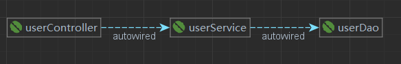

# Spring

## 1. IOC 容器

- `ioc`：inversion of control 反转控制（思想）

  - 将对象由主动创建转变为由 spring ioc 容器来提供对象，转换了对象的控制权

- `DI`：dependency injection 依赖注入（IOC的具体实现方式）

- `IOC `的 spring 实现

  

  - 获取容器

    1. 根据 bean 的类型获取 bean 对象

       ```java
       FileSystemXmlApplicationContext applicationContext = new FileSystemXmlApplicationContext("E:\\Workspace_IDEA\\Spring\\Spring_ioc_01\\src\\main\\resources\\applicationContext.xml");
       //当配置文件中配置一个对象时可以使用如下方法获得对象，配置有多个对象时可用getBean方法通过id的方法获取
       UserService userService = applicationContext.getBean(UserService.class);
       userService.save();
       ```

    2. 根据 bean ID 获取 bean 对象（常用）

       ```java
       ClassPathXmlApplicationContext applicationContext = new ClassPathXmlApplicationContext("applicationContext.xml");
       //通过 bean 的 ID 获得 bean 对象
       UserService userService = (UserService) applicationContext.getBean("userService");
       userService.save();
       ```

    3. 根据 bean 的 ID 和类型获取bean对象

       ```java
       UserService userService = applicationContext.getBean("userService",UserService.class);
       ```

    - 配置文件

      ```xml
      <!--通过与Service的构造器映射实现对Bean的依赖注入 -->
              <bean id="userService" class="com.lhk.service.serviceImpl.UserServiceImpl">
                      <constructor-arg name="userDao" ref="userDao"></constructor-arg>
              </bean>
      ```

    - 当某个接口有唯一的实现类，可以通过接口类型来获取到实现类的 bean 对象

      - 结论：在根据类型来获取 bean 时，在**满足 bean 唯一性**的前提下，其实是看 `` bean对象.instanceof(指定的类型)`` 的返回值，返回值为真就说明可以使用指定的类型拿到 bean 对象
        - 指定的类型包括 ：bean 的类型、bean 所实现的接口类型、bean 所继承的类的类型

  - 基于 xml 依赖注入

    1. 通过 setter 注入

       - property 标签：
         - name：设置属性名
         - ref：引用 IOC 容器中的 bean 对象，用于设置实体类型属性
         - value：设置属性值

       ```xml
       <!-- 通过与Service的set方法映射实现对Bean的依赖注入 -->
               <bean id="userService" class="com.lhk.service.serviceImpl.UserServiceImpl">
                       <property name="userDao" ref="userDao"></property>
               </bean>
       ```

    2. 通过构造器注入

       - constructor-arg 标签：

         - name：设置属性名

         - ref：引用 IOC 容器中的 bean 对象，用于设置实体类型属性

         - value：设置属性值

         - type：设置属性类型

         - index： 属性在构造器函数的位置索引

           ````xml
           <!--通过与Service的构造器映射实现对Bean的依赖注入 -->
                   <bean id="userService" class="com.lhk.service.serviceImpl.UserServiceImpl">
                           <constructor-arg name="userDao" ref="userDao"></constructor-arg>
                   </bean>
           ````

    3. 特殊值注入

       - 注入 null

         ```xml
                <bean id="user2" class="com.lhk.pojo.User">
                         <property name="name" value="TheMutents"></property>
                         <!--  给属性注入 null  -->            
                         <property name="addr">
                                 <null/>
                         </property>
                 </bean>
         ```

       - 注入特殊字符

         1. 使用 xml 实体处理特殊字符

            - 例如 ：``` &lt;``` 等价于```< ``` ，``` &gt;``` 等价于 ``` >```

              ````xml
              <property name="name" value="&lt;Lhk&gt;"></property>
              ````

         2. 使用 CDATA 节处理特殊字符

            - 在 CDATA 节里面的内容不会当做 xml 标签进行解析，而是进行原样解析，所以可以在 CDATA 节里面写任意内容

              ```xml
                              <property name="addr">
                                      <value>
                                              <![CDATA[<湖南>]]>
                                      </value>
                              </property>
              ```

    4. 注入实体类类型

       - 通过 ref 属性引用外部实体类 bean 对象

         ```xml
                 <bean id="userService" class="com.lhk.service.serviceImpl.UserServiceImpl">
                         <constructor-arg name="userDao" ref="userDao"></constructor-arg>
                 </bean>
         ```

       - 通过内部 bean 注入

         - 内部 bean 对象不能被 IOC 容器管理

         ```xml
                 <bean id="userService" class="com.lhk.service.serviceImpl.UserServiceImpl">
                         <constructor-arg name="userDao">
                                 <bean id="userDao" class="com.lhk.dao.daoimpl.UserDaoImpl">
                                         <!-- 注入普通数据类型 -->
                                         <property name="userName" value="lhk"></property>
                                         <property name="age" value="22"></property>
                                         <!-- 注入集合数据类型 -->
                                         <property name="stringList">
                                                 <list >
                                                         <value>aaaa</value>
                                                         <value>bbbb</value>
                                                         <value>cccc</value>
                                                 </list>
                                         </property>
                                         <property name="userMap">
                                                 <map>
                                                         <entry key="u1" value-ref="user1"></entry>
                                                         <entry key="u2" value-ref="user2"></entry>
                                                 </map>
                                         </property>
         
                                         <property name="properties">
                                                 <props>
                                                         <prop key="prop1">ppp1</prop>
                                                         <prop key="prop2">ppp2</prop>
                                                         <prop key="prop3">ppp3</prop>
                                                 </props>
                                         </property>
                                 </bean>
                         </constructor-arg>
                 </bean>
         ```

    5. 注入数组

       - 若数组中存储的是实体类类型数据，则使用 ``` <ref>``` 引用实体类对象

       - 若数组中存储的是字面量类型数据，则使用``` <value>``` 设置属性值

         ```xml
                         <property name="stringArray">
                                 <array >
                                         <value>aaaa</value>
                                         <value>bbbb</value>
                                         <value>cccc</value>
                                 </array>
                         </property>
         ```

    6. 注入 list 集合

       - 若 list 集合中存储的是实体类类型数据，则使用 ``` <ref>``` 引用实体类对象

       - 若 list 集合中存储的是字面量类型数据，则使用``` <value>``` 设置属性值

         ```xml
                         <!-- 注入集合数据类型 -->
                         <property name="UserList">
                                 <list >
                                         <ref bean="user1"></ref>
                                         <ref bean="user2"></ref>
                                 </list>
                         </property>
         ```

       - 使用 util 标签设置 list 集合的bean

         ```xml
                         <!-- 注入集合数据类型 -->
                         <property name="UserList" ref="users">
         ```

         - 需要引入 util 约束

           ```xml
                   <bean id="user1" class="com.lhk.pojo.User">
                           <property name="name" value="&lt;Lhk&gt;"></property>
                           <property name="addr">
                                   <value>
                                           <![CDATA[<湖南>]]>
                                   </value>
                           </property>
                   </bean>
                   <bean id="user2" class="com.lhk.pojo.User">
                           <property name="name" value="TheMutents"></property>
                           <!--  给属性注入 null  -->
                           <property name="addr">
                                   <null />
                           </property>
                   </bean>
           		<util:list id="users">
                           <ref bean="user1"></ref>
                           <ref bean="user2"></ref>
                   </util:list>
           ```

    7. 注入 map 集合

       - map 标签：
         - 一个 entry 标签代表 map 中的一个键值对
           - key：设置字面量类型的 key 值
           - key-ref：设置实体类属性的 key 值
           - value：设置字面量类型的 value 值
           - value-ref：设置实体类属性的 value 值

       ```xml
                       <property name="userMap">
                               <map>
                                       <entry key="u1" value-ref="user1"></entry>
                                       <entry key="u2" value-ref="user2"></entry>
                               </map>
                       </property>
       ```

       - 使用 util 标签设置 map 集合的bean

         ```xml
                         <property name="userMap" ref="usermap"></property>
         ```

         ```xml
                 <util:map id="usermap">
                         <entry key="u1" value-ref="user1"></entry>
                         <entry key="u2" value-ref="user2"></entry>
                 </util:map>
         ```

    8. `p` 命名标签

       - p:userDao-ref：引用 bean 对象来设置属性

       - p:userDao：设置字面类型的属性

         ```xml
         <!-- p 命名空间:xmlns:p="http://www.springframework.org/schema/p"-->
                 <bean id="userService" class="com.lhk.service.serviceImpl.UserServiceImpl" p:userDao-ref="userDao"></bean>
         ```


## 2. 管理数据源和引入外部 properties 文件

1. 在 spring 的配置文件中，引入外部的 properties 文件

   ```xml
       <!--加载外部的properties文件-->
       <context:property-placeholder location="jdbc.properties"></context:property-placeholder>
   ```

2. 配置数据源

   1. 无需引入外部 properties 文件，直接给数据源属性注入值

      ```xml
          <bean id="druidDataSource" class="com.alibaba.druid.pool.DruidDataSource">
              <property name="driverClassName" value="com.mysql.jdbc.Driver"></property>
              <property name="url" value="jdbc:mysql://localhost:3306/test"></property>
              <property name="username" value="root"></property>
              <property name="password" value="123456"></property>
          </bean>
      ```

   2. 使用spel表达式  `${}`  引入properties文件内的内容，配置数据源

      ````xml
          <bean id="dataSource" class="com.mchange.v2.c3p0.ComboPooledDataSource">
              <property name="driverClass" value="${jdbc.driver}"></property>
              <property name="jdbcUrl" value="${jdbc.url}"></property>
              <property name="user" value="${jdbc.username}"></property>
              <property name="password" value="${jdbc.password}"></property>
          </bean>
      ````

   3. 通过配置类配置数据源

      ```java
      package com.lhk.config;
      
      /**
       * @author TheMutents
       * @creat on 2021-12-15-14:34
       */
      
      import com.mchange.v2.c3p0.ComboPooledDataSource;
      import org.springframework.beans.factory.annotation.Value;
      import org.springframework.context.annotation.Bean;
      import org.springframework.context.annotation.PropertySource;
      import javax.sql.DataSource;
      import java.beans.PropertyVetoException;
      
      //使用注解导入外部的properties文件
      @PropertySource("jdbc.properties")
      public class DataSourceConfiguration {
          @Value("${jdbc.driver}")
          private String driver;
          @Value("${jdbc.url}")
          private String url;
          @Value("${jdbc.username}")
          private String userName;
          @Value("${jdbc.password}")
          private String password;
      
      
          @Bean("dataSource") //将返回值以指定的名字存储到Spring容器中
          public DataSource getDataSource() throws PropertyVetoException {
              ComboPooledDataSource dataSource = new ComboPooledDataSource();
              dataSource.setDriverClass(driver);
              dataSource.setJdbcUrl(url);
              dataSource.setUser(userName);
              dataSource.setPassword(password);
              return dataSource;
          }
      }
      
      ```

      ```java
      package com.lhk.config;
      
      import org.springframework.context.annotation.ComponentScan;
      import org.springframework.context.annotation.Configuration;
      import org.springframework.context.annotation.Import;
      
      /**
       * @author TheMutents
       * @creat on 2021-12-15-14:17
       */
      //标志该类是Spring的核心配置类
      @Configuration
      //使用注解配置组件扫描
      @ComponentScan("com.lhk")
      //使用注解导入其他配置类
      @Import({DataSourceConfiguration.class})
      public class SpringConfiguration {
      
      }
      
      ```


## 3. bean 的作用域

1. 单例

   - 通过 ioc 容易获取到的 bean 对象永远是同一个

   - 通过 scope="singleton" 进行配置

   - bean 对象不设置作用域（scope）时默认为单例

     ```xml
     <bean id="userService" class="com.lhk.service.serviceImpl.UserServiceImpl" scope="singleton">
     	<constructor-arg name="userDao" ref="userDao"></constructor-arg>
     </bean>
     ```

2. 多例

   - 通过 ioc 容易获取到的 bean 对象不是同一个，每一个都是一个新的 bean 对象

   - 通过 scope="prototype" 进行配置

     ```xml
     <bean id="userService" class="com.lhk.service.serviceImpl.UserServiceImpl" scope="prototype">
     	<constructor-arg name="userDao" ref="userDao"></constructor-arg>
     </bean>
     ```


## 4. bean 的生命周期

- bean 的生命周期

  1. 实例化，执行无参构造方法
  2. 依赖注入，执行相关 set 方法
  3. 初始化 ，需要通过 bean 标签的 init-method 属性指定初始化方法
  4. 销毁，需要通过 bean 标签的 destroy-method 属性指定销毁方法，在 ioc 容器关闭时执行销毁方法
     - 若 bean 是单例的，则生命周期的前三个步骤会在获取 ioc 容器时执行
     - 若 bean 是多例的，则生命周期的前三个步骤会在获取 bean 对象时执行

- bean 的具体生命周期

  1. bean 对象创建（调用无参构造）
  2. 给 bean 对象设置属性
  3. bean 对象初始化之前操作（由 bean 的后置处理器负责）
  4. bean 对象初始化，需要通过 bean 标签的 init-method 属性指定初始化方法
  5. bean 对象初始化之后操作（由 bean 的后置处理器负责）
  6. bean 对象就绪可以使用
  7. bean 对象销毁，需要通过 bean 标签的 destroy-method 属性指定销毁方法
  8. ioc 容器关闭

- 后置处理器（了解）

  ```java
  package com.lhk.pojo;
  
  import org.springframework.beans.BeansException;
  import org.springframework.beans.factory.config.BeanPostProcessor;
  
  public class MyBeanPostProcessor implements BeanPostProcessor {
  
      //bean 对象初始化之前操作
      @Override
      public Object postProcessBeforeInitialization(Object bean, String beanName) throws BeansException {
          return BeanPostProcessor.super.postProcessBeforeInitialization(bean, beanName);
      }
  
      //bean 对象初始化之后操作
      @Override
      public Object postProcessAfterInitialization(Object bean, String beanName) throws BeansException {
          return BeanPostProcessor.super.postProcessAfterInitialization(bean, beanName);
      }
  }
  
  ```

  - 需要将后置处理器配置到 ioc 容器中，且后置处理器是针对所有的 bean 都生效，即所有的 bean 都会执行后置处理器的额外操作

    ```xml
            <bean id="myBeanPostProcessor" class="com.lhk.pojo.MyBeanPostProcessor"></bean>
    ```


## 5. FactoryBean

- FactoryBean 是spring 提供的一种整合第三方框架的常用机制

  ```java
  package com.lhk.factory;
  
  import com.lhk.pojo.User;
  import org.springframework.beans.factory.FactoryBean;
  
  public class UserFactoryBean implements FactoryBean<User> {
      @Override
      public User getObject() throws Exception {
          return new User();
      }
  
      @Override
      public Class<?> getObjectType() {
          return User.class;
      }
  }
  
  ```

  - 将 FactoryBean 配置为一个 bean 时，是直接将 getObject() 方法返回的对象交给 ioc 容器管理，这样省去了中间繁琐的创建对象的过程

    ```xml
            <!-- 直接拿到 User 类型的 bean -->
            <bean id="userFactoryBean" class="com.lhk.factory.UserFactoryBean"></bean>
    ```


## 6. 基于 xml 的自动装配

- 自动装配：根据指定的策略，在 ioc 容器中自动匹配某一个 bean 注入到指定 bean 中的类类型或接口类型依赖

- 自动装配策略  ( autowire )

  1. byName：根据属性的属性名匹配 bean 注入到属性中

     ```xml
         <bean id="userController" class="com.lhk.controller.UserController" autowire="byName"></bean>
     
         <bean id="userService" class="com.lhk.service.impl.UserServiceImpl" autowire="byName"></bean>
     
         <bean id="userDao" class="com.lhk.dao.impl.UserDaoImpl" autowire="byName"></bean>
     ```

     

  2. byType：根据属性的类型匹配 bean 注入到属性中

     - 根据类型自动装配需要满足 bean 唯一，才能注入成功

     ```xml
         <bean id="userController" class="com.lhk.controller.UserController" autowire="byType"></bean>
     
         <bean id="userService" class="com.lhk.service.impl.UserServiceImpl" autowire="byType"></bean>
     
         <bean id="userDao" class="com.lhk.dao.impl.UserDaoImpl" autowire="byType"></bean>
     ```

  3. no：不自动装配，使用默认值

  4. default：不自动装配，使用默认值

 

## 7. 基于注解的 bean 管理

- 标记与扫描

  - 注解
    - 注解本身不能执行具体功能，仅仅用于标记，具体功能是框架检测到有注解标记的位置，然后针对这个位置按照注解标记的功能，执行相应的 Java 代码实现对应的功能 
  - 扫描
    - spring 通过扫描的方式检测注解标记的地方，然后根据注解进行后续的操作

- 标识组件的常用注解

  - `@Component`：标识为普通组件 (bean)
  - `@Controller`：标识为控制层组件 (bean)
  - `@Service`：标识为业务层组件 (bean)
  - `@Repository`：标识为持久层组件 (bean)
    - 这四个注解功能一致，不通过的名称是为了让开发者更容易分辨组件的作用，提高代码的可读性

- 配置组件扫描

  ```xml
      <!-- 配置组件扫描 -->
      <context:component-scan base-package="com.lhk"></context:component-scan>
  ```

  - 子标签

    - context:exclude-filter：扫描时排除某些包或者标签
    - context:include-filter：扫描时只扫描某些包或者标签，需要 ` use-default-filters="false"`

    ```xml
        <context:component-scan base-package="com.lhk" use-default-filters="false">
            <context:include-filter type="annotation" expression="org.springframework.stereotype.Controller"/>
        </context:component-scan>
    ```

- 基于注解的 bean 的 id

  - 默认 id 为类的小驼峰，即类名首字母小写（class：UserController  id：userController）

  - 通过标识注解的 value 属性值来自定义 bean 的 id 

    ```java
    @Controller("userController")
    ```

- 基于注解的自动装配

  - `@Autowired`： 自动装配

  - `@Autowired`可以标识的位置：

    1. 标识在成员变量上，此时可以不用写 set 方法
    2. 标识在 set 方法上
    3. 标识在为当前成员变量赋值的有参构造上

  - `@Autowired`注解的工作流程：

    - 默认通过 byType 的方式，在 IOC 容器中通过类型匹配某个 bean 为属性赋值

    - 若有多个类型匹配的 bean ，此时会通过 byName 的方式实现自动装配

    - 添加`@Qualifier`注解指定 bean 的 id 进行自动装配

      ```java 
          @Autowired
          @Qualifier("userServiceImpl")
          private UserService userService;
      ```

    - `@Autowired(required = true)`：表示必须完成自动装配

    - `@Autowired(required = false)`：表示若无法完成自动装配 bean，则使用属性默认值

## 8. AOP

- 代理模式：

  - 静态代理实现

    

    - 静态代理代码写死，不具备灵活性，需要功能增强时每次都要写代理类，并在方法上进行增强，容易产生大量重复代码

  - 动态代理

    - 调用相关的 API 方法 ( cglib|jdk )，在代码运行过程中动态创建目标类的代理类
    - jdk 动态代理要求必须有接口，最终代理类和目标类实现相同接口，代理类在 com.sun.proxy 包下，类名为 $proxy2
    - cglib 动态代理，最终生成的代理类会继承目标类，并且和目标类在同一个包下

- AOP （ Aspect Oriented Programming ）

  - 面向切面编程，是面向对象编程的一种补充和完善
  - 它通过预编译方式和运行期间动态代理方式实现在不修改源代码的情况下给程序动态统一添加额外功能
  - 相关术语：
    - 横切关注点：非核心业务
    - 通知
      - 每一个横切关注点都需要写一个方法来实现，这样的方法就叫通知方法
        - 前置通知：在目标方法之前执行
        - 返回通知：在目标方法返回值之后执行
        - 异常通知：在目标方法 catch 子句中执行
        - 后置通知：在目标方法 finally 子句中执行
        - 环绕通知：
    - 切面
      - 封装通知方法的类
    - 目标
      - 被代理的目标对象
    - 代理
      - 向目标对象应用通知后的代理类
    - 连接点（逻辑概念）
      - 抽取横切关注点的位置
    - 切入点
      - 定位连接点的方式（切入点表达式）
  - 作用：
    - 简化代码：把方法中固定位置的代码抽取出来，让被抽取的方法更专注于自己的核心功能，提高内聚性
    - 代码增强：将切面中的通知方法切入到指定目标方法的指定位置，可以在不改变原代码的基础上实现代码增强
  
- 基于注解的 AOP

  - AspectJ：实现 AOP 的具体方式

    - AspectJ：本质上是静态代理，不会自动生成代理类，而是将代理逻辑"织入"到目标类编译的字节码文件，达到最终的实现是动态的。、
    - weaver：织入器。
    - spring 只是借用了 AspectJ 中的注解

  - 导入依赖

    ```xml
        <dependency>
          <groupId>org.aspectj</groupId>
          <artifactId>aspectjweaver</artifactId>
          <version>1.8.4</version>
        </dependency>
    ```

  - 基于注解的Aop开发步骤

    1. 创建目标接口和目标类（内部有切点）

    2. 创建切面类（内部有增强方法）

    3. 将目标类和切面类的对象创建权交给spring

       - `@Component`：标识为一个注解，交给 ioc 管理

       - `@Aspect`：标注当前MyAspect是一个切面

    4. 在切面中使用注解配置织入关系

       - 切入点表达式：`execution(* com.lhk.aopAnno.*.*(..))`

         - 语法

           - `execution([访问修饰符] 返回值类型 包名.类名.方法名(参数))`
           - 访问修饰符可以不写
           - 返回值类型、包名、类名、方法名可以使用 * 代表任意
           - 包名与类名之间一个点 . 代表当前包下的类，两个点 .. 表示当前包及其子包下的类
           - 参数列表可以使用两个点 .. 表示任意个数，任意类型的参数列表

         - `@Pointcut`: 切点表达式的抽取，实现重用切入点表达式

           ```java
           /**
            * 切点表达式的抽取
            * 定义一个方法，在该方法上使用@Pointcut注解定义切点表达式
            * 然后在增强注解中进行引用
            */
           @Pointcut("execution(* com.lhk.aopAnno.*.*(..))")
           public void myPointCut(){ }
           ```

       - `@Before`: 将方法标识为前置通知
       - `@AfterReturning`: 将方法标识为返回通知
       - `@AfterThrowing`: 将方法标识为异常通知
       - `@After`: 将方法标识为后置通知
       - `@Around`: 将方法标识为环绕通知

    5. 在配置文件中开启 组件扫描 和 自动代理

       - 开启组件扫描

         ```xml
          <!--配置组件扫描-->
         <context:component-scan base-package="com.lhk.aopAnno"></context:component-scan>
         ```

       - 开启基于注解的 AOP 功能

         ```xml
         <!--配置aop的自动代理-->
         <aop:aspectj-autoproxy></aop:aspectj-autoproxy>
         ```

  - 切面的优先级

    - `@Order(1)`: 设置切面优先级
      - value 属性的值越小优先级越高

- 基于 XML 的 AOP

  ```xml
      <!--目标对象-->
      <bean id="target" class="com.lhk.aop.Target"></bean>
  
      <!--切面对象-->
      <bean id="myAspect" class="com.lhk.aop.MyAspect"></bean>
  
      <!--配置织入: 告诉Spring框架 哪些方法需要进行哪些增强-->
      <!--需要配置aop命名空间-->
      <aop:config>
          <!--声明切面-->
          <aop:aspect ref="myAspect" order="1">
              <!--抽取切点表达式-->
              <aop:pointcut id="myPointcut" expression="execution(* com.lhk.aop.*.*(..))"/>
              <!--
              aop:before ： 前置增强（通知）
              aop:after-returning ：后置增强（通知）
              aop:around method ：环绕增强（通知）
              aop:after-throwing ： 异常抛出通知（增强）
              aop:after ： 最终通知（增强）
              -->
              <aop:before method="before" pointcut-ref="myPointcut"></aop:before>
              <aop:after-returning method="afterReturning" pointcut-ref="myPointcut"></aop:after-returning>
              <aop:after-throwing method="afterThrowing" pointcut-ref="myPointcut"></aop:after-throwing>
              <aop:after method="afterReturning" pointcut-ref="myPointcut"></aop:after>
              <aop:around method="around" pointcut-ref="myPointcut"></aop:around>
          </aop:aspect>
      </aop:config>
  ```

- 声明式事务

  - JdbcTemplate

    - 依赖

      ```xml
          <dependency>
            <groupId>org.springframework</groupId>
            <artifactId>spring-jdbc</artifactId>
            <version>5.0.5.RELEASE</version>
          </dependency>
      ```

    - 交给 IOC 容器管理

      ```xml
          <!--加载properties文件-->
          <context:property-placeholder location="classpath:jdbc.properties"></context:property-placeholder>
      
          <!--2.配置数据源对象-->
          <bean id="dataSource" class="com.mchange.v2.c3p0.ComboPooledDataSource">
              <property name="driverClass" value="${jdbc.driver}"></property>
              <property name="jdbcUrl" value="${jdbc.url}"></property>
              <property name="user" value="${jdbc.user}"></property>
              <property name="password" value="${jdbc.password}"></property>
          </bean>
      
          <!--3.配置JdbcTemplate对象-->
          <bean id="jdbcTemplate" class="org.springframework.jdbc.core.JdbcTemplate">
              <property name="dataSource" ref="dataSource"></property>
          </bean>
      ```
    
  - Junit4

    - 依赖

      ```xml
              <dependency>
                  <groupId>org.springframework</groupId>
                  <artifactId>spring-test</artifactId>
                  <version>5.3.13</version>
                  <scope>test</scope>
              </dependency>
      ```

    - 指定当前测试类在 spring 的测试环境运行，可以使用注入的方式直接获取 IOC 容器中的 bean

      ```java
      @RunWith(value = SpringJUnit4ClassRunner.class)
      @ContextConfiguration("classpath:applicationContext.xml")//加载 spring 配置文件
      ```

  - 编程式事务

    - 事务相关的操作全通关自己编写代码来实现
      - 细节没有被屏蔽，具体操作过程中，所有细节都需要程序员自己来完成，比较繁琐
      - 代码复用性不高，

  - 声明式事务

    - 具体事务控制交给框架，开发人员只需要在配置文件中进行简单配置即可
      - 提高开发效率
      - 消除冗余的代码
      - 框架会综合考虑相关领域中在实际开发过程中可能会遇到的各种问题，进行了健壮性、性能等各个方面的优化

  - 基于注解的声明式事务

    - 默认情况下，MySQL 一条 sql 独占一个事务且自动提交

    - 配置

      ```xml
          <!--配置平台事务管理器-->
          <bean id="transactionManager" class="org.springframework.jdbc.datasource.DataSourceTransactionManager">
              <property name="dataSource" ref="dataSource"></property>
          </bean>
      
          <!--
              开启事务注解驱动
              会将使用@Transactional注解所标识的方法或类中所有的方法使用事务进行管理
          -->
          <tx:annotation-driven transaction-manager="transactionManager"></tx:annotation-driven>
      ```

    - 标识 @Transactional 注解

      1. 可以在方法上标识

      2. 可以在类上标识

         ```java
             @Transactional(isolation = Isolation.READ_COMMITTED,propagation = Propagation.REQUIRED)
             @Override
             public void transfer(String outName, String inName, BigDecimal money) {
                 accountDao.out(outName,money);
                 int i=1/0;
                 accountDao.in(inName,money);
             }
         }
         ```

      3. @Transactional 的属性：

         - 设置只读：`readOnly = true`
           - 当事务中的操作全是查询操作时，才可使用只读属性；对增删改查操作设置只读会抛出异常
         - 设置事务超时时间：`timeout = 3`
           - 在规定时间内未执行完事务，会强制回滚并抛出异常
         - 设置事务回滚策略
           - 不因某个异常回滚事务：`noRollbackFor = ArithmeticException.class`
         - 设置事务隔离级别：`isolation = Isolation.READ_COMMITTED`
           - 四种隔离级别
             1. 读未提交：READ UNCOMMITTED
             2. 读已提交：READ COMMITTED
             3. 可重复读：REPEATABLE READ
             4. 串行化：SERIALIZABLE，性能低下
           - MySQL 中的默认隔离级别是 REPEATABLE READ ，并且在 MySQL 中改隔离级别解决了幻读的问题
         - 设置事务的传播行为：
           - `propagation = Propagation.REQUIRED`：使用调用本方法的方法的事务
           - `propagation = Propagation.REQUIRES_NEW`：使用方法本身的事务

  - 基于 XML 的声明式事务

    - 引入依赖

      ```xml
          <dependency>
            <groupId>org.aspectj</groupId>
            <artifactId>aspectjweaver</artifactId>
            <version>1.8.4</version>
          </dependency>
      ```

    - 配置 xml

      ```xml
          <!--配置平台事务管理器-->
          <bean id="transactionManager" class="org.springframework.jdbc.datasource.DataSourceTransactionManager">
              <property name="dataSource" ref="dataSource"></property>
          </bean>
          
          <!--配置事务通知（给切点增加事务功能）-->
          <tx:advice id="txAdvice" transaction-manager="transactionManager">
              <!--设置事务的属性信息-->
              <tx:attributes>
                  <!--tx:method   对不同的切点方法进行事务参数配置  *代表任意方法-->
                  <tx:method name="transfer" isolation="DEFAULT" propagation="REQUIRED" read-only="false"></tx:method>
                  <tx:method name="get*" read-only="true"/>
                  <tx:method name="query*" read-only="true"/>
                  <tx:method name="*"/>
              </tx:attributes>
          </tx:advice>
      
          <!--配置事务的aop织入-->
          <aop:config>
              <!--抽取切点表达式-->
              <aop:pointcut id="txPointcut" expression="execution(* com.lhk.service.Impl.*.*(..))"/>
              <!--aop:advisor：配置事务切面-->
              <aop:advisor advice-ref="txAdvice" pointcut-ref="txPointcut"></aop:advisor>
          </aop:config>
      ```

      
