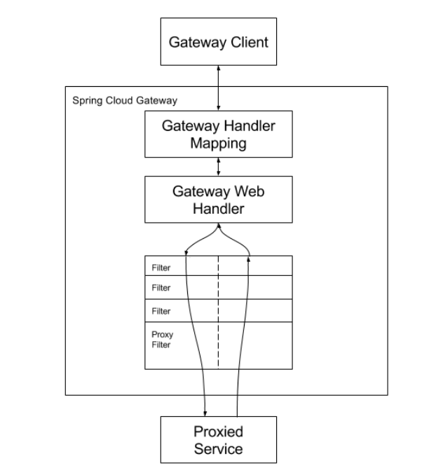
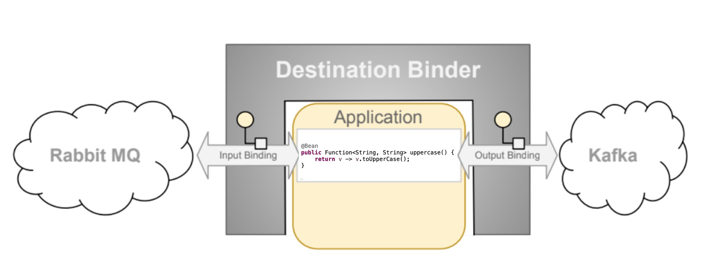

# Spring Cloud 入门
## 一、微服务

- 远程调用：
  - 微服务可以基于**RestTemplate** 进行远程调用
- 相关注解
  - `@LoadBalance`   负载均衡注解 
  - `@RefreshScope`  刷新在 Nacos 中的配置属性 
  - `@ConfigurationProperties(prefix = "")`  加载有某一个前缀的配置

  
## 二、Spring Cloud 微服务组件

### **1. Nacos** ：服务注册中心

- 功能
  1. 服务发现（注册中心）
  2. 服务配置（配置中心）

### **2. Ribbon** ：负载均衡器（**Netfix** 开发）

### **3. Feign** ：声明式 http 客户端

- 老版本的 **OpenFeign** 内部集成了**Ribbon** 实现了负载均衡；
- 由于后面 Netfix 不再维护 Ribbon ，Spring Colud 2021.X 开始，OpenFeign 丢弃 Ribbon ，使用 **Spring Colud LoadBalancer** 作为负载均衡器
- 底层技术：
  - HttpClient4
  - HttpClient5
  - OkHttp
- 负载均衡
  1. 导入 `LoadBalancer` 包
  2. `spring-cloud-starter-loadbalancer`的负载均衡策略
     1. 随机策略
     2. 轮询策略
  3. 由于`spring-cloud-starter-loadbalancer`的负载均衡策略太少，因此在开发中可能会使用`dubbo`来实现负载均衡的功能

### **4. GateWay** ：统一网关

- 功能：

  1. 身份认证，权限校验（鉴权） 
  2. 服务路由，负载均衡（路由）
  3. 请求限流（限流）
  4. 监控

- 构建于`Spring Boot` 、`Spring WebFlux` 、`Project Reactor`

  - 响应式编程
    - 响应式编程是一种编程范式，主要关注数据流和变化的传播，以事件驱动的方式进行响应和处理
    - 特点
      - **异步非阻塞**
      - **事件驱动**
      - **响应式流**
      - **可组合性**
      - **响应式扩展性**
  - `Reactor`
    - 全新的响应式编程库，实现了 `Reactive Streams` 规范，使用方便
    - `Reactor`是响应式编程的一部分，响应式编程是一种编程范式，关注于数据流和变化的传播，以事件驱动的方式进行响应和处理。它可以帮助开发者构建高性能、高吞吐量、响应式的应用程序，**特别适用于处理大量并发请求和高吞吐量的场景**。
    - `RxJava` 旧的响应式编程库，不好使用

- 需要 netty 运行时环境

  - netty
    - Netty 是一个高性能的、异步事件驱动的网络编程框架，由 JBoss（现为 Red Hat）开发并开源。它基于 Java NIO（New I/O）技术，提供了一套易于使用的 API，用于快速开发可伸缩的网络应用程序。
    - Netty 主要用于构建高性能的网络应用程序，特别适用于实现网络服务器、代理服务器、即时通信系统、游戏服务器等场景。它在企业级应用和互联网领域得到广泛应用，也被许多知名的开源项目和大型互联网公司所采用

- 概念

  - `route` （路由）

    - 配置方式

      1. **application.yml** 文件中配置

         ```yaml
         spring:
           cloud:
             gateway:
               routes:
                 - id: route1
                   uri: http://example.com
                   predicates:
                     - Path=/example/**
                 - id: route2
                   uri: http://another-service
                   predicates:
                     - Path=/api/**
         
         ```

      2. 通过将 **API** 方法配置为容器中的 `bean`

         ```java
         @Configuration
         public class GatewayConfig extends GatewayConfiguration {
         
             @Bean
             public RouteLocator customRouteLocator(RouteLocatorBuilder builder) {
                 return builder.routes()
                     .route("route1", r -> r.path("/example/**")
                                         .uri("http://example.com"))
                     .route("route2", r -> r.path("/api/**")
                                         .uri("http://another-service"))
                     .build();
             }
         }
         ```

  - `predicate` （断言）

    - 路由断言工厂

      - After 路由断言工厂：在某个时间之后的请求可通过，并路由到指定的 URI
    - Before 路由断言工厂：在某个时间之前的请求可通过，并路由到指定的 URI
      - Between 路由断言工厂：在某个时间段之间的请求通过，并路由到指定的 URI
    - Cookie 路由断言工厂：匹配到对应 cookie 请求可以通过，并路由到指定的 URI
      - Header 路由断言工厂：匹配到对应 Header 请求可以通过，并路由到指定的 URI
    - Host 路由断言工厂：匹配到对应 Host 请求可以通过，并路由到指定的 URI
      
      - 请求的 "Host" 是 HTTP 请求头中的一个字段，用于指示客户端要访问的服务器的主机名或域名，帮助服务器将请求路由到正确的网站服务上。
      - Method 路由断言工厂：匹配到对应 Method 请求可以通过，并路由到指定的 URI
    - Path 路由断言工厂：匹配到对应 Path 请求可以通过，并路由到指定的 URI
        - 可以使用变量接收请求路径中的值，并在 `GatewayFilterFactory` 工厂类中使用这些变量
    - Query 路由断言工厂：匹配到对应 Query 请求参数的请求可以通过，并路由到指定的 URI
      - Weight 路由断言工厂：配置请求路由到指定的 URI 的权重

        - 可用于做灰度发布
    - RemoteAddrRoutePredicateFactory：匹配到指定 RemoteAddr 的请求可以通过，并路由到指定的 URI
        - 由于某些网络配置（例如反向代理或负载均衡器）的存在，有时候 `RemoteAddr` 可能不准确。在这种情况下，需要根据特定的网络环境进行配置，以正确获取客户端的真实 IP 地址。
      - 如何准确获取remoteAddr：
          - Spring Cloud Gateway 默认会将客户端的原始 IP 地址保存在请求的 `X-Forwarded-For` 请求头中。这样做的目的是为了解决客户端经过反向代理或负载均衡器后 IP 地址被修改的问题。
    - XForwardedRemoteAddrRoutePredicateFactory：匹配到指定 XForwardedRemoteAddr 的请求可以通过，并路由到指定的 URI
      - 配置方式

        1. **application.yml** 文件中配置
    2. 通过将 **API** 方法配置为容器中的 `bean`
        3. 这两种配置方式生效的优先级

           1. 两种配置方式会以**或的关系同时生效**，例如：Header、Query  路由断言工厂
       2. **文件配置方式优先于 API 方式生效**，例如：After、Before、Between  路由断言工厂

  - 自定义路由断言工厂

    - Auth 认证：

      - 定义：

        - 客户端在请求中附加用户名和密码的 Base64 编码，服务器收到请求后验证用户名和密码，然后授予访问权限。缺点是凭证以明文方式传输，不够安全。

      - 自定义步骤：

        - 在 factory 目录下创建 `AuthRoutePredicateFactory`类，模仿`AfterRoutePredicateFactory`类实现即可

          - 根据请求头中是否存在该用户的信息进行判断

          - ```java
            public class AuthRoutePredicateFactory extends AbstractRoutePredicateFactory<AuthRoutePredicateFactory.Config> {
              
                public AuthRoutePredicateFactory() {
                    super(Config.class);
                }
              
                @Override
                public List<String> shortcutFieldOrder() {
                    return Arrays.asList("username","password");
                }
              
                @Override
                public Predicate<ServerWebExchange> apply(Config config) {
            //        return new Predicate<ServerWebExchange>() {
            //            @Override
            //            public boolean test(ServerWebExchange serverWebExchange) {
            //                return false;
            //            }
            //        };
                    //使用响应式编程写法
                   return serverWebExchange -> {
                       //获取请求中的 headers
                       HttpHeaders headers = serverWebExchange.getRequest().getHeaders();
                       List<String> value = headers.get(config.getUsername());
                       String[] passwords = value.get(0).split(",");
                       for (String password:passwords){
                           return password.equals(config.getPassword());
                       }
                       return false;
                   };
                }
              
              
                @Data
                public class Config {
                    private String username;
                    private String password;
                }
            }
            ```

    - Token  认证：

      - 定义：

        - 客户端使用令牌（Token）作为凭证进行认证，服务器校验令牌的有效性，并授权访问。令牌通常使用 JSON Web Token（JWT）等方式生成

      - 自定义步骤

        - ```java
          package com.lhk.gatewaydemo.factory;
            
          import lombok.Data;
          import org.springframework.cloud.gateway.handler.predicate.AbstractRoutePredicateFactory;
          import org.springframework.util.MultiValueMap;
          import org.springframework.web.server.ServerWebExchange;
            
          import java.util.Arrays;
          import java.util.List;
          import java.util.function.Predicate;
            
          public class TokenRoutePredicateFactory extends AbstractRoutePredicateFactory<TokenRoutePredicateFactory.Config> {
            
              public TokenRoutePredicateFactory(Class<Config> configClass) {
                  super(configClass);
              }
            
              @Override
              public Predicate<ServerWebExchange> apply(Config config) {
                  return serverWebExchange -> {
                      //获取请求中的请求参数 token
                      MultiValueMap<String, String> queryParams = serverWebExchange.getRequest().getQueryParams();
                      List<String> tokens = queryParams.get("token");
                      if (tokens.contains(config.getToken())) {
                          return true;
                      }
                      return false;
                  };
              }
            
              @Override
              public List<String> shortcutFieldOrder() {
                  return Arrays.asList("token");
              }
            
              @Data
              public static class Config {
                  private String token;
              }
          }
            
          ```

  - `filter`（过滤器）

    - AddRequestHeaderGatewayFilterFactory ：给请求添加 head

    - AddRequestHeadersIfNotPresentGatewayFilterFactory ：若请求不存在该 head 则添加 head

    - AddRequestParameterGatewayFilterFactory ：给请求添加请求参数

    - AddResponseHeaderGatewayFilterFactory ：给响应添加 head

    - SpringCloudCircuitBreakerFilterFactory：给请求设置断路器

      - 在分布式系统中，当一个服务发生故障或变得不可用时，其他依赖于该服务的服务也可能受到影响。如果这种情况持续发生，整个系统可能会因为级联故障而崩溃。Circuit Breaker 模式的目标是防止这种情况的发生，提供一种优雅的故障处理机制。
      - 当服务发生故障或超时时，Circuit Breaker 会打开断路器，拒绝对该服务的进一步请求，同时快速返回错误响应，而不是等待超时。这样可以避免请求堆积和资源浪费。

    - PrefixPathGatewayFilterFactory ：给请求路径添加前缀

    - StripPrefixGatewayFilterFactory ：删除请求路径中的某几级前缀

    - RewritePathGatewayFilterFactory ：修改请求路径

    - RequestRateLimiterGatewayFilterFactory ：对请求进行**限流**

      - 在 Spring Cloud Gateway 中，`RequestRateLimiter` 通过一个过滤器来实现，可以根据配置的速率限制规则对请求进行限制。它会根据设定的速率，以**令牌桶算法**的方式来控制请求的通过。

      - 令牌桶算法与漏斗算法的区别

        - 令牌桶算法（Token Bucket Algorithm）和漏斗算法（Leaky Bucket Algorithm）都是流量控制算法，用于平滑流量和限制请求速率。尽管它们的目标相似，但它们在实现和一些方面的表现上有一些区别。

          **令牌桶算法：**

          1. 令牌桶算法是基于令牌的分发来控制请求的流量。令牌被放入令牌桶中，每个请求需要消耗一个令牌才能被处理。
          2. 桶中可以积累一定数量的令牌，每隔一段固定时间会放入一定数量的令牌，从而使请求能够以固定速率被处理。
          3. 如果桶中没有足够的令牌，请求将被暂时阻塞或拒绝。
          4. 令牌桶算法可以应对瞬时的突发流量，桶中有足够的令牌可以处理突发的请求。

          **漏斗算法：**

          1. 漏斗算法通过一个漏斗来控制请求的流量。漏斗的容量代表了系统能够处理的请求的速率。
          2. 请求被视为水滴，漏斗以一定的速率处理这些水滴。如果漏斗容量满了，则多余的水滴会被丢弃。
          3. 漏斗的流出速率通常是恒定的，不会因为突发流量而改变。
          4. 漏斗算法更加平滑地限制流量，但在突发流量下可能会有一些丢失。

          **区别和应用场景：**

          1. 令牌桶算法允许瞬时突发流量，适合于需要处理突发请求的场景，如应对临时的峰值请求。
          2. 漏斗算法更平滑地限制流量，适用于需要稳定流量的场景，如限制用户请求速率、防止爬虫过多访问等。

          根据实际需求，你可以选择令牌桶算法或漏斗算法来进行流量控制，以保护系统资源免受过多的请求影响。

    - 默认网关过滤工厂：`spring.cloud.gateway.default-filters`，对所有的路由都起作用

      - 配置

        ```yaml
        spring:
          cloud:
            gateway:
              default-filters:
              - AddResponseHeader=X-Response-Default-Red, Default-Blue
              - PrefixPath=/httpbin
            routers:
              - xxx
                xxxx
                xxxxx
              - xxx
                xxxx
                xxxxx 
        ```

    - filter 的优先级：

      - 对于相同的 filter 工厂，不同配置方式配置的 filter 优先级：
        - 局部的filter 优先级高于 默认filter
        - api 式配置的 filter 优先级高于 yaml 配置文件中配置的 filter

    - 自定义 GatewayFilterFactory：

      - 创建 `XxxxxGatewayFilterFactory` 类继承 `AbstractGatewayFilterFactory`或`AbstractNameValueGatewayFilterFactory`
        - `AbstractNameValueGatewayFilterFactory` 是 `AbstractGatewayFilterFactory` 的子类

    - pre filter 和 post filter 的执行顺序

      - pre filter 按顺序执行，post filter 逆序执行

        

    - 全局网关过滤工厂：`Global Filters`

      - 无需在 application.yam 文件中进行配置，在满足生效条件是会自动生效，且对所有路由都生效
      - `ReactiveLoadBalancerClientFilter`：负载均衡网关过滤工厂，配置后可实现负载均衡效果
      - 自定义全局网关过滤工厂：
        - 可以模仿`ReactiveLoadBalancerClientFilter`进行实现
        - 实现 `GlobalFilter`, `Ordered`接口

- 同源策略与跨域问题

  - **同源策略**（Same-Origin Policy）是一种浏览器安全机制，限制了不同源之间的交互，防止恶意网站通过 JavaScript 访问其他网站的敏感信息。同源策略要求：
    - 协议必须相同（通常是 HTTP 或 HTTPS）。
    - 域名必须相同。
    - 端口号必须相同。
  - **跨域请求**（Cross-Origin Request）
    - 指的是在 Web 应用中，当一个网页的代码（通常是 JavaScript）通过浏览器发起 HTTP 请求访问其他域名下的资源（如接口、文件等）时，这个请求的目标域与发起请求的域不同（未满足同源策略），即跨域请求。
    - 浏览器会阻止跨域请求
  - 几种常见的解决跨域请求的方法：
    1. **CORS（跨域资源共享）：** 服务器可以在响应头中添加 CORS 相关的字段，允许特定域或所有域的请求访问资源。
    2. **JSONP（JSON with Padding）：** 通过创建一个 `<script>` 标签，将请求数据包装在一个函数调用中，以实现跨域数据获取。
    3. **代理服务器：** 在同一个域中设置一个代理服务器，该服务器在后台发起跨域请求并将响应返回给前端。
    4. **WebSocket：** 使用 WebSocket 可以在不同域之间建立持久连接，实现实时通信。
    5. **跨域资源访问设置（XDomainRequest、Access-Control-Allow-Origin 等）：** 在一些特定情况下，可以通过一些非标准的手段实现跨域访问。
  - spring gateway 中的解决方式
    - https://docs.spring.io/spring-cloud-gateway/docs/current/reference/html/#cors-configuration

- 自定义 gateway 的**异常处理器**

  - 需要实现 `org.springframework.boot.web.reactive.error.ErrorWebExceptionHandler` 接口，并注册它为 Spring 的 bean。
  - 或者继承 `org.springframework.boot.autoconfigure.web.reactive.error.DefaultErrorWebExceptionHandler` 对其进行改造
  

### 5. Sentinel 流量防卫兵（哨兵）

- 什么是 **Sentinel**
  **Sentinel** 是阿里巴巴开源的一款流量控制和熔断降级框架，旨在保护分布式系统中的微服务，提供了实时的流量控制、熔断降级、系统负载保护等功能。Sentinel 可以帮助开发者在面对复杂的分布式系统环境时，实现服务的稳定性和可靠性。

  主要功能包括：

  1. **流量控制：** Sentinel 可以根据不同的规则对进入系统的流量进行控制和限制，防止系统被过多的请求影响而导致服务崩溃。
  2. **熔断降级：** 当系统的某个微服务出现故障或异常时，Sentinel 可以自动触发熔断策略，避免故障扩散，保护整个系统的稳定性。
  3. **系统负载保护：** Sentinel 可以根据系统的负载情况，动态调整流量控制策略，保证系统的资源不会被过度消耗。
  4. **实时监控和统计：** Sentinel 提供了实时的监控和统计功能，可以查看系统的流量、性能等指标，帮助开发者及时发现问题并采取措施。
  5. **支持多种编程语言：** Sentinel 不仅支持 Java，还支持其他编程语言，如 Go、Python 等。

  **Sentinel** 提供了丰富的配置选项和**管理界面（控制台）**，可以方便地进行规则配置和监控查看。它可以与 Spring Cloud、Dubbo 等框架无缝集成，适用于各种微服务架构中的流量控制和熔断降级需求。

  总之，Sentinel 是一个功能强大的流量控制和熔断降级框架，可以帮助开发者在分布式系统中提高服务的稳定性和可靠性。

- 官网：

  - https://sentinelguard.io/zh-cn/docs/dashboard.html
  - github：https://github.com/alibaba/Sentinel/wiki/%E4%BB%8B%E7%BB%8D

- 概念

  - **服务雪崩**

    - 服务雪崩是指在一个分布式系统中，由于某个服务的故障或不可用，导致该服务所依赖的其他服务也受到影响，最终导致整个系统的故障。这种现象类似于雪崩，因为一开始的小问题最终会迅速扩大，影响到整个系统的稳定性。
    - 服务雪崩通常发生在分布式系统中的多个微服务之间存在依赖关系的情况下。当一个微服务由于故障、高延迟或其他原因导致不可用时，其他依赖于它的微服务也会开始等待、阻塞或失败。这些失败会进一步传播给其他微服务，导致更多的失败，最终可能导致整个系统不可用。
    - 为了防止服务雪崩，需要采取一些策略和措施：
      1. **熔断器：** 使用熔断器模式，当一个微服务出现故障时，可以快速切断对它的请求，防止故障扩散。熔断器会提供降级逻辑，返回默认值或执行备选操作。
      2. **限流策略：** 对请求进行限流，防止大量请求同时涌入一个不可用的服务，导致资源耗尽。
      3. **服务隔离：** 使用线程池等方式对不同的微服务请求进行隔离，避免故障传播。
      4. **异步处理：** 将一些依赖的操作异步化，避免同步请求造成阻塞。
      5. **优雅降级：** 当某个服务不可用时，通过返回预定义的默认值或执行备选操作来保证系统的基本功能正常。
    - 总之，服务雪崩是分布式系统中的一个重要问题，需要通过合适的设计和策略来预防和处理，以确保系统的稳定性和可靠性。

  - **服务熔断（Circuit Breaker）：**

    - 服务熔断（Circuit Breaker）是一种分布式系统中的设计模式，用于处理依赖服务的故障或异常情况，以保障整个系统的稳定性和可用性。服务熔断的主要思想类似于电路中的保险丝，当系统的某个服务出现故障或不可用时，可以迅速切断对该服务的请求，从而防止故障扩散，减轻对整个系统的影响。

    - 服务熔断的工作原理如下：

      1. **监控：** 熔断器会监控对依赖服务的请求。它会跟踪请求的成功率、失败率以及响应时间等指标。
      2. **状态切换：** 如果依赖服务的失败率或响应时间超过一定阈值，熔断器会切换为 "打开" 状态。在这个状态下，所有对该服务的请求都会迅速失败，不再等待响应。这样可以避免请求积压，进一步影响系统的稳定性。
      3. **半开状态：** 一段时间后，熔断器会尝试切换到 "半开" 状态。在半开状态下，它会允许部分请求通过，以便检测依赖服务是否已经恢复正常。如果这些请求成功，熔断器会切换回 "闭合" 状态，允许所有请求。如果仍然失败，熔断器会继续保持 "打开" 状态。

    - 服务熔断的优点是：

      - 防止故障扩散：当一个服务出现问题时，熔断器可以迅速切断对该服务的请求，避免请求积压和故障扩散。
      - 提高系统稳定性：通过降低对不稳定服务的依赖，可以提高系统的整体稳定性。
      - 快速失败：在故障状态下，熔断器会快速失败，避免请求长时间阻塞。
      - 自动恢复：熔断器会定期尝试恢复，以确保服务的可用性。

      服务熔断通常与服务降级、限流等策略结合使用，以提供更好的系统可用性和用户体验。常见的熔断器实现包括 Netflix Hystrix 和 Alibaba Sentinel 等。

  - **服务降级（Fallback）**

    - 服务降级是一种分布式系统设计的策略，用于在系统面临异常情况、高负载或故障时，保证核心功能的可用性和稳定性。服务降级的目标是在不影响整体系统的情况下，优先保障重要的业务功能的正常运行，即使部分功能暂时不可用。
    - 具体来说，服务降级的做法是在面临异常情况时，临时关闭一些不是关键或低优先级的功能，以减轻系统的负担，避免因为一个部分功能的故障导致整个系统的不可用。服务降级可以采取以下几种策略：
      1. **返回默认值：** 当某个功能不可用时，可以返回预定义的默认值，保证用户不会看到错误的结果。
      2. **执行备选逻辑：** 当某个功能不可用时，可以执行备选的逻辑，保证用户仍然可以获得某种程度的服务。
      3. **延迟加载：** 当系统负载过高时，可以延迟一些非关键功能的加载，从而保证核心功能的响应速度。
      4. **限流：** 限制并发请求的数量，确保系统不会因为过多请求而崩溃。
      5. **关闭特定功能：** 在高负载或故障情况下，可以临时关闭一些非关键的功能，减少系统压力
    - 服务降级需要根据业务情况和系统需求来制定，以**保障用户体验**和**系统的可用性**。同时，降级策略也应该具有自动恢复的机制，当系统恢复正常时，可以自动解除降级状态，恢复原有功能。

  - **服务熔断与服务降级的区别**：

    - 服务熔断（Circuit Breaker）：
      - **作用：** 服务熔断是一种防止故障扩散的策略。当一个服务出现故障或不可用时，服务熔断器会切断对该服务的请求，防止请求不断积压，从而避免对整个系统的影响。
      - **处理方式：** 当服务熔断器打开时，所有对该服务的请求会快速失败，而不是等待超时。熔断器会监控请求的成功率和失败率，当失败率达到一定阈值时，熔断器会打开。
      - **状态切换：** 一旦熔断器打开，它会进入一个开启状态，一段时间后会尝试半开状态，允许部分请求通过以检测服务是否恢复正常。如果检测到服务仍然不可用，熔断器会继续保持打开状态。

    - 服务降级（Fallback）：
      - **作用：** 服务降级是在面对服务不可用时提供备选操作的策略，目的是保障系统的基本功能仍然可以正常使用，即使一些非关键的功能暂时不可用。
      - **处理方式：** 当某个服务不可用时，可以提供一些默认的返回值、缓存的数据或者执行备选逻辑，确保用户能够获得某种程度的响应。
      - **使用场景：** 服务降级通常用于非核心业务功能，比如一些展示性的功能，而核心功能可能会采取服务熔断的策略。
    - 综上所述，服务熔断主要关注防止故障扩散，确保整个系统的稳定性；而服务降级主要关注在故障情况下保障用户的基本体验，确保非核心功能的正常展示。这两种策略在不同的场景下可以结合使用，以提供更好的系统可用性和用户体验。

  - 什么是 **QPS**：

    - **QPS** 是指**每秒查询率**（Queries Per Second），是衡量系统处理能力的一个重要指标，表示系统在**每秒内能够处理的查询或请求的数量**。
    
  - 什么是**流控**：

    - 流控（Flow Control）是一种在分布式系统中用于控制请求流量的机制。它旨在确保系统能够在合理的范围内处理请求，以保障系统的稳定性、可用性和性能。流控通常被用于预防系统超负荷或过度请求，从而避免系统崩溃、性能下降或资源耗尽。
    - 流控的主要目标是：
      1. **限制请求流量：** 流控机制能够限制每秒钟的请求数量（QPS）或并发请求数，以防止系统因过多请求而崩溃。
      2. **保障系统稳定性：** 通过限制请求流量，流控可以避免系统因过载而崩溃或性能下降，保障系统的稳定运行。
      3. **资源保护：** 流控可以保护系统的关键资源，如数据库连接、内存、CPU 资源等，防止资源过度消耗。
      4. **优化性能：** 通过合理控制流量，可以优化系统的性能，防止因过多请求导致响应时间过长。
    - 流控的实现可以采用多种策略，例如：
      - **QPS 限制：** 设置每秒钟允许的请求数量，超过这个数量的请求将被拒绝。
      - **并发限制：** 设置同时允许的并发请求数，超过这个数量的请求将被拒绝。
      - **令牌桶算法：** 使用令牌桶算法，每个请求消耗一个令牌，当令牌桶为空时，新的请求将被拒绝。
      - **漏桶算法：** 使用漏桶算法，每个请求都以恒定速率流出，如果桶满了，新的请求将被拒绝。
    - 流控通常用于防止因突发流量或恶意攻击导致的系统问题。流控策略的选择应该根据系统的实际情况、资源限制和性能需求来决定。

- Sentinel 实现服务降级：

  - Sentinel 式服务降级

    - 粒度：

      - 方法 (method) 级服务降级
        - 指定本类中的某个方法作为降级方法
      - 类 (class) 级服务降级
        - 指定某个类中的某个方法作为降级方法
    - 可用于 `RestTemplate` 和 `OpenFeign` 服务的降级
    - 注解 `@SentinelResource`：属性 **fallback** 用于指定降级方法

    - 参考：https://github.com/alibaba/spring-cloud-alibaba/blob/2.2.x/spring-cloud-alibaba-examples/sentinel-example/sentinel-core-example/readme-zh.md

  - Feign 式服务降级

    - 只有类 (class) 级服务降级
    - 参考：https://github.com/alibaba/spring-cloud-alibaba/blob/2.2.x/spring-cloud-alibaba-examples/sentinel-example/sentinel-feign-example/readme-zh.md

- 熔断规则配置：

  - 熔断策略：

    1. 慢调用比例
    2. 异常比例
    3. 异常数

  - 控制台（Sentinel Dashboard）配置：动态配置

    - 在 application.yml 中配置 `eager` 属性：开启饥饿加载

      ```yml
      spring:
        cloud:
          sentinel:
            transport:
              port: 8719 #与 dashboard 通信的一个进程
              dashboard: localhost:8080 #开启的 dashboard 的 url
            eager: true #开启饥饿加载
      ```

    - 在 Dashboard 界面中可以添加资源的熔断规则

    - 配合`@SentinelResource`注解可以指定资源名称和降级方法，并在熔断后自动调用降级方法，若未指定降级方法则会返回 500 白页

  - API 配置：

    - API 配置好熔断规则后可以保证项目在启动后存在了这些熔断规则信息
    - 调用 `DegradeRule`，`DegradeRuleManager` 中的 API 方法进行配置 

- 流控规则（限流）配置：

  - 流控方案：

    1. qps 阈值

    2. 并发线程数阈值

       - 并发线程数流控方案：通常是对消费者端的配置，是为了避免由于慢调用而将消费者端线程耗尽的情况发生，业内通常使用线程隔离来实现

       - 线程隔离：线程隔离（Thread Isolation）是分布式系统中的一种设计模式，旨在保障不同线程之间的资源隔离和互不干扰。在多线程环境下，不同线程可能同时访问共享的资源，如数据库连接、内存、缓存等，如果不进行适当的隔离，可能会导致资源争用、数据错乱等问题。以下是两种实现线程隔离的方式：

         1. 线程池隔离
            - 系统为不同的提供者资源设置不同的线程池来隔离业务自身之间的资源争抢。该方案隔离性较好，但需要创建的线程池及线程数量太多，系统消耗较大。当请求线程到达后，会从线程池中获取到一个新的执行线程去完成提供者的调用。由请求线程到执行线程的上下文切换时间开销较大。特别是对**低延时的调用**有比较大的影响。
            - **低延时：** 适用于需要实时性能的场景，如在线游戏、金融交易、视频会议等。在这些场景中，系统需要尽可能地迅速响应用户的请求，以保障实时性和用户体验。
            - **高延时：** 一些应用场景中，稍微高一些的延时并不会对用户产生很大影响，比如批处理任务、定时任务等。在这些场景中，性能可能相对较低，但不会对用户感知造成太大影响。

         2. 信号量隔离
            - 系统为不同的提供者资源设置不同的计数器。每增加一个该资源的调用请求，计数器就变化一次。当达到该计数器闽值时，再来的请求将被限流。该方式的执行线程与请求线程是同一个线程，不存在线程上下文切换的问题，更不存在很多的线程池创建与线程创建问题。也正因为请求线程与执行线程没有分离，所以，其对于提供者的调用无法实现异步，执行效率降低，且对于依赖资源的执行超时控制不方便。
            - 原理
              1. **信号量：** 信号量是一个整数，它用来表示可用的资源数量。在信号量隔离中，每个线程或进程在访问共享资源之前，都需要尝试获取信号量。如果信号量的值大于 0，则表示有可用资源，线程可以获取资源并执行操作。如果信号量的值为 0，则表示没有可用资源，线程需要等待。
              2. **获取信号量：** 当一个线程或进程尝试获取信号量时，系统会检查信号量的值。如果信号量的值大于 0，线程可以获取信号量，表示可以访问资源，并将信号量的值减一。这样其他线程尝试获取信号量时会看到信号量值减少，从而限制了并发访问。
              3. **释放信号量：** 当一个线程完成对资源的访问后，需要释放信号量，将信号量的值加一，表示资源不再被占用，其他线程可以获取到信号量并继续访问资源。

       - sentinel 线程隔离方案：

         - Sentinel 并发线程数控制也属于隔离方案，但不同于以上两种隔离方式，是对以上两种方案的综合与改进，或者说更像是线程池隔离。
         - 其也将请求线程与执行线程进行了分离，但 Sentinel **不负责创建和管理线程池**，而仅仅是简单统计当前资源请求占用的线程数目。如果对该资源的请求占用的线程数量超出了阈值，则可以立即拒绝再新进入的请求。

  - 流控模式：

    - **直接拒绝（Direct Block）：** 这是最简单的流控模式，当请求达到设定的阈值后，新的请求将会直接被拒绝，不会继续处理。

    - **关联流控（Associated Flow Control）：** 这种模式通过关联一个或多个资源进行流控，当关联资源的阈值达到时，会触发当前资源的流控操作。

    - **链路流控（Cluster Flow Control）：** 链路流控是在集群中进行流控，通过整体的流量情况来限制资源的访问，可以对不同资源设置不同的流量控制策略

      - 当一个资源有多种访问路径时,可以对某一路径的访问进行限流,而其它访问路径不限流

        - 需要开启以下配置

          ```yaml
          spring:
            cloud:
              sentinel:
                web-context-unify: false
          ```

  - 流控效果：

    - **直接拒绝（Reject）：** 当触发流控条件时，新的请求会被直接拒绝，不会进入被保护的资源。
    - **Warm Up（预热）：** 在系统启动时，逐渐增加通过流控的请求量，防止系统冷启动时大量请求集中导致的压力。
      - Sentinel 的 WarmUp 流控算法是在 Guava 的 SmoothWarmingUP 算法基础上改进的 (SmoothWarmingUP 继承自 SmoothRateLimiter 算法)。但与 Sentinel 的 WarmUP 算法实现思路是不同的。
        - **SmoothWarmingUP** 算法是通过**不断缩短请求间的间隔**来达到逐步提高访问量的目的的。
        - Sentinel 的 **WarmUP** 算法是通过**逐步提升QPS**来到达提高访问量的目的的
    - **排队等待（Queue）：** 将超过流控阈值的请求放入队列中排队，依次处理，避免直接拒绝请求。
      - 适合间隔性突发流量的场景（达到削峰填谷的效果）

  - 使用注解 `@SentinelResource`：属性 **blockHandler** 用于指定限流后执行的方法

    - 并且该限流方法必须携带`BlockException`参数，否则会报 500 

  - 控制台（Sentinel Dashboard）配置：动态配置

  - API 配置

    - 调用 `FlowRule`，`FlowRuleManager `中的 API 方法进行配置

  - 资源实体配置流控规则：可以指定使用其他资源的流控规则

    ```java
    Entry entry = SphU.entry("xxx");
    ```

  - 设置流控针对来源：

    - 来源关键字：
      - default：所有针对所有来源
      - other：除去已设置针对来源的其他的针对来源
    - 实现`RequestOriginParser`接口，sentinel 会以该实现方法的返回值作为请求来源进行流控，需要在 sentinel 控制台设置资源的针对来源才会有效果

- 热点规则配置：

  - 更细粒度的流控规则
  - Sentinel 的热点规则（Hotspot Rule）支持基于参数的限流，可以针对某个参数的值进行流量控制。这在处理类似于热门商品、热门话题等情况时非常有用。
  - 控制台配置（动态）
  - API 配置：`ParamFlowRuleManager`、`ParamFlowRule`

- 系统规则（系统自适应限流）：

  - 参考文档：https://github.com/alibaba/Sentinel/wiki/%E7%B3%BB%E7%BB%9F%E8%87%AA%E9%80%82%E5%BA%94%E9%99%90%E6%B5%81
    1. **Load 自适应**（仅对 Linux/Unix-like 机器生效）：系统的 load1 作为启发指标，进行自适应系统保护。当系统 load1 超过设定的启发值，且系统当前的并发线程数超过估算的系统容量时才会触发系统保护（BBR 阶段）。系统容量由系统的 `maxQps * minRt` 估算得出。设定参考值一般是 `CPU cores * 2.5`。
    2. **CPU usage**（1.5.0+ 版本）：当系统 CPU 使用率超过阈值即触发系统保护（取值范围 0.0-1.0），比较灵敏。
    3. **平均 RT**：当单台机器上所有入口流量的平均 RT 达到阈值即触发系统保护，单位是毫秒。
    4. **并发线程数**：当单台机器上所有入口流量的并发线程数达到阈值即触发系统保护。
    5. **入口 QPS**：当单台机器上所有入口流量的 QPS 达到阈值即触发系统保护。
  - 这些系统规则可以根据您的业务场景和需求进行设置，从而保护系统的稳定性和可用性。您可以根据实际情况选择合适的规则，并在 Sentinel 中进行配置。

- 网关流控：

  - 参考文档：https://github.com/alibaba/Sentinel/wiki/%E7%BD%91%E5%85%B3%E9%99%90%E6%B5%81

  - Sentinel 支持对 Spring Cloud Gateway、Zuul 等主流的 API Gateway 进行限流。

  - 限流维度：

    1. route 维度：即在 Spring 配置文件中配置的路由条目，资源名为对应的 routeId
       - 更细粒度的网关路由温度的流控
         1. Client IP
         2. Remote Host
         3. Header
         4. URL 参数
         5. Cookie
    2. API 维度（对外访问的URL）：用户可以利用 Sentinel 提供的 API 来自定义一些 API 分组
       -  API 分组：对 URL 进行分组，可以实现对整个分组内多个资源的限流

  - 配置方式

    - 控制台配置

    - API 配置：

      1. 使用`GatewayRuleManager`，`GatewayFlowRule` 中的 API 方法进行配置

      2. 配置 API 维度需要先配置 API 分组：

         ```java
         //配置 API 分组
         private void initCustomizedApis() {
                 ApiDefinition api1 = new ApiDefinition("some_customized_api")
                         .setPredicateItems(new HashSet<ApiPredicateItem>() {{
                             add(new ApiPathPredicateItem().setPattern("/product/baz"));
                             add(new ApiPathPredicateItem().setPattern("/product/foo/**")
                                     .setMatchStrategy(SentinelGatewayConstants.URL_MATCH_STRATEGY_PREFIX));
                         }});
                 ApiDefinition api2 = new ApiDefinition("another_customized_api")
                         .setPredicateItems(new HashSet<ApiPredicateItem>() {{
                             add(new ApiPathPredicateItem().setPattern("/ahas"));
                         }});
                 Set<ApiDefinition> definitions = new HashSet<>(){{
                     add(api1);
                     add(api2);
                 }};
                 GatewayApiDefinitionManager.loadApiDefinitions(definitions);
             }
         ```

  - 修改阻断异常结果：

    1. 调用`GatewayCallbackManager` 的 `setBlockHandler` 方法设置阻断异常

       ```java
           public static void setBlockHandler(BlockRequestHandler blockHandler) {
               AssertUtil.notNull(blockHandler, "blockHandler cannot be null");
               GatewayCallbackManager.blockHandler = blockHandler;
           }
       ```

       - `BlockRequestHandler` 有两个实现类
         - `DefaultBlockRequestHandler`
         - `RedirectBlockRequestHandler`
         - 还自定义`BlockRequestHandler`的实现类进行扩展
       - 调用`setBlockHandler` 方法，将`BlockRequestHandler` 的实现类传入参数即可修改阻断异常

    2. 在配置文件中修改

       1. 配置阻断异常为重定向模式

          ```yaml
          spring:
            cloud:
              sentinel:
                scg:
                  fallback:
                    mode: redirect
                    redirect: www.baidu.com
          ```

       2. 配置为普通响应模式

          ```yaml
          spring:
            cloud:
              sentinel:
                scg:
                  fallback:
                    mode: response
                    content-type: "application/json"
                    response-body: '{"msg":"xxx","status":"xxx"}'
                    response-status: 123
          ```

    3. 上述两种修改方式中，第一种修改方式的优先级高于第二种（配置文件修改方式）

- Sentinel 异常处理器

  - 接口：`BlockExceptionHandler`

    - 实现类：`DefaultBlockExceptionHandler`

  - 抽象类 `BlockException`:

    - 5 个子实现类：
      1. `AuthorityException`
      2. `DegradeException`
      3. `FlowException`
      4. `ParamFlowException`
      5. `SystemBlockException`

  - 自定义 Sentinel 异常处理器：

    1. 创建自定义异常处理器，实现`BlockExceptionHandler`接口

       - 可以模仿`DefaultBlockExceptionHandler`进行实现

       - 跳转页面：

         ```java
         public void handle(HttpServletRequest httpServletRequest, HttpServletResponse httpServletResponse, BlockException e) throws Exception {
                 httpServletRequest.getRequestDispatcher("xxxx.html").forward(httpServletRequest,httpServletResponse);
             }
         ```

       - 重定向到某个网站

         ```java
         public void handle(HttpServletRequest httpServletRequest, HttpServletResponse httpServletResponse, BlockException e) throws Exception {
                 httpServletResponse.sendRedirect("xxx.com");
             }
         ```

    2. 使用`@Component`注解将该类交给 IOC 容器管理

- 规则持久化：

  - 参考文档：https://github.com/alibaba/Sentinel/wiki/%E5%9C%A8%E7%94%9F%E4%BA%A7%E7%8E%AF%E5%A2%83%E4%B8%AD%E4%BD%BF%E7%94%A8-Sentinel

  - 规则的推送模式

    1. 原始模式：不保证一致性；规则保存在内存中，重启即消失。严重不建议用于生产环境
    2. pull 模式：可实现规则持久化，不保证一致性；实时性不保证，拉取过于频繁也可能会有性能问题。
    3. push 模式：规则持久化；一致性；快速。需要引入第三方依赖

  - pull 模式持久化：

    - SPI 机制

      - SPI（Service Provider Interface）是 Java 平台中一种**服务发现机制**，允许在应用程序中定义接口，并在需要的时候由第三方实现这些接口的具体实现。SPI 的设计目的是让应用程序更加可插拔，允许开发者在不修改原始代码的情况下，通过添加外部模块来扩展功能。

        在 Java 中，SPI 机制通常包括以下几个关键组件：

        1. **服务接口（Service Interface）：** 定义一个或多个接口，表示一组功能或服务，这些接口可以由不同的实现提供者来实现。
        2. **服务提供者（Service Provider）：** 实现了服务接口的具体类，提供了对服务的具体实现。
        3. **服务提供者注册文件：** 在 META-INF/services 目录下的配置文件，命名为服务接口的全限定名，文件内容包含了具体的服务提供者实现类名称。

  - push 模式持久化

    1. 引入依赖

       ```xml
               <dependency>
                   <groupId>com.alibaba.csp</groupId>
                   <artifactId>sentinel-datasource-nacos</artifactId>
                   <version>1.8.6</version>
               </dependency
       ```

    2. 持久化规则配置

       ```properties
       spring:
          cloud:
       	  datasource:
               flows:
                 nacos:
                   server-addr: xxx
                   username: nacos
                   password: nacos
                   rule-type: flow
                   data-id: ${spring.application.name}-flow-rules
                   data-type: json
               degrades:
                 nacos:
                   server-addr: xxx
                   username: nacos
                   password: nacos
                   rule-type: degrade
                   data-id: ${spring.application.name}-degrade-rules
                   data-type: json
       ```

    3. 在 nacos 中添加这些规则的配置信息，使用 nacos 来管理这些规则的配置信息

       - 默认支持 nacos 修改规则配置信息后，sentinel 控制台会同步更改；但不支持 sentinel 控制台修改后，nacos 中的配置信息的同步更改
       - 若需要实现双向同步，需要对 sentinel 控制台进行改造
         - 从 Sentinel 1.4.0 开始，Sentinel 控制台提供 `DynamicRulePublisher` 和 `DynamicRuleProvider` 接口用于实现应用维度的规则推送和拉取，并提供了相关的示例。Sentinel 提供应用维度规则推送的示例页面（`/v2/flow`），用户改造控制台对接配置中心后可直接通过 v2 页面推送规则至配置中心。改造详情可参考 [应用维度规则推送示例](https://github.com/alibaba/Sentinel/wiki/Sentinel-控制台（集群流控管理）#规则配置)。

### 6. 分布式事务与解决方案 seata

- 参考文档：[Seata 是什么](https://seata.io/zh-cn/docs/overview/what-is-seata.html)
- Seata 事务模式，分布式事务解决方案：
  1. Seata XA 模式：
     - 2pc：两阶段提交
  2. Seata AT 模式
     - 2pc：两阶段提交
  3. Seata TCC 模式
     - 2pc：两阶段提交
     - 支持把 **自定义** 的分支事务纳入到全局事务的管理中。
  4. Seata Saga 模式

### 7. 调用链跟踪 SkyWalking

- 调用链跟踪系统（也称为分布式追踪系统）是一种用于监测和分析分布式应用程序性能的工具。它能够捕获和记录应用程序中的请求和操作，以可视化的方式展示整个请求流程，包括各个服务之间的调用关系和性能数据。这有助于开发人员和运维人员追踪问题、优化性能以及了解系统的行为。
  - APM （application performance management）应用性能管理平台
  - OAP （observability analysis platform） 可观测性平台

- 国内的分布式跟踪系统: 
  1. Hydra(京东)
  2. CAT(大众点评)
  3. Watchman(新浪)
  4. Micoscope(唯品会)
  5. Eagleeye(淘宝，未开源)。
- 国际常用
  - Zipkin（Twitter）
  - SkyWalking
- 系统架构（四部分）
  - Agent（探针）
  - OAP（observability analysis platform可观测性分析平台）
  - storage（数据中心）
    - 支持 H2，MySQL，**ElasticSearch**（推荐使用）
  - UI（可视化 WEB 平台）
- 相关术语
  - trace（轨迹）
    - 一整个请求响应过程
  - segment
    - 一个 trace 的一个片段，可以有多个 span 组成
  - span

### 8. spring cloud stream

- Spring Cloud Stream 是 Spring Cloud 生态系统的一部分，它提供了一种构建消息驱动微服务的框架和工具。它基于Spring Boot和Spring Integration构建，使开发者可以轻松地创建和部署基于消息的微服务应用程序。

- Spring Cloud Stream 的主要目标是简化消息驱动微服务的开发，通过定义应用程序的消息通信方式，开发者可以将更多的精力放在业务逻辑上，而不必过多关注消息传递细节。以下是 Spring Cloud Stream 的关键特点和概念：
  1. **Binder 抽象：** Spring Cloud Stream 提供了 Binder 抽象层，用于将消息中间件（如Kafka、RabbitMQ、Apache Kafka等）与应用程序解耦。这使得开发者可以在不改变应用程序代码的情况下切换消息中间件。
  2. **消息通道（Message Channels）：** Spring Cloud Stream 引入了消息通道的概念，它将应用程序与消息中间件连接起来。开发者可以通过注解将消息通道与消息处理逻辑关联起来。
  3. **绑定（Binding）：** 绑定是将消息通道与消息中间件之间的连接配置的过程。Spring Cloud Stream 提供了自动配置机制，根据应用程序的需求自动创建绑定。
  4. **消息分组（Consumer Groups）：** Spring Cloud Stream 支持将消费者分组，以实现多个实例之间的负载均衡和高可用性。这对于构建可伸缩的微服务应用程序非常有用。
  5. **消息转换（Message Conversion）：** Spring Cloud Stream 可以自动将消息序列化和反序列化为应用程序中的对象，并支持自定义消息转换器。
  6. **Binder 的选择：** 开发者可以选择不同的 Binder 来适应不同的消息中间件，以满足应用程序的需求。

- Spring Cloud Stream是构建消息驱动微服务的有力工具，它有助于简化消息传递和处理的复杂性，使开发者能够更容易地构建可扩展、松耦合的微服务应用程序。

  

## 三、[MQ](../category/mq)


