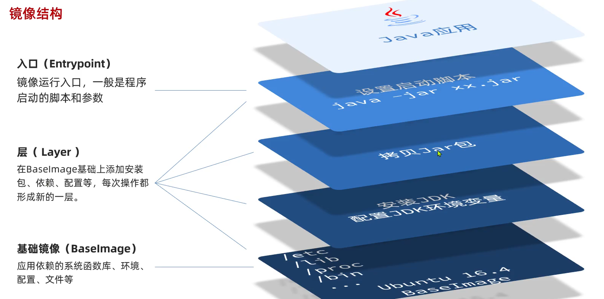

# docker
**docker 安装**
- 参考： https://www.runoob.com/docker/centos-docker-install.html
- 注意配置镜像源

  - 配置文件：`/etc/docker/daemon.json`
    ```json
    {
    "registry-mirrors": [
        "https://registry.docker-cn.com",
        "https://docker.mirrors.ustc.edu.cn",
        "https://hub-mirror.c.163.com",
        "https://mirror.baidubce.com",
        "https://ccr.ccs.tencentyun.com"
    ]
    }
    ```

## 一、docker 常用命令

### docker镜像命令

`docker build`   构建镜像

`docker push`  推送镜像

`docker pull`    拉取镜像

`docker images` 查看镜像

`docker rmi`  删除镜像

`docker save`  保存镜像为一个压缩包

`docker load ` 加载压缩包为镜像

`docker --help` 查看帮助文档

要学会查看帮助文档

### docker容器命令

`docker run`

- `-v 数据卷:容器内目录` ：可以完成数据卷挂载
- `-v 本地目录:容器内目录`：可以完成本地目录挂载
- `--name`：容器别名
- `-p`：端口映射
- `-e`：环境变量
- `--network`：指定网络
- `-d`：后台运行容器

`docker pause`

`docker unpause`

`docker stop`

`docker start`

`docker ps`

`docker logs`

`docker exec`

`docker inspect` 查看容器详细信息

## 二、数据卷挂载

- 容器提供程序的运行环境，但是程序运行产生的数据、程序运行依赖的配置都应该与容器解耦，因此，docker 中出现了**数据卷**来解决该问题

- 数据卷(volume)是一个虚拟目录，是容器内目录与宿主机目录之间映射的桥梁

  

  - 为什么不让容器目录直接指向宿主机目录呢?
    - 因为直接把容器目录与宿主机目录绑定，就与宿主机耦合了。假如将来切换了环境，宿主机目录发生了变更，容器就无法运行了
    - 而容器目录通过数据卷间接关联宿主机目录，如果宿主机目录发生变更，只要改变数据卷的指向即可
  - 常见数据卷操作命令
    - `docker volume create`：创建数据卷
    - `docker volume ls`：查看数据卷
    - `docker volume rm`：删除指定数据卷
    - `docker volume inspect`：查看某个数据卷详情
    - `docker volume prune`：清除数据卷
  - 注意：
    - 在执行`docker run`命令时
      - 使用`-v 数据卷:容器内目录` 可以完成数据卷挂载
        - 挂载成功后，系统会自动创建数据卷与宿主机挂载的目录
      - 使用`-v 本地目录:容器内目录`可以完成本地目录挂载
    - 当创建容器时，如果挂载了数据卷且数据卷不存在，会自动创建数据卷

## 三、自定义镜像 DockerFile

- 镜像： 应用程序 + 程序运行的系统函数库 + 运行配置等文件的文件包

- 构建镜像：即将 应用程序 + 程序运行的系统函数库 + 运行配置等文件 进行打包

- 镜像结构

  

- DockerFile：用于构建 docker 镜像的文件，文件的内容是一系列构建镜像的指令

  - 常用指令

    - `FORM`：指定基础镜像
    - `ENV`：设置环境变量
    - `COPY`：拷贝本地文件到镜像指定目录
    - `RUN`：执行 Linux 的 shell 命令
    - `EXPOSE`：指定容器运行时监听的端口，是给镜像使用者看的
    - `ENTRYPOINT`：镜像中应用程序的启动命令，容器运行时会自动调用

  - 例如：

    ```dockerfile
    # 指定基础镜像
    FROM ubuntu:16.04
    #配置环境变量，JDK的安装目录、容器内时区
    ENV JAVA_DIR=/usr/local
    ENV TZ=Asia/Shanghai
    # 拷贝jdk和java项目的包
    COPY ./jdk8.tar.gz $JAVA_DIR/COPY ./docker-demo.jar /tmp/app.jar
    #设定时区
    RUN In -snf /usr/share/zoneinfo/$TZ /etc/localtime && echo $TZ > /etc/timezone
    # 安装JDK
    RUN cd $JAVA_DIR  && tar -xf ./jdk8.tar.gz && mv ./jdk1.8.0_144 ./java8
    #配置环境变量
    ENV JAVA_HOME=SJAVA_DIR/java8ENV PATH=SPATH:SJAVA_HOME/bin
    # 入口，java项目的启动命令
    ENTRYPOINT ["java"，"-jar"，"/app.jar"]
    ```

    ```dockerfile
    # 基础镜像
    FROM openjdk;11.0-jre-buster
    #设定时区
    ENV TZ=Asia/ShanghaiRUN In -snf /usr/share/zoneinfo/STZ/etc/localtime && echo $TZ > /etc/timezone
    # 拷贝jar包
    COPY docker-demo.jar /app.jar
    # 入口
    ENTRYPOINT ["java"，"-jar""/app.jar"]
    ```

  - 构建镜像命令

    - `docker bulid -t myImage:1.0 .`
      - `-t` 是给镜像起名，格式依然是 `repository:tag` 的格式，不指定 tag 时，默认为 latest
      - `.`是指定 Dockerfile 所在目录，如果就在当前目录则指定为`.`

## 四、网络

- 默认情况下，所有容器都是以 bridge 方式连接到 Docker 的一个虚拟网桥上

  

- 由上图可知，每个容器的 IP 地址都在一个网段内，因此各个容器之间可以**通过 IP** 进行互相进行访问
  - 通过自定义网络可以使容器**通过容器名**进行互相访问
  - 常见的网络操作命令
    - `docker network creat`：创建网络
    - `docker network ls`：查看网络
    - `docker network rm`：删除指定网络
    - `docker network prune`：清除未使用的网络
    - `docker network connect`：使指定容器连接加入某网络
    - `docker network disconnect`：使指定容器连接断开某网络
    - `docker network inspect`：查看某网络的详细信息

## 五、DockerCompose

- **Docker Compose** 通过一个单独的 `docker-compose.yml ` 模板文件(YAML格式)来定义一组相关联的应用容器帮助我们实现多个相互关联的Docker容器的**快速部署**。

- 模板文件语法

  - [Compose 模板文件 · Docker -- 从入门到实践 (docker-practice.github.io)](https://docker-practice.github.io/zh-cn/compose/compose_file.html)

- **Docker Compose**命令

  

## 六、docker 解决的问题

### 1. 统一标准

- 统一下列标准
  - 应用构建
  - 应用分享
  - 应用运行
- 虚拟化技术 VS 容器化技术
  - 虚拟化技术（虚拟机）
    - 基础镜像 GB 级别
    - 创建使用麻烦
    - 隔离性强
    - 启动慢
    - 移植分享不方便
  - 容器化技术（docker）
    - 基础镜像 MB 级别
    - 创建简单
    - 隔离性强
    - 启动速度秒级
    - 移植分享方便

### 2. 资源隔离

## 七、docker 架构


